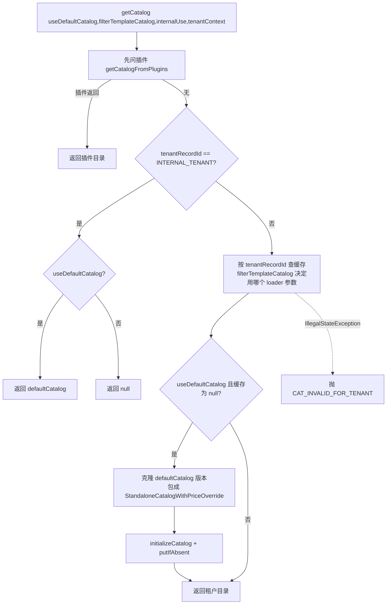
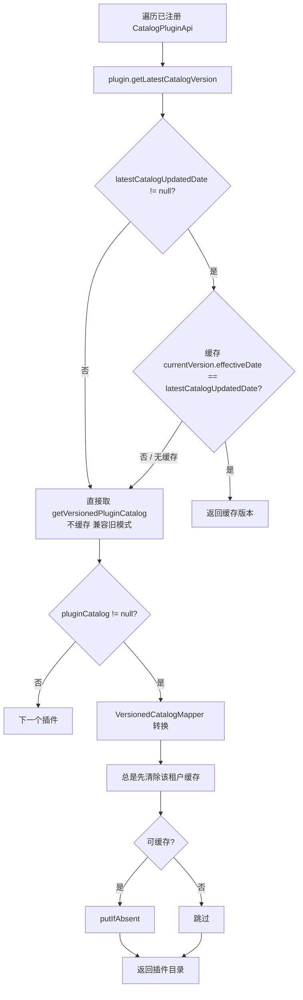
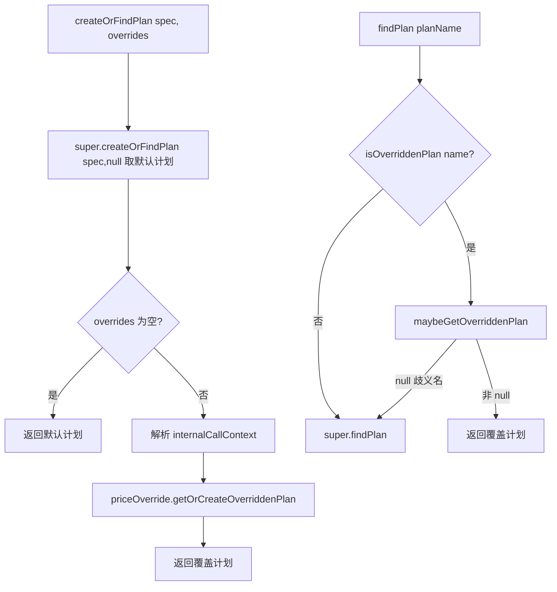

# Catalog 模块补充业务知识卡 (Kill Bill) — 枚举 / 校验 / 对齐 / 生效日

> 目标代码：`benchmark/killbill/catalog/src/main/java/org/killbill/billing/catalog/` 与 `.../src/main/resources/`
> 说明：本文件是对 `.bizdoc-kb2/cards/catalog.md` 的**补充**，只收录 kb2 未覆盖的精确枚举取值、校验条件、对齐/生效日/价格表/用量计价语义。
> 溯源路径相对 Kill Bill 仓库根。枚举定义位于外部 `killbill-api` 构件；此处只陈述在 catalog 源码中被实际引用到的取值，未在 catalog 源码出现的取值明确标注为推断（🟡）。

<!-- === CARDS START === -->

## TERM-C01 时长单位 TimeUnit 全枚举与 addToDateTime 映射

- **类型**: 术语
- **同义词**: 时长单位, 时间单位, 天, 周, 月, 年, 无限期, duration unit, TimeUnit, DAYS, WEEKS, MONTHS, YEARS, UNLIMITED
- **模块**: catalog
- **置信度**: 🟢 confirmed
- **溯源**: `catalog/src/main/java/org/killbill/billing/catalog/DefaultDuration.java:64-104`, `catalog/src/main/java/org/killbill/billing/catalog/DefaultDuration.java:106-123`

**枚举取值（5 个）**：`DAYS`（天）、`WEEKS`（周）、`MONTHS`（月）、`YEARS`（年）、`UNLIMITED`（无限期）。

**加日期映射**（`addToDateTime` / `addToLocalDate` 完全一致）：
- `DAYS` → `plusDays(number)`；`WEEKS` → `plusWeeks(number)`；`MONTHS` → `plusMonths(number)`；`YEARS` → `plusYears(number)`。
- `UNLIMITED`（或任何未列出的值，走 `default`）→ 抛 `CatalogApiException(CAT_UNDEFINED_DURATION)`。

**特例**：当 `number == null` 且 `unit != UNLIMITED` 时，`addToDateTime`/`addToLocalDate`/`toJodaPeriod` 直接返回原日期/空 Period（不报错）；`toJodaPeriod()` 对 `UNLIMITED` 抛 `IllegalStateException("Unexpected duration unit UNLIMITED")`。

**校验**：`UNLIMITED` 必须省略 `number`（-1），否则报 `Duration can only have 'UNLIMITED' unit if the number is omitted`；非 `UNLIMITED` 必须给出 `number`，否则报 `Finite Duration must have a well defined length`。

## TERM-C02 PhaseType 全枚举与「阶段名后缀」强耦合

- **类型**: 术语
- **同义词**: 阶段类型, 试用, 折扣, 固定期限, 常青, phase type, PhaseType, TRIAL, DISCOUNT, FIXEDTERM, EVERGREEN, 阶段名后缀
- **模块**: catalog
- **置信度**: 🟢 confirmed
- **溯源**: `catalog/src/main/java/org/killbill/billing/catalog/DefaultPlanPhase.java:104-115`, `catalog/src/main/java/org/killbill/billing/catalog/DefaultPlan.java:304-319`, `catalog/src/main/java/org/killbill/billing/catalog/StandaloneCatalog.java:290-310`

**枚举取值（4 个）**：`TRIAL`（试用）、`DISCOUNT`（折扣）、`FIXEDTERM`（固定期限）、`EVERGREEN`（常青/长期）。

**值 → 位置/时长合法矩阵**（由 `DefaultPlan.validate` + `StandaloneCatalog.validatePlanDuration` 共同决定）：
- `TRIAL`：可作初始阶段；**不得**作最终阶段；时长必须有限（非 UNLIMITED）。
- `DISCOUNT`：可作初始阶段；**不得**作最终阶段；时长必须有限。
- `FIXEDTERM`：可作初始或最终阶段；时长必须有限。
- `EVERGREEN`：**不得**作初始阶段；通常作最终阶段；时长**必须** `UNLIMITED`。

**命名耦合**：阶段名 = `planName + "-" + phaseType.toLowerCase()`；反解时按 `PhaseType.values()` 的**声明顺序**遍历，阶段名以某类型小写结尾即命中，截取 `length - type长度 - 1`。因此若计划名本身以 `trial/discount/fixedterm/evergreen` 结尾，反解会产生歧义（取 values() 顺序中第一个匹配者）。

## TERM-C03 计费周期 BillingPeriod 枚举（catalog 内可证取值）

- **类型**: 术语
- **同义词**: 计费周期, 收费频率, 月付, 季付, 年付, 无周期, billing period, BillingPeriod, NO_BILLING_PERIOD, MONTHLY
- **模块**: catalog
- **置信度**: 🟡 inferred
- **溯源**: `catalog/src/main/java/org/killbill/billing/catalog/DefaultPlan.java:234-237`, `catalog/src/main/java/org/killbill/billing/catalog/DefaultRecurring.java:90-111`, `catalog/src/main/resources/EmptyCatalog.xml:53-64`

**catalog 源码中实际引用到的取值**：
- `NO_BILLING_PERIOD`：无周期（纯用量/一次性计划）。`DefaultPlan.getRecurringBillingPeriod()` 在 finalPhase 无 recurring 时返回它。
- `MONTHLY`：在 `EmptyCatalog.xml` 的 `<billingPeriod>MONTHLY</billingPeriod>` 中作为合法值出现。

**推断取值（🟡，未在 catalog 源码出现，源自 killbill-api 外部构件）**：`DAILY`、`WEEKLY`、`MONTHLY`、`QUARTERLY`、`BIANNUAL`、`ANNUAL`、`NO_BILLING_PERIOD`。

**关键校验**：`DefaultRecurring` 要求「有 recurringPrice ⇒ billingPeriod 存在且 ≠ NO_BILLING_PERIOD」「无 recurringPrice ⇒ billingPeriod 必须是 NO_BILLING_PERIOD」，否则目录校验失败。

## TERM-C04 计费模式 BillingMode 枚举与「各模式必填结构」摘要

- **类型**: 术语
- **同义词**: 计费模式, 预付, 后付, 先付, billing mode, BillingMode, IN_ADVANCE, IN_ARREAR
- **模块**: catalog
- **置信度**: 🟢 confirmed
- **溯源**: `catalog/src/main/java/org/killbill/billing/catalog/DefaultUsage.java:212-229`, `catalog/src/main/java/org/killbill/billing/catalog/DefaultTier.java:147-159`

**枚举取值（2 个）**：`IN_ADVANCE`（先付/预付）、`IN_ARREAR`（后付/后付费）。

**在 usage 段的条件校验**（`DefaultUsage.validate`）：
- `IN_ADVANCE + CAPACITY` 且 `limits.length == 0` → 报 `Usage [IN_ADVANCE CAPACITY] section of phase ... needs to define some limits`。
- `IN_ADVANCE + CONSUMABLE` 且 `blocks.length == 0` → 报 `Usage [IN_ADVANCE CONSUMABLE] section of phase ... needs to define some blocks`。
- `IN_ARREAR` 且 `tiers.length == 0` → 报 `Usage [IN_ARREAR] section of phase ... needs to define some tiers`。

**在 tier 段的条件校验**（`DefaultTier.validate`，错误信息类名仍挂 `DefaultUsage`）：`IN_ARREAR + CAPACITY` 需 limits；`IN_ARREAR + CONSUMABLE` 需 blocks。

**继承**：计划的 `recurringBillingMode` 可缺省，initialize 时回退到目录级 `StandaloneCatalog.recurringBillingMode`。

## TERM-C05 用量类型 UsageType 枚举与语义

- **类型**: 术语
- **同义词**: 用量类型, 消耗型, 容量型, usage type, UsageType, CONSUMABLE, CAPACITY
- **模块**: catalog
- **置信度**: 🟢 confirmed
- **溯源**: `catalog/src/main/java/org/killbill/billing/catalog/DefaultUsage.java:212-229`, `catalog/src/main/java/org/killbill/billing/catalog/DefaultTier.java:147-159`

**枚举取值（2 个）**：
- `CAPACITY`（容量型）：按容量/上限计费。与 `IN_ADVANCE` 组合时必须提供 `limits`；与 `IN_ARREAR` 组合时 tier 必须提供 `limits`。
- `CONSUMABLE`（消耗型）：按累计使用量计费。与 `IN_ADVANCE` 组合时必须提供 `blocks`；与 `IN_ARREAR` 组合时 tier 必须提供 `blocks`。

**判定顺序**：`DefaultUsage.validate` 先做 billingMode/usageType 组合校验，再对 `limits` 与 `tiers` 递归 `validateCollection`；`DefaultTier.validate` 再做 tier 级别同组合校验。

## TERM-C06 块类型 BlockType 枚举与 minTopUpCredit 语义

- **类型**: 术语
- **同义词**: 块类型, 用量块类型, 充值块, 阶梯块, block type, BlockType, VANILLA, TOP_UP, TIERED, minTopUpCredit
- **模块**: catalog
- **置信度**: 🟢 confirmed
- **溯源**: `catalog/src/main/java/org/killbill/billing/catalog/DefaultBlock.java:49-50`, `catalog/src/main/java/org/killbill/billing/catalog/DefaultBlock.java:91-111`, `catalog/src/main/java/org/killbill/billing/catalog/DefaultTieredBlock.java:51-65`

**枚举取值（3 个）**：
- `VANILLA`：普通块，**缺省值**（`DefaultBlock.type` 初始即 `BlockType.VANILLA`，`CatalogSafetyInitializer` 对 null 也回填 VANILLA）。
- `TOP_UP`：充值块，必须定义 `minTopUpCredit`。
- `TIERED`：阶梯块，由 `DefaultTieredBlock` 固定返回（`getType()` 恒 `TIERED`，`setType` 被强制覆盖为 `TIERED`）。

**关键行为**：
- `DefaultBlock.validate`：`type == TOP_UP && !minTopUpCreditHasValue` → 报 `TOP_UP block needs to define minTopUpCredit for phase ...`；`type == null` → 抛 `IllegalStateException`（安全网）。
- `minTopUpCreditHasValue` 在 `initialize` 中确定：`minTopUpCredit != null && minTopUpCredit != -1`（-1 为「未设置」哨兵值）。
- 对**非** TOP_UP 块调用 `getMinTopUpCredit()` 会抛 `CatalogApiException(CAT_NOT_TOP_UP_BLOCK)`。

## TERM-C07 固定费类型 FixedType 枚举

- **类型**: 术语
- **同义词**: 固定费类型, 一次性费用, fixed type, FixedType, ONE_TIME
- **模块**: catalog
- **置信度**: 🟡 inferred
- **溯源**: `catalog/src/main/java/org/killbill/billing/catalog/DefaultFixed.java:41-45`, `catalog/src/main/java/org/killbill/billing/catalog/DefaultFixed.java:75-82`, `catalog/src/main/java/org/killbill/billing/catalog/CatalogSafetyInitializer.java:58-65`

**catalog 源码中实际引用到的取值**：
- `ONE_TIME`（一次性收费）：`Fixed.type` 的缺省值；`CatalogSafetyInitializer` 对 null 的 FixedType 字段回填 `FixedType.ONE_TIME`；`DefaultFixed.validate` 若 type 仍为 null 抛 `IllegalStateException("fixedPrice should have been automatically been initialized with ONE_TIME")`。

**推断**：FixedType 是 killbill-api 中的独立枚举（🟡）；catalog 源码未引用 `ONE_TIME` 之外的取值，故无法从本模块确认是否存在其它取值。

**价格载体**：固定费金额来自 `fixedPrice`（`InternationalPrice`，多币种）；固定费可为 null（阶段可不含 fixed）。

## TERM-C08 阶梯块策略 TierBlockPolicy 枚举

- **类型**: 术语
- **同义词**: 阶梯策略, 分层策略, 计费阶梯策略, tier block policy, TierBlockPolicy, ALL_TIERS
- **模块**: catalog
- **置信度**: 🟡 inferred
- **溯源**: `catalog/src/main/java/org/killbill/billing/catalog/DefaultUsage.java:71-72`, `catalog/src/main/java/org/killbill/billing/catalog/CatalogSafetyInitializer.java:63-65`

**catalog 源码中实际引用到的取值**：
- `ALL_TIERS`：`Usage.tierBlockPolicy` 的缺省值；`CatalogSafetyInitializer` 对 null 的 TierBlockPolicy 字段回填 `TierBlockPolicy.ALL_TIERS`。

**推断取值（🟡，未在 catalog 源码出现）**：`TOP_TIER`（只按最高到达阶梯计价）——kb2 TERM-014 依据 invoice 测试用例已列出，本卡不重复其证据，仅记录 catalog 侧缺省值为 `ALL_TIERS`。

**语义**：该策略仅在 `IN_ARREAR`（后付）用量定价、且存在多阶梯时生效；`TOP_TIER`/`ALL_TIERS` 的选择决定计价器如何跨阶梯累计用量。

## TERM-C09 BillingActionPolicy 全枚举（变更/取消策略）

- **类型**: 术语
- **同义词**: 计费动作策略, 变更策略, 取消策略, 立即, 期末, 期初, 禁止, billing action policy, BillingActionPolicy, IMMEDIATE, END_OF_TERM, START_OF_TERM, ILLEGAL
- **模块**: catalog
- **置信度**: 🟢 confirmed
- **溯源**: `catalog/src/main/java/org/killbill/billing/catalog/rules/DefaultPlanRules.java:131-176`, `catalog/src/main/java/org/killbill/billing/catalog/rules/DefaultCaseCancelPolicy.java:51-57`, `catalog/src/main/java/org/killbill/billing/catalog/CatalogUpdater.java:334-344`

**catalog 源码中实际引用到的取值（4 个）**：
- `IMMEDIATE`：立即生效。简化计划默认规则使用（`CatalogUpdater` 第 336/344 行），`EmptyCatalog.xml` 的 change/cancel 策略也是 IMMEDIATE。
- `END_OF_TERM`：期末生效。变更/取消规则未命中时的默认值（`DefaultPlanRules` 第 134/175 行）。
- `ILLEGAL`：禁止。变更策略解析为 ILLEGAL 时抛 `IllegalPlanChange`（第 157-159 行）。
- `START_OF_TERM`：期初生效。**默认目录中未实现**：`DefaultCaseCancelPolicy.validate` 明确报错 `Default catalog START_OF_TERM has not been implemented, such policy can be used during cancellation by overriding policy`。

**用途区分**：变更策略用 `DefaultCaseChange`（匹配 from/to 两组字段）；取消策略用 `DefaultCasePhase`（匹配 phaseType + product/category/period/priceList）。

## TERM-C10 计划对齐枚举 PlanAlignmentCreate / PlanAlignmentChange

- **类型**: 术语
- **同义词**: 计划创建对齐, 计划变更对齐, 计划生效对齐, plan alignment, PlanAlignmentCreate, PlanAlignmentChange, START_OF_BUNDLE
- **模块**: catalog
- **置信度**: 🟡 inferred
- **溯源**: `catalog/src/main/java/org/killbill/billing/catalog/rules/DefaultPlanRules.java:125-129`, `catalog/src/main/java/org/killbill/billing/catalog/rules/DefaultPlanRules.java:166-170`, `catalog/src/main/java/org/killbill/billing/catalog/CatalogUpdater.java:338-348`

**catalog 源码中实际引用到的取值**：`START_OF_BUNDLE`（在 bundle 起始日对齐）。
- 创建对齐：`getPlanCreateAlignment` 未命中规则 → 默认 `PlanAlignmentCreate.START_OF_BUNDLE`。
- 变更对齐：`getPlanChangeAlignment` 未命中规则 → 默认 `PlanAlignmentChange.START_OF_BUNDLE`。
- 简化计划默认规则同样使用 `START_OF_BUNDLE`。

**推断（🟡）**：这是两个**独立**枚举类型；catalog 源码只引用了 `START_OF_BUNDLE` 一个取值，是否存在其它取值（如 END_OF_BUNDLE / CHANGE_BACK）无法从本模块确定。

## TERM-C11 计费对齐 BillingAlignment 全枚举与回退

- **类型**: 术语
- **同义词**: 计费对齐, 账单日对齐, 账户对齐, 订阅对齐, bundle 对齐, billing alignment, BillingAlignment, ACCOUNT, SUBSCRIPTION, BUNDLE
- **模块**: catalog
- **置信度**: 🟡 inferred
- **溯源**: `catalog/src/main/java/org/killbill/billing/catalog/rules/DefaultPlanRules.java:137-141`, `catalog/src/main/java/org/killbill/billing/catalog/rules/DefaultCasePhase.java:43-49`, `catalog/src/main/java/org/killbill/billing/catalog/CatalogUpdater.java:350-352`

**catalog 源码中实际引用到的取值**：
- `ACCOUNT`（对齐账户 BCD）：`getBillingAlignment` 未命中规则时的默认值；简化计划默认规则也设为 `ACCOUNT`。

**推断取值（🟡，未在 catalog 源码出现，kb2 TERM-013 已据 util/invoice 证据列出）**：`SUBSCRIPTION`（对齐订阅自身起始日）、`BUNDLE`（对齐 bundle 内基础订阅 BCD）。

**规则匹配**：`DefaultCaseBillingAlignment` 继承 `DefaultCasePhase`，即按 `phaseType` + `product / productCategory / billingPeriod / priceList` 匹配；每个字段为 null 即通配，一组 case 按声明顺序**首个命中即返回**。

**已知回退**：当对齐为 ACCOUNT 但账户 BCD 尚未建立（=0）时，运行期回退到 SUBSCRIPTION（证据见 kb2 TERM-013/BR-032，本卡不重复）。

## TERM-C12 用量单位 Unit

- **类型**: 术语
- **同义词**: 用量单位, 计量单位, 单位, unit, Unit, DefaultUnit, usage unit
- **模块**: catalog
- **置信度**: 🟢 confirmed
- **溯源**: `catalog/src/main/java/org/killbill/billing/catalog/DefaultUnit.java:36-71`, `catalog/src/main/java/org/killbill/billing/catalog/StandaloneCatalog.java:79-81`

**含义**：`Unit` 是目录 `<units>` 下按 `@XmlID` 名称定义的计量单位（如 GB、minutes）。`DefaultUnit` 只有 `name` 与可缺省的 `prettyName`（缺省=name）。

**引用关系**：`Limit.unit`、`Block.unit`、`TieredBlock.unit` 都通过 `@XmlIDREF` 指向目录内的 `DefaultUnit`；因此单位必须先声明后引用。

**校验**：`DefaultUnit.validate` 为空实现（单位本身不校验）；单位是否被正确引用由 XML `@XmlIDREF` 解析阶段保证。

## TERM-C13 上架项 Listing

- **类型**: 术语
- **同义词**: 上架项, 可售清单, 列表项, listing, Listing, DefaultListing, 可购计划
- **模块**: catalog
- **置信度**: 🟢 confirmed
- **溯源**: `catalog/src/main/java/org/killbill/billing/catalog/DefaultListing.java:23-42`, `catalog/src/main/java/org/killbill/billing/catalog/StandaloneCatalog.java:339-382`

**含义**：`Listing` = `(Plan, PriceList)` 二元组，表示「某价格表下可售的某个计划」，是目录对外暴露的「可购买项」。

**产生方式（两种）**：
- `getAvailableBasePlanListings()`：遍历所有计划，仅取产品类别为 `BASE` 者，再在所有价格表中找同名同产品的计划，逐条生成 Listing。
- `getAvailableAddOnListings(baseProductName, priceListName)`：先取该基础产品的 `available` 集合，再对每个计费周期（遍历 `BillingPeriod.values()`）与每个价格表求 `priceList.findPlans(addon, billingPeriod)`；`priceListName` 为 null 时不过滤价格表。

**容错**：`getAvailableAddOnListings` 中若基础产品不存在（`findProduct` 抛异常），捕获后返回空列表。

## BR-C01 计划/产品/价格表/单位/用量名称的字符约束（XML ID / NCName）

- **类型**: 业务规则
- **同义词**: 命名规则, 名称约束, 非法字符, 冒号禁止, naming constraint, XML ID, NCName, plan name characters
- **模块**: catalog
- **置信度**: 🟢 confirmed
- **溯源**: `catalog/src/main/java/org/killbill/billing/catalog/caching/PriceOverridePattern.java:28-39`, `catalog/src/main/java/org/killbill/billing/catalog/DefaultPlan.java:65-67`, `catalog/src/main/java/org/killbill/billing/catalog/DefaultProduct.java:51-53`, `catalog/src/main/java/org/killbill/billing/catalog/DefaultPriceList.java:49-51`

**规则**：计划名（`DefaultPlan.name`）、产品名（`DefaultProduct.name`）、价格表名（`DefaultPriceList.name`）、单位名（`DefaultUnit.name`）、用量名（`DefaultUsage.name`）均标注 `@XmlAttribute + @XmlID`，因此必须符合 XML ID / NCName 语法——**不能以数字开头、不能含空格、不能含冒号 `:`** 等。

**直接证据**：`PriceOverridePattern` 注释明确「In order to not collide with any expected character from XML planName, we chose one character that is not allowed」并选取 `CUSTOM_PLAN_NAME_DELIMITER = ":"` 作为自定义计划名的分隔符——反证 `:` 不允许出现在 XML 计划名中。若计划名不符 NCName，XML 反序列化/校验阶段即失败。

**例外/补充**：`prettyName` 是普通字符串属性（`@XmlAttribute(required=false)`），不受 NCName 约束，可含空格与中文；缺省时回填为 `name`。

## BR-C02 同名条目在目录内「后写覆盖」而非报错（唯一性陷阱）

- **类型**: 业务规则
- **同义词**: 名称唯一性, 重复计划, 重复产品, 覆盖, duplicate name, name uniqueness, CatalogEntityCollection, last wins
- **模块**: catalog
- **置信度**: 🟢 confirmed
- **溯源**: `catalog/src/main/java/org/killbill/billing/catalog/CatalogEntityCollection.java:32-63`, `catalog/src/main/java/org/killbill/billing/catalog/CatalogEntityCollection.java:191-197`, `catalog/src/main/java/org/killbill/billing/catalog/StandaloneCatalog.java:83-95`

**规则**：目录内产品、计划、价格表计划列表都以 `CatalogEntityCollection`（底层 `TreeMap<String,T>`，key = `CatalogEntity.getName()`）存储。`addEntry` 使用 `data.put(name, entry)`，因此**同一目录内出现两个同名计划/产品时不会报错，后加入者静默覆盖前者**，且只保留一个条目。

**推论**：
- 计划名是事实上的主键；名称冲突的后果是「丢失一个计划」，而非校验失败。
- `findByName` 为 O(log N) 精确查找；`getEntries()` 返回按 name 自然排序的集合。
- 跨目录版本的同名计划另有「形状必须一致」校验（见 kb2 BR-020），但那发生在版本之间，不能防止单版本内重名覆盖。

**注意**：价格表集合（`PriceListSet`）本身**不做**子价格表重名校验，只有「不得用保留名 DEFAULT」这一条（见 kb2 BR-015）。

## BR-C03 规则匹配时输入字段的精确解析路径

- **类型**: 业务规则
- **同义词**: 规则匹配解析, case 匹配, planName 优先, plan specifier, rule matching, satisfiesCase
- **模块**: catalog
- **置信度**: 🟢 confirmed
- **溯源**: `catalog/src/main/java/org/killbill/billing/catalog/rules/DefaultCase.java:54-75`, `catalog/src/main/java/org/killbill/billing/catalog/rules/DefaultCaseChange.java:86-137`

**规则（单边 case，如创建对齐/计费对齐/取消策略）**：
- 若输入 `planName != null`：`findPlan(planName)`，由此取 `product`、`recurringBillingPeriod`、`product.getCategory()`、`plan.getPriceList()`。
- 否则：`findProduct(productName)` 取 category；`billingPeriod` 直接用输入值；**priceList 仅当 case 自身声明了 `priceList` 时才通过 `findPriceList(priceListName)` 解析，否则保持 null**（即 case 不指定价格表时，priceList 维度不参与匹配）。

**规则（变更 case，双边）**：对 `from` 与 `to` 各按上述逻辑分别解析出 product/category/billingPeriod/priceList，然后 `phaseType` 与 `from.phaseType`、8 个 from/to 字段逐一比对；任一非 null 字段不等即不匹配。

**返回**：`DefaultCase.getResult[...]` 按数组声明顺序遍历，**首个匹配即返回**（first-match wins）；全不匹配返回 null，由上层 `DefaultPlanRules` 套用默认值。

## BR-C04 价格表解析：显式指定 vs 继承（sticky）语义

- **类型**: 业务规则
- **同义词**: 价格表解析, 价格表继承, 粘性价格表, sticky price list, price list resolution, priceListCase, toPriceList
- **模块**: catalog
- **置信度**: 🟢 confirmed
- **溯源**: `catalog/src/main/java/org/killbill/billing/catalog/rules/DefaultPlanRules.java:143-185`, `catalog/src/main/java/org/killbill/billing/catalog/rules/DefaultCasePriceList.java:36-108`

**规则（变更计划时目标价格表如何确定）**：
1. 若目标 `to.priceListName != null` → 直接 `root.findPriceList(to.priceListName)`（显式指定，非粘性）。
2. 否则 → `findPriceList(from)`：
   a. 先跑 `priceListCase` 规则（`DefaultCasePriceList.getResult`），命中则用其 `toPriceList`（可把价格表切到促销表等，非粘性）。
   b. 规则未命中则回退：若 from 给了 `planName`，取 `findPlan(planName).getPriceList().getName()`；否则用 from 的 `priceListName`；再 `root.findPriceList(...)`。
3. 由此得到 `PlanChangeResult(toPriceList, policy, alignment)`。

**"sticky" 含义**：目标计划未显式声明价格表、且价格表规则未命中时，**沿用来源计划的价格表**——即价格表在变更时粘住（同一价格表内换计划）。若想换表，必须显式指定 `toPriceList` 或配置 `priceListCase`。

**补充**：当 `to.planName == null`（旧式按 product/billingPeriod 指定目标）时，会先用解析出的价格表重建一个 `toWithPriceList`，保证后续策略/对齐规则看到正确的价格表维度。

## BR-C05 BillingAlignment 三种对齐策略的精确计算目标

- **类型**: 业务规则
- **同义词**: 对齐语义, 对齐目标, 账户对齐, bundle 对齐, 订阅对齐, alignment semantics, ACCOUNT, BUNDLE, SUBSCRIPTION
- **模块**: catalog
- **置信度**: 🟢 confirmed
- **溯源**: `util/src/main/java/org/killbill/billing/util/bcd/BillCycleDayCalculator.java:50-72`, `util/src/main/java/org/killbill/billing/util/bcd/BillCycleDayCalculator.java:122-139`

**三种对齐各自「对齐到什么」**：
- `ACCOUNT`：BCD 直接取**账户级 BCD**（`accountBillCycleDayLocal`）。计算时用 `Preconditions.checkState(accountBillCycleDayLocal != 0)` 强制要求账户 BCD 已建立，否则抛异常。
- `BUNDLE`：BCD 取**该 bundle 内 base subscription** 的 BCD（`calculateOrRetrieveBcdFromSubscription(baseSubscription, ...)`），即 add-on 跟随基础订阅。
- `SUBSCRIPTION`：BCD 取**该订阅自身**的 BCD，由 `subscription.getDateOfFirstRecurringNonZeroCharge()` 的当月日号决定。

**回退**：`resolveEffectiveBillingAlignment(ACCOUNT, accountBCD==0)` 返回 `SUBSCRIPTION`，用于账户 BCD 尚未建立的过渡期。

**对阶段/add-on 的影响**：add-on 若配置 `BUNDLE` 对齐则锚定基础订阅的 BCD（与其自身起订日无关）；`SUBSCRIPTION` 对齐则即使挂在同一账户也各自出账；`ACCOUNT` 对齐使同一账户的所有订阅统一到同一账单日。BCD 结果按订阅 id 缓存（`calculateOrRetrieveBcdFromSubscription`）。

## BR-C06 BCD 对齐仅对「月/年」周期生效及跨月推进

- **类型**: 业务规则
- **同义词**: 月基周期, 账单日推进, 跨月对齐, month-based period, alignToNextBillCycleDate, NO_BILLING_PERIOD
- **模块**: catalog
- **置信度**: 🟢 confirmed
- **溯源**: `util/src/main/java/org/killbill/billing/util/bcd/BillCycleDayCalculator.java:74-116`

**规则**：
- **月基判定**：`isMonthBased = (period.getMonths() | period.getYears()) > 0`。因此只有 MONTHLY / QUARTERLY / BIANNUAL / ANNUAL 视为月基；DAILY/WEEKLY 不是。
- **NO_BILLING_PERIOD 短路**：`alignToNextBillCycleDate` 遇到 `NO_BILLING_PERIOD` 直接返回当前转换日期，不做任何对齐。
- **非月基**：从上次转换日按周期反复加，直到 `>= curTransitionDate`（不按「日号」对齐）。
- **月基**：若当前转换日的日号 > BCD，则先 `plusMonths(1)` 再对齐；否则直接对齐。对齐函数 `alignProposedBillCycleDate` 在 `billingCycleDay > 当月最大天数` 时取**当月最后一天**。

**用途**：该逻辑驱动「订阅起始日 → 实际出账日」的推进，进而决定首次账单日。

## BR-C07 两个生效日期字段的分工：目录版本 vs 存量订阅

- **类型**: 业务规则
- **同义词**: 生效日期, 目录生效日, 存量订阅生效日, effective date, effectiveDateForExistingSubscriptions, deferred effective date, 新订阅, 存量订阅
- **模块**: catalog
- **置信度**: 🟢 confirmed
- **溯源**: `catalog/src/main/java/org/killbill/billing/catalog/DefaultPlan.java:69-73`, `catalog/src/main/java/org/killbill/billing/catalog/DefaultPlan.java:285-293`, `subscription/src/main/java/org/killbill/billing/subscription/catalog/SubscriptionCatalog.java:176-213`, `subscription/src/main/java/org/killbill/billing/subscription/api/user/DefaultSubscriptionBase.java:696-724`

**两个日期字段**：
- `StandaloneCatalog.effectiveDate`（目录版本级）：决定「某日期查询时选哪个目录版本」。查询日期 ≥ 版本生效日时该版本对新订阅立即生效（对已有订阅是否切换则另看下面的字段）。
- `DefaultPlan.effectiveDateForExistingSubscriptions`（计划级，可空）：决定「新版目录中的该计划何时对**存量订阅**生效」（延迟生效/deferred）。

**精确语义（跨 catalog + subscription 两模块才能读懂）**：
- 选取版本时（`SubscriptionCatalog`）：从最新版本往回找，若命中版本比订阅变更日新，则视为「存量订阅」；此时只有当 `plan.getEffectiveDateForExistingSubscriptions() != null` **且** `requestedDate >= existingSubscriptionDate` 才用新版本计划。**该字段为 null 时，目录的任何改动都不会应用到存量订阅**（源码注释原文：`If it is null, any change to this catalog does not apply to existing subscriptions`）。
- 构建计费事件时（`DefaultSubscriptionBase`）：从当前计划出发迭代 `getNextPlanVersion`，对每个 `effectiveDateForExistingSubscriptions != null` 的后续版本生成一条 `CHANGE` 计费转换事件（可再按配置对齐到下一个 BCD）。
- 若字段 **不是 null 但早于目录 effectiveDate**，目录校验直接失败：`Price effective date %s is before catalog effective date '%s'`。

**推论**：新订阅按目录版本 effectiveDate 选取版本；存量订阅的切换由计划级 effectiveDateForExistingSubscriptions 控制，缺省（null）表示「不追溯存量」。

## BR-C08 目录版本按日期选取的精确索引算法（含容错）

- **类型**: 业务规则
- **同义词**: 版本选择, 版本索引, 目录查询日期, catalog version for date, indexOfVersionForDate
- **模块**: catalog
- **置信度**: 🟢 confirmed
- **溯源**: `catalog/src/main/java/org/killbill/billing/catalog/DefaultVersionedCatalog.java:87-107`, `catalog/src/main/java/org/killbill/billing/catalog/DefaultVersionedCatalog.java:109-120`

**规则**：
- 版本列表在 `add()` 时按 `effectiveDate` **升序排序**。
- `indexOfVersionForDate(date)`：从 `versions.size()-1` 递减，返回第一个 `effectiveDate.getTime() <= date.getTime()` 的索引；即「生效日 ≤ 查询日期的**最新**版本」。
- **容错**：若所有版本都晚于查询日期，返回索引 0（最早版本）。源码注释说明这是为了规避时间操控导致的「早于任何目录版本」状态（见 issue #760），并非严格语义。
- 版本为空时抛 `IllegalStateException("No existing versions in the VersionedCatalog catalog for input date ...")`。

**注意**：该方法此前先把入参通过 `CatalogDateHelper.toUTCDateTime(date)` 归一化为 UTC。

## TERM-C14 用量块 Block 与阶梯块 TieredBlock

- **类型**: 术语
- **同义词**: 用量块, 计价块, 块大小, 块价, 阶梯块, block, Block, TieredBlock, block size, block price
- **模块**: catalog
- **置信度**: 🟢 confirmed
- **溯源**: `catalog/src/main/java/org/killbill/billing/catalog/DefaultBlock.java:47-97`, `catalog/src/main/java/org/killbill/billing/catalog/DefaultTieredBlock.java:35-71`

**Block 字段与含义**：
- `type`（BlockType，缺省 VANILLA）、`unit`（@XmlIDREF 指向 Unit）、`size`（每块包含的单位数，必填 BigDecimal）、`prices`（该块的价格，InternationalPrice，必填）、`minTopUpCredit`（仅 TOP_UP 用，缺省 -1 表示未设置）。

**TieredBlock**：继承 Block，额外有 `max`（该阶梯的最大用量，必填 BigDecimal）；`type` 恒为 `TIERED`（构造与 `setType` 都强制覆盖）。

**计价模型**：用量按 `size` 归组成块，每块按 `prices`（多币种）计价；`max` 划定该阶梯覆盖的用量上界。`minTopUpCredit` 仅用于充值块，表示最低充值额度。

## TERM-C15 阶梯 Tier 的组成

- **类型**: 术语
- **同义词**: 阶梯, 分层, 阶梯定价, 阶梯块列表, tier, Tier, DefaultTier, tieredBlock
- **模块**: catalog
- **置信度**: 🟢 confirmed
- **溯源**: `catalog/src/main/java/org/killbill/billing/catalog/DefaultTier.java:44-171`

**含义**：`Tier` 是 usage 定价在一个区间内的完整定义，由 `limits[]`（该阶梯适用区间的上下限）、`blocks[]`（`tieredBlock` 列表）、以及可选的**整段** `fixedPrice` / `recurringPrice`（对整段打包计价）组成。

**与 usage 的关系**：`Usage.tiers[]` 承载阶梯；`IN_ARREAR` 的 usage 必须至少有一个 tier（见 TERM-C04）。`billingMode` 与 `usageType` 不在 XML 中声明，而是由所属 usage 在 `initialize`/`setPhase` 时注入到 tier（`DefaultTier` 的 `billingMode`/`usageType`/`phase` 均标注为「Not defined in catalog」）。

**校验**：`DefaultTier.validate` 在 `IN_ARREAR+CAPACITY` 且 limits 为空、或 `IN_ARREAR+CONSUMABLE` 且 blocks 为空时报错（错误信息挂在 `DefaultUsage` 上）。

## BR-C09 usage/tier 级「整段打包价」fixedPrice / recurringPrice

- **类型**: 业务规则
- **同义词**: 整段价格, 打包价, usage 固定价, usage 周期价, bundled usage price, usage fixedPrice, usage recurringPrice
- **模块**: catalog
- **置信度**: 🟢 confirmed
- **溯源**: `catalog/src/main/java/org/killbill/billing/catalog/DefaultUsage.java:89-95`, `catalog/src/main/java/org/killbill/billing/catalog/DefaultTier.java:54-61`

**规则**：`Usage` 与 `Tier` 都可选地携带 `fixedPrice` / `recurringPrice`（均为 `InternationalPrice`）。源码注释：用于「把若干 limits/blocks 的单位打包成一个整段价格」——即不逐块计价，而是对整个用量段收一次性/周期性费用。

**关系**：这是与 `blocks/tiers` 逐块计价并存的第二种计费形态；两者可同时声明，具体取用由计价器按上下文决定。缺省（无该字段）表示不做整段计费。

## BR-C10 DefaultLimit 的 -1 哨兵与 compliesWith 判定细节

- **类型**: 业务规则
- **同义词**: 用量限制, 上下限哨兵, limit 判定, -1 未设置, min max limit, compliesWith
- **模块**: catalog
- **置信度**: 🟢 confirmed
- **溯源**: `catalog/src/main/java/org/killbill/billing/catalog/DefaultLimit.java:54-105`

**规则**：
- **哨兵值**：`initialize` 时 `maxHasValue = max != null && max != -1`；`minHasValue = min != null && min != -1`。因此缺省/未写即被 `CatalogSafetyInitializer` 填为 -1，等价于「未设置」。
- **校验**：仅当 `maxHasValue && minHasValue && max < min` 时报 `max must be greater than min`。
- **判定 `compliesWith(value)`**：
  1. `maxHasValue && value > max` → 返回 false；
  2. 否则返回 `!minHasValue || value <= min`，即「无 min 限制则通过；有 min 时要求 value ≤ min 才通过」。
- **注意（源码语义疑点）**：`min` 分支用 `value <= min`，意味着 value 大于 min 时反而**不通过**，与直觉的「下限」相反；使用时需结合业务/官方文档确认（kb2 BR-011 已标注该疑点，本卡补充哨兵值判定细节）。

## BR-C11 CatalogSafetyInitializer：缺省值注入规则

- **类型**: 业务规则
- **同义词**: 缺省值注入, 安全初始化, 反序列化默认值, safety initializer, default value, -1, zero length array
- **模块**: catalog
- **置信度**: 🟢 confirmed
- **溯源**: `catalog/src/main/java/org/killbill/billing/catalog/CatalogSafetyInitializer.java:36-78`, `catalog/src/main/java/org/killbill/billing/catalog/CatalogSafetyInitializer.java:80-117`

**规则**：目录对象在 `initialize` 阶段对所有**非必填**（对应 XML 注解 `required=false` 或无 required）字段注入缺省值（仅当当前为 null）：
- 数组 → 零长度数组（可安全 `length`/遍历）。
- `Integer` → `-1`；`Double` → `-1.0`；`BigDecimal` → `-1`。
- 枚举：`FixedType` → `ONE_TIME`；`BlockType` → `VANILLA`；`TierBlockPolicy` → `ALL_TIERS`。

**注意**：
- 只处理 XML 注解标记为非必填的数组字段；必填数组（`required=true`）不注入，保持 null 交由校验报错。
- 枚举只对上述三种做回填；其它枚举（如 ProductCategory、PhaseType）为 null 时不会被自动补值，需依赖 XML 必填属性或各自 validate 的「Safety check」。

## ENT-C01 目录实体集合（按名索引 + 排序）

- **类型**: 业务实体
- **同义词**: 目录实体集合, 名称索引, catalog entity collection, CatalogEntityCollection, TreeMap
- **模块**: catalog
- **置信度**: 🟢 confirmed
- **溯源**: `catalog/src/main/java/org/killbill/billing/catalog/CatalogEntityCollection.java:32-63`, `catalog/src/main/java/org/killbill/billing/catalog/CatalogEntityCollection.java:191-197`

**说明**：`CatalogEntityCollection<T extends CatalogEntity>` 是目录内产品/计划/价格表的通用容器，底层 `TreeMap<String,T>`，key 为实体 `getName()`。

**关键行为**：
- `addEntry` = `data.put(name, entry)`：同名**覆盖**（见 BR-C02）。
- `findByName` 精确查找；`getEntries()`/迭代器按 name 自然序返回。
- `contains`/`containsAll` 以 name 判等价；`retainAll` 抛 `IllegalStateException("Not implemented")`。
- 可序列化（`writeExternal` 直接写整个 map）。

## ENT-C02 可变目录（简化计划写模型）

- **类型**: 业务实体
- **同义词**: 可变目录, 可编辑目录, mutable catalog, DefaultMutableStaticCatalog, MutableStaticCatalog
- **模块**: catalog
- **置信度**: 🟢 confirmed
- **溯源**: `catalog/src/main/java/org/killbill/billing/catalog/DefaultMutableStaticCatalog.java:32-122`

**说明**：`DefaultMutableStaticCatalog extends StandaloneCatalog`，是 `CatalogUpdater` 写入简化计划时的可变视图（拷贝构造会克隆名称/模式/日期/币种/单位/产品/计划/规则/价格表并重新 initialize）。

**变更能力**：
- `addCurrency(currency)`：把币种追加到 `supportedCurrencies`。
- `addProduct(product)` / `addPlan(plan)`：加入产品集合 / 计划集合，并把计划登记进其价格表的计划列表。
- `addPriceList(priceList)`：重建 child price list 数组。
- `addRecurringPriceToPlan(price, newPrice)`：为计划周期价追加一个币种价格。
- `addProductAvailableAO(base, ao)`：把 add-on 加入基础产品的 `available`。

**约束**：`allocateNewEntries` 在新增项与既有项同名/同币种（按 CatalogEntity.name、Enum.name 或 Price.currency 判重）时抛 `IllegalStateException("Already existing ...")`——即**不允许重复添加**同一币种/价格表/枚举项。

## ENT-C03 价格覆盖计划的命名规则与缓存键

- **类型**: 业务实体
- **同义词**: 覆盖计划命名, 自定义计划名, price override plan name, PriceOverridePattern, dryrun plan, 计划名分隔符
- **模块**: catalog
- **置信度**: 🟢 confirmed
- **溯源**: `catalog/src/main/java/org/killbill/billing/catalog/caching/PriceOverridePattern.java:26-63`, `catalog/src/main/java/org/killbill/billing/catalog/override/DefaultPriceOverrideSvc.java:121-134`, `catalog/src/main/java/org/killbill/billing/catalog/caching/DefaultOverriddenPlanCache.java:100-102`

**命名规则**：
- 覆盖计划名 = `父计划名 + 分隔符 + 记录号`。分隔符由 `useRECXMLNamesCompliant` 决定：compliant 模式用 `:`（`CUSTOM_PLAN_NAME_DELIMITER`，因其不允许出现在 XML 计划名中），否则用 `-`（`LEGACY_CUSTOM_PLAN_NAME_DELIMITER`）。
- 识别正则：`(.*)<分隔符>(\d+)(?:!\d+)?$`。`isOverriddenPlan(name)` 命中即认为是覆盖计划；`getPlanParts` 不匹配时抛 `CatalogApiException(CAT_NO_SUCH_PLAN)`。
- 持久化路径：`DefaultPriceOverrideSvc` 在 context 非空时生成 `parentPlan-<recordId>`（第 124 行）；dry-run 时生成 `parentPlan-dryrun-<自增序号>`（第 126 行）。
- 缓存键：`planName!<catalogEffectiveDateMillis>`（`DefaultOverriddenPlanCache` 第 101 行），确保覆盖计划不跨目录版本串用。

**注意**：加载路径 `getPlanName(parts)` 用配置的分隔符重新拼接，识别路径 `isOverriddenPlan` 用同一正则；若历史数据用了与当前配置不一致的分隔符，可能识别失败。

## BR-C12 价格覆盖的前置约束（被覆盖阶段必须已存在对应计费项）

- **类型**: 业务规则
- **同义词**: 价格覆盖校验, 覆盖前置条件, invalid price override, fixed 覆盖, recurring 覆盖, usage 覆盖
- **模块**: catalog
- **置信度**: 🟢 confirmed
- **溯源**: `catalog/src/main/java/org/killbill/billing/catalog/override/DefaultPriceOverrideSvc.java:76-119`, `catalog/src/main/java/org/killbill/billing/catalog/override/DefaultPriceOverrideSvc.java:137-207`

**规则**：
- 解析阶段级覆盖：优先按 `phaseName` 精确匹配阶段；若未给 `phaseName`，则按 `phaseType` 匹配（源码注释明确：同类型多阶段时此推断会失败）。
- **硬约束**：若某阶段原本 `getFixed() == null` 但覆盖里给了 `fixedPrice` → 抛 `CatalogApiException(CAT_INVALID_INVALID_PRICE_OVERRIDE, "There is no existing fixed price for the phase ...")`；`recurring` 同理（`There is no existing recurring price for the phase ...`）。即**只能覆盖已存在的计费项价格，不能凭覆盖凭空新增计费项**。
- usage 覆盖：按 usage `name` 匹配；tier 覆盖：按 `unit 名称 + size + max` 三元组匹配；tiered block 覆盖：同样按 `unitName + size + max` 匹配（`TieredBlock` 定位到具体块）。

**结果**：`getOrCreateOverriddenPlan` 把每个阶段的覆盖归位成与 `getAllPhases()` 等长的数组（无覆盖处为 null），再构造覆盖计划。

## ENT-C04 InternationalPrice 的覆盖构造语义（逐币种替换）

- **类型**: 业务实体
- **同义词**: 多币种价格, 覆盖替换, 保留未覆盖币种, international price override, per-currency override
- **模块**: catalog
- **置信度**: 🟢 confirmed
- **溯源**: `catalog/src/main/java/org/killbill/billing/catalog/DefaultInternationalPrice.java:55-100`, `catalog/src/main/java/org/killbill/billing/catalog/DefaultInternationalPrice.java:138-156`

**覆盖构造规则**：
- `DefaultInternationalPrice(in, override, fixed)`：若原价格**没有任何 price**（`prices.length == 0`），则新建**仅含覆盖币种**的一条价格（值取 fixed 或 recurring 覆盖价）。
- 若原有 price 列表非空，则**仅替换币种匹配的那一条**，其它币种原样保留。
- `DefaultInternationalPrice(in, overriddenPrice, currency)`（块价覆盖）同理：逐条替换匹配币种，其余保留。

**取值**：
- `getPrice(currency)`：`prices.length == 0` → 返回 `BigDecimal.ZERO`（视为所有币种零价）；有列表但无该币种 → 抛 `CAT_NO_PRICE_FOR_CURRENCY`。
- `isZero()`：遍历所有 price，只要存在某币种值 ≠ 0 即 false；`CurrencyValueNull`（value 为 null）按 0 处理。

## BR-C13 简化计划描述符的精确校验条件

- **类型**: 业务规则
- **同义词**: 简化计划校验, simple plan validation, 描述符校验, planId 必填, amount 校验, currency 校验
- **模块**: catalog
- **置信度**: 🟢 confirmed
- **溯源**: `catalog/src/main/java/org/killbill/billing/catalog/CatalogUpdater.java:119-131`, `catalog/src/main/java/org/killbill/billing/catalog/CatalogUpdater.java:296-314`

**规则（`validateNewPlanDescriptor`）**：
- `invalidPlan = desc.getPlanId() == null && (desc.getProductCategory() == null || desc.getBillingPeriod() == null)`。
- `invalidPrice = (desc.getAmount() == null || desc.getAmount().compareTo(BigDecimal.ZERO) < 0) || desc.getCurrency() == null`。
- 任一为真 → 抛 `CatalogApiException(CAT_INVALID_SIMPLE_PLAN_DESCRIPTOR, INVALID_PRICE)`（`INVALID_PRICE` 文案：`Please check amount and currency. Amount should be greater than 0 and currency should be valid.`）。

**入口级校验（`addSimplePlanDescriptor`）**：
- `desc == null || desc.getPlanId() == null` → 抛 `CAT_INVALID_SIMPLE_PLAN_DESCRIPTOR, INVALID_PLAN`（`Plan is invalid. Please check.`）。
- 计划不存在且 `desc.getProductName() == null` → 抛 `CAT_INVALID_SIMPLE_PLAN_DESCRIPTOR, INVALID_PRODUCT_NAME`。

**金额边界**：判断用 `< 0`，因此 `amount == 0` 是**允许**的（与文案「greater than 0」不一致，注意区分）。

## BR-C14 简化计划：新增币种时重置固定价、recurringPrice 空数组语义、EVERGREEN 兜底

- **类型**: 业务规则
- **同义词**: 新增币种重置, 零价重置, 空价格数组, evergreen 兜底, simple plan currency
- **模块**: catalog
- **置信度**: 🟢 confirmed
- **溯源**: `catalog/src/main/java/org/killbill/billing/catalog/CatalogUpdater.java:164-193`, `catalog/src/main/java/org/killbill/billing/catalog/DefaultInternationalPrice.java:88-100`

**规则**：
- 若描述符币种**不在**目录 `supportedCurrencies`：先 `catalog.addCurrency(currency)`；并且当计划恰有 1 个初始阶段时，把该阶段固定价的 `prices` **置为 null**——目的是让后续 `isZero()` 逻辑「穿过新币种并为其设置零价」（源码注释：`Reset the fixed price to null so the isZero() logic goes through new currencies and set the zero price for all`）。
- 若计划**没有 finalPhase**：新建一个 `EVERGREEN` finalPhase，`duration.unit = UNLIMITED`。
- 若 finalPhase **没有 recurring**：新建 recurring，`billingPeriod = desc.billingPeriod`，`recurringPrice` 用**空价数组** `new DefaultPrice[0]`。
- 若 recurring 的价不含描述符币种：追加一条该币种的价格（值 = desc.amount）。
- **空数组语义**：`InternationalPrice` 在无任何 price 时对所有币种返回 `BigDecimal.ZERO`；一旦存在列表但缺某币种，则抛 `CAT_NO_PRICE_FOR_CURRENCY`。因此「先建空数组再补币种」是确保未补币种视为零价、而非报错。

## BR-C15 ADD_ON 的 availableBaseProducts 校验与 available 列表注入

- **类型**: 业务规则
- **同义词**: 附加产品可用基础产品, add-on base product, availableBaseProducts, 基础产品可用列表
- **模块**: catalog
- **置信度**: 🟢 confirmed
- **溯源**: `catalog/src/main/java/org/killbill/billing/catalog/CatalogUpdater.java:195-209`, `catalog/src/main/java/org/killbill/billing/catalog/CatalogUpdater.java:304-313`

**规则**：
- 类别为 `ADD_ON` 时，`availableBaseProducts` 不得为 null 或空，否则抛 `CAT_INVALID_SIMPLE_PLAN_DESCRIPTOR, BASE_PLAN_PRODUCTS_NOT_EMPTY`（`List of available base products should not be empty for add-ons.`）。
- 其中每个产品名必须已存在于目录，否则抛 `CAT_INVALID_SIMPLE_PLAN_DESCRIPTOR, EXISTING_PRODUCTS_NOT_EMPTY`（`Available base products contain invalid product.Please check.`）。
- 通过后，对每个基础产品，若其 `available` 列表尚不含该 add-on，则调用 `catalog.addProductAvailableAO(base, product)` 追加（做存在性去重）。

**与查询的关系**：运行期 `getAvailableAddOnListings(baseProductName, priceListName)` 正是遍历该基础产品的 `available` 集合来生成可售 add-on 列表。

## BR-C16 PriceList.findPlans 的匹配语义（产品相等 + 周期相等）

- **类型**: 业务规则
- **同义词**: 找计划, 价格表内查找, findPlans, 产品匹配, 周期匹配, plan lookup
- **模块**: catalog
- **置信度**: 🟢 confirmed
- **溯源**: `catalog/src/main/java/org/killbill/billing/catalog/DefaultPriceList.java:94-108`, `catalog/src/main/java/org/killbill/billing/catalog/DefaultProduct.java:257-287`, `catalog/src/main/java/org/killbill/billing/catalog/DefaultPlan.java:234-237`

**规则**：`PriceList.findPlans(product, period)` 遍历该价格表内的计划，返回同时满足：
1. `cur.getProduct().equals(product)`——`Product` 相等性由 `DefaultProduct.equals` 定义，比较 `name`、`category`、`included`/`available`（经 getter，已过滤自引用）、`limits`、`catalogName`；
2. `cur.getRecurringBillingPeriod() != null && cur.getRecurringBillingPeriod().equals(period)`——计划的周期取自 **finalPhase 的 recurring**。

**推论**：纯用量/一次性计划（finalPhase 无 recurring）的 `getRecurringBillingPeriod()` 返回 `NO_BILLING_PERIOD`，只能用 `period = NO_BILLING_PERIOD` 才能查到；产品的 included/available/limits 任一不同即视为不同产品而不匹配。

## BR-C17 DefaultProduct.isAvailable() 的实现缺陷（误查 included 列表）

- **类型**: 业务规则
- **同义词**: available 判定缺陷, isAvailable bug, 产品可用性, available product
- **模块**: catalog
- **置信度**: 🟢 confirmed
- **溯源**: `catalog/src/main/java/org/killbill/billing/catalog/DefaultProduct.java:133-149`

**规则/事实**：`isAvailable(addon)` 的实现遍历的是 `included.getEntries()`（而非 `available.getEntries()`）来判断 addon 是否「可用」——与 `isIncluded` 逻辑完全相同，属实现缺陷。因此该方法对「仅在 available、不在 included」的 add-on 会返回 false。

**影响**：这是遗留代码（`getIncluded`/`getAvailable` 另有自引用过滤的 workaround），关键路径（Listing 生成、简化计划校验）均直接访问集合本身，未依赖 `isAvailable`；但任何调用 `isAvailable` 的判断都可能得到错误结果，需注意。

## BR-C18 运行期对自引用产品的过滤

- **类型**: 业务规则
- **同义词**: 自引用过滤, self reference filter, included 过滤, available 过滤
- **模块**: catalog
- **置信度**: 🟢 confirmed
- **溯源**: `catalog/src/main/java/org/killbill/billing/catalog/DefaultProduct.java:88-103`, `catalog/src/main/java/org/killbill/billing/catalog/DefaultProduct.java:187-208`

**规则**：
- 运行期 `getIncluded()` 与 `getAvailable()` 都会用 `filter(c -> c != this)` 剔除指向自身的条目（源码注释：为兼容历史上含自引用的目录）。
- 但**校验期**（`validate`）仍会对 `included`/`available` 中的自引用报 `Product refers to itself in included section` / `... available section`，除非系统属性 `org.killbill.catalog.validation.ignoreSelfReferencingProducts=true`（静态常量在类加载时读取）。

**差异**：`validate` 遍历的是原始集合（含自引用），`getter` 返回过滤后的视图——因此「能加载」不代表「校验通过」。

## BR-C19 计划默认价格表的自动解析顺序

- **类型**: 业务规则
- **同义词**: 计划价格表解析, findPriceListForPlan, 计划归属价格表, default price list resolution
- **模块**: catalog
- **置信度**: 🟢 confirmed
- **溯源**: `catalog/src/main/java/org/killbill/billing/catalog/DefaultPlan.java:276-283`, `catalog/src/main/java/org/killbill/billing/catalog/DefaultPlan.java:404-412`, `catalog/src/main/java/org/killbill/billing/catalog/DefaultPriceListSet.java:140-148`

**规则**：
- `DefaultPlan.initialize`：`priceListName = (显式声明 != null) ? 显式值 : findPriceListForPlan(catalog)`。
- `findPriceListForPlan` 遍历 `catalog.getPriceLists().getAllPriceLists()`，返回**第一个** `findPlan(planName) != null` 的价格表名称；全都不含该计划则抛 `IllegalStateException("Cannot extract pricelist for plan <name>")`。
- `getAllPriceLists()` 的返回顺序是：**默认价格表在前，子价格表按声明顺序在后**。

**推论**：未显式归属的计划若同时出现在默认表与子表，会被归到**默认价格表**（先命中）。同一计划出现在多个表是允许的，但自动归属只认第一个。

## BR-C20 模板目录的判定条件

- **类型**: 业务规则
- **同义词**: 模板目录, 空目录, template catalog, isTemplateCatalog, filterTemplateCatalog
- **模块**: catalog
- **置信度**: 🟢 confirmed
- **溯源**: `catalog/src/main/java/org/killbill/billing/catalog/StandaloneCatalog.java:174-178`, `catalog/src/main/java/org/killbill/billing/catalog/io/VersionedCatalogLoader.java:124-146`

**规则**：`isTemplateCatalog()` 当且仅当**三者同时为空**才返回 true：
- `products == null || products.isEmpty()`，
- `plans == null || plans.isEmpty()`，
- `supportedCurrencies == null || supportedCurrencies.length == 0`。

**用途**：目录加载时若 `filterTemplateCatalog=true`，模板目录会被**跳过**（不加入 VersionedCatalog）；默认目录加载路径不会过滤。

## BR-C21 findPhase 依赖「阶段名反解出计划名」的查找链

- **类型**: 业务规则
- **同义词**: 查阶段, 阶段查找, findPhase, 反解计划名, phase lookup
- **模块**: catalog
- **置信度**: 🟢 confirmed
- **溯源**: `catalog/src/main/java/org/killbill/billing/catalog/StandaloneCatalog.java:261-269`, `catalog/src/main/java/org/killbill/billing/catalog/DefaultPlanPhase.java:108-115`

**规则**：`StandaloneCatalog.findPhase(name)`：
1. 若 `name == null || plans == null` → 抛 `CAT_NO_SUCH_PHASE`。
2. 用 `DefaultPlanPhase.planName(name)` 从阶段名反解出计划名（按 PhaseType.values() 顺序匹配后缀）。
3. `findPlan(planName)` 找计划；计划不存在抛 `CAT_NO_SUCH_PLAN`。
4. `plan.findPhase(name)` 在计划内线性查找同名阶段；找不到抛 `CAT_NO_SUCH_PHASE`。

**推论**：阶段名本身不独立存储，必须先能反解出计划名；若阶段名后缀不匹配任何 PhaseType，在步骤 2 即抛 `CAT_BAD_PHASE_NAME`。

## BR-C22 简化计划「更新已有计划」的精确校验（validateExistingPlan）

- **类型**: 业务规则
- **同义词**: 已有计划校验, simple plan update, validateExistingPlan, trial 一致性, evergreen 校验
- **模块**: catalog
- **置信度**: 🟢 confirmed
- **溯源**: `catalog/src/main/java/org/killbill/billing/catalog/CatalogUpdater.java:227-283`

**规则（任一不满足即抛 `CAT_FAILED_SIMPLE_PLAN_VALIDATION`）**：
- **TRIAL 结构**：`initialPhases.length > 1`，或 `length == 1` 但 `(phaseType != TRIAL || !fixed.getPrice().isZero())` → 失败。即只允许「无起始阶段」或「单个 $0 TRIAL」。
- **TRIAL 一致性**（当描述符带 trial 信息 `trialLength != null && trialTimeUnit != null` 时）：
  - `isDescConfiguredWithTrial = trialLength > 0 && trialTimeUnit != UNLIMITED`；`isPlanConfiguredWithTrial = initialPhases.length == 1`。
  - 二者一真一假 → 失败；二者皆真则要求 `duration.unit == trialTimeUnit && duration.number == trialLength`，否则失败。
- **RECURRING**：`finalPhase.getPhaseType() != EVERGREEN` → 失败；`billingPeriod` 不一致 → 失败；若描述符给了 `currency` 与 `amount`，当前计划该币种价格必须相等（取价抛 `CatalogApiException`＝该币种尚未定义时**跳过**金额比对，不视为失败）。

**含义**：简化计划 API 只支持「EVERGREEN + 可选 $0 TRIAL」这一种形状，任何偏离都在更新时被拒绝。

## BR-C23 简化计划导出前的「往返序列化」校验

- **类型**: 业务规则
- **同义词**: 目录导出校验, round trip, getCatalogXML, XMLWriter, CAT_INVALID_FOR_TENANT
- **模块**: catalog
- **置信度**: 🟢 confirmed
- **溯源**: `catalog/src/main/java/org/killbill/billing/catalog/CatalogUpdater.java:104-117`

**规则**：`getCatalogXML` 先用 `XMLWriter.writeXML(catalog, StandaloneCatalog.class)` 生成 XML，再立即用 `XMLLoader.getObjectFromStream(...)` **反序列化回 StandaloneCatalog** 做往返验证。只有能成功读回才返回 XML。
- `ValidationException` 或 `JAXBException` → 抛 `CatalogApiException(CAT_INVALID_FOR_TENANT, tenantRecordId)`。
- 其它异常 → 包成 `RuntimeException`。

**含义**：即使内存中的可变目录能改，也只有在能完整序列化并重新加载通过校验时才会被接受/落盘。

## WF-C01 租户目录获取与默认目录回退流程

- **类型**: 业务流程
- **同义词**: 租户目录, 目录缓存, tenant catalog, catalog cache, default catalog, filterTemplateCatalog
- **模块**: catalog
- **置信度**: 🟢 confirmed
- **溯源**: `catalog/src/main/java/org/killbill/billing/catalog/caching/DefaultCatalogCache.java:93-143`, `catalog/src/main/java/org/killbill/billing/catalog/caching/DefaultCatalogCache.java:192-200`

**步骤**：

**说明**：`internalUse=true` 时要求 context 带 accountRecordId（否则 `Preconditions` 失败）；`clearCatalog` 会移除该租户缓存（内部租户不缓存）。默认目录在构造时从 classpath 的 `EmptyCatalog.xml` 加载（失败则回退为空 VersionedCatalog 并记 error）。

## WF-C02 插件目录优先与缓存一致性契约

- **类型**: 业务流程
- **同义词**: 插件目录, catalog plugin, 插件优先级, 缓存失效, latestCatalogUpdatedDate
- **模块**: catalog
- **置信度**: 🟢 confirmed
- **溯源**: `catalog/src/main/java/org/killbill/billing/catalog/caching/DefaultCatalogCache.java:145-190`

**步骤**：

**契约（源码注释）**：插件返回的 `latestCatalogUpdatedDate` 应与 VersionedCatalog 的 effectiveDate 一致；若为 null 则绕过缓存；第一个返回非空目录的插件胜出。

## WF-C03 价格覆盖计划的查找与回退

- **类型**: 业务流程
- **同义词**: 覆盖计划查找, price override lookup, overridden plan, maybeGetOverriddenPlan, 歧义计划名
- **模块**: catalog
- **置信度**: 🟢 confirmed
- **溯源**: `catalog/src/main/java/org/killbill/billing/catalog/StandaloneCatalogWithPriceOverride.java:80-142`

**步骤**：

**歧义容错**：`maybeGetOverriddenPlan` 捕获 RuntimeException，若其 `getCause().getCause()` 是 `CatalogApiException(CAT_NO_SUCH_PLAN)` 则返回 null（视为计划名歧义，见 issue #842），随后回退到默认计划查找。`findPhase` 采用相同策略。

<!-- === CARDS END === -->

<!-- module: catalog | supplement cards: 45 | extracted_at: 2026-09-17 -->
