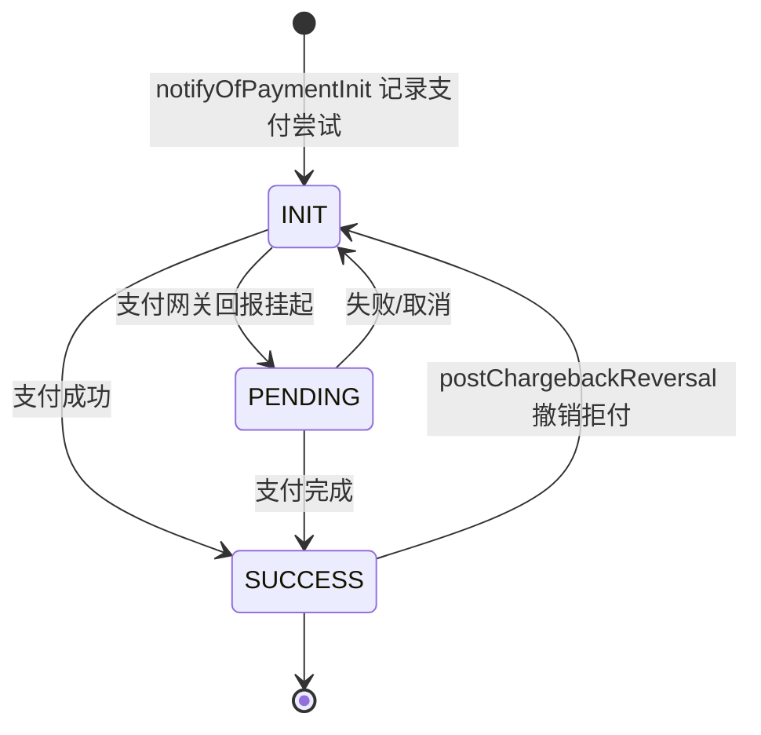
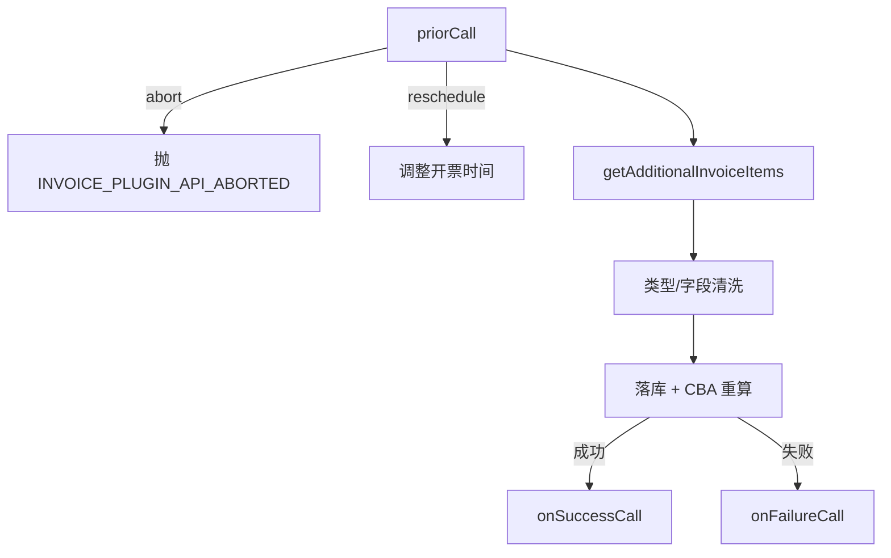

# Kill Bill — invoice 模块业务知识卡（补充 / supplement）

> 模块: invoice | 来源: benchmark/killbill/invoice/src/main/java/org/killbill/billing/invoice/
> 用途: 对 `.bizdoc-kb2/cards/invoice.md` 的**增量补充**——只收录 kb2 未覆盖的
> 完整枚举、精确默认值、条件/组合行为、排序与校验约束。
> ID 规则: 前缀 + `I` + 序号（如 BR-I1），保证与 kb2 卡片 ID 不冲突。
> 溯源路径均相对 Kill Bill 仓库根 `benchmark/killbill`。
> 提取时间: 2026-09-17

## BR-I1 可被 ITEM_ADJ 调整的发票项类型白名单

- **类型**: 业务规则
- **同义词**: 可调整项类型, 哪些项能调整, adjustable item types, INVOICE_ITEM_TYPES_ADJUSTABLE, 不可调整项
- **模块**: invoice
- **置信度**: 🟢 confirmed
- **溯源**: `invoice/src/main/java/org/killbill/billing/invoice/dao/DefaultInvoiceDao.java:127-132`, `invoice/src/main/java/org/killbill/billing/invoice/dao/DefaultInvoiceDao.java:1362-1370`

**规则**：只有以下 **6 种**发票项类型可被 `ITEM_ADJ`（发票项调整）作为目标项：
`EXTERNAL_CHARGE`、`FIXED`、`RECURRING`、`TAX`、`USAGE`、`PARENT_SUMMARY`。

**校验**：写入 `ITEM_ADJ` 时，DAO 会读取 `linkedItemId` 指向的原项；若原项类型不在上述白名单内 → 抛 `INVOICE_ITEM_ADJUSTMENT_ITEM_INVALID`。`ITEM_ADJ` 的 `linkedItemId` 不得为 null。

**含义**：`CBA_ADJ`、`CREDIT_ADJ`、`ITEM_ADJ`、`REPAIR_ADJ` 本身**不能**作为被调整目标（即不能对调整项再调整，也不能对信用项直接做 ITEM_ADJ）。

## BR-I2 发票插件可新增/修改的发票项类型白名单

- **类型**: 业务规则
- **同义词**: 插件可注入项, plugin item types, ALLOWED_INVOICE_ITEM_TYPES, 插件限制, 插件新增发票项
- **模块**: invoice
- **置信度**: 🟢 confirmed
- **溯源**: `invoice/src/main/java/org/killbill/billing/invoice/InvoicePluginDispatcher.java:79-82`, `invoice/src/main/java/org/killbill/billing/invoice/InvoicePluginDispatcher.java:388-394`, `invoice/src/main/java/org/killbill/billing/invoice/dao/DefaultInvoiceDao.java:544-554`

**规则**：发票插件通过 `getAdditionalInvoiceItems` 只能**新增**以下 **4 种**类型的发票项：
`EXTERNAL_CHARGE`、`ITEM_ADJ`、`CREDIT_ADJ`、`TAX`。

- 若插件返回的新项类型不在白名单内、且该 id 不是已存在项 → 抛 `INVOICE_ITEM_TYPE_INVALID`（该插件项被丢弃）。
- 若插件项 id 命中**已存在项**，则允许以白名单类型去**修改**该项。
- DAO 层对白名单类型的既有项，仅当金额发生变化时才会更新其可变字段（`updateItemFields`），用于防止重复写入（见 Kill Bill issue #993）。

**含义**：插件不能凭空插入 `RECURRING`/`FIXED`/`USAGE`/`PARENT_SUMMARY`/`CBA_ADJ`/`REPAIR_ADJ` 等类型的新项。

## BR-I3 发票插件项的「可变 / 不可变」字段规则

- **类型**: 业务规则
- **同义词**: 插件字段覆盖, mutable field, immutable field, 插件修改发票项, 字段不可变
- **模块**: invoice
- **置信度**: 🟢 confirmed
- **溯源**: `invoice/src/main/java/org/killbill/billing/invoice/InvoicePluginDispatcher.java:388-463`

**规则**：插件修改既有发票项时，字段分两类：
- **可变（插件新值优先）**：`description`、`amount`、`rate`、`quantity`、`itemDetails`、`prettyProductName`、`prettyPlanName`、`prettyPhaseName`、`prettyUsageName`、`createdDate`。
- **不可变（保留既有值，插件新值被忽略并告警）**：`accountId`、`bundleId`、`subscriptionId`、`productName`、`planName`、`phaseName`、`usageName`、`catalogEffectiveDate`、`startDate`、`endDate`、`currency`、`linkedItemId`、`invoiceItemType`。
- `invoiceId`：优先取既有项，其次插件值，最后回退到原发票 id；`id` 缺省时随机生成。

**含义**：插件无法改变账期、币种、订阅归属与类型，只能改金额/描述/数量等。

## BR-I4 发票项调整金额上限计算（不可超调）

- **类型**: 业务规则
- **同义词**: 项调整上限, 不可超调, maxAdjLeftAmount, INVOICE_ITEM_ADJUSTMENT_AMOUNT_INVALID, 部分调整
- **模块**: invoice
- **置信度**: 🟢 confirmed
- **溯源**: `invoice/src/main/java/org/killbill/billing/invoice/dao/InvoiceDaoHelper.java:105-144`

**规则**：对某原项做调整时，先算出「本次最多还能调整多少」：
- `positiveAdjustedOrRepairedAmount` = 该原项所有 `ITEM_ADJ`/`REPAIR_ADJ`（金额为负）取负后之和；
- `maxAdjLeftAmount = 原项金额 − positiveAdjustedOrRepairedAmount`。
- 若用户显式指定调整金额且 **> maxAdjLeftAmount** → 抛 `INVOICE_ITEM_ADJUSTMENT_AMOUNT_INVALID`；
- 若未指定金额 → 默认调整为 `maxAdjLeftAmount`（即调整剩余全部，支持多次部分调整后再全额调整）；
- 结果为 0 时不生成调整项。

**含义**：支持对同一发票项**多次部分调整**，累计调整额不会超过原项金额。

## BR-I5 退款与发票项调整必须成对出现

- **类型**: 业务规则
- **同义词**: 退款带调整, refund with item adjustment, isInvoiceAdjusted, INVOICE_ITEMS_ADJUSTMENT_MISSING, 退款不给调整
- **模块**: invoice
- **置信度**: 🟢 confirmed
- **溯源**: `invoice/src/main/java/org/killbill/billing/invoice/dao/DefaultInvoiceDao.java:806-813`, `invoice/src/main/java/org/killbill/billing/invoice/dao/DefaultInvoiceDao.java:882-912`

**规则**：创建退款（`createRefund`）时：
- 若 `isInvoiceAdjusted=true` 但 `invoiceItemIdsWithNullAmounts` **为空** → 抛 `INVOICE_ITEMS_ADJUSTMENT_MISSING`（声明要调整项却没说调整哪些）。
- 仅当退款状态为 `SUCCESS` 时，才会真正生成 `ITEM_ADJ` 项并触发 CBA 重算；非 SUCCESS 的退款只记录支付行，不调整项、不算 CBA。
- 退款记录金额以**负值**存储（`requestedPositiveAmount.negate()`）。

**含义**：模拟「退款不调项」（只退钱、账单金额不变）与「退款并调项」（退钱且冲减应收）两种组合。

## BR-I6 退款金额上限与「退款额=调整项之和」校验

- **类型**: 业务规则
- **同义词**: 退款上限, REFUND_AMOUNT_TOO_HIGH, REFUND_AMOUNT_DONT_MATCH_ITEMS_TO_ADJUST, 退款金额校验
- **模块**: invoice
- **置信度**: 🟢 confirmed
- **溯源**: `invoice/src/main/java/org/killbill/billing/invoice/dao/InvoiceDaoHelper.java:155-175`

**规则**：`computePositiveRefundAmount`：
- 最大可退金额 `maxRefundAmount` = 原支付（ATTEMPT）金额；未指定退款额时默认取该最大值；
- 若请求退款额 **> 最大可退金额** → 抛 `REFUND_AMOUNT_TOO_HIGH`；
- 若指定了要调整的发票项，则 `amountFromItems` = 各调整额之和；若该和 ≠ 0 且 **请求退款额 < amountFromItems** → 抛 `REFUND_AMOUNT_DONT_MATCH_ITEMS_TO_ADJUST`（退款额必须 ≥ 项调整之和）。

## BR-I7 退款的幂等去重（按 transactionExternalKey）

- **类型**: 业务规则
- **同义词**: 退款幂等, refund idempotency, paymentCookieId, transactionExternalKey, 重复退款
- **模块**: invoice
- **置信度**: 🟢 confirmed
- **溯源**: `invoice/src/main/java/org/killbill/billing/invoice/dao/DefaultInvoiceDao.java:844-873`

**规则**：退款前用 `transactionExternalKey`（即 `paymentCookieId`）查询既有退款记录：
- 若已存在：校验金额与 `paymentId` 一致，否则抛 `Preconditions` 异常；
- 若已存在且状态相同 → 直接返回既有记录（**不重复生成项、不算 CBA、不发事件**）；
- 若已存在但状态不同 → 仅更新其**状态与支付日期**（状态机重放）。

**含义**：支付系统可能对同一 refundId 多次回调，此机制保证退款只落一次账。

## BR-I8 拒付（chargeback）金额与币种约束

- **类型**: 业务规则
- **同义词**: 拒付, 退单, chargeback, CHARGE_BACK_AMOUNT_IS_NEGATIVE, CHARGE_BACK_AMOUNT_TOO_HIGH, 拒付金额
- **模块**: invoice
- **置信度**: 🟢 confirmed
- **溯源**: `invoice/src/main/java/org/killbill/billing/invoice/dao/DefaultInvoiceDao.java:920-966`

**规则**：`postChargeback`：
- 依据原 `ATTEMPT` 支付计算 `maxChargedBackAmount` = 该支付**剩余可拒付金额**（`getRemainingAmountPaid`）；
- 未指定金额时默认拒付全部剩余；
- 拒付额 ≤ 0 → 抛 `CHARGE_BACK_AMOUNT_IS_NEGATIVE`；
- 拒付额 > `maxChargedBackAmount` → 抛 `CHARGE_BACK_AMOUNT_TOO_HIGH`；
- 拒付币种必须与原支付币种一致（`Preconditions.checkArgument`）；
- 生成的 `CHARGED_BACK` 支付记录金额取**负值**，状态固定 `SUCCESS`，随后触发 CBA 重算并发送支付事件。

## BR-I9 拒付撤销（chargeback reversal）语义

- **类型**: 业务规则
- **同义词**: 拒付撤销, chargeback reversal, 撤销拒付, INIT 状态, 恢复支付
- **模块**: invoice
- **置信度**: 🟢 confirmed
- **溯源**: `invoice/src/main/java/org/killbill/billing/invoice/dao/DefaultInvoiceDao.java:970-1004`

**规则**：`postChargebackReversal` 按 `chargebackTransactionExternalKey` 找到原 `CHARGED_BACK` 支付行，将其状态改回 `INIT`（金额不变，仍为负），随后重算 CBA 并发送支付事件。找不到对应支付行 → 抛 `PAYMENT_NO_SUCH_PAYMENT`。

**含义**：撤销拒付不是删除记录，而是把状态从 SUCCESS 退回 INIT，从而不再计入 CBA/余额相关判定（因为只有 SUCCESS 才计入）。

## BR-I10 删除账户信用（deleteCBA）规则

- **类型**: 业务规则
- **同义词**: 删除信用, deleteCBA, 取消信用, INVOICE_CBA_DELETED, 删除已用信用
- **模块**: invoice
- **置信度**: 🟢 confirmed
- **溯源**: `invoice/src/main/java/org/killbill/billing/invoice/dao/DefaultInvoiceDao.java:1173-1234`

**规则**：`deleteCBA(accountId, invoiceId, invoiceItemId)`：
- 发票必须属于该账户、非迁移、且状态为 `COMMITTED`，否则抛 `INVOICE_NOT_FOUND`；CBA 项必须属于该发票，否则 `INVOICE_ITEM_NOT_FOUND`。
- **消费型 CBA（金额 < 0）**：直接把该项金额更新为 0（描述 `"Delete used credit"`）。
- **生成型 CBA（金额 > 0，即信用发票）**：需在该发票上找一条 `CREDIT_ADJ`（其金额取负 ≥ CBA 金额）。找到则：
  - 若账户剩余 CBA < 该 CBA 金额 → 通过 `reclaimCreditFromTransaction` 回收不足部分（可能跨多张发票，更新已用 CBA 项金额，描述 `"Reclaim used credit"`），并断言回收额精确匹配；
  - 把该 CBA 项金额更新为 0；`CREDIT_ADJ` 金额更新为 `原值 + CBA 值`（描述 `"Delete gen credit"`）。
- **系统生成的信用**（如 repair 产生、无对应 CREDIT_ADJ）→ 抛 `INVOICE_CBA_DELETED`。
- 最后对涉及的每张发票发送发票调整事件。

## BR-I11 回收已用信用（reclaim）跨发票机制

- **类型**: 业务规则
- **同义词**: 回收信用, reclaim credit, 已用信用回收, Reclaim used credit, 信用回滚
- **模块**: invoice
- **置信度**: 🟢 confirmed
- **溯源**: `invoice/src/main/java/org/killbill/billing/invoice/dao/DefaultInvoiceDao.java:1147-1170`

**规则**：`reclaimCreditFromTransaction(amountToReclaim, ...)` 拉取所有**已消费的 CBA 项**（`getConsumedCBAItems`），按顺序逐条回收：
- 对每条消费 CBA（金额为负），可回收上限 = `−金额`；
- 本次回收 `adjustedAmount = min(剩余待回收, 该条上限)`；
- 将该 CBA 项金额改为 `−(上限 − 已回收)`（描述 `"Reclaim used credit"`）；
- 累加剩余待回收，直至归零或遍历完；返回实际回收总额。

**含义**：删除「生成型信用」而账户剩余信用不足时，会逆向回收此前已被消费掉的信用，保证账户 CBA 不为负。

## BR-I12 账户余额（account balance）的完整计算口径

- **类型**: 业务规则
- **同义词**: 账户余额算法, account balance formula, 跳过草稿作废, 扣减CBA, 核销不计
- **模块**: invoice
- **置信度**: 🟢 confirmed
- **溯源**: `invoice/src/main/java/org/killbill/billing/invoice/dao/DefaultInvoiceDao.java:730-759`

**规则**：`getAccountBalance` 遍历账户全部（非作废）发票：
- **跳过** `DRAFT` 与 `VOID` 状态的发票；
- 对每张发票：若**已核销**或「父发票余额为 0/父发票为 DRAFT/VOID/已核销」（`hasZeroParentBalance`）→ 该发票计 0；
  否则计入其 `getRawBalanceForRegularInvoice`；
- 同时累加该发票的 `getCBAAmount`；
- 最终 `accountBalance = Σ发票余额 − ΣCBA`。
- 此外：`getAccountBalance`/`getAccountCBA` 查询返回 null 时统一当 `BigDecimal.ZERO`。

**含义**：账户余额口径与单张发票余额（BR-020/BR-021）不同——账户余额会扣减账户信用（CBA），且完全排除草稿/作废。

## TERM-I1 发票支付状态（InvoicePaymentStatus）完整取值

- **类型**: 术语
- **同义词**: 支付状态, 支付状态枚举, InvoicePaymentStatus, INIT, PENDING, SUCCESS, 支付初始化, 支付挂起, 支付成功
- **模块**: invoice
- **置信度**: 🟢 confirmed
- **溯源**: `invoice/src/main/java/org/killbill/billing/invoice/model/DefaultInvoicePayment.java:55`, `invoice/src/main/java/org/killbill/billing/invoice/dao/DefaultInvoiceDao.java:825`, `invoice/src/main/java/org/killbill/billing/invoice/dao/DefaultInvoiceDao.java:990`, `invoice/src/main/java/org/killbill/billing/invoice/dao/CBADao.java:69-72`

**说明**：`InvoicePaymentStatus` 在本模块代码中出现 **3 个**取值：
- `INIT`：支付初始化（`notifyOfPaymentInit` 记录；拒付撤销 `postChargebackReversal` 把状态改回 INIT）。
- `PENDING`：支付挂起中（会**阻止**该发票消费账户信用 CBA，见 CBADao 判定）。
- `SUCCESS`：支付成功（唯一会被计入「已付 / 已退款」金额与违约判定的状态）。

**含义**：只有 `SUCCESS` 的支付/退款/拒付计入金额统计；`PENDING` 只用于 CBA 消费门控；`INIT` 表示未完成或已回退。

## SM-I1 发票支付状态机（INIT → PENDING → SUCCESS，拒付可回退）

- **类型**: 状态机
- **同义词**: 支付状态流转, invoice payment state machine, 支付状态机, 拒付回退, INIT 回 PENDING SUCCESS
- **模块**: invoice
- **置信度**: 🟢 confirmed
- **溯源**: `invoice/src/main/java/org/killbill/billing/invoice/dao/DefaultInvoiceDao.java:1078-1140`, `invoice/src/main/java/org/killbill/billing/invoice/dao/DefaultInvoiceDao.java:970-1004`

**说明**：
- `notifyOfPaymentInit` 总是先落一条状态为 `INIT` 的支付行；`notifyOfPaymentCompletion` 按 `paymentCookieId` 找既有 `ATTEMPT` 行并更新其状态。
- 若存在既有尝试行，则 `paymentId` **不可变更**（否则 Preconditions 失败）；`paymentId` 为 null 时（如无支付方式，仅发事件给 Overdue）在 completion 阶段不落行但仍发事件。
- 金额与币种从原支付行继承更新。

## BR-I13 支付事件：成功发 Info，其他发 Error

- **类型**: 业务规则
- **同义词**: 支付事件, payment event, DefaultInvoicePaymentInfoEvent, DefaultInvoicePaymentErrorEvent, 支付成功事件
- **模块**: invoice
- **置信度**: 🟢 confirmed
- **溯源**: `invoice/src/main/java/org/killbill/billing/invoice/dao/DefaultInvoiceDao.java:1292-1333`

**规则**：发送支付事件时按状态分流：
- `InvoicePaymentStatus.SUCCESS` → 发 `DefaultInvoicePaymentInfoEvent`；
- 其他状态（INIT/PENDING）→ 发 `DefaultInvoicePaymentErrorEvent`。
两者都携带 `accountId`、`paymentId`、`paymentAttemptId`、`type`、`invoiceId`、`paymentDate`、`amount`、`currency`、`linkedInvoicePaymentId`、`paymentCookieId`、`processedCurrency`、账户/租户 recordId、userToken。

## BR-I14 支付尝试记录的创建与更新（INIT / completion）

- **类型**: 业务规则
- **同义词**: 支付尝试记录, payment attempt, notifyOfPaymentInit, notifyOfPaymentCompletion, paymentId 不可变
- **模块**: invoice
- **置信度**: 🟢 confirmed
- **溯源**: `invoice/src/main/java/org/killbill/billing/invoice/dao/DefaultInvoiceDao.java:1078-1140`

**规则**：
- `notifyOfPaymentInit` 一律记录一条 `INIT` 支付行；`notifyOfPaymentCompletion` 若 `paymentId == null`（从未真正发起支付，如无支付方式）则**不落行**，但仍发送事件（供 Overdue 使用）。
- 按 `invoiceId` + `type=ATTEMPT` + `paymentCookieId=transactionExternalKey` 查找既有尝试行：
  - 不存在 → 新建；
  - 存在 → 更新日期/金额/币种/状态；`paymentId` 只允许从 null 补全或在双方相同时保留，否则 Preconditions 失败（issue #1230）。
- 更新时 `linkedInvoicePaymentId` 传 null（重置）。

## BR-I15 发票号的来源（插件属性 INVOICE_SEQUENCE_NUMBER）

- **类型**: 业务规则
- **同义词**: 发票号来源, invoice number, INVOICE_SEQUENCE_NUMBER, 序列号, invoiceSequenceNumber, 自定义发票号
- **模块**: invoice
- **置信度**: 🟢 confirmed
- **溯源**: `invoice/src/main/java/org/killbill/billing/invoice/api/InvoiceApiHelper.java:123-129`, `invoice/src/main/java/org/killbill/billing/invoice/dao/DefaultInvoiceDao.java:507-512`, `invoice/src/main/java/org/killbill/billing/invoice/dao/InvoiceDaoHelper.java:491-495`

**规则**：
- 发票号并非数据库列，而是以 **CustomField**（字段名常量 `INVOICE_SEQUENCE_NUMBER`）形式挂在发票对象上（`ObjectType.INVOICE`）。
- API 写入时，插件属性中若含 key = `INVOICE_SEQUENCE_NUMBER` 且值非空，则解析为 Integer 设为该发票的 `invoiceNumber`。
- 读取发票时，`InvoiceDaoHelper.setInvoiceNumber` 从该 CustomField 反填 `InvoiceModelDao.invoiceNumber`。
- `getInvoiceByNumber` 与 `searchInvoices`（搜索串可解析为整数时）都走发票号路径。

## BR-I16 通过 API 写发票项的统一加锁与插件链

- **类型**: 业务规则
- **同义词**: API 写项加锁, dispatchToInvoicePluginsAndInsertItems, ACCNT_INV_PAY, 插件链, 发票 API 锁
- **模块**: invoice
- **置信度**: 🟢 confirmed
- **溯源**: `invoice/src/main/java/org/killbill/billing/invoice/api/InvoiceApiHelper.java:79-176`

**规则**：外部收费 / 税 / 信用 / 项调整 / 提交 / 作废等 API 都通过 `dispatchToInvoicePluginsAndInsertItems`：
1. 先调插件 `priorCall`；若插件返回 rescheduleDate → 抛 `INVOICE_PLUGIN_API_ABORTED`（“delayed scheduling is unsupported for API calls”）。
2. 以 `LockerType.ACCNT_INV_PAY` 对账户加全局锁（重试次数 `getMaxGlobalLockRetries`）；加锁失败抛 `UNEXPECTED_ERROR`（“failed to acquire lock”）。
3. `withAccountLock.prepareInvoices()` 在锁内准备/校验发票。
4. 逐张发票调插件 `getAdditionalInvoiceItems`（可修改金额），再把结果落库。
5. **成功** → 对每张发票调插件 `onSuccessCall`；**失败** → 调 `onFailureCall`。
6. `insertItems=false` 时（如 commit/void）只执行锁内逻辑与插件回调，不写新项。

## BR-I17 发票 HTML 渲染时合并 CBA 与信用调整项

- **类型**: 业务规则
- **同义词**: 发票渲染合并, merge CBA, 合并信用项, HTML 发票, 隐藏内部调整, mergeCBAAndCreditAdjustmentItems
- **模块**: invoice
- **置信度**: 🟢 confirmed
- **溯源**: `invoice/src/main/java/org/killbill/billing/invoice/template/formatters/DefaultInvoiceFormatter.java:109-190`

**规则**：生成发票 HTML/模板时：
- 所有 `CBA_ADJ` 项**合并为一条**（金额相加），描述为对客户的内部调整（避免暴露多条自动调整）；
- 所有 `CREDIT_ADJ` 项**合并为一条**；
- 合并后若某条合并项金额为 **0** → **不展示**；
- 币种不同的 CBA/信用项不合并（各自保留）。
- 发票号未设置时展示为 `0`；`paidAmount`/`balance`/`chargedAmount` 等 null 时按 0 展示。

**含义**：面向客户的发票只显示汇总后的信用/账户信用，明细行的合并策略与其他类型项无关。

## BR-I18 已计费截止日期（charged-through dates）计算规则

- **类型**: 业务规则
- **同义词**: 计费截止日, charged through date, CTD, chargedThroughDates, 已开票到哪天
- **模块**: invoice
- **置信度**: 🟢 confirmed
- **溯源**: `invoice/src/main/java/org/killbill/billing/invoice/generator/InvoiceWithMetadata.java:116-154`

**规则**：`computeChargedThroughDates`：
- 仅当发票状态为 `COMMITTED` 时才计算（issue #1296）；否则返回空 Map。
- 只考虑 `FIXED`/`RECURRING`/`USAGE` 三类项（插件项也不排除，按类型过滤）。
- 每项取 `endDate`（为 null 时取 `startDate`）作为候选 CTD；
- 同一订阅取**最晚**的候选 CTD；
- 最终按 CTD 日期分组，输出 `Map<DateTime, List<subscriptionId>>`。

## BR-I19 IN_ADVANCE 待开票日期清零（防止无限通知循环）

- **类型**: 业务规则
- **同义词**: 清零下次开票日, reset next recurring date, 无限循环, IN_ADVANCE 通知
- **模块**: invoice
- **置信度**: 🟢 confirmed
- **溯源**: `invoice/src/main/java/org/killbill/billing/invoice/generator/InvoiceWithMetadata.java:77-89`

**规则**：`InvoiceWithMetadata.build()` 在收敛未来通知日期时：
- 若某订阅计算的 `nextRecurringDate` 非空、且其 `recurringBillingMode == IN_ADVANCE`、且**该订阅最终没有任何 RECURRING 项**、且没有任何项落在该日期上（如 REPAIR_ADJ）→ 将该 `nextRecurringDate` **清零**。
- 目的：`nextRecurringDate` 基于「提议项」而非「缺失项」计算，若不清零会生成过多通知日期，可能造成无限循环。

## BR-I20 $0 用量项过滤的例外（quantity > 0 保留）

- **类型**: 业务规则
- **同义词**: 零金额用量过滤, filterZeroUsageItems, quantity 大于0, 保留零金额用量
- **模块**: invoice
- **置信度**: 🟢 confirmed
- **溯源**: `invoice/src/main/java/org/killbill/billing/invoice/generator/InvoiceWithMetadata.java:92-112`

**规则**：当启用零金额用量项过滤（见 BR-003 配置）时，仅过滤满足**全部**以下条件的项：类型为 `USAGE` **且** 金额 = 0 **且**（quantity 为空 **或** quantity ≤ 0）。即**金额为 0 但 quantity > 0 的用量项仍保留**。
- 过滤后若发票已无任何项 → 该发票被置为 null（但 CTD、trackingIds 等元数据已照常计算）。

## BR-I21 用量 tracking record 的去重语义（不含 invoiceId）

- **类型**: 业务规则
- **同义词**: tracking 去重, TrackingRecordId, isSimilarRecord, 用量记录相似, 跨发票去重
- **模块**: invoice
- **置信度**: 🟢 confirmed
- **溯源**: `invoice/src/main/java/org/killbill/billing/invoice/generator/InvoiceWithMetadata.java:181-256`

**规则**：`TrackingRecordId` 由 `{trackingId, invoiceId, subscriptionId, unitType, recordDate}` 构成：
- `equals`/`hashCode` **包含 invoiceId**（精确身份）；
- `isSimilarRecord` **不含 invoiceId**——只要 `{trackingId, subscriptionId, unitType, recordDate}` 相同即视为「同一条原始用量」，**无论它被挂到哪张发票上**。
- 该相似性用于跨发票识别重复计费的用量记录。

## BR-I22 下一次开票通知的去重与订阅合并

- **类型**: 业务规则
- **同义词**: 下次开票通知去重, next billing notification dedup, 合并订阅, 通知合并
- **模块**: invoice
- **置信度**: 🟢 confirmed
- **溯源**: `invoice/src/main/java/org/killbill/billing/invoice/notification/DefaultNextBillingDatePoster.java:76-157`

**规则**：插入「下一次开票」未来通知时：
- 按「生效**本地日期**相同 **且** dry-run 标志相同」查找既有通知；普通通知与 dry-run 通知互不视为重复。
- 若不存在 → 新建通知（携带 subscriptionIds、targetDate、isDryRun、isRescheduled）。
- 若存在且新订阅集合是既有集合的**子集** → 忽略（debug 日志）。
- 若存在且包含**新订阅** → **更新**既有通知，合并订阅 id。
- 通知主键 `NextBillingDateNotificationKey` 由 `(uuidKeys, targetDate, isDryRunForInvoiceNotification, isRescheduled)` 构成。

## BR-I23 账户信用余额查询口径（getCBAAmount = credited）

- **类型**: 业务规则
- **同义词**: 信用余额口径, getCBAAmount, 账户CBA, credited amount, 信用汇总
- **模块**: invoice
- **置信度**: 🟢 confirmed
- **溯源**: `invoice/src/main/java/org/killbill/billing/invoice/dao/InvoiceModelDaoHelper.java:48-56`

**规则**：`InvoiceModelDaoHelper` 的两个聚合：
- `getCBAAmount(发票)` = `InvoiceCalculatorUtils.computeInvoiceAmountCredited`，即该发票所有 `CBA_ADJ` 项金额之和。
- `getAmountCharged(发票)` = `computeInvoiceAmountCharged`（见 BR-024）。
账户层 CBA 由数据库直接聚合（`InvoiceItemSqlDao.getAccountCBA`）；账户余额则用 `Σ发票余额 − ΣgetCBAAmount`（见 BR-I12）。

## BR-I24 原始计费金额（original charged amount）

- **类型**: 业务规则
- **同义词**: 原始计费金额, original charged amount, getOriginalChargedAmount, 发票创建时金额, original amount charged
- **模块**: invoice
- **置信度**: 🟢 confirmed
- **溯源**: `invoice/src/main/java/org/killbill/billing/invoice/calculator/InvoiceCalculatorUtils.java:176-190`, `invoice/src/main/java/org/killbill/billing/invoice/model/DefaultInvoice.java:254-256`

**规则**：`getOriginalChargedAmount` = 仅累加**收费项**（`isCharge`）中 **`createdDate` 恰好等于发票 `createdDate`** 的金额。即「发票创建当时就存在的收费金额」，用于与后续追加/调整后的 `getChargedAmount` 对比。

**对照**：`getChargedAmount` = 全部收费项 + 发票级调整 + 项调整 + 父汇总（BR-024）；`getCreditedAmount` = 全部 `CBA_ADJ` 之和；`getRefundedAmount` = SUCCESS 的 REFUND + CHARGED_BACK 之和（BR-023）。

## ENT-I1 税项（TaxInvoiceItem / TAX）

- **类型**: 业务实体
- **同义词**: 税项, 税费, tax item, TaxInvoiceItem, TAX, 税金
- **模块**: invoice
- **置信度**: 🟢 confirmed
- **溯源**: `invoice/src/main/java/org/killbill/billing/invoice/model/TaxInvoiceItem.java:31-90`

**说明**：类型为 `TAX` 的发票项，继承 `InvoiceItemCatalogBase`（可带 catalog 字段）。关键构造参数：`invoiceId`、`accountId`、可选 `bundleId`、`description`、`startDate`（date，endDate 为 null）、`amount`、`currency`、可选 `linkedItemId`。**描述默认值**：`"Tax"`（未显式指定时）。可通过 `insertTaxItems` API 批量添加。

## ENT-I2 发票级信用项（CreditAdjInvoiceItem / CREDIT_ADJ）

- **类型**: 业务实体
- **同义词**: 发票级信用, 信用调整项, credit adjustment, CreditAdjInvoiceItem, CREDIT_ADJ, 信用项
- **模块**: invoice
- **置信度**: 🟢 confirmed
- **溯源**: `invoice/src/main/java/org/killbill/billing/invoice/model/CreditAdjInvoiceItem.java:33-54`

**说明**：类型为 `CREDIT_ADJ` 的发票项，继承 `AdjInvoiceItem`（`catalogEffectiveDate` 恒为 null）。`startDate == endDate == date`，可含 `rate`/`quantity`。**描述默认值**：`"Invoice adjustment"`。
- 通过 `insertCredits` API 创建时金额会被**取负**（`amount.negate()`）；`getCreditById` 返回时再取负还原（见 BR-033）。
- 信用发票（恰好 CREDIT_ADJ + CBA_ADJ 两项）中，该 CREDIT_ADJ 参与 `computeInvoiceAmountAdjustedForAccountCredit`（见 BR-026）。

## ENT-I3 项调整项（ItemAdjInvoiceItem / ITEM_ADJ）

- **类型**: 业务实体
- **同义词**: 项调整项, 条目调整, item adjustment, ItemAdjInvoiceItem, ITEM_ADJ, 单项调整
- **模块**: invoice
- **置信度**: 🟢 confirmed
- **溯源**: `invoice/src/main/java/org/killbill/billing/invoice/model/ItemAdjInvoiceItem.java:34-55`

**说明**：类型为 `ITEM_ADJ` 的发票项，继承 `AdjInvoiceItem`。`startDate == endDate == effectiveDate`；`linkedItemId` 指向被调整的原项（**必须非 null**）；金额为**负值**。**描述默认值**：`"Invoice item adjustment"`。可带 `rate`/`quantity`/`itemDetails`。

## ENT-I4 修复冲销项（RepairAdjInvoiceItem / REPAIR_ADJ）

- **类型**: 业务实体
- **同义词**: 修复冲销项, 冲销项, repair adjustment, RepairAdjInvoiceItem, REPAIR_ADJ, 改套餐冲销
- **模块**: invoice
- **置信度**: 🟢 confirmed
- **溯源**: `invoice/src/main/java/org/killbill/billing/invoice/model/RepairAdjInvoiceItem.java:33-53`

**说明**：类型为 `REPAIR_ADJ` 的发票项，继承 `AdjInvoiceItem`。有独立的 `startDate`/`endDate` 区间（与 ITEM_ADJ 不同，可表示被冲销的原始服务区间）；`reversingId`（即 `linkedItemId`）指向被冲销的原项；金额为**负值**。**描述默认值**：`"Adjustment (subscription change)"`。

## ENT-I5 调整项公共基类（AdjInvoiceItem）

- **类型**: 业务实体
- **同义词**: 调整基类, AdjInvoiceItem, 调整项公共字段, 调整项无目录生效日
- **模块**: invoice
- **置信度**: 🟢 confirmed
- **溯源**: `invoice/src/main/java/org/killbill/billing/invoice/model/AdjInvoiceItem.java:31-54`

**说明**：`CreditAdjInvoiceItem`、`ItemAdjInvoiceItem`、`RepairAdjInvoiceItem` 的公共父类（间接继承 `InvoiceItemBase`）：
- 无 bundle/subscription/product/plan/phase/usage 等目录字段（构造时传 null）；
- **`getCatalogEffectiveDate()` 恒返回 null**（调整项不参与目录 pretty name 计算）；
- 公共字段：`startDate`、`endDate`、`description`、`amount`、`currency`、`reversingId(=linkedItemId)`、可选 `rate`/`quantity`/`itemDetails`。

## BR-I25 发票分组 id（grpId）默认值

- **类型**: 业务规则
- **同义词**: 分组 id, grpId, invoice group, 一次开票分组, group id
- **模块**: invoice
- **置信度**: 🟢 confirmed
- **溯源**: `invoice/src/main/java/org/killbill/billing/invoice/dao/InvoiceModelDao.java:81`, `invoice/src/main/java/org/killbill/billing/invoice/dao/DefaultInvoiceDao.java:497-500`

**规则**：
- `InvoiceModelDao.grpId` **默认等于发票自身 id**（构造时 `this.grpId = id`），除非显式设置。
- 在一次 `createInvoices` 批量创建中，第一张新建发票的 id 会成为**整个批次共享的 grpId**（用于把同一次开票产生的多张发票归为一组）。
- 可通过 `getInvoicesByGroup(accountId, groupId)` 按分组查询。

## WF-I1 发票插件生命周期流程

- **类型**: 业务流程
- **同义词**: 发票插件流程, invoice plugin lifecycle, priorCall, onSuccessCall, onFailureCall, 插件回调
- **模块**: invoice
- **置信度**: 🟢 confirmed
- **溯源**: `invoice/src/main/java/org/killbill/billing/invoice/InvoicePluginDispatcher.java:113-222`, `invoice/src/main/java/org/killbill/billing/invoice/api/InvoiceApiHelper.java:160-175`

**步骤**：
1. **priorCall**：生成/写入发票前调用。可返回 rescheduleDate（调整开票时间，取所有插件中**最早**的）、abort（抛 `INVOICE_PLUGIN_API_ABORTED`）、调整后的 PluginProperties。
2. **getAdditionalInvoiceItems**：对每张发票（原发票 clone）调用，插件可增删/改项；返回项经类型白名单与可变字段清洗（BR-I2/BR-I3）。
3. **onSuccessCall**：全部落库成功后、对每张刷新后的发票调用；异常被吞掉（仅 warn），不影响主流程。
4. **onFailureCall**：任何失败路径调用；同样吞异常。
5. 插件集合与顺序：若配置了插件名列表则按配置顺序且只保留已注册的；**未配置则返回全部已注册插件（顺序不确定）**。

## WF-I2 发票拆分（getInvoiceGrouping / splitInvoices）

- **类型**: 业务流程
- **同义词**: 发票拆票, split invoice, getInvoiceGrouping, InvoiceGroup, 一张变多张
- **模块**: invoice
- **置信度**: 🟢 confirmed
- **溯源**: `invoice/src/main/java/org/killbill/billing/invoice/InvoicePluginDispatcher.java:243-302`

**步骤**：
1. 对原发票 clone 调用每个插件的 `getInvoiceGrouping`；插件返回 `InvoiceGroupingResult`（含多个 `InvoiceGroup`，每组是一批 `invoiceItemIds`）。
2. 若返回了分组且组数 > 0：为**每个组**新建一张 `DefaultInvoice`（新 id，但沿用原发票的 account/date/targetDate/currency/migration/status）；把组内原项复制到新发票（仅替换 `invoiceId`）。
3. 返回多张发票；若没有插件返回有效分组 → 返回原发票单张。

**含义**：插件可把一次开票结果拆成多张发票（例如按业务线拆票），拆分发生在新发票落库之前。

## BR-I26 金额舍入规则（KillBillMoney）

- **类型**: 业务规则
- **同义词**: 金额舍入, rounding, 四舍五入, KillBillMoney, MAX_SCALE, ROUND_HALF_UP, 小数位
- **模块**: invoice
- **置信度**: 🟢 confirmed
- **溯源**: `util/src/main/java/org/killbill/billing/util/currency/KillBillMoney.java:27-34`, `invoice/src/main/java/org/killbill/billing/invoice/generator/InvoiceDateUtils.java:80-89`

**规则**：
- 金额四舍五入方式 `ROUNDING_METHOD = BigDecimal.ROUND_HALF_UP`（标准四舍五入）。
- 分比（proration）等中间计算使用最大精度常量 `MAX_SCALE = 9`（即保留 9 位小数）。
- `KillBillMoney.of(amount, currency)` 最终按**币种的小数位**（`currencyUnit.getDecimalPlaces()`）以 HALF_UP 收敛。invoice 模块的余额/金额聚合结果都经过该规范化。

## BR-I27 整周期数与分比天数的计算（InvoiceDateUtils）

- **类型**: 业务规则
- **同义词**: 整周期数, whole billing periods, 分比天数, proration days, fixedDaysInMonth, advanceByNPeriods
- **模块**: invoice
- **置信度**: 🟢 confirmed
- **溯源**: `invoice/src/main/java/org/killbill/billing/invoice/generator/InvoiceDateUtils.java:34-115`

**规则**：
- `calculateNumberOfWholeBillingPeriods(start, end, period)`：按 billingPeriod 的单位（天/周/月/年，取决于 period 的哪个字段非 0）计算两日期间隔并**整除**周期长度，得到完整周期数。
- 分比比例 = `days / daysInPeriod`，使用 MAX_SCALE(9) 精度 + HALF_UP。
- `daysInPeriod`：`prorationFixedDays == 0` 时取 `previousBillingCycleDate → nextBillingCycleDate` 的实际天数；否则取 `prorationFixedDays`。
- `days`：`prorationFixedDays == 0` 时取实际天数；否则用 `daysBetweenWithFixedDaysInMonth`：同月直接返回实际天数，跨月则减去 `(该月最后一天 − fixedDaysInMonth)`。
- `daysBetween <= 0` → 分比返回 `BigDecimal.ZERO`。
- `advanceByNPeriods`/`recedeByNPeriods`：按周期循环加减 N 次（支持负数周期语义）。

## BR-I28 账户挂起 / 解挂机制（PARK 系统标签）

- **类型**: 业务规则
- **同义词**: 挂起账户, park account, PARK 标签, unpark, isParked, 系统标签
- **模块**: invoice
- **置信度**: 🟢 confirmed
- **溯源**: `invoice/src/main/java/org/killbill/billing/invoice/ParkedAccountsManager.java:47-67`

**规则**：账户的「挂起」是通过给账户打上系统标签 `PARK_TAG_DEFINITION_ID` 实现的：
- `parkAccount`：添加该标签；**幂等**——若已存在（`TAG_ALREADY_EXISTS`）则忽略。
- `unparkAccount`：移除该标签。
- `isParked`：查询账户级标签中是否存在该 tag definition id。
（挂起后对开票的影响见 BR-047/BR-048。）

## BR-I29 移除 AUTO_INVOICING_OFF 标签后重新开票

- **类型**: 业务规则
- **同义词**: 恢复自动开票, AUTO_INVOICING_OFF 移除, tag deletion, 重新开票, InvoiceTagHandler
- **模块**: invoice
- **置信度**: 🟢 confirmed
- **溯源**: `invoice/src/main/java/org/killbill/billing/invoice/InvoiceTagHandler.java:72-125`

**规则**：`InvoiceTagHandler` 订阅账户级 `ControlTagDeletionInternalEvent`：
- 当被删除的标签是 `AUTO_INVOICING_OFF` 且对象类型为 `ACCOUNT` 时，调用 `dispatcher.processAccountFromNotificationOrBusEvent` 为账户重新尝试开票（可能补开被暂停期间的发票）。
- 处理经可靠订阅队列重试（失败仅告警，不阻塞）。

## BR-I30 退款金额必须为正

- **类型**: 业务规则
- **同义词**: 退款金额校验, PAYMENT_REFUND_AMOUNT_NEGATIVE_OR_NULL, 退款不能为负, refund amount
- **模块**: invoice
- **置信度**: 🟢 confirmed
- **溯源**: `invoice/src/main/java/org/killbill/billing/invoice/api/svcs/DefaultInvoiceInternalApi.java:130-135`

**规则**：`recordRefund` 入口即校验 `amount ≤ 0` → 抛 `PAYMENT_REFUND_AMOUNT_NEGATIVE_OR_NULL`。随后调用 DAO `createRefund` 并（为事件传播）重新走一遍开票插件链（`dispatchToInvoicePluginsAndInsertItems`）。

## BR-I31 退款项调整的预校验入口

- **类型**: 业务规则
- **同义词**: 退款项预校验, validateInvoiceItemAdjustments, 退款调整映射, INVOICE_ITEMS_ADJUSTMENT_MISSING
- **模块**: invoice
- **置信度**: 🟢 confirmed
- **溯源**: `invoice/src/main/java/org/killbill/billing/invoice/api/svcs/DefaultInvoiceInternalApi.java:164-171`

**规则**：`validateInvoiceItemAdjustments(paymentId, idWithAmount)`：
- `idWithAmount` 为空 → 抛 `INVOICE_ITEMS_ADJUSTMENT_MISSING`（退款必须带项调整映射）；
- 通过原 `ATTEMPT` 支付找到发票，再调用 `computeItemAdjustments`（BR-I4 的上限/校验逻辑）返回校验后的 `id→金额` 映射。

**含义**：支付模块在发起退款前会先调用此接口校验项调整是否合法。

## BR-I32 按 paymentId 取支付时只认 SUCCESS 的 ATTEMPT

- **类型**: 业务规则
- **同义词**: paymentId 查支付, SUCCESS ATTEMPT, getInvoicePayment, 支付过滤
- **模块**: invoice
- **置信度**: 🟢 confirmed
- **溯源**: `invoice/src/main/java/org/killbill/billing/invoice/api/svcs/DefaultInvoiceInternalApi.java:174-181`

**规则**：`getInvoicePayment(paymentId, type)` 在按 paymentId 取某类型支付时，只保留 **`status == SUCCESS`** 的记录，返回第一条匹配；无则返回 null。退款、拒付关联的查找也遵循同样过滤。

## BR-I33 发票状态默认值与迁移发票构造

- **类型**: 业务规则
- **同义词**: 发票默认状态, COMMITTED 默认, 迁移发票构造, migration invoice constructor, DRAFT 构造
- **模块**: invoice
- **置信度**: 🟢 confirmed
- **溯源**: `invoice/src/main/java/org/killbill/billing/invoice/dao/InvoiceModelDao.java:84-94`, `invoice/src/main/java/org/killbill/billing/invoice/model/DefaultInvoice.java:76`

**规则**：
- `InvoiceModelDao(accountId, invoiceDate, targetDate, currency, migrated)`：状态**默认 `COMMITTED`**、`isParentInvoice=false`。
- 带 `status` 参数的构造可显式指定 DRAFT/COMMITTED。
- 父发票专用构造 `InvoiceModelDao(accountId, invoiceDate, currency, status, isParentInvoice=true)`：`targetDate` 为 **null**。
- `DefaultInvoice(accountId, invoiceDate, targetDate, currency)`：状态默认 `COMMITTED`。
- 迁移发票（`migrated=true`）创建时状态也为 `COMMITTED`（见 BR-059：其余额恒为 0）。

## BR-I34 批量写入中的 shell 发票与缺失发票校验

- **类型**: 业务规则
- **同义词**: shell invoice, 空壳发票, invoiceIdsReferencedFromItems, INVOICE_NOT_FOUND, 引用发票校验
- **模块**: invoice
- **置信度**: 🟢 confirmed
- **溯源**: `invoice/src/main/java/org/killbill/billing/invoice/dao/DefaultInvoiceDao.java:487-536`, `invoice/src/main/java/org/killbill/billing/invoice/dao/DefaultInvoiceDao.java:576-581`

**规则**：`createInvoices` 处理一批发票时：
- 若某发票 id 只作为**已存在发票项**的引用出现（被 `invoiceIdsReferencedFromItems` 集合包含，即该发票本身不在本批创建列表中）→ 视为「shell 发票」，**不创建**该发票行。
- 若该引用发票在磁盘上也不存在 → 抛 `INVOICE_NOT_FOUND`。
- 真正新建的发票会分配共享 `grpId`（BR-I25），并可写入发票号 CustomField（BR-I15）。

## BR-I35 复用草稿发票：DRAFT→COMMITTED 与 targetDate 只前移

- **类型**: 业务规则
- **同义词**: 复用草稿, reuse draft, DRAFT 转 COMMITTED, targetDate 前移, 幂等开票
- **模块**: invoice
- **置信度**: 🟢 confirmed
- **溯源**: `invoice/src/main/java/org/killbill/billing/invoice/dao/DefaultInvoiceDao.java:516-536`

**规则**：当输入的发票在磁盘上已存在（常见于 `AUTO_INVOICING_REUSE_DRAFT`）：
- 状态：仅当**输入为 COMMITTED 且磁盘为 DRAFT** 时，才把磁盘发票更新为 COMMITTED；其他状态组合保持不变（不回退）。
- `targetDate`：仅当输入 `targetDate` 非空、且磁盘 `targetDate` 为空或**早于**输入值时才更新——即 targetDate **只能前移，不能后退**。
- 状态或 targetDate 有变化时记入 `committedReusedInvoiceId`，用于后续事件判定。

## BR-I36 发票调整事件的发送条件

- **类型**: 业务规则
- **同义词**: 调整事件, invoice adjustment event, adjustedCommittedInvoiceIds, 余额变化事件
- **模块**: invoice
- **置信度**: 🟢 confirmed
- **溯源**: `invoice/src/main/java/org/killbill/billing/invoice/dao/DefaultInvoiceDao.java:556-569`

**规则**：批量写入时对状态为 `COMMITTED` 的发票：
- 若本次**新建或刚提交**（`wasInvoiceCreatedOrCommitted`）→ 发送**发票创建事件**（InvoiceCreationEvent，携带 rawBalance/currency）。
- 否则若本次**新增了发票项**（`hasInvoiceBeenAdjusted`，如调整/退款/外部收费）→ 记入 `adjustedCommittedInvoiceIds`，随后发送**发票调整事件**（InvoiceAdjustmentEvent，供 Overdue 等使用）。
- 父发票被新建时改发 `notifyOfParentInvoiceCreation`（安排父发票提交通知，见 WF-004）。

## TERM-I2 发票项默认描述（description）汇总

- **类型**: 术语
- **同义词**: 项描述默认值, item description defaults, 发票项描述, description fallback
- **模块**: invoice
- **置信度**: 🟢 confirmed
- **溯源**: `invoice/src/main/java/org/killbill/billing/invoice/model/TaxInvoiceItem.java:84-90`, `invoice/src/main/java/org/killbill/billing/invoice/model/CreditAdjInvoiceItem.java:51-53`, `invoice/src/main/java/org/killbill/billing/invoice/model/ItemAdjInvoiceItem.java:53-55`, `invoice/src/main/java/org/killbill/billing/invoice/model/RepairAdjInvoiceItem.java:51-53`

**说明**：当发票项未显式提供 `description` 时的默认文案：
- `TAX`（TaxInvoiceItem）→ `"Tax"`；
- `CREDIT_ADJ`（CreditAdjInvoiceItem）→ `"Invoice adjustment"`；
- `ITEM_ADJ`（ItemAdjInvoiceItem）→ `"Invoice item adjustment"`；
- `REPAIR_ADJ`（RepairAdjInvoiceItem）→ `"Adjustment (subscription change)"`；
- `FIXED` → `"Fixed price charge"`（有 phase 名时 `"<phase> (fixed price)"`；见 ENT-006）；
- `EXTERNAL_CHARGE` → `"External charge"`（或 `"<plan> (external charge)"`；见 ENT-007）。
- 调整项（AdjInvoiceItem 子类）的 `getCatalogEffectiveDate()` 恒为 null。

## BR-I37 发票支付金额的符号约定与关联

- **类型**: 业务规则
- **同义词**: 支付金额符号, amount sign, 退款负数, 拒付负数, linkedInvoicePaymentId, 支付关联
- **模块**: invoice
- **置信度**: 🟢 confirmed
- **溯源**: `invoice/src/main/java/org/killbill/billing/invoice/dao/DefaultInvoiceDao.java:875-878`, `invoice/src/main/java/org/killbill/billing/invoice/dao/DefaultInvoiceDao.java:951-954`, `invoice/src/main/java/org/killbill/billing/invoice/model/DefaultInvoicePayment.java:55`

**规则**：`InvoicePayment` 金额符号有固定约定：
- `ATTEMPT`（支付尝试）：**正数**（按实际支付金额）。
- `REFUND`（退款）：**负数**（`requestedPositiveAmount.negate()`）。
- `CHARGED_BACK`（拒付）：**负数**（`requestedChargedBackAmount.negate()`）。
- `linkedInvoicePaymentId`：退款/拒付记录指向**原 ATTEMPT 支付**的 id（`payment.getId()`）。
- `DefaultInvoicePayment` 未指定状态时默认 `SUCCESS`。

**含义**：余额计算中 `amountPaid = ΣATTEMPT + Σ(REFUND+CHARGED_BACK)`（后者为负），所以退款/拒付自然抵减已付金额（见 BR-020/BR-022/BR-023）。

## BR-I38 发票 processing currency（processedCurrency）的推断

- **类型**: 业务规则
- **同义词**: 处理币种, processed currency, processedCurrency, 支付币种, 币种转换
- **模块**: invoice
- **置信度**: 🟢 confirmed
- **溯源**: `invoice/src/main/java/org/killbill/billing/invoice/dao/InvoiceDaoHelper.java:365-407`, `invoice/src/main/java/org/killbill/billing/invoice/dao/InvoiceModelDao.java:129-135`, `invoice/src/main/java/org/killbill/billing/invoice/template/formatters/DefaultInvoiceFormatter.java:291-323`

**规则**：
- 加载发票的支付后，若发现**任一条**支付的 `currency != processedCurrency`，则把该 `processedCurrency` 设为发票的 `processedCurrency`（取第一条不同的）。
- `InvoiceModelDao.getProcessedCurrency()` 在未设置时回退到发票本身币种。
- 模板渲染时：仅当 `processedCurrency != 发票币种` 才展示处理币种与换算率；否则 `getProcessedCurrency()` 返回 null（模板不打印）。换算率取**最后一笔支付**的日期，通过 CurrencyConversionApi 查询到发票币种的汇率。

**含义**：一张发票可用非账户币种支付（如跨境），此时发票上记录处理币种，模板额外展示原币金额与汇率。

## BR-I39 按支付 / 发票项 / 分组反查发票

- **类型**: 业务规则
- **同义词**: 反查发票, getInvoiceByPayment, getInvoiceByInvoiceItem, getInvoicesByGroup, 按支付查发票
- **模块**: invoice
- **置信度**: 🟢 confirmed
- **溯源**: `invoice/src/main/java/org/killbill/billing/invoice/api/user/DefaultInvoiceUserApi.java:184-199`, `invoice/src/main/java/org/killbill/billing/invoice/api/user/DefaultInvoiceUserApi.java:262-268`

**规则**：
- `getInvoiceByPayment(paymentId)`：由支付 id → 发票 id；找不到发票 id → 抛 `INVOICE_NOT_FOUND`。
- `getInvoiceByInvoiceItem(invoiceItemId)`：由发票项 id 反查其所属发票。
- `getInvoicesByGroup(accountId, groupId)`：取同一次开票分组（grpId，见 BR-I25）产生的全部发票。
- 上述返回的发票都会附带目录（若可用）以填充 pretty names。

## BR-I40 账户信用消费的票据处理优先级（candidate → unpaid）

- **类型**: 业务规则
- **同义词**: 信用消费顺序, CBA priority, candidate invoices, remainingAccountCBA, 信用先用后分配
- **模块**: invoice
- **置信度**: 🟢 confirmed
- **溯源**: `invoice/src/main/java/org/killbill/billing/invoice/dao/CBADao.java:152-218`

**规则**：一次事务内的 CBA 处理顺序：
1. 先从数据库一次性算出账户当前可用信用 `remainingAccountCBA = getAccountCBAFromTransaction`。
2. 若本次有**候选/新建发票**：逐张计算 CBA（生成或消费），并用 `remainingAccountCBA = remainingAccountCBA + cbaItem.getAmount()`（CBA 项金额本身带符号）**滚动更新**剩余额度。
3. 再用剩余信用跑一遍**全部未付发票**（按 invoiceDate 升序，见 BR-028），逐张抵扣直至信用耗尽（`remainingAccountCBA ≤ 0` 即 break）。
4. 返回涉及的所有发票 id（去重），用于发送发票调整事件。

**含义**：新建发票的信用结果会影响后续对历史未付发票的信用分配额度，二者在一次事务中按上述顺序完成。

<!-- supplement: 50 cards | BR-I: 40, TERM-I: 2, ENT-I: 5, WF-I: 2, SM-I: 1 | module: invoice | extracted_at: 2026-09-17 -->
