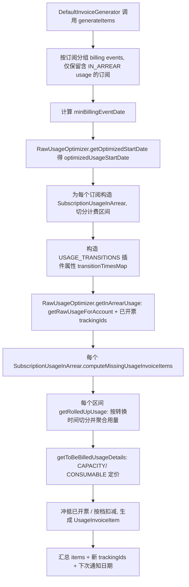
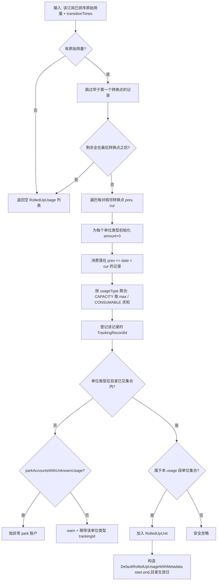
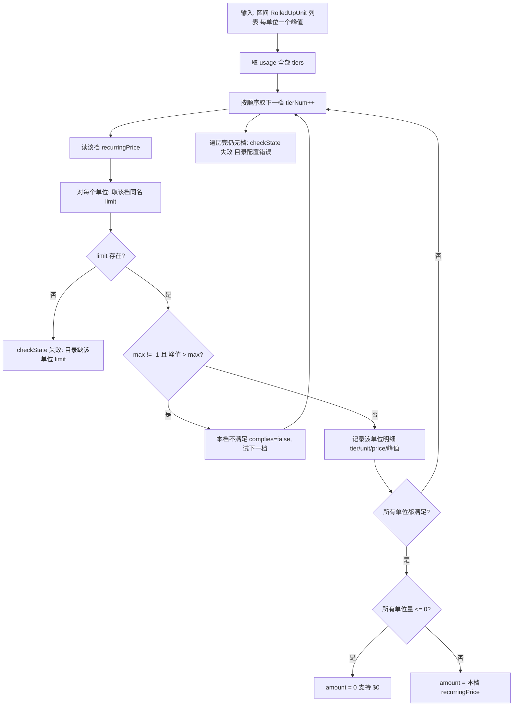
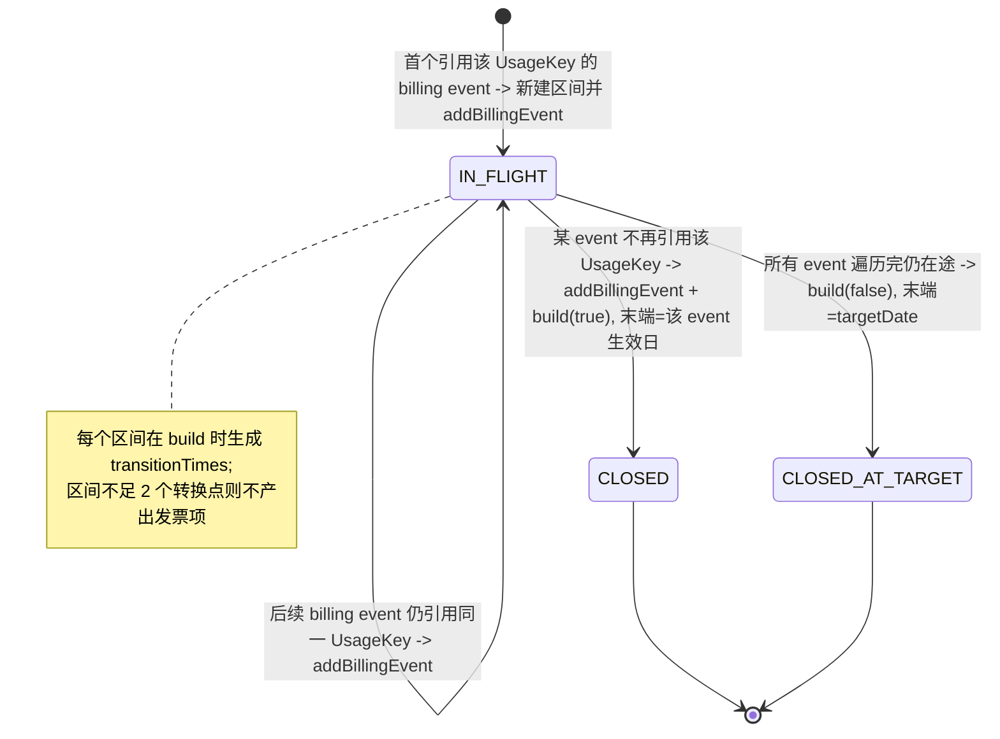

# usage 模块业务知识卡（补充：精确计价语义）

> 目的：补齐 `.bizdoc-kb2/cards/usage.md` 未覆盖的 **精确计价语义**（档位/限额/区块/计费策略/输出形态/晚到用量/缺失记录）。
> 源码根均为 `benchmark/killbill/` 下相对路径。
> 与既有卡的分工：既有卡讲「记录/存储/查询/插件/目录校验」；本文件讲「用量如何被定价、聚合、输出为发票项」。

---

## TERM-U1 区块（Block / TieredBlock）

- **类型**: 术语
- **同义词**: 区块, 计费块, 阶梯块, 分块, 块大小, tiered block, TieredBlock, block, block size, tieredBlock, 计价块
- **模块**: usage
- **置信度**: 🟢 confirmed
- **溯源**: `catalog/src/main/java/org/killbill/billing/catalog/DefaultBlock.java:49-97`, `catalog/src/main/java/org/killbill/billing/catalog/DefaultTieredBlock.java:38-60`

**含义**：CONSUMABLE IN_ARREAR 用量的最小计价单位（catalog 里的 `<tieredBlock>` / `<block>`）。字段：

- `unit`：单位名（引用 `DefaultUnit.name`，见 ENT-U6）。
- `size`：每「一块」包含多少个单位（`BigDecimal`）。
- `prices`：每块价格（`InternationalPrice`，多币种；取价用 `getPrice(currency)`）。
- `max`：该档允许的最大**块数**（`BigDecimal`）；`-1`/缺省表示无上限（见 BR-U3）。
- `type`：`BlockType`；`DefaultTieredBlock.getType()` 恒为 `TIERED`，普通 `<block>` 缺省 `VANILLA`。

**计价关联**：计价时把区间用量 `units` 换算为块数 `nbBlocks = ceil(units / size)`，再用 `price × nbBlocks`（见 BR-U4/BR-U5、ENT-U3）。

---

## TERM-U2 限额（Limit）

- **类型**: 术语
- **同义词**: 限额, 上限, 档位上限, 容量上限, 最大用量, limit, Limit, max, min
- **模块**: usage
- **置信度**: 🟢 confirmed
- **溯源**: `catalog/src/main/java/org/killbill/billing/catalog/DefaultLimit.java:44-66`, `catalog/src/main/java/org/killbill/billing/catalog/DefaultLimit.java:83-105`

**含义**：CAPACITY IN_ARREAR 的每档容量边界（catalog 里的 `<limit>`）。字段：

- `unit`：单位名（引用 `DefaultUnit.name`）。
- `min`：下限（`BigDecimal`，可空/哨兵 `-1`）。
- `max`：上限（`BigDecimal`，可空/哨兵 `-1`；`-1` 视为无上限）。

**初始化语义**：`initialize` 中 `maxHasValue = max != null && max != -1`、`minHasValue` 同理（因此 catalog 未写 max/min 会被 `CatalogSafetyInitializer` 填成 `-1`，等价于未设）。

**`compliesWith(value)`（通用限额校验，非定价路径）**：`maxHasValue && value > max → false`；否则 `!minHasValue || value <= min → true`。注意 min 的判定实现是「value ≤ min」，与直觉不同。

**CAPACITY 定价只用 `max`、忽略 `min`**（见 BR-U1/BR-U2）。

---

## TERM-U3 档位计费策略（TierBlockPolicy）

- **类型**: 术语
- **同义词**: 档位策略, 阶梯策略, 计费策略, 全档计价, 顶档计价, tier block policy, TierBlockPolicy, ALL_TIERS, TOP_TIER
- **模块**: usage
- **置信度**: 🟢 confirmed
- **溯源**: `catalog/src/main/java/org/killbill/billing/catalog/CatalogSafetyInitializer.java:60-72`, `invoice/src/main/java/org/killbill/billing/invoice/usage/ContiguousIntervalConsumableUsageInArrear.java:209-216`

**含义**：控制 CONSUMABLE IN_ARREAR 用量如何映射到档（tier），取值：

- `ALL_TIERS`：**逐档累进**——每一档只对自己区间内消耗的块数计价，各档金额求和（见 BR-U4）。**这是 catalog 未显式配置时的缺省值**（CatalogSafetyInitializer 填 `ALL_TIERS`）。
- `TOP_TIER`：**单一档计价**——整段用量按用量所落的那一个档的单价计算（见 BR-U5）。

**其它值**：`computeToBeBilledConsumableInArrear` 的 switch 落到 `default` 会抛 `IllegalStateException("Unknown TierBlockPolicy ...")`。

---

## TERM-U4 用量输出粒度（UsageDetailMode）

- **类型**: 术语
- **同义词**: 明细模式, 汇总模式, 聚合模式, 用量输出模式, usage detail mode, UsageDetailMode, AGGREGATE, DETAIL, item result behavior mode
- **模块**: usage
- **置信度**: 🟢 confirmed
- **溯源**: `util/src/main/java/org/killbill/billing/util/config/definition/InvoiceConfig.java:53-56`, `util/src/main/java/org/killbill/billing/util/config/definition/InvoiceConfig.java:174-182`

**含义**：控制 usage 发票项的生成粒度，由系统属性 `org.killbill.invoice.item.result.behavior.mode` 切换，**缺省 `AGGREGATE`**：

- `AGGREGATE`：每个计费区间、每个单位类型生成 **1 个** USAGE 发票项；`itemDetails` 写整个聚合体 JSON；金额为区间合计（见 BR-U7）。
- `DETAIL`：CONSUMABLE 对**每个档位明细**生成一个 USAGE 发票项（带 `quantity` 与 `rate`=档单价）；CAPACITY 仍是单项。

**关联读取点**：`UsageInvoiceItemGenerator` 在开票时读取该配置并传入每个结算区间（`invoice/src/main/java/org/killbill/billing/invoice/generator/UsageInvoiceItemGenerator.java:111`）。该配置可被租户级覆盖（`MultiTenantInvoiceConfig`）。

---

## TERM-U5 计费区间（ContiguousIntervalUsageInArrear）

- **类型**: 术语
- **同义词**: 计费区间, 连续区间, 在途区间, usage interval, contiguous interval, ContiguousIntervalUsageInArrear, in-arrear 区间
- **模块**: usage
- **置信度**: 🟢 confirmed
- **溯源**: `invoice/src/main/java/org/killbill/billing/invoice/usage/ContiguousIntervalUsageInArrear.java:78-92`, `invoice/src/main/java/org/killbill/billing/invoice/usage/ContiguousIntervalUsageInArrear.java:131-153`

**含义**：针对「一个订阅 + 一个 usage 段 + 一个目录版本」的 in-arrear 计价单元，由一段连续的 billing events 构成（`build()` 时生成转换时间）。抽象基类在构造时按 usageType 决定参与计价的单位类型集合：CAPACITY → 各档 `Limit.getUnit().getName()`，CONSUMABLE → 各档 `TieredBlock.getUnit().getName()`（`invoice/src/main/java/org/killbill/billing/invoice/usage/ContiguousIntervalUsageInArrear.java:142`）。

**两个具体子类**：

- `ContiguousIntervalCapacityUsageInArrear`（CAPACITY）
- `ContiguousIntervalConsumableUsageInArrear`（CONSUMABLE）

**区间有效性**：`transitionTimes.size() < 2`（不足一个完整区间）时不产生任何发票项（`invoice/src/main/java/org/killbill/billing/invoice/usage/ContiguousIntervalUsageInArrear.java:277-279`）。

---

## TERM-U6 转换时间（TransitionTime）

- **类型**: 术语
- **同义词**: 转换时间, 计费边界, 计费颗粒点, 计费周期边界, transition time, TransitionTime, billing transition
- **模块**: usage
- **置信度**: 🟢 confirmed
- **溯源**: `invoice/src/main/java/org/killbill/billing/invoice/usage/ContiguousIntervalUsageInArrear.java:104-129`, `invoice/src/main/java/org/killbill/billing/invoice/usage/ContiguousIntervalUsageInArrear.java:184-254`

**含义**：计费区间内的边界时刻，对齐到订阅的 BCD（bill cycle day）并按 `billingPeriod` 分隔；首个/末个转换点可能不对齐（受首个 billing event、`targetDate`、退订日影响）。N 个转换点划分出 **N−1** 个半开区间 `[prev, cur)`，每个区间独立聚合、定价、生成发票项。

**每个转换点绑定一个 billing event**（`targetBillingEvent`），用于取该区间的目录生效日、货币、产品/套餐名等。`build(closedInterval)`：`closedInterval=true` 表示该区间由最后一个 billing event 关闭（区间末端 = 该 event 生效日）；`false` 表示进行中，末端 = `targetDate` 当天末刻。

**退订当日特殊处理**：若最后转换点对应 CANCEL 且用量日期等于该转换点，则该用量点被纳入区间（以便对退订当日上报的用量计费，`invoice/src/main/java/org/killbill/billing/invoice/usage/ContiguousIntervalUsageInArrear.java:224-229`、`invoice/src/main/java/org/killbill/billing/invoice/usage/ContiguousIntervalUsageInArrear.java:439-471`）。

---

## TERM-U7 带目录版本的用量区间（RolledUpUsageWithMetadata）

- **类型**: 术语
- **同义词**: 带元数据用量区间, 目录生效日用量, usage with metadata, RolledUpUsageWithMetadata, catalog effective date, DefaultRolledUpUsageWithMetadata
- **模块**: usage
- **置信度**: 🟢 confirmed
- **溯源**: `invoice/src/main/java/org/killbill/billing/invoice/usage/RolledUpUsageWithMetadata.java:24-27`, `invoice/src/main/java/org/killbill/billing/invoice/usage/DefaultRolledUpUsageWithMetadata.java:27-66`

**含义**：开票侧聚合结果，在 `RolledUpUsage`（`subscriptionId` + `[start,end)` + `rolledUpUnits`）之上额外带 `catalogEffectiveDate`。用途：保证区间以「该边界时刻对应的目录版本」定价，避免跨目录版本误用价格/档位（见 BR-U13）。

**构造点**：`ContiguousIntervalUsageInArrear#getRolledUpUsage` 中，每个区间用 `prevCatalogEffectiveDate`（上一转换点的 billing event 目录生效日）构造（`invoice/src/main/java/org/killbill/billing/invoice/usage/ContiguousIntervalUsageInArrear.java:507`）。

---

## ENT-U1 目录档位（Tier）

- **类型**: 业务实体
- **同义词**: 档位, 阶梯, 计费档, usage tier, Tier, DefaultTier, tier, 档
- **模块**: usage
- **置信度**: 🟢 confirmed
- **溯源**: `catalog/src/main/java/org/killbill/billing/catalog/DefaultTier.java:47-61`, `catalog/src/main/java/org/killbill/billing/catalog/DefaultTier.java:94-113`

**字段**：

- `limits`（`DefaultLimit[]`）：CAPACITY 用。
- `blocks`（`DefaultTieredBlock[]`）：CONSUMABLE 用。
- `fixedPrice`（`InternationalPrice`，可空）。
- `recurringPrice`（`InternationalPrice`，可空）。

**关键点**：**CAPACITY IN_ARREAR 计价只读 `recurringPrice`**（`ContiguousIntervalCapacityUsageInArrear.java:125`），`fixedPrice` 不参与 in-arrear usage 定价（尽管目录允许定义）。tiers 的顺序即档位匹配优先级（见 BR-U1）。

**档级校验**：`DefaultTier.validate` 要求 IN_ARREAR CAPACITY 必须定义 limits、IN_ARREAR CONSUMABLE 必须定义 blocks（见 BR-U17）。

---

## ENT-U2 用量计价明细（UsageInArrearTierUnitDetail）

- **类型**: 业务实体
- **同义词**: 用量计价明细, 档位单位明细, 计价明细, usage tier unit detail, UsageInArrearTierUnitDetail, tier detail, quantity
- **模块**: usage
- **置信度**: 🟢 confirmed
- **溯源**: `invoice/src/main/java/org/killbill/billing/invoice/usage/details/UsageInArrearTierUnitDetail.java:26-59`

**结构**：`tier`（档号，从 1 起）、`tierUnit`（单位类型）、`tierPrice`（该档单价）、`quantity`。

**用途**：作为 `itemDetails` 序列化进 USAGE 发票项（JSON 字段名 `tier`/`tierUnit`/`tierPrice`/`quantity`），用于事后对账/补开时还原分档用量（见 BR-U8/BR-U9）。CAPACITY 与 CONSUMABLE 的聚合明细都继承自此。

---

## ENT-U3 消费型分档明细（UsageConsumableInArrearTierUnitAggregate）

- **类型**: 业务实体
- **同义词**: 消费型明细, 分档计价明细, consumable 明细, UsageConsumableInArrearTierUnitAggregate, tierBlockSize, consumable aggregate
- **模块**: usage
- **置信度**: 🟢 confirmed
- **溯源**: `invoice/src/main/java/org/killbill/billing/invoice/usage/details/UsageConsumableInArrearTierUnitAggregate.java:28-84`

**结构**：继承 `UsageInArrearTierUnitDetail`，额外含 `tierBlockSize`（块大小）、`amount`。

**计价公式**：`amount = tierPrice × quantity`（`computeAmount`，`UsageConsumableInArrearTierUnitAggregate.java:82-84`）。

**累加语义**：`updateQuantityAndAmount(additionalQuantity)` 把 quantity 加上并用新 quantity 重算 amount（`UsageConsumableInArrearTierUnitAggregate.java:77-80`），用于把**同一档**在多次已开票明细中的量合并（见 BR-U8）。

---

## ENT-U4 容量型聚合（UsageCapacityInArrearAggregate）

- **类型**: 业务实体
- **同义词**: 容量型聚合, 容量计价结果, capacity aggregate, UsageCapacityInArrearAggregate, capacity tier detail
- **模块**: usage
- **置信度**: 🟢 confirmed
- **溯源**: `invoice/src/main/java/org/killbill/billing/invoice/usage/details/UsageCapacityInArrearAggregate.java:26-48`

**结构**：`tierDetails`（`List<UsageInArrearTierUnitDetail>`，每个参与计价的单位类型一条）+ `amount`（该区间的应计金额，来自所命中档的 `recurringPrice`；若所有单位用量均 ≤ 0 则 `amount=0`，见 BR-U2）。实现 `UsageInArrearAggregate`（只暴露 `getAmount()`）。

---

## ENT-U5 消费型聚合（UsageConsumableInArrearAggregate）

- **类型**: 业务实体
- **同义词**: 消费型聚合, 消费计价结果, consumable aggregate, UsageConsumableInArrearAggregate
- **模块**: usage
- **置信度**: 🟢 confirmed
- **溯源**: `invoice/src/main/java/org/killbill/billing/invoice/usage/details/UsageConsumableInArrearAggregate.java:26-56`

**结构**：`tierDetails`（`List<UsageConsumableInArrearTierUnitAggregate>`，每档一条）+ `amount`。`amount = Σ tierDetails.amount`（构造时 `computeAmount` 求和，`UsageConsumableInArrearAggregate.java:50-56`）。这即是 ALL_TIERS「逐档求和」的实现（见 BR-U4）。

---

## ENT-U6 目录单位（DefaultUnit）

- **类型**: 业务实体
- **同义词**: 目录单位, 单位定义, 计量单位名, catalog unit, DefaultUnit, Unit, unit name, prettyName
- **模块**: usage
- **置信度**: 🟢 confirmed
- **溯源**: `catalog/src/main/java/org/killbill/billing/catalog/DefaultUnit.java:36-51`, `catalog/src/main/java/org/killbill/billing/catalog/DefaultUnit.java:64-71`

**结构**：`name`（唯一 ID）+ `prettyName`（可空，缺省初始化为 `name`）。catalog 的 `<units><unit name="..."/></units>` 定义；tier 的 limit/block 通过引用该 name 绑定。

**与用量记录的关系**：写入 `rolled_up_usage.unit_type` 的字符串必须等于该 `name`，开票侧才能把用量对上价（大小写/拼写敏感）。

---

## ENT-U7 原始用量拉取结果（RawUsageOptimizer.RawUsageResult）

- **类型**: 业务实体
- **同义词**: 原始用量结果, 拉取用量结果, raw usage result, RawUsageResult, existingTrackingIds, 已开票跟踪号
- **模块**: usage
- **置信度**: 🟢 confirmed
- **溯源**: `invoice/src/main/java/org/killbill/billing/invoice/usage/RawUsageOptimizer.java:212-229`, `invoice/src/main/java/org/killbill/billing/invoice/usage/RawUsageOptimizer.java:85-98`

**结构**：`rawUsage`（`List<RawUsageRecord>`，来自 `InternalUserApi.getRawUsageForAccount`）+ `existingTrackingIds`（`Set<TrackingRecordId>`，该账户在拉取区间内**已开票**的用量跟踪号，来自 `invoiceDao.getTrackingsByDateRange`）。

**用途**：开票侧据此区分「本次新用量」与「已开票用量」，实现发票级去重与补开（见 BR-U21）。

---

## BR-U1 CAPACITY 档位选择：取第一个「所有单位都 ≤ max」的档

- **类型**: 业务规则
- **同义词**: 容量选档, 峰值选档, 容量取档, capacity tier selection, first matching tier, 档位匹配
- **模块**: usage
- **置信度**: 🟢 confirmed
- **溯源**: `invoice/src/main/java/org/killbill/billing/invoice/usage/ContiguousIntervalCapacityUsageInArrear.java:104-153`

**规则**：按 catalog 中 tiers 的顺序遍历。对每个候选档：

1. 对每个参与计价的单位类型 `ro`，取该档中单位名匹配的 `limit`（`getTierLimit`；若该档缺该单位的 limit → `checkState(false)`，视为目录错误，见 BR-U18）。
2. 若该单位的峰值（`RolledUpUnit.amount`；区间内 CAPACITY 取最大值，见既有 BR-011）`> limit.max` 且 `max ≠ -1` → 本档不满足，进入下一档。
3. 所有单位都满足 → **命中该档并立即返回**（取第一个命中档）。

**含义**：CAPACITY 的「峰值」是**区间内每个单位类型各自取 max**（而非各单位的和），然后选取能同时容纳所有单位峰值的**最低档**。档位必须连续（注释说明：因此只看 max、忽略 min）。

---

## BR-U2 CAPACITY 金额 = 命中档的 recurringPrice；忽略 min；支持 $0

- **类型**: 业务规则
- **同义词**: 容量计价, 容量价格, capacity pricing, recurringPrice 计价, 档位价格, 忽略min
- **模块**: usage
- **置信度**: 🟢 confirmed
- **溯源**: `invoice/src/main/java/org/killbill/billing/invoice/usage/ContiguousIntervalCapacityUsageInArrear.java:123-147`, `catalog/src/main/java/org/killbill/billing/catalog/DefaultTier.java:109-112`

**规则**：命中档的应计金额 = 该档 `recurringPrice.getPrice(getCurrency())`（**不是** `fixedPrice`，**也不是**「单价 × 单位数」）。代码注释明确：忽略 min，只看 max，因为档位应当连续。

**$0 支持**：若所有参与单位的量都 `≤ 0`（`allUnitAmountToZero`），则将金额置为 `0`，以便生成 $0 usage 项（见 BR-U15）。

**明细**：为每个单位类型各记一条 `UsageInArrearTierUnitDetail(tierNum, unitType, tierPrice=命中档价格, quantity=观测峰值)`（每个单位类型只记一次，`perUnitTypeDetailTierLevel` 去重）。

---

## BR-U3 哨兵值 -1 / 缺省 = 「无上限」

- **类型**: 业务规则
- **同义词**: 无上限, 无限制, 哨兵值, sentinel max, unlimited, -1 max, 无限档, 最后档
- **模块**: usage
- **置信度**: 🟢 confirmed
- **溯源**: `invoice/src/main/java/org/killbill/billing/invoice/usage/ContiguousIntervalCapacityUsageInArrear.java:132-136`, `invoice/src/main/java/org/killbill/billing/invoice/usage/ContiguousIntervalConsumableUsageInArrear.java:239-241`, `catalog/src/main/java/org/killbill/billing/catalog/CatalogSafetyInitializer.java:36-38`

**规则**：`limit.max` 或 `tieredBlock.max` 等于 `-1` 表示**无上限**，代码用常量 `new BigDecimal("-1")` 比较。由于 `CatalogSafetyInitializer` 会把 catalog 中未配置的 `BigDecimal` 字段统一填为 `-1`，**「未写 max」等价于无上限**。

**分支语义**：

- CAPACITY：`max == -1` 时该单位恒满足，不再比较（常用于最后一档，使配置校验通过）。
- CONSUMABLE `ALL_TIERS`：`max == -1` 时不封顶，该档消费全部剩余单位。
- CONSUMABLE `TOP_TIER`：`tmp > max` 中 `max=-1` 恒成立（注意其后果，见 BR-U5）。

---

## BR-U4 CONSUMABLE · ALL_TIERS：逐档分块累进计价

- **类型**: 业务规则
- **同义词**: 累进计价, 阶梯计价, 逐档分块, all tiers, progressive pricing, block tiering, 分档计费
- **模块**: usage
- **置信度**: 🟢 confirmed
- **溯源**: `invoice/src/main/java/org/killbill/billing/invoice/usage/ContiguousIntervalConsumableUsageInArrear.java:219-266`

**规则**（对每个单位类型独立计算；`units` 为该区间用量）：

1. 从第 1 档开始，对每档的 `tieredBlock`：`tmp = ceil(remainingUnits / size)`（`divideAndRemainder`，余数非 0 则商 +1）。
2. 若 `max ≠ -1` 且 `tmp > max` → 本档用满 `max` 块，`remainingUnits -= max × size`，继续下一档；否则本档用 `tmp` 块，`remainingUnits = 0`。
3. 每档金额 = `tierPrice × nbUsedTierBlocks`；总金额 = 各档金额之和（`UsageConsumableInArrearAggregate`）。
4. 生成明细的条件：`tierNum == 1`（即使 0 块也生成，用以支持 $0）或本档 `nbUsedTierBlocks > 0`。

**含义**：这是**累进/阶梯**计价——每档只计价落入自己区间的块数。例如 size=1000、max=10（即 ≤10000 单位）在 0.5/块，超出部分进入下一档按该档价计。

---

## BR-U5 CONSUMABLE · TOP_TIER：整段用量按命中的单一档计价

- **类型**: 业务规则
- **同义词**: 顶档计价, 单档计价, 命中档计价, top tier, flat tier pricing, 最高档
- **模块**: usage
- **置信度**: 🟢 confirmed
- **溯源**: `invoice/src/main/java/org/killbill/billing/invoice/usage/ContiguousIntervalConsumableUsageInArrear.java:268-299`

**规则**：

1. 顺序遍历档，累减 `remainingUnits`：对每档计算 `tmp = ceil(remainingUnits / size)`；若 `tmp > max` → `remainingUnits -= max × size` 并继续；否则 `targetTier = 本档`、停止。
2. 默认 `targetTier` = 最后一档（遍历未命中时）。
3. 最终**块数用「总 units」而非剩余量**计算：`nbBlocks = ceil(units / targetTier.size)`；`amount = targetTier.price × nbBlocks`。

**含义**：整段用量按所落的**那一个档**的单价计算（非累进），即「达到某档后整量按该档计费」。

**注意**：由于 `tmp > max` 在 `max=-1` 时恒成立，配置为无上限（-1）的档在循环中**会被跳过**；只有循环自然结束才回落到最后一档。因此 TOP_TIER 的最后一档通常应配置为 -1。

---

## BR-U6 金额按货币精度舍入（KillBillMoney.of）

- **类型**: 业务规则
- **同义词**: 金额取整, 货币精度, 金额舍入, rounding, KillBillMoney, 四舍五入
- **模块**: usage
- **置信度**: 🟢 confirmed
- **溯源**: `invoice/src/main/java/org/killbill/billing/invoice/usage/ContiguousIntervalUsageInArrear.java:322-326`

**规则**：分档/分块算出的原始金额 `toBeBilledUsageUnrounded` 乘以/相加得到后，先用 `KillBillMoney.of(amount, currency)` 按该货币的小数精度舍入，得到 `toBeBilledUsage`（对应 killbill issue #1124）。**所有后续冲抵、输出均使用舍入后的金额**。

---

## BR-U7 已开票金额冲抵：实际开票 = 应计 − 已开票

- **类型**: 业务规则
- **同义词**: 冲抵, 已开票扣减, 重复计费防护, reconcile, billed usage offset, amountToBill
- **模块**: usage
- **置信度**: 🟢 confirmed
- **溯源**: `invoice/src/main/java/org/killbill/billing/invoice/usage/ContiguousIntervalUsageInArrear.java:561-598`, `invoice/src/main/java/org/killbill/billing/invoice/usage/ContiguousIntervalCapacityUsageInArrear.java:78-96`, `invoice/src/main/java/org/killbill/billing/invoice/usage/ContiguousIntervalConsumableUsageInArrear.java:88-101`

**规则**：

- `computeBilledUsage` 把同一 usage 段、同一区间、**已存在的 USAGE 发票项的金额相加**（按金额，而非按量）。
- `getBilledItems` 只挑出同 usage 名、且 `[startDate,endDate]` 被已有项完全覆盖的 USAGE 项；长度为 0 的同日项会被排除（避免同日换套餐重复）。
- 实际开票金额 `amountToBill = 应计(toBeBilledUsage) − 已开票(billedUsage)`。

**负值处理**：`amountToBill < 0` 时——dry-run 或 `org.killbill.invoice.usage.missing.lenient=true` → 静默跳过；否则抛 `InvoiceApiException`（`ILLEGAL INVOICING STATE: Usage period start=..., end=..., amountToBill=...`）。

**何时不生成项**：已开票过该区间且 `amountToBill == 0` → 不生成（除非从未开票）。

---

## BR-U8 明细模式 + ALL_TIERS 下改用「按档扣减」而非金额冲抵

- **类型**: 业务规则
- **同义词**: 明细不冲抵, 分档对账, detail offset, ALL_TIERS reconcile, 按档扣减
- **模块**: usage
- **置信度**: 🟢 confirmed
- **溯源**: `invoice/src/main/java/org/killbill/billing/invoice/usage/ContiguousIntervalConsumableUsageInArrear.java:78-121`, `invoice/src/main/java/org/killbill/billing/invoice/usage/ContiguousIntervalConsumableUsageInArrear.java:156-197`

**规则**：当 `tierBlockPolicy == ALL_TIERS` **且**历史发票项都带 `itemDetails`（`areAllBilledItemsWithDetails`）时，`amountToBill` 直接等于应计金额（**不再减** `billedUsage`）——因为冲抵转为「按档减历史量」：`getBilledDetailsForUnitType` 从历史发票项的 `itemDetails` 中抽取该单位类型的各档 quantity，用 `TreeMap`（按档号升序）合并，同档用 `updateQuantityAndAmount` 累加，随后在分档计算时从 `nbUsedTierBlocks` 中扣除（见 BR-U9）。TOP_TIER 与非明细历史仍走 BR-U7 的金额冲抵。

**DETAIL vs AGGREGATE 的历史解析差异**：DETAIL 下 `itemDetails` 是**单条** `UsageConsumableInArrearTierUnitAggregate`，quantity 取发票项自身的 `quantity`（并补上 `bi.getRate()` 作 tierPrice，对应 issue #1325）；AGGREGATE 下 `itemDetails` 是 `UsageConsumableInArrearAggregate`，需展开其 `tierDetails`。

---

## BR-U9 分档扣减历史用量；历史缺失时报错（或按配置放宽）

- **类型**: 业务规则
- **同义词**: 历史用量扣减, 缺失历史用量, missing usage, previous usage, 补开用量, 用量缺失
- **模块**: usage
- **置信度**: 🟢 confirmed
- **溯源**: `invoice/src/main/java/org/killbill/billing/invoice/usage/ContiguousIntervalConsumableUsageInArrear.java:246-260`

**规则**（ALL_TIERS，且存在历史用量 `previousUsage` 时）：本档 `nbUsedTierBlocks` 减去历史同档 quantity。存在两个断言：

- `tierNum < lastPreviousUsageTier`（历史中间档）时，`nbUsedTierBlocks` 必须与历史 quantity **完全相等**（历史必须已把该档用满）。
- 落在最后一历史档时，`nbUsedTierBlocks − previousQuantity ≥ 0`（当前用量不得少于历史）。

当历史记录不完整（例如过去某区间的用量未上报/未开票）时，断言失败会抛异常。**放宽条件**：`isDryRun == true` 或 `org.killbill.invoice.usage.missing.lenient == true` 时跳过这两个断言。

**含义**：这是防止「历史用量丢失导致重复计费或漏计」的对账护栏；与该配置对应的宽松语义见 BR-U14/BR-U16。

---

## BR-U10 未知单位类型：park 账户或忽略并移除其 trackingId

- **类型**: 业务规则
- **同义词**: 未知单位, 未定义单位, 目录外单位, unknown unit type, park accounts, 忽略单位
- **模块**: usage
- **置信度**: 🟢 confirmed
- **溯源**: `invoice/src/main/java/org/killbill/billing/invoice/usage/ContiguousIntervalUsageInArrear.java:481-506`

**规则**：聚合区间用量时，若某 `unitType` **不在当前 billing event 已收集到的单位类型集合**内（即目录中未定义）：

- 若 `org.killbill.invoice.parkAccountsWithUnknownUsage == true` → 抛 `InvoiceApiException`（`ILLEGAL INVOICING STATE: unit type ... is not defined in the catalog ...`），使账户被 park（见既有 BR-015）。
- 否则仅记 `warn` 并跳过该单位类型；同时把该 unitType 对应的 trackingId 从本次结果中**移除**，避免它被当作「已开票」而掩盖未定义用量。

**对比**：若 unitType 是目录中已知的、但不属于**当前 usage 段**（`unitTypes.contains` 为 false），则安全忽略，不告警、不影响 trackingId。

---

## BR-U11 开票侧原始用量按复合键排序（非落库顺序）

- **类型**: 业务规则
- **同义词**: 用量排序, 开票排序, raw usage sort, composite comparator, 排序键
- **模块**: usage
- **置信度**: 🟢 confirmed
- **溯源**: `invoice/src/main/java/org/killbill/billing/invoice/usage/SubscriptionUsageInArrear.java:61-88`, `invoice/src/main/java/org/killbill/billing/invoice/usage/SubscriptionUsageInArrear.java:143-146`

**规则**：开票前，先按 `subscriptionId` 过滤该订阅的原始用量，再按复合比较器升序排序：`(subscriptionId, recordDate, unitType, amount, trackingId)`。区间消费算法依赖此顺序（见 WF-U2）。

**与既有 BR-007 的区别**：DB 查询返回顺序是 `order by record_id`（提交顺序，见既有 BR-007）；开票侧**不依赖**它，而是自行按日期排序，从而保证区间切分与到达顺序无关。

---

## BR-U12 缺省档位策略 = ALL_TIERS（逐档累进）

- **类型**: 业务规则
- **同义词**: 默认档位策略, 默认计价策略, default tier policy, ALL_TIERS default
- **模块**: usage
- **置信度**: 🟢 confirmed
- **溯源**: `catalog/src/main/java/org/killbill/billing/catalog/CatalogSafetyInitializer.java:60-72`

**规则**：catalog 未显式写 `tierBlockPolicy` 时，初始化阶段填入 `TierBlockPolicy.ALL_TIERS`。即**默认采用逐档累进计价**（见 BR-U4），而非 TOP_TIER。若要单档计价必须显式写 `tierBlockPolicy="TOP_TIER"`。

---

## BR-U13 计费区间按 (usage 名, 目录生效日) 分段；目录变更即为边界

- **类型**: 业务规则
- **同义词**: 目录版本分段, usage 段分段, 目录变更边界, catalog version boundary, usage key, 分段计价
- **模块**: usage
- **置信度**: 🟢 confirmed
- **溯源**: `invoice/src/main/java/org/killbill/billing/invoice/usage/SubscriptionUsageInArrear.java:160-227`, `invoice/src/main/java/org/killbill/billing/invoice/usage/SubscriptionUsageInArrear.java:283-316`

**规则**：计费区间以键 `(usageName, catalogEffectiveDate)` 标识（`UsageKey`，catalogVersion 用 `compareTo == 0` 判等）。遍历订阅的 billing events：

- 若某 billing event 引用同一 `UsageKey` → 沿用「在途区间」（`inFlightInArrearUsageIntervals`），追加该 event。
- 若某 `UsageKey` 不再被任何 event 引用（usage 段被移除，或目录版本变化产生新 key）→ 关闭该区间（`build(true)`）。
- 遍历结束后仍在途的区间以 `targetDate` 收尾（`build(false)`）。

**含义**：同一订阅可能产生**多个** `ContiguousIntervalUsageInArrear`，各自用其边界时刻的目录版本定价；每个区间独立计算发票项。

---

## BR-U14 回溯窗口：readMaxRawUsagePreviousPeriod（默认 2）

- **类型**: 业务规则
- **同义词**: 回溯窗口, 回看周期, 历史用量窗口, lookback window, readMaxRawUsagePreviousPeriod, 晚到用量
- **模块**: usage
- **置信度**: 🟢 confirmed
- **溯源**: `util/src/main/java/org/killbill/billing/util/config/definition/InvoiceConfig.java:124-132`, `invoice/src/main/java/org/killbill/billing/invoice/usage/RawUsageOptimizer.java:77-137`

**规则**：拉取原始用量的起点 `optimizedStartDate`：

- 若 `org.killbill.invoice.readMaxRawUsagePreviousPeriod`（**默认 2**，单位=计费周期数）`< 0` → 不做优化，取 `firstEventStartDate`。
- 否则：按 catalog 中所有 usage 的 `billingPeriod` 分组，取各周期最近一次已开票 USAGE 项的 `endDate`（`getBillingPeriodMinDate1`），向前回退该配置数量的周期，取最早者作为起点（但不早于 `firstEventStartDate`）。
- 特例：若 `org.killbill.invoice.disable.usage.zero.amount == true`（`isUsageZeroAmountDisabled`），改用 `getBillingPeriodMinDate2`：以 `min(UTC today, targetDate)` 为基准回退 1 个周期（假设开票已跟上，简化逻辑）。

**晚到/乱序用量的后果**：该窗口决定「多久以前的上报仍会被拉取」。**早于窗口且此前未开票的用量记录不会被拉取/计费**（可能漏计）；窗口设得越大越安全但越慢。因此该值必须覆盖最大延迟上报跨度。

**终点**：拉取终点用 `targetDate` 当天末刻（账户时区转 UTC），查询为右闭（见 BR-U19）。

---

## BR-U15 $0 用量项：生成与过滤

- **类型**: 业务规则
- **同义词**: 零金额用量, 空用量项, $0 usage, zero amount, disable.usage.zero.amount, 用量为零
- **模块**: usage
- **置信度**: 🟢 confirmed
- **溯源**: `invoice/src/main/java/org/killbill/billing/invoice/usage/ContiguousIntervalUsageInArrear.java:516-530`, `invoice/src/main/java/org/killbill/billing/invoice/usage/ContiguousIntervalCapacityUsageInArrear.java:127-146`, `invoice/src/main/java/org/killbill/billing/invoice/generator/InvoiceWithMetadata.java:92-112`, `util/src/main/java/org/killbill/billing/util/config/definition/InvoiceConfig.java:84-92`

**生成侧**：系统刻意支持「无/零用量区间」的 $0 项——

- 完全没有原始用量时，`getEmptyRolledUpUsage` 为每个单位类型构造一个 `amount=0` 的区间（取最后两个转换点）。
- CAPACITY 的 `allUnitAmountToZero` 分支把金额置 0。
- CONSUMABLE 第 1 档即使 0 块也生成明细。

**过滤侧**：系统属性 `org.killbill.invoice.disable.usage.zero.amount`（**默认 false**）控制是否**移除** $0 USAGE 项。为 true 时，`InvoiceWithMetadata.build()` 过滤掉 `type == USAGE` 且 `amount == 0` 且（`quantity == null` 或 `quantity ≤ 0`）的项；若过滤后发票无任何项 → **发票变为 null**（不生成空发票）。

**双重影响**：该开关同时改变回溯窗口算法（见 BR-U14），开启后需保证开票及时，否则可能漏计旧周期。

---

## BR-U16 IN_ADVANCE 用量计费：目录可定义，但开票路径未实现

- **类型**: 业务规则
- **同义词**: 预付用量未实现, 预付费用量, IN_ADVANCE 未支持, not implemented, unsupported billing mode
- **模块**: usage
- **置信度**: 🟢 confirmed
- **溯源**: `invoice/src/main/java/org/killbill/billing/invoice/generator/UsageInvoiceItemGenerator.java:229-244`, `invoice/src/main/java/org/killbill/billing/invoice/generator/UsageInvoiceItemGenerator.java:147-151`

**规则**：

- 目录允许定义 `IN_ADVANCE` 的 CAPACITY/CONSUMABLE（见既有 BR-013），但**用量开票只处理 `IN_ARREAR`**：`findUsageInArrearUsages` 显式跳过非 `IN_ARREAR` 的 usage 段。
- `updatePerSubscriptionNextNotificationUsageDate` 在 `IN_ADVANCE` 分支直接 `throw new IllegalStateException("Not implemented Yet)")`。

**结论**：**今日实际可被计费的用量只有 `IN_ARREAR`**；`IN_ADVANCE` 的 usage 定义不会产生用量发票项。

---

## BR-U17 档级目录校验：IN_ARREAR CAPACITY 需 limits、CONSUMABLE 需 blocks

- **类型**: 业务规则
- **同义词**: 档位校验, 档级校验, tier validation, IN_ARREAR limits, IN_ARREAR blocks
- **模块**: usage
- **置信度**: 🟢 confirmed
- **溯源**: `catalog/src/main/java/org/killbill/billing/catalog/DefaultTier.java:148-159`

**规则**（`DefaultTier.validate`，在 catalog 加载时执行）：

- `IN_ARREAR` + `CAPACITY` 且 `limits.length == 0` → 报错「needs to define some limits」。
- `IN_ARREAR` + `CONSUMABLE` 且 `blocks.length == 0` → 报错「needs to define some blocks」。

**与既有 BR-013 的分工**：既有 BR-013 是 **usage 段级**校验（`DefaultUsage.validate`：IN_ADVANCE+CAPACITY 需 limits、IN_ADVANCE+CONSUMABLE 需 blocks、IN_ARREAR 需 tiers）；本条是**档级**校验。二者共同决定一个合法的 in-arrear usage 目录结构。

---

## BR-U18 每个档必须为每个单位定义 limit/block；否则定价报错

- **类型**: 业务规则
- **同义词**: 档位单位缺失, 单位必须定义, missing tier block, missing limit, 目录缺单位
- **模块**: usage
- **置信度**: 🟢 confirmed
- **溯源**: `invoice/src/main/java/org/killbill/billing/invoice/usage/UsageUtils.java:34-54`, `invoice/src/main/java/org/killbill/billing/invoice/usage/ContiguousIntervalCapacityUsageInArrear.java:104-112`

**规则**：

- CONSUMABLE：`getConsumableInArrearTieredBlocks` 对**每个档**查找与 `unitType` 同名的 `tieredBlock`；若某档缺失 → `Preconditions.checkState` 失败（"Missing tierBlock definition for unit ..."）。返回的列表顺序与档顺序一一对应（供逐档计算）。
- CAPACITY：`getTierLimit` 对每档查找同名 `limit`；缺失 → `checkState(false)`。

**含义**：一个 usage 段内，**每个档都必须为每个参与计价的单位各定义一个 block/limit**，不能只在一部分档里定义；否则开票直接抛异常（目录错误，非运行时数据问题）。

---

## BR-U19 时间边界：账户时区日界 + usage.tz.mode（默认 FIXED）

- **类型**: 业务规则
- **同义词**: 时区, 日边界, 夏令时, day boundary, account timezone, usage tz mode, end of day, FIXED, VARIABLE
- **模块**: usage
- **置信度**: 🟢 confirmed
- **溯源**: `invoice/src/main/java/org/killbill/billing/invoice/usage/UsageClockUtil.java:50-90`, `util/src/main/java/org/killbill/billing/util/config/definition/InvoiceConfig.java:185-193`

**规则**：计费区间边界按账户时区换算，再转 UTC：

- 区间起点：`toDateTimeAtStartOfDay`（当天 00:00:00.000）。
- 区间终点：`toDateTimeAtEndOfDay`（次日 00:00:00.000 − 1ms）。

`org.killbill.invoice.usage.tz.mode`（**默认 `FIXED`**）控制偏移计算：

- `FIXED`：使用账户创建时的固定偏移（`context.getFixedOffsetTimeZone()`），与其它发票项一致。
- `VARIABLE`：按事件日期重新计算偏移（`context.getAccountTimeZone()`），使「相同 TZ、相同订阅、相同用量点」的账户在夏令时下得到一致结果（对应 killbill issue #1934）。

**关联**：拉取原始用量的终点即 `targetDate` 当天末刻（见 BR-U14、既有 WF-004）。

---

## BR-U20 已完全覆盖的区间直接跳过（防 blocking 重复计费）

- **类型**: 业务规则
- **同义词**: 区间已开票跳过, 完全覆盖, covered period skip, isContainedIntoExistingUsage, 防重复
- **模块**: usage
- **置信度**: 🟢 confirmed
- **溯源**: `invoice/src/main/java/org/killbill/billing/invoice/usage/ContiguousIntervalUsageInArrear.java:300-307`, `invoice/src/main/java/org/killbill/billing/invoice/usage/ContiguousIntervalUsageInArrear.java:333-356`

**规则**：对每个待计费区间，若已存在同 usage 名、同类型的 USAGE 发票项**完全包含**该区间（`usageInput.start ≤ 区间start 且 区间end < usageInput.end`，或 `usageInput.start < 区间start 且 区间end ≤ usageInput.end`；两者取其一），则**整段跳过**并记 warn（"Ignoring usage ... as it has already been invoiced"）。

**例外**：当区间起止同日（`startDate == endDate`，例如同日换套餐）时禁用该检查，交由后续金额/按档对账处理。

**含义**：blocking event 重算可能导致区间起止与已开票项不同；此检查避免对已覆盖区间重复计费。

---

## BR-U21 发票级去重：TrackingRecordId 相似判定（不含 invoiceId）

- **类型**: 业务规则
- **同义词**: 用量发票去重, tracking 去重, 发票级幂等, TrackingRecordId, isSimilarRecord, 相似记录
- **模块**: usage
- **置信度**: 🟢 confirmed
- **溯源**: `invoice/src/main/java/org/killbill/billing/invoice/usage/ContiguousIntervalUsageInArrear.java:286-292`, `invoice/src/main/java/org/killbill/billing/invoice/generator/InvoiceWithMetadata.java:181-234`

**规则**：开票侧为每条被消费的用量记录构造 `TrackingRecordId(trackingId, invoiceId, subscriptionId, unitType, recordDate)`。判定「相似」时**忽略 invoiceId**，只比较 `(trackingId, subscriptionId, unitType, recordDate)`。本次新用量 = 所有用量 trackingId 中**不存在相似已开票记录**者。

**含义**：即使同一用量记录被重新挂到另一张发票（invoiceId 不同），只要这四个键相同就视为已开票，不会被重复计费。这补齐了既有 BR-001（提交侧幂等）之外的**开票侧幂等**。

---

## WF-U1 用量开票端到端流程（in-arrear）

- **类型**: 业务流程
- **同义词**: 用量开票流程, 用量计费流程, usage invoicing, UsageInvoiceItemGenerator, in-arrear 开票, 计费用量
- **模块**: usage
- **置信度**: 🟢 confirmed
- **溯源**: `invoice/src/main/java/org/killbill/billing/invoice/generator/UsageInvoiceItemGenerator.java:90-219`, `invoice/src/main/java/org/killbill/billing/invoice/generator/UsageInvoiceItemGenerator.java:221-244`

**参与者**：开票引擎（`DefaultInvoiceGenerator` → `UsageInvoiceItemGenerator`）、`RawUsageOptimizer`、`SubscriptionUsageInArrear`、`ContiguousIntervalUsageInArrear` 子类、usage 模块 `InternalUserApi`、`InvoiceDao`、目录（catalog）。



**要点**：只处理 `IN_ARREAR` usage（BR-U16）；`optimizedUsageStartDate` 由回溯窗口决定（BR-U14）；每个订阅的用量先按复合键排序（BR-U11）。

---

## WF-U2 区间切分与原始用量消费

- **类型**: 业务流程
- **同义词**: 区间切分, 用量区间聚合, raw usage consumption, interval rolling, 转换时间切分, 消费用量
- **模块**: usage
- **置信度**: 🟢 confirmed
- **溯源**: `invoice/src/main/java/org/killbill/billing/invoice/usage/ContiguousIntervalUsageInArrear.java:389-514`

**参与者**：`ContiguousIntervalUsageInArrear#getRolledUpUsage`、转换时间列表、已排序的 `RawUsageRecord`。



**要点**：区间为 `[prev, cur)`；退订当日用量可被纳入（BR-U8 相关特殊分支）；无任何用量时走 `getEmptyRolledUpUsage` 构造 $0 区间（BR-U15）。

---

## WF-U3 CAPACITY 定价流程（档位选择 + 金额）

- **类型**: 业务流程
- **同义词**: 容量定价流程, capacity pricing flow, 选档流程, 峰值计费
- **模块**: usage
- **置信度**: 🟢 confirmed
- **溯源**: `invoice/src/main/java/org/killbill/billing/invoice/usage/ContiguousIntervalCapacityUsageInArrear.java:114-153`



---

## WF-U4 CONSUMABLE 定价流程（ALL_TIERS / TOP_TIER 分叉）

- **类型**: 业务流程
- **同义词**: 消费型定价流程, consumable pricing flow, 分块计费, 分档计费流程
- **模块**: usage
- **置信度**: 🟢 confirmed
- **溯源**: `invoice/src/main/java/org/killbill/billing/invoice/usage/ContiguousIntervalConsumableUsageInArrear.java:199-299`

```mermaid
flowchart TD
  A[输入: 区间用量 units 按单位类型] --> B[取该单位在各档的 tieredBlock 列表]
  B --> C{tierBlockPolicy?}
  C -- ALL_TIERS --> D[逐档: tmp=ceil(remaining/size)]
  D --> E{max != -1 且 tmp > max?}
  E -- 是 --> F[本档用满 max 块, remaining -= max*size]
  E -- 否 --> G[本档用 tmp 块, remaining = 0]
  F --> H[amount += price * 本档块数]
  G --> H
  H --> I[若有历史用量: 本档块数减历史同档量, 缺失则断言失败/放宽]
  I --> J[生成每档明细 amount=tierPrice*quantity]
  C -- TOP_TIER --> K[累减剩余找到命中档 targetTier]
  K --> L[nbBlocks = ceil(总units / targetTier.size)]
  L --> M[amount = targetTier.price * nbBlocks, 单档明细]
  J --> N[UsageConsumableInArrearAggregate amount=Σ各档]
  M --> N
  N --> O[冲抵已开票: 见 BR-U7/BR-U8]
```

---

## SM-U1 计费区间生命周期（在途 → 关闭）

- **类型**: 状态机
- **同义词**: 计费区间生命周期, 在途区间, 区间关闭, interval lifecycle, inflight interval, closed interval
- **模块**: usage
- **置信度**: 🟢 confirmed
- **溯源**: `invoice/src/main/java/org/killbill/billing/invoice/usage/SubscriptionUsageInArrear.java:160-227`

**含义**：描述一个 usage 段对应的 `ContiguousIntervalUsageInArrear` 如何随 billing events 演进。区间标识键为 `(usageName, catalogEffectiveDate)`。



**含义**：一个订阅的多个 usage 段/多个目录版本会产生多个区间实例；每个区间独立走 WF-U2~U4 的聚合与定价。

<!-- module: usage | supplement cards: 40 | extracted_at: 2026-09-17 -->

