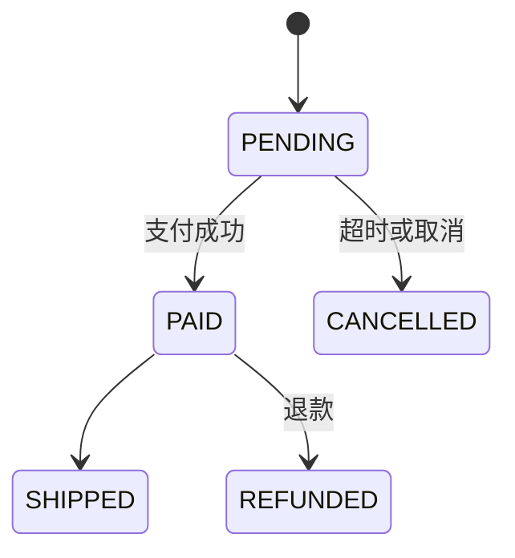

# 格式契约 (Format Contracts)

本文件定义三件事，所有 skill 与评测脚本**必须严格遵守**：

1. 知识库输出格式
2. 黄金集格式
3. 评测脚本接口与口径

---

## 0. 目录约定

```
D:\openCodeProject\code-to-doc\
├── .opencode\
│   ├── commands\                # 编排命令 (/biz-doc, /biz-doc-verify)
│   └── skills\                  # skill 定义
├── <代码根>\                    # 基准项目源码（浅克隆）
├── <官方文档目录>\              # 基准项目官方文档（= 标准答案）
├── <黄金集目录>\                # 黄金集 YAML
├── eval\                        # 评测脚本
├── <代码根>\                    # 自建合成模块 + ground truth
├── docs\
│   ├── FORMATS.md               # 本文件
│   └── biz\                     # 生成的知识库输出位置（默认）
└── README.md
```

---

## 1. 知识库输出格式

默认输出根目录：`docs/biz/`（可由命令参数覆盖）。

### 1.1 文件清单

| 文件 | 内容 |
|---|---|
| `00-overview.md` | 系统/模块概览、业务能力清单 |
| `glossary.md` | 术语卡 |
| `entities.md` | 业务实体及关系 |
| `rules.md` | 业务规则卡 |
| `workflows.md` | 业务流程 |
| `state-machines.md` | 状态机 |
| `roles-permissions.md` | 角色与权限 |
| `modules/<name>.md` | 单模块深度知识 |
| `gaps.md` | 未确定项 |
| `questions.md` | 待人工确认的问题 |
| `confidence-report.md` | 置信度统计 |
| `verification/` | 评测报告输出目录 |

### 1.2 知识卡格式（核心）

**检索单元 = 一个二级标题块**。解析器按正则 `^## ` 切分文件。

标准卡片：

````markdown
## BR-001 会员折扣计算

- **类型**: 业务规则
- **同义词**: 会员折扣, VIP优惠, 折扣率, member discount, discount rate
- **模块**: pricing
- **置信度**: 🟢 confirmed
- **溯源**: `src/main/java/com/example/pricing/DiscountService.java:42-58`

**规则**：当会员等级为黄金(GOLD)及以上时，订单金额享受 9 折；白金(PLATINUM)享 8.5 折。

**例外**：已是促销价的商品不参与叠加折扣。
````

**ID 前缀（固定）**：

| 前缀 | 类型 | 示例 |
|---|---|---|
| `TERM-` | 术语 | TERM-001 |
| `ENT-` | 业务实体 | ENT-001 |
| `BR-` | 业务规则 | BR-001 |
| `WF-` | 业务流程 | WF-001 |
| `SM-` | 状态机 | SM-001 |
| `ROLE-` | 角色/权限 | ROLE-001 |

**必填字段**：`类型`、`同义词`、`模块`、`置信度`、`溯源`。

**同义词**必须包含「用户可能说出的词」，中英文都要——这是检索命中的关键。

**置信度**三级：

- 🟢 `confirmed` — 有直接代码证据（能指到 `file:line`）
- 🟡 `inferred` — 由命名/模式推断，未验证
- 🔴 `gap` — 无法确定，需人工确认

**溯源**格式：`相对路径:起行-止行`，多条用逗号分隔。
**无溯源的条目不允许标记为 🟢。**

### 1.3 流程 / 状态机

用 mermaid 代码块嵌入卡内：

````markdown
## SM-001 订单状态机

- **类型**: 状态机
- **同义词**: 订单状态, order status, 状态流转
- **模块**: order
- **置信度**: 🟢 confirmed
- **溯源**: `order/OrderState.java:1-120`


````

---

## 2. 黄金集格式

位置：`<黄金集目录>/<project>-<module>.yaml`

```yaml
meta:
  project: killbill
  module: invoice
  domain: subscription-billing
  created_by: synthetic        # synthetic | manual
  blinded: true                # 出题者是否对生成的知识库盲化（必须 true）
  version: 1
  notes: ""

questions:
  - id: KB-Q001
    question: "发票什么时候生成？"
    type: positive             # positive=可答 | negative=应拒答
    difficulty: medium         # easy | medium | hard
    module: invoice
    expected_answer: "……"
    answer_source: "docs:userguide_invoice.md"    # 独立信源，不得来自生成的知识库
    synonyms: ["发票生成时间", "invoice generation timing"]
    notes: ""

  - id: KB-N001
    question: "系统支持加密货币支付吗？"
    type: negative
    expected_behavior: refuse  # 助手应表达「不确定 / 未覆盖」
    module: payment
    notes: "系统未覆盖"
```

**硬性规则**：

1. **盲化**：出题者不得读取生成的知识库（`meta.blinded` 必须为 `true`）。
2. **答案独立**：`expected_answer` 必须来自官方文档 / 源码 / 测试，不得来自生成的知识库。
3. **负样本比例 20%~30%**：`type: negative` 用于检测幻觉与拒答能力。
4. 每题必须可追溯到 `answer_source`。

---

## 3. 评测脚本接口

所有脚本位于 `eval/`，Python 3，输出 JSON 到 stdout，并可写报告到 `docs/biz/verification/`。

### 3.1 LLM 配置（环境变量）

```
LLM_PROVIDER = deepseek | openai | none    (默认 deepseek)
LLM_API_KEY  = ...
LLM_BASE_URL = https://api.deepseek.com    (默认)
LLM_MODEL    = deepseek-chat               (默认)
```

`LLM_PROVIDER=none` 时只跑不依赖 LLM 的检查（L0、检索）。

### 3.2 分层与脚本

| 层 | 脚本 | 需要 LLM | 主要指标 |
|---|---|---|---|
| L0 引用有效性 | `eval/mechanical.py` | 否 | `invalid_citation_rate`, `total_citations` |
| L2 覆盖率 | `eval/mechanical.py` | 否 | `coverage_rate`, `missing_entities[]` |
| L1 引用忠实度 | `eval/fidelity.py` | 是 | `hallucination_rate`, `verdicts{}` |
| L4 QA 端到端 | `eval/qa_eval.py` | 是 | `answer_accuracy`, `faithfulness`, `retrieval_hit_rate`, `refusal_correctness` |

### 3.3 调用签名

```bash
# L0 + L2（无需 LLM）
python eval/mechanical.py --kb docs/biz --root <代码根> --json

# 仅提取了部分模块时：用 --scope 把 L2 盘点范围对齐到提取范围（否则覆盖率分母是整个仓库）
python eval/mechanical.py --kb docs/biz-<名称> --root <代码根> --scope invoice,overdue --json

# L1 忠实度（抽样）
python eval/fidelity.py --kb docs/biz --root <代码根> --sample 0.3 --json

# L4 端到端问答
python eval/qa_eval.py --kb docs/biz --golden <黄金集目录>/killbill-invoice.yaml --k 5 --json
```

> **L2 范围对齐（重要）**：`mechanical.py` 新增可选参数 `--scope <p1,p2>`，用逗号分隔的**相对 `--root` 的路径前缀**限定实体盘点范围。
> 当知识库只覆盖目标仓库的一部分模块时，**必须**传 `--scope`，否则分母是整仓实体，覆盖率会失真（例：只提取 2/16 模块时覆盖率会显示 1%）。不传时盘点整个 `--root`（向后兼容）。

### 3.4 判定口径

- **引用有效性**：`[file:line]` 指向的文件存在、行号在范围内、且该行非空、非纯注释。
- **忠实度（L1）**：judge 独立回读被引代码，判定 `supported` / `contradicted` / `unclear`。
  `hallucination_rate = contradicted / 抽样总数`。
- **覆盖率（L2）**：先机械抽取代码实体清单（类 / 枚举 / 公开方法 / 权限注解），
  统计被至少一张卡「溯源」引用的比例。
- **答案准确率（L4）**：judge 对比 `expected_answer` 与模型答案，判定 `correct` / `partial` / `wrong`。
- **答案忠实度**：模型答案是否完全由检索到的 KB 片段支撑（无外部知识/编造）。
- **检索命中率**：`answer_source` 对应的文件是否出现在 top-k 检索结果中。
- **拒答正确率**：negative 题中，模型是否表达「不确定 / 未覆盖」。

### 3.5 成功阈值（第一版目标）

| 指标 | 目标 |
|---|---|
| 引用有效率 | 100% |
| 幻觉率 | < 5% |
| 覆盖率 | ≥ 85% |
| 答案准确率 | ≥ 85% |
| 拒答正确率 | ≥ 90% |
