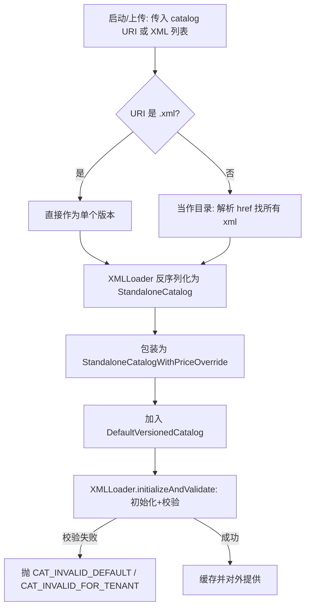
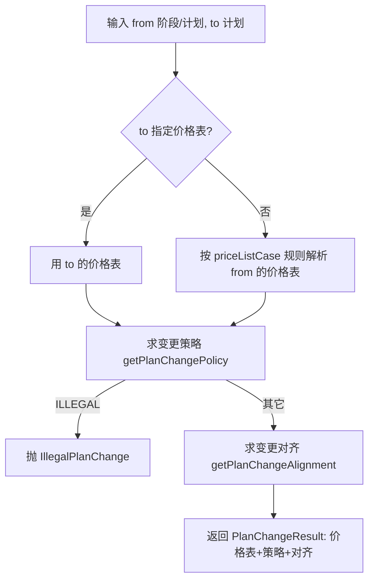
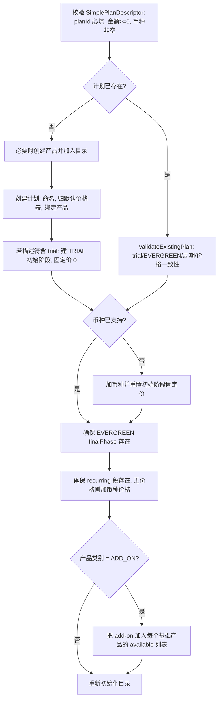
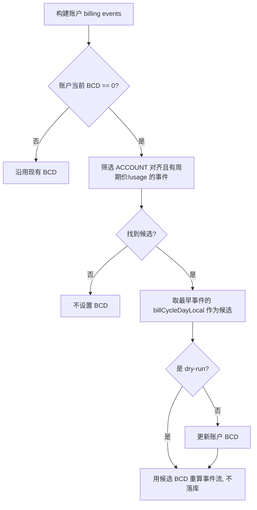
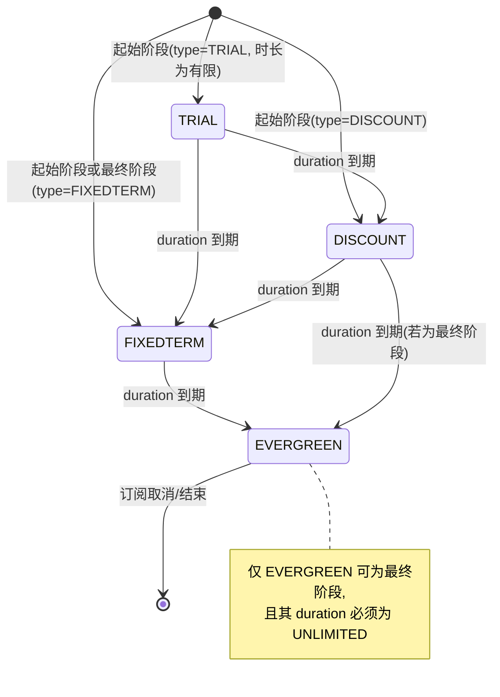
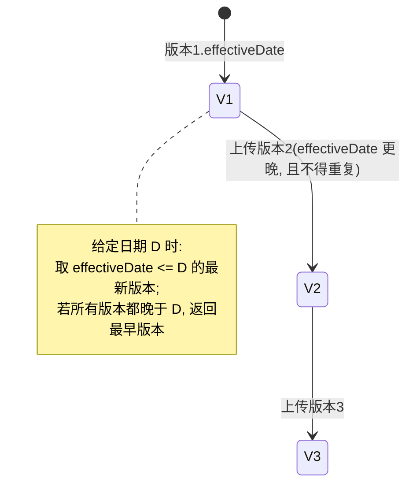

# catalog 模块业务知识

### 模块概览

产品目录：产品/计划/阶段/价格表/用量定价的定义与校验。

- **模块**: catalog
- **源码根**: `catalog/src/main/java/org/killbill/billing/catalog/`
- **卡片总数**: 74（术语 21 / 实体 12 / 规则 34 / 流程 4 / 状态机 2 / 角色权限 1）
- **全局 ID 前缀**: TERM-/ENT-/BR-/WF-/SM-/ROLE-（全局唯一，跨模块共享编号空间）

> 说明：本文件为该模块的深度视图，卡片与全局类型文件（glossary.md / entities.md / rules.md / workflows.md / state-machines.md / roles-permissions.md）中的同一全局 ID 对应。跨模块合并的卡会同时出现在多个模块视图中。

## TERM-001 用量计费 (Usage)

- **类型**: 术语
- **同义词**: 用量计费, 按量计费, 使用量, 计量计费, usage, usage-based billing, metered usage, Usage, 用量, 计量, 用量数据, usage data, metering, quantity
- **模块**: catalog, usage
- **置信度**: 🟢 confirmed
- **溯源**: `catalog/src/main/java/org/killbill/billing/catalog/DefaultUsage.java:56-95`, `usage/src/main/java/org/killbill/billing/usage/api/user/DefaultUsageUserApi.java:71-92`

**含义**：Usage 是阶段内的用量计费段，包含 `billingMode`（IN_ADVANCE/IN_ARREAR）、`usageType`（CONSUMABLE/CAPACITY）、`tierBlockPolicy`、`billingPeriod`，以及 `limits`、`blocks`、`tiers`、可选的整段 `fixedPrice`/`recurringPrice`。

**含义**：Kill Bill 中「用量」是按订阅（subscription）记录的、带日期的计量值。每条用量记录绑定到一个订阅（`subscriptionId`）、一个单位类型（`unitType`）、一个记录时刻（`recordDate`）与一个数值（`amount`）。

**边界**：用量模块只负责「记录/存储/查询」用量原始数值；它不负责定价、限额校验或计费，也不区分消费型/容量型（见 BR-014）。定价与聚合发生在开票侧（invoice 模块），目录侧定义允许的单位类型（见 TERM-003、BR-012）。

## TERM-002 计划 (Plan)

- **类型**: 术语
- **同义词**: 计划, 套餐, 资费计划, 产品计划, 订阅计划, plan, Plan, product plan, subscription plan
- **模块**: catalog
- **置信度**: 🟢 confirmed
- **溯源**: `catalog/src/main/java/org/killbill/billing/catalog/DefaultPlan.java:61-97`, `catalog/src/main/java/org/killbill/billing/catalog/DefaultPlan.java:199-237`

**含义**：Plan 是订阅实际购买/切换的单位。每个 Plan 绑定一个 Product（产品），包含若干 `initialPhases`（起始阶段，可为空）与**恰好一个** `finalPhase`（最终阶段），并归属到某个价格表（`priceListName`）。

**关键字段**：`name`（唯一 ID）、`prettyName`（展示名，缺省=name）、`product`、`recurringBillingMode`、`plansAllowedInBundle`、`effectiveDateForExistingSubscriptions`。

**说明**：`getAllPhases()` 返回 = initialPhases + finalPhase；`getRecurringBillingPeriod()` 取 finalPhase 的 recurring 周期，若 finalPhase 无 recurring 则返回 `NO_BILLING_PERIOD`。

## TERM-003 计划阶段 (Plan Phase)

- **类型**: 术语
- **同义词**: 阶段, 计费阶段, 试用期, 优惠期, phase, plan phase, PlanPhase, billing phase
- **模块**: catalog
- **置信度**: 🟢 confirmed
- **溯源**: `catalog/src/main/java/org/killbill/billing/catalog/DefaultPlanPhase.java:52-102`, `catalog/src/main/java/org/killbill/billing/catalog/DefaultPlanPhase.java:104-115`

**含义**：PlanPhase 是 Plan 内部按时间顺序排列的计费阶段，每个阶段有 `type`（PhaseType）、`duration`（时长）、可选的 `fixed`（一次性固定费）、`recurring`（周期性费用）和 `usages`（用量计费）。

**命名规则**：阶段名由计划名 + 阶段类型小写拼成：`phaseName = planName + "-" + phaseType.toLowerCase()`（例如 `foo-trial`、`foo-evergreen`）。

## TERM-004 产品 (Product)

- **类型**: 术语
- **同义词**: 产品, 商品, 产品定义, product, Product, catalog product
- **模块**: catalog
- **置信度**: 🟢 confirmed
- **溯源**: `catalog/src/main/java/org/killbill/billing/catalog/DefaultProduct.java:47-73`

**含义**：Product 是目录中的顶层可售对象，拥有 `name`、`category`（产品类别）、`included`（随主产品一起购买的附加产品集合）、`available`（可单独购买的附加产品集合）和 `limits`（用量限制）。

## TERM-005 产品类别 (Product Category)

- **类型**: 术语
- **同义词**: 产品类别, 产品类型, BASE, ADD_ON, STANDALONE, 主产品, 附加产品, 独立产品, base product, add-on, standalone product, product category
- **模块**: catalog
- **置信度**: 🟢 confirmed
- **溯源**: `catalog/src/main/java/org/killbill/billing/catalog/DefaultProduct.java:58-59`, `catalog/src/main/java/org/killbill/billing/catalog/DefaultPlanPhase.java:128-138`

**含义**：`ProductCategory` 取值 `BASE`（基础/主产品）、`ADD_ON`（附加产品）、`STANDALONE`（独立产品）。它决定产品在 bundle 中的组合方式：ADD_ON 需挂在 BASE 上，STANDALONE 不与其他产品组合。

**约束线索**：`plansAllowedInBundle` 注释明确 BASE 计划只允许值 1、Tiered ADDON 也只允许值 1（见 ENT-002 与此处引用）。

## TERM-006 价格表 (Price List)

- **类型**: 术语
- **同义词**: 价格表, 价目表, 定价方案, 价格清单, price list, pricelist, PriceList, price plan
- **模块**: catalog
- **置信度**: 🟢 confirmed
- **溯源**: `catalog/src/main/java/org/killbill/billing/catalog/DefaultPriceList.java:47-68`, `catalog/src/main/java/org/killbill/billing/catalog/DefaultPriceListSet.java:47-53`

**含义**：PriceList 是一组 Plan 的集合，允许同一产品/计费周期在不同价格表下有不同的价格（如默认价、促销价）。目录中有一个 `defaultPriceList`（默认价格表）和若干 `childPriceList`（子价格表）。

**保留名**：默认价格表的名称固定为 `DEFAULT`（`PriceListSet.DEFAULT_PRICELIST_NAME`），子价格表不得使用该名。

## TERM-007 用量类型 (UsageType : CONSUMABLE / CAPACITY)

- **类型**: 术语
- **同义词**: 用量类型, 消耗型, 容量型, consumable, capacity, usage type, UsageType, CAPACITY, CONSUMABLE, 容量计费, 消耗量计费, 按量计费, 消费型用量, 用量累加, consumable usage, usage-based, metered, 容量型用量, 峰值用量, 取最大值, capacity usage, peak usage, max usage
- **模块**: catalog, invoice, usage
- **置信度**: 🟢 confirmed
- **溯源**: `catalog/src/main/java/org/killbill/billing/catalog/DefaultUsage.java:212-229`, `invoice/src/main/java/org/killbill/billing/invoice/usage/ContiguousIntervalUsageInArrear.java:142`, `invoice/src/main/java/org/killbill/billing/invoice/usage/ContiguousIntervalUsageInArrear.java:539-548`, `invoice/src/main/java/org/killbill/billing/invoice/usage/UsageUtils.java:34-67`, `invoice/src/main/java/org/killbill/billing/invoice/usage/UsageUtils.java:69-87`

**含义**：`UsageType.CONSUMABLE` 表示按使用量累加计费（用多少算多少）；`UsageType.CAPACITY` 表示按容量/上限计费。校验规则要求 IN_ADVANCE+CAPACITY 必须定义 limits、IN_ADVANCE+CONSUMABLE 必须定义 blocks。

**说明**：用量（usage）分两类：
- `CAPACITY`（容量型）：同一计费周期内取**峰值**（最大值）计费；
- `CONSUMABLE`（消耗型）：同一计费周期内**累加**所有用量计费。

**含义**：目录 `UsageType.CONSUMABLE`，表示「按消耗计量累加」的用量。开票侧对同一区间内多条记录**求和**（`currentAmount.add(newAmount)`）。

**单位来源**：CONSUMABLE 的单位类型来自目录中各 tier 的 `TieredBlock.getUnit().getName()`（见 BR-012）。

**用量侧视角**：用量模块存储时**不区分** CONSUMABLE/CAPACITY（同一张表、同一套字段）；类型差异只在目录校验与开票聚合时体现（见 BR-014）。

**含义**：目录 `UsageType.CAPACITY`，表示「按容量/峰值计量」的用量。开票侧对同一区间内多条记录**取最大值**（`currentAmount.max(newAmount)`），即按区间内观测到的峰值计费。

**单位来源**：CAPACITY 的单位类型来自目录中各 tier 的 `Limit.getUnit().getName()`（见 BR-012），且 IN_ADVANCE 的 CAPACITY 段必须定义 limits（见 BR-013）。

## TERM-008 分层 (Tier)

- **类型**: 术语
- **同义词**: 分层, 阶梯, 阶梯价, 分层计价, tier, tiered pricing, Tier, pricing tier, 分层定价, 阶梯计费, tiered block, usage tier, 用量档位, 阶梯用量
- **模块**: catalog, invoice
- **置信度**: 🟢 confirmed
- **溯源**: `catalog/src/main/java/org/killbill/billing/catalog/DefaultTier.java:45-62`, `invoice/src/main/java/org/killbill/billing/invoice/usage/UsageUtils.java:34-87`

**含义**：Tier 是 usage 定价的阶梯，每个 Tier 有 `limits`、`blocks`（tieredBlock 列表）以及可选的整段 `fixedPrice`/`recurringPrice`。IN_ARREAR 的 usage 必须定义 tiers。

**说明**：用量价格按目录中的 **Tier（层/档）** 定义：
- `CONSUMABLE` 用量使用 `TieredBlock`（每层一个 block，按用途单位名匹配），量在本层内按块计价；
- `CAPACITY` 用量使用每层的 `Limit` 定义容量区间。
每个用量至少需要一层（`tiers.length > 0`），否则目录视为非法。

## TERM-009 计费周期 (Billing Period)

- **类型**: 术语
- **同义词**: 计费周期, 账单周期, 月付, 年付, billing period, BillingPeriod, recurring period, NO_BILLING_PERIOD
- **模块**: catalog
- **置信度**: 🟢 confirmed
- **溯源**: `catalog/src/main/java/org/killbill/billing/catalog/DefaultPlan.java:234-237`, `catalog/src/main/java/org/killbill/billing/catalog/DefaultPlan.java:295-298`

**含义**：`BillingPeriod` 表示 recurring 费用的收费频率。计划层面的周期取自 finalPhase 的 recurring；若 finalPhase 没有 recurring，计划周期为 `NO_BILLING_PERIOD`（纯用量/一次性计划）。

## TERM-010 阶段类型 (Phase Type)

- **类型**: 术语
- **同义词**: 阶段类型, 试用, 试用期, 折扣期, 固定期限, 长期, phase type, PhaseType, TRIAL, DISCOUNT, FIXEDTERM, EVERGREEN
- **模块**: catalog
- **置信度**: 🟢 confirmed
- **溯源**: `catalog/src/main/java/org/killbill/billing/catalog/DefaultPlan.java:304-319`, `catalog/src/main/java/org/killbill/billing/catalog/DefaultPlanPhase.java:108-115`

**含义**：`PhaseType` 取值 `TRIAL`（试用）、`DISCOUNT`（折扣）、`FIXEDTERM`（固定期限）、`EVERGREEN`（长期/常青）。阶段名后缀即其小写形式（如 `-trial`、`-evergreen`），因此可通过阶段名反推计划名与类型。

## TERM-011 计费模式 (BillingMode)

- **类型**: 术语
- **同义词**: 计费模式, 预付, 后付, 先付, 后付费, billing mode, BillingMode, IN_ADVANCE, IN_ARREAR, 先付费, 欠费开票, 用后付费, 期末计费, in arrear, postpaid, bill in arrears, 预付开票, 预付费, 期初计费, in advance, prepaid, bill in advance
- **模块**: catalog, invoice, usage
- **置信度**: 🟢 confirmed
- **溯源**: `catalog/src/main/java/org/killbill/billing/catalog/DefaultUsage.java:65-66`, `catalog/src/main/java/org/killbill/billing/catalog/DefaultPlan.java:79-81`, `invoice/src/main/java/org/killbill/billing/invoice/generator/FixedAndRecurringInvoiceItemGenerator.java:302-321`, `invoice/src/main/java/org/killbill/billing/invoice/optimizer/InvoiceOptimizerExp.java:147-148`, `catalog/src/main/java/org/killbill/billing/catalog/DefaultUsage.java:212-229`, `invoice/src/main/java/org/killbill/billing/invoice/usage/UsageUtils.java:34-74`

**含义**：`BillingMode` 取值 `IN_ADVANCE`（先付/预付）与 `IN_ARREAR`（后付/后付费）。可用量计费（usage）维度与计划级别 recurring 维度分别声明；计划若缺省则继承目录级 `recurringBillingMode`。

**说明**：`BillingMode` 分两种：
- `IN_ADVANCE`（预付/先付费）：在计费周期**开始时**收费；
- `IN_ARREAR`（后付/后付费）：在计费周期**结束后**收费。

**含义**：`BillingMode.IN_ARREAR`。用量在期末结算，目录中该 usage 段必须有 tiers。开票侧对 IN_ARREAR 的用量按 CONSUMABLE/CAPACITY 分别处理。

**用途侧关联**：用量记录本身就是「先发生、后结算」的数据；`getRawUsageForAccount` 的注释明确这是**唯一用于开票的查询**（见 BR-005）。

**含义**：`BillingMode.IN_ADVANCE`。目录校验要求：IN_ADVANCE + CAPACITY 必须定义 `limits`；IN_ADVANCE + CONSUMABLE 必须定义 `blocks`。用量模块不参与该模式判定，但写入的 `unitType` 必须与目录对应的 limit/block 单位名称匹配。

## TERM-012 限制 (Limit)

- **类型**: 术语
- **同义词**: 限制, 上限, 下限, 用量上限, limit, cap, min, max, usage limit
- **模块**: catalog
- **置信度**: 🟢 confirmed
- **溯源**: `catalog/src/main/java/org/killbill/billing/catalog/DefaultLimit.java:42-105`

**含义**：Limit 由 `unit`（单位）+ `min`/`max` 组成，用来约束用量或容量。`compliesWith(value)` 判定：若 max 有效且 value>max 则不通过；若 min 有效且 value>min 也不通过（注意源码此处为 `> min` 判断，见 BR 卡）。

## TERM-013 计费对齐 (Billing Alignment)

- **类型**: 术语
- **同义词**: 计费对齐, 账单日对齐, 对齐方式, 账户对齐, 订阅对齐, 账单对齐, billing alignment, BillingAlignment, ACCOUNT, SUBSCRIPTION, BUNDLE
- **模块**: catalog
- **置信度**: 🟢 confirmed
- **溯源**: `catalog/src/main/java/org/killbill/billing/catalog/rules/DefaultPlanRules.java:137-141`, `util/src/main/java/org/killbill/billing/util/bcd/BillCycleDayCalculator.java:50-72`

**含义**：`BillingAlignment` 决定订阅的账单日（BCD）如何对齐，取值 `ACCOUNT`（对齐账户 BCD）、`SUBSCRIPTION`（对齐订阅自身起始日）、`BUNDLE`（对齐 bundle 内基础订阅的 BCD）。目录中通过 `billingAlignment` 规则按产品/类别/周期/价格表/阶段类型匹配；未匹配到时默认 `ACCOUNT`。

**注意**：当对齐为 ACCOUNT 但账户 BCD 尚未设置（=0）时，系统会临时回退到 SUBSCRIPTION 推算 BCD（`resolveEffectiveBillingAlignment`）。

## TERM-014 阶梯块策略 (Tier Block Policy)

- **类型**: 术语
- **同义词**: 阶梯策略, 分层策略, 计费阶梯策略, ALL_TIERS, TOP_TIER, tier block policy, TierBlockPolicy
- **模块**: catalog
- **置信度**: 🟢 confirmed
- **溯源**: `catalog/src/main/java/org/killbill/billing/catalog/DefaultUsage.java:71-72`, `invoice/src/test/java/org/killbill/billing/invoice/usage/TestContiguousIntervalConsumableInArrear.java:152-244`

**含义**：`TierBlockPolicy` 决定用量达到多阶梯时如何计价，取值 `ALL_TIERS`（对所有经过的阶梯分别计价）与 `TOP_TIER`（只按最高到达阶梯计价）；测试用例名 `testComputeBilledUsageWith_ALL_TIERS` / `testComputeBilledUsageWith_TOP_TIER` 直接印证这两种策略。

## TERM-015 块类型 (Block Type)

- **类型**: 术语
- **同义词**: 块类型, 用量块类型, 充值块, 阶梯块, VANILLA, TOP_UP, TIERED, block type, BlockType
- **模块**: catalog
- **置信度**: 🟢 confirmed
- **溯源**: `catalog/src/main/java/org/killbill/billing/catalog/DefaultBlock.java:49-50`, `catalog/src/main/java/org/killbill/billing/catalog/DefaultBlock.java:92-110`, `catalog/src/main/java/org/killbill/billing/catalog/DefaultTieredBlock.java:62-71`

**含义**：`BlockType` 取值 `VANILLA`（缺省普通块）、`TOP_UP`（充值块，需定义 `minTopUpCredit`）、`TIERED`（阶梯块，来自 DefaultTieredBlock）。对非 TOP_UP 块调用 `getMinTopUpCredit()` 会抛 `CAT_NOT_TOP_UP_BLOCK`。

## TERM-016 价格覆盖 (Price Override)

- **类型**: 术语
- **同义词**: 价格覆盖, 自定义价格, 覆盖定价, 计划价格覆盖, price override, plan price override, fixedPrice override, recurringPrice override
- **模块**: catalog
- **置信度**: 🟢 confirmed
- **溯源**: `catalog/src/main/java/org/killbill/billing/catalog/DefaultPlanPhase.java:83-102`, `catalog/src/main/java/org/killbill/billing/catalog/DefaultInternationalPrice.java:57-86`

**含义**：创建订阅时可对计划的阶段价格做覆盖：`PlanPhasePriceOverride` 可覆盖固定费、周期费与各 usage 的阶梯价格。覆盖按币种替换对应 `DefaultPrice`，未覆盖的币种价格保留。

## TERM-017 目录版本 (Catalog Version)

- **类型**: 术语
- **同义词**: 目录版本, 版本, 目录生效日, catalog version, versioned catalog, effective date, 生效日期
- **模块**: catalog
- **置信度**: 🟢 confirmed
- **溯源**: `catalog/src/main/java/org/killbill/billing/catalog/DefaultVersionedCatalog.java:50-107`, `catalog/src/main/java/org/killbill/billing/catalog/StandaloneCatalog.java:62-77`

**含义**：一个目录名称下可有多个版本（`StandaloneCatalog`），每个版本有唯一 `effectiveDate`。查询某日期时，取生效日 ≤ 该日期的**最新**版本；若所有版本都晚于查询日期，则返回第一个版本。

## TERM-018 固定费类型 (Fixed Type)

- **类型**: 术语
- **同义词**: 固定费类型, 一次性费用, ONE_TIME, fixed type, FixedType
- **模块**: catalog
- **置信度**: 🟢 confirmed
- **溯源**: `catalog/src/main/java/org/killbill/billing/catalog/DefaultFixed.java:41-55`, `catalog/src/main/java/org/killbill/billing/catalog/DefaultFixed.java:76-82`

**含义**：阶段内的固定费（`Fixed`）带一个 `FixedType type`，缺省为 `ONE_TIME`（一次性收费）；其价格来自 `fixedPrice`（InternationalPrice，多币种）。

## TERM-019 账单日 (BCD / Bill Cycle Day)

- **类型**: 术语
- **同义词**: 账单日, 计费日, 出账日, 出账日期, BCD, bill cycle day, billing cycle day, 每月几号出账
- **模块**: catalog
- **置信度**: 🟢 confirmed
- **溯源**: `util/src/main/java/org/killbill/billing/util/bcd/BillCycleDayCalculator.java:35-88`, `util/src/main/java/org/killbill/billing/util/bcd/BillCycleDayCalculator.java:133-139`

**含义**：BCD 是订阅每月出账的「日」，由订阅 `getDateOfFirstRecurringNonZeroCharge()`（首个非零周期费日期）的当月日号决定，或按计费对齐规则取账户/bundle/订阅的 BCD。

**对齐规则**：仅对「以月/年为单位」的计费周期（MONTHLY/QUARTERLY/BIANNUAL/ANNUAL）做 BCD 对齐；若 BCD 大于当月天数，取**当月最后一天**。

## TERM-020 计费动作策略 (BillingActionPolicy)

- **类型**: 术语
- **同义词**: 计费动作策略, 变更策略, 取消策略, 立即生效, 期末生效, IMMEDIATE, END_OF_TERM, billing action policy
- **模块**: catalog
- **置信度**: 🟢 confirmed
- **溯源**: `catalog/src/main/java/org/killbill/billing/catalog/rules/DefaultPlanRules.java:131-135`, `catalog/src/main/java/org/killbill/billing/catalog/rules/DefaultPlanRules.java:172-176`, `catalog/src/main/java/org/killbill/billing/catalog/CatalogUpdater.java:332-344`

**含义**：计划变更/取消时的计费动作策略，取值 `IMMEDIATE`（立即生效）与 `END_OF_TERM`（期末生效）。目录规则未匹配时默认 `END_OF_TERM`；简化计划 API 生成的默认规则使用 `IMMEDIATE`。

## TERM-021 简化计划描述符 (SimplePlanDescriptor)

- **类型**: 术语
- **同义词**: 简化计划, 计划描述符, simple plan, SimplePlanDescriptor, 快速建计划
- **模块**: catalog
- **置信度**: 🟢 confirmed
- **溯源**: `catalog/src/main/java/org/killbill/billing/catalog/CatalogUpdater.java:119-161`, `catalog/src/main/java/org/killbill/billing/catalog/api/user/DefaultSimplePlanDescriptor.java:29-39`

**含义**：`SimplePlanDescriptor` 是创建/更新「简化计划」的输入模型，包含 planId、productName、productCategory、billingPeriod、currency、amount、可选 trial 信息（trialLength/trialTimeUnit）以及 ADD_ON 的 availableBaseProducts。

## ENT-001 产品实体 (Product)

- **类型**: 业务实体
- **同义词**: 产品实体, 产品定义, 产品对象, product entity, Product, DefaultProduct
- **模块**: catalog
- **置信度**: 🟢 confirmed
- **溯源**: `catalog/src/main/java/org/killbill/billing/catalog/DefaultProduct.java:47-121`

**实体说明**：`DefaultProduct` 实现 `Product`，XML 中由 `<product>` 定义。

**关键关系/约束**：
- `category`：BASE / ADD_ON / STANDALONE。
- `included`（`included/addonProduct`）：随主产品赠送/绑定的 add-on 产品集合。
- `available`（`available/addonProduct`）：可加购的 add-on 产品集合。
- `limits`：产品级用量限制。
- 校验：产品引用的 catalogName 必须与目录一致；不允许在 included/available 中自引用（系统属性 `org.killbill.catalog.validation.ignoreSelfReferencingProducts` 可关闭此校验）。

## ENT-002 计划实体 (Plan)

- **类型**: 业务实体
- **同义词**: 计划实体, 套餐实体, plan entity, Plan, DefaultPlan
- **模块**: catalog
- **置信度**: 🟢 confirmed
- **溯源**: `catalog/src/main/java/org/killbill/billing/catalog/DefaultPlan.java:61-97`, `catalog/src/main/java/org/killbill/billing/catalog/DefaultPlan.java:286-326`

**实体说明**：`DefaultPlan` 实现 `Plan`。

**关键关系/约束**：
- 必须关联一个 Product；必须有一个 `finalPhase`；可有 0..N 个 `initialPhases`。
- `plansAllowedInBundle`：缺省 1；BASE 计划与 Tiered ADDON 只允许 1；值 -1 表示不限量。
- `recurringBillingMode` 可缺省并回退到目录级设置。
- 校验：`effectiveDateForExistingSubscriptions` 不得早于目录 `effectiveDate`。

## ENT-003 计划阶段实体 (Plan Phase)

- **类型**: 业务实体
- **同义词**: 阶段实体, 计费阶段实体, phase entity, PlanPhase, DefaultPlanPhase
- **模块**: catalog
- **置信度**: 🟢 confirmed
- **溯源**: `catalog/src/main/java/org/killbill/billing/catalog/DefaultPlanPhase.java:52-102`, `catalog/src/main/java/org/killbill/billing/catalog/DefaultPlanPhase.java:171-191`

**实体说明**：`DefaultPlanPhase` 实现 `PlanPhase`。

**关键关系/约束**：
- 必须定义 `type` 和 `duration`。
- `fixed`、`recurring`、`usages` 三者至少要有一个（否则校验失败）。
- `compliesWithLimits` 先查 usage 段限制，再查产品级限制。

## ENT-004 价格表实体与价格表集合 (PriceList / PriceListSet)

- **类型**: 业务实体
- **同义词**: 价格表实体, 价目表集合, price list entity, PriceListSet, DefaultPriceListSet, child price list
- **模块**: catalog
- **置信度**: 🟢 confirmed
- **溯源**: `catalog/src/main/java/org/killbill/billing/catalog/DefaultPriceListSet.java:47-98`, `catalog/src/main/java/org/killbill/billing/catalog/DefaultPriceList.java:47-108`

**实体说明**：`DefaultPriceListSet` 由 1 个 `defaultPriceList` + N 个 `childPriceLists` 组成，实现 `PriceListSet`。

**关键关系/约束**：
- `findPriceListFrom(name)`：name 为 null 抛 `CAT_NULL_PRICE_LIST_NAME`；匹配默认或子表；找不到抛 `CAT_PRICE_LIST_NOT_FOUND`。
- `getPlanFrom(product, period, priceListName)`：先查指定价格表，无匹配则回退默认价格表；匹配到多个抛 `CAT_MULTIPLE_MATCHING_PLANS_FOR_PRICELIST`，0 个返回 null。
- 子价格表不得使用保留名 `DEFAULT`。

## ENT-005 目录实体 (StandaloneCatalog / StaticCatalog)

- **类型**: 业务实体
- **同义词**: 目录, 目录定义, 单一目录, catalog, StandaloneCatalog, StaticCatalog, 静态目录
- **模块**: catalog
- **置信度**: 🟢 confirmed
- **溯源**: `catalog/src/main/java/org/killbill/billing/catalog/StandaloneCatalog.java:62-95`, `catalog/src/main/java/org/killbill/billing/catalog/StandaloneCatalog.java:280-310`

**实体说明**：`StandaloneCatalog` 实现 `StaticCatalog`，是一次目录发布的完整定义。

**关键字段/关系**：`effectiveDate`、`catalogName`、`recurringBillingMode`（目录级缺省计费模式）、`supportedCurrencies`、`units`、`products`、`plans`、`priceLists`、`rules`（`DefaultPlanRules`）。

**校验**：产品集合、计划集合、价格表、规则集依次校验；并校验阶段时长（EVERGREEN 必须 UNLIMITED，非 EVERGREEN 不得 UNLIMITED）。

## ENT-006 价格实体 (Price / InternationalPrice)

- **类型**: 业务实体
- **同义词**: 价格实体, 多币种价格, 国际价格, price, Price, InternationalPrice, price in currency
- **模块**: catalog
- **置信度**: 🟢 confirmed
- **溯源**: `catalog/src/main/java/org/killbill/billing/catalog/DefaultInternationalPrice.java:43-100`, `catalog/src/main/java/org/killbill/billing/catalog/DefaultPrice.java:41-73`

**实体说明**：`InternationalPrice` 是「币种 → 价格值」的多币种价格容器；`DefaultPrice` 表示单个币种的 `BigDecimal` 金额。

**关键约束**：
- 不含任何 price 时视为**所有币种零价格**（`getPrice` 返回 `BigDecimal.ZERO`）。
- 币种不在目录 `supportedCurrencies` 中 → 校验报 `Unsupported currency`。
- 价格值 < 0 → 校验报 `Negative value for price in currency`。
- 指定币种无价格 → 抛 `CAT_NO_PRICE_FOR_CURRENCY`。
- `value` 为 null 时 `getValue()` 抛 `CurrencyValueNull`。

## ENT-007 时长实体 (Duration)

- **类型**: 业务实体
- **同义词**: 时长, 阶段时长, 持续时间, duration, Duration, TimeUnit, 天数, 月数, 年数
- **模块**: catalog
- **置信度**: 🟢 confirmed
- **溯源**: `catalog/src/main/java/org/killbill/billing/catalog/DefaultDuration.java:41-83`, `catalog/src/main/java/org/killbill/billing/catalog/DefaultDuration.java:106-123`

**实体说明**：`Duration` = `unit`（TimeUnit）+ `number`。

**关键约束**：
- TimeUnit 取值 `DAYS`/`WEEKS`/`MONTHS`/`YEARS`/`UNLIMITED`；对 `UNLIMITED` 执行 `addToDateTime`/`toJodaPeriod` 会抛 `CAT_UNDEFINED_DURATION` 或 IllegalStateException。
- `UNLIMITED` 时 number 必须省略；有限时长必须给出 number，否则校验失败。

## ENT-008 周期费实体 (Recurring)

- **类型**: 业务实体
- **同义词**: 周期费, 循环费用, 订阅费, 月费, recurring, Recurring, recurringPrice, 周期性收费
- **模块**: catalog
- **置信度**: 🟢 confirmed
- **溯源**: `catalog/src/main/java/org/killbill/billing/catalog/DefaultRecurring.java:39-113`

**实体说明**：阶段的周期性收费，由 `billingPeriod`（BillingPeriod）+ 可选 `recurringPrice`（InternationalPrice）组成。

**关键约束**：有 recurringPrice 就必须有有效的 billingPeriod（非 `NO_BILLING_PERIOD`）；没有 recurringPrice 则 billingPeriod 必须是 `NO_BILLING_PERIOD`。

## ENT-009 块与阶梯块实体 (Block / TieredBlock)

- **类型**: 业务实体
- **同义词**: 用量块, 充值块, 阶梯块, block, Block, tieredBlock, TieredBlock, usage block
- **模块**: catalog
- **置信度**: 🟢 confirmed
- **溯源**: `catalog/src/main/java/org/killbill/billing/catalog/DefaultBlock.java:47-64`, `catalog/src/main/java/org/killbill/billing/catalog/DefaultTieredBlock.java:36-65`

**实体说明**：`Block` 定义「一个单位块」的价格：`type`、`unit`、`size`（每块包含的单位数）、`prices`（块价）、可选 `minTopUpCredit`。`TieredBlock` 继承 Block 并额外有 `max`（该阶梯的最大用量），固定 `type=TIERED`。

## ENT-010 目录版本集合实体 (VersionedCatalog)

- **类型**: 业务实体
- **同义词**: 目录版本集合, 多版本目录, versioned catalog, VersionedCatalog, versions
- **模块**: catalog
- **置信度**: 🟢 confirmed
- **溯源**: `catalog/src/main/java/org/killbill/billing/catalog/DefaultVersionedCatalog.java:52-120`, `catalog/src/main/java/org/killbill/billing/catalog/DefaultVersionedCatalog.java:133-154`

**实体说明**：`DefaultVersionedCatalog` 持有按 `effectiveDate` 升序排列的多个 `StandaloneCatalog` 版本。

**关键约束**：各版本 `catalogName` 必须一致；`effectiveDate` 不得重复；跨版本同名计划的阶段数量与阶段名必须一致。

## ENT-011 规则集实体 (PlanRules)

- **类型**: 业务实体
- **同义词**: 规则集, 计划规则, 目录规则, plan rules, PlanRules, DefaultPlanRules, 变更规则, 取消规则
- **模块**: catalog
- **置信度**: 🟢 confirmed
- **溯源**: `catalog/src/main/java/org/killbill/billing/catalog/rules/DefaultPlanRules.java:58-83`

**实体说明**：`DefaultPlanRules` 聚合六类规则 case：`changePolicy`（变更策略）、`changeAlignment`（变更对齐）、`cancelPolicy`（取消策略）、`createAlignment`（创建对齐）、`billingAlignment`（计费对齐）、`priceList`（价格表选择）。

**关键约束**：变更策略与取消策略必须各存在一个「全空」的默认 case，且同类规则不得重复。

## ENT-012 阶段计费项实体 (Fixed / Usage / Tier / Limit)

- **类型**: 业务实体
- **同义词**: 计费项, 价格组成, 阶段内容, billing items, fixed, usage, tier, limit
- **模块**: catalog
- **置信度**: 🟢 confirmed
- **溯源**: `catalog/src/main/java/org/killbill/billing/catalog/DefaultPlanPhase.java:61-72`, `catalog/src/main/java/org/killbill/billing/catalog/DefaultUsage.java:74-95`

**实体说明**：一个阶段最多由四类计费项构成：`fixed`（一次性固定费）、`recurring`（周期费）、`usages[]`（用量段，内部再含 tiers/blocks/limits）、以及各计费项级别的 `limits`。

**关键约束**：阶段必须至少含 fixed / recurring / usages 之一。

## BR-001 初始阶段不能是 EVERGREEN

- **类型**: 业务规则
- **同义词**: 初始阶段约束, 起始阶段不能常青, initial phase evergreen, 阶段顺序规则, phase ordering
- **模块**: catalog
- **置信度**: 🟢 confirmed
- **溯源**: `catalog/src/main/java/org/killbill/billing/catalog/DefaultPlan.java:304-310`

**规则**：计划的每个 `initialPhase`（初始阶段）不得为 `PhaseType.EVERGREEN`；否则目录校验报错 `Initial Phase %s of plan %s cannot be of type EVERGREEN`。

**含义**：EVERGREEN 只能作为计划最后一个阶段（finalPhase），保证计划有明确的阶段性结构。

## BR-002 最终阶段不能是 TRIAL 或 DISCOUNT

- **类型**: 业务规则
- **同义词**: 最终阶段约束, 结束阶段不能试用, final phase trial, final phase discount, 阶段顺序规则
- **模块**: catalog
- **置信度**: 🟢 confirmed
- **溯源**: `catalog/src/main/java/org/killbill/billing/catalog/DefaultPlan.java:313-319`

**规则**：计划的 `finalPhase`（最终阶段）不得为 `PhaseType.TRIAL` 或 `PhaseType.DISCOUNT`；否则校验报错 `Final Phase %s of plan %s cannot be of type %s`。

**含义**：试用/折扣阶段只能出现在中间，最终阶段必须是 FIXEDTERM 或 EVERGREEN。

## BR-003 阶段必须至少定义一种计费项

- **类型**: 业务规则
- **同义词**: 阶段必填项, 阶段计价完整性, phase needs pricing, 空阶段校验
- **模块**: catalog
- **置信度**: 🟢 confirmed
- **溯源**: `catalog/src/main/java/org/killbill/billing/catalog/DefaultPlanPhase.java:176-180`

**规则**：若一个阶段同时没有 `fixed`、没有 `recurring` 且 `usages` 为空，则校验失败，报错 `Phase %s of plan %s need to define at least either a fixed or recurrring or usage section.`。

## BR-004 阶段名与计划名互推规则

- **类型**: 业务规则
- **同义词**: 阶段命名, 计划名解析, phase name, plan name from phase, 阶段名后缀
- **模块**: catalog
- **置信度**: 🟢 confirmed
- **溯源**: `catalog/src/main/java/org/killbill/billing/catalog/DefaultPlanPhase.java:104-115`

**规则**：
- 阶段名 = `planName + "-" + phaseType.toLowerCase()`。
- 反向解析：遍历 `PhaseType.values()`，看阶段名是否以某类型小写结尾，是则去掉「类型长度+1」个字符得到计划名；否则抛 `CAT_BAD_PHASE_NAME`。

**例外**：若计划名本身以某个 phase type 单词结尾，反向解析可能产生歧义（源码按 values() 顺序取首个匹配）。

## BR-005 EVERGREEN 必须 UNLIMITED，非 EVERGREEN 不得 UNLIMITED

- **类型**: 业务规则
- **同义词**: 常青阶段无限时长, evergreen unlimited, 阶段时长约束, 无限期阶段
- **模块**: catalog
- **置信度**: 🟢 confirmed
- **溯源**: `catalog/src/main/java/org/killbill/billing/catalog/StandaloneCatalog.java:290-310`

**规则**：遍历计划全部阶段：若阶段类型为 `EVERGREEN` 但其 `duration.unit != UNLIMITED`，报错「must have duration as UNLIMITED」；若阶段类型非 `EVERGREEN` 但其 `duration.unit == UNLIMITED`，报错「must not have duration as UNLIMITED」。

## BR-006 UNLIMITED 时长与 number 互斥

- **类型**: 业务规则
- **同义词**: 时长数量校验, unlimited 无数量, duration number, 时长必填
- **模块**: catalog
- **置信度**: 🟢 confirmed
- **溯源**: `catalog/src/main/java/org/killbill/billing/catalog/DefaultDuration.java:106-123`

**规则**：`unit == UNLIMITED` 时 `number` 必须为缺省（-1），否则报「Duration can only have 'UNLIMITED' unit if the number is omitted」；`unit != UNLIMITED` 时 `number` 必须给出，否则报「Finite Duration must have a well defined length」。

## BR-007 周期费与计费周期一致性

- **类型**: 业务规则
- **同义词**: 循环费周期校验, recurring billing period, 周期费必填周期, no billing period
- **模块**: catalog
- **置信度**: 🟢 confirmed
- **溯源**: `catalog/src/main/java/org/killbill/billing/catalog/DefaultRecurring.java:90-111`

**规则**：
- 有 `recurringPrice` 时必须有 `billingPeriod` 且不得为 `NO_BILLING_PERIOD`。
- 没有 `recurringPrice` 时 `billingPeriod` 必须是 `NO_BILLING_PERIOD`。
- 违反时报「has a recurring price but no billing period」或「has no recurring price but does have a billing period」。

## BR-008 价格不得为负且币种必须受支持

- **类型**: 业务规则
- **同义词**: 价格校验, 负价格, 非法币种, negative price, unsupported currency, 价格合法性
- **模块**: catalog
- **置信度**: 🟢 confirmed
- **溯源**: `catalog/src/main/java/org/killbill/billing/catalog/DefaultInternationalPrice.java:107-127`

**规则**：对每个 `Price`：
- 其 `currency` 不在目录 `supportedCurrencies` 中 → 校验错误 `Unsupported currency: <CUR>`。
- 其 `value < 0.0` → 校验错误 `Negative value for price in currency: <CUR>`。
- 若 `value` 为 null（抛 `CurrencyValueNull`），跳过负值检查。

## BR-009 指定币种无价格时抛 CAT_NO_PRICE_FOR_CURRENCY

- **类型**: 业务规则
- **同义词**: 币种缺价, 无报价币种, no price for currency, 价格缺失
- **模块**: catalog
- **置信度**: 🟢 confirmed
- **溯源**: `catalog/src/main/java/org/killbill/billing/catalog/DefaultInternationalPrice.java:88-100`

**规则**：`InternationalPrice` 无任何 price 时，视为所有币种价格 = 0（返回 `BigDecimal.ZERO`）；若有 price 列表但找不到请求的币种，则抛 `CatalogApiException(CAT_NO_PRICE_FOR_CURRENCY, currency)`。

## BR-010 用量各模式的必填结构校验

- **类型**: 业务规则
- **同义词**: 用量校验, 预付容量, 预付消耗, 后付阶梯, usage validation, IN_ADVANCE, IN_ARREAR, limits, blocks, tiers, 用量段校验, 目录校验, usage section validation, in advance limits, in arrears tiers
- **模块**: catalog, usage
- **置信度**: 🟢 confirmed
- **溯源**: `catalog/src/main/java/org/killbill/billing/catalog/DefaultUsage.java:212-229`, `catalog/src/main/java/org/killbill/billing/catalog/DefaultTier.java:147-159`

**规则**：
- `IN_ADVANCE + CAPACITY`：必须定义 `limits`，否则报错。
- `IN_ADVANCE + CONSUMABLE`：必须定义 `blocks`，否则报错。
- `IN_ARREAR`：必须定义 `tiers`，否则报错。
- 在 Tier 级别：`IN_ARREAR + CAPACITY` 需 limits，`IN_ARREAR + CONSUMABLE` 需 blocks（校验信息挂在 DefaultUsage 上）。

**规则**（目录加载时校验，决定用量可被如何计费）：
- `IN_ADVANCE` + `CAPACITY` 且 `limits.length == 0` → 报错「needs to define some limits」。
- `IN_ADVANCE` + `CONSUMABLE` 且 `blocks.length == 0` → 报错「needs to define some blocks」。
- `IN_ARREAR` 且 `tiers.length == 0` → 报错「needs to define some tiers」。

**关联**：这些是目录对「用量类型 + 计费模式」组合的合法性约束，间接规定了对应用量记录应携带哪些单位类型。

## BR-011 Limit 的上下限判定

- **类型**: 业务规则
- **同义词**: 用量限制, 上限下限, limit min max, complies with limits, 超限
- **模块**: catalog
- **置信度**: 🟢 confirmed
- **溯源**: `catalog/src/main/java/org/killbill/billing/catalog/DefaultLimit.java:84-105`

**规则**：
- 校验：`max` 与 `min` 都有值时，`max < min` 报错「max must be greater than min」。
- 判定：`maxHasValue && value > max` → 不通过（false）；否则当 `minHasValue && value > min` 也不通过，其余通过。缺省值 -1 视为「未设置」。

**注意（源码疑点）**：`min` 判定使用 `value.compareTo(min) <= 0`（即 value > min 不通过），语义上更像是「未超过 min」；业务使用时需与官方文档核对。

## BR-012 effectiveDateForExistingSubscriptions 不得早于目录生效日

- **类型**: 业务规则
- **同义词**: 存量订阅生效日, existing subscriptions date, 目录生效日约束, price effective date
- **模块**: catalog
- **置信度**: 🟢 confirmed
- **溯源**: `catalog/src/main/java/org/killbill/billing/catalog/DefaultPlan.java:286-293`

**规则**：若计划设置了 `effectiveDateForExistingSubscriptions` 且它早于目录的 `effectiveDate`，则校验报错「Price effective date %s is before catalog effective date '%s'」。该字段用于控制计划变更对存量订阅生效的时点。

## BR-013 纯用量计划可不设 recurringBillingMode

- **类型**: 业务规则
- **同义词**: 纯用量计划, recurring billing mode 缺省, usage only plan, 计费模式继承
- **模块**: catalog
- **置信度**: 🟢 confirmed
- **溯源**: `catalog/src/main/java/org/killbill/billing/catalog/DefaultPlan.java:79-81`, `catalog/src/main/java/org/killbill/billing/catalog/DefaultPlan.java:276-278`, `catalog/src/main/java/org/killbill/billing/catalog/DefaultPlan.java:295-298`

**规则**：若计划的 recurring billing period 为 `NO_BILLING_PERIOD`（纯用量计划），可缺省 `recurringBillingMode`；否则必须有值，否则校验报「Invalid recurring billingMode for plan '%s'」。计划级缺省时继承目录级 `recurringBillingMode`。

## BR-014 plansAllowedInBundle 的取值语义

- **类型**: 业务规则
- **同义词**: bundle 内计划数量, plans allowed in bundle, 允许多少计划, 不限量 -1
- **模块**: catalog
- **置信度**: 🟢 confirmed
- **溯源**: `catalog/src/main/java/org/killbill/billing/catalog/DefaultPlan.java:90-95`, `catalog/src/main/java/org/killbill/billing/catalog/DefaultPlan.java:239-251`

**规则**：`plansAllowedInBundle` 表示一个 bundle 内该计划允许存在的数量：
- 缺省值 1；BASE 计划与 Tiered ADDON 只允许 1（源码注释明确）。
- 值 `-1` 表示不限量。
- 未设置时由初始化安全网填为 -1，运行期若仍为 null 会抛 IllegalStateException（安全校验）。

## BR-015 默认价格表名 DEFAULT 为保留名

- **类型**: 业务规则
- **同义词**: 默认价格表命名, DEFAULT 保留, reserved price list name, 价格表命名约束
- **模块**: catalog
- **置信度**: 🟢 confirmed
- **溯源**: `catalog/src/main/java/org/killbill/billing/catalog/DefaultPriceListSet.java:106-118`, `catalog/src/main/java/org/killbill/billing/catalog/PriceListDefault.java:36-45`

**规则**：
- 默认价格表（PriceListDefault）的名称 `getName()` 恒返回 `PriceListSet.DEFAULT_PRICELIST_NAME`（值 `DEFAULT`）。
- 子价格表名称不得等于 `DEFAULT`，否则校验报「Pricelists cannot use the reserved name 'DEFAULT'」。
- 若默认价格表名称不等于 `DEFAULT`，报「The name of the default pricelist must be 'DEFAULT'」。

## BR-016 价格表解析与默认回退

- **类型**: 业务规则
- **同义词**: 找价格表, price list fallback, 默认价格表回退, 多匹配计划, price list resolution
- **模块**: catalog
- **置信度**: 🟢 confirmed
- **溯源**: `catalog/src/main/java/org/killbill/billing/catalog/DefaultPriceListSet.java:64-98`

**规则**：
- `getPlanFrom(product, period, priceListName)`：先在指定价格表查匹配计划；若 0 个，则回退到默认价格表再查。
- 最终 0 个 → 返回 null；1 个 → 返回该计划；>1 个 → 抛 `CAT_MULTIPLE_MATCHING_PLANS_FOR_PRICELIST`。
- `findPriceListFrom(name)`：name 为 null 抛 `CAT_NULL_PRICE_LIST_NAME`；依次匹配默认表与子表；找不到抛 `CAT_PRICE_LIST_NOT_FOUND`。

## BR-017 计划缺省价格表的自动解析

- **类型**: 业务规则
- **同义词**: 计划归属价格表, plan price list, price list for plan, 自动找价格表
- **模块**: catalog
- **置信度**: 🟢 confirmed
- **溯源**: `catalog/src/main/java/org/killbill/billing/catalog/DefaultPlan.java:280-281`, `catalog/src/main/java/org/killbill/billing/catalog/DefaultPlan.java:404-412`

**规则**：若计划未显式声明 `priceListName`，初始化时遍历目录所有价格表，找到第一个包含该计划的表名；若都找不到则抛 `IllegalStateException("Cannot extract pricelist for plan ...")`。

## BR-018 目录版本按生效日期选取

- **类型**: 业务规则
- **同义词**: 目录版本选择, catalog for date, effective date 选择, 历史目录
- **模块**: catalog
- **置信度**: 🟢 confirmed
- **溯源**: `catalog/src/main/java/org/killbill/billing/catalog/DefaultVersionedCatalog.java:82-107`

**规则**：给定日期查版本时，从最新版本往前找第一个 `effectiveDate <= 查询日期` 的版本；若所有版本都晚于查询日期，返回第一个（最早）版本（源码注释说明这是容错处理，见 issue #760）。版本集合按 effectiveDate 升序排序。

## BR-019 版本生效日唯一且 catalogName 一致

- **类型**: 业务规则
- **同义词**: 版本重复生效日, catalog name 一致, version effective date unique, 目录版本校验
- **模块**: catalog
- **置信度**: 🟢 confirmed
- **溯源**: `catalog/src/main/java/org/killbill/billing/catalog/DefaultVersionedCatalog.java:133-154`

**规则**：校验所有版本：
- 每个版本的 `effectiveDate` 必须唯一，重复报「Catalog effective date '%s' already exists for a previous version」。
- 每个版本的 `catalogName` 必须与目录名一致，否则报「Catalog name '%s' is not consistent across versions」。
- 每个 `StandaloneCatalog` 版本自身再跑一遍校验。

## BR-020 跨版本同名计划形状必须一致

- **类型**: 业务规则
- **同义词**: 跨版本计划一致性, plan shape, 阶段数量一致, 阶段名一致, uniform plan shape
- **模块**: catalog
- **置信度**: 🟢 confirmed
- **溯源**: `catalog/src/main/java/org/killbill/billing/catalog/DefaultVersionedCatalog.java:156-192`

**规则**：对任意两个版本中同名的计划：阶段数量必须相同，且逐位阶段名必须一致。违反时报「Number of phases for plan ... differs between version ...」或「Phase ... does not exist in version ...」。若某版本无该计划则跳过（允许后续版本重新定义）。

## BR-021 规则未命中时的默认策略/对齐值

- **类型**: 业务规则
- **同义词**: 默认策略, 默认对齐, default policy, default billing alignment, 规则缺省值
- **模块**: catalog
- **置信度**: 🟢 confirmed
- **溯源**: `catalog/src/main/java/org/killbill/billing/catalog/rules/DefaultPlanRules.java:125-176`

**规则**：当相应规则 case 无匹配时：
- 创建对齐 → `PlanAlignmentCreate.START_OF_BUNDLE`
- 变更策略 → `BillingActionPolicy.END_OF_TERM`
- 取消策略 → `BillingActionPolicy.END_OF_TERM`
- 变更对齐 → `PlanAlignmentChange.START_OF_BUNDLE`
- 计费对齐 → `BillingAlignment.ACCOUNT`

## BR-022 ILLEGAL 变更策略直接拒绝计划变更

- **类型**: 业务规则
- **同义词**: 禁止变更, 非法换套餐, illegal plan change, ILLEGAL policy
- **模块**: catalog
- **置信度**: 🟢 confirmed
- **溯源**: `catalog/src/main/java/org/killbill/billing/catalog/rules/DefaultPlanRules.java:143-164`

**规则**：`getPlanChangeResult(from, to)` 先解析目标价格表与策略；若策略为 `BillingActionPolicy.ILLEGAL`，抛 `IllegalPlanChange`；否则返回 `PlanChangeResult(toPriceList, policy, alignment)`。

## BR-023 规则集必须存在默认 case 且不得重复

- **类型**: 业务规则
- **同义词**: 规则校验, 默认规则缺失, 规则去重, plan rules validation, duplicate rule
- **模块**: catalog
- **置信度**: 🟢 confirmed
- **溯源**: `catalog/src/main/java/org/killbill/billing/catalog/rules/DefaultPlanRules.java:187-278`

**规则**：
- 变更策略（changePolicyCase）和取消策略（cancelPolicyCase）必须各存在一个所有匹配字段均为 null 的「默认 case」，否则报「Missing default rule case for plan change/cancellation」。
- 每类规则（变更策略/取消策略/变更对齐/创建对齐/计费对齐/价格表）内部不得有重复项，重复报「Duplicate rule for ...」。

## BR-024 产品自引用与 catalogName 校验

- **类型**: 业务规则
- **同义词**: 产品自引用, 产品校验, self referencing product, catalog name 校验
- **模块**: catalog
- **置信度**: 🟢 confirmed
- **溯源**: `catalog/src/main/java/org/killbill/billing/catalog/DefaultProduct.java:187-208`

**规则**：
- 产品的 `catalogName` 必须与所属目录一致，否则报「Invalid catalogName for product」。
- 产品不得在 `included` 或 `available` 中引用自身，否则报「Product refers to itself ...」。
- 例外：系统属性 `org.killbill.catalog.validation.ignoreSelfReferencingProducts=true` 可跳过自引用校验。
- 运行期 `getIncluded()/getAvailable()` 会过滤掉自引用项（历史目录兼容）。

## BR-025 TOP_UP 块必须定义 minTopUpCredit

- **类型**: 业务规则
- **同义词**: 充值块校验, top-up 最低充值, minTopUpCredit, top_up block
- **模块**: catalog
- **置信度**: 🟢 confirmed
- **溯源**: `catalog/src/main/java/org/killbill/billing/catalog/DefaultBlock.java:92-110`

**规则**：`BlockType.TOP_UP` 的块必须定义 `minTopUpCredit`（大于缺省 -1），否则校验报「TOP_UP block needs to define minTopUpCredit」；对非 TOP_UP 块调用 `getMinTopUpCredit()` 抛 `CAT_NOT_TOP_UP_BLOCK`。

## BR-026 规则 case 的匹配语义

- **类型**: 业务规则
- **同义词**: 规则匹配, case 匹配, 规则优先级, rule matching, case satisfies
- **模块**: catalog
- **置信度**: 🟢 confirmed
- **溯源**: `catalog/src/main/java/org/killbill/billing/catalog/rules/DefaultCase.java:47-88`, `catalog/src/main/java/org/killbill/billing/catalog/rules/DefaultCasePhase.java:43-62`, `catalog/src/main/java/org/killbill/billing/catalog/rules/DefaultCaseChange.java:86-151`

**规则**：
- 单条 case 的每个字段为 null 表示「通配」；非 null 字段必须与输入的产品/类别/周期/价格表（阶段规则还含 phaseType）匹配。
- 一组 case 按声明顺序**首个匹配即返回**（first-match wins）。
- 变更类规则同时匹配 from 与 to 两组字段。

## BR-027 createOrFindPlan 的计划解析与异常

- **类型**: 业务规则
- **同义词**: 计划解析, 按产品找计划, createOrFindPlan, plan not found, 价格表缺省
- **模块**: catalog
- **置信度**: 🟢 confirmed
- **溯源**: `catalog/src/main/java/org/killbill/billing/catalog/StandaloneCatalog.java:205-229`

**规则**：
- 给了 `planName` → 直接 `findPlan(planName)`。
- 否则必须有 `productName` 与 `billingPeriod`（缺失分别抛 `CAT_NULL_PRODUCT_NAME` / `CAT_NULL_BILLING_PERIOD`）；价格表缺省用 `DEFAULT`，再经 `PriceListSet.getPlanFrom` 解析。
- 最终计划为 null → 抛 `CAT_PLAN_NOT_FOUND`。

## BR-028 价格表查找的异常语义

- **类型**: 业务规则
- **同义词**: 价格表异常, price list not found, 空价格表名, null price list
- **模块**: catalog
- **置信度**: 🟢 confirmed
- **溯源**: `catalog/src/main/java/org/killbill/billing/catalog/DefaultPriceListSet.java:85-98`, `catalog/src/main/java/org/killbill/billing/catalog/StandaloneCatalog.java:271-278`

**规则**：`findPriceList(name)`：name 为 null 或 priceLists 为 null → `CAT_PRICE_LIST_NOT_FOUND`；通过集合查找时 name 为 null 抛 `CAT_NULL_PRICE_LIST_NAME`，找不到抛 `CAT_PRICE_LIST_NOT_FOUND`。

## BR-029 BCD 由首个非零周期费日期推算

- **类型**: 业务规则
- **同义词**: 首个收费日, 非零周期费, first recurring charge, BCD 计算, dateOfFirstRecurringNonZeroCharge
- **模块**: catalog
- **置信度**: 🟢 confirmed
- **溯源**: `catalog/src/main/java/org/killbill/billing/catalog/DefaultPlan.java:329-352`, `util/src/main/java/org/killbill/billing/util/bcd/BillCycleDayCalculator.java:133-139`

**规则**：`dateOfFirstRecurringNonZeroCharge(subscriptionStartDate, initialPhaseType)` 从订阅起始日出发，跳过价格为 0（或非 UNLIMITED 且 recurring 价格为空/零）的阶段，累加其时长，得到第一个「非零周期费」的日期。订阅对齐（SUBSCRIPTION）的 BCD = 该日期的当月日号。

**可选参数**：传入 `initialPhaseType` 时会先跳过到指定阶段类型再开始计算。

## BR-030 BCD 对齐的月末处理

- **类型**: 业务规则
- **同义词**: 月末账单日, 2月对齐, month end billing, BCD 29/30/31, lastDayOfMonth
- **模块**: catalog
- **置信度**: 🟢 confirmed
- **溯源**: `util/src/main/java/org/killbill/billing/util/bcd/BillCycleDayCalculator.java:74-116`

**规则**：
- 仅当计费周期以「月/年」为单位时才做 BCD 对齐；以天/周为单位的周期直接返回原日期。
- 若 `billingCycleDay > 当月最大天数`，则取当月最后一天（例如 BCD=31 在 2 月对齐为 28/29 日）。
- 若当前日期已过本月 BCD，则对齐到下月同一 BCD。

## BR-031 账户 BCD 取最早的有计费 ACCOUNT 对齐事件

- **类型**: 业务规则
- **同义词**: 账户账单日计算, account BCD, 账户首个账单日, computeAccountBCD
- **模块**: catalog
- **置信度**: 🟢 confirmed
- **溯源**: `junction/src/main/java/org/killbill/billing/junction/plumbing/billing/DefaultInternalBillingApi.java:220-274`

**规则**：当账户尚未设置 BCD（=0）时，从所有 billing event 中筛选 `BillingAlignment.ACCOUNT` 且「有周期价（可为 0）或有 usage」的事件，取 effectiveDate（并列时取 totalOrdering）最小的一个，其 `getBillCycleDayLocal()` 即候选账户 BCD（必须 > 0）。dry-run 模式下不落库。

## BR-032 ACCOUNT 对齐但账户 BCD 未设时回退 SUBSCRIPTION

- **类型**: 业务规则
- **同义词**: 账单日回退, ACCOUNT 未设置, alignment fallback, 订阅对齐
- **模块**: catalog
- **置信度**: 🟢 confirmed
- **溯源**: `util/src/main/java/org/killbill/billing/util/bcd/BillCycleDayCalculator.java:39-72`, `entitlement/src/main/java/org/killbill/billing/entitlement/engine/core/EventsStreamBuilder.java:451-457`

**规则**：`resolveEffectiveBillingAlignment(ACCOUNT, accountBCD==0)` 返回 `SUBSCRIPTION`，以便在账户 BCD 尚未建立期间仍能按订阅起始日推算 BCD。构建事件流时若对齐为 ACCOUNT 且账户 BCD=0，则不预先计算 defaultAlignmentDay（留给后续账户 BCD 计算）。

## BR-033 简化计划只支持 EVERGREEN 与单 TRIAL

- **类型**: 业务规则
- **同义词**: 简化计划约束, simple plan validation, 仅 EVERGREEN, trial 校验
- **模块**: catalog
- **置信度**: 🟢 confirmed
- **溯源**: `catalog/src/main/java/org/killbill/billing/catalog/CatalogUpdater.java:227-283`

**规则**：更新已有计划时校验：
- 起始阶段最多一个，且若存在必须是 `TRIAL` 且其固定价为 0（$0 试用）；否则失败。
- 若描述符带 trial 信息，则计划是否含 trial 必须一致，且时长（unit+number）必须完全匹配。
- 最终阶段必须是 `EVERGREEN`；billingPeriod 与（若已有该币种）金额必须与描述符一致。
- 任一不符 → 抛 `CAT_FAILED_SIMPLE_PLAN_VALIDATION`。

## BR-034 ADD_ON 必须提供有效的可用基础产品

- **类型**: 业务规则
- **同义词**: 附加产品校验, add-on base product, availableBaseProducts, BASE_PLAN_PRODUCTS_NOT_EMPTY
- **模块**: catalog
- **置信度**: 🟢 confirmed
- **溯源**: `catalog/src/main/java/org/killbill/billing/catalog/CatalogUpdater.java:296-313`, `catalog/src/main/java/org/killbill/billing/catalog/CatalogUpdater.java:195-209`

**规则**：产品类别为 `ADD_ON` 时，`availableBaseProducts` 不得为空（否则报「List of available base products should not be empty for add-ons.」），且其中每个产品必须已存在于目录（否则报「Available base products contain invalid product.」）。创建 add-on 时会在这些基础产品的 `available` 列表中加入该 add-on。

## WF-001 目录加载与校验流程

- **类型**: 业务流程
- **同义词**: 目录加载, 上传目录, catalog load, 目录校验, loadDefaultCatalog, upload catalog
- **模块**: catalog
- **置信度**: 🟢 confirmed
- **溯源**: `catalog/src/main/java/org/killbill/billing/catalog/io/VersionedCatalogLoader.java:78-161`, `catalog/src/main/java/org/killbill/billing/catalog/DefaultCatalogService.java:66-85`

**步骤**：

**说明**：加载支持「单 XML 文件」或「包含多个 XML 链接的目录」；`filterTemplateCatalog=true` 时跳过模板目录（无产品/计划/币种）。

## WF-002 计划变更（换套餐/改价）决策流程

- **类型**: 业务流程
- **同义词**: 换套餐, 计划变更, 升级降级, plan change, upgrade downgrade, change plan
- **模块**: catalog
- **置信度**: 🟢 confirmed
- **溯源**: `catalog/src/main/java/org/killbill/billing/catalog/rules/DefaultPlanRules.java:143-185`

**步骤**：

## WF-003 简化计划创建/更新流程

- **类型**: 业务流程
- **同义词**: 简化建计划, simple plan create, 添加计划, add plan, 添加产品
- **模块**: catalog
- **置信度**: 🟢 confirmed
- **溯源**: `catalog/src/main/java/org/killbill/billing/catalog/CatalogUpdater.java:119-213`

**步骤**：

## WF-004 账户 BCD 计算流程

- **类型**: 业务流程
- **同义词**: 账户账单日计算, account BCD flow, 账单日确定
- **模块**: catalog
- **置信度**: 🟢 confirmed
- **溯源**: `junction/src/main/java/org/killbill/billing/junction/plumbing/billing/DefaultInternalBillingApi.java:220-274`

**步骤**：

## SM-001 计划阶段生命周期状态机

- **类型**: 状态机
- **同义词**: 阶段流转, 试用期结束, 折扣期结束, phase lifecycle, trial to evergreen, 阶段状态
- **模块**: catalog
- **置信度**: 🟢 confirmed
- **溯源**: `catalog/src/main/java/org/killbill/billing/catalog/DefaultPlan.java:199-211`, `catalog/src/main/java/org/killbill/billing/catalog/DefaultPlan.java:304-319`, `catalog/src/main/java/org/killbill/billing/catalog/StandaloneCatalog.java:290-310`

**约束**：起始阶段不得为 EVERGREEN；最终阶段不得为 TRIAL/DISCOUNT；EVERGREEN 必须 UNLIMITED，非 EVERGREEN 不得 UNLIMITED。

## SM-002 目录版本生效状态机

- **类型**: 状态机
- **同义词**: 目录版本生效, catalog version lifecycle, 版本按日期切换, 目录生效
- **模块**: catalog
- **置信度**: 🟢 confirmed
- **溯源**: `catalog/src/main/java/org/killbill/billing/catalog/DefaultVersionedCatalog.java:82-120`, `catalog/src/main/java/org/killbill/billing/catalog/DefaultVersionedCatalog.java:133-154`

## ROLE-001 目录管理的租户范围（无独立角色权限）

- **类型**: 角色/权限
- **同义词**: 目录权限, 谁能上传目录, catalog permission, tenant scope, 租户目录, 目录访问控制
- **模块**: catalog
- **置信度**: 🟡 inferred
- **溯源**: `jaxrs/src/main/java/org/killbill/billing/jaxrs/resources/CatalogResource.java:143-263`

**说明**：catalog 模块与 `CatalogResource` 中**未发现**任何 `@RequiresPermissions`/角色注解；目录的读取与上传（`GET/POST /1.0/kb/catalog/xml`）通过 `TenantContext` / `CallContext` 限定在**租户**范围内，具体鉴权由上层安全过滤器统一处理。

**缺口**：无法从本模块代码确定具体角色名、权限点或资源可访问性矩阵，需结合安全/权限模块确认（标 🟡）。
