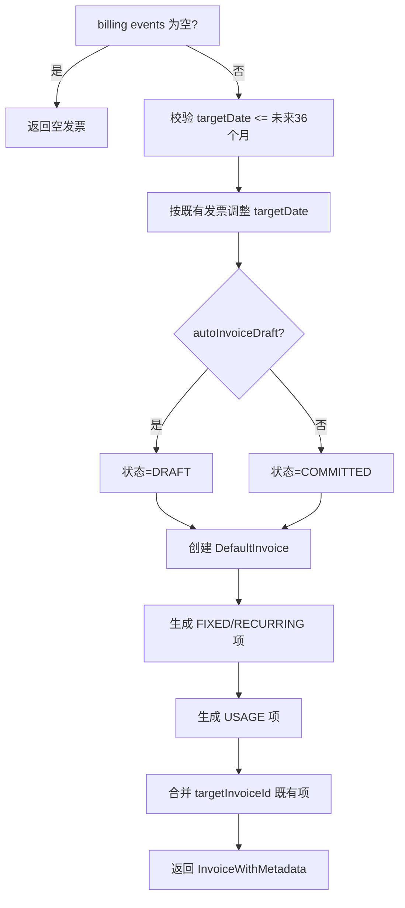
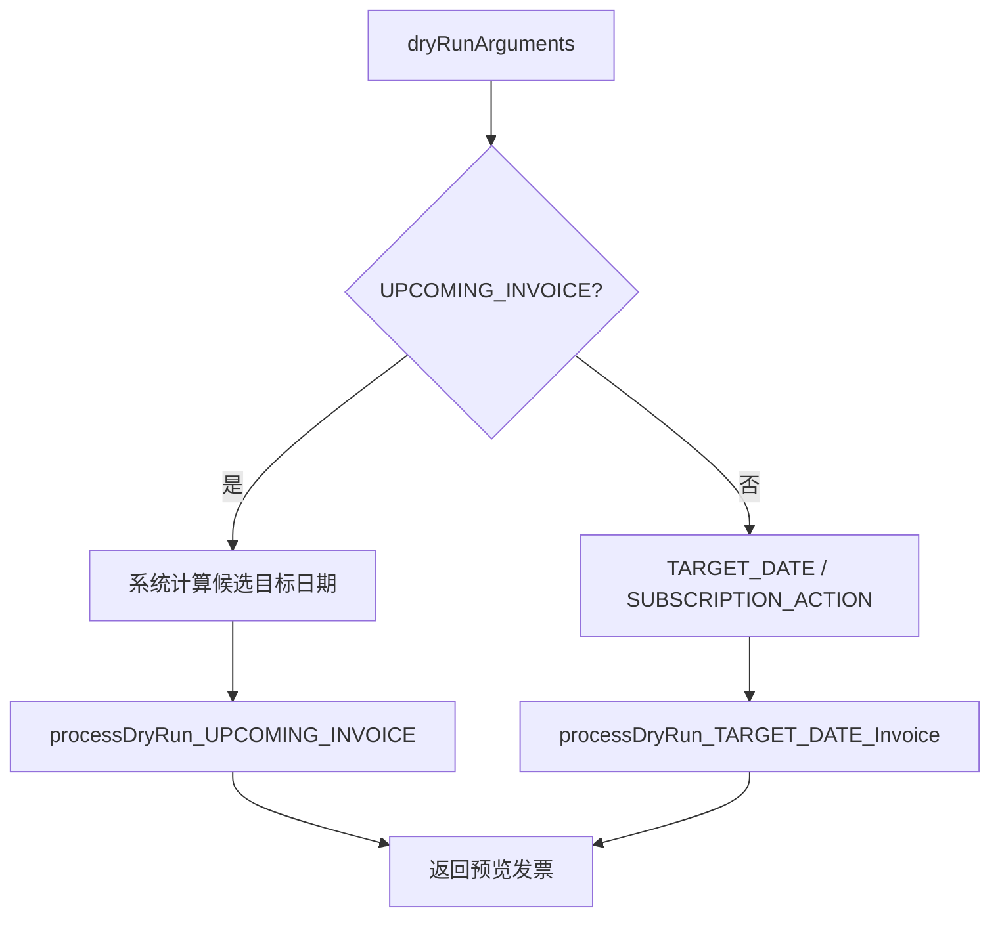
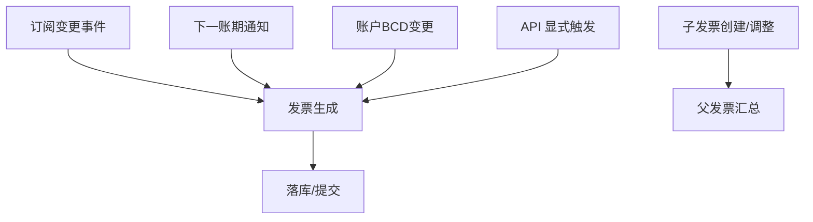
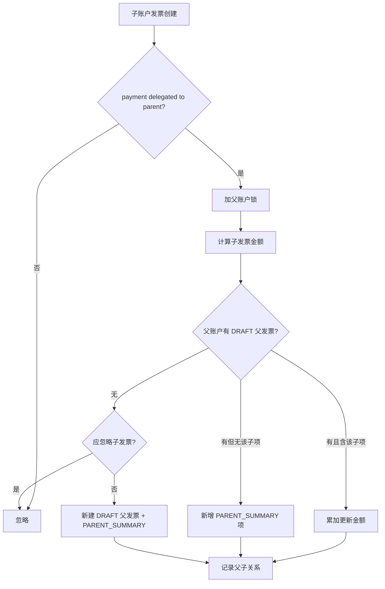
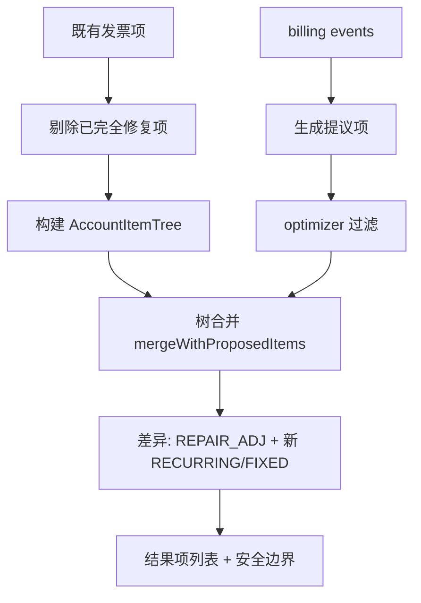
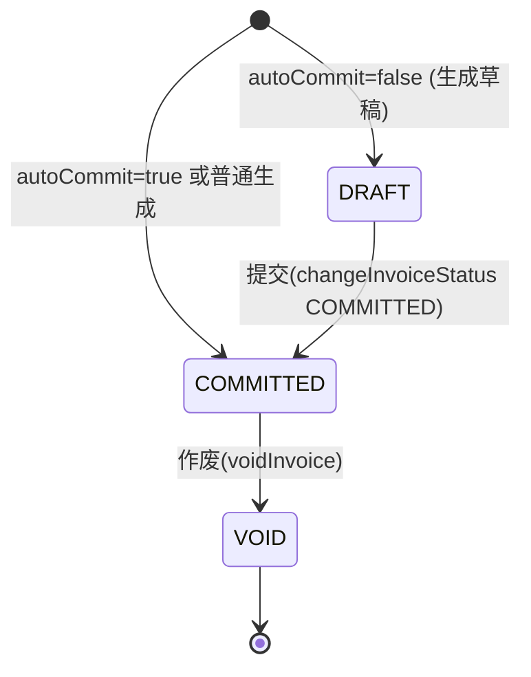

# invoice 模块业务知识

### 模块概览

发票：发票生成、余额与信用、父子账户汇总、用量计费落地、修复与作废。

- **模块**: invoice
- **源码根**: `invoice/src/main/java/org/killbill/billing/invoice/`
- **卡片总数**: 96（术语 10 / 实体 8 / 规则 69 / 流程 7 / 状态机 1 / 角色权限 1）
- **全局 ID 前缀**: TERM-/ENT-/BR-/WF-/SM-/ROLE-（全局唯一，跨模块共享编号空间）

> 说明：本文件为该模块的深度视图，卡片与全局类型文件（glossary.md / entities.md / rules.md / workflows.md / state-machines.md / roles-permissions.md）中的同一全局 ID 对应。跨模块合并的卡会同时出现在多个模块视图中。

## TERM-007 用量类型 (UsageType : CONSUMABLE / CAPACITY)

- **类型**: 术语
- **同义词**: 用量类型, 消耗型, 容量型, consumable, capacity, usage type, UsageType, CAPACITY, CONSUMABLE, 容量计费, 消耗量计费, 按量计费, 消费型用量, 用量累加, consumable usage, usage-based, metered, 容量型用量, 峰值用量, 取最大值, capacity usage, peak usage, max usage
- **模块**: catalog, invoice, usage
- **置信度**: 🟢 confirmed
- **溯源**: `catalog/src/main/java/org/killbill/billing/catalog/DefaultUsage.java:212-229`, `invoice/src/main/java/org/killbill/billing/invoice/usage/ContiguousIntervalUsageInArrear.java:142`, `invoice/src/main/java/org/killbill/billing/invoice/usage/ContiguousIntervalUsageInArrear.java:539-548`, `invoice/src/main/java/org/killbill/billing/invoice/usage/UsageUtils.java:34-67`, `invoice/src/main/java/org/killbill/billing/invoice/usage/UsageUtils.java:69-87`

**含义**：`UsageType.CONSUMABLE` 表示按使用量累加计费（用多少算多少）；`UsageType.CAPACITY` 表示按容量/上限计费。校验规则要求 IN_ADVANCE+CAPACITY 必须定义 limits、IN_ADVANCE+CONSUMABLE 必须定义 blocks。

**说明**：用量（usage）分两类：
- `CAPACITY`（容量型）：同一计费周期内取**峰值**（最大值）计费；
- `CONSUMABLE`（消耗型）：同一计费周期内**累加**所有用量计费。

**含义**：目录 `UsageType.CONSUMABLE`，表示「按消耗计量累加」的用量。开票侧对同一区间内多条记录**求和**（`currentAmount.add(newAmount)`）。

**单位来源**：CONSUMABLE 的单位类型来自目录中各 tier 的 `TieredBlock.getUnit().getName()`（见 BR-012）。

**用量侧视角**：用量模块存储时**不区分** CONSUMABLE/CAPACITY（同一张表、同一套字段）；类型差异只在目录校验与开票聚合时体现（见 BR-014）。

**含义**：目录 `UsageType.CAPACITY`，表示「按容量/峰值计量」的用量。开票侧对同一区间内多条记录**取最大值**（`currentAmount.max(newAmount)`），即按区间内观测到的峰值计费。

**单位来源**：CAPACITY 的单位类型来自目录中各 tier 的 `Limit.getUnit().getName()`（见 BR-012），且 IN_ADVANCE 的 CAPACITY 段必须定义 limits（见 BR-013）。

## TERM-008 分层 (Tier)

- **类型**: 术语
- **同义词**: 分层, 阶梯, 阶梯价, 分层计价, tier, tiered pricing, Tier, pricing tier, 分层定价, 阶梯计费, tiered block, usage tier, 用量档位, 阶梯用量
- **模块**: catalog, invoice
- **置信度**: 🟢 confirmed
- **溯源**: `catalog/src/main/java/org/killbill/billing/catalog/DefaultTier.java:45-62`, `invoice/src/main/java/org/killbill/billing/invoice/usage/UsageUtils.java:34-87`

**含义**：Tier 是 usage 定价的阶梯，每个 Tier 有 `limits`、`blocks`（tieredBlock 列表）以及可选的整段 `fixedPrice`/`recurringPrice`。IN_ARREAR 的 usage 必须定义 tiers。

**说明**：用量价格按目录中的 **Tier（层/档）** 定义：
- `CONSUMABLE` 用量使用 `TieredBlock`（每层一个 block，按用途单位名匹配），量在本层内按块计价；
- `CAPACITY` 用量使用每层的 `Limit` 定义容量区间。
每个用量至少需要一层（`tiers.length > 0`），否则目录视为非法。

## TERM-011 计费模式 (BillingMode)

- **类型**: 术语
- **同义词**: 计费模式, 预付, 后付, 先付, 后付费, billing mode, BillingMode, IN_ADVANCE, IN_ARREAR, 先付费, 欠费开票, 用后付费, 期末计费, in arrear, postpaid, bill in arrears, 预付开票, 预付费, 期初计费, in advance, prepaid, bill in advance
- **模块**: catalog, invoice, usage
- **置信度**: 🟢 confirmed
- **溯源**: `catalog/src/main/java/org/killbill/billing/catalog/DefaultUsage.java:65-66`, `catalog/src/main/java/org/killbill/billing/catalog/DefaultPlan.java:79-81`, `invoice/src/main/java/org/killbill/billing/invoice/generator/FixedAndRecurringInvoiceItemGenerator.java:302-321`, `invoice/src/main/java/org/killbill/billing/invoice/optimizer/InvoiceOptimizerExp.java:147-148`, `catalog/src/main/java/org/killbill/billing/catalog/DefaultUsage.java:212-229`, `invoice/src/main/java/org/killbill/billing/invoice/usage/UsageUtils.java:34-74`

**含义**：`BillingMode` 取值 `IN_ADVANCE`（先付/预付）与 `IN_ARREAR`（后付/后付费）。可用量计费（usage）维度与计划级别 recurring 维度分别声明；计划若缺省则继承目录级 `recurringBillingMode`。

**说明**：`BillingMode` 分两种：
- `IN_ADVANCE`（预付/先付费）：在计费周期**开始时**收费；
- `IN_ARREAR`（后付/后付费）：在计费周期**结束后**收费。

**含义**：`BillingMode.IN_ARREAR`。用量在期末结算，目录中该 usage 段必须有 tiers。开票侧对 IN_ARREAR 的用量按 CONSUMABLE/CAPACITY 分别处理。

**用途侧关联**：用量记录本身就是「先发生、后结算」的数据；`getRawUsageForAccount` 的注释明确这是**唯一用于开票的查询**（见 BR-005）。

**含义**：`BillingMode.IN_ADVANCE`。目录校验要求：IN_ADVANCE + CAPACITY 必须定义 `limits`；IN_ADVANCE + CONSUMABLE 必须定义 `blocks`。用量模块不参与该模式判定，但写入的 `unitType` 必须与目录对应的 limit/block 单位名称匹配。

## TERM-022 发票项类型（InvoiceItemType）

- **类型**: 术语
- **同义词**: 发票项类型, 条目类型, invoice item type, InvoiceItemType, 费用类型, 账单项类型, line item type
- **模块**: invoice
- **置信度**: 🟢 confirmed
- **溯源**: `invoice/src/main/java/org/killbill/billing/invoice/calculator/InvoiceCalculatorUtils.java:39-94`

**说明**：发票项（InvoiceItem）按类型分四类语义：
- **收费项（charge）**：`RECURRING`（周期订阅费）、`FIXED`（固定费/一次性）、`USAGE`（用量费）、`EXTERNAL_CHARGE`（外部收费）、`TAX`（税）。
- **项调整**：`ITEM_ADJ`（针对具体发票项调整）、`REPAIR_ADJ`（修复/改套餐产生的冲销）。
- **账户信用**：`CBA_ADJ`（账户信用余额增减，credit balance adjustment）。
- **发票级信用调整**：`CREDIT_ADJ`（发票级信用）。
- **父账户汇总**：`PARENT_SUMMARY`（父发票上汇总子账户金额的条目）。

## TERM-023 发票项（InvoiceItem）

- **类型**: 术语
- **同义词**: 发票项, 账单项, 条目, invoice item, InvoiceItem, 明细行, line item
- **模块**: invoice
- **置信度**: 🟢 confirmed
- **溯源**: `invoice/src/main/java/org/killbill/billing/invoice/model/InvoiceItemBase.java:34-100`

**说明**：发票项是发票的最小计费单元。公共字段：`invoiceId`、`accountId`、`childAccountId`、`startDate`/`endDate`（计费区间）、`amount`（金额）、`currency`、`description`、`invoiceItemType`（类型）。订阅相关项另有 `subscriptionId`、`bundleId`；周期项有 `rate`；修复项有 `linkedItemId`（被冲销的原项目）；用量项有 `quantity`、`itemDetails`。

## TERM-024 发票支付类型 (InvoicePaymentType)

- **类型**: 术语
- **同义词**: 支付类型, 发票支付, invoice payment type, ATTEMPT, REFUND, CHARGED_BACK, 退款, 拒付, 支付尝试, 发票支付类型, 发票支付记录类型, attempt, refund, chargeback, InvoicePaymentType
- **模块**: invoice, payment
- **置信度**: 🟢 confirmed
- **溯源**: `invoice/src/main/java/org/killbill/billing/invoice/calculator/InvoiceCalculatorUtils.java:207-242`, `payment/src/main/java/org/killbill/billing/payment/invoice/InvoicePaymentControlPluginApi.java:168-230`, `payment/src/main/java/org/killbill/billing/payment/invoice/InvoicePaymentControlPluginApi.java:665-673`, `payment/src/main/java/org/killbill/billing/payment/api/DefaultInvoicePaymentApi.java:93-178`

**说明**：发票支付（InvoicePayment）对应支付类型：`ATTEMPT`（支付尝试，成功则计入已付）、`REFUND`（退款）、`CHARGED_BACK`（拒付/退单）。只有支付状态为 `SUCCESS`（InvoicePaymentStatus.SUCCESS）的记录才计入金额统计。

**定义**：发票上的支付记录按类型区分：
- `ATTEMPT`：一次扣款尝试（成功或失败），对应一个 purchase 交易；发票余额计算中 ATTEMPT 视为支付入账；
- `REFUND`：退款记录（退款成功后写入，金额为负向影响发票余额）；
- `CHARGED_BACK`：拒付/退单记录（撤销原扣款）。

**退款如何呈现**：一笔退款在支付侧表现为一条 `TransactionType.REFUND` 的 PaymentTransaction，在发票侧表现为一条 `InvoicePaymentType.REFUND` 的 InvoicePayment（通过 `invoiceApi.recordRefund` 写入），支持部分退款（按发票项金额或显式金额，见 BR-009）。

## TERM-025 干跑类型（DryRunType）

- **类型**: 术语
- **同义词**: 干跑, 预演, dry run, DryRunType, 试算发票, 模拟开票, UPCOMING_INVOICE, TARGET_DATE, SUBSCRIPTION_ACTION
- **模块**: invoice
- **置信度**: 🟢 confirmed
- **溯源**: `invoice/src/main/java/org/killbill/billing/invoice/InvoiceDispatcher.java:362-374`, `api/src/main/java/org/killbill/billing/invoice/api/DryRunInfo.java:22-39`

**说明**：干跑（dry-run）表示“只试算、不落库”地生成一张预览发票。`DryRunType` 有三种取值：
- `TARGET_DATE`：按给定目标日期试算；
- `UPCOMING_INVOICE`：由系统自动计算下一张发票的目标日期（此时 inputTargetDate 允许为 null）；
- `SUBSCRIPTION_ACTION`：模拟某个订阅动作（如改套餐/取消）后的开票结果，使用该动作的 effectiveDate。

## TERM-026 分比（Proration）

- **类型**: 术语
- **同义词**: 分比, 按比例分摊, proration, pro-ration, 按天折算
- **模块**: invoice
- **置信度**: 🟢 confirmed
- **溯源**: `invoice/src/main/java/org/killbill/billing/invoice/generator/FixedAndRecurringInvoiceItemGenerator.java:75-77`, `invoice/src/main/java/org/killbill/billing/invoice/tree/Item.java:162`

**说明**：分比（pro-ration）指对**不足一个完整计费周期**的使用期间，按天/比例折算应收费用。常见于套餐中途变更、取消、订阅创建未对齐 BCD 等场景。相关计算：`calculateProRationBeforeFirstBillingPeriod`、`calculateProRationAfterLastBillingCycleDate`、`calculateProrationBetweenDates`。

## TERM-027 展示名（pretty name）

- **类型**: 术语
- **同义词**: 展示名, 友好名称, pretty name, prettyPlanName, prettyProductName, 显示名称
- **模块**: invoice
- **置信度**: 🟢 confirmed
- **溯源**: `invoice/src/main/java/org/killbill/billing/invoice/model/InvoiceItemFactory.java:131-205`

**说明**：`pretty*` 名称是根据目录（catalog）为发票项计算出的**人类可读展示名**（prettyProductName / prettyPlanName / prettyPhaseName / prettyUsageName），仅对 `FIXED`/`RECURRING`/`TAX`/`USAGE` 类型计算；计算失败或目录缺失时为 null，此时回退到原始名称。

## TERM-028 自动开票关闭标签 (AUTO_INVOICING_OFF)

- **类型**: 术语
- **同义词**: 自动开票关闭, auto invoice off, auto_invoice_off, 停止自动开票, 暂停出账, 关闭自动开票, 停止开票, 停止生成发票, AUTO_INVOICING_OFF, auto invoicing off, AUTO_INVOICE_OFF
- **模块**: invoice, overdue
- **置信度**: 🟢 confirmed
- **溯源**: `invoice/src/main/java/org/killbill/billing/invoice/generator/FixedAndRecurringInvoiceItemGenerator.java:108-110`, `invoice/src/main/java/org/killbill/billing/invoice/InvoiceDispatcher.java:387-389`, `overdue/src/main/java/org/killbill/billing/overdue/applicator/OverdueStateApplicator.java:176-183`, `overdue/src/main/java/org/killbill/billing/overdue/applicator/OverdueStateApplicator.java:237-253`

**说明**：对标记为 `auto_invoice_off` 的订阅，系统在生成固定/周期发票项时会**跳过**其 billing events（不生成该项）；对 `isAccountAutoInvoiceOff()` 为 true 的账户，非 API 触发的开票直接返回空（不自动开票）。

**含义**：账户级控制标签。overdue 不会由用户直接配置它，而是**自动维护**：当状态从「不 block billing」变为「block billing」时自动打上，避免继续产生额外发票/信用；当从 block billing 回落时自动移除。见 BR-015。

## ENT-013 发票（Invoice）

- **类型**: 业务实体
- **同义词**: 发票, invoice, Invoice, 账单, 单据
- **模块**: invoice
- **置信度**: 🟢 confirmed
- **溯源**: `invoice/src/main/java/org/killbill/billing/invoice/model/DefaultInvoice.java:44-127`

**说明**：发票实体关键属性：`accountId`、`invoiceNumber`（发票号）、`invoiceDate`（开票日期）、`targetDate`（目标日期）、`currency`/`processedCurrency`、`status`（DRAFT/COMMITTED/VOID）、`isMigrationInvoice`、`isWrittenOff`（核销）、`isParentInvoice`、`parentInvoice`（父发票，用于 HA/父子账户）、`grpId`（分组 id，用于一次开票产生的多张发票归组）。
**关系**：一张发票包含多个 `InvoiceItem` 与多个 `InvoicePayment`（支付）。

## ENT-014 账户信用余额调整项（CreditBalanceAdjInvoiceItem / CBA）

- **类型**: 业务实体
- **同义词**: 信用余额调整项, CBA项, credit balance adjustment item, CBA_ADJ, 账户信用项
- **模块**: invoice
- **置信度**: 🟢 confirmed
- **溯源**: `invoice/src/main/java/org/killbill/billing/invoice/dao/CBADao.java:243-251`, `invoice/src/main/java/org/killbill/billing/invoice/calculator/InvoiceCalculatorUtils.java:78-80`

**说明**：`CreditBalanceAdjInvoiceItem` 是类型为 `CBA_ADJ` 的发票项，用于表示账户信用余额的变化（消费或累积）。构建时以传入金额的负值 `amount.negate()` 记账。

## ENT-015 用量发票项（UsageInvoiceItem）

- **类型**: 业务实体
- **同义词**: 用量发票项, 使用量条目, usage invoice item, UsageInvoiceItem, USAGE item, 用量明细
- **模块**: invoice
- **置信度**: 🟢 confirmed
- **溯源**: `invoice/src/main/java/org/killbill/billing/invoice/usage/ContiguousIntervalUsageInArrear.java:345-356`, `invoice/src/main/java/org/killbill/billing/invoice/usage/ContiguousIntervalUsageInArrear.java:573-597`

**说明**：类型为 `USAGE` 的发票项，记录某订阅某用量在 `[startDate, endDate)` 区间的费用。关键字段：`usageName`（用量名，与目录一致）、`startDate`/`endDate`（计费区间）、`amount`、`itemDetails`（用量明细聚合的 JSON）。去重与“已计费金额”比较均基于 usageName + 区间。

## ENT-016 父汇总发票项（ParentInvoiceItem / PARENT_SUMMARY）

- **类型**: 业务实体
- **同义词**: 父汇总项, 父子账户, parent summary, PARENT_SUMMARY, ParentInvoiceItem, HA 发票项
- **模块**: invoice
- **置信度**: 🟢 confirmed
- **溯源**: `invoice/src/main/java/org/killbill/billing/invoice/InvoiceDispatcher.java:1380-1396`, `invoice/src/main/java/org/killbill/billing/invoice/calculator/InvoiceCalculatorUtils.java:82-85`

**说明**：类型为 `PARENT_SUMMARY` 的发票项，挂在**父账户的父发票**上，用于汇总某个子账户的发票金额。关键字段：`childAccountId`（对应子账户）、`amount`、`description`（`<子账户externalKey> summary`）。

## ENT-017 发票支付 (InvoicePayment)

- **类型**: 业务实体
- **同义词**: 发票支付, 支付记录, invoice payment, InvoicePayment, 付款, 退款记录, 发票付款记录, 发票扣款记录, 支付与发票关联
- **模块**: invoice, payment
- **置信度**: 🟢 confirmed
- **溯源**: `invoice/src/main/java/org/killbill/billing/invoice/model/DefaultInvoicePayment.java:34-72`, `payment/src/main/java/org/killbill/billing/payment/api/DefaultInvoicePaymentApi.java:60-63`, `payment/src/main/java/org/killbill/billing/payment/invoice/InvoicePaymentControlPluginApi.java:168-206`

**说明**：表示发票上的一条支付/退款记录，属性：`type`（InvoicePaymentType：ATTEMPT/REFUND/CHARGED_BACK）、`paymentId`、`invoiceId`、`paymentDate`、`amount`、`currency`、`processedCurrency`、`paymentCookieId`、`linkedInvoicePaymentId`（关联的支付，如退款关联原支付）、`status`（InvoicePaymentStatus，默认 `SUCCESS`）。

**定义**：InvoicePayment 表示一笔 payment 与一张 invoice 的关联记录，含 `type`（如 `InvoicePaymentType.ATTEMPT`）、`status`（`InvoicePaymentStatus`：INIT/SUCCESS/PENDING）、`paymentCookieId`（关联的 payment transaction externalKey）、金额与币种。支付成功后由控制插件调用 `invoiceApi.recordPaymentAttemptCompletion` 写回。

## ENT-018 周期发票项（RecurringInvoiceItem）

- **类型**: 业务实体
- **同义词**: 周期项, 订阅费, 月费, recurring item, RecurringInvoiceItem, RECURRING, 订阅周期费用
- **模块**: invoice
- **置信度**: 🟢 confirmed
- **溯源**: `invoice/src/main/java/org/killbill/billing/invoice/model/RecurringInvoiceItem.java:33-57`, `invoice/src/main/java/org/killbill/billing/invoice/generator/FixedAndRecurringInvoiceItemGenerator.java:260-278`

**说明**：类型为 `RECURRING` 的发票项，表示按 billingPeriod 重复收取的订阅费。含 `bundleId`/`subscriptionId`、`productName`/`planName`/`phaseName`、`catalogEffectiveDate`、`startDate`/`endDate`、`amount`、`rate`。生成时 `amount = 周期数 × rate × quantity`（`rate` 为每周期单价，`quantity` 默认 1）。

## ENT-019 固定费用发票项（FixedPriceInvoiceItem）

- **类型**: 业务实体
- **同义词**: 固定费用, 一次性费用, 初装费, fixed price, FixedPriceInvoiceItem, FIXED, 固定价
- **模块**: invoice
- **置信度**: 🟢 confirmed
- **溯源**: `invoice/src/main/java/org/killbill/billing/invoice/model/FixedPriceInvoiceItem.java:32-66`, `invoice/src/main/java/org/killbill/billing/invoice/model/FixedPriceInvoiceItem.java:98-114`

**说明**：类型为 `FIXED` 的发票项，表示阶段（phase）开始时一次性收取的固定费用（无 `rate`，只有金额与日期）。描述默认 `"Fixed price charge"`；若有 phase 名则默认 `<phase> (fixed price)`。

## ENT-020 外部收费发票项（ExternalChargeInvoiceItem）

- **类型**: 业务实体
- **同义词**: 外部收费, 手动收费, 附加费用, external charge, ExternalChargeInvoiceItem, EXTERNAL_CHARGE, 额外收费
- **模块**: invoice
- **置信度**: 🟢 confirmed
- **溯源**: `invoice/src/main/java/org/killbill/billing/invoice/model/ExternalChargeInvoiceItem.java:32-58`, `invoice/src/main/java/org/killbill/billing/invoice/model/ExternalChargeInvoiceItem.java:91-103`

**说明**：类型为 `EXTERNAL_CHARGE` 的发票项，用于在订阅计费之外手动/外部加收费用，可关联 bundle/subscription。描述默认 `"External charge"` 或 `<plan> (external charge)`。

## BR-035 发票未来生成最大月数

- **类型**: 业务规则
- **同义词**: 发票生成未来月数, 最多提前几个月开票, 目标日期上限, max months in future, maxNumberOfMonthsInFuture
- **模块**: invoice
- **置信度**: 🟢 confirmed
- **溯源**: `util/src/main/java/org/killbill/billing/util/config/definition/InvoiceConfig.java:63-71`

**规则**：生成（或干跑 dry-run）发票时，最多只考虑未来 36 个月内的目标日期（targetDate）。配置项 `org.killbill.invoice.maxNumberOfMonthsInFuture`，默认值 `36`。

**用途**：限制一次性提前生成过多期发票，避免未来账期被过度预开。

## BR-036 用量重复计费防护（tracking id 去重 + 已开票区间跳过）

- **类型**: 业务规则
- **同义词**: 用量去重, 防止重复计费, usage dedup, tracking id, 已开票跳过, double billing usage, 跟踪号去重, 幂等, 重复提交拦截, tracking id duplicate, idempotency, 重复用量
- **模块**: invoice, usage
- **置信度**: 🟢 confirmed
- **溯源**: `invoice/src/main/java/org/killbill/billing/invoice/usage/ContiguousIntervalUsageInArrear.java:290-307`, `invoice/src/main/java/org/killbill/billing/invoice/usage/ContiguousIntervalUsageInArrear.java:333-356`, `usage/src/main/java/org/killbill/billing/usage/api/user/DefaultUsageUserApi.java:74-82`, `usage/src/main/java/org/killbill/billing/usage/dao/RolledUpUsageSqlDao.java:36-39`

**规则**：
1. 每条原始用量带 tracking id；只有**不在既有 tracking id 集合**中的用量才会被计费（新增用量）。
2. 若某个用量区间已被既有 `USAGE` 发票项覆盖（同 usage name 且 start/end 落入既有项内），则**跳过**该区间，避免重复计费（尤其阻断/重跑场景）。

**规则**：调用方传入非空 `trackingId` 时，先查该订阅下是否已存在相同 `trackingId` 的行（`recordsWithTrackingIdExist`，SQL `select 1 ... where subscription_id=? and tracking_id=? ... limit 1`）。若已存在 → 抛 `UsageApiException(ErrorCode.USAGE_RECORD_TRACKING_ID_ALREADY_EXISTS, trackingId)`，整批用量不落库。

**范围**：去重键是 `(subscription_id, tracking_id, tenant_record_id)`（索引 `rolled_up_usage_tracking_id_subscription_id_tenant_record_id`）。因此同一 trackingId 在**不同订阅**下互不影响。

## BR-037 发票防重复计费安全检查

- **类型**: 业务规则
- **同义词**: 防重复计费, 计费安全检查, 幂等保护, sanity check, sanitySafetyBoundEnabled, double billing
- **模块**: invoice
- **置信度**: 🟢 confirmed
- **溯源**: `util/src/main/java/org/killbill/billing/util/config/definition/InvoiceConfig.java:73-81`

**规则**：系统默认开启内部安全检查（`org.killbill.invoice.sanitySafetyBoundEnabled` = `true`），用于防止错误计费与重复计费（mis- and double-billing）。关闭后不推荐用于生产。

## BR-038 零金额用量项是否写出

- **类型**: 业务规则
- **同义词**: 零金额用量项, 0元用量, $0 usage, zero amount, disable.usage.zero.amount, isUsageZeroAmountDisabled
- **模块**: invoice
- **置信度**: 🟢 confirmed
- **溯源**: `util/src/main/java/org/killbill/billing/util/config/definition/InvoiceConfig.java:84-92`

**规则**：配置项 `org.killbill.invoice.disable.usage.zero.amount` 默认 `false`，即**默认会写出金额为 $0 的用量项**。设为 `true` 时禁用写入 $0 用量项（不生成零金额用量行）。

## BR-039 缺失历史用量记录时的处理

- **类型**: 业务规则
- **同义词**: 缺失用量记录, 用量数据缺失, missing usage, usage.missing.lenient, 用量宽容模式
- **模块**: invoice
- **置信度**: 🟢 confirmed
- **溯源**: `util/src/main/java/org/killbill/billing/util/config/definition/InvoiceConfig.java:94-102`

**规则**：配置项 `org.killbill.invoice.usage.missing.lenient` 默认 `false`（不宽容）。默认情况下，若发现过去存在缺失的用量记录，发票生成会**失败**；设为 `true` 时改为宽容处理，不因缺失用量记录而使发票失败。

## BR-040 每日每订阅最大发票项数

- **类型**: 业务规则
- **同义词**: 每日发票项上限, 每天最多开多少项, maxDailyNumberOfItemsSafetyBound, daily items safety bound
- **模块**: invoice
- **置信度**: 🟢 confirmed
- **溯源**: `util/src/main/java/org/killbill/billing/util/config/definition/InvoiceConfig.java:104-112`

**规则**：对单个订阅（subscription id）每日生成的发票项数量上限为 `15`。配置项 `org.killbill.invoice.maxDailyNumberOfItemsSafetyBound`，默认值 `15`，作为安全边界防止异常爆炸式开票。

## BR-041 干跑发票通知提前时间

- **类型**: 业务规则
- **同义词**: 干跑通知, 预开票通知, dry run notification, dryRunNotificationSchedule, 提前通知时间
- **模块**: invoice
- **置信度**: 🟢 confirmed
- **溯源**: `util/src/main/java/org/killbill/billing/util/config/definition/InvoiceConfig.java:114-122`

**规则**：DryRun（干跑）发票通知在目标日期（targetDate）**之前**发送。配置项 `org.killbill.invoice.dryRunNotificationSchedule` 默认 `0s`；当设为 `0s` 时该通知被忽略（不发送）。

## BR-042 原始用量回看账期数（usage lookback）

- **类型**: 业务规则
- **同义词**: 用量回看, 回看账期, usage lookback, readMaxRawUsagePreviousPeriod, 历史用量读取期数, 用量优化
- **模块**: invoice
- **置信度**: 🟢 confirmed
- **溯源**: `util/src/main/java/org/killbill/billing/util/config/definition/InvoiceConfig.java:124-132`

**规则**：用量优化（usage optimization）时，系统最多读取**过去 2 个账期**的原始用量（raw usage）数据。配置项 `org.killbill.invoice.readMaxRawUsagePreviousPeriod`，默认值 `2`。

**用途**：限制每期开票时回查历史原始用量的范围，用于处理迟到/跨期的用量点。

## BR-043 全局锁获取最大重试次数

- **类型**: 业务规则
- **同义词**: 全局锁重试, global lock retries, globalLock.retries, 锁重试次数
- **模块**: invoice
- **置信度**: 🟢 confirmed
- **溯源**: `util/src/main/java/org/killbill/billing/util/config/definition/InvoiceConfig.java:134-137`

**规则**：系统获取全局锁最多重试 `50` 次，每次等待 100ms。配置项 `org.killbill.invoice.globalLock.retries`，默认值 `50`。

## BR-044 默认发票插件

- **类型**: 业务规则
- **同义词**: 发票插件, invoice plugin, 默认插件, org.killbill.invoice.plugin
- **模块**: invoice
- **置信度**: 🟢 confirmed
- **溯源**: `util/src/main/java/org/killbill/billing/util/config/definition/InvoiceConfig.java:139-147`

**规则**：配置项 `org.killbill.invoice.plugin` 默认为空字符串 `""`，即默认不加载任何发票插件。可配置一个（逗号分隔的）发票插件名列表，插件可在发票生成过程中注入/调整发票项。

## BR-045 发票创建邮件通知开关

- **类型**: 业务规则
- **同义词**: 发票邮件通知, invoice email notification, emailNotificationsEnabled, 开票发邮件
- **模块**: invoice
- **置信度**: 🟢 confirmed
- **溯源**: `util/src/main/java/org/killbill/billing/util/config/definition/InvoiceConfig.java:149-152`

**规则**：配置项 `org.killbill.invoice.emailNotificationsEnabled` 默认 `false`。开启后，对已配置的账户在发票创建时发送邮件通知。

## BR-046 发票系统总开关

- **类型**: 业务规则
- **同义词**: 发票系统开关, invoicing enabled, invoice.enabled, 关闭开票
- **模块**: invoice
- **置信度**: 🟢 confirmed
- **溯源**: `util/src/main/java/org/killbill/billing/util/config/definition/InvoiceConfig.java:154-157`

**规则**：配置项 `org.killbill.invoice.enabled` 默认 `true`，即发票系统默认启用。设为 `false` 可整体关闭开票系统。

## BR-047 用量聚合规则（CAPACITY 取峰值 / CONSUMABLE 累加）

- **类型**: 业务规则
- **同义词**: 用量聚合, 峰值计费, 累加计费, usage aggregation, capacity max, consumable sum, 用量合并, 容量取最大, 消费求和
- **模块**: invoice, usage
- **置信度**: 🟢 confirmed
- **溯源**: `invoice/src/main/java/org/killbill/billing/invoice/usage/ContiguousIntervalUsageInArrear.java:539-548`

**规则**：把同一区间内的多条原始用量合并为一个金额时：
- 若 usage 类型为 `CAPACITY` → 取 `max(当前值, 新值)`（保留峰值）；
- 若为 `CONSUMABLE` → 取 `当前值 + 新值`（累加）。

**规则**（开票侧聚合，用量数据的使用方语义）：对同一单位类型在一段计费区间内的多次观测值 `computeUpdatedAmount(current, new)`：
- `UsageType.CAPACITY` → 返回 `max(current, new)`（区间峰值）。
- 否则（`UsageType.CONSUMABLE`）→ 返回 `current.add(new)`（多点累加）。
- 任一侧为 `null` 视为 `ZERO` 再参与运算。

**用量侧关联**：用量模块本身按 BR-006 对查询区间求和；CAPACITY 的「取最大」发生在开票消费这些原始/汇总数据时（`SubscriptionUsageInArrear` 按 usageType 选择不同 interval 实现，见 `invoice/.../SubscriptionUsageInArrear.java:188-193`）。

## BR-048 父发票自动提交时间

- **类型**: 业务规则
- **同义词**: 父发票提交, 父账户发票, parent invoice commit, parentAutoCommitUtcTime, HA发票提交时间
- **模块**: invoice
- **置信度**: 🟢 confirmed
- **溯源**: `util/src/main/java/org/killbill/billing/util/config/definition/InvoiceConfig.java:159-167`

**规则**：父账户（parent account）发票每天在指定 UTC 时间自动提交（commit）。配置项 `org.killbill.invoice.parent.commit.local.utc.time` 默认 `23:59:59.999`。

## BR-049 发票项结果报告模式

- **类型**: 业务规则
- **同义词**: 发票项结果模式, 聚合模式, 明细模式, aggregate vs detail, item.result.behavior.mode, UsageDetailMode
- **模块**: invoice
- **置信度**: 🟢 confirmed
- **溯源**: `util/src/main/java/org/killbill/billing/util/config/definition/InvoiceConfig.java:53-56`, `util/src/main/java/org/killbill/billing/util/config/definition/InvoiceConfig.java:174-182`

**规则**：发票项结果报告方式由 `org.killbill.invoice.item.result.behavior.mode` 控制，默认 `AGGREGATE`（聚合）；可选 `DETAIL`（明细）。对应枚举 `UsageDetailMode { AGGREGATE, DETAIL }`。

## BR-050 用量时区偏移模式

- **类型**: 业务规则
- **同义词**: 用量时区, 夏令时处理, usage timezone, usage.tz.mode, AccountTzOffset, 日光节约
- **模块**: invoice
- **置信度**: 🟢 confirmed
- **溯源**: `util/src/main/java/org/killbill/billing/util/config/definition/InvoiceConfig.java:39-51`, `util/src/main/java/org/killbill/billing/util/config/definition/InvoiceConfig.java:185-193`

**规则**：控制用量点（usage points）在夏令时（DST）下的归属，配置项 `org.killbill.invoice.usage.tz.mode`，默认 `FIXED`。
- `FIXED`：使用账户创建时一次性计算的固定时区偏移（与 RECURRING 发票项行为一致）。
- `VARIABLE`：按当前年内所处时间重新计算偏移，使相同 TZ/订阅/用量点的相似账户结果一致（夏/冬季开始时间不同也不受影响）。

## BR-051 in-arrear 计划计费模式

- **类型**: 业务规则
- **同义词**: 后付费模式, in arrear mode, inArrear.mode, GREEDY, 后计费策略
- **模块**: invoice
- **置信度**: 🟢 confirmed
- **溯源**: `util/src/main/java/org/killbill/billing/util/config/definition/InvoiceConfig.java:58-61`, `util/src/main/java/org/killbill/billing/util/config/definition/InvoiceConfig.java:195-203`

**规则**：配置项 `org.killbill.invoice.inArrear.mode` 默认 `DEFAULT`，决定系统对 in-arrear（后付费）计划的处理行为；可选 `GREEDY`。对应枚举 `InArrearMode { DEFAULT, GREEDY }`。

## BR-052 目录中未定义的用量处理（可挂起账户）

- **类型**: 业务规则
- **同义词**: 未知用量挂起, park account, 挂起账户, parkAccountsWithUnknownUsage, 账户暂停, 未知用量单位, unknown usage unit, unit type not defined, park account usage, 未知用量, 未定义用量, park账户, unknown usage, park accounts, usage not in catalog
- **模块**: invoice, usage
- **置信度**: 🟢 confirmed
- **溯源**: `util/src/main/java/org/killbill/billing/util/config/definition/InvoiceConfig.java:205-213`, `invoice/src/main/java/org/killbill/billing/invoice/usage/ContiguousIntervalUsageInArrear.java:485-505`

**规则**：配置项 `org.killbill.invoice.parkAccountsWithUnknownUsage` 默认 `false`。设为 `true` 时，若记录了用量数据但该用量在目录（catalog）中未定义，则将该账户挂起（park）。

**规则**：当上报的用量单位类型（unitType）**未在任何 billing event 的目录中定义**时：
- 若 `org.killbill.invoice.parkAccountsWithUnknownUsage` = `true` → 抛 `InvoiceApiException`（ILLEGAL INVOICING STATE），导致账户被挂起；
- 否则 → 记录告警并**忽略**该单位类型，同时移除其关联的 tracking id。

**规则**：系统属性 `org.killbill.invoice.parkAccountsWithUnknownUsage`（默认 `false`）控制：当账户记录了目录中未定义的用量数据时，是否将该账户 park（暂停自动开票，直到人工介入）。

**含义**：这是用量数据与目录一致性问题（BR-012）的兜底策略，由开票侧读取，用量模块不读取该配置。

## BR-053 不可恢复异常时挂起账户

- **类型**: 业务规则
- **同义词**: 异常挂起账户, park on exceptions, parkAccountsOnAllExceptions, 发票处理失败挂起
- **模块**: invoice
- **置信度**: 🟢 confirmed
- **溯源**: `util/src/main/java/org/killbill/billing/util/config/definition/InvoiceConfig.java:215-223`

**规则**：配置项 `org.killbill.invoice.parkAccountsOnAllExceptions` 默认 `true`。当发票处理发生不可恢复失败（锁失败、订阅者异常、billing event 获取失败）时，默认将账户挂起。

## BR-054 发票生成最大回看时间

- **类型**: 业务规则
- **同义词**: 发票回看限制, 最大回看时间, maxInvoiceLimit, 开票时间下限, 追溯多久
- **模块**: invoice
- **置信度**: 🟢 confirmed
- **溯源**: `util/src/main/java/org/killbill/billing/util/config/definition/InvoiceConfig.java:37`, `util/src/main/java/org/killbill/billing/util/config/definition/InvoiceConfig.java:225-233`

**规则**：发票生成向前回看（look back）的时间上限由 `org.killbill.invoice.maxInvoiceLimit` 控制，默认 `DEFAULT_NULL_PERIOD` = `P200Y`（200 年，实际等于不限）。用于限定发票生成时追溯历史 billing events 的最远时间。

## BR-055 固定天数免分比

- **类型**: 业务规则
- **同义词**: 免分比, 分比天数, proration fixed days, proration.fixed.days, 避免按比例分摊
- **模块**: invoice
- **置信度**: 🟢 confirmed
- **溯源**: `util/src/main/java/org/killbill/billing/util/config/definition/InvoiceConfig.java:235-243`

**规则**：配置项 `org.killbill.invoice.proration.fixed.days` 默认 `0`。设置一个月内的固定天数以避免分比（proration）；`0` 表示不启用该固定天数行为。

## BR-056 发票余额计算（balance）

- **类型**: 业务规则
- **同义词**: 发票余额, 欠款, 应收, invoice balance, getBalance, outstanding amount, 未付金额, 余额怎么算
- **模块**: invoice
- **置信度**: 🟢 confirmed
- **溯源**: `invoice/src/main/java/org/killbill/billing/invoice/calculator/InvoiceCalculatorUtils.java:96-110`

**规则**：发票原始余额 `computeRawInvoiceBalance` = **计费金额合计 − 已付金额合计（含退款）**：
- `amountPaid = computeInvoiceAmountPaid + computeInvoiceAmountRefunded`
- `chargedAmount = computeInvoiceAmountCharged + computeInvoiceAmountCredited + computeInvoiceAmountAdjustedForAccountCredit`
- `invoiceBalance = chargedAmount + (−amountPaid)`

## BR-057 发票余额为零的情形

- **类型**: 业务规则
- **同义词**: 余额为零, 无需付款, zero balance, 已核销, 草稿发票余额, 作废发票余额, written off
- **模块**: invoice
- **置信度**: 🟢 confirmed
- **溯源**: `invoice/src/main/java/org/killbill/billing/invoice/model/DefaultInvoice.java:273-288`

**规则**：满足以下任一条件时，`getBalance()` 直接返回 `BigDecimal.ZERO`：
1. 发票已核销（`isWrittenOff()`）；
2. 迁移发票（`isMigrationInvoice()`）；
3. 状态为 `DRAFT`；
4. 状态为 `VOID`；
5. 父发票余额为 0（`hasZeroParentBalance()`）。
否则按 BR-020 的公式计算。

## BR-058 发票已付金额（paid amount）

- **类型**: 业务规则
- **同义词**: 已付金额, 已支付, paid amount, amountPaid, 付款统计
- **模块**: invoice
- **置信度**: 🟢 confirmed
- **溯源**: `invoice/src/main/java/org/killbill/billing/invoice/calculator/InvoiceCalculatorUtils.java:207-223`

**规则**：`computeInvoiceAmountPaid` 只累计**支付状态为 SUCCESS 且类型为 ATTEMPT** 的发票支付金额。其他支付状态或类型的记录不计入已付金额。

## BR-059 发票已退款金额（refunded amount）

- **类型**: 业务规则
- **同义词**: 已退款金额, 退款统计, refunded amount, 拒付金额, charged back
- **模块**: invoice
- **置信度**: 🟢 confirmed
- **溯源**: `invoice/src/main/java/org/killbill/billing/invoice/calculator/InvoiceCalculatorUtils.java:225-242`

**规则**：`computeInvoiceAmountRefunded` 只累计**支付状态为 SUCCESS 且类型为 REFUND 或 CHARGED_BACK** 的金额。非 SUCCESS 的记录跳过。

## BR-060 发票计费金额组成（charged amount）

- **类型**: 业务规则
- **同义词**: 计费金额, 应收金额, charged amount, amountCharged, 发票总额, 账单金额
- **模块**: invoice
- **置信度**: 🟢 confirmed
- **溯源**: `invoice/src/main/java/org/killbill/billing/invoice/calculator/InvoiceCalculatorUtils.java:157-174`

**规则**：`computeInvoiceAmountCharged` 累加满足以下任一条件的发票项金额：
- 收费项（TAX / EXTERNAL_CHARGE / FIXED / USAGE / RECURRING）；或
- 发票级调整项（CREDIT_ADJ，且该发票不是“信用发票”本身）；或
- 项调整（ITEM_ADJ / REPAIR_ADJ）；或
- 父账户汇总项（PARENT_SUMMARY）。

## BR-061 子发票金额（父账户汇总）

- **类型**: 业务规则
- **同义词**: 子发票金额, 父账户汇总, child invoice amount, parent summary, HA子账户金额
- **模块**: invoice
- **置信度**: 🟢 confirmed
- **溯源**: `invoice/src/main/java/org/killbill/billing/invoice/calculator/InvoiceCalculatorUtils.java:112-131`

**规则**：`computeChildInvoiceAmount` 计算应在父发票上汇总的子账户金额：
- 若子发票**无收费项**，返回其信用金额（credited）的负值（仅把信用额从父项金额中扣减）；
- 否则返回 `charged + credited + adjustedForAccountCredit` 的合计。

## BR-062 信用发票识别（CREDIT_ADJ + CBA_ADJ）

- **类型**: 业务规则
- **同义词**: 信用发票, 账户信用, credit invoice, CREDIT_ADJ, CBA_ADJ, 信用余额, account credit
- **模块**: invoice
- **置信度**: 🟢 confirmed
- **溯源**: `invoice/src/main/java/org/killbill/billing/invoice/calculator/InvoiceCalculatorUtils.java:46-70`

**规则**：当一张发票**恰好只有 2 个发票项**，且其中一项为 `CREDIT_ADJ`、另一项为 `CBA_ADJ` 且两者 `invoiceId` 相同、金额互为相反数时，判定为“信用发票”。信用发票允许其 `CREDIT_ADJ` 金额被计入余额调整。

## BR-063 账户信用（CBA）生成与使用规则

- **类型**: 业务规则
- **同义词**: 账户信用, 信用余额, credit balance adjustment, CBA, CBA_ADJ, 抵扣余额, 信用生成, 信用使用
- **模块**: invoice
- **置信度**: 🟢 confirmed
- **溯源**: `invoice/src/main/java/org/killbill/billing/invoice/dao/CBADao.java:63-97`

**规则**：计算发票的信用余额调整（CBA）时：
1. 若发票**余额 < 0**（负余额）→ 生成一条**正向信用**（CBA 项金额取负值，即给账户增加可用信用）。
2. 若发票**余额 > 0** 且发票状态为 `COMMITTED`、**无 PENDING 支付**、且**未核销** → 使用账户已有信用抵扣该发票（消费额 = min(账户 CBA, 发票余额)），生成负向 CBA 项。
3. 若余额为 0 → 不做任何处理。

## BR-064 账户信用按发票日期分配给未付发票

- **类型**: 业务规则
- **同义词**: 信用分配, 抵扣未付发票, distribute CBA, 信用抵扣顺序, account credit allocation
- **模块**: invoice
- **置信度**: 🟢 confirmed
- **溯源**: `invoice/src/main/java/org/killbill/billing/invoice/dao/CBADao.java:172-218`

**规则**：账户可用信用（CBA）会被分配到所有 **COMMITTED 且未付** 的发票上，分配顺序按 `invoiceDate` **升序**（先旧后新），逐张抵扣直到信用耗尽或发票付清。每张发票的抵扣额 = min(剩余信用, 该发票余额)。

## BR-065 发票目标日期上限校验（未来 36 个月）

- **类型**: 业务规则
- **同义词**: 目标日期过远, target date too far, 未来开票上限, INVOICE_TARGET_DATE_TOO_FAR_IN_THE_FUTURE
- **模块**: invoice
- **置信度**: 🟢 confirmed
- **溯源**: `invoice/src/main/java/org/killbill/billing/invoice/generator/DefaultInvoiceGenerator.java:120-126`

**规则**：生成发票时校验目标日期：若 `targetDate` 与当前 UTC 今天的月差**大于** `org.killbill.invoice.maxNumberOfMonthsInFuture`（默认 36），则抛出 `InvoiceApiException`，错误码 `INVOICE_TARGET_DATE_TOO_FAR_IN_THE_FUTURE`。

## BR-066 发票目标日期自动前推（避免回溯重复开票）

- **类型**: 业务规则
- **同义词**: 目标日期调整, adjust target date, 已有未来发票, 防止重复开票
- **模块**: invoice
- **置信度**: 🟢 confirmed
- **溯源**: `invoice/src/main/java/org/killbill/billing/invoice/generator/DefaultInvoiceGenerator.java:128-154`

**规则**：生成发票前，若账户已存在**含 RECURRING 或 USAGE 项**、且其 `targetDate` 晚于本次请求的 `targetDate` 的发票，则把本次 `targetDate` 上调为这些发票中最晚的 `targetDate`（防止对已开票区间重复开票）。

## BR-067 作废发票（VOID）的前置校验

- **类型**: 业务规则
- **同义词**: 作废发票, 发票作废, void invoice, 不能作废, CAN_NOT_VOID, 已支付不能作废, 已修复不能作废
- **模块**: invoice
- **置信度**: 🟢 confirmed
- **溯源**: `invoice/src/main/java/org/killbill/billing/invoice/api/user/DefaultInvoiceUserApi.java:753-825`

**规则**：调用 `voidInvoice` 时依次校验（任一失败即抛 InvoiceApiException）：
1. 若发票状态为 `COMMITTED`：
   - 若发票已被修复（`isRepaired`）→ 抛 `CAN_NOT_VOID_INVOICE_THAT_IS_REPAIRED`；
   - 若发票含“已使用过的正向 CBA 信用” → 抛 `CAN_NOT_VOID_INVOICE_THAT_GENERATED_USED_CREDIT`。
2. 若发票已有支付且已付金额（含退款）≠ 0 → 抛 `CAN_NOT_VOID_INVOICE_THAT_IS_PAID`。
3. 通过后将状态改为 `VOID`。

## BR-068 提交草稿发票（commit）

- **类型**: 业务规则
- **同义词**: 提交发票, 确认发票, commit invoice, 草稿转正式, DRAFT 转 COMMITTED
- **模块**: invoice
- **置信度**: 🟢 confirmed
- **溯源**: `invoice/src/main/java/org/killbill/billing/invoice/api/user/DefaultInvoiceUserApi.java:688-708`

**规则**：`commitInvoice` 将发票状态改为 `COMMITTED`，随后更新其计费截止日期（charged-through dates），并通过发票插件链以 `INVOICE_OPERATION=commit` 派发。

## BR-069 外部收费与信用金额校验

- **类型**: 业务规则
- **同义词**: 外部收费, 手动收费, external charge, 信用金额校验, 金额必须为正, CREDIT_AMOUNT_INVALID, EXTERNAL_CHARGE_AMOUNT_INVALID
- **模块**: invoice
- **置信度**: 🟢 confirmed
- **溯源**: `invoice/src/main/java/org/killbill/billing/invoice/api/user/DefaultInvoiceUserApi.java:556-600`, `invoice/src/main/java/org/killbill/billing/invoice/api/user/DefaultInvoiceUserApi.java:638-646`

**规则**：
- 外部收费（EXTERNAL_CHARGE）或信用（CREDIT_ADJ）金额若为 null 或 < 0 → 抛 `EXTERNAL_CHARGE_AMOUNT_INVALID` / `CREDIT_AMOUNT_INVALID`（金额必须为正）。
- 金额币种必须与账户币种一致，否则 `CURRENCY_INVALID`。
- 若把费用加到**已存在的发票**上：该发票为 `COMMITTED` → 抛 `INVOICE_ALREADY_COMMITTED`；为 `VOID` → 抛 IllegalStateException；仅 `DRAFT` 允许。
- 信用项在写入时金额会被**取负**（`amount.negate()`）。

## BR-070 账户余额与账户信用余额查询

- **类型**: 业务规则
- **同义词**: 账户余额, 账户信用, account balance, account CBA, getAccountBalance, getAccountCBA, 余额查询
- **模块**: invoice
- **置信度**: 🟢 confirmed
- **溯源**: `invoice/src/main/java/org/killbill/billing/invoice/api/user/DefaultInvoiceUserApi.java:229-239`

**规则**：`getAccountBalance(accountId)` 与 `getAccountCBA(accountId)` 从数据库聚合；当结果为空（null）时统一返回 `BigDecimal.ZERO`。

## BR-071 子账户信用转给父账户

- **类型**: 业务规则
- **同义词**: 子账户信用转移, 信用转父账户, transferChildCreditToParent, CHILD_ACCOUNT_MISSING_CREDIT, 父子账户信用
- **模块**: invoice
- **置信度**: 🟢 confirmed
- **溯源**: `invoice/src/main/java/org/killbill/billing/invoice/api/user/DefaultInvoiceUserApi.java:709-731`

**规则**：`transferChildCreditToParent` 前置条件：
1. 子账户必须**存在父账户**，否则抛 `ACCOUNT_DOES_NOT_HAVE_PARENT_ACCOUNT`；
2. 子账户账户信用（CBA）必须 **> 0**，否则抛 `CHILD_ACCOUNT_MISSING_CREDIT`；
3. 通过后将子账户信用转移给父账户。

## BR-072 发票项调整（ITEM_ADJ）校验

- **类型**: 业务规则
- **同义词**: 发票项调整, 条目调整, item adjustment, ITEM_ADJ, INVOICE_ITEM_ADJUSTMENT_AMOUNT_SHOULD_BE_POSITIVE, 调整金额
- **模块**: invoice
- **置信度**: 🟢 confirmed
- **溯源**: `invoice/src/main/java/org/killbill/billing/invoice/api/user/DefaultInvoiceUserApi.java:409-451`

**规则**：`insertInvoiceItemAdjustment`：
1. 若指定了调整金额且 ≤ 0 → 抛 `INVOICE_ITEM_ADJUSTMENT_AMOUNT_SHOULD_BE_POSITIVE`；
2. 目标发票状态为 `VOID` → 抛 `INVOICE_VOID_UPDATED`（作废发票不可调整）；
3. 指定币种必须与发票币种一致，否则 `CURRENCY_INVALID`；
4. 会为被调整项生成一条 `ITEM_ADJ` 项。

## BR-073 发票核销（written off）标记

- **类型**: 业务规则
- **同义词**: 发票核销, 坏账核销, write off, WRITTEN_OFF, tagInvoiceAsWrittenOff, 不再收款
- **模块**: invoice
- **置信度**: 🟢 confirmed
- **溯源**: `invoice/src/main/java/org/killbill/billing/invoice/api/user/DefaultInvoiceUserApi.java:313-335`

**规则**：对发票打上 `WRITTEN_OFF` 控制标签即表示核销（`tagInvoiceAsWrittenOff`），移除该标签为取消核销（`tagInvoiceAsNotWrittenOff`）。核销后发票余额恒为 0（见 BR-021），并会向总线发送发票调整事件（用于 overdue 等）。

## BR-074 用量计费区间按 BCD 对齐

- **类型**: 业务规则
- **同义词**: 用量账期, BCD 对齐, billing cycle day, usage interval, 计费周期划分, transition time
- **模块**: invoice
- **置信度**: 🟢 confirmed
- **溯源**: `invoice/src/main/java/org/killbill/billing/invoice/usage/ContiguousIntervalUsageInArrear.java:155-254`

**规则**：用量计费区间（transitionTimes）按订阅的 **BCD（bill cycle day）** 与用量 billingPeriod 对齐划分；首个与最后区间可能是不完整的（受订阅创建/取消/targetDate 影响）。取消发生的当日用量（cancellation day）会被特殊纳入最后一个区间一并计费。

## BR-075 手动支付账户的发票渲染

- **类型**: 业务规则
- **同义词**: 手动支付, manual pay, MANUAL_PAY, 线下支付, 发票渲染
- **模块**: invoice
- **置信度**: 🟢 confirmed
- **溯源**: `invoice/src/main/java/org/killbill/billing/invoice/api/user/DefaultInvoiceUserApi.java:483-493`

**规则**：生成发票 HTML（`getInvoiceAsHTML`）时，若账户带有 `MANUAL_PAY` 控制标签，则以 `manualPay=true` 渲染发票，表示该账户走**手动/线下支付**而非自动扣款。

## BR-076 发票优化时间边界（cutoff / maxInvoiceLimit）

- **类型**: 业务规则
- **同义词**: 发票优化, invoice optimization, cutoff date, maxInvoiceLimit, 历史发票截断, 性能优化
- **模块**: invoice
- **置信度**: 🟢 confirmed
- **溯源**: `invoice/src/main/java/org/killbill/billing/invoice/optimizer/InvoiceOptimizerExp.java:67-88`

**规则**：当 `org.killbill.invoice.maxInvoiceLimit` 已设置且不等于默认 `P200Y` 时：
- 发票 cutoffDt = 当前 UTC 时间 `−` maxInvoiceLimit；
- billing event 的 cutoff beCutoffDt = cutoffDt `−` maxInvoiceLimit（比发票再多回溯一个周期，用于支持 in-arrear 尾部分摊）；
- 只加载 cutoffDt 之后的既有发票参与本次开票。

## BR-077 建议开票项过滤（optimizer filterProposedItems）

- **类型**: 业务规则
- **同义词**: 开票项过滤, proposed items, 避免重复开票, filterProposedItems, 抵消项
- **模块**: invoice
- **置信度**: 🟢 confirmed
- **溯源**: `invoice/src/main/java/org/killbill/billing/invoice/optimizer/InvoiceOptimizerExp.java:100-170`

**规则**：若设置了 cutoffDate，对**提议的** RECURRING/FIXED 发票项过滤：
- `FIXED`：保留 `startDate >= cutoffDate`；
- `RECURRING` 且 billing mode 为 `IN_ADVANCE`：保留 `startDate >= cutoffDate`；
- `RECURRING` 且 billing mode 为 `IN_ARREAR`：保留 `endDate >= cutoffDate`；
- 否则：若既有发票中存在相同 subscriptionId 且相同 startDate 的 RECURRING 项则保留（便于后续抵消），其余丢弃。

## BR-078 用量仅支持后付费（IN_ARREAR）

- **类型**: 业务规则
- **同义词**: 后付费, in arrear, 用量后计费, BillingMode, IN_ARREAR, 用量计费模式
- **模块**: invoice
- **置信度**: 🟢 confirmed
- **溯源**: `invoice/src/main/java/org/killbill/billing/invoice/usage/UsageUtils.java:36`, `invoice/src/main/java/org/killbill/billing/invoice/usage/UsageUtils.java:57`, `invoice/src/main/java/org/killbill/billing/invoice/usage/UsageUtils.java:70`, `invoice/src/main/java/org/killbill/billing/invoice/usage/UsageUtils.java:77`

**规则**：用量计费的各种取层/取单位方法均以 `Preconditions` 强制要求 `usage.getBillingMode() == BillingMode.IN_ARREAR`（后付费）——用量只在账单周期结束后计费，且 tiers 不能为空。

## BR-079 父发票提交通知去重

- **类型**: 业务规则
- **同义词**: 通知去重, parent invoice notification dedup, 重复通知
- **模块**: invoice
- **置信度**: 🟢 confirmed
- **溯源**: `invoice/src/main/java/org/killbill/billing/invoice/notification/ParentInvoiceCommitmentPoster.java:58-88`

**规则**：插入父发票提交通知前，检查队列中是否已存在**相同生效日期且相同 invoiceId** 的未来通知；若存在则跳过（不重复记录）。

## BR-080 发票系统关闭时挂起账户

- **类型**: 业务规则
- **同义词**: 发票系统关闭, invoicing off, invoice.enabled=false, 挂起账户, park account
- **模块**: invoice
- **置信度**: 🟢 confirmed
- **溯源**: `invoice/src/main/java/org/killbill/billing/invoice/InvoiceDispatcher.java:289-300`

**规则**：当 `org.killbill.invoice.enabled` = `false`（发票系统关闭）时，来自通知/总线事件的账户处理会**直接挂起该账户**并返回空结果（不生成发票）。

## BR-081 已挂起账户跳过开票

- **类型**: 业务规则
- **同义词**: 挂起账户, parked account, 跳过开票, 账户暂停, isParked
- **模块**: invoice
- **置信度**: 🟢 confirmed
- **溯源**: `invoice/src/main/java/org/killbill/billing/invoice/InvoiceDispatcher.java:311-320`

**规则**：若账户处于挂起（parked）状态且本次调用**不是 API 调用**，则本次发票生成被忽略（返回空）。API 调用（isApiCall=true）仍会尝试开票。

## BR-082 发票生成的账户级全局锁

- **类型**: 业务规则
- **同义词**: 全局锁, account lock, ACCNT_INV_PAY, 发票并发锁, 加锁失败重试
- **模块**: invoice
- **置信度**: 🟢 confirmed
- **溯源**: `invoice/src/main/java/org/killbill/billing/invoice/InvoiceDispatcher.java:322-338`

**规则**：非 dry-run 的发票生成会对账户加全局锁（锁类型 `ACCNT_INV_PAY`），最多重试 `org.killbill.invoice.globalLock.retries`（默认 50）次。
- 加锁失败且为 API 调用 → 抛 `InvoiceApiException`（UNEXPECTED_ERROR，“failed to acquire lock”）；
- 加锁失败且非 API 调用 → 抛 `QueueRetryException`，按 `rescheduleIntervalOnLock` 之后重试。

## BR-083 干跑通知仅余额大于 0 时发送

- **类型**: 业务规则
- **同义词**: 干跑通知, 余额大于0, 发票通知事件, invoice notification, dryRun balance
- **模块**: invoice
- **置信度**: 🟢 confirmed
- **溯源**: `invoice/src/main/java/org/killbill/billing/invoice/InvoiceDispatcher.java:264-280`

**规则**：`processSubscriptionForInvoiceNotification` 干跑生成发票后，**仅当该预览发票余额 > 0** 时才向总线发送 `InvoiceNotificationInternalEvent`（用于“即将开票”提醒）。

## BR-084 订阅 EXPIRED 事件不触发开票

- **类型**: 业务规则
- **同义词**: 过期事件, EXPIRED, 订阅到期, 不触发开票, subscription expired
- **模块**: invoice
- **置信度**: 🟢 confirmed
- **溯源**: `invoice/src/main/java/org/killbill/billing/invoice/InvoiceListener.java:266-271`

**规则**：当订阅事件类型为 `SubscriptionBaseTransitionType.EXPIRED` 时，`handleSubscriptionTransition` 不把该事件交给发票处理（即订阅过期本身不触发新的开票）。

## BR-085 哪些子发票可被父发票忽略

- **类型**: 业务规则
- **同义词**: 忽略子发票, shouldIgnoreChildInvoice, 负金额子发票, 零金额子发票
- **模块**: invoice
- **置信度**: 🟢 confirmed
- **溯源**: `invoice/src/main/java/org/killbill/billing/invoice/InvoiceDispatcher.java:1407-1425`

**规则**：父发票汇总时对子发票的判断：
- 子发票金额 **< 0**（信用）→ **忽略**（该信用将在下次开票中使用）；
- 子发票金额 **> 0** → 不忽略；
- 子发票金额 **== 0** → 仅当子发票中**没有 FIXED 或 RECURRING 项**时忽略；若含这两类项则不忽略（保留 0 金额汇总）。

## BR-086 父发票的项调整传播

- **类型**: 业务规则
- **同义词**: 父发票调整, parent adjustment, PARENT_SUMMARY 调整, 子发票调整传播
- **模块**: invoice
- **置信度**: 🟢 confirmed
- **溯源**: `invoice/src/main/java/org/killbill/billing/invoice/InvoiceDispatcher.java:1427-1500`

**规则**：对子发票做项调整（ITEM_ADJ）时同步到父发票：
- 若子发票**无父发票** → 抛 `INVOICE_MISSING_PARENT_INVOICE`；
- 若父发票**原始余额为 0**（已结清）→ 忽略调整；
- 取子发票中**最新一条 ITEM_ADJ**；若父发票状态为 `COMMITTED` → 在父发票上新增一条 `ITEM_ADJ`；否则 → 更新对应 `PARENT_SUMMARY` 项的金额。

## BR-087 父发票余额为 0 时子发票的余额算法

- **类型**: 业务规则
- **同义词**: 子发票余额, parent balance zero, 父子余额, HA balance
- **模块**: invoice
- **置信度**: 🟢 confirmed
- **溯源**: `invoice/src/main/java/org/killbill/billing/invoice/dao/CBADao.java:100-124`

**规则**：若子发票**存在父发票且父发票原始余额为 0**，则子发票余额 = `子发票计费金额 − 父发票上归属该子账户的项金额之和`；否则使用常规发票原始余额。

## BR-088 修复项（REPAIR_ADJ）金额上限

- **类型**: 业务规则
- **同义词**: 修复冲销, REPAIR_ADJ, repair, 冲销上限, 修复金额, repair amount
- **模块**: invoice
- **置信度**: 🟢 confirmed
- **溯源**: `invoice/src/main/java/org/killbill/billing/invoice/tree/Item.java:182-200`, `invoice/src/main/java/org/killbill/billing/invoice/tree/Item.java:212-218`

**规则**：当既有发票项在新一轮开票中需要被冲销（REPAIR）时，生成一条**负金额** `RepairAdjInvoiceItem`：
- 修复上限 `maxAmountForRepair = min(按新日期分比后的金额, 该项净额)`；
- 净额 `netAmount = amount − adjustedAmount − currentRepairedAmount`；
- 已完全调整的项（`amount − adjustedAmount == 0`）为 `isFullyAdjusted`。

## BR-089 分比计算（Proration）

- **类型**: 业务规则
- **同义词**: 分比, 按比例计费, proration, 按天计费, 不足整周期, prorate
- **模块**: invoice
- **置信度**: 🟢 confirmed
- **溯源**: `invoice/src/main/java/org/killbill/billing/invoice/tree/Item.java:152-168`, `invoice/src/main/java/org/killbill/billing/invoice/tree/Item.java:182-189`

**规则**：分比金额 = `calculateProrationBetweenDates(newStart, newEnd, 总天数, prorationFixedDays) × amount`。
- 总天数默认 = `startDate` 到 `endDate` 的实际天数；当 `org.killbill.invoice.proration.fixed.days > 0` 时用该固定天数作分母；
- 区间被拆分（split）时按 `splitDate` 分为 `[start, split]` 与 `[split, end]` 两段，金额按比例分配。

## BR-090 原始用量优化的起始日期（用量回看）

- **类型**: 业务规则
- **同义词**: 用量回看起点, optimized start date, raw usage optimization, readMaxRawUsagePreviousPeriod, 用量拉取范围
- **模块**: invoice
- **置信度**: 🟢 confirmed
- **溯源**: `invoice/src/main/java/org/killbill/billing/invoice/usage/RawUsageOptimizer.java:77-137`

**规则**：计算拉取原始用量的优化起始日期：
- 若 `org.killbill.invoice.readMaxRawUsagePreviousPeriod ≥ 0`：对每个已知用量的 billingPeriod，从最近一次 consumable in-arrear 用量项的 `endDate` 回退该配置指定的周期数，取所有账期中的最早值，再与 `firstEventStartDate` 取较晚者作为起点；
- 若配置 < 0：直接返回 `firstEventStartDate`。
- 特殊路径：当 `isUsageZeroAmountDisabled=true` 时改用 `min(今天, targetDate)` 回退 1 个周期来估算（避免漏开旧账期时拉取不足）。

## BR-091 发票配置支持多租户覆盖

- **类型**: 业务规则
- **同义词**: 多租户配置, tenant config override, MultiTenantInvoiceConfig, 租户级配置
- **模块**: invoice
- **置信度**: 🟢 confirmed
- **溯源**: `invoice/src/main/java/org/killbill/billing/invoice/config/MultiTenantInvoiceConfig.java:46-58`, `invoice/src/main/java/org/killbill/billing/invoice/config/MultiTenantInvoiceConfig.java:311-315`

**规则**：绝大多数 `InvoiceConfig` 配置项支持**按租户覆盖**（`getStringTenantConfig`）：租户若配置了同名项则优先使用，否则回退到静态（全局）配置。枚举型配置的非法值会回退默认值（`UsageDetailMode`→AGGREGATE、`AccountTzOffset`→FIXED、`InArrearMode`→DEFAULT）。注意 `getMaxGlobalLockRetries` 与若干无参方法仅用静态配置，不支持租户覆盖。

## BR-092 迁移发票余额恒为 0

- **类型**: 业务规则
- **同义词**: 迁移发票, migration invoice, isMigrated, 余额为0, 历史数据导入
- **模块**: invoice
- **置信度**: 🟢 confirmed
- **溯源**: `invoice/src/main/java/org/killbill/billing/invoice/dao/InvoiceModelDaoHelper.java:33-46`

**规则**：对 `isMigrated()` 为 true 的发票，`getRawBalanceForRegularInvoice` 直接返回 `BigDecimal.ZERO`，不做金额计算。

## BR-093 发票项类型与实现类映射

- **类型**: 业务规则
- **同义词**: 发票项映射, item factory, InvoiceItemFactory, type mapping, 类型对应类
- **模块**: invoice
- **置信度**: 🟢 confirmed
- **溯源**: `invoice/src/main/java/org/killbill/billing/invoice/model/InvoiceItemFactory.java:90-124`

**规则**：从持久层重建发票项时按类型映射到实现类：
- `EXTERNAL_CHARGE`→`ExternalChargeInvoiceItem`
- `FIXED`→`FixedPriceInvoiceItem`
- `RECURRING`→`RecurringInvoiceItem`
- `CBA_ADJ`→`CreditBalanceAdjInvoiceItem`
- `CREDIT_ADJ`→`CreditAdjInvoiceItem`
- `REPAIR_ADJ`→`RepairAdjInvoiceItem`
- `ITEM_ADJ`→`ItemAdjInvoiceItem`
- `USAGE`→`UsageInvoiceItem`
- `TAX`→`TaxInvoiceItem`
- `PARENT_SUMMARY`→`ParentInvoiceItem`
- 其他未知类型 → 抛 RuntimeException。

## BR-094 加锁失败时的重试时间表

- **类型**: 业务规则
- **同义词**: 锁重试间隔, rescheduleIntervalOnLock, 重排发票, 锁被占用重试
- **模块**: invoice
- **置信度**: 🟢 confirmed
- **溯源**: `util/src/main/java/org/killbill/billing/util/config/definition/LockAwareConfig.java:30-38`

**规则**：当发票运行因账户锁被占用而无法执行时，按配置项 `org.killbill.rescheduleIntervalOnLock` 的延迟序列重排。默认值 `"30s, 1m, 1m, 3m, 3m, 10m"`（依次 30秒、1分、1分、3分、3分、10分后重试）。

## BR-095 未付发票的判定

- **类型**: 业务规则
- **同义词**: 未付发票, unpaid invoice, 欠费发票, 未结清, outstanding invoice
- **模块**: invoice
- **置信度**: 🟢 confirmed
- **溯源**: `invoice/src/main/java/org/killbill/billing/invoice/dao/InvoiceDaoHelper.java:189-203`

**规则**：一张发票被视为**未付**当且仅当同时满足：
1. 状态为 `COMMITTED`；
2. 余额 ≥ 1（即 > 0）；
3. 未核销（`!isWrittenOff`）；
4.（可选）`targetDate` 落在指定的 `[startDate, upToDate]` 范围内。
若发票存在父发票，则以父发票计算余额。

## BR-096 发票状态变更的约束与副作用

- **类型**: 业务规则
- **同义词**: 状态变更, changeInvoiceStatus, 作废副作用, 提交副作用, INVOICE_INVALID_STATUS
- **模块**: invoice
- **置信度**: 🟢 confirmed
- **溯源**: `invoice/src/main/java/org/killbill/billing/invoice/dao/DefaultInvoiceDao.java:1387-1414`

**规则**：变更发票状态时：
- 若新状态与当前状态相同，或当前状态已是 `VOID` → 抛 `INVOICE_INVALID_STATUS`；
- 变更后重算账户信用（CBA complexity）；
- 变更为 `COMMITTED` → 发送**发票创建事件**（InvoiceCreationEvent）；
- 变更为 `VOID` → 发送**发票调整事件**，并**停用**该发票关联的用量 tracking ids（避免已作废发票的用量被重复计费）。

## BR-097 完全修复项的剔除（InvoicePruner）

- **类型**: 业务规则
- **同义词**: 完全修复, fully repaired, InvoicePruner, 修复闭合, 避免重复修复
- **模块**: invoice
- **置信度**: 🟢 confirmed
- **溯源**: `invoice/src/main/java/org/killbill/billing/invoice/generator/InvoicePruner.java:88-99`, `invoice/src/main/java/org/killbill/billing/invoice/generator/InvoicePruner.java:156-232`

**规则**：构建发票项树前，先识别**已被完全修复**的 RECURRING 项——即其 `REPAIR_ADJ` 金额合计（取负）等于原项金额；此类原项连同其修复/调整项一并从树中剔除，避免区间重叠与重复修复。金额为 `$0` 的原项被忽略。

## BR-098 发票项调整金额取负

- **类型**: 业务规则
- **同义词**: 调整取负, ITEM_ADJ amount negate, 调整金额符号
- **模块**: invoice
- **置信度**: 🟢 confirmed
- **溯源**: `invoice/src/main/java/org/killbill/billing/invoice/dao/InvoiceDaoHelper.java:230-239`

**规则**：创建 `ITEM_ADJ` 发票项时，金额以**负值**入账（`amountToAdjust.negate()`）。若未指定调整金额，默认取原项**全额**；若未指定币种，默认取原项币种。

## BR-099 发票项调整的归属校验

- **类型**: 业务规则
- **同义词**: 调整校验, INVOICE_ITEM_NOT_FOUND, 项不属于发票, adjustment validation
- **模块**: invoice
- **置信度**: 🟢 confirmed
- **溯源**: `invoice/src/main/java/org/killbill/billing/invoice/dao/InvoiceDaoHelper.java:219-228`

**规则**：对发票项做调整时：
- 目标项不存在 → 抛 `INVOICE_ITEM_NOT_FOUND`；
- 目标项不属于指定发票 → 抛 `INVOICE_INVALID_FOR_INVOICE_ITEM_ADJUSTMENT`。

## BR-100 固定费用发票项生成规则

- **类型**: 业务规则
- **同义词**: 固定费生成, fixed price item, 初装费生成, FIXED 生成
- **模块**: invoice
- **置信度**: 🟢 confirmed
- **溯源**: `invoice/src/main/java/org/killbill/billing/invoice/generator/FixedAndRecurringInvoiceItemGenerator.java:427-472`

**规则**：在阶段开始时生成固定费发票项：
- 金额 = `fixedPrice × quantity`；
- 若该阶段**无 recurring 费用**且阶段类型**不是 EVERGREEN**，则固定项的 `endDate` 取下一个 `PHASE` 事件的生效日期，或当前阶段时长结束的日期；
- 若固定项 `startDate` 晚于 `targetDate`，则不生成该项。

## BR-101 周期发票项的分比生成规则

- **类型**: 业务规则
- **同义词**: 周期项生成, recurring item, 前置分比, 后置分比, leading proration, trailing proration
- **模块**: invoice
- **置信度**: 🟢 confirmed
- **溯源**: `invoice/src/main/java/org/killbill/billing/invoice/generator/FixedAndRecurringInvoiceItemGenerator.java:334-425`

**规则**：周期项按 BCD（bill cycle day）对齐生成：
1. 若 `endDate` 早于首个 BCD 日期 → 只收取一段**前置分比**（leading pro-ration）后返回；
2. 否则：先收 `[startDate, firstBillingCycleDate]` 的前置分比（若有），再收取若干**完整周期**（每段 amount 系数为 1），最后若 `effectiveEndDate` 晚于最后 BCD 日期则收一段**后置分比**（trailing pro-ration）；
3. 不足一天（`hasSomethingToBill()==false`）则不计费；
4. `endDate < startDate` 或 `targetDate < startDate` → 抛 `INVOICE_INVALID_DATE_SEQUENCE`。

## BR-102 发票项安全检查边界（safety bounds）

- **类型**: 业务规则
- **同义词**: 安全检查, safety bound, 重复项检测, 防止重复计费, SAFETY BOUND TRIGGERED
- **模块**: invoice
- **置信度**: 🟢 confirmed
- **溯源**: `invoice/src/main/java/org/killbill/billing/invoice/generator/FixedAndRecurringInvoiceItemGenerator.java:477-548`

**规则**：
- 当 `org.killbill.invoice.sanitySafetyBoundEnabled` = `true` 时：
  - 同一订阅同一 `startDate` **不得存在多个 FIXED 项**；
  - 同一订阅同一服务期间（start-end 区间）**不得存在多个 RECURRING 项**；
  - 违反即抛 `SAFETY BOUND TRIGGERED`（ErrorCode.UNEXPECTED_ERROR）。
- 单订阅**单日**生成的发票项数超过 `org.killbill.invoice.maxDailyNumberOfItemsSafetyBound`（默认 15）也会触发异常；该配置设为 `-1` 时禁用此边界。

## BR-103 下一次开票通知日期计算

- **类型**: 业务规则
- **同义词**: 下次开票日期, next notification date, next billing cycle, 下一账期
- **模块**: invoice
- **置信度**: 🟢 confirmed
- **溯源**: `invoice/src/main/java/org/killbill/billing/invoice/generator/FixedAndRecurringInvoiceItemGenerator.java:298-332`

**规则**：计算某订阅的下一次开票/通知日期：
- `IN_ADVANCE` 模式：取所有周期项中**最晚的 `endDate`**；
- `IN_ARREAR` 模式：取 `nextBillingCycleDate`。

## WF-005 发票生成流程（generateInvoice）

- **类型**: 业务流程
- **同义词**: 发票怎么生成, 开票流程, invoice generation flow, generateInvoice, 出账流程
- **模块**: invoice
- **置信度**: 🟢 confirmed
- **溯源**: `invoice/src/main/java/org/killbill/billing/invoice/generator/DefaultInvoiceGenerator.java:74-115`

**步骤**：
1. 若 billing events 为空，直接返回空发票（无可计费内容）。
2. 校验目标日期（BR-029）。
3. 依据既有发票调整目标日期（BR-030）。
4. 确定发票状态：账户 `isAccountAutoInvoiceDraft` → `DRAFT`，否则 `COMMITTED`。
5. 创建 `DefaultInvoice`（invoiceDate = 当前创建日期）。
6. 生成**固定与周期（fixed & recurring）**发票项并加入发票。
7. 生成**用量（usage）**发票项与 trackingIds 并加入发票。
8. 若指定了 `targetInvoiceId`，合并该既有发票的项目。
9. 返回带元数据（trackingIds、未来通知日期、是否禁用零金额用量）的 `InvoiceWithMetadata`。

## WF-006 干跑发票流程（dryRun）

- **类型**: 业务流程
- **同义词**: 干跑流程, 试算流程, dry run flow, 预览发票, triggerDryRunInvoiceGeneration
- **模块**: invoice
- **置信度**: 🟢 confirmed
- **溯源**: `invoice/src/main/java/org/killbill/billing/invoice/InvoiceDispatcher.java:362-435`, `invoice/src/main/java/org/killbill/billing/invoice/api/user/DefaultInvoiceUserApi.java:277-288`

**步骤**：
1. 若为 `UPCOMING_INVOICE` 且未提供目标日期，由系统计算；否则使用传入/当前目标日期。
2. 组装 `DryRunInfo(dryRunType, dryRunInfoDate)`。
3. 拉取既有发票与 billing events（同样会更新 BCD）。
4. 若为 `UPCOMING_INVOICE`：收集所有候选目标日期（含订阅未来切换），可再按订阅 id 过滤后试算。
5. 若为 `TARGET_DATE` 或 `SUBSCRIPTION_ACTION`：按 `inputTargetDate` 试算。
6. 返回一张预览 `Invoice`（不落库）；API `triggerDryRunInvoiceGeneration` 若结果为空则抛 `INVOICE_NOTHING_TO_DO`。

## WF-007 用量计费流程（in-arrear usage billing）

- **类型**: 业务流程
- **同义词**: 用量计费流程, 后付费用量, usage billing flow, in-arrear, 按量出账
- **模块**: invoice
- **置信度**: 🟢 confirmed
- **溯源**: `invoice/src/main/java/org/killbill/billing/invoice/usage/ContiguousIntervalUsageInArrear.java:184-331`

**步骤**：
1. 依据 billing events 构建 transition times（按 BCD 对齐）。
2. 将原始用量（RawUsageRecord）按区间滚动汇总（CAPACITY 取峰 / CONSUMABLE 累加）。
3. 清理已存在的 tracking id，得到新增用量集合。
4. 对每个区间：跳过已被既有 USAGE 项覆盖的区间；计算已计费金额与本次应计金额。
5. 生成本次差异的 `USAGE` 发票项与 tracking ids。
6. 计算下一次用量通知日期，返回结果。

## WF-008 父发票自动提交流程（parent invoice auto-commit）

- **类型**: 业务流程
- **同义词**: 父发票提交, HA 发票, parent invoice commit, 父子账户开票, 多账户开票, parent commitment
- **模块**: invoice
- **置信度**: 🟢 confirmed
- **溯源**: `invoice/src/main/java/org/killbill/billing/invoice/notification/ParentInvoiceCommitmentPoster.java:49-95`, `invoice/src/main/java/org/killbill/billing/invoice/InvoiceDispatcher.java:1394`, `invoice/src/main/java/org/killbill/billing/invoice/InvoiceDispatcher.java:1481`

**步骤**：
1. 为子账户生成一张**草稿父发票**（DRAFT，isParentInvoice=true），目标为父账户。
2. 记录一条“父发票提交”未来通知（队列 `ParentInvoiceCommitmentNotifier`），触发时间取自 `org.killbill.invoice.parent.commit.local.utc.time`（默认 UTC 23:59:59.999）。
3. 到点时由 notifier 处理该通知，将父发票状态提交为 `COMMITTED`。
4. 若同一日期已有相同 invoiceId 的未来通知，则不重复插入（去重）。

## WF-009 发票生成触发时机（when invoice is generated）

- **类型**: 业务流程
- **同义词**: 什么时候开票, 发票生成时机, invoice generation trigger, when is invoice generated, 出账时机, 自动开票
- **模块**: invoice
- **置信度**: 🟢 confirmed
- **溯源**: `invoice/src/main/java/org/killbill/billing/invoice/InvoiceListener.java:98-229`, `invoice/src/main/java/org/killbill/billing/invoice/InvoiceListener.java:266-307`, `invoice/src/main/java/org/killbill/billing/invoice/InvoiceDispatcher.java:254-300`

**说明**：发票在以下情形被触发生成（除最后一项外均为系统内部事件驱动）：
1. **订阅有效变更**（`EffectiveSubscriptionInternalEvent`，跳过 UNCANCEL 与非最后事件）→ 立即为该订阅生成发票。
2. **阻断状态变更**（`BlockingTransitionInternalEvent`，block/unblock billing）→ 重新生成。
3. **下一账期事件/通知**（Next Billing Date）→ 到期生成。
4. **账户 BCD 变更**（`billCycleDayLocal` 变化）→ 重新生成。
5. **子账户发票创建**（`InvoiceCreationInternalEvent`，且子账户 payment 委托给父账户）→ 生成父发票汇总。
6. **发票调整**（`DefaultInvoiceAdjustmentEvent`）→ 调整父发票。
7. **订阅请求**（`RequestedSubscriptionInternalEvent`）→ 安排 dry-run 通知时间。
8. **API 显式调用**（`triggerInvoiceGeneration` / `triggerDryRunInvoiceGeneration`）。

## WF-010 父子账户（HA）发票汇总流程

- **类型**: 业务流程
- **同义词**: 父子账户开票, HA 发票, parent child invoice, 汇总发票, payment delegated to parent, 多账户统一出账
- **模块**: invoice
- **置信度**: 🟢 confirmed
- **溯源**: `invoice/src/main/java/org/killbill/billing/invoice/InvoiceDispatcher.java:1340-1405`, `invoice/src/main/java/org/killbill/billing/invoice/InvoiceListener.java:143-168`

**步骤**：
1. 当子账户产生发票创建事件、且该子账户**把支付委托给父账户**（`isPaymentDelegatedToParent`）时，触发父发票处理。
2. 对**父账户**加全局锁，读取子发票，计算子发票金额（`computeChildInvoiceAmount`）。
3. 查找父账户的 DRAFT 父发票：
   - 若已存在且已含该子账户的汇总项 → **累加更新**该项金额；
   - 若存在但无该项 → 新增一个 `PARENT_SUMMARY` 项；
   - 若不存在 → 视子发票是否应忽略（BR-052），否则新建 DRAFT 父发票并加 `PARENT_SUMMARY` 项。
4. 记录父-子发票关系（`InvoiceParentChildModelDao`）。
5. 到 `parent.commit.local.utc.time`（默认 UTC 23:59:59.999）由 notifier 提交父发票（见 WF-004）。

## WF-011 修复 / 套餐变更处理流程（Repair）

- **类型**: 业务流程
- **同义词**: 修复流程, 套餐变更, 改套餐, repair, plan change, 冲销重开, CHG
- **模块**: invoice
- **置信度**: 🟢 confirmed
- **溯源**: `invoice/src/main/java/org/killbill/billing/invoice/generator/FixedAndRecurringInvoiceItemGenerator.java:91-137`

**步骤**：
1. 用既有发票项构建 `AccountItemTree`；先通过 `InvoicePruner.getFullyRepairedItemsClosure` 剔除**此前已被完全修复**的项，避免链式重复。
2. 跳过来自 `auto_invoice_off` 订阅的项（但迁移发票/信用/外部收费等始终纳入）。
3. 依据 junction 的 billing events 生成**提议项**（自历史起点的全部 RECURRING/FIXED 项）。
4. 由 optimizer 过滤提议项（BR-044）。
5. 在树中把提议项与既有项**合并**，对不再适用/缩短的既有项产生 `REPAIR_ADJ`（负金额冲销），对新增/延长部分产生新的 RECURRING/FIXED 项。
6. 取合并后的结果项列表并执行安全边界校验（每日项数上限）。

## SM-003 发票状态机（DRAFT / COMMITTED / VOID）

- **类型**: 状态机
- **同义词**: 发票状态, 发票状态流转, invoice status, DRAFT, COMMITTED, VOID, 草稿发票, 已提交发票, 作废发票
- **模块**: invoice
- **置信度**: 🟢 confirmed
- **溯源**: `invoice/src/main/java/org/killbill/billing/invoice/generator/DefaultInvoiceGenerator.java:91`, `invoice/src/main/java/org/killbill/billing/invoice/api/user/DefaultInvoiceUserApi.java:579`, `invoice/src/main/java/org/killbill/billing/invoice/api/user/DefaultInvoiceUserApi.java:780-788`, `invoice/src/main/java/org/killbill/billing/invoice/dao/DefaultInvoiceDao.java:518-520`

**说明**：发票有三种状态。新生成发票的初始状态由“是否账户自动提交（autoCommit）”决定：`autoCommit=true` → `COMMITTED`，否则 → `DRAFT`。DRAFT 发票可被提交为 COMMITTED；COMMITTED 发票可被作废为 VOID。

**备注**：DRAFT/VOID 发票余额一律为 0（见 BR-021）。

## ROLE-002 发票模块无内建权限注解

- **类型**: 角色/权限
- **同义词**: 发票权限, invoice permission, 权限控制, 访问控制, authorization
- **模块**: invoice
- **置信度**: 🔴 gap
- **溯源**: 无（在 `invoice/src/main/java` 范围内未发现 `@RequiresPermissions` / `SecurityApi` / `PermissionType` 等权限判定）

**说明**：通读 invoice 模块主源码未发现任何角色/权限注解或权限判定逻辑，授权（谁能开票/作废/退款）不在此模块实现，推测由上层（JAX-RS / 平台安全层）负责。**需人工确认**权限点清单与所属角色——本模块无法给出确定结论。
