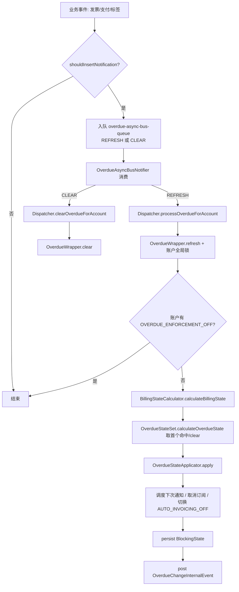
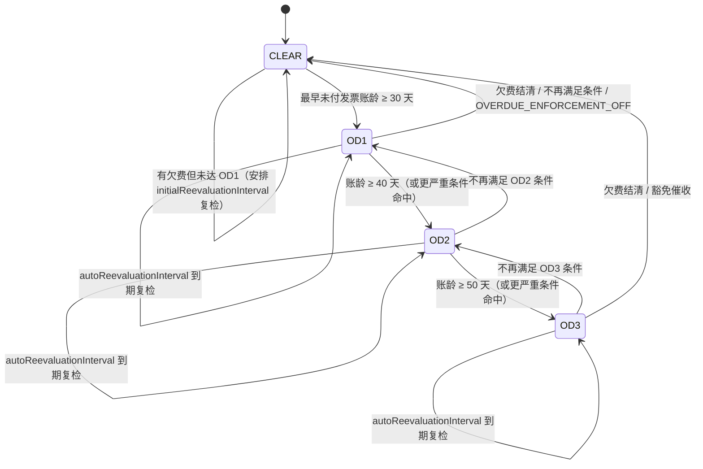
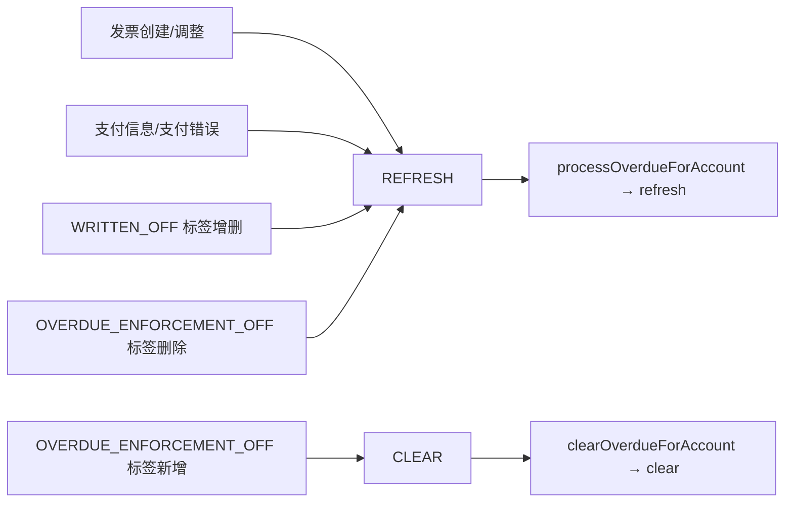

# overdue 模块业务知识

### 模块概览

逾期催收（Dunning）：账户级逾期状态评估、BlockingState 施加与控制标签。

- **模块**: overdue
- **源码根**: `overdue/src/main/java/org/killbill/billing/overdue/`
- **卡片总数**: 73（术语 14 / 实体 12 / 规则 36 / 流程 5 / 状态机 2 / 角色权限 4）
- **全局 ID 前缀**: TERM-/ENT-/BR-/WF-/SM-/ROLE-（全局唯一，跨模块共享编号空间）

> 说明：本文件为该模块的深度视图，卡片与全局类型文件（glossary.md / entities.md / rules.md / workflows.md / state-machines.md / roles-permissions.md）中的同一全局 ID 对应。跨模块合并的卡会同时出现在多个模块视图中。

## TERM-028 自动开票关闭标签 (AUTO_INVOICING_OFF)

- **类型**: 术语
- **同义词**: 自动开票关闭, auto invoice off, auto_invoice_off, 停止自动开票, 暂停出账, 关闭自动开票, 停止开票, 停止生成发票, AUTO_INVOICING_OFF, auto invoicing off, AUTO_INVOICE_OFF
- **模块**: invoice, overdue
- **置信度**: 🟢 confirmed
- **溯源**: `invoice/src/main/java/org/killbill/billing/invoice/generator/FixedAndRecurringInvoiceItemGenerator.java:108-110`, `invoice/src/main/java/org/killbill/billing/invoice/InvoiceDispatcher.java:387-389`, `overdue/src/main/java/org/killbill/billing/overdue/applicator/OverdueStateApplicator.java:176-183`, `overdue/src/main/java/org/killbill/billing/overdue/applicator/OverdueStateApplicator.java:237-253`

**说明**：对标记为 `auto_invoice_off` 的订阅，系统在生成固定/周期发票项时会**跳过**其 billing events（不生成该项）；对 `isAccountAutoInvoiceOff()` 为 true 的账户，非 API 触发的开票直接返回空（不自动开票）。

**含义**：账户级控制标签。overdue 不会由用户直接配置它，而是**自动维护**：当状态从「不 block billing」变为「block billing」时自动打上，避免继续产生额外发票/信用；当从 block billing 回落时自动移除。见 BR-015。

## TERM-029 逾期催收（Overdue / Dunning）

- **类型**: 术语
- **同义词**: 逾期, 逾期催收, 催收, 违约, 欠费, 坏账处理, overdue, dunning, delinquency, overdue service, 逾期服务
- **模块**: overdue
- **置信度**: 🟢 confirmed
- **溯源**: `api/src/main/java/org/killbill/billing/overdue/OverdueService.java:26-30`, `overdue/src/main/java/org/killbill/billing/overdue/service/DefaultOverdueService.java:81-89`

**含义**：overdue 是 Kill Bill 的逾期（催收）子系统，作为独立 KillbillService 注册，服务名为 `overdue-service`。它根据「账户当前未付发票情况」自动计算并施加一个命名逾期状态（如 OD1/OD2/OD3），并对账户执行动作（阻止变更、暂停权益、取消订阅、关闭自动开票等）。注意：状态是**账户级**的，不是单订阅级（见 BR-001）。

## TERM-030 逾期状态（OverdueState）

- **类型**: 术语
- **同义词**: 逾期状态, 催收阶段, 逾期等级, 催收级别, overdue state, overdue stage, dunning state, OD1, OD2, OD3
- **模块**: overdue
- **置信度**: 🟢 confirmed
- **溯源**: `overdue/src/main/java/org/killbill/billing/overdue/config/DefaultOverdueState.java:44-72`, `overdue/src/main/java/org/killbill/billing/overdue/config/DefaultOverdueState.java:85-125`

**含义**：配置中一个带名字的逾期状态，由「一个条件（condition）」+「一组动作」组成。字段包括：`name`（状态名，XML ID，最大 50 字符）、`condition`、`externalMessage`、`blockChanges`、`disableEntitlementAndChangesBlocked`、`subscriptionCancellationPolicy`、`isClearState`、`autoReevaluationInterval`。状态名不是固定枚举值，完全由配置定义（示例配置使用 OD1/OD2/OD3、Good、Overdue、OD4）。

## TERM-031 逾期条件（OverdueCondition）

- **类型**: 术语
- **同义词**: 逾期条件, 催收触发条件, 进入逾期状态条件, overdue condition, dunning condition, condition
- **模块**: overdue
- **置信度**: 🟢 confirmed
- **溯源**: `overdue/src/main/java/org/killbill/billing/overdue/config/DefaultOverdueCondition.java:48-67`, `overdue/src/main/java/org/killbill/billing/overdue/config/DefaultOverdueCondition.java:69-84`

**含义**：判定「账户是否应进入某逾期状态」的谓词，最多包含 6 个子条件：`numberOfUnpaidInvoicesEqualsOrExceeds`、`totalUnpaidInvoiceBalanceEqualsOrExceeds`、`timeSinceEarliestUnpaidInvoiceEqualsOrExceeds`、`responseForLastFailedPaymentIn`、`controlTagInclusion`、`controlTagExclusion`。子条件之间是逻辑 AND；未配置的子条件被忽略（视为真）。

## TERM-032 清算状态（Clear State / 未逾期）

- **类型**: 术语
- **同义词**: 清算状态, 未逾期, 正常状态, 清除状态, clear state, clear, not overdue, __KILLBILL__CLEAR__OVERDUE_STATE__
- **模块**: overdue
- **置信度**: 🟢 confirmed
- **溯源**: `overdue/src/main/java/org/killbill/billing/overdue/wrapper/OverdueWrapper.java:51`, `overdue/src/main/java/org/killbill/billing/overdue/config/DefaultOverdueStateSet.java:37`, `overdue/src/main/java/org/killbill/billing/overdue/config/DefaultOverdueStateSet.java:42-52`

**含义**：内建的特殊状态，常量名为 `__KILLBILL__CLEAR__OVERDUE_STATE__`（`OverdueWrapper.CLEAR_STATE_NAME`），由状态集的 `clearState` 提供（`isClearState=true`）。当没有任何配置状态的条件命中时返回它；账户的 blocking state 不存在时也默认按 clear 处理。`findState` 对该名字特判返回内建 clearState。

## TERM-033 计费状态（BillingState）

- **类型**: 术语
- **同义词**: 计费状态, 账单状态, 欠费快照, billing state, billing snapshot, unpaid invoice summary
- **模块**: overdue
- **置信度**: 🟢 confirmed
- **溯源**: `api/src/main/java/org/killbill/billing/overdue/config/api/BillingState.java:29-53`, `overdue/src/main/java/org/killbill/billing/overdue/calculator/BillingStateCalculator.java:67-84`

**含义**：评估逾期条件所依据的账户级事实快照，字段：`objectId`、`numberOfUnpaidInvoices`、`balanceOfUnpaidInvoices`（未付发票余额合计）、`dateOfEarliestUnpaidInvoice`、`idOfEarliestUnpaidInvoice`、`responseForLastFailedPayment`、`tags`。由 `BillingStateCalculator.calculateBillingState` 计算。

## TERM-034 重新评估间隔（Reevaluation Interval）

- **类型**: 术语
- **同义词**: 重新评估间隔, 重估间隔, 复评间隔, 催收定时, 下次检查时间, reevaluation interval, autoReevaluationInterval, initialReevaluationInterval, dunning poll interval
- **模块**: overdue
- **置信度**: 🟢 confirmed
- **溯源**: `overdue/src/main/java/org/killbill/billing/overdue/config/DefaultOverdueState.java:71-72`, `overdue/src/main/java/org/killbill/billing/overdue/config/DefaultOverdueState.java:119-125`, `overdue/src/main/java/org/killbill/billing/overdue/config/DefaultOverdueStatesAccount.java:35-36`, `overdue/src/main/java/org/killbill/billing/overdue/config/DefaultOverdueStatesAccount.java:51-57`

**含义**：控制「多久后再自动评估一次该账户逾期状态」的两个配置：
1. `autoReevaluationInterval`：每个状态上的属性（`DefaultDuration`），用于非 clear 状态——进入该状态后按此间隔安排下一次检查。
2. `initialReevaluationInterval`：账户状态集级别（`accountOverdueStates` 下），用于 clear 状态/尚未进入首状态时的轮询间隔。
非法值（null、`UNLIMITED`、number=0）分别导致抛 `OVERDUE_NO_REEVALUATION_INTERVAL`（非 clear）或返回 null（不安排通知）。

## TERM-035 阻止变更（blockChanges）

- **类型**: 术语
- **同义词**: 阻止变更, 禁止修改, 冻结账户修改, block changes, isBlockChanges, blockChange
- **模块**: overdue
- **置信度**: 🟢 confirmed
- **溯源**: `overdue/src/main/java/org/killbill/billing/overdue/config/DefaultOverdueState.java:59-60`, `overdue/src/main/java/org/killbill/billing/overdue/config/DefaultOverdueState.java:104-107`, `overdue/src/main/java/org/killbill/billing/overdue/applicator/OverdueStateApplicator.java:263-265`

**含义**：状态动作之一。若为 true，施加的 BlockingState 的 `blockChange=true`，阻止该账户上的变更类操作。当 `disableEntitlementAndChangesBlocked=true` 时，即使 `blockChanges=false` 也会强制 block changes（见 BR-013）。

## TERM-036 禁用权益并阻止变更（disableEntitlementAndChangesBlocked）

- **类型**: 术语
- **同义词**: 暂停订阅, 停用权益, 禁用服务, 阻断计费, 暂停服务, disableEntitlement, disableEntitlementAndChangesBlocked, suspend entitlement, block billing
- **模块**: overdue
- **置信度**: 🟢 confirmed
- **溯源**: `overdue/src/main/java/org/killbill/billing/overdue/config/DefaultOverdueState.java:62-63`, `overdue/src/main/java/org/killbill/billing/overdue/applicator/OverdueStateApplicator.java:263-273`

**含义**：状态动作之一。若为 true，施加的 BlockingState 同时设置 `blockEntitlement=true`、`blockBilling=true`（并隐含 `blockChange=true`），效果是**暂停/停用该账户权益并停止计费**（pause 语义）。恢复（resume）发生在状态回落为不 block billing 时（见 BR-015）。

## TERM-037 外部消息（externalMessage）

- **类型**: 术语
- **同义词**: 外部消息, 提示文案, 催收提示, 用户提示语, external message, externalMessage, dunning message
- **模块**: overdue
- **置信度**: 🟢 confirmed
- **溯源**: `overdue/src/main/java/org/killbill/billing/overdue/config/DefaultOverdueState.java:56-57`, `overdue/src/main/java/org/killbill/billing/overdue/config/DefaultOverdueState.java:99-102`, `overdue/src/main/java/org/killbill/billing/overdue/config/DefaultOverdueState.java:141-144`

**含义**：状态上的可读文案（默认空字符串），随状态一起暴露给上层/API（例如 OverdueStateConfigJson 输出），用于向用户展示「已进入某催收阶段」的提示。它不直接触发任何动作。

## TERM-038 逾期强制关闭标签（OVERDUE_ENFORCEMENT_OFF）

- **类型**: 术语
- **同义词**: 关闭催收, 停止催收, 豁免催收, 逾期豁免, 免催收标签, OVERDUE_ENFORCEMENT_OFF, overdue enforcement off, disable dunning
- **模块**: overdue
- **置信度**: 🟢 confirmed
- **溯源**: `overdue/src/main/java/org/killbill/billing/overdue/applicator/OverdueStateApplicator.java:334-349`, `overdue/src/main/java/org/killbill/billing/overdue/listener/OverdueListener.java:96-108`

**含义**：账户级控制标签。存在该标签时：`refresh` 直接跳过（不评估、不改状态，见 `refreshWithLock` 调用点）；且给账户打上该标签的事件会以 `CLEAR` 动作入队，从而清除该账户的逾期状态。它也是条件 `controlTagInclusion/Exclusion` 可用的控制标签之一。

## TERM-039 发票核销标签（WRITTEN_OFF）

- **类型**: 术语
- **同义词**: 发票核销, 坏账核销, 注销发票, WRITTEN_OFF, written off, write-off
- **模块**: overdue
- **置信度**: 🟢 confirmed
- **溯源**: `overdue/src/main/java/org/killbill/billing/overdue/listener/OverdueListener.java:103-106`, `overdue/src/main/java/org/killbill/billing/overdue/listener/OverdueListener.java:114-119`

**含义**：发票级控制标签。给发票打/摘该标签会触发对应账户的逾期重新评估（REFRESH）：监听器先由事件反查所属账户，再入队。它解释了「核销一张未付发票会改变逾期状态」的业务语义。

## TERM-040 订阅取消策略（subscriptionCancellationPolicy）

- **类型**: 术语
- **同义词**: 订阅取消策略, 逾期取消订阅, 自动退订, 终止订阅策略, subscription cancellation policy, OverdueCancellationPolicy, IMMEDIATE, END_OF_TERM, NONE
- **模块**: overdue
- **置信度**: 🟢 confirmed
- **溯源**: `overdue/src/main/java/org/killbill/billing/overdue/config/DefaultOverdueState.java:65-66`, `overdue/src/main/java/org/killbill/billing/overdue/applicator/OverdueStateApplicator.java:285-302`

**含义**：状态动作之一，枚举 `OverdueCancellationPolicy`，取值 `NONE`（默认，不取消）、`IMMEDIATE`（立即取消）、`END_OF_TERM`（到期取消）。进入状态时若不为 NONE，会把账户下所有非 ADD_ON 的订阅按对应 BillingActionPolicy 取消（见 BR-014）。

## TERM-041 租户级逾期配置（tenant-level overdue config）

- **类型**: 术语
- **同义词**: 租户逾期配置, 多租户催收配置, 上传逾期配置, tenant overdue config, OVERDUE_CONFIG, overdue config upload
- **模块**: overdue
- **置信度**: 🟢 confirmed
- **溯源**: `overdue/src/main/java/org/killbill/billing/overdue/api/DefaultOverdueApi.java:66-89`, `overdue/src/main/java/org/killbill/billing/overdue/caching/DefaultOverdueConfigCache.java:93-106`, `overdue/src/main/java/org/killbill/billing/overdue/caching/DefaultOverdueConfigCache.java:108-113`

**含义**：逾期规则可**按租户**分别配置。上传的 XML 存到租户 KV 键 `OVERDUE_CONFIG`（`TenantKey.OVERDUE_CONFIG`），并缓存于 `CacheType.TENANT_OVERDUE_CONFIG`（键为 tenantRecordId）。租户无自定义配置时回退到默认配置；内部租户记录（`INTERNAL_TENANT_RECORD_ID`）始终使用默认配置。

## ENT-021 逾期状态 OverdueState

- **类型**: 业务实体
- **同义词**: 逾期状态, 催收阶段, 逾期等级, overdue state, dunning stage, DefaultOverdueState
- **模块**: overdue
- **置信度**: 🟢 confirmed
- **溯源**: `overdue/src/main/java/org/killbill/billing/overdue/config/DefaultOverdueState.java:44-72`

**关键字段/关系**：`name`（必填，XML `@XmlID`，最长 50）、`condition`（DefaultOverdueCondition，可空）、`externalMessage`（默认 ""）、`blockChanges`（默认 false）、`disableEntitlementAndChangesBlocked`（默认 false）、`subscriptionCancellationPolicy`（默认 NONE）、`isClearState`（默认 false）、`autoReevaluationInterval`（DefaultDuration，可空）、`enterStateEmailNotification`（**已废弃**，仅保留配置兼容）。
**关系**：隶属于账户状态集 `accountOverdueStates`；被包装为 `BlockingState` 持久化（服务名 overdue-service，类型 ACCOUNT）。

## ENT-022 逾期条件 OverdueCondition

- **类型**: 业务实体
- **同义词**: 逾期条件, 催收触发条件, overdue condition, dunning condition, DefaultOverdueCondition
- **模块**: overdue
- **置信度**: 🟢 confirmed
- **溯源**: `overdue/src/main/java/org/killbill/billing/overdue/config/DefaultOverdueCondition.java:48-67`

**关键字段**：`numberOfUnpaidInvoicesEqualsOrExceeds`(Integer)、`totalUnpaidInvoiceBalanceEqualsOrExceeds`(BigDecimal)、`timeSinceEarliestUnpaidInvoiceEqualsOrExceeds`(DefaultDuration)、`responseForLastFailedPayment`(PaymentResponse[]，XML wrapper `responseForLastFailedPaymentIn`/子元素 `response`)、`controlTagInclusion`(ControlTagType)、`controlTagExclusion`(ControlTagType)。
**关系**：实现 `ConditionEvaluation.evaluate(BillingState, LocalDate)`；被 `OverdueState` 持有，被 `OverdueStateSet.calculateOverdueState` 调用。

## ENT-023 账户逾期状态集 OverdueStatesAccount / OverdueStateSet

- **类型**: 业务实体
- **同义词**: 账户状态集, 逾期状态集合, 催收规则集, account overdue states, overdue state set, OverdueStatesAccount
- **模块**: overdue
- **置信度**: 🟢 confirmed
- **溯源**: `overdue/src/main/java/org/killbill/billing/overdue/config/DefaultOverdueStatesAccount.java:33-40`, `overdue/src/main/java/org/killbill/billing/overdue/config/DefaultOverdueStateSet.java:35-96`, `api/src/main/java/org/killbill/billing/overdue/config/api/OverdueStateSet.java:24-45`

**关键字段/关系**：`initialReevaluationInterval`（DefaultDuration）+ `state[]`（有序状态数组）；继承内建 `clearState`。核心行为：`findState(name)`、`getClearState()`、`calculateOverdueState(billingState, now)`（返回首个命中状态，否则 clear）、`size()`、`getFirstState()`（返回数组最后一个，即入门级逾期状态）。

## ENT-024 计费状态 BillingState

- **类型**: 业务实体
- **同义词**: 计费状态, 欠费快照, billing state, BillingState
- **模块**: overdue
- **置信度**: 🟢 confirmed
- **溯源**: `api/src/main/java/org/killbill/billing/overdue/config/api/BillingState.java:29-53`, `overdue/src/main/java/org/killbill/billing/overdue/calculator/BillingStateCalculator.java:67-84`

**关键字段/关系**：由 `BillingStateCalculator` 从 InvoiceInternalApi（未付发票）、TagInternalApi（账户标签）、Clock（当前日）构造。是条件评估的唯一输入。注意 `responseForLastFailedPayment` 目前被硬编码为 `INSUFFICIENT_FUNDS`（TODO MDW），见 BR-007。

## ENT-025 逾期配置根 OverdueConfig

- **类型**: 业务实体
- **同义词**: 逾期配置, 催收配置, overdue config, DefaultOverdueConfig, overdueConfig, overdue.xml
- **模块**: overdue
- **置信度**: 🟢 confirmed
- **溯源**: `overdue/src/main/java/org/killbill/billing/overdue/config/DefaultOverdueConfig.java:35-52`, `overdue/src/main/resources/NoOverdueConfig.xml:20-27`

**关键字段/关系**：XML 根元素 `<overdueConfig>`，唯一必需子节点 `<accountOverdueStates>`（DefaultOverdueStatesAccount）。当前版本**只有账户级配置**（没有 bundle/subscription 级状态集）。`validate` 委托给 accountOverdueStates 校验。

## ENT-026 逾期包装器 OverdueWrapper

- **类型**: 业务实体
- **同义词**: 逾期包装器, 账户逾期执行器, overdue wrapper, OverdueWrapper
- **模块**: overdue
- **置信度**: 🟢 confirmed
- **溯源**: `overdue/src/main/java/org/killbill/billing/overdue/wrapper/OverdueWrapper.java:48-87`

**关键字段/关系**：绑定单个 Account（`overdueable`）+ OverdueStateSet + BillingStateCalculator + OverdueStateApplicator + GlobalLocker。对外能力：`refresh(effectiveDate, ctx)`、`getNextOverdueState`、`clear`、`billingState`。常量 `CLEAR_STATE_NAME`、`MAX_LOCK_RETRIES=50`。是「评估+施加」的编排门面（见 WF-001）。

## ENT-027 计费状态计算器 BillingStateCalculator

- **类型**: 业务实体
- **同义词**: 计费状态计算器, 欠费统计, billing state calculator, BillingStateCalculator
- **模块**: overdue
- **置信度**: 🟢 confirmed
- **溯源**: `overdue/src/main/java/org/killbill/billing/overdue/calculator/BillingStateCalculator.java:45-108`

**关键字段/关系**：依赖 InvoiceInternalApi、TagInternalApi、Clock。`unpaidInvoicesForAccount` 取未付发票并按 `getInvoiceDate()` 升序（同日期用 hashCode 稳定打破平局）；`sumBalance` 求和；`earliest` 取最早一张；`calculateBillingState` 组装 BillingState。

## ENT-028 逾期状态施加器 OverdueStateApplicator

- **类型**: 业务实体
- **同义词**: 逾期状态施加器, 状态执行器, overdue state applicator, OverdueStateApplicator
- **模块**: overdue
- **置信度**: 🟢 confirmed
- **溯源**: `overdue/src/main/java/org/killbill/billing/overdue/applicator/OverdueStateApplicator.java:71-102`

**关键字段/关系**：依赖 BlockingInternalApi、AccountInternalApi、EntitlementApi/EntitlementInternalApi、TagInternalApi、OverduePoster(check)、BusOptimizer、InternalCallContextFactory。核心方法：`apply(...)`（状态切换+动作+事件+定时）、`clear(...)`、`storeNewState(...)`、`cancelSubscriptionsIfRequired(...)`、`isAccountTaggedWith_OVERDUE_ENFORCEMENT_OFF(...)`。

## ENT-029 逾期变更事件 OverdueChangeInternalEvent

- **类型**: 业务实体
- **同义词**: 逾期变更事件, 状态变更事件, overdue change event, OverdueChangeInternalEvent, OVERDUE_CHANGE
- **模块**: overdue
- **置信度**: 🟢 confirmed
- **溯源**: `overdue/src/main/java/org/killbill/billing/overdue/applicator/DefaultOverdueChangeEvent.java:28-58`, `overdue/src/main/java/org/killbill/billing/overdue/applicator/OverdueStateApplicator.java:215-219`

**关键字段/关系**：`overdueObjectId`、`previousOverdueStateName`、`nextOverdueStateName`、`isBlockedBilling`、`isUnblockedBilling`，`getBusEventType()=OVERDUE_CHANGE`。在 `apply`/`clear` 末尾经 BusOptimizer 投递；是 invoice 等下游模块感知逾期状态变化的通道。

## ENT-030 逾期通知键 OverdueCheckNotificationKey / OverdueAsyncBusNotificationKey

- **类型**: 业务实体
- **同义词**: 逾期通知键, 催收通知, overdue notification key, NotificationKey, REFRESH, CLEAR
- **模块**: overdue
- **置信度**: 🟢 confirmed
- **溯源**: `overdue/src/main/java/org/killbill/billing/overdue/notification/OverdueCheckNotificationKey.java:26-31`, `overdue/src/main/java/org/killbill/billing/overdue/notification/OverdueAsyncBusNotificationKey.java:26-45`

**关键字段/关系**：`OverdueCheckNotificationKey` 持 `uuidKey`（账户 id，继承 DefaultUUIDNotificationKey）。`OverdueAsyncBusNotificationKey` 额外持 `action`，枚举 `OverdueAsyncBusNotificationAction{REFRESH, CLEAR}`——这是「异步总线入队」用的动作区分。

## ENT-031 逾期监听器 OverdueListener

- **类型**: 业务实体
- **同义词**: 逾期监听器, 事件监听器, overdue listener, OverdueListener
- **模块**: overdue
- **置信度**: 🟢 confirmed
- **溯源**: `overdue/src/main/java/org/killbill/billing/overdue/listener/OverdueListener.java:64-94`, `overdue/src/main/java/org/killbill/billing/overdue/listener/OverdueListener.java:96-157`

**关键字段/关系**：订阅总线事件：控制标签创建/删除、发票创建、发票调整、支付信息、支付错误。除少数情况外统一转成 `REFRESH` 入 async bus 通知队列；`OVERDUE_ENFORCEMENT_OFF` 创建转 `CLEAR`。还会级联刷新父/子账户（见 BR-021）。

## ENT-032 时长配置 DefaultDuration

- **类型**: 业务实体
- **同义词**: 时长, 时间长度, 周期, duration, DefaultDuration, TimeUnit, DAYS, MONTHS
- **模块**: overdue
- **置信度**: 🟢 confirmed
- **溯源**: `overdue/src/main/java/org/killbill/billing/overdue/config/DefaultDuration.java:38-55`, `overdue/src/main/java/org/killbill/billing/overdue/config/DefaultDuration.java:99-118`

**关键字段/关系**：`unit`(TimeUnit，必需，XML `<unit>`) + `number`(Integer，默认 -1，XML `<number>`)。支持 `DAYS/WEEKS/MONTHS/YEARS`，遇到 `UNLIMITED` 抛 IllegalStateException。`toJodaPeriod()` 用于条件/间隔计算。

## BR-104 逾期是账户级（跨订阅）规则

- **类型**: 业务规则
- **同义词**: 逾期是账户级, 账户维度催收, 跨订阅逾期, account-level overdue, overdue is per account
- **模块**: overdue
- **置信度**: 🟢 confirmed
- **溯源**: `overdue/src/main/java/org/killbill/billing/overdue/applicator/OverdueStateApplicator.java:221-235`, `overdue/src/main/java/org/killbill/billing/overdue/wrapper/OverdueWrapper.java:109-122`, `overdue/src/main/java/org/killbill/billing/overdue/config/DefaultOverdueConfig.java:41-45`

**规则**：逾期状态以**账户**为粒度计算与持久化，而非单个订阅。持久化时用 `BlockingStateType.ACCOUNT` + 服务名 `overdue-service`（`storeNewState`）；计算时对「该账户所有未付发票」聚合（`unpaidInvoicesForAccount`）。配置模型也只有 `accountOverdueStates`，无订阅级状态。
**影响**：一个账户下任一未付发票都会影响整个账户的逾期状态；取消订阅动作会作用到账户下所有非 ADD_ON 订阅（见 BR-014）。

## BR-105 条件：未付发票数量达到阈值

- **类型**: 业务规则
- **同义词**: 未付发票数量, 欠费张数, 发票数量条件, numberOfUnpaidInvoicesEqualsOrExceeds, unpaid invoice count
- **模块**: overdue
- **置信度**: 🟢 confirmed
- **溯源**: `overdue/src/main/java/org/killbill/billing/overdue/config/DefaultOverdueCondition.java:77`, `overdue/src/test/java/org/killbill/billing/overdue/config/TestCondition.java:49-68`

**规则**：`numberOfUnpaidInvoicesEqualsOrExceeds=N` 时，当且仅当 `state.getNumberOfUnpaidInvoices() >= N` 为真。测试证实：N=1 时 0 张不命中、1 张与 2 张命中。

## BR-106 条件：未付发票余额合计达到阈值

- **类型**: 业务规则
- **同义词**: 未付余额, 欠费金额, 余额阈值, totalUnpaidInvoiceBalanceEqualsOrExceeds, total unpaid balance
- **模块**: overdue
- **置信度**: 🟢 confirmed
- **溯源**: `overdue/src/main/java/org/killbill/billing/overdue/config/DefaultOverdueCondition.java:78`, `overdue/src/test/java/org/killbill/billing/overdue/config/TestCondition.java:70-90`

**规则**：`totalUnpaidInvoiceBalanceEqualsOrExceeds=B` 时，当且仅当 `B <= state.getBalanceOfUnpaidInvoices()` 为真（BigDecimal 比较，含等于）。测试：B=100 时余额 0 不命中、100 与 200 命中。

## BR-107 条件：最早未付发票距今时长达到阈值

- **类型**: 业务规则
- **同义词**: 逾期天数, 最早未付发票时长, 账龄条件, timeSinceEarliestUnpaidInvoiceEqualsOrExceeds, days overdue, aging
- **模块**: overdue
- **置信度**: 🟢 confirmed
- **溯源**: `overdue/src/main/java/org/killbill/billing/overdue/config/DefaultOverdueCondition.java:71-74`, `overdue/src/main/java/org/killbill/billing/overdue/config/DefaultOverdueCondition.java:79-80`, `overdue/src/main/java/org/killbill/billing/overdue/config/DefaultDuration.java:99-118`, `overdue/src/test/java/org/killbill/billing/overdue/config/TestCondition.java:92-114`

**规则**：配置 `<timeSinceEarliestUnpaidInvoiceEqualsOrExceeds><unit>…</unit><number>…</number></…>`。计算：`triggerDate = dateOfEarliestUnpaidInvoice + duration`；条件为真当且仅当 `triggerDate <= now`（`!triggerDate.isAfter(date)`）。若账户无最早未付发票日期（即无未付发票），该子条件为假。
**时间单位**：来自 `DefaultDuration`/`TimeUnit`，实际支持 `DAYS / WEEKS / MONTHS / YEARS`（`UNLIMITED` 非法）。测试：unit=DAYS, number=10 时「10 天前」与「20 天前」命中、「无日期」不命中。

## BR-108 条件：控制标签必须存在（controlTagInclusion）

- **类型**: 业务规则
- **同义词**: 必须包含标签, 标签包含条件, controlTagInclusion, include control tag, 标签门控
- **模块**: overdue
- **置信度**: 🟢 confirmed
- **溯源**: `overdue/src/main/java/org/killbill/billing/overdue/config/DefaultOverdueCondition.java:82`, `overdue/src/main/java/org/killbill/billing/overdue/config/DefaultOverdueCondition.java:96-103`, `overdue/src/test/java/org/killbill/billing/overdue/config/TestCondition.java:140-174`

**规则**：`controlTagInclusion=T` 时，当且仅当账户标签集合中存在 `tagDefinitionId == T.getId()` 的标签才为真。测试：`OVERDUE_ENFORCEMENT_OFF` 存在时命中，不存在时（仅有 AUTO_INVOICING_OFF/DescriptiveTag）不命中。配置示例见 `overdueWithControlTag.xml`（各状态要求 `TEST` 标签）。

## BR-109 条件：控制标签必须不存在（controlTagExclusion）

- **类型**: 业务规则
- **同义词**: 必须排除标签, 标签排除条件, controlTagExclusion, exclude control tag, 标签否决
- **模块**: overdue
- **置信度**: 🟢 confirmed
- **溯源**: `overdue/src/main/java/org/killbill/billing/overdue/config/DefaultOverdueCondition.java:83`, `overdue/src/main/java/org/killbill/billing/overdue/config/DefaultOverdueCondition.java:105-112`, `profiles/killbill/src/test/resources/org/killbill/billing/server/overdueWithExclusionControlTag.xml:18-62`

**规则**：`controlTagExclusion=T` 时，当且仅当账户标签集合中**不存在**该控制标签才为真（存在则一票否决该状态条件）。配置示例见 `overdueWithExclusionControlTag.xml`（各状态用 `<controlTagExclusion>TEST</controlTagExclusion>`）。

## BR-110 条件：上次失败支付响应（当前未真正实现）

- **类型**: 业务规则
- **同义词**: 上次支付失败原因, 支付响应条件, responseForLastFailedPaymentIn, last failed payment response, PaymentResponse
- **模块**: overdue
- **置信度**: 🟢 confirmed
- **溯源**: `overdue/src/main/java/org/killbill/billing/overdue/config/DefaultOverdueCondition.java:81`, `overdue/src/main/java/org/killbill/billing/overdue/config/DefaultOverdueCondition.java:86-94`, `overdue/src/main/java/org/killbill/billing/overdue/calculator/BillingStateCalculator.java:79`

**规则（配置层）**：`responseForLastFailedPaymentIn=[R1,R2,…]` 时，当且仅当账户「上次失败支付响应」等于列表之一才为真。可配置值示例：`INVALID_CARD`、`LOST_OR_STOLEN_CARD`、`INSUFFICIENT_FUNDS`、`DO_NOT_HONOR`。
**重要例外（未实现）**：上游 `BillingStateCalculator` 把 `responseForLastFailedPayment` **硬编码为 `PaymentResponse.INSUFFICIENT_FUNDS`（源码注释 `//TODO MDW`）**，并未从真实支付失败记录读取。因此除了「恰好配置为 INSUFFICIENT_FUNDS」外的响应类型实际上无法命中。即：该条件是「已建模、但输入未接线（not implemented）」的功能。

## BR-111 多子条件为 AND，未配置的子条件被忽略

- **类型**: 业务规则
- **同义词**: 条件组合, 多条件与, AND 组合, condition AND, all conditions must hold
- **模块**: overdue
- **置信度**: 🟢 confirmed
- **溯源**: `overdue/src/main/java/org/killbill/billing/overdue/config/DefaultOverdueCondition.java:76-84`

**规则**：`evaluate` 返回对全部 6 个子条件的合取。每个子条件写成 `(cfg == null || 实际检查)`，因此**未配置（null）的子条件恒为真**——即不构成约束。只要有一个已配置的子条件为假，整个条件即为假。

## BR-112 状态选择：按配置顺序取首个命中状态，否则 clear

- **类型**: 业务规则
- **同义词**: 状态选择, 命中优先级, 匹配第一个状态, state selection, first matching state, calculateOverdueState
- **模块**: overdue
- **置信度**: 🟢 confirmed
- **溯源**: `overdue/src/main/java/org/killbill/billing/overdue/config/DefaultOverdueStateSet.java:59-67`, `overdue/src/test/resources/org/killbill/billing/overdue/OverdueConfig3.xml:18-70`

**规则**：`calculateOverdueState(billingState, now)` 按 `state[]` 的**声明顺序**从头遍历，返回第一个条件为真的状态；若无任何命中则返回 clear state。因此配置中**越靠前的状态优先级越高**。示例 `OverdueConfig3.xml` 顺序为 OD4→OD3→OD2→OD1，OD4（未付≥5 且带 AUTO_PAY_OFF）优先级最高。

## BR-113 状态升级顺序与「首状态」语义

- **类型**: 业务规则
- **同义词**: 状态升级, 升级顺序, 催收梯度, escalation order, first state, getFirstState
- **模块**: overdue
- **置信度**: 🟢 confirmed
- **溯源**: `overdue/src/main/java/org/killbill/billing/overdue/config/DefaultOverdueStateSet.java:92-95`, `overdue/src/test/java/org/killbill/billing/overdue/config/TestOverdueConfig.java:70-76`, `profiles/killbill/src/main/resources/overdue.xml:19-61`

**规则**：约定配置里「最严重状态写在最前、最轻状态写在最后」。`getFirstState()` 返回数组**最后一个**元素，即**入门级/最轻**的逾期状态（如 OD1/OD3 场景中的 OD1，或 overdue.xml 中的 OD1）。测试 `TestOverdueConfig` 断言 OD2、OD1 顺序下 `getFirstState().getName()=="OD1"`。
**用途**：`firstOverdueState` 用于「尚未进入首个逾期状态但有未付发票，仍要安排下次检查」的判断（见 BR-016）。

## BR-114 状态未变化时为 no-op（但仍可能安排下次通知）

- **类型**: 业务规则
- **同义词**: 状态不变, 无操作, 幂等, no-op, state unchanged
- **模块**: overdue
- **置信度**: 🟢 confirmed
- **溯源**: `overdue/src/main/java/org/killbill/billing/overdue/applicator/OverdueStateApplicator.java:127-132`

**规则**：`apply` 先处理通知调度（BR-016），随后若 `previousOverdueState.getName().equals(nextOverdueState.getName())`，直接返回——不取消订阅、不切换 AUTO_INVOICING_OFF、不写 BlockingState、不发事件。即：动作只在**状态真正变化**时执行。

## BR-115 blockChanges 动作映射到 BlockingState.blockChange

- **类型**: 业务规则
- **同义词**: 阻止变更动作, blockChange, 冻结变更
- **模块**: overdue
- **置信度**: 🟢 confirmed
- **溯源**: `overdue/src/main/java/org/killbill/billing/overdue/applicator/OverdueStateApplicator.java:221-231`, `overdue/src/main/java/org/killbill/billing/overdue/applicator/OverdueStateApplicator.java:263-265`, `overdue/src/test/java/org/killbill/billing/overdue/TestOverdueHelper.java:119-124`

**规则**：施加状态时创建的 `DefaultBlockingState` 中 `blockChange = state.isBlockChanges() || state.isDisableEntitlementAndChangesBlocked()`。测试 helper 断言 blocking state 的 `isBlockChange()` 等于状态的 `isBlockChanges()`（仅在未 disableEntitlement 时；两者同真时也一致）。

## BR-116 disableEntitlementAndChangesBlocked 同时暂停权益与计费

- **类型**: 业务规则
- **同义词**: 禁用权益动作, 暂停服务, 停止计费, disableEntitlement, blockEntitlement, blockBilling, pause
- **模块**: overdue
- **置信度**: 🟢 confirmed
- **溯源**: `overdue/src/main/java/org/killbill/billing/overdue/applicator/OverdueStateApplicator.java:263-273`, `overdue/src/test/java/org/killbill/billing/overdue/TestOverdueHelper.java:119-124`

**规则**：若 `isDisableEntitlementAndChangesBlocked()==true`，则 BlockingState 同时 `blockEntitlement=true`、`blockBilling=true`，并因 `blockChanges()` 的或运算而 `blockChange=true`。测试 helper 断言 `isBlockEntitlement()==isBlockBilling()==state.isDisableEntitlementAndChangesBlocked()`。业务效果：**暂停该账户的服务并停止计费**（stop billing / suspend），回到非 block billing 状态即 resume（见 BR-015）。

## BR-117 订阅取消策略：NONE / IMMEDIATE / END_OF_TERM

- **类型**: 业务规则
- **同义词**: 逾期取消订阅, 立即取消, 到期取消, 自动退订, subscriptionCancellationPolicy, IMMEDIATE, END_OF_TERM, cancel subscription on overdue
- **模块**: overdue
- **置信度**: 🟢 confirmed
- **溯源**: `overdue/src/main/java/org/killbill/billing/overdue/applicator/OverdueStateApplicator.java:285-314`, `overdue/src/main/java/org/killbill/billing/overdue/applicator/OverdueStateApplicator.java:316-329`

**规则**：进入新状态时若 `getOverdueCancellationPolicy()`：
- `NONE` → 直接返回，不取消任何订阅；
- `IMMEDIATE` → 以 `BillingActionPolicy.IMMEDIATE` 取消；
- `END_OF_TERM` → 以 `BillingActionPolicy.END_OF_TERM` 取消；
- 其他值 → 抛 `IllegalStateException`。

**作用范围**：取账户下所有 entitlement，但**过滤掉 `ProductCategory.ADD_ON`**，只取消基础订阅（源码注释：Entitlement 会自行取消其 add-on，引用 killbill#94）。取消生效日 `context.toLocalDate(effectiveDate)`。

## BR-118 自动维护 AUTO_INVOICING_OFF 标签（防多生成信用）

- **类型**: 业务规则
- **同义词**: 自动关闭开票, 防止额外开票, AUTO_INVOICING_OFF 自动切换, avoid extra credit, toggle auto invoice off
- **模块**: overdue
- **置信度**: 🟢 confirmed
- **溯源**: `overdue/src/main/java/org/killbill/billing/overdue/applicator/OverdueStateApplicator.java:176-183`, `overdue/src/main/java/org/killbill/billing/overdue/applicator/OverdueStateApplicator.java:237-253`

**规则**：
- 「进入 block billing」的转移（`isBlockBillingTransition`：prev 不 block billing、next block billing）→ 给账户打上 `AUTO_INVOICING_OFF` 标签，避免继续开票产生多余信用。
- 「解除 block billing」的转移（`isUnblockBillingTransition`）→ 移除 `AUTO_INVOICING_OFF` 标签；若标签本就不存在（`TAG_DOES_NOT_EXIST`）则忽略该错误。

## BR-119 重新评估通知的调度规则（定时器语义）

- **类型**: 业务规则
- **同义词**: 复评定时器, 下次检查安排, 通知队列, reevaluation timer, schedule next check, notification queue
- **模块**: overdue
- **置信度**: 🟢 confirmed
- **溯源**: `overdue/src/main/java/org/killbill/billing/overdue/applicator/OverdueStateApplicator.java:109-125`, `overdue/src/main/java/org/killbill/billing/overdue/applicator/OverdueStateApplicator.java:160-174`

**规则**：
1. 需要安排下次通知的条件：`!nextOverdueState.isClearState()` **或**（有首个逾期状态 **且** 存在最早未付发票日期）——即「已逾期」或「有欠费但可能还没进入首个逾期状态」。
2. 间隔取值：clear 状态用状态集的 `initialReevaluationInterval`；非 clear 状态用该状态的 `autoReevaluationInterval`。
3. 若间隔为 null（配置缺失/无时间型条件）→ **不插入通知**，日志说明「条件非时间驱动，无需重试」。
4. 否则安排 `effectiveDate + reevaluationInterval` 的未来通知。
5. 若「next 为 clear 且不满足上述第 1 条」→ **清除**该账户所有未来通知（`clearFutureNotification`）。

## BR-120 clear 状态清除未来通知

- **类型**: 业务规则
- **同义词**: 清除通知, 取消定时, clear notifications, clear future notification
- **模块**: overdue
- **置信度**: 🟢 confirmed
- **溯源**: `overdue/src/main/java/org/killbill/billing/overdue/applicator/OverdueStateApplicator.java:123-125`, `overdue/src/main/java/org/killbill/billing/overdue/applicator/OverdueStateApplicator.java:275-283`

**规则**：当 `nextOverdueState.isClearState()` 且不满足「有欠费需继续检查」时，移除该账户在 `overdue-check-queue` 上的所有未来逾期检查通知（按 accountRecordId/tenantRecordId 检索后逐条删除）。`clear(...)` 路径也会调用它。

## BR-121 OVERDUE_ENFORCEMENT_OFF 短路并触发 CLEAR

- **类型**: 业务规则
- **同义词**: 豁免催收, 关闭催收生效, OVERDUE_ENFORCEMENT_OFF 短路, skip overdue enforcement, overdue enforcement off
- **模块**: overdue
- **置信度**: 🟢 confirmed
- **溯源**: `overdue/src/main/java/org/killbill/billing/overdue/wrapper/OverdueWrapper.java:109-113`, `overdue/src/main/java/org/killbill/billing/overdue/listener/OverdueListener.java:98-107`, `overdue/src/main/java/org/killbill/billing/overdue/applicator/OverdueStateApplicator.java:334-349`

**规则**：`refreshWithLock` 首先检查账户是否被打了 `OVERDUE_ENFORCEMENT_OFF`；若是则**直接 return**（不计算、不切状态、不安排通知）。同时，给账户**新增**该控制标签的事件会以 `OverdueAsyncBusNotificationAction.CLEAR` 入队，引导 `OverdueDispatcher.clearOverdueForAccount` 把账户置回 clear 状态。业务效果：运营可用该标签「豁免/停止催收并清零状态」。

## BR-122 触发重新评估的事件集合

- **类型**: 业务规则
- **同义词**: 重新评估触发, 刷新触发, 事件驱动催收, refresh triggers, reevaluation triggers
- **模块**: overdue
- **置信度**: 🟢 confirmed
- **溯源**: `overdue/src/main/java/org/killbill/billing/overdue/listener/OverdueListener.java:96-157`

**规则**：以下事件会使对应账户入队 `REFRESH`（重新评估）：
- 发票创建（InvoiceCreationInternalEvent）
- 发票调整（InvoiceAdjustmentInternalEvent）
- 支付信息（InvoicePaymentInfoInternalEvent）
- 支付错误（InvoicePaymentErrorInternalEvent）
- 发票级 `WRITTEN_OFF` 标签的创建/删除
- 账户级 `OVERDUE_ENFORCEMENT_OFF` 标签的删除
（账户级 `OVERDUE_ENFORCEMENT_OFF` 标签的**新增**特殊处理为 `CLEAR`，见 BR-018。）

## BR-123 仅当存在带条件的状态时才运行逾期机制（优化）

- **类型**: 业务规则
- **同义词**: 催收启用开关, 无配置不运行, shouldInsertNotification, overdue disabled optimization
- **模块**: overdue
- **置信度**: 🟢 confirmed
- **溯源**: `overdue/src/main/java/org/killbill/billing/overdue/listener/OverdueListener.java:168-174`, `overdue/src/main/java/org/killbill/billing/overdue/listener/OverdueListener.java:206-225`

**规则**：监听器入队前调用 `shouldInsertNotification`：若租户逾期配置为空、`accountOverdueStates` 为空、状态数组为空，或**所有状态都没有 condition**（`getConditionEvaluation()` 全为 null），则不入队、直接返回。目的：若逾期未被有效配置，就不必跑整条催收链路。

## BR-124 父/子账户的级联与委派支付

- **类型**: 业务规则
- **同义词**: 父子账户, 委派支付, 家庭账户, parent child account, payment delegated to parent, cascade overdue
- **模块**: overdue
- **置信度**: 🟢 confirmed
- **溯源**: `overdue/src/main/java/org/killbill/billing/overdue/wrapper/OverdueWrapper.java:151-159`, `overdue/src/main/java/org/killbill/billing/overdue/listener/OverdueListener.java:179-203`

**规则**：
1. **计算委派**：若账户有 `parentAccountId` 且 `isPaymentDelegatedToParent()`，则其逾期计费状态从**父账户**的上下文计算（用父账户 recordId 构造 context）。
2. **刷新级联**：账户入队 REFRESH/CLEAR 时，若其向父账户委派支付，则父账户也入队；并遍历其子账户，凡 `isPaymentDelegatedToParent()` 的子账户也入队。加载子账户失败仅记日志、不中断。

## BR-125 账户级全局锁与重试（MAX_LOCK_RETRIES=50）

- **类型**: 业务规则
- **同义词**: 逾期并发锁, 账户锁, 锁重试, global lock, MAX_LOCK_RETRIES, ACCNT_INV_PAY lock
- **模块**: overdue
- **置信度**: 🟢 confirmed
- **溯源**: `overdue/src/main/java/org/killbill/billing/overdue/wrapper/OverdueWrapper.java:56`, `overdue/src/main/java/org/killbill/billing/overdue/wrapper/OverdueWrapper.java:89-107`, `overdue/src/main/java/org/killbill/billing/overdue/wrapper/OverdueWrapper.java:129-142`

**规则**：`refresh`/`clear` 都先获取类型为 `ACCNT_INV_PAY`、键为账户 id 的全局锁，最多尝试 `MAX_LOCK_RETRIES=50` 次。获取失败（`LockFailedException`）时抛 `QueueRetryException`，并携带 `overdueConfig.getRescheduleIntervalOnLock(context)` 作为重排周期（由 killbill config 项控制），保证并发下操作最终执行。锁在 finally 释放。

## BR-126 autoReevaluationInterval 合法性校验

- **类型**: 业务规则
- **同义词**: 复评间隔校验, 无复评间隔错误, autoReevaluationInterval validation, OVERDUE_NO_REEVALUATION_INTERVAL
- **模块**: overdue
- **置信度**: 🟢 confirmed
- **溯源**: `overdue/src/main/java/org/killbill/billing/overdue/config/DefaultOverdueState.java:119-125`, `overdue/src/main/java/org/killbill/billing/overdue/applicator/OverdueStateApplicator.java:160-174`

**规则**：`OverdueState.getAutoReevaluationInterval()` 在 `autoReevaluationInterval==null`、`unit==UNLIMITED` 或 `number==0` 时抛 `OverdueApiException(OVERDUE_NO_REEVALUATION_INTERVAL, name)`。`OverdueStateApplicator.getReevaluationInterval` 捕获该错误码并返回 null → 不安排下次通知（其他错误码则转成 OverdueException 抛出）。

## BR-127 initialReevaluationInterval 为无效值时不重试

- **类型**: 业务规则
- **同义词**: 初始复评间隔, clear 状态轮询, initialReevaluationInterval
- **模块**: overdue
- **置信度**: 🟢 confirmed
- **溯源**: `overdue/src/main/java/org/killbill/billing/overdue/config/DefaultOverdueStatesAccount.java:51-57`

**规则**：`getInitialReevaluationInterval()` 在 `initialReevaluationInterval==null`、`unit==UNLIMITED` 或 `number==0` 时返回 `null`；`OverdueStateApplicator` 收到 null 即不插入通知。也就是说 clear 状态若要被周期性复检，必须显式配置一个正数的初始复评间隔。

## BR-128 状态名长度上限 50

- **类型**: 业务规则
- **同义词**: 状态名长度, 名称上限, state name max length
- **模块**: overdue
- **置信度**: 🟢 confirmed
- **溯源**: `overdue/src/main/java/org/killbill/billing/overdue/config/DefaultOverdueState.java:47`, `overdue/src/main/java/org/killbill/billing/overdue/config/DefaultOverdueState.java:171-178`

**规则**：`MAX_NAME_LENGTH = 50`；校验时若状态名长度超过 50，追加 ValidationError（"Name of state '%s' exceeds the maximum length of %d"）。这是逾期配置的硬校验项。

## BR-129 默认配置只含 Clear 状态（等价于未启用催收）

- **类型**: 业务规则
- **同义词**: 默认逾期配置, 无逾期配置, NoOverdueConfig, default overdue config, overdue disabled
- **模块**: overdue
- **置信度**: 🟢 confirmed
- **溯源**: `overdue/src/main/resources/NoOverdueConfig.xml:20-27`, `overdue/src/main/java/org/killbill/billing/overdue/caching/DefaultOverdueConfigCache.java:58-66`

**规则**：内建默认配置 `NoOverdueConfig.xml` 的 `accountOverdueStates` 只包含一个 `name="Clear"` 且 `isClearState=true` 的状态，无任何条件。因此默认情况下没有任何状态会命中，账户始终为 clear，催收动作不触发。若默认配置 URL 为空或加载失败，系统记 warn 并处于「逾期系统禁用」状态（不改变状态）。

## BR-130 配置加载失败/无效时逾期系统被禁用

- **类型**: 业务规则
- **同义词**: 逾期配置加载失败, 配置无效, overdue disabled, config load failure
- **模块**: overdue
- **置信度**: 🟢 confirmed
- **溯源**: `overdue/src/main/java/org/killbill/billing/overdue/service/DefaultOverdueService.java:91-101`, `overdue/src/main/java/org/killbill/billing/overdue/caching/DefaultOverdueConfigCache.java:68-86`, `overdue/src/main/java/org/killbill/billing/overdue/caching/DefaultOverdueConfigCache.java:99-105`

**规则**：`DefaultOverdueService.loadConfig`（生命周期 LOAD_CATALOG）从 `properties.getConfigURI()` 加载默认配置；失败则 log.warn「Overdue system disabled」并保持 `isConfigLoaded=false`。租户级配置解析失败会被包装成 `OverdueApiException(OVERDUE_INVALID_FOR_TENANT)`；单个租户配置无效不影响其他租户（`get` 失败时抛异常，未命中则回退默认配置）。

## BR-131 通知去重：check 队列保留最早、async 队列有则跳过

- **类型**: 业务规则
- **同义词**: 通知去重, 队列去重, notification dedup, cleanup future notifications
- **模块**: overdue
- **置信度**: 🟢 confirmed
- **溯源**: `overdue/src/main/java/org/killbill/billing/overdue/notification/OverdueCheckPoster.java:48-85`, `overdue/src/main/java/org/killbill/billing/overdue/notification/OverdueAsyncBusPoster.java:47-57`, `overdue/src/main/java/org/killbill/billing/overdue/notification/DefaultOverduePosterBase.java:67-84`

**规则**：插入未来通知前会在事务内查询该账户已有的未来通知：
- **overdue-check（定时复评）**：若已存在一条**更早**的通知，则不再插入新通知，并删除其余未来通知；否则删除已有通知、插入新通知。即**保留最早到期的那条**。
- **overdue-async-bus（事件刷新）**：若已存在任意未来通知则直接跳过插入（源码注释承认这是近似处理，可能出现 REFRESH/CLEAR 混排的非确定行为）。

## BR-132 getOverdueStateFor 从 blocking state 名解析当前状态

- **类型**: 业务规则
- **同义词**: 查询当前逾期状态, 当前状态解析, getOverdueStateFor, current overdue state
- **模块**: overdue
- **置信度**: 🟢 confirmed
- **溯源**: `overdue/src/main/java/org/killbill/billing/overdue/api/DefaultOverdueApi.java:91-99`, `overdue/src/main/java/org/killbill/billing/overdue/wrapper/OverdueWrapper.java:115-119`

**规则**：查询账户当前逾期状态时，读取该账户在 `overdue-service` 上的 BlockingState；若不存在则用 `CLEAR_STATE_NAME`，再通过状态集 `findState(stateName)` 解析。`findState` 对 clear 名特判返回内建 clearState，否则按名字查配置状态，找不到抛 `CAT_NO_SUCH_OVERDUE_STATE`。这条规则同时决定了「刷新时 previousOverdueState 的取值」。

## BR-133 租户配置上传会覆盖旧值并失效缓存

- **类型**: 业务规则
- **同义词**: 上传逾期配置, 覆盖配置, 配置缓存失效, upload overdue config, cache invalidation, OVERDUE_CONFIG
- **模块**: overdue
- **置信度**: 🟢 confirmed
- **溯源**: `overdue/src/main/java/org/killbill/billing/overdue/api/DefaultOverdueApi.java:66-89`, `overdue/src/main/java/org/killbill/billing/overdue/caching/OverdueCacheInvalidationCallback.java:39-43`, `overdue/src/main/java/org/killbill/billing/overdue/service/DefaultOverdueService.java:103-113`

**规则**：上传逾期配置时：先删除租户键 `OVERDUE_CONFIG` 的旧值（若存在），再写入新 XML，然后清除该租户的逾期配置缓存。租户配置变更也会通过 `TenantKey.OVERDUE_CONFIG` 的 `CacheInvalidationCallback` 触发缓存失效。以 `OverdueConfig` 对象上传时，先序列化为 XML（`XMLWriter`），失败抛 `OVERDUE_INVALID_FOR_TENANT`。

## BR-134 有效日与条件日期口径

- **类型**: 业务规则
- **同义词**: 生效日期, 评估日期, effectiveDate, now, account timezone
- **模块**: overdue
- **置信度**: 🟢 confirmed
- **溯源**: `overdue/src/main/java/org/killbill/billing/overdue/applicator/OverdueStateApplicator.java:104-107`, `overdue/src/main/java/org/killbill/billing/overdue/wrapper/OverdueWrapper.java:124-127`, `api/src/main/java/org/killbill/billing/overdue/config/api/OverdueStateSet.java:30-38`

**规则**：状态评估用「账户时区的 LocalDate」作为 `now`（`context.toLocalDate(context.getCreatedDate())`），条件里的时长比较基于该日；而状态施加（写 BlockingState、取消订阅）用带时间的 `effectiveDate`（`context.toLocalDate(effectiveDate)` 取日）。同一账户的评估日期口径必须在账户时区下解释。

## BR-135 取消动作只针对非 ADD_ON 基础订阅

- **类型**: 业务规则
- **同义词**: 取消基础订阅, 排除附加组件, 取消不含 add-on, cancel base subscriptions, exclude ADD_ON
- **模块**: overdue
- **置信度**: 🟢 confirmed
- **溯源**: `overdue/src/main/java/org/killbill/billing/overdue/applicator/OverdueStateApplicator.java:316-329`

**规则**：`computeEntitlementsToCancel` 过滤掉 `ProductCategory.ADD_ON` 的 entitlement，只把非附加组件订阅放入待取消列表。源码注释说明 Entitlement 层会自动取消关联的 add-on（引用 killbill issue #94），并提示此实现会漏掉「未来创建的 add-on」。

## BR-136 逾期状态持久化为账户 BlockingState

- **类型**: 业务规则
- **同义词**: 逾期状态持久化, blocking state, 状态存储, persist overdue state, setBlockingState
- **模块**: overdue
- **置信度**: 🟢 confirmed
- **溯源**: `overdue/src/main/java/org/killbill/billing/overdue/applicator/OverdueStateApplicator.java:221-235`, `overdue/src/main/java/org/killbill/billing/overdue/applicator/OverdueStateApplicator.java:139-142`

**规则**：新状态通过 `blockingApi.setBlockingState(new DefaultBlockingState(accountId, BlockingStateType.ACCOUNT, stateName, "overdue-service", blockChange, blockEntitlement, blockBilling, effectiveDate))` 持久化。源码注释强调：**必须最后再存新状态**——因为 entitlement DAO 会发 BlockingTransitionInternalEvent，invoice 会据此反应，需先让含 AUTO_INVOICING_OFF 等最新信息落库。存状态失败包装为 `OVERDUE_CAT_ERROR_ENCOUNTERED`。

## BR-137 clear 路径的状态与通知处理

- **类型**: 业务规则
- **同义词**: 清除逾期, 解除逾期, 恢复账户, clear overdue, clear path
- **模块**: overdue
- **置信度**: 🟢 confirmed
- **溯源**: `overdue/src/main/java/org/killbill/billing/overdue/applicator/OverdueStateApplicator.java:185-213`, `overdue/src/main/java/org/killbill/billing/overdue/wrapper/OverdueWrapper.java:144-149`

**规则**：`clear(effectiveDate, account, previousState, clearState, ctx)` 顺序为：写入 clear 状态 → 清除未来通知 → 按需切换 AUTO_INVOICING_OFF（从 block billing 回落则移除标签）→ 构造并投递 `OverdueChangeInternalEvent`（记录 previous→clear 及 unblock 标志）。`OverdueWrapper.clearWithLock` 先查出账户当前状态名再调用它。

## BR-138 内部租户始终使用默认配置

- **类型**: 业务规则
- **同义词**: 内部租户配置, 默认配置回退, internal tenant, default config fallback
- **模块**: overdue
- **置信度**: 🟢 confirmed
- **溯源**: `overdue/src/main/java/org/killbill/billing/overdue/caching/DefaultOverdueConfigCache.java:93-106`, `overdue/src/main/java/org/killbill/billing/overdue/caching/DefaultOverdueConfigCache.java:108-113`

**规则**：当 `tenantRecordId` 等于 `InternalCallContextFactory.INTERNAL_TENANT_RECORD_ID` 时，直接返回默认配置、不进租户缓存；`clearOverdueConfig` 对内部租户也是 no-op。普通租户先查 `TENANT_OVERDUE_CONFIG` 缓存，缓存未命中则返回默认配置；读取抛 IllegalStateException 时转 `OVERDUE_INVALID_FOR_TENANT`。

## BR-139 逾期配置 URI 由 `org.killbill.overdue.uri` 控制

- **类型**: 业务规则
- **同义词**: 逾期配置路径, 配置 URI, org.killbill.overdue.uri, config URI, NoOverdueConfig.xml
- **模块**: overdue
- **置信度**: 🟢 confirmed
- **溯源**: `overdue/src/main/java/org/killbill/billing/overdue/OverdueProperties.java:25-31`, `overdue/src/main/java/org/killbill/billing/overdue/caching/DefaultOverdueConfigCache.java:58-66`

**规则**：默认逾期配置的位置由配置项 `org.killbill.overdue.uri` 指定，默认值 `NoOverdueConfig.xml`（classpath 或文件系统 URI）。`DefaultOverdueConfigCache` 构造时会先以内建 URI `NoOverdueConfig.xml` 预载默认配置；随后 `loadConfig` 用该配置项覆盖。这解释了「系统默认不催收、要显式指向自定义 XML 才启用」的语义。

## WF-012 逾期评估与刷新流程（Refresh）

- **类型**: 业务流程
- **同义词**: 逾期流程, 催收流程, 逾期刷新, overdue refresh workflow, dunning process, reevaluation flow
- **模块**: overdue
- **置信度**: 🟢 confirmed
- **溯源**: `overdue/src/main/java/org/killbill/billing/overdue/listener/OverdueListener.java:96-157`, `overdue/src/main/java/org/killbill/billing/overdue/notification/OverdueAsyncBusNotifier.java:56-78`, `overdue/src/main/java/org/killbill/billing/overdue/listener/OverdueDispatcher.java:42-56`, `overdue/src/main/java/org/killbill/billing/overdue/wrapper/OverdueWrapper.java:89-127`, `overdue/src/main/java/org/killbill/billing/overdue/applicator/OverdueStateApplicator.java:104-158`

**参与者**：业务事件（发票/支付/标签）、OverdueListener、async-bus 通知队列、OverdueDispatcher、OverdueWrapper、BillingStateCalculator、OverdueStateSet/Applicator、BlockingInternalApi、EntitlementApi、Bus。

**步骤**：
1. 业务事件触发 OverdueListener（除特殊标签外统一 REFRESH），校验 `shouldInsertNotification` 后写入 `overdue-async-bus-queue`（可级联父/子账户）。
2. OverdueAsyncBusNotifier 消费：REFRESH → `dispatcher.processOverdueForAccount`；CLEAR → `dispatcher.clearOverdueForAccount`。
3. Dispatcher 经 OverdueWrapperFactory 构造账户的 OverdueWrapper，调用 `refresh(effectiveDate, ctx)`（先取 ACCNT_INV_PAY 全局锁）。
4. Wrapper 检查 OVERDUE_ENFORCEMENT_OFF（有则跳过）；计算 BillingState；读取当前 BlockingState 得到 previousOverdueState；`calculateOverdueState` 得到 next。
5. Applicator.apply：调度/清除下次通知 → 状态未变则 no-op → 取消订阅（如需）→ 切换 AUTO_INVOICING_OFF → 写入新 BlockingState → 投递 OverdueChangeInternalEvent。

## WF-013 逾期状态评估周期（评估→施加→定时复评）

- **类型**: 业务流程
- **同义词**: 逾期状态循环, 催收周期, 状态评估, overdue evaluation cycle, dunning cycle
- **模块**: overdue
- **置信度**: 🟢 confirmed
- **溯源**: `overdue/src/main/java/org/killbill/billing/overdue/wrapper/OverdueWrapper.java:109-127`, `overdue/src/main/java/org/killbill/billing/overdue/config/DefaultOverdueStateSet.java:59-67`, `overdue/src/main/java/org/killbill/billing/overdue/applicator/OverdueStateApplicator.java:114-125`, `overdue/src/main/java/org/killbill/billing/overdue/notification/OverdueCheckNotifier.java:56-69`

**步骤**：
1. 计算账户 BillingState（未付发票数、余额、最早未付日期、标签）。
2. 依据 BillingState + 账户时区当日，按配置顺序选首个命中状态（否则 clear）。
3. 与当前已持久化状态比较；不同则执行动作并持久化。
4. 若已逾期或存在欠费，按 `autoReevaluationInterval`/`initialReevaluationInterval` 安排 `overdue-check-queue` 未来通知。
5. 定时到点后 OverdueCheckNotifier 消费 → Dispatcher `processOverdueForAccount` → 回到步骤 1，形成周期。

## WF-014 租户逾期配置上传流程

- **类型**: 业务流程
- **同义词**: 上传催收配置, 配置下发, tenant config upload, overdue config upload
- **模块**: overdue
- **置信度**: 🟢 confirmed
- **溯源**: `overdue/src/main/java/org/killbill/billing/overdue/api/DefaultOverdueApi.java:66-89`, `overdue/src/main/java/org/killbill/billing/overdue/service/DefaultOverdueService.java:103-113`, `overdue/src/main/java/org/killbill/billing/overdue/caching/OverdueCacheInvalidationCallback.java:39-43`

**步骤**：
1. 调用方通过 OverdueApi 上传 `overdueXML`（或 OverdueConfig 对象，先序列化为 XML）。
2. 删除该租户已有的 `OVERDUE_CONFIG` 键值（若存在）。
3. 写入新的 `OVERDUE_CONFIG` 租户键值。
4. 清除该租户的逾期配置缓存。
5. 缓存失效回调（TenantKey.OVERDUE_CONFIG）也会触发 `clearOverdueConfig`，保证后续评估读取新配置。

## WF-015 逾期豁免（CLEAR）流程

- **类型**: 业务流程
- **同义词**: 停止催收流程, 逾期豁免, 清除逾期流程, clear overdue workflow, OVERDUE_ENFORCEMENT_OFF flow
- **模块**: overdue
- **置信度**: 🟢 confirmed
- **溯源**: `overdue/src/main/java/org/killbill/billing/overdue/listener/OverdueListener.java:98-107`, `overdue/src/main/java/org/killbill/billing/overdue/notification/OverdueAsyncBusNotifier.java:64-74`, `overdue/src/main/java/org/killbill/billing/overdue/applicator/OverdueStateApplicator.java:185-213`

**步骤**：
1. 给账户新增 `OVERDUE_ENFORCEMENT_OFF` 控制标签。
2. Listener 监听 ControlTagCreationInternalEvent，以 `CLEAR` 动作入队 async-bus 队列。
3. Notifier 消费 CLEAR → Dispatcher `clearOverdueForAccount`。
4. Wrapper.clear：取锁 → 读当前状态 → Applicator.clear：写 clear 状态、清未来通知、移除（若存在）AUTO_INVOICING_OFF、投递 OverdueChangeInternalEvent。
5. 此后该账户的 refresh 会因存在 OVERDUE_ENFORCEMENT_OFF 而短路，催收保持关闭。

## WF-016 逾期服务生命周期启动流程

- **类型**: 业务流程
- **同义词**: 逾期服务启动, 服务生命周期, overdue service lifecycle, loadConfig, initialize queues
- **模块**: overdue
- **置信度**: 🟢 confirmed
- **溯源**: `overdue/src/main/java/org/killbill/billing/overdue/service/DefaultOverdueService.java:91-140`

**步骤**：
1. `loadConfig`（LOGO_CATALOG 级）：加载默认逾期配置（`org.killbill.overdue.uri`），失败则逾期系统禁用。
2. `initialize`（INIT_SERVICE）：注册 OverdueListener 到 bus；初始化 check 与 async-bus 两个通知队列；注册 `OVERDUE_CONFIG` 的缓存失效回调。
3. `start`（START_SERVICE）：启动两个通知队列。
4. `stop`（STOP_SERVICE）：从 bus 注销 Listener；停止并删除两个通知队列。

## SM-004 账户逾期状态机

- **类型**: 状态机
- **同义词**: 逾期状态机, 催收状态流转, 状态迁移, overdue state machine, dunning state machine, CLEAR, OD1, OD2, OD3
- **模块**: overdue
- **置信度**: 🟢 confirmed
- **溯源**: `overdue/src/main/java/org/killbill/billing/overdue/config/DefaultOverdueStateSet.java:37`, `overdue/src/main/java/org/killbill/billing/overdue/config/DefaultOverdueStateSet.java:59-67`, `overdue/src/main/java/org/killbill/billing/overdue/config/DefaultOverdueStateSet.java:92-95`, `overdue/src/main/java/org/killbill/billing/overdue/applicator/OverdueStateApplicator.java:127-158`, `profiles/killbill/src/main/resources/overdue.xml:19-61`

**说明**：状态名并非固定枚举，而是由配置定义；下图为官方示例（OD1/OD2/OD3 + 内建 CLEAR）的典型流转。**CLEAR 是默认/未逾期态**；随欠费账龄增长，评估结果沿「入门级（OD1）→ 更严重（OD2）→ 最严重（OD3）」，每次进入更严重状态会执行该状态的动作（阻止变更、暂停权益、可选取消订阅）。当账户不再满足更严重条件的条件、或欠费结清、或被打上 OVERDUE_ENFORCEMENT_OFF 时，评估结果回落到较轻状态或 CLEAR（降级/恢复）。配置中越靠前的状态优先级越高（先匹配先赢）。

**进入动作（按目标状态）**：`blockChanges` / `disableEntitlementAndChangesBlocked`（含暂停权益+停止计费）/ `subscriptionCancellationPolicy`（NONE/IMMEDIATE/END_OF_TERM）/ 自动切换 `AUTO_INVOICING_OFF`。相同状态重入为 no-op。

## SM-005 逾期异步通知动作状态机（REFRESH / CLEAR）

- **类型**: 状态机
- **同义词**: 通知动作, 刷新与清除, REFRESH, CLEAR, notification action state machine, OverdueAsyncBusNotificationAction
- **模块**: overdue
- **置信度**: 🟢 confirmed
- **溯源**: `overdue/src/main/java/org/killbill/billing/overdue/notification/OverdueAsyncBusNotificationKey.java:30-33`, `overdue/src/main/java/org/killbill/billing/overdue/notification/OverdueAsyncBusNotifier.java:64-74`, `overdue/src/main/java/org/killbill/billing/overdue/listener/OverdueListener.java:98-119`

**说明**：异步总线通知键携带动作，决定消费时执行「重新评估」还是「清除状态」。

## ROLE-003 内部系统角色 OverdueService（自动催收执行者）

- **类型**: 角色/权限
- **同义词**: 系统角色, 内部用户, 催收服务账号, OverdueService system user, SYSTEM user, INTERNAL call origin
- **模块**: overdue
- **置信度**: 🟢 confirmed
- **溯源**: `overdue/src/main/java/org/killbill/billing/overdue/listener/OverdueListener.java:159-166`, `overdue/src/main/java/org/killbill/billing/overdue/notification/DefaultOverdueNotifierBase.java:120-122`

**角色**：逾期自动化以 `CallOrigin.INTERNAL` + `UserType.SYSTEM` 的内部调用身份执行，creator 标识固定为字符串 `"OverdueService"`，携带事件的原始 `userToken`。该身份用于构造 InternalCallContext 并驱动 refresh/clear、写 BlockingState、投递事件——即所有非人工触发的催收动作都以系统身份完成。

## ROLE-004 租户管理员（租户级逾期配置上传）

- **类型**: 角色/权限
- **同义词**: 租户管理员, 配置管理员, 上传逾期配置权限, tenant admin, upload overdue config, OVERDUE_CONFIG permission
- **模块**: overdue
- **置信度**: 🟡 inferred
- **溯源**: `overdue/src/main/java/org/killbill/billing/overdue/api/DefaultOverdueApi.java:66-89`

**角色/权限**：通过 `OverdueApi.uploadOverdueConfig` 上传/替换租户的逾期规则 XML，底层写租户 KV（`TenantUserApi`）。源码只体现了 API 行为，**未见权限注解**；「谁能调用该 API（租户管理员/运营）」由外部认证授权层决定，故标 inferred。需要人工确认 Kill Bill 的权限模型。

## ROLE-005 运营/客服（控制标签操作权）

- **类型**: 角色/权限
- **同义词**: 运营, 客服, 打标签权限, 催收豁免操作, control tag operator, OVERDUE_ENFORCEMENT_OFF permission, WRITTEN_OFF permission
- **模块**: overdue
- **置信度**: 🟡 inferred
- **溯源**: `overdue/src/main/java/org/killbill/billing/overdue/applicator/OverdueStateApplicator.java:334-349`, `overdue/src/main/java/org/killbill/billing/overdue/listener/OverdueListener.java:96-119`

**角色/权限**：运营人员通过给账户打/摘 `OVERDUE_ENFORCEMENT_OFF` 来豁免或恢复催收；通过给发票打/摘 `WRITTEN_OFF` 来核销并触发重评。模块本身**不定义权限注解**，只响应标签事件；「谁有权打标签」属外部 tag 权限体系，故标 inferred。

## ROLE-006 逾期状态查询者（读取当前状态与配置）

- **类型**: 角色/权限
- **同义词**: 查询逾期状态, 读取逾期配置, view overdue state, getOverdueStateFor, getOverdueConfig
- **模块**: overdue
- **置信度**: 🟡 inferred
- **溯源**: `overdue/src/main/java/org/killbill/billing/overdue/api/DefaultOverdueApi.java:60-64`, `overdue/src/main/java/org/killbill/billing/overdue/api/DefaultOverdueApi.java:91-99`

**角色/权限**：读接口包括 `getOverdueConfig(tenantContext)` 与 `getOverdueStateFor(accountId, tenantContext)`（返回该账户当前逾期状态；无 blocking state 时解析为 clear）。源码只展示 API 契约，未包含权限注解；访问控制由上层（jaxrs/权限体系）承担，故标 inferred。
