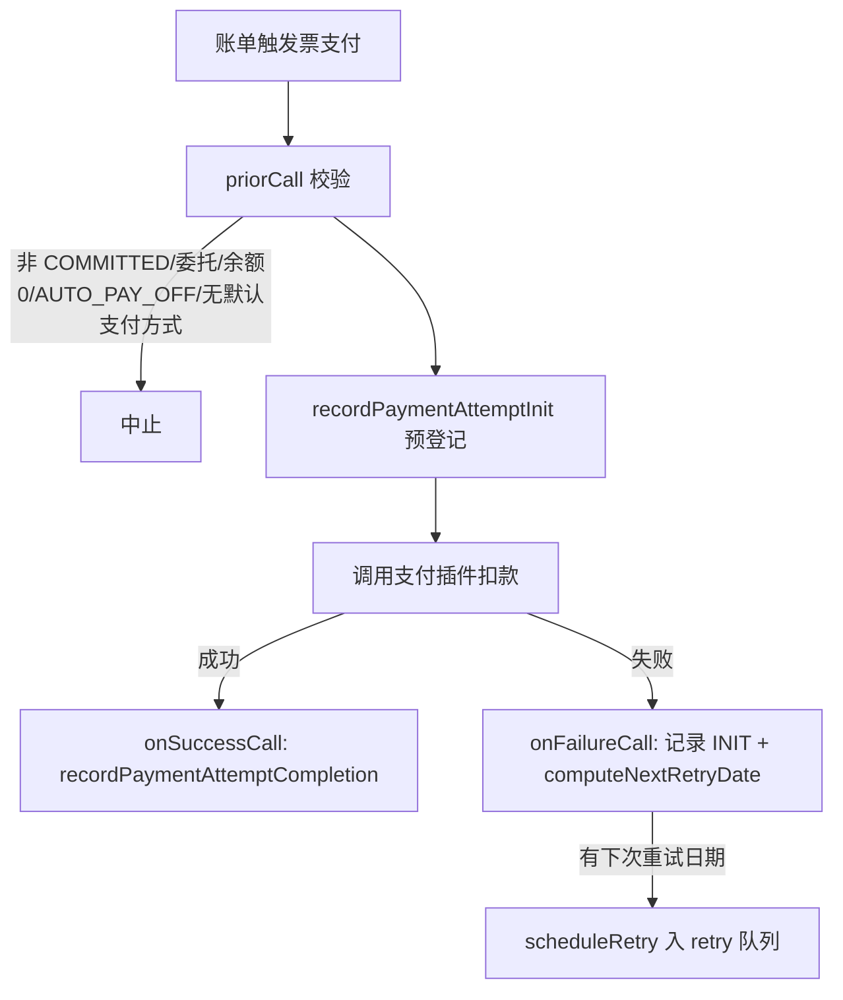
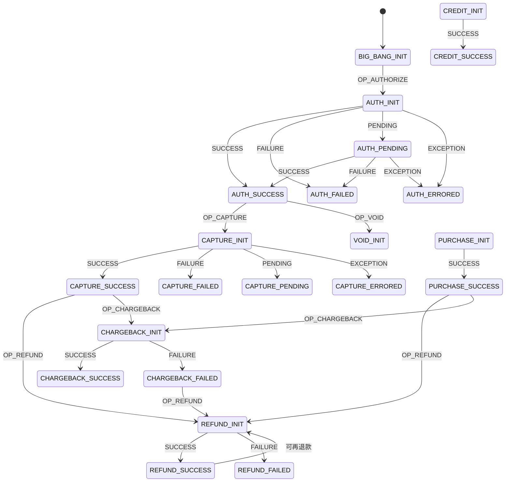
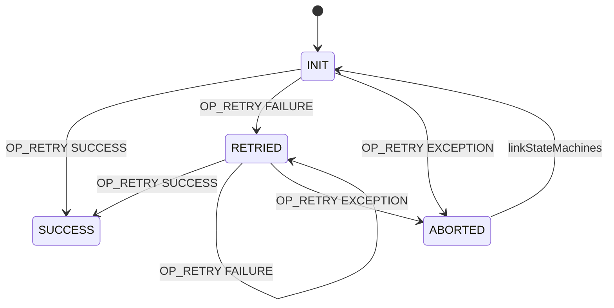
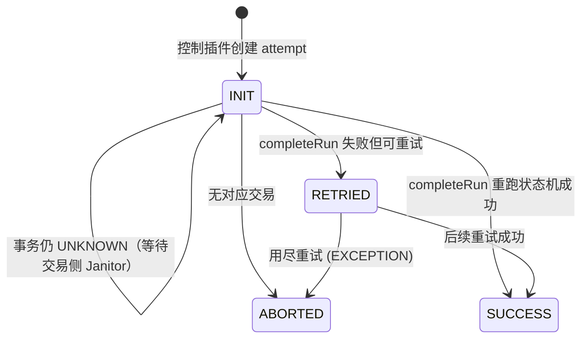

# payment 模块业务知识

### 模块概览

支付：支付交易状态机、重试与 Janitor、支付控制插件、退款/拒付。

- **模块**: payment
- **源码根**: `payment/src/main/java/org/killbill/billing/payment/`
- **卡片总数**: 49（术语 10 / 实体 5 / 规则 24 / 流程 4 / 状态机 3 / 角色权限 3）
- **全局 ID 前缀**: TERM-/ENT-/BR-/WF-/SM-/ROLE-（全局唯一，跨模块共享编号空间）

> 说明：本文件为该模块的深度视图，卡片与全局类型文件（glossary.md / entities.md / rules.md / workflows.md / state-machines.md / roles-permissions.md）中的同一全局 ID 对应。跨模块合并的卡会同时出现在多个模块视图中。

## TERM-024 发票支付类型 (InvoicePaymentType)

- **类型**: 术语
- **同义词**: 支付类型, 发票支付, invoice payment type, ATTEMPT, REFUND, CHARGED_BACK, 退款, 拒付, 支付尝试, 发票支付类型, 发票支付记录类型, attempt, refund, chargeback, InvoicePaymentType
- **模块**: invoice, payment
- **置信度**: 🟢 confirmed
- **溯源**: `invoice/src/main/java/org/killbill/billing/invoice/calculator/InvoiceCalculatorUtils.java:207-242`, `payment/src/main/java/org/killbill/billing/payment/invoice/InvoicePaymentControlPluginApi.java:168-230`, `payment/src/main/java/org/killbill/billing/payment/invoice/InvoicePaymentControlPluginApi.java:665-673`, `payment/src/main/java/org/killbill/billing/payment/api/DefaultInvoicePaymentApi.java:93-178`

**说明**：发票支付（InvoicePayment）对应支付类型：`ATTEMPT`（支付尝试，成功则计入已付）、`REFUND`（退款）、`CHARGED_BACK`（拒付/退单）。只有支付状态为 `SUCCESS`（InvoicePaymentStatus.SUCCESS）的记录才计入金额统计。

**定义**：发票上的支付记录按类型区分：
- `ATTEMPT`：一次扣款尝试（成功或失败），对应一个 purchase 交易；发票余额计算中 ATTEMPT 视为支付入账；
- `REFUND`：退款记录（退款成功后写入，金额为负向影响发票余额）；
- `CHARGED_BACK`：拒付/退单记录（撤销原扣款）。

**退款如何呈现**：一笔退款在支付侧表现为一条 `TransactionType.REFUND` 的 PaymentTransaction，在发票侧表现为一条 `InvoicePaymentType.REFUND` 的 InvoicePayment（通过 `invoiceApi.recordRefund` 写入），支持部分退款（按发票项金额或显式金额，见 BR-009）。

## TERM-042 支付交易类型 (TransactionType)

- **类型**: 术语
- **同义词**: 交易类型, 支付类型, 授权, 捕获, 扣款, 退款, 贷记, 撤销, 拒付, transaction type, AUTH, CAPTURE, PURCHASE, REFUND, CREDIT, VOID, CHARGEBACK
- **模块**: payment
- **置信度**: 🟢 confirmed
- **溯源**: `payment/src/main/java/org/killbill/billing/payment/core/sm/PaymentStateMachineHelper.java:121-234`

**定义**：Kill Bill 支付交易共 7 种类型，每种对应一条子状态机与一个 OP_ 操作：

| 类型 | 中文 | 含义 |
|---|---|---|
| `AUTHORIZE` | 授权 | 冻结额度，后续可 CAPTURE 或 VOID |
| `CAPTURE` | 捕获/请款 | 对已授权金额实际扣款 |
| `PURCHASE` | 直接购买/扣款 | 授权+捕获合一 |
| `REFUND` | 退款 | 退回已捕获/购买金额 |
| `CREDIT` | 贷记 | 直接账务贷项（非关联原交易） |
| `VOID` | 撤销 | 作废未捕获的授权 |
| `CHARGEBACK` | 拒付/退单 | 银行侧发起、撤销原扣款 |

## TERM-043 Janitor (支付清理任务)

- **类型**: 术语
- **同义词**: 清洁工, 清理任务, 支付巡检, janitor, payment janitor, incomplete payment task, 未完成支付处理
- **模块**: payment
- **置信度**: 🟢 confirmed
- **溯源**: `payment/src/main/java/org/killbill/billing/payment/core/janitor/Janitor.java:43-111`, `payment/src/main/java/org/killbill/billing/payment/core/janitor/IncompletePaymentTransactionTask.java:57-63`

**定义**：Janitor 是 Kill Bill 支付模块后台巡检服务（队列名 `janitor`），负责"修复"处于未完成状态（PENDING / UNKNOWN）的支付交易：向支付插件回查最新交易信息，把本地状态收敛到插件返回的状态。处理范围仅包括 `TransactionStatus.PENDING` 与 `TransactionStatus.UNKNOWN`。另有一个针对控制类支付（invoice payment）的变体 `IncompletePaymentAttemptTask`。

## TERM-044 支付重试 (Payment Retry)

- **类型**: 术语
- **同义词**: 支付重试, 重试, 失败重试, 补扣, payment retry, retry payment, retry schedule
- **模块**: payment
- **置信度**: 🟢 confirmed
- **溯源**: `payment/src/main/java/org/killbill/billing/payment/retry/DefaultRetryService.java:31-64`, `payment/src/main/java/org/killbill/billing/payment/retry/BaseRetryService.java:70-97`

**定义**：支付失败后由独立的通知队列 `retry` 负责在计划时间点重新发起支付。重试服务名为 `payment-service-retry`（`PAYMENT_SERVICE.getServiceName() + "-" + getQueueName()`），触发时执行 `PluginControlPaymentProcessor.retryPaymentTransaction`。

## TERM-045 AUTO_PAY_OFF（自动支付关闭标签）

- **类型**: 术语
- **同义词**: 自动支付关闭, 停止自动扣款, 关闭自动支付, 暂停代扣, AUTO_PAY_OFF, auto pay off, auto-payoff, disable auto payment
- **模块**: payment
- **置信度**: 🟢 confirmed
- **溯源**: `payment/src/main/java/org/killbill/billing/payment/invoice/InvoicePaymentControlPluginApi.java:376-380`, `payment/src/main/java/org/killbill/billing/payment/invoice/PaymentTagHandler.java:61-77`

**定义**：`AUTO_PAY_OFF` 是账户级控制标签（ControlTagType）。账户打上该标签后，Kill Bill 会停止对发票的自动扣款；当标签被移除时，`PaymentTagHandler` 会订阅标签删除事件并触发 `process_AUTO_PAY_OFF_removal`，把之前被挂起的支付尝试重新排入重试队列。

## TERM-046 MANUAL_PAY（手动支付标签）

- **类型**: 术语
- **同义词**: 手动支付, 手动付款, 人工扣款, MANUAL_PAY, manual pay, manual payment
- **模块**: payment
- **置信度**: 🟡 inferred
- **溯源**: `payment/src/main/java/org/killbill/billing/payment/invoice/InvoicePaymentControlPluginApi.java:376-380`

**定义**：与 `AUTO_PAY_OFF` 配套的账户控制标签，用于标记账户需人工发起支付。本次溯源仅在 invoice 控制插件中直接看到 `AUTO_PAY_OFF` 的判定逻辑（`ControlTagType.isAutoPayOff`），`MANUAL_PAY` 的定义在 util 模块的 `ControlTagType` 中，未在本模块代码直接引用，故置信度标为 🟡。

## TERM-047 __EXTERNAL_PAYMENT__（外部支付插件）

- **类型**: 术语
- **同义词**: 外部支付, 线下支付, 手工记录支付, 支票支付, external payment, offline payment, __EXTERNAL_PAYMENT__, 外部支付提供者
- **模块**: payment
- **置信度**: 🟢 confirmed
- **溯源**: `payment/src/main/java/org/killbill/billing/payment/provider/ExternalPaymentProviderPlugin.java:47-52`, `util/src/main/java/org/killbill/billing/util/config/definition/PaymentConfig.java:112-116`

**定义**：`__EXTERNAL_PAYMENT__` 是 Kill Bill 内置的一个特殊支付插件（`ExternalPaymentProviderPlugin.PLUGIN_NAME`），用于记录**不是由 Kill Bill 发起**的支付（如支票等外部到账），其所有操作直接返回 PROCESSED。系统属性 `org.killbill.payment.provider.default` 默认即为 `__external_payment__`。

## TERM-048 支付控制插件 (Payment Control Plugin)

- **类型**: 术语
- **同义词**: 支付控制插件, 控制插件, 支付拦截, payment control plugin, control plugin, __INVOICE_PAYMENT_CONTROL_PLUGIN__
- **模块**: payment
- **置信度**: 🟢 confirmed
- **溯源**: `payment/src/main/java/org/killbill/billing/payment/invoice/InvoicePaymentControlPluginApi.java:87-98`, `payment/src/main/java/org/killbill/billing/payment/invoice/InvoicePaymentControlPluginApi.java:130-154`

**定义**：支付控制插件在支付前后提供拦截钩子（`priorCall` 决定是否/以何金额执行，`onSuccessCall` 成功后回调，`onFailureCall` 失败后回调并可返回下次重试日期）。Kill Bill 内置的发票支付控制插件名为 `__INVOICE_PAYMENT_CONTROL_PLUGIN__`（`InvoicePaymentControlPluginApi.PLUGIN_NAME`）。它在 priorCall 中校验发票状态/父账户/余额/AUTO_PAY_OFF/支付方式，并在 onSuccess 中把支付结果回收（reconcile）到发票。

## TERM-049 支付尝试状态（attempt 状态机状态）

- **类型**: 术语
- **同义词**: 支付尝试状态, attempt 状态, INIT, RETRIED, ABORTED, attempt state, 重试状态
- **模块**: payment
- **置信度**: 🟢 confirmed
- **溯源**: `payment/src/main/resources/org/killbill/billing/payment/retry/RetryStates.xml:22-28`, `payment/src/main/java/org/killbill/billing/payment/core/janitor/IncompletePaymentAttemptTask.java:230-241`

**定义**：控制类支付（invoice payment）的支付尝试状态：
- `INIT`：初始态，表示 attempt 尚未完成；
- `SUCCESS`：重试成功/完成；
- `RETRIED`：本次失败但仍在重试；
- `ABORTED`：终止态（无对应交易等）。

## TERM-050 支付插件状态 PaymentPluginStatus

- **类型**: 术语
- **同义词**: 插件状态, 网关状态, PaymentPluginStatus, PROCESSED, PENDING, ERROR, CANCELED, UNDEFINED, 支付插件返回值
- **模块**: payment
- **置信度**: 🟢 confirmed
- **溯源**: `payment/src/main/java/org/killbill/billing/payment/core/PaymentTransactionInfoPluginConverter.java:33-56`, `payment/src/main/java/org/killbill/billing/payment/provider/ExternalPaymentProviderPlugin.java:144-158`

**定义**：支付插件返回的状态枚举：`PROCESSED`（成功）、`PENDING`（处理中）、`ERROR`（交易已到网关但被拒，即支付失败）、`CANCELED`（插件确信交易未发生，即插件失败）、`UNDEFINED`/null（结果未知）。映射关系见 BR-012。`DefaultNoOpPaymentInfoPlugin` / `ExternalPaymentProviderPlugin` 使用 `UNDEFINED` 作为缺省。

## ENT-017 发票支付 (InvoicePayment)

- **类型**: 业务实体
- **同义词**: 发票支付, 支付记录, invoice payment, InvoicePayment, 付款, 退款记录, 发票付款记录, 发票扣款记录, 支付与发票关联
- **模块**: invoice, payment
- **置信度**: 🟢 confirmed
- **溯源**: `invoice/src/main/java/org/killbill/billing/invoice/model/DefaultInvoicePayment.java:34-72`, `payment/src/main/java/org/killbill/billing/payment/api/DefaultInvoicePaymentApi.java:60-63`, `payment/src/main/java/org/killbill/billing/payment/invoice/InvoicePaymentControlPluginApi.java:168-206`

**说明**：表示发票上的一条支付/退款记录，属性：`type`（InvoicePaymentType：ATTEMPT/REFUND/CHARGED_BACK）、`paymentId`、`invoiceId`、`paymentDate`、`amount`、`currency`、`processedCurrency`、`paymentCookieId`、`linkedInvoicePaymentId`（关联的支付，如退款关联原支付）、`status`（InvoicePaymentStatus，默认 `SUCCESS`）。

**定义**：InvoicePayment 表示一笔 payment 与一张 invoice 的关联记录，含 `type`（如 `InvoicePaymentType.ATTEMPT`）、`status`（`InvoicePaymentStatus`：INIT/SUCCESS/PENDING）、`paymentCookieId`（关联的 payment transaction externalKey）、金额与币种。支付成功后由控制插件调用 `invoiceApi.recordPaymentAttemptCompletion` 写回。

## ENT-033 支付 Payment

- **类型**: 业务实体
- **同义词**: 支付, 支付单, 付款, payment, payment record, 支付记录
- **模块**: payment
- **置信度**: 🟢 confirmed
- **溯源**: `payment/src/main/java/org/killbill/billing/payment/dao/PaymentModelDao.java:40-52`, `payment/src/main/java/org/killbill/billing/payment/dao/PaymentModelDao.java:173-179`

**关键字段**：`accountId`（所属账户）、`paymentMethodId`（使用的支付方式）、`paymentNumber`（账户内支付序号）、`externalKey`（外部键，默认取 UUID）、`stateName`（当前支付状态）、`lastSuccessStateName`（最近一次成功状态，用于失败后重试）。

**存储**：表 `payments`（`TableName.PAYMENTS`），历史表 `payment_history`。一个 Payment 可包含多笔不同 TransactionType 的交易（如先 AUTHORIZE 后 CAPTURE）。

## ENT-034 支付交易 PaymentTransaction

- **类型**: 业务实体
- **同义词**: 支付交易, 交易, 交易记录, payment transaction, transaction, 支付明细
- **模块**: payment
- **置信度**: 🟢 confirmed
- **溯源**: `payment/src/main/java/org/killbill/billing/payment/dao/PaymentTransactionModelDao.java:38-49`, `payment/src/main/java/org/killbill/billing/payment/dao/PaymentTransactionModelDao.java:272-279`, `payment/src/main/java/org/killbill/billing/payment/api/DefaultPaymentTransaction.java:31-43`

**关键字段**：`paymentId`（所属支付）、`attemptId`（所属支付尝试）、`transactionExternalKey`、`transactionType`（7 种之一）、`effectiveDate`、`transactionStatus`（`TransactionStatus`）、`amount`/`currency`、`processedAmount`/`processedCurrency`（实际处理金额与币种，可能与请求金额不同）、`gatewayErrorCode`/`gatewayErrorMsg`（网关错误码/信息）。

**存储**：表 `payment_transactions`，历史表 `payment_transaction_history`。

## ENT-035 支付方式 PaymentMethod

- **类型**: 业务实体
- **同义词**: 支付方式, 付款方式, 银行卡, 信用卡, payment method, card, 支付工具
- **模块**: payment
- **置信度**: 🟢 confirmed
- **溯源**: `payment/src/main/java/org/killbill/billing/payment/api/DefaultPaymentMethod.java:31-45`, `payment/src/main/java/org/killbill/billing/payment/dao/PaymentMethodModelDao.java:149-156`

**关键字段**：`accountId`（所属账户）、`externalKey`、`isActive`、`pluginName`（由哪个支付插件管理，如网关插件或 `__EXTERNAL_PAYMENT__`）、`pluginDetail`（插件侧的支付方式明细）。

**存储**：表 `payment_methods`，历史表 `payment_method_history`。账户的默认支付方式由账户上的 `paymentMethodId` 指向（见 BR-011）。

## ENT-036 支付尝试 PaymentAttempt

- **类型**: 业务实体
- **同义词**: 支付尝试, 扣款尝试, 重试记录, payment attempt, attempt, 支付尝试记录
- **模块**: payment
- **置信度**: 🟢 confirmed
- **溯源**: `payment/src/main/java/org/killbill/billing/payment/dao/PaymentAttemptModelDao.java:40-50`, `payment/src/main/java/org/killbill/billing/payment/dao/PaymentAttemptModelDao.java:238-245`, `payment/src/main/java/org/killbill/billing/payment/api/DefaultPaymentAttempt.java:29-40`

**关键字段**：`accountId`、`paymentMethodId`、`paymentExternalKey`、`transactionId`/`transactionExternalKey`、`transactionType`、`stateName`、`amount`/`currency`、`pluginName`（含支付控制插件名列表，逗号分隔）、`pluginProperties`（序列化后的插件属性）。

**存储**：表 `payment_attempts`，历史表 `payment_attempt_history`。支付尝试是控制类支付（invoice payment）与失败重试的关联主体，重试队列以 `attemptId` 定位任务。

## BR-140 支付失败重试计划（默认 8,8,8 天）

- **类型**: 业务规则
- **同义词**: 重试间隔, 重试天数, 重试次数, payment retry days, retry interval, 8 8 8
- **模块**: payment
- **置信度**: 🟢 confirmed
- **溯源**: `util/src/main/java/org/killbill/billing/util/config/definition/PaymentConfig.java:31-39`

**规则**：系统属性 `org.killbill.payment.retry.days`（默认 `8,8,8`）定义支付失败后的重试间隔（天）。默认值表示最多重试 3 次，每次间隔 8 天。

## BR-141 插件失败重试参数（初始 300 秒 / 倍数 2 / 最多 8 次）

- **类型**: 业务规则
- **同义词**: 网关重试, 插件失败重试, 指数退避, plugin failure retry, gateway down retry, retry multiplier
- **模块**: payment
- **置信度**: 🟢 confirmed
- **溯源**: `util/src/main/java/org/killbill/billing/util/config/definition/PaymentConfig.java:41-90`

**规则**：当支付失败原因是插件失败（网关宕机、瞬时错误等）时：
- `org.killbill.payment.failure.retry.start.sec` 默认 `300`，即首次重试等待 300 秒；
- `org.killbill.payment.failure.retry.multiplier` 默认 `2`，后续重试间隔按倍数递增（指数退避）；
- `org.killbill.payment.failure.retry.max.attempts` 默认 `8`，最多重试 8 次。

## BR-142 Janitor 未完成交易重试计划（UNKNOWN / PENDING）

- **类型**: 业务规则
- **同义词**: janitor 重试间隔, unknown retries, pending retries, 未完成交易重试, 支付巡检间隔
- **模块**: payment
- **置信度**: 🟢 confirmed
- **溯源**: `util/src/main/java/org/killbill/billing/util/config/definition/PaymentConfig.java:61-79`, `util/src/main/java/org/killbill/billing/util/config/definition/PaymentConfig.java:102-110`

**规则**：
- `org.killbill.payment.janitor.unknown.retries` 默认 `5m,1h,1d,1d,1d,1d,1d`，即 UNKNOWN 交易的回查/重试延迟序列；
- `org.killbill.payment.janitor.pending.retries` 默认 `1h, 1d`，即 PENDING 交易的回查/重试延迟序列；
- `org.killbill.payment.janitor.rate` 默认 `1h`，Janitor 主任务的调度频率；
- `org.killbill.payment.janitor.attempts.delay` 默认 `12h`，未完成支付尝试（attempt）的重试延迟。

## BR-143 AUTO_PAY_OFF 账户自动支付中止

- **类型**: 业务规则
- **同义词**: 自动支付关闭, 停止自动扣款, auto pay off, auto-payoff abort, 标签关闭自动支付
- **模块**: payment
- **置信度**: 🟢 confirmed
- **溯源**: `payment/src/main/java/org/killbill/billing/payment/invoice/InvoicePaymentControlPluginApi.java:730-745`, `payment/src/main/java/org/killbill/billing/payment/invoice/InvoicePaymentControlPluginApi.java:376-380`

**规则**：当发起非 API（系统自动）发票支付时，若账户带有 `AUTO_PAY_OFF` 标签（`ControlTagType.isAutoPayOff`），则：
1. 向 `invoice_payment_control_plugin_auto_pay_off` 表插入一条挂起记录（`PluginAutoPayOffModelDao`）；
2. 中止本次支付（返回 abort）。
**例外**：API 发起的支付（`isApiPayment()` 为 true）不受 AUTO_PAY_OFF 影响。

## BR-144 未提交(非 COMMITTED)发票不允许支付

- **类型**: 业务规则
- **同义词**: 草稿发票不扣款, 发票未提交, draft invoice payment, COMMITTED invoice, 发票状态校验
- **模块**: payment
- **置信度**: 🟢 confirmed
- **溯源**: `payment/src/main/java/org/killbill/billing/payment/invoice/InvoicePaymentControlPluginApi.java:341-351`

**规则**：购买（PURCHASE）前校验发票状态，若发票不是 `COMMITTED`（如 DRAFT），记录日志并中止支付（`DefaultPriorPaymentControlResult(true)`）。

## BR-145 委托给父账户的子账户发票不自动支付

- **类型**: 业务规则
- **同义词**: 父账户代付, 子账户委托, delegated payment, parent account payment, 子账户不扣款
- **模块**: payment
- **置信度**: 🟢 confirmed
- **溯源**: `payment/src/main/java/org/killbill/billing/payment/invoice/InvoicePaymentControlPluginApi.java:353-360`

**规则**：若账户的支付被委托给父账户（`accountData.isPaymentDelegatedToParent()` 为 true）或发票已关联父账户（`invoice.getParentAccountId() != null`），则中止本账户的支付扣款。

## BR-146 空发票(余额为 0)支付处理

- **类型**: 业务规则
- **同义词**: 零元发票, 空发票, 余额为零, zero amount invoice, empty invoice, allowEmptyInvoice
- **模块**: payment
- **置信度**: 🟢 confirmed
- **溯源**: `payment/src/main/java/org/killbill/billing/payment/invoice/InvoicePaymentControlPluginApi.java:362-374`, `util/src/main/java/org/killbill/billing/util/config/definition/PaymentConfig.java:138-141`

**规则**：当请求支付金额计算结果 ≤ 0（发票已付清）时：
- 若系统属性 `org.killbill.payment.allow.emptyInvoice` 为 `true`（默认 `false`），则**不中止**，继续以 0 元发起支付；
- 否则视为"发票已支付"并中止支付。

## BR-147 支付金额不得超过发票余额

- **类型**: 业务规则
- **同义词**: 支付金额校验, 超付校验, 余额上限, overpayment, invoice balance, invalid amount
- **模块**: payment
- **置信度**: 🟢 confirmed
- **溯源**: `payment/src/main/java/org/killbill/billing/payment/invoice/InvoicePaymentControlPluginApi.java:710-728`

**规则**：`validateAndComputePaymentAmount` 对金额做如下判定：
- 发票余额 ≤ 0 → 返回 0；
- 若为 API 支付且显式传入金额大于发票余额 → 抛 `PaymentApiException`（`PAYMENT_PLUGIN_EXCEPTION`，"Invalid amount"）；
- 否则取 `min(输入金额, 发票余额)` 作为实际支付金额；输入为 null 时取发票余额。

## BR-148 退款金额计算（按发票项或显式金额）

- **类型**: 业务规则
- **同义词**: 退款金额, 部分退款, 退款上限, refund amount, partial refund, invoice item adjustment
- **模块**: payment
- **置信度**: 🟢 confirmed
- **溯源**: `payment/src/main/java/org/killbill/billing/payment/invoice/InvoicePaymentControlPluginApi.java:529-556`, `payment/src/main/java/org/killbill/billing/payment/invoice/InvoicePaymentControlPluginApi.java:438-478`

**规则**：
- 若显式指定退款金额（`specifiedRefundAmount`），必须 > 0，否则报错"需要指定正数退款金额"；该金额直接作为退款额。
- 若未指定，则按退款关联的发票项（`invoiceItemIdsWithAmounts`）累加：每项可取显式金额（必须 > 0 且不超过该项原始金额）或默认取该项原始金额。
- 若计算出的可退金额为 0 且为 API 支付 → 抛错中止退款。

## BR-149 失败支付的下次重试日期计算

- **类型**: 业务规则
- **同义词**: 重试日期, 下次重试, retry date, next retry, 重试计划计算, IPCD_RETRIES
- **模块**: payment
- **置信度**: 🟢 confirmed
- **溯源**: `payment/src/main/java/org/killbill/billing/payment/invoice/InvoicePaymentControlPluginApi.java:567-628`

**规则**：`computeNextRetryDate` 决定失败购买交易是否/何时重试：
- **API 发起的支付默认不重试**：除非插件属性 `IPCD_RETRIES` 为 true，否则 `isApiPayment` 为真时直接返回 null（不重试）。
- 取该支付下最后一次 PURCHASE 交易的状态：
  - `PAYMENT_FAILURE` → 按 `org.killbill.payment.retry.days`（默认 8,8,8）取第 `retryCount` 天的间隔；`retryCount = 已处于 PAYMENT_FAILURE 的尝试数 - 1`；超过重试天数数组长度则不再重试。
  - `PLUGIN_FAILURE` → 按失败重试次数做指数退避：`nbSec = start.sec × multiplier^(retryAttempt-1)`，其中 retryAttempt = 已处于 PLUGIN_FAILURE 的尝试数 - 1；达到 `max.attempts`（默认 8）后不再重试。
  - `UNKNOWN` / 其他 → 不重试。

## BR-150 默认支付方式取自账户 (account.paymentMethodId)

- **类型**: 业务规则
- **同义词**: 默认支付方式, 账户默认卡, default payment method, account payment method, 自动扣款用哪张卡
- **模块**: payment
- **置信度**: 🟢 confirmed
- **溯源**: `payment/src/main/java/org/killbill/billing/payment/core/PaymentProcessor.java:252-257`, `payment/src/main/java/org/killbill/billing/payment/invoice/InvoicePaymentControlPluginApi.java:382-397`

**规则**：执行支付时若调用方未显式传入 `paymentMethodId`，则使用账户上的默认支付方式（`account.getPaymentMethodId()`）。在发票自动支付场景中，若控制上下文 `getPaymentMethodId()` 为 null（账户无默认支付方式），则记录一条 `InvoicePaymentStatus.INIT` 的支付尝试完成事件并**中止**本次扣款（不会被触发）。

## BR-151 插件状态(PluginStatus)到交易状态/操作结果的映射

- **类型**: 业务规则
- **同义词**: 插件状态, 支付结果映射, plugin status, PaymentPluginStatus, PROCESSED, CANCELED, UNDEFINED, 交易状态转换
- **模块**: payment
- **置信度**: 🟢 confirmed
- **溯源**: `payment/src/main/java/org/killbill/billing/payment/core/PaymentTransactionInfoPluginConverter.java:33-72`

**规则**：将支付插件返回的 `PaymentPluginStatus` 映射为内部 `TransactionStatus`（和操作结果 `OperationResult`）：

| 插件状态 | TransactionStatus | OperationResult | 含义 |
|---|---|---|---|
| `PROCESSED` | `SUCCESS` | `SUCCESS` | 交易成功 |
| `PENDING` | `PENDING` | `PENDING` | 处理中，待确认 |
| `ERROR` | `PAYMENT_FAILURE` | `FAILURE` | 交易到达网关但被拒（如信用卡被拒） |
| `CANCELED` | `PLUGIN_FAILURE` | `EXCEPTION` | 插件确信交易未发生（连接失败等） |
| `UNDEFINED`/null | `UNKNOWN` | `EXCEPTION` | 结果未知，交 Janitor 回查修正 |

## BR-152 单笔支付不允许并发的未决交易

- **类型**: 业务规则
- **同义词**: 防重复扣款, 未决交易, 并发支付, double payment, pending transaction, 重复提交
- **模块**: payment
- **置信度**: 🟢 confirmed
- **溯源**: `payment/src/main/java/org/killbill/billing/payment/core/PaymentProcessor.java:352-385`, `payment/src/main/java/org/killbill/billing/payment/core/PaymentProcessor.java:308-310`

**规则**：
- 对 AUTHORIZE / PURCHASE / CREDIT，若同一支付下已存在 `PENDING` 状态的交易且调用未指定该交易 id/key，则抛 `PAYMENT_INVALID_OPERATION` 阻止新交易（防止重复扣款）。
- 若待完成的交易处于 `UNKNOWN` 状态，则无法确定其在状态机中的位置，直接抛 `PAYMENT_INVALID_OPERATION` 拒绝本次操作。
- 同一 `transactionExternalKey` 不允许已有成功的非 CHARGEBACK 交易（`PAYMENT_ACTIVE_TRANSACTION_KEY_EXISTS`），且该 key 不能跨账户（`PAYMENT_TRANSACTION_DIFFERENT_ACCOUNT_ID`）。

## BR-153 执行交易前先调用 Janitor 修正状态

- **类型**: 业务规则
- **同义词**: 先巡检再支付, janitor 修正, refresh before payment, 支付前修复状态
- **模块**: payment
- **置信度**: 🟢 confirmed
- **溯源**: `payment/src/main/java/org/killbill/billing/payment/core/PaymentProcessor.java:282-290`

**规则**：执行任何支付操作（`performOperation`）时，若该支付已存在，系统**先**调用 `paymentRefresher.invokeJanitor` 获取插件最新状态并修正本地状态，**然后**才让状态机推进交易。这样可避免因为本地状态陈旧而做出错误的状态流转（如重复扣款或错误拒绝）。

## BR-154 Janitor 下次回查时间计算（UNKNOWN/PENDING 重试表）

- **类型**: 业务规则
- **同义词**: janitor 回查间隔, 下次巡检时间, janitor retry schedule, unknown retries, pending retries
- **模块**: payment
- **置信度**: 🟢 confirmed
- **溯源**: `payment/src/main/java/org/killbill/billing/payment/core/janitor/IncompletePaymentAttemptTask.java:401-418`

**规则**：`getNextNotificationTime` 根据交易状态选择延迟表：
- `UNKNOWN` → 使用 `org.killbill.payment.janitor.unknown.retries`（默认 `5m,1h,1d,1d,1d,1d,1d`）；
- `PENDING` → 使用 `org.killbill.payment.janitor.pending.retries`（默认 `1h, 1d`）；
- 取第 `attemptNumber` 个延迟作为下次通知时间；若 `attemptNumber > 表长度`，返回 null（不再回查）。

## BR-155 支付控制插件可调整支付参数，默认禁止覆盖已有支付方式

- **类型**: 业务规则
- **同义词**: 控制插件调整, 修改支付方式, overwrite payment method, adjusted payment method, 插件改金额
- **模块**: payment
- **置信度**: 🟢 confirmed
- **溯源**: `payment/src/main/java/org/killbill/billing/payment/core/sm/control/ControlPluginRunner.java:128-151`, `util/src/main/java/org/killbill/billing/util/config/definition/PaymentConfig.java:133-136`

**规则**：控制插件 `priorCall` 返回值可调整：支付方式 id（`AdjustedPaymentMethodId`）、插件名、金额、币种、插件属性；任一插件的 `isAborted()` 为真则抛 `PaymentControlApiAbortException` 中止。**覆盖限制**：若插件试图设置 paymentMethodId，但该支付已存在 paymentMethodId 且系统属性 `org.killbill.payment.method.overwrite` 为 `false`（默认），则抛 `PaymentControlApiException` 拒绝覆盖。

## BR-156 支付插件按支付方式的 pluginName 查找

- **类型**: 业务规则
- **同义词**: 插件查找, 找不到插件, payment plugin lookup, no such payment plugin, plugin not found
- **模块**: payment
- **置信度**: 🟢 confirmed
- **溯源**: `payment/src/main/java/org/killbill/billing/payment/core/PaymentPluginServiceRegistration.java:80-91`

**规则**：执行支付时，系统根据支付方式记录里的 `pluginName` 从 OSGI 注册表查找对应 `PaymentPluginApi`；若插件未注册，抛 `PaymentApiException(ErrorCode.PAYMENT_NO_SUCH_PAYMENT_PLUGIN, pluginName)`。

## BR-157 支付插件调用超时与线程配置

- **类型**: 业务规则
- **同义词**: 插件超时, 支付线程数, 插件调用超时, payment plugin timeout, plugin threads, dispatch timeout
- **模块**: payment
- **置信度**: 🟢 confirmed
- **溯源**: `payment/src/main/java/org/killbill/billing/payment/dispatcher/PluginDispatcher.java:44-69`, `util/src/main/java/org/killbill/billing/util/config/definition/PaymentConfig.java:118-131`

**规则**：
- `org.killbill.payment.plugin.timeout` 默认 `30s`：每个支付插件调用通过独立线程池执行，超过该超时抛 `TimeoutException`；
- `org.killbill.payment.plugin.threads.nb` 默认 `10`：插件调度线程池大小；
- `org.killbill.payment.globalLock.retries` 默认 `50`：获取全局锁（每次等待 100ms）的最大重试次数。

## BR-158 支付错误事件与插件错误事件

- **类型**: 业务规则
- **同义词**: 支付错误事件, 插件错误事件, payment error event, plugin error event, bus event, 快照事件
- **模块**: payment
- **置信度**: 🟢 confirmed
- **溯源**: `payment/src/main/java/org/killbill/billing/payment/api/DefaultPaymentErrorEvent.java:32-58`, `payment/src/main/java/org/killbill/billing/payment/api/DefaultPaymentPluginErrorEvent.java:32-58`, `payment/src/main/java/org/killbill/billing/payment/core/sm/payments/PaymentEnteringStateCallback.java:49-82`

**规则**：
- `DefaultPaymentErrorEvent`（bus 类型 `PAYMENT_ERROR`）：当交易未创建且调用来自非 API（如自动扣款）时发送，消息为"Early abortion of payment transaction"（如缺少默认支付方式等异常情况）。
- `DefaultPaymentPluginErrorEvent`（bus 类型 `PAYMENT_PLUGIN_ERROR`）：插件层错误事件。
- 两者均携带 accountId / paymentId / paymentTransactionId / amount / currency / status / transactionType / effectiveDate / apiPayment / message。

## BR-159 外部支付通过插件属性模拟失败（测试/演示语义）

- **类型**: 业务规则
- **同义词**: 外部支付失败模拟, external payment fail, killbill.external.payment.fail, 演示失败
- **模块**: payment
- **置信度**: 🟢 confirmed
- **溯源**: `payment/src/main/java/org/killbill/billing/payment/provider/ExternalPaymentProviderPlugin.java:144-178`

**规则**：`__EXTERNAL_PAYMENT__` 插件根据插件属性决定返回结果，便于记录/演示各种外部支付情形：
- `killbill.external.payment.fail.error=true` → 返回 `PaymentPluginStatus.ERROR`（支付失败）；
- `killbill.external.payment.fail.exception=true` → 抛 `PaymentPluginApiException`；
- `killbill.external.payment.fail.cancellation=true` → 返回 `CANCELED`（插件失败）；
- `killbill.external.payment.fail.timeout=true` → 休眠 `payment.plugin.timeout + 1000ms` 触发超时；
- 默认返回 `PROCESSED`（成功记录）。

## BR-160 外部支付（__EXTERNAL_PAYMENT__）的用途

- **类型**: 业务规则
- **同义词**: 外部支付用途, 线下支付记录, external payment usage, 记录支票支付, 手动入账
- **模块**: payment
- **置信度**: 🟢 confirmed
- **溯源**: `payment/src/main/java/org/killbill/billing/payment/provider/ExternalPaymentProviderPlugin.java:47-52`, `util/src/main/java/org/killbill/billing/util/config/definition/PaymentConfig.java:112-116`, `payment/src/main/java/org/killbill/billing/payment/provider/DefaultPaymentProviderPluginRegistry.java:40-43`

**规则**：`__EXTERNAL_PAYMENT__` 用于**记录并非由 Kill Bill 发起/处理的外部支付**（例如支票、银行转账已到账），它不做真实网关交互，直接把交易标记为成功。系统属性 `org.killbill.payment.provider.default`（默认 `__external_payment__`）指定默认支付提供者。因此当某支付方式绑定到该插件时，Kill Bill 只记录该笔支付而不调用任何外部网关。

## BR-161 各交易类型的插件操作与无金额操作

- **类型**: 业务规则
- **同义词**: 交易类型操作, void 无金额, authorize capture purchase, 插件方法映射, 无金额撤销
- **模块**: payment
- **置信度**: 🟢 confirmed
- **溯源**: `payment/src/main/java/org/killbill/billing/payment/provider/ExternalPaymentProviderPlugin.java:63-101`, `payment/src/main/java/org/killbill/billing/payment/core/PaymentProcessor.java:100-143`

**规则**：每类交易对应插件的不同方法，且金额语义不同：
- `AUTHORIZE`→`authorizePayment`（带金额）、`CAPTURE`→`capturePayment`（带金额）、`PURCHASE`→`purchasePayment`（带金额）；
- `REFUND`→`refundPayment`（带退款金额）、`CREDIT`→`creditPayment`（带金额）；
- `VOID`→`voidPayment`（**不带金额**，插件侧以 `BigDecimal.ZERO`/null 币种表示）；
- `CHARGEBACK`→由 `createChargeback`/`createChargebackReversal` 触发（拒绝即冲销，`ChargebackReversal` 使用 `OperationResult.FAILURE`）。
`PaymentProcessor` 对外暴露 `createAuthorization` / `createCapture` / `createPurchase` / `createVoid` / `createRefund` / `createCredit` / `createChargeback` / `createChargebackReversal` 等入口。

## BR-162 支付状态机 linkStateMachines：交易类型的先后约束

- **类型**: 业务规则
- **同义词**: 交易顺序, 授权后捕获, 捕获后退款, state machine links, 允许的交易链
- **模块**: payment
- **置信度**: 🟢 confirmed
- **溯源**: `payment/src/main/resources/org/killbill/billing/payment/PaymentStates.xml:412-497`

**规则**：`linkStateMachines` 定义了不同交易类型之间的合法衔接（即"下一步能做什么"）：
- 从 `BIG_BANG_INIT` 可发起 AUTHORIZE / PURCHASE / CREDIT；
- `AUTH_SUCCESS` 后只能转向 CAPTURE 或 VOID；
- `CAPTURE_SUCCESS` 后可转向 REFUND、再次 CAPTURE、或 CHARGEBACK；
- `PURCHASE_SUCCESS` 后可转向 REFUND 或 CHARGEBACK；
- `REFUND_SUCCESS` 后可再次 REFUND 或 CHARGEBACK；
- `CHARGEBACK_SUCCESS` 后可再次 CHARGEBACK（多次拒付），`CHARGEBACK_FAILED` 后可 REFUND。

这解释了业务上"必须先授权再捕获、捕获后才能退款、拒付只能在扣款/退款之后"等顺序约束。

## BR-163 支付状态机成功态判定

- **类型**: 业务规则
- **同义词**: 成功态判定, isSuccessState, success state, 支付成功判断
- **模块**: payment
- **置信度**: 🟢 confirmed
- **溯源**: `payment/src/main/java/org/killbill/billing/payment/core/sm/PaymentStateMachineHelper.java:236-239`

**规则**：`isSuccessState(stateName)` 判定某状态是否成功态：状态名以 `SUCCESS` 结尾**或**以 `CHARGEBACK` 开头（即所有 `CHARGEBACK_*` 状态都被视为成功，因为拒付本身是"已确认发生"的终态）。

## WF-017 发票支付流程（控制插件驱动）

- **类型**: 业务流程
- **同义词**: 发票扣款流程, 自动支付流程, invoice payment flow, purchase flow, 支付控制流程
- **模块**: payment
- **置信度**: 🟢 confirmed
- **溯源**: `payment/src/main/java/org/killbill/billing/payment/invoice/InvoicePaymentControlPluginApi.java:130-310`, `payment/src/main/java/org/killbill/billing/payment/invoice/InvoicePaymentControlPluginApi.java:341-436`

**参与方**：账单系统（触发）、支付控制插件（__INVOICE_PAYMENT_CONTROL_PLUGIN__）、支付插件（网关）、发票模块。

**步骤**：
1. `priorCall`：校验交易类型为 PURCHASE/REFUND/CHARGEBACK/CREDIT；
2. 对 PURCHASE 执行 `getPluginPurchaseResult`：校验发票 COMMITTED → 校验父账户委托 → 计算金额 → 校验 AUTO_PAY_OFF → 校验默认支付方式 → 检查是否存在 UNKNOWN 交易 → `recordPaymentAttemptInit` 预写一条 attempt；
3. 调用支付插件执行实际扣款；
4. 成功 → `onSuccessCall`：对 PURCHASE 调 `invoiceApi.recordPaymentAttemptCompletion` 把支付结果写入发票；
5. 失败 → `onFailureCall`：对 PURCHASE 以 0 金额记录 `INIT` 状态，并计算 `nextRetryDate` 决定是否重试。

## WF-018 退款流程

- **类型**: 业务流程
- **同义词**: 退款流程, 退钱, 部分退款流程, refund flow, refund process
- **模块**: payment
- **置信度**: 🟢 confirmed
- **溯源**: `payment/src/main/java/org/killbill/billing/payment/invoice/InvoicePaymentControlPluginApi.java:202-207`, `payment/src/main/java/org/killbill/billing/payment/invoice/InvoicePaymentControlPluginApi.java:438-478`, `payment/src/main/java/org/killbill/billing/payment/api/DefaultInvoicePaymentApi.java:93-119`

**步骤**：
1. 调用方通过 `createRefundForInvoicePayment` 指定是否调整发票项（`isAdjusted`）及调整明细（`adjustments`）；
2. 组装插件属性 `IPCD_REFUND_WITH_ADJUSTMENTS` 与 `IPCD_REFUND_IDS_AMOUNTS`；
3. `priorCall`→`getPluginRefundResult` 计算可退金额（见 BR-009），金额为 0 且为 API 支付则中止；
4. 若需调整发票项，先 `validateInvoiceItemAdjustments` 校验；
5. 调用支付插件退款；
6. 成功 → `onSuccessCall` 调 `invoiceApi.recordRefund`。**退款不重试**（onFailureCall 中 REFUND 分支不设置重试日期）。

## WF-019 拒付(Chargeback)流程

- **类型**: 业务流程
- **同义词**: 拒付流程, 退单, 银行拒付, chargeback flow, dispute
- **模块**: payment
- **置信度**: 🟢 confirmed
- **溯源**: `payment/src/main/java/org/killbill/billing/payment/invoice/InvoicePaymentControlPluginApi.java:209-232`, `payment/src/main/java/org/killbill/billing/payment/invoice/InvoicePaymentControlPluginApi.java:298-304`

**步骤**：
1. CHARGEBACK 的 priorCall 直接返回允许（`DefaultPriorPaymentControlResult(false, amount)`），不做发票前置校验；
2. 成功后 `onSuccessCall` 调 `invoiceApi.recordChargeback`；**不支持部分拒付**（若已存在 chargeback 记录则跳过）；
3. 失败则 `onFailureCall` 调 `recordChargebackReversal` 冲销该拒付。

## WF-020 Janitor 修复未完成支付流程

- **类型**: 业务流程
- **同义词**: 支付巡检流程, 修复未完成支付, janitor flow, incomplete payment repair, PENDING 修复
- **模块**: payment
- **置信度**: 🟢 confirmed
- **溯源**: `payment/src/main/java/org/killbill/billing/payment/core/janitor/IncompletePaymentTransactionTask.java:136-222`, `payment/src/main/java/org/killbill/billing/payment/core/janitor/IncompletePaymentAttemptTask.java:378-418`, `payment/src/main/java/org/killbill/billing/payment/core/janitor/Janitor.java:98-111`

**参与方**：Janitor 定时调度器、交易侧任务（IncompletePaymentTransactionTask）、尝试侧任务（IncompletePaymentAttemptTask）、支付插件、通知队列（janitor）。

**步骤**：
1. Janitor 启动后按 `org.killbill.payment.janitor.rate`（默认 1h）周期调度 `incompletePaymentAttemptTask`；
2. 对 PENDING/UNKNOWN 交易，向支付插件 `getPaymentInfo` 回查最新状态；
3. 用插件状态计算新的 TransactionStatus 与 PaymentState（PENDING→pending state，SUCCESS→success state，PAYMENT_FAILURE→failure state，PLUGIN_FAILURE→errored state，UNKNOWN→跳过）；
4. 若状态确实变化则"Repairing..."写回（`processPaymentInfoPlugin`），否则按 3 的重试时间表插入新的通知（`JanitorNotificationKey`，attemptNumber+1）；
5. attempt 侧若交易变为非 UNKNOWN，则重跑控制状态机 completion 使 attempt 进入终态。

## SM-006 支付交易状态机

- **类型**: 状态机
- **同义词**: 支付状态, 支付状态机, 交易状态, payment state, payment state machine, transaction status, AUTH_SUCCESS, PURCHASE_PENDING
- **模块**: payment
- **置信度**: 🟢 confirmed
- **溯源**: `payment/src/main/resources/org/killbill/billing/payment/PaymentStates.xml:22-497`, `payment/src/main/java/org/killbill/billing/payment/core/sm/PaymentStateMachineHelper.java:83-110`

**说明**：每种交易类型（AUTHORIZE/CAPTURE/PURCHASE/REFUND/CREDIT/VOID/CHARGEBACK）各是一条独立子状态机，初始状态均为 `<TYPE>_INIT`，由操作 OP_<TYPE> 驱动到 `<TYPE>_SUCCESS` / `<TYPE>_FAILED` / `<TYPE>_PENDING` / `<TYPE>_ERRORED`。PENDING 状态可再经同一操作流向 SUCCESS 或 FAILED，EXCEPTION 结果流向 ERRORED。子状态机之间通过 linkStateMachines 串联。

**成功判定**：`isSuccessState` 规则为状态名以 `SUCCESS` 结尾，或状态名以 `CHARGEBACK` 开头（即任何 CHARGEBACK_* 状态都算成功态）。

## SM-007 支付重试控制状态机 (PAYMENT_RETRY)

- **类型**: 状态机
- **同义词**: 支付重试状态机, retry state machine, PAYMENT_RETRY, 重试流转, OP_RETRY
- **模块**: payment
- **置信度**: 🟢 confirmed
- **溯源**: `payment/src/main/resources/org/killbill/billing/payment/retry/RetryStates.xml:22-82`, `payment/src/main/java/org/killbill/billing/payment/core/sm/PaymentControlStateMachineHelper.java:35-52`

**说明**：控制类支付（invoice payment）的重试由 PAYMENT_RETRY 状态机驱动，操作名为 OP_RETRY，状态机名必须与 RetryStates.xml 一致。

## SM-008 Janitor 支付尝试(attempt)修复状态机

- **类型**: 状态机
- **同义词**: attempt 修复, 支付尝试状态机, janitor attempt, attempt repair, INIT 到终态
- **模块**: payment
- **置信度**: 🟢 confirmed
- **溯源**: `payment/src/main/java/org/killbill/billing/payment/core/janitor/IncompletePaymentAttemptTask.java:196-294`, `payment/src/main/resources/org/killbill/billing/payment/retry/RetryStates.xml:22-82`

**说明**：Janitor 的 `IncompletePaymentAttemptTask` 定期扫描处于重试状态机初始态（`INIT`）且创建时间早于 `org.killbill.payment.janitor.attempts.delay`（默认 12h）的支付尝试，并推进其状态：

**触发条件**：attempt 对应交易为 `UNKNOWN` 时跳过（交交易侧 Janitor）；否则重跑控制状态机的 completion 部分，仅调用控制插件的 success/failure 回调并流转状态。

## ROLE-007 系统内部用户（Janitor/重试以 SYSTEM 身份执行）

- **类型**: 角色/权限
- **同义词**: 系统用户, 内部调用, SYSTEM, internal call, 自动任务身份, 重试身份
- **模块**: payment
- **置信度**: 🟢 confirmed
- **溯源**: `payment/src/main/java/org/killbill/billing/payment/core/janitor/IncompletePaymentTransactionTask.java:197-202`, `payment/src/main/java/org/killbill/billing/payment/retry/BaseRetryService.java:79-82`

**定义**：Janitor 修复交易与重试服务触发重试时，均以内部调用身份执行：`CallOrigin.INTERNAL` + `UserType.SYSTEM`，调用方名称为 `IncompletePaymentTransactionTask` / `payment-service-retry`。这表示这些操作不受终端用户 API 权限约束，由系统自动完成。

## ROLE-008 支付控制插件名称配置（org.killbill.payment.invoice.plugin）

- **类型**: 角色/权限
- **同义词**: 控制插件配置, 默认控制插件, payment control plugin names, invoice plugin, 插件白名单
- **模块**: payment
- **置信度**: 🔴 gap
- **溯源**: `util/src/main/java/org/killbill/billing/util/config/definition/PaymentConfig.java:92-100`

**说明**：系统属性 `org.killbill.payment.invoice.plugin`（默认空字符串）用于配置默认的支付控制插件名列表（`getPaymentControlPluginNames`）。但本模块源码中未直接看到该配置被消费的具体位置（可能在下游 dispatcher 或 jaxrs 层），因此其确切作用/权限语义需人工确认，置信度标为 🔴。

## ROLE-009 支付插件注册表 / OSGI 服务名

- **类型**: 角色/权限
- **同义词**: 插件注册表, OSGI 服务, plugin registry, OSGIServiceRegistration, payment plugin registry
- **模块**: payment
- **置信度**: 🟢 confirmed
- **溯源**: `payment/src/main/java/org/killbill/billing/payment/glue/PaymentModule.java:151-154`, `payment/src/main/java/org/killbill/billing/payment/core/PaymentPluginServiceRegistration.java:85-90`

**定义**：支付插件通过 OSGI 服务注册表（`OSGIServiceRegistration<PaymentPluginApi>`，由 `DefaultPaymentProviderPluginRegistryProvider` 提供）按 **插件名**（服务名）注册与查找；控制插件同理（`OSGIServiceRegistration<PaymentControlPluginApi>`）。插件名即支付方式记录中的 `pluginName`，内置值包括 `__EXTERNAL_PAYMENT__`（外部支付）与 `__INVOICE_PAYMENT_CONTROL_PLUGIN__`（发票支付控制）。
