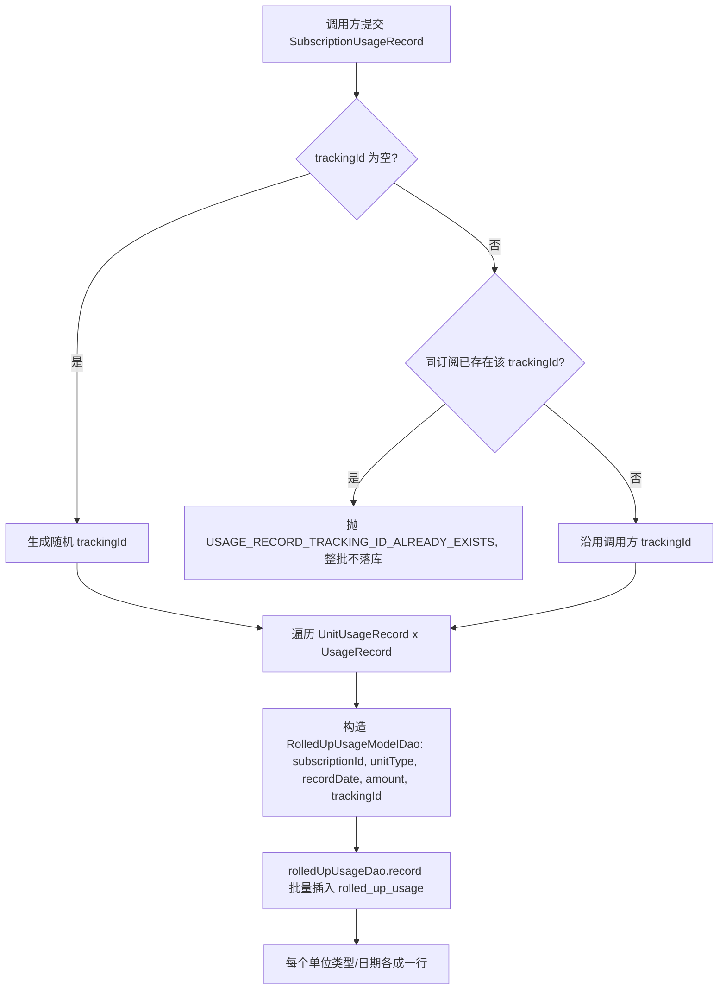
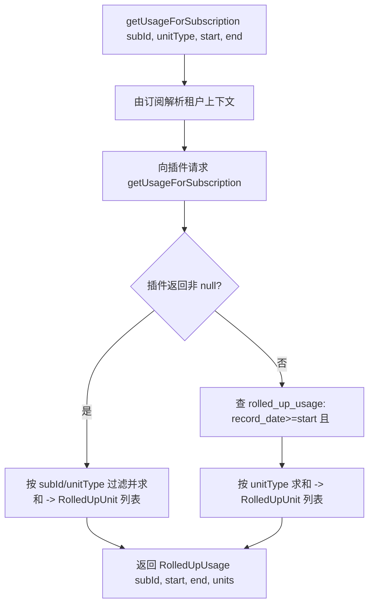
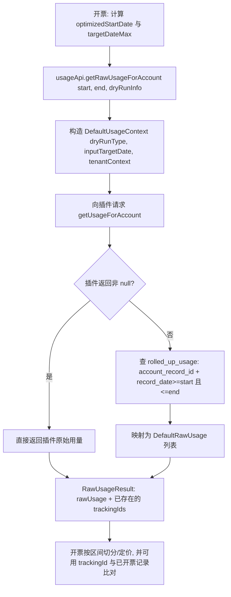
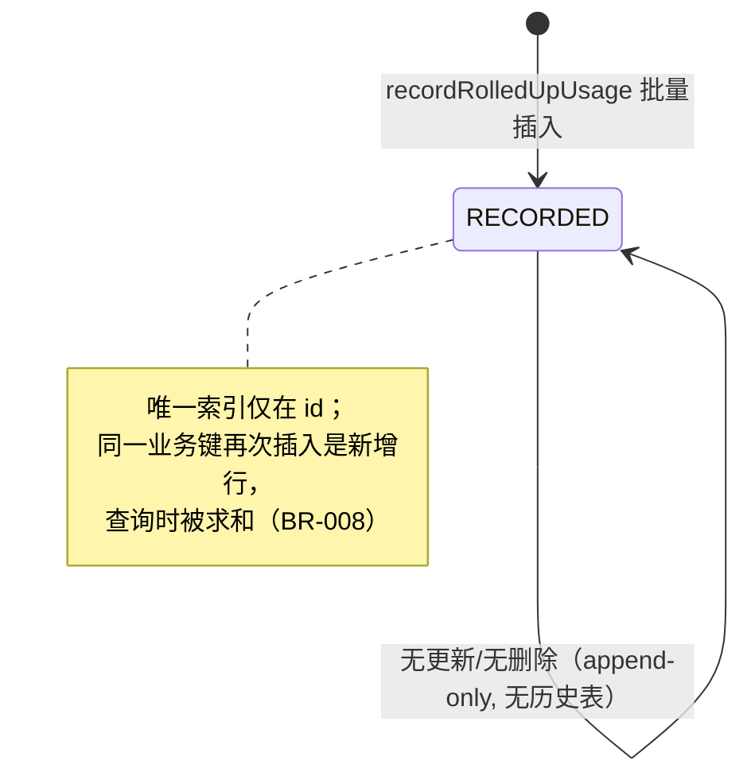

# usage 模块业务知识


### 模块概览

用量：用量提交/查询/汇总、单位类型、跟踪号幂等、租户隔离。

- **模块**: usage
- **源码根**: `usage/src/main/java/org/killbill/billing/usage/`
- **卡片总数**: 45（术语 10 / 实体 10 / 规则 18 / 流程 4 / 状态机 1 / 角色权限 2）
- **全局 ID 前缀**: TERM-/ENT-/BR-/WF-/SM-/ROLE-（全局唯一，跨模块共享编号空间）

> 说明：本文件为该模块的深度视图，卡片与全局类型文件（glossary.md / entities.md / rules.md / workflows.md / state-machines.md / roles-permissions.md）中的同一全局 ID 对应。跨模块合并的卡会同时出现在多个模块视图中。

## TERM-001 用量计费 (Usage)

- **类型**: 术语
- **同义词**: 用量计费, 按量计费, 使用量, 计量计费, usage, usage-based billing, metered usage, Usage, 用量, 计量, 用量数据, usage data, metering, quantity
- **模块**: catalog, usage
- **置信度**: 🟢 confirmed
- **溯源**: `catalog/src/main/java/org/killbill/billing/catalog/DefaultUsage.java:56-95`, `usage/src/main/java/org/killbill/billing/usage/api/user/DefaultUsageUserApi.java:71-92`

**含义**：Usage 是阶段内的用量计费段，包含 `billingMode`（IN_ADVANCE/IN_ARREAR）、`usageType`（CONSUMABLE/CAPACITY）、`tierBlockPolicy`、`billingPeriod`，以及 `limits`、`blocks`、`tiers`、可选的整段 `fixedPrice`/`recurringPrice`。

**含义**：Kill Bill 中「用量」是按订阅（subscription）记录的、带日期的计量值。每条用量记录绑定到一个订阅（`subscriptionId`）、一个单位类型（`unitType`）、一个记录时刻（`recordDate`）与一个数值（`amount`）。

**边界**：用量模块只负责「记录/存储/查询」用量原始数值；它不负责定价、限额校验或计费，也不区分消费型/容量型（见 BR-014）。定价与聚合发生在开票侧（invoice 模块），目录侧定义允许的单位类型（见 TERM-003、BR-012）。

## TERM-007 用量类型 (UsageType : CONSUMABLE / CAPACITY)

- **类型**: 术语
- **同义词**: 用量类型, 消耗型, 容量型, consumable, capacity, usage type, UsageType, CAPACITY, CONSUMABLE, 容量计费, 消耗量计费, 按量计费, 消费型用量, 用量累加, consumable usage, usage-based, metered, 容量型用量, 峰值用量, 取最大值, capacity usage, peak usage, max usage
- **模块**: catalog, invoice, usage
- **置信度**: 🟢 confirmed
- **溯源**: `catalog/src/main/java/org/killbill/billing/catalog/DefaultUsage.java:212-229`, `invoice/src/main/java/org/killbill/billing/invoice/usage/ContiguousIntervalUsageInArrear.java:142`, `invoice/src/main/java/org/killbill/billing/invoice/usage/ContiguousIntervalUsageInArrear.java:539-548`, `invoice/src/main/java/org/killbill/billing/invoice/usage/UsageUtils.java:34-67`, `invoice/src/main/java/org/killbill/billing/invoice/usage/UsageUtils.java:69-87`

**含义**：`UsageType.CONSUMABLE` 表示按使用量累加计费（用多少算多少）；`UsageType.CAPACITY` 表示按容量/上限计费。校验规则要求 IN_ADVANCE+CAPACITY 必须定义 limits、IN_ADVANCE+CONSUMABLE 必须定义 blocks。

**说明**：用量（usage）分两类：
- `CAPACITY`（容量型）：同一计费周期内取**峰值**（最大值）计费；
- `CONSUMABLE`（消耗型）：同一计费周期内**累加**所有用量计费。

**含义**：目录 `UsageType.CONSUMABLE`，表示「按消耗计量累加」的用量。开票侧对同一区间内多条记录**求和**（`currentAmount.add(newAmount)`）。

**单位来源**：CONSUMABLE 的单位类型来自目录中各 tier 的 `TieredBlock.getUnit().getName()`（见 BR-012）。

**用量侧视角**：用量模块存储时**不区分** CONSUMABLE/CAPACITY（同一张表、同一套字段）；类型差异只在目录校验与开票聚合时体现（见 BR-014）。

**含义**：目录 `UsageType.CAPACITY`，表示「按容量/峰值计量」的用量。开票侧对同一区间内多条记录**取最大值**（`currentAmount.max(newAmount)`），即按区间内观测到的峰值计费。

**单位来源**：CAPACITY 的单位类型来自目录中各 tier 的 `Limit.getUnit().getName()`（见 BR-012），且 IN_ADVANCE 的 CAPACITY 段必须定义 limits（见 BR-013）。

## TERM-011 计费模式 (BillingMode)

- **类型**: 术语
- **同义词**: 计费模式, 预付, 后付, 先付, 后付费, billing mode, BillingMode, IN_ADVANCE, IN_ARREAR, 先付费, 欠费开票, 用后付费, 期末计费, in arrear, postpaid, bill in arrears, 预付开票, 预付费, 期初计费, in advance, prepaid, bill in advance
- **模块**: catalog, invoice, usage
- **置信度**: 🟢 confirmed
- **溯源**: `catalog/src/main/java/org/killbill/billing/catalog/DefaultUsage.java:65-66`, `catalog/src/main/java/org/killbill/billing/catalog/DefaultPlan.java:79-81`, `invoice/src/main/java/org/killbill/billing/invoice/generator/FixedAndRecurringInvoiceItemGenerator.java:302-321`, `invoice/src/main/java/org/killbill/billing/invoice/optimizer/InvoiceOptimizerExp.java:147-148`, `catalog/src/main/java/org/killbill/billing/catalog/DefaultUsage.java:212-229`, `invoice/src/main/java/org/killbill/billing/invoice/usage/UsageUtils.java:34-74`

**含义**：`BillingMode` 取值 `IN_ADVANCE`（先付/预付）与 `IN_ARREAR`（后付/后付费）。可用量计费（usage）维度与计划级别 recurring 维度分别声明；计划若缺省则继承目录级 `recurringBillingMode`。

**说明**：`BillingMode` 分两种：
- `IN_ADVANCE`（预付/先付费）：在计费周期**开始时**收费；
- `IN_ARREAR`（后付/后付费）：在计费周期**结束后**收费。

**含义**：`BillingMode.IN_ARREAR`。用量在期末结算，目录中该 usage 段必须有 tiers。开票侧对 IN_ARREAR 的用量按 CONSUMABLE/CAPACITY 分别处理。

**用途侧关联**：用量记录本身就是「先发生、后结算」的数据；`getRawUsageForAccount` 的注释明确这是**唯一用于开票的查询**（见 BR-005）。

**含义**：`BillingMode.IN_ADVANCE`。目录校验要求：IN_ADVANCE + CAPACITY 必须定义 `limits`；IN_ADVANCE + CONSUMABLE 必须定义 `blocks`。用量模块不参与该模式判定，但写入的 `unitType` 必须与目录对应的 limit/block 单位名称匹配。

## TERM-051 用量记录（单日计量）

- **类型**: 术语
- **同义词**: 用量记录, 每日用量, 用量条目, usage record, usage entry, daily amount, metered record, record_date
- **模块**: usage
- **置信度**: 🟢 confirmed
- **溯源**: `usage/src/main/java/org/killbill/billing/usage/api/user/DefaultUsageUserApi.java:85-90`, `usage/src/main/resources/org/killbill/billing/usage/dao/RolledUpUsageSqlDao.sql.stg:6-24`

**含义**：一次「记录时刻 + 数值」的二元组即一条用量记录（`UsageRecord` = `recordDate` + `amount`）。提交时按订阅 + 单位类型分组，展开为多行落库。

**落库字段**：`subscription_id`、`unit_type`、`record_date`（datetime，精确到时刻）、`amount`（decimal(18,9)）、`tracking_id`，外加框架字段 `created_by`/`created_date`/`account_record_id`/`tenant_record_id`。

## TERM-052 单位类型（Unit Type）

- **类型**: 术语
- **同义词**: 单位类型, 计量单位, 用量单位, unit type, unitType, unit, meter, usage unit
- **模块**: usage
- **置信度**: 🟢 confirmed
- **溯源**: `usage/src/main/resources/org/killbill/billing/usage/dao/RolledUpUsageSqlDao.sql.stg:6-24`, `usage/src/main/java/org/killbill/billing/usage/api/user/DefaultRolledUpUnit.java:24-42`, `catalog/src/main/java/org/killbill/billing/catalog/DefaultUsage.java:56-98`

**含义**：`unitType` 是一个自由字符串（DB 列 `unit_type varchar(255) NOT NULL`），用于在同一订阅下区分多种计量维度（如 "GB"、"minutes"、"requests"）。用量模块只把它当作分组键，不做白名单校验。

**与目录的关联**：目录（catalog）的 Usage 定义里，单位通过 `TieredBlock.getUnit().getName()` / `Limit.getUnit().getName()` 声明（见 BR-012）。也就是说：**用量侧写入的 `unitType` 字符串必须与目录中该 usage 段声明的 unit 名称一致，开票侧才能对上价**；用量模块本身不校验该一致性（不一致时的处理见 BR-015）。

## TERM-053 汇总用量（Rolled-Up Usage）

- **类型**: 术语
- **同义词**: 汇总用量, 聚合用量, 累计用量, rolled up usage, rolledUpUsage, aggregate usage, rolled up unit
- **模块**: usage
- **置信度**: 🟢 confirmed
- **溯源**: `usage/src/main/java/org/killbill/billing/usage/api/user/DefaultRolledUpUsage.java:34-59`, `usage/src/main/java/org/killbill/billing/usage/api/user/DefaultUsageUserApi.java:158-168`

**含义**：查询用量时的返回视图。`RolledUpUsage` = 订阅 + 区间 `[start, end)` + 若干 `RolledUpUnit`（每个 = `unitType` + 该区间内累计 `amount`）。它不是一张表，而是把区间内的多行原始用量按 `unitType` 相加后的结果。

**要点**：同一 `unitType` 的多行原始记录会被合并成一个 `RolledUpUnit`（求和），见 BR-006。

## TERM-054 原始用量（Raw Usage）

- **类型**: 术语
- **同义词**: 原始用量, 逐条用量, 明细用量, raw usage, rawUsage, raw usage record, 用量明细
- **模块**: usage
- **置信度**: 🟢 confirmed
- **溯源**: `usage/src/main/java/org/killbill/billing/usage/api/svcs/DefaultRawUsage.java:26-65`, `usage/src/main/java/org/killbill/billing/usage/api/svcs/DefaultInternalUserApi.java:63-84`

**含义**：未聚合的逐条用量记录，供开票侧使用。`RawUsageRecord` 暴露 `subscriptionId`、`date`（即 `recordDate`）、`unitType`、`amount`、`trackingId`。它与落库行一一对应，不做按单位类型合并。

**用途**：开票引擎只需要原始明细（它自己做区间切分和定价），因此内部 API `getRawUsageForAccount` 返回 `RawUsageRecord` 而非 `RolledUpUsage`（见 WF-004）。

## TERM-055 跟踪号（Tracking Id）

- **类型**: 术语
- **同义词**: 跟踪号, 追踪号, 幂等号, 去重号, tracking id, trackingId, idempotency key, dedup key
- **模块**: usage
- **置信度**: 🟢 confirmed
- **溯源**: `usage/src/main/java/org/killbill/billing/usage/api/user/DefaultUsageUserApi.java:74-82`, `usage/src/test/java/org/killbill/billing/usage/dao/TestDefaultRolledUpUsageDao.java:171-196`

**含义**：调用方提交用量时可带的字符串（DB 列 `tracking_id varchar(128) NOT NULL`），用于**防止同一批用量被重复提交**。

**语义**：同一订阅下若已存在相同 `trackingId` 的行，再次提交会被拒绝并抛 `USAGE_RECORD_TRACKING_ID_ALREADY_EXISTS`（见 BR-001）。未提供时系统自动生成一个随机 UUID（见 BR-002）。

## TERM-056 用量插件（Usage Plugin）

- **类型**: 术语
- **同义词**: 用量插件, 用量提供者, 自定义用量源, usage plugin, usage provider, UsagePluginApi, OSGI usage plugin
- **模块**: usage
- **置信度**: 🟢 confirmed
- **溯源**: `usage/src/main/java/org/killbill/billing/usage/api/BaseUserApi.java:55-94`, `usage/src/main/java/org/killbill/billing/usage/glue/DefaultUsageProviderPluginRegistry.java:30-66`

**含义**：通过 OSGI 注册的 `UsagePluginApi` 实现，可作为用量的外部数据源。用量模块在查询时**优先**向插件要数据；插件返回非 null 结果（即使为空列表）时，就不再查自身 `rolled_up_usage` 表（见 BR-009）。

**注册**：Glue 层用 `OSGIServiceRegistration<UsagePluginApi>` + `DefaultUsageProviderPluginRegistry` 以插件注册名索引（见 ENT-009）。

## TERM-057 用量上下文（UsageContext）

- **类型**: 术语
- **同义词**: 用量上下文, 用量查询上下文, usage context, UsageContext, tenant context
- **模块**: usage
- **置信度**: 🟢 confirmed
- **溯源**: `usage/src/main/java/org/killbill/billing/usage/api/DefaultUsageContext.java:34-58`

**含义**：传给插件的上下文对象，暴露 `dryRunType`（试算类型）、`inputTargetDate`（目标日期）与租户上下文（`accountId`、`tenantId`）。查询用量时构造为 `new DefaultUsageContext(null, null, tenantContext)`（普通查询）或携带 dry-run 信息（开票 dry-run）。

**约束**：`BaseUserApi.getUsageFromPlugin` 首先断言 `usageContext.getAccountId()` 非空（见 `usage/src/main/java/org/killbill/billing/usage/api/BaseUserApi.java:63-65`）。

## ENT-037 用量记录实体 / rolled_up_usage 表

- **类型**: 业务实体
- **同义词**: 用量记录实体, 用量表, 用量记录表, rolled_up_usage, RolledUpUsageModelDao, usage table, usage record entity
- **模块**: usage
- **置信度**: 🟢 confirmed
- **溯源**: `usage/src/main/java/org/killbill/billing/usage/dao/RolledUpUsageModelDao.java:30-51`, `usage/src/main/resources/org/killbill/billing/usage/ddl.sql:3-22`

**字段**：
- `subscriptionId`（订阅 ID，逻辑外键 → subscriptions）
- `unitType`（单位类型，字符串）
- `recordDate`（记录时刻，`datetime NOT NULL`，精确到时刻，非仅日期）
- `amount`（数值，`decimal(18,9) NOT NULL`）
- `trackingId`（跟踪号，`varchar(128) NOT NULL`）
- 框架字段：`id`(uuid, unique)、`record_id`(serial PK)、`created_by`、`created_date`、`account_record_id`、`tenant_record_id`

**关键约束**：
- 唯一索引仅在 `id` 上（`rolled_up_usage_id`），**没有** `(subscription_id, unit_type, record_date)` 之类的业务键唯一约束（见 BR-008）。
- 索引：`subscription_id`、`(tenant_record_id, account_record_id)`、`account_record_id`、`(tracking_id, subscription_id, tenant_record_id)`。
- 无历史/审计表：`getHistoryTableName()` 返回 `null`（见 SM-001）。

## ENT-038 汇总用量视图（RolledUpUsage）

- **类型**: 业务实体
- **同义词**: 汇总用量, 用量汇总结果, rolled up usage, RolledUpUsage, usage view, usage response
- **模块**: usage
- **置信度**: 🟢 confirmed
- **溯源**: `usage/src/main/java/org/killbill/billing/usage/api/user/DefaultRolledUpUsage.java:27-59`

**结构**：`subscriptionId` + `start` + `end` + `List<RolledUpUnit> rolledUpUnits`。

**来源**：由 `getUsageForSubscription` / `getAllUsageForSubscription` 构造；数据来自插件（`getRolledUpUnitsForRawPluginUsage`）或 DB（`getRolledUpUnits`）。

**对外序列化**：REST 返回 `RolledUpUsageJson`（`subscriptionId`/`startDate`/`endDate`/`rolledUpUnits[]`），见 `jaxrs/src/main/java/org/killbill/billing/jaxrs/json/RolledUpUsageJson.java:33-95`。

## ENT-039 汇总单位（RolledUpUnit）

- **类型**: 业务实体
- **同义词**: 汇总单位, 单位用量, rolled up unit, RolledUpUnit, unit amount, 单位汇总
- **模块**: usage
- **置信度**: 🟢 confirmed
- **溯源**: `usage/src/main/java/org/killbill/billing/usage/api/user/DefaultRolledUpUnit.java:24-42`

**结构**：`unitType` + `amount`（该单位类型在查询区间内的累计值）。

**语义**：一个 `RolledUpUsage` 可含多个 `RolledUpUnit`（不同单位类型各一）；同一单位类型只出现一次（聚合结果）。

## ENT-040 订阅用量提交记录（SubscriptionUsageRecord）

- **类型**: 业务实体
- **同义词**: 订阅用量提交, 用量提交对象, subscription usage record, SubscriptionUsageRecord, usage submission, 上报用量
- **模块**: usage
- **置信度**: 🟢 confirmed
- **溯源**: `jaxrs/src/main/java/org/killbill/billing/jaxrs/json/SubscriptionUsageRecordJson.java:36-126`, `usage/src/main/java/org/killbill/billing/usage/api/user/DefaultUsageUserApi.java:71-92`

**结构**（提交用）：
- `subscriptionId`（必填）
- `trackingId`（可选；批量去重键）
- `List<UnitUsageRecord>`（至少一条）

**含义**：`recordRolledUpUsage` 的入参。一个提交批次由「一个订阅 + 多个单位类型 + 每个单位类型下多条带日期数值」组成。REST 层对应 `SubscriptionUsageRecordJson`（嵌套 `UnitUsageRecordJson` → `UsageRecordJson{recordDate, amount}`）。

## ENT-041 单位用量记录（UnitUsageRecord）

- **类型**: 业务实体
- **同义词**: 单位用量, 单位计量记录, unit usage record, UnitUsageRecord, unit type record
- **模块**: usage
- **置信度**: 🟢 confirmed
- **溯源**: `jaxrs/src/main/java/org/killbill/billing/jaxrs/json/SubscriptionUsageRecordJson.java:66-93`

**结构**：`unitType`（单位类型）+ `List<UsageRecord> dailyAmount`（该单位类型下多条按日期的用量）。提交时其 `unitType` 会写入 `rolled_up_usage.unit_type`。

## ENT-042 用量记录值（UsageRecord）

- **类型**: 业务实体
- **同义词**: 用量记录值, 用量条目, usage record, UsageRecord, recordDate, amount, 计量值
- **模块**: usage
- **置信度**: 🟢 confirmed
- **溯源**: `jaxrs/src/main/java/org/killbill/billing/jaxrs/json/SubscriptionUsageRecordJson.java:95-119`, `usage/src/main/java/org/killbill/billing/usage/api/user/DefaultUsageUserApi.java:87-89`

**结构**：`recordDate`（`DateTime`）+ `amount`（`BigDecimal`）。前者落库为 `record_date`，后者为 `amount`。

## ENT-043 原始用量记录（RawUsageRecord / DefaultRawUsage）

- **类型**: 业务实体
- **同义词**: 原始用量, 原始用量记录, raw usage, RawUsageRecord, DefaultRawUsage, raw usage detail
- **模块**: usage
- **置信度**: 🟢 confirmed
- **溯源**: `usage/src/main/java/org/killbill/billing/usage/api/svcs/DefaultRawUsage.java:26-65`, `usage/src/main/java/org/killbill/billing/usage/api/svcs/DefaultInternalUserApi.java:80-83`

**结构**：`subscriptionId`、`date`、`unitType`、`amount`、`trackingId`。

**来源**：DB 行 `RolledUpUsageModelDao` → `DefaultRawUsage` 映射（`getRawUsageForAccount`），或直接来自插件 `UsagePluginApi.getUsageForAccount(...)`。

**消费方**：开票侧 `RawUsageOptimizer`（`invoice/.../usage/RawUsageOptimizer.java:85-98`）。

## ENT-044 用量 DAO（RolledUpUsageDao / RolledUpUsageSqlDao）

- **类型**: 业务实体
- **同义词**: 用量DAO, 用量持久化, rolled up usage dao, RolledUpUsageDao, RolledUpUsageSqlDao, usage repository
- **模块**: usage
- **置信度**: 🟢 confirmed
- **溯源**: `usage/src/main/java/org/killbill/billing/usage/dao/RolledUpUsageDao.java:26-37`, `usage/src/main/java/org/killbill/billing/usage/dao/DefaultRolledUpUsageDao.java:36-69`, `usage/src/main/java/org/killbill/billing/usage/dao/RolledUpUsageSqlDao.java:33-57`

**能力**：
- `record(usages, context)` — 批量插入
- `recordsWithTrackingIdExist(subscriptionId, trackingId, context)` — 去重探测
- `getUsageForSubscription(...)` — 单单位类型区间查询
- `getAllUsageForSubscription(...)` — 全单位类型区间查询
- `getRawUsageForAccount(...)` — 按账户查原始用量

**路由**：`DefaultRolledUpUsageDao` 使用 `DBRouter`，读操作走只读库（`onDemand(true)`），写操作 `onDemand(false)`。SQL 由 `RolledUpUsageSqlDao.sql.stg` 字符串模板生成，表名 `rolled_up_usage`。

## ENT-045 用量插件注册表（Usage Provider Registry）

- **类型**: 业务实体
- **同义词**: 用量插件注册表, 用量提供者注册, usage plugin registry, DefaultUsageProviderPluginRegistry, usage provider, OSGI 用量插件
- **模块**: usage
- **置信度**: 🟢 confirmed
- **溯源**: `usage/src/main/java/org/killbill/billing/usage/glue/DefaultUsageProviderPluginRegistry.java:30-66`, `usage/src/main/java/org/killbill/billing/usage/glue/UsageModule.java:53-64`

**结构**：`ConcurrentHashMap<String, UsagePluginApi> pluginsByName`，按插件注册名索引。提供 `registerService` / `unregisterService` / `getServiceForName` / `getAllServices` / `getServiceType`。

**装配**：`UsageModule.installUsagePluginApi()` 把 `OSGIServiceRegistration<UsagePluginApi>` 绑定到 `DefaultUsageProviderPluginRegistryProvider`（单例）。

## ENT-046 内部用量 API（InternalUserApi）

- **类型**: 业务实体
- **同义词**: 内部用量接口, 开票用量接口, internal user api, InternalUserApi, getRawUsageForAccount, 内部API
- **模块**: usage
- **置信度**: 🟢 confirmed
- **溯源**: `api/src/main/java/org/killbill/billing/usage/InternalUserApi.java:28-31`, `usage/src/main/java/org/killbill/billing/usage/api/svcs/DefaultInternalUserApi.java:63-84`

**方法**：`List<RawUsageRecord> getRawUsageForAccount(startDate, endDate, dryRunInfo, pluginProperties, tenantContext)`。

**用途**：专供开票模块按账户拉取区间内所有订阅的原始用量（含 dry-run）。它是用量模块向外暴露的「内部」读接口，与面向用户的 `UsageUserApi` 并列（见 WF-004）。

## BR-010 用量各模式的必填结构校验

- **类型**: 业务规则
- **同义词**: 用量校验, 预付容量, 预付消耗, 后付阶梯, usage validation, IN_ADVANCE, IN_ARREAR, limits, blocks, tiers, 用量段校验, 目录校验, usage section validation, in advance limits, in arrears tiers
- **模块**: catalog, usage
- **置信度**: 🟢 confirmed
- **溯源**: `catalog/src/main/java/org/killbill/billing/catalog/DefaultUsage.java:212-229`, `catalog/src/main/java/org/killbill/billing/catalog/DefaultTier.java:147-159`

**规则**：
- `IN_ADVANCE + CAPACITY`：必须定义 `limits`，否则报错。
- `IN_ADVANCE + CONSUMABLE`：必须定义 `blocks`，否则报错。
- `IN_ARREAR`：必须定义 `tiers`，否则报错。
- 在 Tier 级别：`IN_ARREAR + CAPACITY` 需 limits，`IN_ARREAR + CONSUMABLE` 需 blocks（校验信息挂在 DefaultUsage 上）。

**规则**（目录加载时校验，决定用量可被如何计费）：
- `IN_ADVANCE` + `CAPACITY` 且 `limits.length == 0` → 报错「needs to define some limits」。
- `IN_ADVANCE` + `CONSUMABLE` 且 `blocks.length == 0` → 报错「needs to define some blocks」。
- `IN_ARREAR` 且 `tiers.length == 0` → 报错「needs to define some tiers」。

**关联**：这些是目录对「用量类型 + 计费模式」组合的合法性约束，间接规定了对应用量记录应携带哪些单位类型。

## BR-036 用量重复计费防护（tracking id 去重 + 已开票区间跳过）

- **类型**: 业务规则
- **同义词**: 用量去重, 防止重复计费, usage dedup, tracking id, 已开票跳过, double billing usage, 跟踪号去重, 幂等, 重复提交拦截, tracking id duplicate, idempotency, 重复用量
- **模块**: invoice, usage
- **置信度**: 🟢 confirmed
- **溯源**: `invoice/src/main/java/org/killbill/billing/invoice/usage/ContiguousIntervalUsageInArrear.java:290-307`, `invoice/src/main/java/org/killbill/billing/invoice/usage/ContiguousIntervalUsageInArrear.java:333-356`, `usage/src/main/java/org/killbill/billing/usage/api/user/DefaultUsageUserApi.java:74-82`, `usage/src/main/java/org/killbill/billing/usage/dao/RolledUpUsageSqlDao.java:36-39`

**规则**：
1. 每条原始用量带 tracking id；只有**不在既有 tracking id 集合**中的用量才会被计费（新增用量）。
2. 若某个用量区间已被既有 `USAGE` 发票项覆盖（同 usage name 且 start/end 落入既有项内），则**跳过**该区间，避免重复计费（尤其阻断/重跑场景）。

**规则**：调用方传入非空 `trackingId` 时，先查该订阅下是否已存在相同 `trackingId` 的行（`recordsWithTrackingIdExist`，SQL `select 1 ... where subscription_id=? and tracking_id=? ... limit 1`）。若已存在 → 抛 `UsageApiException(ErrorCode.USAGE_RECORD_TRACKING_ID_ALREADY_EXISTS, trackingId)`，整批用量不落库。

**范围**：去重键是 `(subscription_id, tracking_id, tenant_record_id)`（索引 `rolled_up_usage_tracking_id_subscription_id_tenant_record_id`）。因此同一 trackingId 在**不同订阅**下互不影响。

## BR-047 用量聚合规则（CAPACITY 取峰值 / CONSUMABLE 累加）

- **类型**: 业务规则
- **同义词**: 用量聚合, 峰值计费, 累加计费, usage aggregation, capacity max, consumable sum, 用量合并, 容量取最大, 消费求和
- **模块**: invoice, usage
- **置信度**: 🟢 confirmed
- **溯源**: `invoice/src/main/java/org/killbill/billing/invoice/usage/ContiguousIntervalUsageInArrear.java:539-548`

**规则**：把同一区间内的多条原始用量合并为一个金额时：
- 若 usage 类型为 `CAPACITY` → 取 `max(当前值, 新值)`（保留峰值）；
- 若为 `CONSUMABLE` → 取 `当前值 + 新值`（累加）。

**规则**（开票侧聚合，用量数据的使用方语义）：对同一单位类型在一段计费区间内的多次观测值 `computeUpdatedAmount(current, new)`：
- `UsageType.CAPACITY` → 返回 `max(current, new)`（区间峰值）。
- 否则（`UsageType.CONSUMABLE`）→ 返回 `current.add(new)`（多点累加）。
- 任一侧为 `null` 视为 `ZERO` 再参与运算。

**用量侧关联**：用量模块本身按 BR-006 对查询区间求和；CAPACITY 的「取最大」发生在开票消费这些原始/汇总数据时（`SubscriptionUsageInArrear` 按 usageType 选择不同 interval 实现，见 `invoice/.../SubscriptionUsageInArrear.java:188-193`）。

## BR-052 目录中未定义的用量处理（可挂起账户）

- **类型**: 业务规则
- **同义词**: 未知用量挂起, park account, 挂起账户, parkAccountsWithUnknownUsage, 账户暂停, 未知用量单位, unknown usage unit, unit type not defined, park account usage, 未知用量, 未定义用量, park账户, unknown usage, park accounts, usage not in catalog
- **模块**: invoice, usage
- **置信度**: 🟢 confirmed
- **溯源**: `util/src/main/java/org/killbill/billing/util/config/definition/InvoiceConfig.java:205-213`, `invoice/src/main/java/org/killbill/billing/invoice/usage/ContiguousIntervalUsageInArrear.java:485-505`

**规则**：配置项 `org.killbill.invoice.parkAccountsWithUnknownUsage` 默认 `false`。设为 `true` 时，若记录了用量数据但该用量在目录（catalog）中未定义，则将该账户挂起（park）。

**规则**：当上报的用量单位类型（unitType）**未在任何 billing event 的目录中定义**时：
- 若 `org.killbill.invoice.parkAccountsWithUnknownUsage` = `true` → 抛 `InvoiceApiException`（ILLEGAL INVOICING STATE），导致账户被挂起；
- 否则 → 记录告警并**忽略**该单位类型，同时移除其关联的 tracking id。

**规则**：系统属性 `org.killbill.invoice.parkAccountsWithUnknownUsage`（默认 `false`）控制：当账户记录了目录中未定义的用量数据时，是否将该账户 park（暂停自动开票，直到人工介入）。

**含义**：这是用量数据与目录一致性问题（BR-012）的兜底策略，由开票侧读取，用量模块不读取该配置。

## BR-164 未提供跟踪号时自动生成

- **类型**: 业务规则
- **同义词**: 自动跟踪号, 随机跟踪号, 默认trackingId, auto tracking id, generated tracking id, random tracking id
- **模块**: usage
- **置信度**: 🟢 confirmed
- **溯源**: `usage/src/main/java/org/killbill/billing/usage/api/user/DefaultUsageUserApi.java:74-82`

**规则**：若 `record.getTrackingId()` 为 `null` 或空字符串，则本次提交生成一个随机 UUID 作为 `trackingId`。此时该批次不具备调用方可控的幂等键（每次提交都会是新值，无法借此拦截重复）。

## BR-165 同一批提交共用同一跟踪号

- **类型**: 业务规则
- **同义词**: 批量共用跟踪号, 同批trackingId, batch tracking id, shared tracking id, 同批次幂等
- **模块**: usage
- **置信度**: 🟢 confirmed
- **溯源**: `usage/src/main/java/org/killbill/billing/usage/api/user/DefaultUsageUserApi.java:85-91`

**规则**：`recordRolledUpUsage` 对入参中所有 `UnitUsageRecord` × 所有 `UsageRecord` 展开出的每一行，都写入**同一个** `trackingIds` 变量值（要么是调用方给的，要么是生成的随机值）。因此去重探测的粒度是「整批」，只要有任意一行已存在该 trackingId，整批都会被拒。

## BR-166 订阅用量查询：半开区间 [start, end) + 单位类型过滤

- **类型**: 业务规则
- **同义词**: 用量查询时间范围, 半开区间, 用量区间, usage query range, start end date, record_date filter
- **模块**: usage
- **置信度**: 🟢 confirmed
- **溯源**: `usage/src/main/resources/org/killbill/billing/usage/dao/RolledUpUsageSqlDao.sql.stg:37-48`, `usage/src/main/java/org/killbill/billing/usage/dao/DefaultRolledUpUsageDao.java:55-58`

**规则**：`getUsageForSubscription` 的 SQL 条件为 `record_date >= :startDate AND record_date < :endDate AND unit_type = :unitType` 且租户匹配。即左闭右开；结束时刻当刻的用量不计入。

**注意**：`unitType` 是**必须精确匹配**的过滤条件（非空时），无法用它做模糊/多值查询。查询单一单位类型用此方法。

## BR-167 账户原始用量查询：闭区间 [start, end]（开票唯一查询）

- **类型**: 业务规则
- **同义词**: 账户用量查询, 开票用量查询, 闭区间, 含退订日, raw usage for account, account usage, invoicing usage query
- **模块**: usage
- **置信度**: 🟢 confirmed
- **溯源**: `usage/src/main/resources/org/killbill/billing/usage/dao/RolledUpUsageSqlDao.sql.stg:62-73`, `usage/src/main/java/org/killbill/billing/usage/api/svcs/DefaultInternalUserApi.java:63-84`

**规则**：`getRawUsageForAccount` 的 SQL 条件为 `account_record_id = :accountRecordId AND record_date >= :startDate AND record_date <= :endDate`（**右闭**），且租户匹配。模板注释明确说明：「这是唯一用于开票的查询，因此使用 `<= :endDate` 以便处理退订当日的用量数据」。

**含义**：订阅维度的查询用 `< endDate`，而开票维度的账户查询用 `<= endDate`，两者边界语义不同，不能混用。

**范围**：该方法按 `account_record_id` 跨该账户下所有订阅查询，返回全部单位类型的明细（无 `unit_type` 过滤）。

## BR-168 用量按单位类型汇总求和

- **类型**: 业务规则
- **同义词**: 用量汇总, 求和, 聚合, rollup sum, aggregate usage, sum by unit type
- **模块**: usage
- **置信度**: 🟢 confirmed
- **溯源**: `usage/src/main/java/org/killbill/billing/usage/api/user/DefaultUsageUserApi.java:158-168`, `usage/src/main/java/org/killbill/billing/usage/api/user/DefaultUsageUserApi.java:136-156`

**规则**：无论数据来自 DB（`getRolledUpUnits`）还是插件（`getRolledUpUnitsForRawPluginUsage`），都用一个 `Map<String, BigDecimal>` 以 `unitType` 为键累加 `amount`（`currentAmount.add(cur.getAmount())`），最后映射为 `RolledUpUnit` 列表。

**含义**：查询结果是**同一区间内同单位类型的数值之和**；重复日期、多行记录都会被累加，不会保留明细。

**插件分支的额外过滤**：插件返回的原始记录会先按 `subscriptionId` 过滤（不等则跳过），再在指定 `unitType` 时按单位类型过滤，之后才求和。

## BR-169 查询结果排序：按 record_id 升序（提交顺序）

- **类型**: 业务规则
- **同义词**: 用量排序, 查询顺序, 提交顺序, order by record_id, usage ordering, insertion order
- **模块**: usage
- **置信度**: 🟢 confirmed
- **溯源**: `usage/src/main/resources/org/killbill/billing/usage/dao/RolledUpUsageSqlDao.sql.stg:46-47`, `util/src/main/resources/org/killbill/billing/util/entity/dao/EntitySqlDao.sql.stg:31-33`

**规则**：所有用量查询都带 `<defaultOrderBy("")>`，展开为 `order by record_id ASC`。`record_id` 是自增 serial 主键，故返回顺序即**落库（提交）先后顺序**，而非按 `record_date` 排序。

**注意**：不要假设结果按日期升序；如需按日期处理，调用方须自行排序（开票侧 `RawUsageOptimizer` 即自行按 endDate 排序）。

## BR-170 同一 (订阅, 单位类型, 日期) 重复提交会累加，不覆盖

- **类型**: 业务规则
- **同义词**: 重复用量, 用量覆盖, 用量累加, duplicate usage, overwrite, additive, 重复记录
- **模块**: usage
- **置信度**: 🟢 confirmed
- **溯源**: `usage/src/main/resources/org/killbill/billing/usage/ddl.sql:18`, `usage/src/main/java/org/killbill/billing/usage/api/user/DefaultUsageUserApi.java:158-168`, `usage/src/test/java/org/killbill/billing/usage/dao/TestDefaultRolledUpUsageDao.java:139-169`

**规则**：`rolled_up_usage` 唯一的唯一索引建在 `id`（随机 UUID）上，**没有** `(subscription_id, unit_type, record_date)` 的业务键唯一约束。因此：
- 用不同 `trackingId` 对同一订阅、同一单位类型、同一日期再次提交，会新增行，查询时被求和 → **数值翻倍（累加而非覆盖）**。
- 没有任何「更新/覆盖」用量的 API；用量是**只追加（append-only）**的（DAO 无 update 方法，实体 `getHistoryTableName()` 为 `null`）。
- 测试 `testDuplicateRecords` 展示的是「把同一批 `RolledUpUsageModelDao`（含固定 `id`）插入两次」会因唯一索引 `rolled_up_usage_id` 冲突抛 `UnableToExecuteStatementException`——即只有**相同记录 ID**才会被拒。

**业务结论**：去重的唯一可靠手段是 `trackingId`（见 BR-001）；不要依赖系统对「同日期重复上报」自动去重。

## BR-171 插件优先：插件返回非 null（含空列表）即不查库

- **类型**: 业务规则
- **同义词**: 插件优先, 数据源优先级, 用量来源, plugin precedence, usage source priority, fallback to db
- **模块**: usage
- **置信度**: 🟢 confirmed
- **溯源**: `usage/src/main/java/org/killbill/billing/usage/api/BaseUserApi.java:55-94`

**规则**：查询用量时按注册顺序遍历所有 `UsagePluginApi`：
- 若没有任何插件注册（`getAllServices().isEmpty()`）→ 返回 `null` → 用量模块回退查自身 `rolled_up_usage` 表。
- 对每个插件调用 `getUsageForSubscription` / `getUsageForAccount`；**第一个返回非 null 的插件结果胜出**，直接返回（可能是空列表），**不再查库**。
- 所有注册插件都返回 `null` → 回退查库。

**含义**：插件一旦接管某租户/账户的用量数据，本地的 `rolled_up_usage` 表对该查询就完全不可见；插件返回空列表也代表「确实没有用量」，而非触发回退。

## BR-172 插件越界数据仅告警，不拒绝

- **类型**: 业务规则
- **同义词**: 插件数据校验, 越界告警, plugin out of range, usage warning, date range warning
- **模块**: usage
- **置信度**: 🟢 confirmed
- **溯源**: `usage/src/main/java/org/killbill/billing/usage/api/BaseUserApi.java:77-90`

**规则**：对插件返回的每条 `RawUsageRecord`，若其 `date` 落在请求区间之外（`date < startDate || date >= endDate`），仅记录 `warn` 日志（"Usage plugin returned usage data with date {}, not in the specified range"），**仍然原样返回给调用方**，不做过滤或拒绝。

**含义**：插件数据可能包含区间外的点，过滤责任在下游（开票侧按自己的区间切分）。这是 `>= endDate` 的右开判断，与 BR-004 的半开区间一致。

## BR-173 单位类型来源：CAPACITY→limit，CONSUMABLE→tier block

- **类型**: 业务规则
- **同义词**: 单位类型映射, 目录单位, capacity limit unit, consumable tier unit, unit type catalog link
- **模块**: usage
- **置信度**: 🟢 confirmed
- **溯源**: `invoice/src/main/java/org/killbill/billing/invoice/usage/UsageUtils.java:34-87`

**规则**（目录→开票的映射，用量 `unitType` 必须与之对齐）：
- CONSUMABLE IN_ARREAR：单位类型集合 = 各 tier 的 `TieredBlock.getUnit().getName()`；取价时对每个 tier 找匹配 `unitType` 的 block，且要求每个 tier 都有该 unit 的定义（否则 `Preconditions.checkState` 失败）。
- CAPACITY IN_ARREAR：单位类型集合 = 各 tier 的 `Limit.getUnit().getName()`。

**对用量模块的含义**：写入的 `unitType` 是字符串，若与目录声明的 unit 名不匹配，则开票无法定价；此一致性不由用量模块强制（见 BR-015）。

## BR-174 用量存储层不区分 CONSUMABLE / CAPACITY

- **类型**: 业务规则
- **同义词**: 存储不区分类型, 用量类型无关存储, usage type agnostic storage, storage semantics
- **模块**: usage
- **置信度**: 🟢 confirmed
- **溯源**: `usage/src/main/java/org/killbill/billing/usage/dao/RolledUpUsageModelDao.java:30-36`, `usage/src/main/resources/org/killbill/billing/usage/ddl.sql:4-16`

**规则**：`rolled_up_usage` 表与 `RolledUpUsageModelDao` **没有**任何字段表示 usageType/billingMode。无论消费型还是容量型，用量记录都写同样的列（`subscription_id`/`unit_type`/`record_date`/`amount`/`tracking_id`）。

**含义**：CAPACITY vs CONSUMABLE 的差异完全由（a）目录定义与（b）开票聚合决定，用量模块只提供中立的事实数据。回答「某一用量是消费型还是容量型」时，不能从用量表判断，必须查目录中的 usage 定义。

## BR-175 用量提交的必填校验

- **类型**: 业务规则
- **同义词**: 用量校验, 必填字段, usage validation, required fields, mandatory usage fields
- **模块**: usage
- **置信度**: 🟢 confirmed
- **溯源**: `jaxrs/src/main/java/org/killbill/billing/jaxrs/resources/UsageResource.java:119-132`, `jaxrs/src/main/java/org/killbill/billing/jaxrs/json/SubscriptionUsageRecordJson.java:36-119`

**规则**（提交用量时，API 层校验）：
- `subscriptionId` 必填。
- `unitUsageRecords` 必填且非空（`!isEmpty()`）。
- 每个 `UnitUsageRecordJson.unitType` 必填非空。
- 每个单位类型的 `usageRecords` 至少 1 条。
- 每条 `UsageRecordJson` 的 `amount` 与 `recordDate` 必填非 null。

**失败行为**：校验失败返回 400 / 抛出参数异常。用量模块 `recordRolledUpUsage` 自身不做这些断言，依赖 API 层先行校验。

## BR-176 退订后不得记录晚于生效结束日的用量

- **类型**: 业务规则
- **同义词**: 退订用量校验, 生效结束日, cancel usage, effective end date, usage after cancellation
- **模块**: usage
- **置信度**: 🟢 confirmed
- **溯源**: `jaxrs/src/main/java/org/killbill/billing/jaxrs/resources/UsageResource.java:134-141`, `jaxrs/src/main/java/org/killbill/billing/jaxrs/resources/UsageResource.java:150-158`

**规则**：记录用量前，先按 `subscriptionId` 取订阅（entitlement）；若其 `getEffectiveEndDate()` 非 null（即已退订/已结束），则取本次提交中所有用量记录的**最大 `recordDate`**；若 `effectiveEndDate < highestRecordDate` → 返回 400 Bad Request。

**含义**：不允许为已结束订阅记录结束日之后的用量。注意这是 API 层校验，不写在 `DefaultUsageUserApi` 内。

## BR-177 用量相关系统属性（配置项清单）

- **类型**: 业务规则
- **同义词**: 用量配置, 系统属性, usage config, system properties, 用量参数
- **模块**: usage
- **置信度**: 🟢 confirmed
- **溯源**: `util/src/main/java/org/killbill/billing/util/config/definition/InvoiceConfig.java:84-101`, `util/src/main/java/org/killbill/billing/util/config/definition/InvoiceConfig.java:124-131`, `util/src/main/java/org/killbill/billing/util/config/definition/InvoiceConfig.java:205-213`

**影响用量存储/检索的系统属性**（定义在开票配置 `InvoiceConfig`，用量模块/开票侧读取）：

| 属性 | 默认 | 作用 |
|---|---|---|
| `org.killbill.invoice.readMaxRawUsagePreviousPeriod` | — | 拉取原始用量时向前回溯的最大计费周期数（用量优化），决定 `getRawUsageForAccount` 的 startDate |
| `org.killbill.invoice.disable.usage.zero.amount` | — | 是否不写入 $0 的用量金额 |
| `org.killbill.invoice.usage.missing.lenient` | — | 发现缺失的历史用量记录时是否放宽（不失败开票） |
| `org.killbill.invoice.usage.tz.mode` | — | 夏令时下包含用量点的行为 |
| `org.killbill.invoice.parkAccountsWithUnknownUsage` | `false` | 记录了目录未定义用量时是否 park 账户 |

**说明**：`usage` 模块自身**没有**配置文件或 `@Config` 属性（其 `resources` 下仅有 `ddl.sql`、SQL 模板与 migration）。用量存储/检索可调行为均由开票侧的上述配置驱动。属性读取点在 `invoice/.../usage/RawUsageOptimizer.java:78-79`、`85-98`、`116-119`、`122-127`。

## WF-021 记录（提交）用量流程

- **类型**: 业务流程
- **同义词**: 记录用量, 上报用量, 提交用量, 录入用量, record usage, submit usage, upload usage
- **模块**: usage
- **置信度**: 🟢 confirmed
- **溯源**: `usage/src/main/java/org/killbill/billing/usage/api/user/DefaultUsageUserApi.java:71-92`, `jaxrs/src/main/java/org/killbill/billing/jaxrs/resources/UsageResource.java:104-148`

**参与者**：调用方（REST/内部 API）、用量模块（`DefaultUsageUserApi`）、DAO（`DefaultRolledUpUsageDao`）、`rolled_up_usage` 表。



**API 前置校验**（REST）：必填校验（BR-016）→ 订阅存在性与退订日期校验（BR-017）→ 构造 CallContext 后调用 `recordRolledUpUsage`，成功返回 201 CREATED。

## WF-022 查询订阅单一单位类型用量

- **类型**: 业务流程
- **同义词**: 查询用量, 获取用量, 查订阅用量, get usage, query usage, usage for unit type
- **模块**: usage
- **置信度**: 🟢 confirmed
- **溯源**: `usage/src/main/java/org/killbill/billing/usage/api/user/DefaultUsageUserApi.java:94-108`, `jaxrs/src/main/java/org/killbill/billing/jaxrs/resources/UsageResource.java:160-185`

**参与者**：调用方、`DefaultUsageUserApi`、`UsagePluginApi`（可能）、`RolledUpUsageDao`、`rolled_up_usage` 表。



**REST**：`GET /usages/{subscriptionId}/{unitType}?startDate=&endDate=`；缺少 start/end 返回 400。

## WF-023 查询订阅全部用量（按转换时间分段）

- **类型**: 业务流程
- **同义词**: 查询所有用量, 分段查询用量, 按转换时间, get all usage, usage by transition times, 时间段用量
- **模块**: usage
- **置信度**: 🟢 confirmed
- **溯源**: `usage/src/main/java/org/killbill/billing/usage/api/user/DefaultUsageUserApi.java:110-134`, `jaxrs/src/main/java/org/killbill/billing/jaxrs/resources/UsageResource.java:187-214`

**参与者**：调用方、`DefaultUsageUserApi`、插件（可能）、DAO。

```mermaid
flowchart TD
  A[getAllUsageForSubscription subId, transitionTimes] --> B[prevDate = null]
  B --> C[遍历每个 curDate]
  C --> D{prevDate 非 null?}
  D -- 否 --> E[prevDate = curDate, 继续下一个]
  D -- 是 --> F[查询区间 prevDate, curDate 的用量 (插件优先/否则查库)]
  F --> G[加入 RolledUpUsage 结果列表]
  G --> H[prevDate = curDate]
  H --> C
  C --> I[返回 N-1 个区间的 RolledUpUsage]
```

**要点**：N 个转换时间产生 **N-1** 个区间结果（第一个时间点只作为起点）。REST 当前只传 `[startDate, endDate]` 两个时间点，故只取第 0 个结果（注释："The current JAXRS API only allows to look for one transition"）。插件分支此时传 `unitType=null`，故汇总所有单位类型。

## WF-024 开票侧拉取账户原始用量

- **类型**: 业务流程
- **同义词**: 开票拉取用量, 用量计费取数, invoicing usage fetch, raw usage for invoicing, 用量开票流程
- **模块**: usage
- **置信度**: 🟢 confirmed
- **溯源**: `usage/src/main/java/org/killbill/billing/usage/api/svcs/DefaultInternalUserApi.java:63-84`, `invoice/src/main/java/org/killbill/billing/invoice/usage/RawUsageOptimizer.java:77-98`

**参与者**：开票引擎（`RawUsageOptimizer`）、`InternalUserApi`、插件（可能）、DAO、`rolled_up_usage` 表。



**要点**：入参 `dryRunInfo` 会决定 `UsageContext` 的 dry-run 类型与目标日期；`getRawUsageForAccount` 用右闭区间（BR-005）。开票侧还会用 `invoiceDao.getTrackingsByDateRange` 取已存在的 trackingIds 做去重/补开处理。

## SM-009 用量记录无状态生命周期（只追加）

- **类型**: 状态机
- **同义词**: 用量状态, 用量生命周期, append only, immutable usage, no lifecycle, 用量无状态
- **模块**: usage
- **置信度**: 🟢 confirmed
- **溯源**: `usage/src/main/java/org/killbill/billing/usage/dao/RolledUpUsageModelDao.java:30-51`, `usage/src/main/java/org/killbill/billing/usage/dao/RolledUpUsageModelDao.java:150-158`, `usage/src/main/java/org/killbill/billing/usage/dao/RolledUpUsageDao.java:26-37`

**结论**：用量记录**没有状态字段，也没有状态流转**。`RolledUpUsageModelDao` 只有业务数值字段；`getHistoryTableName()` 显式返回 `null`（不写入历史表）；`RolledUpUsageDao` 只提供 `record`（插入）与查询方法，**没有任何 update/delete**。



**含义**：不存在「用量被修改/撤销」的状态机。任何「更正用量」都只能通过新增一条冲正记录实现，且系统不会自动去重（除 trackingId 外）。

## ROLE-010 多租户隔离（tenant_record_id 强制过滤）

- **类型**: 角色/权限
- **同义词**: 租户隔离, 多租户, 租户过滤, tenant isolation, multi-tenancy, tenant_record_id
- **模块**: usage
- **置信度**: 🟢 confirmed
- **溯源**: `usage/src/main/resources/org/killbill/billing/usage/dao/RolledUpUsageSqlDao.sql.stg:26-73`, `util/src/main/resources/org/killbill/billing/util/entity/dao/EntitySqlDao.sql.stg:133-135`

**规则**：所有用量 SQL（去重探测、订阅查询、账户查询）都附加 `AND_CHECK_TENANT`，展开为 `and tenant_record_id = :tenantRecordId`。`rolled_up_usage` 表另有 `(tenant_record_id, account_record_id)` 索引。

**含义**：用量数据严格按租户隔离，跨租户不可见；读取上下文中的 `tenantRecordId` 来自 `InternalTenantContext`（由订阅或账户+调用上下文解析）。

## ROLE-011 用量模块无显式权限注解

- **类型**: 角色/权限
- **同义词**: 用量权限, 权限点, permissions, roles, access control, 谁可以记录用量
- **模块**: usage
- **置信度**: 🟡 inferred
- **溯源**: `usage/src/main/java/org/killbill/billing/usage/glue/UsageModule.java:40-64`

**观察**：对 `usage/src/main/java` 全量检索未发现任何 `@RequiresPermissions`、`@RolesAllowed`、`Permission` 或 Spring/Shiro 风格的安全注解；`UsageModule` 仅做依赖装配，无安全绑定。

**推断**：用量模块本身不实现角色/权限点校验；访问控制依赖（a）多租户隔离（ROLE-001）与（b）上层 API/服务容器（REST 层）的认证与授权设施。具体「哪个角色能记录/查询用量」在本模块源码中**无法确定**，需人工确认上层安全配置。因此标 🟡，不作为 🟢 结论。
