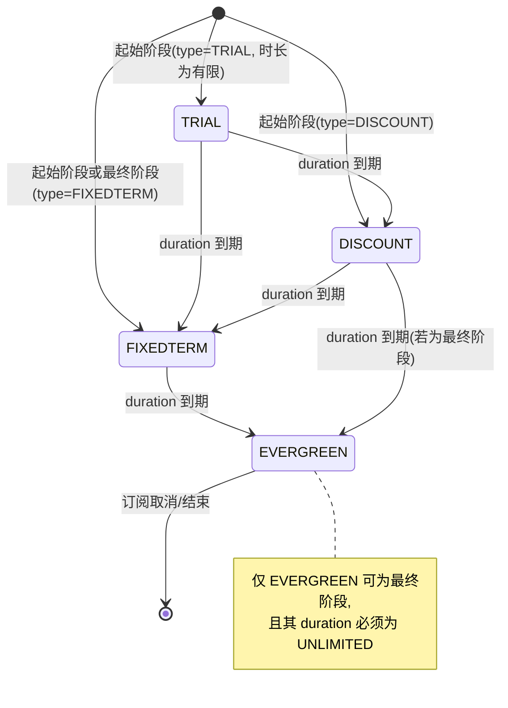
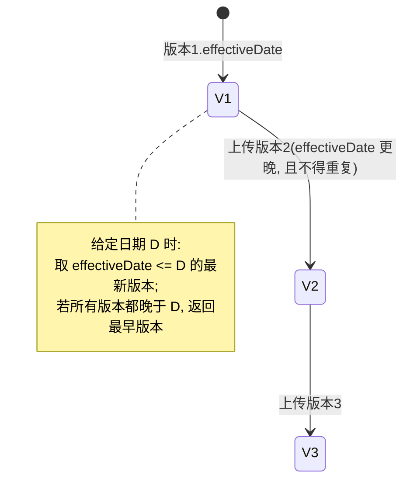
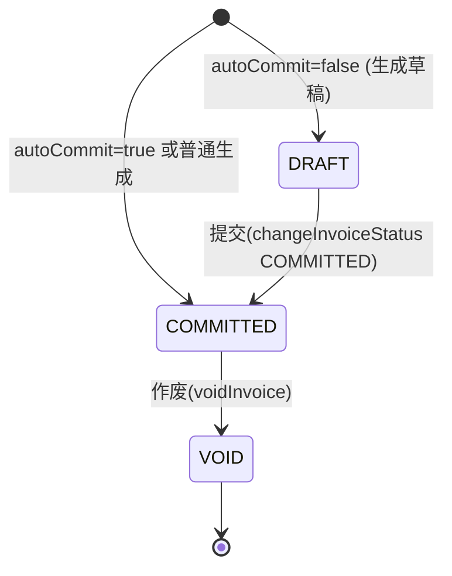
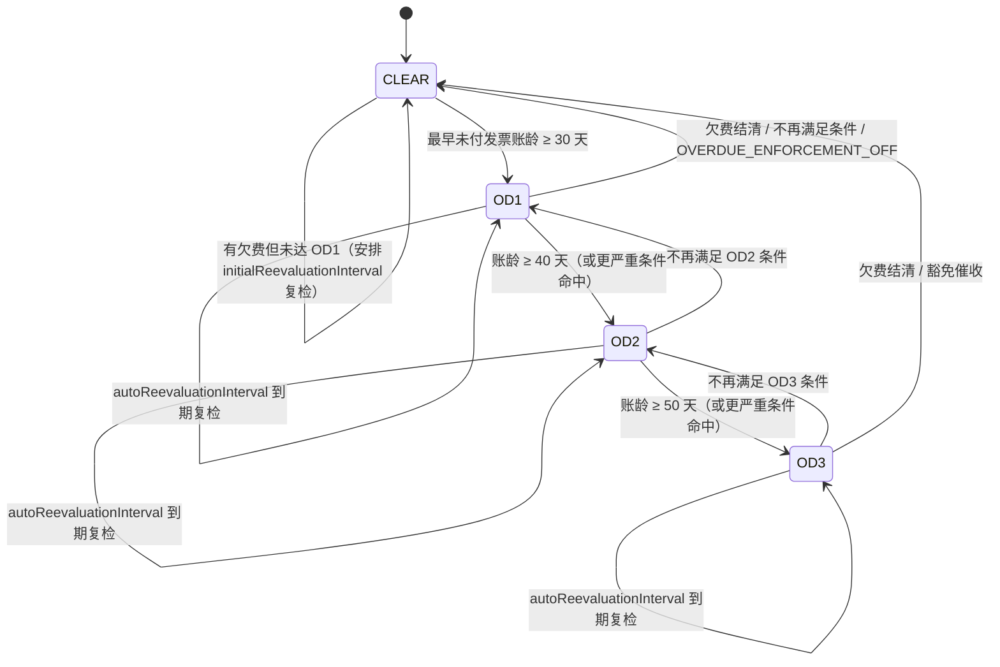
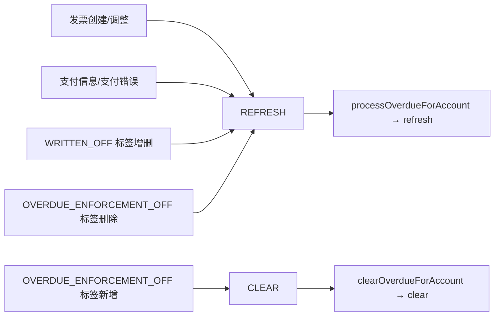
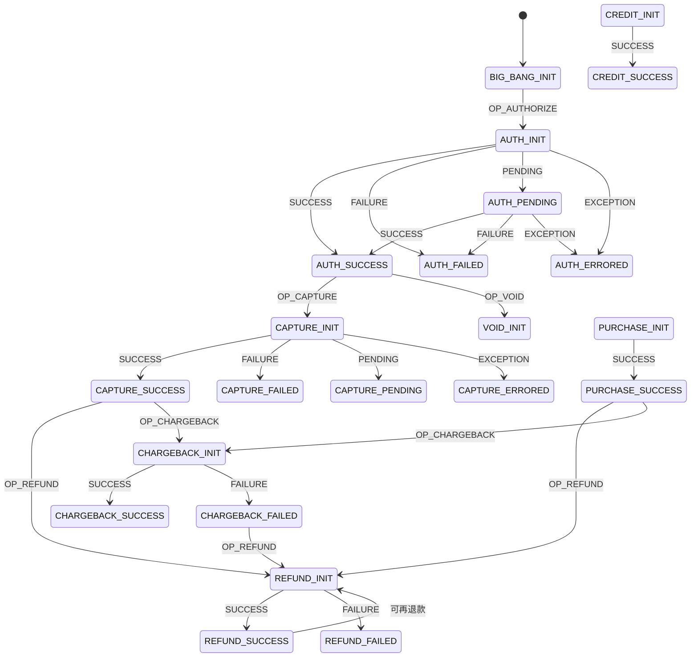
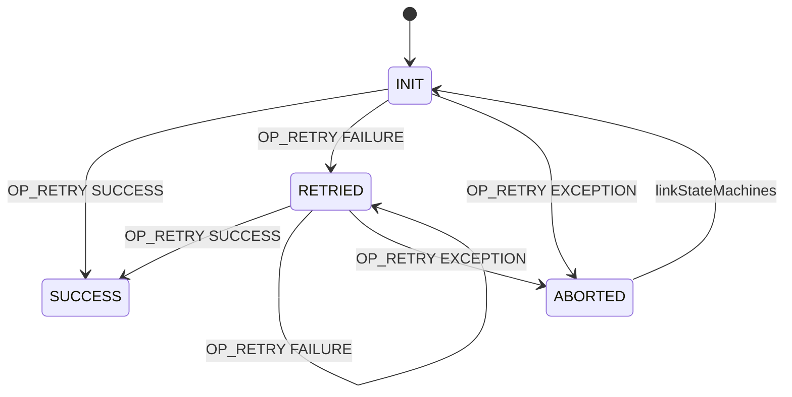
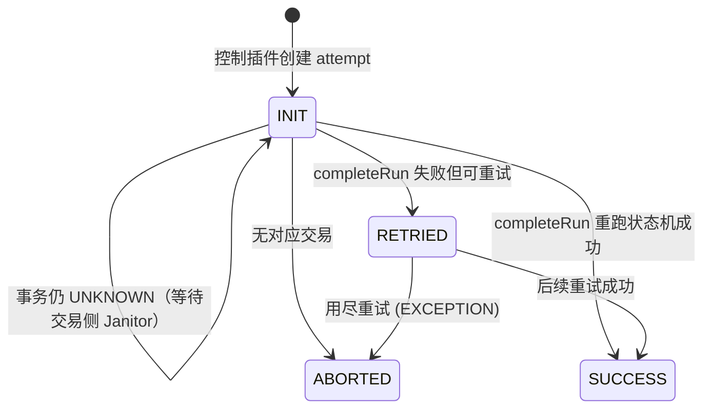
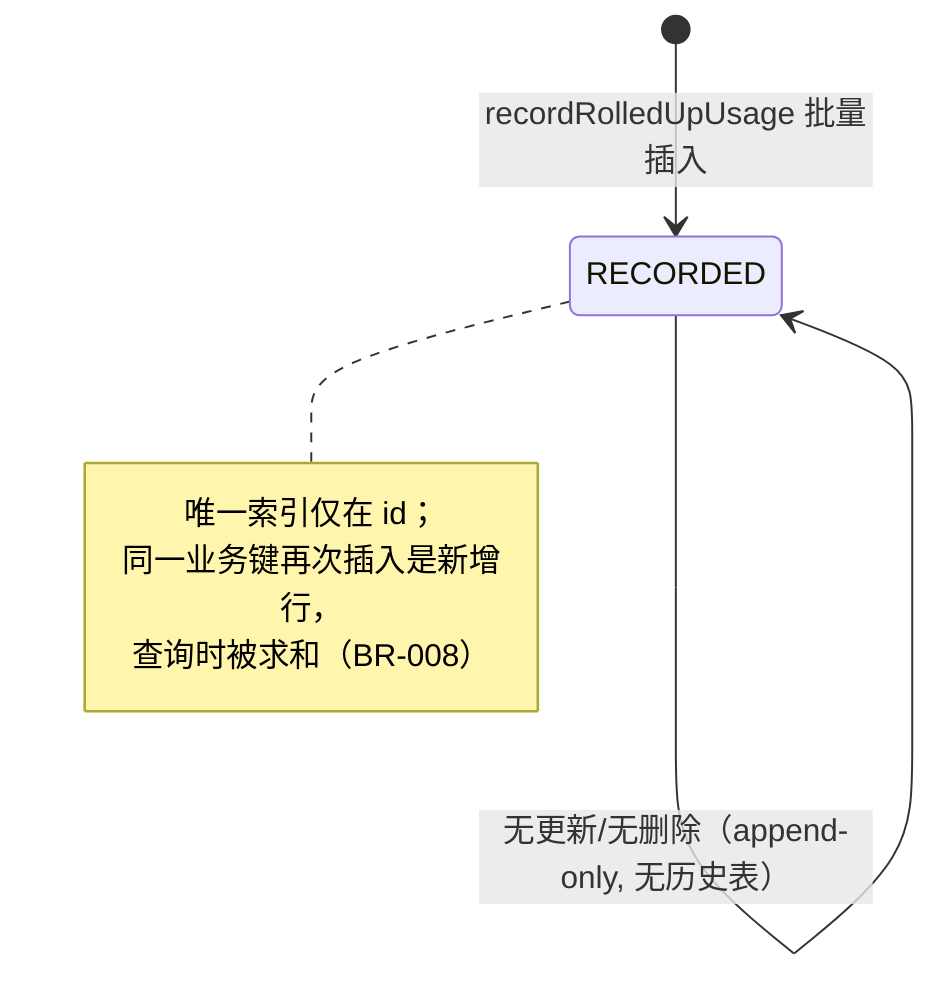

# 状态机 (State Machines)

> 由 .bizdoc-kb2/cards 合成；本文件共 9 张卡。

## SM-001 计划阶段生命周期状态机

- **类型**: 状态机
- **同义词**: 阶段流转, 试用期结束, 折扣期结束, phase lifecycle, trial to evergreen, 阶段状态
- **模块**: catalog
- **置信度**: 🟢 confirmed
- **溯源**: `catalog/src/main/java/org/killbill/billing/catalog/DefaultPlan.java:199-211`, `catalog/src/main/java/org/killbill/billing/catalog/DefaultPlan.java:304-319`, `catalog/src/main/java/org/killbill/billing/catalog/StandaloneCatalog.java:290-310`

**约束**：起始阶段不得为 EVERGREEN；最终阶段不得为 TRIAL/DISCOUNT；EVERGREEN 必须 UNLIMITED，非 EVERGREEN 不得 UNLIMITED。

## SM-002 目录版本生效状态机

- **类型**: 状态机
- **同义词**: 目录版本生效, catalog version lifecycle, 版本按日期切换, 目录生效
- **模块**: catalog
- **置信度**: 🟢 confirmed
- **溯源**: `catalog/src/main/java/org/killbill/billing/catalog/DefaultVersionedCatalog.java:82-120`, `catalog/src/main/java/org/killbill/billing/catalog/DefaultVersionedCatalog.java:133-154`

## SM-003 发票状态机（DRAFT / COMMITTED / VOID）

- **类型**: 状态机
- **同义词**: 发票状态, 发票状态流转, invoice status, DRAFT, COMMITTED, VOID, 草稿发票, 已提交发票, 作废发票
- **模块**: invoice
- **置信度**: 🟢 confirmed
- **溯源**: `invoice/src/main/java/org/killbill/billing/invoice/generator/DefaultInvoiceGenerator.java:91`, `invoice/src/main/java/org/killbill/billing/invoice/api/user/DefaultInvoiceUserApi.java:579`, `invoice/src/main/java/org/killbill/billing/invoice/api/user/DefaultInvoiceUserApi.java:780-788`, `invoice/src/main/java/org/killbill/billing/invoice/dao/DefaultInvoiceDao.java:518-520`

**说明**：发票有三种状态。新生成发票的初始状态由“是否账户自动提交（autoCommit）”决定：`autoCommit=true` → `COMMITTED`，否则 → `DRAFT`。DRAFT 发票可被提交为 COMMITTED；COMMITTED 发票可被作废为 VOID。

**备注**：DRAFT/VOID 发票余额一律为 0（见 BR-021）。

## SM-004 账户逾期状态机

- **类型**: 状态机
- **同义词**: 逾期状态机, 催收状态流转, 状态迁移, overdue state machine, dunning state machine, CLEAR, OD1, OD2, OD3
- **模块**: overdue
- **置信度**: 🟢 confirmed
- **溯源**: `overdue/src/main/java/org/killbill/billing/overdue/config/DefaultOverdueStateSet.java:37`, `overdue/src/main/java/org/killbill/billing/overdue/config/DefaultOverdueStateSet.java:59-67`, `overdue/src/main/java/org/killbill/billing/overdue/config/DefaultOverdueStateSet.java:92-95`, `overdue/src/main/java/org/killbill/billing/overdue/applicator/OverdueStateApplicator.java:127-158`, `profiles/killbill/src/main/resources/overdue.xml:19-61`

**说明**：状态名并非固定枚举，而是由配置定义；下图为官方示例（OD1/OD2/OD3 + 内建 CLEAR）的典型流转。**CLEAR 是默认/未逾期态**；随欠费账龄增长，评估结果沿「入门级（OD1）→ 更严重（OD2）→ 最严重（OD3）」，每次进入更严重状态会执行该状态的动作（阻止变更、暂停权益、可选取消订阅）。当账户不再满足更严重条件的条件、或欠费结清、或被打上 OVERDUE_ENFORCEMENT_OFF 时，评估结果回落到较轻状态或 CLEAR（降级/恢复）。配置中越靠前的状态优先级越高（先匹配先赢）。

**进入动作（按目标状态）**：`blockChanges` / `disableEntitlementAndChangesBlocked`（含暂停权益+停止计费）/ `subscriptionCancellationPolicy`（NONE/IMMEDIATE/END_OF_TERM）/ 自动切换 `AUTO_INVOICING_OFF`。相同状态重入为 no-op。

## SM-005 逾期异步通知动作状态机（REFRESH / CLEAR）

- **类型**: 状态机
- **同义词**: 通知动作, 刷新与清除, REFRESH, CLEAR, notification action state machine, OverdueAsyncBusNotificationAction
- **模块**: overdue
- **置信度**: 🟢 confirmed
- **溯源**: `overdue/src/main/java/org/killbill/billing/overdue/notification/OverdueAsyncBusNotificationKey.java:30-33`, `overdue/src/main/java/org/killbill/billing/overdue/notification/OverdueAsyncBusNotifier.java:64-74`, `overdue/src/main/java/org/killbill/billing/overdue/listener/OverdueListener.java:98-119`

**说明**：异步总线通知键携带动作，决定消费时执行「重新评估」还是「清除状态」。

## SM-006 支付交易状态机

- **类型**: 状态机
- **同义词**: 支付状态, 支付状态机, 交易状态, payment state, payment state machine, transaction status, AUTH_SUCCESS, PURCHASE_PENDING
- **模块**: payment
- **置信度**: 🟢 confirmed
- **溯源**: `payment/src/main/resources/org/killbill/billing/payment/PaymentStates.xml:22-497`, `payment/src/main/java/org/killbill/billing/payment/core/sm/PaymentStateMachineHelper.java:83-110`

**说明**：每种交易类型（AUTHORIZE/CAPTURE/PURCHASE/REFUND/CREDIT/VOID/CHARGEBACK）各是一条独立子状态机，初始状态均为 `<TYPE>_INIT`，由操作 OP_<TYPE> 驱动到 `<TYPE>_SUCCESS` / `<TYPE>_FAILED` / `<TYPE>_PENDING` / `<TYPE>_ERRORED`。PENDING 状态可再经同一操作流向 SUCCESS 或 FAILED，EXCEPTION 结果流向 ERRORED。子状态机之间通过 linkStateMachines 串联。

**成功判定**：`isSuccessState` 规则为状态名以 `SUCCESS` 结尾，或状态名以 `CHARGEBACK` 开头（即任何 CHARGEBACK_* 状态都算成功态）。

## SM-007 支付重试控制状态机 (PAYMENT_RETRY)

- **类型**: 状态机
- **同义词**: 支付重试状态机, retry state machine, PAYMENT_RETRY, 重试流转, OP_RETRY
- **模块**: payment
- **置信度**: 🟢 confirmed
- **溯源**: `payment/src/main/resources/org/killbill/billing/payment/retry/RetryStates.xml:22-82`, `payment/src/main/java/org/killbill/billing/payment/core/sm/PaymentControlStateMachineHelper.java:35-52`

**说明**：控制类支付（invoice payment）的重试由 PAYMENT_RETRY 状态机驱动，操作名为 OP_RETRY，状态机名必须与 RetryStates.xml 一致。

## SM-008 Janitor 支付尝试(attempt)修复状态机

- **类型**: 状态机
- **同义词**: attempt 修复, 支付尝试状态机, janitor attempt, attempt repair, INIT 到终态
- **模块**: payment
- **置信度**: 🟢 confirmed
- **溯源**: `payment/src/main/java/org/killbill/billing/payment/core/janitor/IncompletePaymentAttemptTask.java:196-294`, `payment/src/main/resources/org/killbill/billing/payment/retry/RetryStates.xml:22-82`

**说明**：Janitor 的 `IncompletePaymentAttemptTask` 定期扫描处于重试状态机初始态（`INIT`）且创建时间早于 `org.killbill.payment.janitor.attempts.delay`（默认 12h）的支付尝试，并推进其状态：

**触发条件**：attempt 对应交易为 `UNKNOWN` 时跳过（交交易侧 Janitor）；否则重跑控制状态机的 completion 部分，仅调用控制插件的 success/failure 回调并流转状态。

## SM-009 用量记录无状态生命周期（只追加）

- **类型**: 状态机
- **同义词**: 用量状态, 用量生命周期, append only, immutable usage, no lifecycle, 用量无状态
- **模块**: usage
- **置信度**: 🟢 confirmed
- **溯源**: `usage/src/main/java/org/killbill/billing/usage/dao/RolledUpUsageModelDao.java:30-51`, `usage/src/main/java/org/killbill/billing/usage/dao/RolledUpUsageModelDao.java:150-158`, `usage/src/main/java/org/killbill/billing/usage/dao/RolledUpUsageDao.java:26-37`

**结论**：用量记录**没有状态字段，也没有状态流转**。`RolledUpUsageModelDao` 只有业务数值字段；`getHistoryTableName()` 显式返回 `null`（不写入历史表）；`RolledUpUsageDao` 只提供 `record`（插入）与查询方法，**没有任何 update/delete**。

**含义**：不存在「用量被修改/撤销」的状态机。任何「更正用量」都只能通过新增一条冲正记录实现，且系统不会自动去重（除 trackingId 外）。
