# 业务流程 (Workflows)


> 由 .bizdoc-kb2/cards 合成；本文件共 24 张卡。

## WF-001 目录加载与校验流程

- **类型**: 业务流程
- **同义词**: 目录加载, 上传目录, catalog load, 目录校验, loadDefaultCatalog, upload catalog
- **模块**: catalog
- **置信度**: 🟢 confirmed
- **溯源**: `catalog/src/main/java/org/killbill/billing/catalog/io/VersionedCatalogLoader.java:78-161`, `catalog/src/main/java/org/killbill/billing/catalog/DefaultCatalogService.java:66-85`

**步骤**：

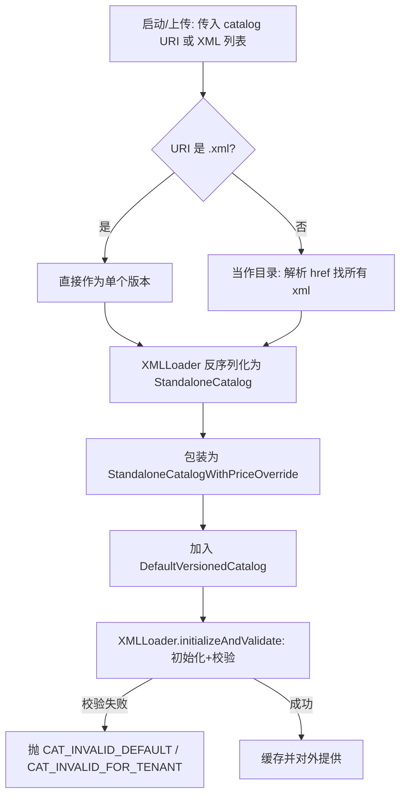

**说明**：加载支持「单 XML 文件」或「包含多个 XML 链接的目录」；`filterTemplateCatalog=true` 时跳过模板目录（无产品/计划/币种）。

## WF-002 计划变更（换套餐/改价）决策流程

- **类型**: 业务流程
- **同义词**: 换套餐, 计划变更, 升级降级, plan change, upgrade downgrade, change plan
- **模块**: catalog
- **置信度**: 🟢 confirmed
- **溯源**: `catalog/src/main/java/org/killbill/billing/catalog/rules/DefaultPlanRules.java:143-185`

**步骤**：

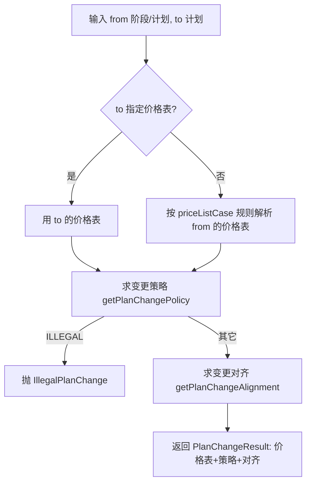

## WF-003 简化计划创建/更新流程

- **类型**: 业务流程
- **同义词**: 简化建计划, simple plan create, 添加计划, add plan, 添加产品
- **模块**: catalog
- **置信度**: 🟢 confirmed
- **溯源**: `catalog/src/main/java/org/killbill/billing/catalog/CatalogUpdater.java:119-213`

**步骤**：

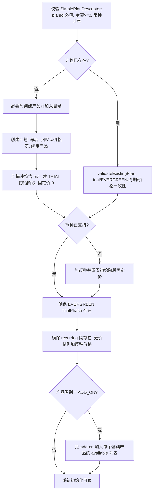

## WF-004 账户 BCD 计算流程

- **类型**: 业务流程
- **同义词**: 账户账单日计算, account BCD flow, 账单日确定
- **模块**: catalog
- **置信度**: 🟢 confirmed
- **溯源**: `junction/src/main/java/org/killbill/billing/junction/plumbing/billing/DefaultInternalBillingApi.java:220-274`

**步骤**：

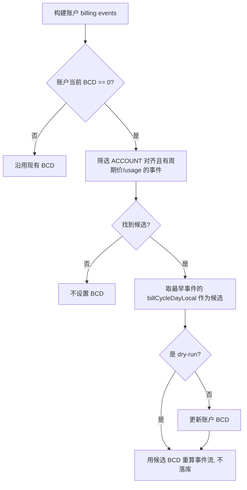

## WF-005 发票生成流程（generateInvoice）

- **类型**: 业务流程
- **同义词**: 发票怎么生成, 开票流程, invoice generation flow, generateInvoice, 出账流程
- **模块**: invoice
- **置信度**: 🟢 confirmed
- **溯源**: `invoice/src/main/java/org/killbill/billing/invoice/generator/DefaultInvoiceGenerator.java:74-115`

**步骤**：
1. 若 billing events 为空，直接返回空发票（无可计费内容）。
2. 校验目标日期（BR-029）。
3. 依据既有发票调整目标日期（BR-030）。
4. 确定发票状态：账户 `isAccountAutoInvoiceDraft` → `DRAFT`，否则 `COMMITTED`。
5. 创建 `DefaultInvoice`（invoiceDate = 当前创建日期）。
6. 生成**固定与周期（fixed & recurring）**发票项并加入发票。
7. 生成**用量（usage）**发票项与 trackingIds 并加入发票。
8. 若指定了 `targetInvoiceId`，合并该既有发票的项目。
9. 返回带元数据（trackingIds、未来通知日期、是否禁用零金额用量）的 `InvoiceWithMetadata`。

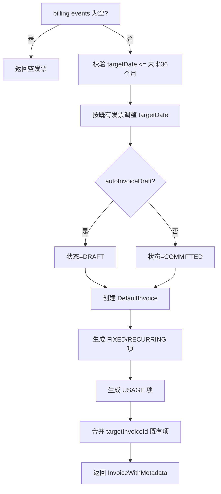

## WF-006 干跑发票流程（dryRun）

- **类型**: 业务流程
- **同义词**: 干跑流程, 试算流程, dry run flow, 预览发票, triggerDryRunInvoiceGeneration
- **模块**: invoice
- **置信度**: 🟢 confirmed
- **溯源**: `invoice/src/main/java/org/killbill/billing/invoice/InvoiceDispatcher.java:362-435`, `invoice/src/main/java/org/killbill/billing/invoice/api/user/DefaultInvoiceUserApi.java:277-288`

**步骤**：
1. 若为 `UPCOMING_INVOICE` 且未提供目标日期，由系统计算；否则使用传入/当前目标日期。
2. 组装 `DryRunInfo(dryRunType, dryRunInfoDate)`。
3. 拉取既有发票与 billing events（同样会更新 BCD）。
4. 若为 `UPCOMING_INVOICE`：收集所有候选目标日期（含订阅未来切换），可再按订阅 id 过滤后试算。
5. 若为 `TARGET_DATE` 或 `SUBSCRIPTION_ACTION`：按 `inputTargetDate` 试算。
6. 返回一张预览 `Invoice`（不落库）；API `triggerDryRunInvoiceGeneration` 若结果为空则抛 `INVOICE_NOTHING_TO_DO`。

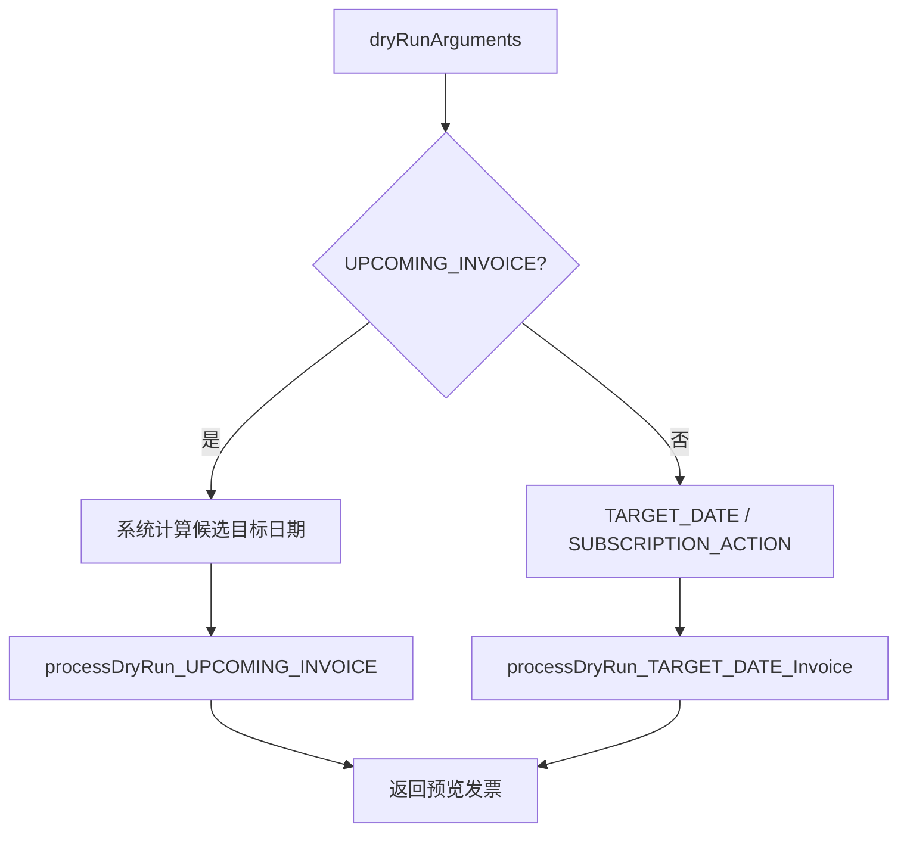

## WF-007 用量计费流程（in-arrear usage billing）

- **类型**: 业务流程
- **同义词**: 用量计费流程, 后付费用量, usage billing flow, in-arrear, 按量出账
- **模块**: invoice
- **置信度**: 🟢 confirmed
- **溯源**: `invoice/src/main/java/org/killbill/billing/invoice/usage/ContiguousIntervalUsageInArrear.java:184-331`

**步骤**：
1. 依据 billing events 构建 transition times（按 BCD 对齐）。
2. 将原始用量（RawUsageRecord）按区间滚动汇总（CAPACITY 取峰 / CONSUMABLE 累加）。
3. 清理已存在的 tracking id，得到新增用量集合。
4. 对每个区间：跳过已被既有 USAGE 项覆盖的区间；计算已计费金额与本次应计金额。
5. 生成本次差异的 `USAGE` 发票项与 tracking ids。
6. 计算下一次用量通知日期，返回结果。

## WF-008 父发票自动提交流程（parent invoice auto-commit）

- **类型**: 业务流程
- **同义词**: 父发票提交, HA 发票, parent invoice commit, 父子账户开票, 多账户开票, parent commitment
- **模块**: invoice
- **置信度**: 🟢 confirmed
- **溯源**: `invoice/src/main/java/org/killbill/billing/invoice/notification/ParentInvoiceCommitmentPoster.java:49-95`, `invoice/src/main/java/org/killbill/billing/invoice/InvoiceDispatcher.java:1394`, `invoice/src/main/java/org/killbill/billing/invoice/InvoiceDispatcher.java:1481`

**步骤**：
1. 为子账户生成一张**草稿父发票**（DRAFT，isParentInvoice=true），目标为父账户。
2. 记录一条“父发票提交”未来通知（队列 `ParentInvoiceCommitmentNotifier`），触发时间取自 `org.killbill.invoice.parent.commit.local.utc.time`（默认 UTC 23:59:59.999）。
3. 到点时由 notifier 处理该通知，将父发票状态提交为 `COMMITTED`。
4. 若同一日期已有相同 invoiceId 的未来通知，则不重复插入（去重）。

## WF-009 发票生成触发时机（when invoice is generated）

- **类型**: 业务流程
- **同义词**: 什么时候开票, 发票生成时机, invoice generation trigger, when is invoice generated, 出账时机, 自动开票
- **模块**: invoice
- **置信度**: 🟢 confirmed
- **溯源**: `invoice/src/main/java/org/killbill/billing/invoice/InvoiceListener.java:98-229`, `invoice/src/main/java/org/killbill/billing/invoice/InvoiceListener.java:266-307`, `invoice/src/main/java/org/killbill/billing/invoice/InvoiceDispatcher.java:254-300`

**说明**：发票在以下情形被触发生成（除最后一项外均为系统内部事件驱动）：
1. **订阅有效变更**（`EffectiveSubscriptionInternalEvent`，跳过 UNCANCEL 与非最后事件）→ 立即为该订阅生成发票。
2. **阻断状态变更**（`BlockingTransitionInternalEvent`，block/unblock billing）→ 重新生成。
3. **下一账期事件/通知**（Next Billing Date）→ 到期生成。
4. **账户 BCD 变更**（`billCycleDayLocal` 变化）→ 重新生成。
5. **子账户发票创建**（`InvoiceCreationInternalEvent`，且子账户 payment 委托给父账户）→ 生成父发票汇总。
6. **发票调整**（`DefaultInvoiceAdjustmentEvent`）→ 调整父发票。
7. **订阅请求**（`RequestedSubscriptionInternalEvent`）→ 安排 dry-run 通知时间。
8. **API 显式调用**（`triggerInvoiceGeneration` / `triggerDryRunInvoiceGeneration`）。

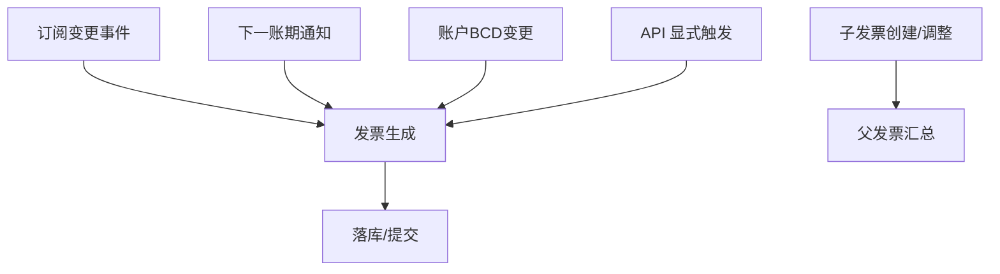

## WF-010 父子账户（HA）发票汇总流程

- **类型**: 业务流程
- **同义词**: 父子账户开票, HA 发票, parent child invoice, 汇总发票, payment delegated to parent, 多账户统一出账
- **模块**: invoice
- **置信度**: 🟢 confirmed
- **溯源**: `invoice/src/main/java/org/killbill/billing/invoice/InvoiceDispatcher.java:1340-1405`, `invoice/src/main/java/org/killbill/billing/invoice/InvoiceListener.java:143-168`

**步骤**：
1. 当子账户产生发票创建事件、且该子账户**把支付委托给父账户**（`isPaymentDelegatedToParent`）时，触发父发票处理。
2. 对**父账户**加全局锁，读取子发票，计算子发票金额（`computeChildInvoiceAmount`）。
3. 查找父账户的 DRAFT 父发票：
   - 若已存在且已含该子账户的汇总项 → **累加更新**该项金额；
   - 若存在但无该项 → 新增一个 `PARENT_SUMMARY` 项；
   - 若不存在 → 视子发票是否应忽略（BR-052），否则新建 DRAFT 父发票并加 `PARENT_SUMMARY` 项。
4. 记录父-子发票关系（`InvoiceParentChildModelDao`）。
5. 到 `parent.commit.local.utc.time`（默认 UTC 23:59:59.999）由 notifier 提交父发票（见 WF-004）。

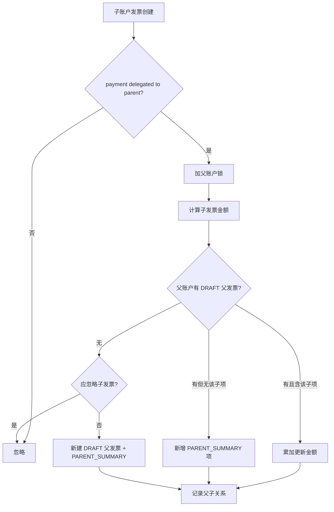

## WF-011 修复 / 套餐变更处理流程（Repair）

- **类型**: 业务流程
- **同义词**: 修复流程, 套餐变更, 改套餐, repair, plan change, 冲销重开, CHG
- **模块**: invoice
- **置信度**: 🟢 confirmed
- **溯源**: `invoice/src/main/java/org/killbill/billing/invoice/generator/FixedAndRecurringInvoiceItemGenerator.java:91-137`

**步骤**：
1. 用既有发票项构建 `AccountItemTree`；先通过 `InvoicePruner.getFullyRepairedItemsClosure` 剔除**此前已被完全修复**的项，避免链式重复。
2. 跳过来自 `auto_invoice_off` 订阅的项（但迁移发票/信用/外部收费等始终纳入）。
3. 依据 junction 的 billing events 生成**提议项**（自历史起点的全部 RECURRING/FIXED 项）。
4. 由 optimizer 过滤提议项（BR-044）。
5. 在树中把提议项与既有项**合并**，对不再适用/缩短的既有项产生 `REPAIR_ADJ`（负金额冲销），对新增/延长部分产生新的 RECURRING/FIXED 项。
6. 取合并后的结果项列表并执行安全边界校验（每日项数上限）。

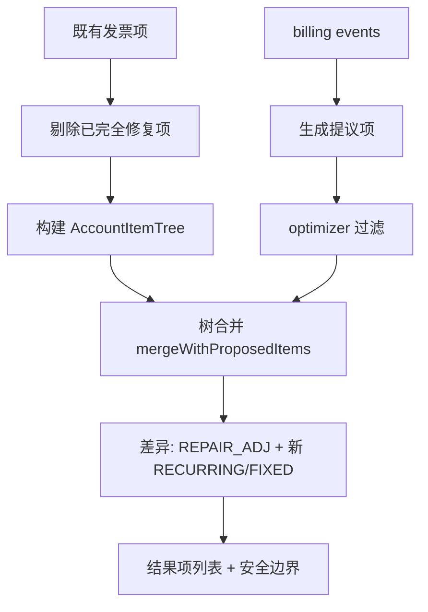

## WF-012 逾期评估与刷新流程（Refresh）

- **类型**: 业务流程
- **同义词**: 逾期流程, 催收流程, 逾期刷新, overdue refresh workflow, dunning process, reevaluation flow
- **模块**: overdue
- **置信度**: 🟢 confirmed
- **溯源**: `overdue/src/main/java/org/killbill/billing/overdue/listener/OverdueListener.java:96-157`, `overdue/src/main/java/org/killbill/billing/overdue/notification/OverdueAsyncBusNotifier.java:56-78`, `overdue/src/main/java/org/killbill/billing/overdue/listener/OverdueDispatcher.java:42-56`, `overdue/src/main/java/org/killbill/billing/overdue/wrapper/OverdueWrapper.java:89-127`, `overdue/src/main/java/org/killbill/billing/overdue/applicator/OverdueStateApplicator.java:104-158`

**参与者**：业务事件（发票/支付/标签）、OverdueListener、async-bus 通知队列、OverdueDispatcher、OverdueWrapper、BillingStateCalculator、OverdueStateSet/Applicator、BlockingInternalApi、EntitlementApi、Bus。

**步骤**：
1. 业务事件触发 OverdueListener（除特殊标签外统一 REFRESH），校验 `shouldInsertNotification` 后写入 `overdue-async-bus-queue`（可级联父/子账户）。
2. OverdueAsyncBusNotifier 消费：REFRESH → `dispatcher.processOverdueForAccount`；CLEAR → `dispatcher.clearOverdueForAccount`。
3. Dispatcher 经 OverdueWrapperFactory 构造账户的 OverdueWrapper，调用 `refresh(effectiveDate, ctx)`（先取 ACCNT_INV_PAY 全局锁）。
4. Wrapper 检查 OVERDUE_ENFORCEMENT_OFF（有则跳过）；计算 BillingState；读取当前 BlockingState 得到 previousOverdueState；`calculateOverdueState` 得到 next。
5. Applicator.apply：调度/清除下次通知 → 状态未变则 no-op → 取消订阅（如需）→ 切换 AUTO_INVOICING_OFF → 写入新 BlockingState → 投递 OverdueChangeInternalEvent。

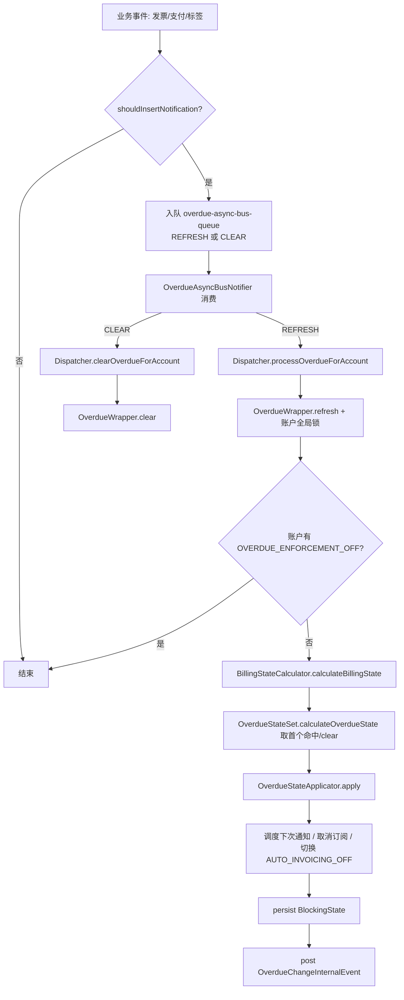

## WF-013 逾期状态评估周期（评估→施加→定时复评）

- **类型**: 业务流程
- **同义词**: 逾期状态循环, 催收周期, 状态评估, overdue evaluation cycle, dunning cycle
- **模块**: overdue
- **置信度**: 🟢 confirmed
- **溯源**: `overdue/src/main/java/org/killbill/billing/overdue/wrapper/OverdueWrapper.java:109-127`, `overdue/src/main/java/org/killbill/billing/overdue/config/DefaultOverdueStateSet.java:59-67`, `overdue/src/main/java/org/killbill/billing/overdue/applicator/OverdueStateApplicator.java:114-125`, `overdue/src/main/java/org/killbill/billing/overdue/notification/OverdueCheckNotifier.java:56-69`

**步骤**：
1. 计算账户 BillingState（未付发票数、余额、最早未付日期、标签）。
2. 依据 BillingState + 账户时区当日，按配置顺序选首个命中状态（否则 clear）。
3. 与当前已持久化状态比较；不同则执行动作并持久化。
4. 若已逾期或存在欠费，按 `autoReevaluationInterval`/`initialReevaluationInterval` 安排 `overdue-check-queue` 未来通知。
5. 定时到点后 OverdueCheckNotifier 消费 → Dispatcher `processOverdueForAccount` → 回到步骤 1，形成周期。

## WF-014 租户逾期配置上传流程

- **类型**: 业务流程
- **同义词**: 上传催收配置, 配置下发, tenant config upload, overdue config upload
- **模块**: overdue
- **置信度**: 🟢 confirmed
- **溯源**: `overdue/src/main/java/org/killbill/billing/overdue/api/DefaultOverdueApi.java:66-89`, `overdue/src/main/java/org/killbill/billing/overdue/service/DefaultOverdueService.java:103-113`, `overdue/src/main/java/org/killbill/billing/overdue/caching/OverdueCacheInvalidationCallback.java:39-43`

**步骤**：
1. 调用方通过 OverdueApi 上传 `overdueXML`（或 OverdueConfig 对象，先序列化为 XML）。
2. 删除该租户已有的 `OVERDUE_CONFIG` 键值（若存在）。
3. 写入新的 `OVERDUE_CONFIG` 租户键值。
4. 清除该租户的逾期配置缓存。
5. 缓存失效回调（TenantKey.OVERDUE_CONFIG）也会触发 `clearOverdueConfig`，保证后续评估读取新配置。

## WF-015 逾期豁免（CLEAR）流程

- **类型**: 业务流程
- **同义词**: 停止催收流程, 逾期豁免, 清除逾期流程, clear overdue workflow, OVERDUE_ENFORCEMENT_OFF flow
- **模块**: overdue
- **置信度**: 🟢 confirmed
- **溯源**: `overdue/src/main/java/org/killbill/billing/overdue/listener/OverdueListener.java:98-107`, `overdue/src/main/java/org/killbill/billing/overdue/notification/OverdueAsyncBusNotifier.java:64-74`, `overdue/src/main/java/org/killbill/billing/overdue/applicator/OverdueStateApplicator.java:185-213`

**步骤**：
1. 给账户新增 `OVERDUE_ENFORCEMENT_OFF` 控制标签。
2. Listener 监听 ControlTagCreationInternalEvent，以 `CLEAR` 动作入队 async-bus 队列。
3. Notifier 消费 CLEAR → Dispatcher `clearOverdueForAccount`。
4. Wrapper.clear：取锁 → 读当前状态 → Applicator.clear：写 clear 状态、清未来通知、移除（若存在）AUTO_INVOICING_OFF、投递 OverdueChangeInternalEvent。
5. 此后该账户的 refresh 会因存在 OVERDUE_ENFORCEMENT_OFF 而短路，催收保持关闭。

## WF-016 逾期服务生命周期启动流程

- **类型**: 业务流程
- **同义词**: 逾期服务启动, 服务生命周期, overdue service lifecycle, loadConfig, initialize queues
- **模块**: overdue
- **置信度**: 🟢 confirmed
- **溯源**: `overdue/src/main/java/org/killbill/billing/overdue/service/DefaultOverdueService.java:91-140`

**步骤**：
1. `loadConfig`（LOGO_CATALOG 级）：加载默认逾期配置（`org.killbill.overdue.uri`），失败则逾期系统禁用。
2. `initialize`（INIT_SERVICE）：注册 OverdueListener 到 bus；初始化 check 与 async-bus 两个通知队列；注册 `OVERDUE_CONFIG` 的缓存失效回调。
3. `start`（START_SERVICE）：启动两个通知队列。
4. `stop`（STOP_SERVICE）：从 bus 注销 Listener；停止并删除两个通知队列。

## WF-017 发票支付流程（控制插件驱动）

- **类型**: 业务流程
- **同义词**: 发票扣款流程, 自动支付流程, invoice payment flow, purchase flow, 支付控制流程
- **模块**: payment
- **置信度**: 🟢 confirmed
- **溯源**: `payment/src/main/java/org/killbill/billing/payment/invoice/InvoicePaymentControlPluginApi.java:130-310`, `payment/src/main/java/org/killbill/billing/payment/invoice/InvoicePaymentControlPluginApi.java:341-436`

**参与方**：账单系统（触发）、支付控制插件（__INVOICE_PAYMENT_CONTROL_PLUGIN__）、支付插件（网关）、发票模块。

**步骤**：
1. `priorCall`：校验交易类型为 PURCHASE/REFUND/CHARGEBACK/CREDIT；
2. 对 PURCHASE 执行 `getPluginPurchaseResult`：校验发票 COMMITTED → 校验父账户委托 → 计算金额 → 校验 AUTO_PAY_OFF → 校验默认支付方式 → 检查是否存在 UNKNOWN 交易 → `recordPaymentAttemptInit` 预写一条 attempt；
3. 调用支付插件执行实际扣款；
4. 成功 → `onSuccessCall`：对 PURCHASE 调 `invoiceApi.recordPaymentAttemptCompletion` 把支付结果写入发票；
5. 失败 → `onFailureCall`：对 PURCHASE 以 0 金额记录 `INIT` 状态，并计算 `nextRetryDate` 决定是否重试。

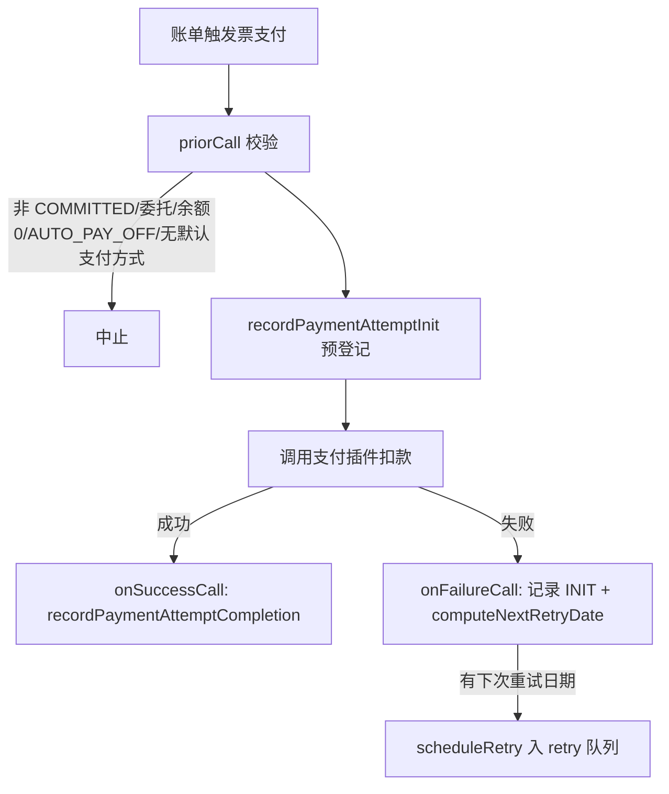

## WF-018 退款流程

- **类型**: 业务流程
- **同义词**: 退款流程, 退钱, 部分退款流程, refund flow, refund process
- **模块**: payment
- **置信度**: 🟢 confirmed
- **溯源**: `payment/src/main/java/org/killbill/billing/payment/invoice/InvoicePaymentControlPluginApi.java:202-207`, `payment/src/main/java/org/killbill/billing/payment/invoice/InvoicePaymentControlPluginApi.java:438-478`, `payment/src/main/java/org/killbill/billing/payment/api/DefaultInvoicePaymentApi.java:93-119`

**步骤**：
1. 调用方通过 `createRefundForInvoicePayment` 指定是否调整发票项（`isAdjusted`）及调整明细（`adjustments`）；
2. 组装插件属性 `IPCD_REFUND_WITH_ADJUSTMENTS` 与 `IPCD_REFUND_IDS_AMOUNTS`；
3. `priorCall`→`getPluginRefundResult` 计算可退金额（见 BR-009），金额为 0 且为 API 支付则中止；
4. 若需调整发票项，先 `validateInvoiceItemAdjustments` 校验；
5. 调用支付插件退款；
6. 成功 → `onSuccessCall` 调 `invoiceApi.recordRefund`。**退款不重试**（onFailureCall 中 REFUND 分支不设置重试日期）。

## WF-019 拒付(Chargeback)流程

- **类型**: 业务流程
- **同义词**: 拒付流程, 退单, 银行拒付, chargeback flow, dispute
- **模块**: payment
- **置信度**: 🟢 confirmed
- **溯源**: `payment/src/main/java/org/killbill/billing/payment/invoice/InvoicePaymentControlPluginApi.java:209-232`, `payment/src/main/java/org/killbill/billing/payment/invoice/InvoicePaymentControlPluginApi.java:298-304`

**步骤**：
1. CHARGEBACK 的 priorCall 直接返回允许（`DefaultPriorPaymentControlResult(false, amount)`），不做发票前置校验；
2. 成功后 `onSuccessCall` 调 `invoiceApi.recordChargeback`；**不支持部分拒付**（若已存在 chargeback 记录则跳过）；
3. 失败则 `onFailureCall` 调 `recordChargebackReversal` 冲销该拒付。

## WF-020 Janitor 修复未完成支付流程

- **类型**: 业务流程
- **同义词**: 支付巡检流程, 修复未完成支付, janitor flow, incomplete payment repair, PENDING 修复
- **模块**: payment
- **置信度**: 🟢 confirmed
- **溯源**: `payment/src/main/java/org/killbill/billing/payment/core/janitor/IncompletePaymentTransactionTask.java:136-222`, `payment/src/main/java/org/killbill/billing/payment/core/janitor/IncompletePaymentAttemptTask.java:378-418`, `payment/src/main/java/org/killbill/billing/payment/core/janitor/Janitor.java:98-111`

**参与方**：Janitor 定时调度器、交易侧任务（IncompletePaymentTransactionTask）、尝试侧任务（IncompletePaymentAttemptTask）、支付插件、通知队列（janitor）。

**步骤**：
1. Janitor 启动后按 `org.killbill.payment.janitor.rate`（默认 1h）周期调度 `incompletePaymentAttemptTask`；
2. 对 PENDING/UNKNOWN 交易，向支付插件 `getPaymentInfo` 回查最新状态；
3. 用插件状态计算新的 TransactionStatus 与 PaymentState（PENDING→pending state，SUCCESS→success state，PAYMENT_FAILURE→failure state，PLUGIN_FAILURE→errored state，UNKNOWN→跳过）；
4. 若状态确实变化则"Repairing..."写回（`processPaymentInfoPlugin`），否则按 3 的重试时间表插入新的通知（`JanitorNotificationKey`，attemptNumber+1）；
5. attempt 侧若交易变为非 UNKNOWN，则重跑控制状态机 completion 使 attempt 进入终态。

## WF-021 记录（提交）用量流程

- **类型**: 业务流程
- **同义词**: 记录用量, 上报用量, 提交用量, 录入用量, record usage, submit usage, upload usage
- **模块**: usage
- **置信度**: 🟢 confirmed
- **溯源**: `usage/src/main/java/org/killbill/billing/usage/api/user/DefaultUsageUserApi.java:71-92`, `jaxrs/src/main/java/org/killbill/billing/jaxrs/resources/UsageResource.java:104-148`

**参与者**：调用方（REST/内部 API）、用量模块（`DefaultUsageUserApi`）、DAO（`DefaultRolledUpUsageDao`）、`rolled_up_usage` 表。

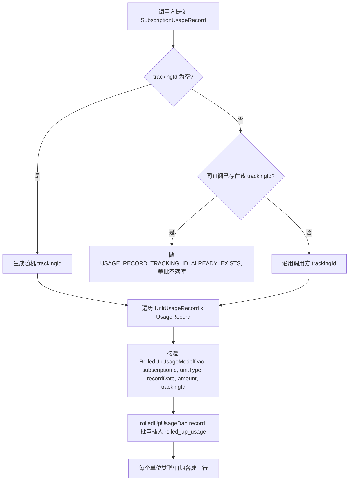

**API 前置校验**（REST）：必填校验（BR-016）→ 订阅存在性与退订日期校验（BR-017）→ 构造 CallContext 后调用 `recordRolledUpUsage`，成功返回 201 CREATED。

## WF-022 查询订阅单一单位类型用量

- **类型**: 业务流程
- **同义词**: 查询用量, 获取用量, 查订阅用量, get usage, query usage, usage for unit type
- **模块**: usage
- **置信度**: 🟢 confirmed
- **溯源**: `usage/src/main/java/org/killbill/billing/usage/api/user/DefaultUsageUserApi.java:94-108`, `jaxrs/src/main/java/org/killbill/billing/jaxrs/resources/UsageResource.java:160-185`

**参与者**：调用方、`DefaultUsageUserApi`、`UsagePluginApi`（可能）、`RolledUpUsageDao`、`rolled_up_usage` 表。

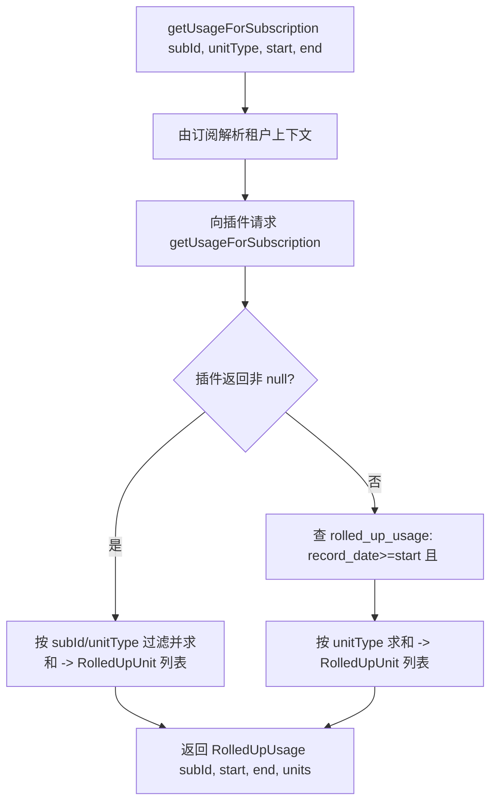

**REST**：`GET /usages/{subscriptionId}/{unitType}?startDate=&endDate=`；缺少 start/end 返回 400。

## WF-023 查询订阅全部用量（按转换时间分段）

- **类型**: 业务流程
- **同义词**: 查询所有用量, 分段查询用量, 按转换时间, get all usage, usage by transition times, 时间段用量
- **模块**: usage
- **置信度**: 🟢 confirmed
- **溯源**: `usage/src/main/java/org/killbill/billing/usage/api/user/DefaultUsageUserApi.java:110-134`, `jaxrs/src/main/java/org/killbill/billing/jaxrs/resources/UsageResource.java:187-214`

**参与者**：调用方、`DefaultUsageUserApi`、插件（可能）、DAO。

```mermaid
flowchart TD
  A[getAllUsageForSubscription subId, transitionTimes] --> B[prevDate = null]
  B --> C[遍历每个 curDate]
  C --> D{prevDate 非 null?}
  D -- 否 --> E[prevDate = curDate, 继续下一个]
  D -- 是 --> F[查询区间 prevDate, curDate 的用量 (插件优先/否则查库)]
  F --> G[加入 RolledUpUsage 结果列表]
  G --> H[prevDate = curDate]
  H --> C
  C --> I[返回 N-1 个区间的 RolledUpUsage]
```

**要点**：N 个转换时间产生 **N-1** 个区间结果（第一个时间点只作为起点）。REST 当前只传 `[startDate, endDate]` 两个时间点，故只取第 0 个结果（注释："The current JAXRS API only allows to look for one transition"）。插件分支此时传 `unitType=null`，故汇总所有单位类型。

## WF-024 开票侧拉取账户原始用量

- **类型**: 业务流程
- **同义词**: 开票拉取用量, 用量计费取数, invoicing usage fetch, raw usage for invoicing, 用量开票流程
- **模块**: usage
- **置信度**: 🟢 confirmed
- **溯源**: `usage/src/main/java/org/killbill/billing/usage/api/svcs/DefaultInternalUserApi.java:63-84`, `invoice/src/main/java/org/killbill/billing/invoice/usage/RawUsageOptimizer.java:77-98`

**参与者**：开票引擎（`RawUsageOptimizer`）、`InternalUserApi`、插件（可能）、DAO、`rolled_up_usage` 表。

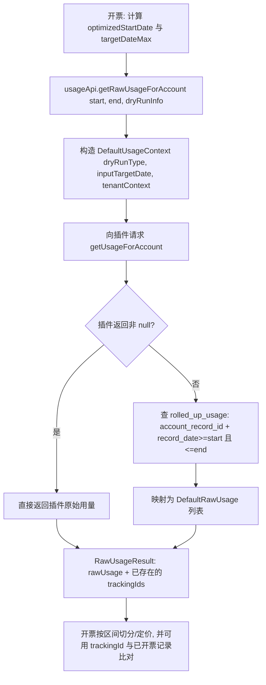

**要点**：入参 `dryRunInfo` 会决定 `UsageContext` 的 dry-run 类型与目标日期；`getRawUsageForAccount` 用右闭区间（BR-005）。开票侧还会用 `invoiceDao.getTrackingsByDateRange` 取已存在的 trackingIds 做去重/补开处理。
