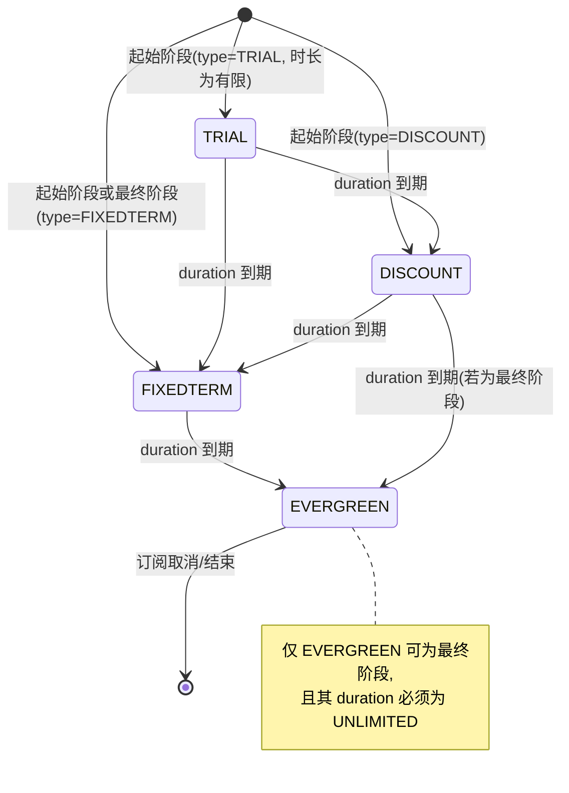
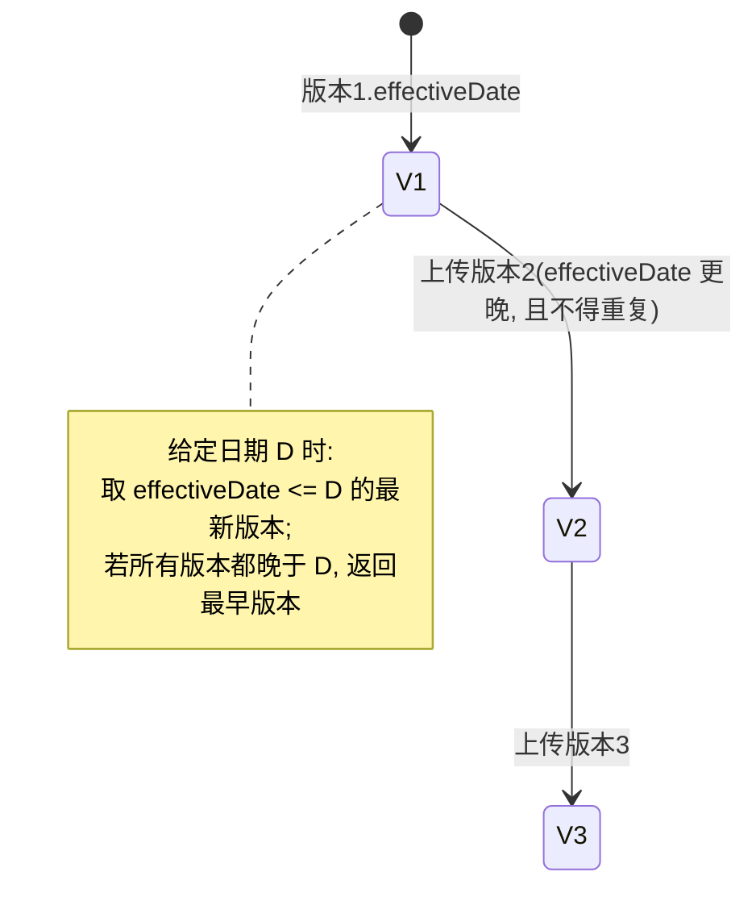
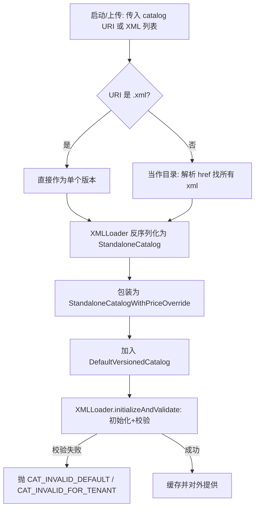
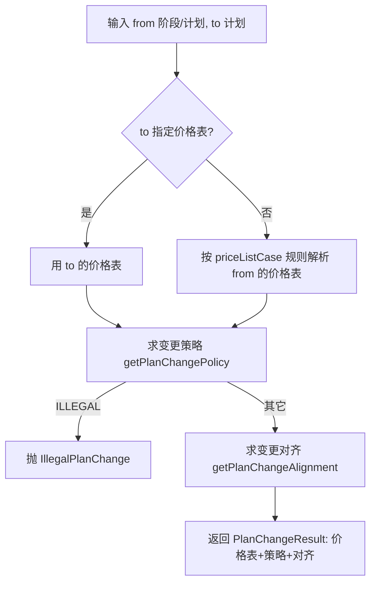
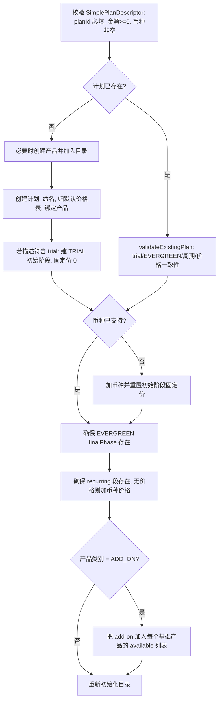
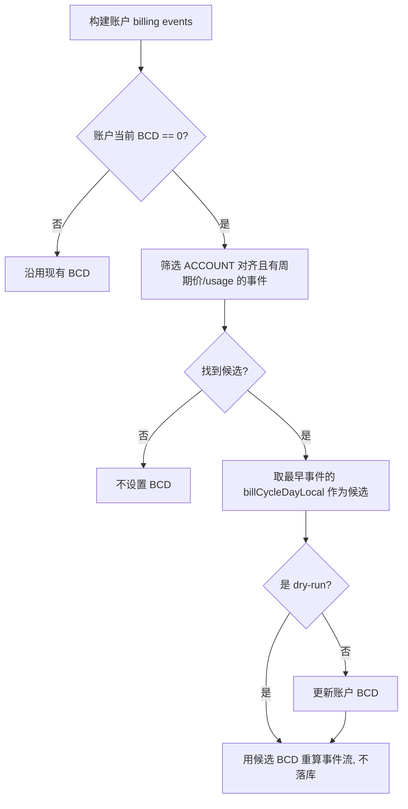
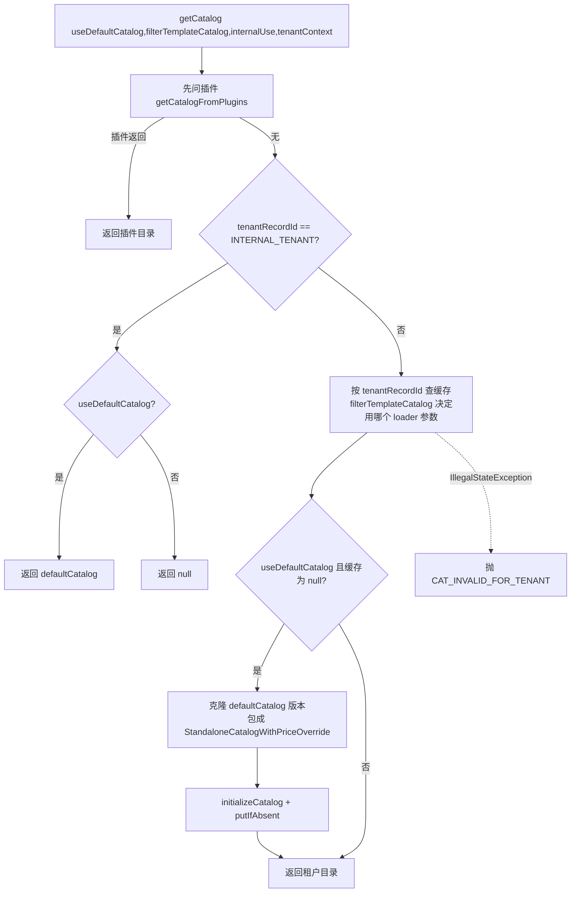
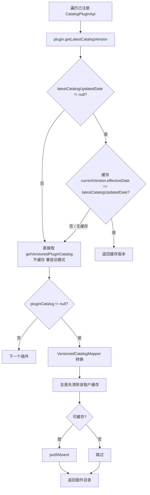
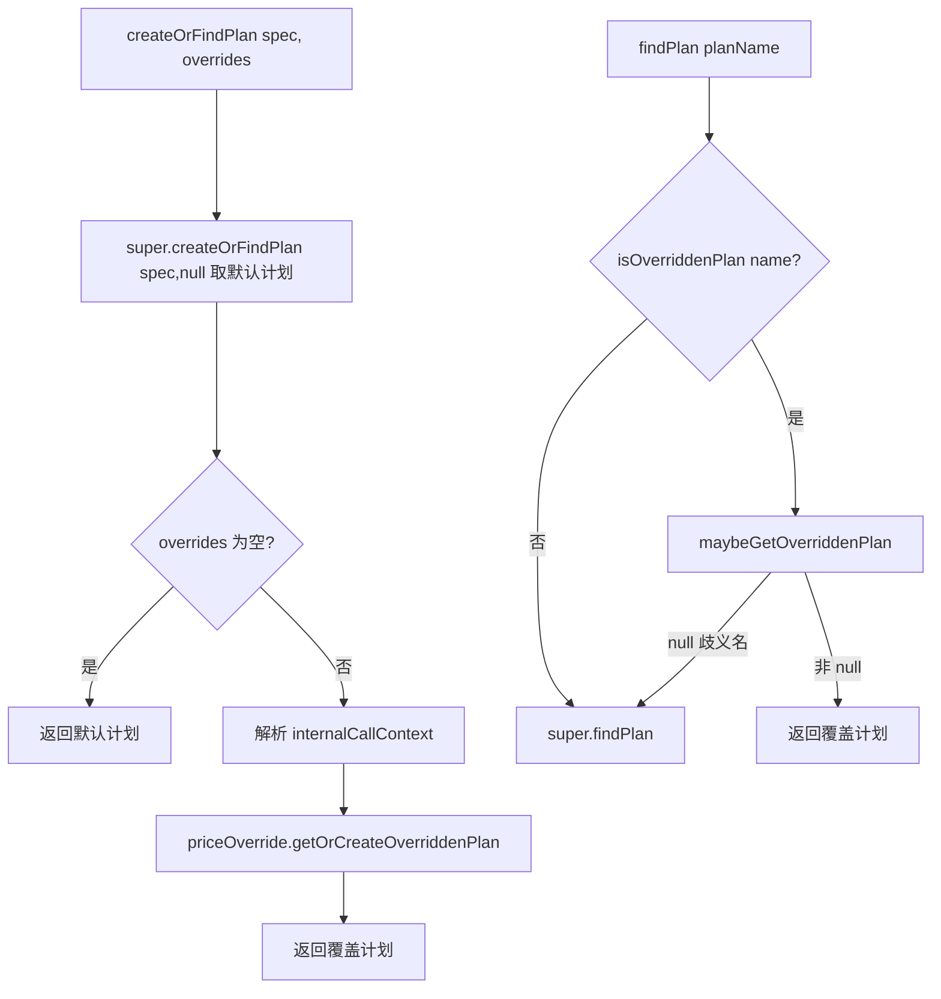

# 模块：catalog

> 本模块共 117 张卡（BR 57, ENT 16, ROLE 1, SM 2, TERM 34, WF 7）。

产品/计划/阶段/价格表目录模型、目录版本、用量定价结构与简化计划校验。

本模块卡片见下（ID 为全局编号，与 rules.md / glossary.md 等一致）。

---

## BR-171 初始阶段不能是 EVERGREEN

- **类型**: 业务规则
- **同义词**: 初始阶段约束, 起始阶段不能常青, initial phase evergreen, 阶段顺序规则, phase ordering
- **模块**: catalog
- **置信度**: 🟢 confirmed
- **溯源**: `catalog/src/main/java/org/killbill/billing/catalog/DefaultPlan.java:304-310`

**规则**：计划的每个 `initialPhase`（初始阶段）不得为 `PhaseType.EVERGREEN`；否则目录校验报错 `Initial Phase %s of plan %s cannot be of type EVERGREEN`。

**含义**：EVERGREEN 只能作为计划最后一个阶段（finalPhase），保证计划有明确的阶段性结构。

## BR-172 最终阶段不能是 TRIAL 或 DISCOUNT

- **类型**: 业务规则
- **同义词**: 最终阶段约束, 结束阶段不能试用, final phase trial, final phase discount, 阶段顺序规则
- **模块**: catalog
- **置信度**: 🟢 confirmed
- **溯源**: `catalog/src/main/java/org/killbill/billing/catalog/DefaultPlan.java:313-319`

**规则**：计划的 `finalPhase`（最终阶段）不得为 `PhaseType.TRIAL` 或 `PhaseType.DISCOUNT`；否则校验报错 `Final Phase %s of plan %s cannot be of type %s`。

**含义**：试用/折扣阶段只能出现在中间，最终阶段必须是 FIXEDTERM 或 EVERGREEN。

## BR-173 阶段必须至少定义一种计费项

- **类型**: 业务规则
- **同义词**: 阶段必填项, 阶段计价完整性, phase needs pricing, 空阶段校验
- **模块**: catalog
- **置信度**: 🟢 confirmed
- **溯源**: `catalog/src/main/java/org/killbill/billing/catalog/DefaultPlanPhase.java:176-180`

**规则**：若一个阶段同时没有 `fixed`、没有 `recurring` 且 `usages` 为空，则校验失败，报错 `Phase %s of plan %s need to define at least either a fixed or recurrring or usage section.`。

## BR-174 阶段名与计划名互推规则

- **类型**: 业务规则
- **同义词**: 阶段命名, 计划名解析, phase name, plan name from phase, 阶段名后缀
- **模块**: catalog
- **置信度**: 🟢 confirmed
- **溯源**: `catalog/src/main/java/org/killbill/billing/catalog/DefaultPlanPhase.java:104-115`

**规则**：
- 阶段名 = `planName + "-" + phaseType.toLowerCase()`。
- 反向解析：遍历 `PhaseType.values()`，看阶段名是否以某类型小写结尾，是则去掉「类型长度+1」个字符得到计划名；否则抛 `CAT_BAD_PHASE_NAME`。

**例外**：若计划名本身以某个 phase type 单词结尾，反向解析可能产生歧义（源码按 values() 顺序取首个匹配）。

## BR-175 EVERGREEN 必须 UNLIMITED，非 EVERGREEN 不得 UNLIMITED

- **类型**: 业务规则
- **同义词**: 常青阶段无限时长, evergreen unlimited, 阶段时长约束, 无限期阶段
- **模块**: catalog
- **置信度**: 🟢 confirmed
- **溯源**: `catalog/src/main/java/org/killbill/billing/catalog/StandaloneCatalog.java:290-310`

**规则**：遍历计划全部阶段：若阶段类型为 `EVERGREEN` 但其 `duration.unit != UNLIMITED`，报错「must have duration as UNLIMITED」；若阶段类型非 `EVERGREEN` 但其 `duration.unit == UNLIMITED`，报错「must not have duration as UNLIMITED」。

## BR-176 UNLIMITED 时长与 number 互斥

- **类型**: 业务规则
- **同义词**: 时长数量校验, unlimited 无数量, duration number, 时长必填
- **模块**: catalog
- **置信度**: 🟢 confirmed
- **溯源**: `catalog/src/main/java/org/killbill/billing/catalog/DefaultDuration.java:106-123`

**规则**：`unit == UNLIMITED` 时 `number` 必须为缺省（-1），否则报「Duration can only have 'UNLIMITED' unit if the number is omitted」；`unit != UNLIMITED` 时 `number` 必须给出，否则报「Finite Duration must have a well defined length」。

## BR-177 周期费与计费周期一致性

- **类型**: 业务规则
- **同义词**: 循环费周期校验, recurring billing period, 周期费必填周期, no billing period
- **模块**: catalog
- **置信度**: 🟢 confirmed
- **溯源**: `catalog/src/main/java/org/killbill/billing/catalog/DefaultRecurring.java:90-111`

**规则**：
- 有 `recurringPrice` 时必须有 `billingPeriod` 且不得为 `NO_BILLING_PERIOD`。
- 没有 `recurringPrice` 时 `billingPeriod` 必须是 `NO_BILLING_PERIOD`。
- 违反时报「has a recurring price but no billing period」或「has no recurring price but does have a billing period」。

## BR-178 价格不得为负且币种必须受支持

- **类型**: 业务规则
- **同义词**: 价格校验, 负价格, 非法币种, negative price, unsupported currency, 价格合法性
- **模块**: catalog
- **置信度**: 🟢 confirmed
- **溯源**: `catalog/src/main/java/org/killbill/billing/catalog/DefaultInternationalPrice.java:107-127`

**规则**：对每个 `Price`：
- 其 `currency` 不在目录 `supportedCurrencies` 中 → 校验错误 `Unsupported currency: <CUR>`。
- 其 `value < 0.0` → 校验错误 `Negative value for price in currency: <CUR>`。
- 若 `value` 为 null（抛 `CurrencyValueNull`），跳过负值检查。

## BR-179 指定币种无价格时抛 CAT_NO_PRICE_FOR_CURRENCY

- **类型**: 业务规则
- **同义词**: 币种缺价, 无报价币种, no price for currency, 价格缺失
- **模块**: catalog
- **置信度**: 🟢 confirmed
- **溯源**: `catalog/src/main/java/org/killbill/billing/catalog/DefaultInternationalPrice.java:88-100`

**规则**：`InternationalPrice` 无任何 price 时，视为所有币种价格 = 0（返回 `BigDecimal.ZERO`）；若有 price 列表但找不到请求的币种，则抛 `CatalogApiException(CAT_NO_PRICE_FOR_CURRENCY, currency)`。

## BR-180 用量各模式的必填结构

- **类型**: 业务规则
- **同义词**: 用量校验, 预付容量, 预付消耗, 后付阶梯, usage validation, IN_ADVANCE, IN_ARREAR, limits, blocks, tiers, 用量段校验, 目录校验, usage section validation, in advance limits, in arrears tiers
- **模块**: catalog
- **置信度**: 🟢 confirmed
- **溯源**: `catalog/src/main/java/org/killbill/billing/catalog/DefaultUsage.java:212-229`, `catalog/src/main/java/org/killbill/billing/catalog/DefaultTier.java:147-159`

**规则**：
- `IN_ADVANCE + CAPACITY`：必须定义 `limits`，否则报错。
- `IN_ADVANCE + CONSUMABLE`：必须定义 `blocks`，否则报错。
- `IN_ARREAR`：必须定义 `tiers`，否则报错。
- 在 Tier 级别：`IN_ARREAR + CAPACITY` 需 limits，`IN_ARREAR + CONSUMABLE` 需 blocks（校验信息挂在 DefaultUsage 上）。

**关联**：这些是目录对「用量类型 + 计费模式」组合的合法性约束，间接规定了对应用量记录应携带哪些单位类型。

## BR-181 Limit 的上下限判定

- **类型**: 业务规则
- **同义词**: 用量限制, 上限下限, limit min max, complies with limits, 超限
- **模块**: catalog
- **置信度**: 🟢 confirmed
- **溯源**: `catalog/src/main/java/org/killbill/billing/catalog/DefaultLimit.java:84-105`

**规则**：
- 校验：`max` 与 `min` 都有值时，`max < min` 报错「max must be greater than min」。
- 判定：`maxHasValue && value > max` → 不通过（false）；否则当 `minHasValue && value > min` 也不通过，其余通过。缺省值 -1 视为「未设置」。

**注意（源码疑点）**：`min` 判定使用 `value.compareTo(min) <= 0`（即 value > min 不通过），语义上更像是「未超过 min」；业务使用时需与官方文档核对。

## BR-182 effectiveDateForExistingSubscriptions 不得早于目录生效日

- **类型**: 业务规则
- **同义词**: 存量订阅生效日, existing subscriptions date, 目录生效日约束, price effective date
- **模块**: catalog
- **置信度**: 🟢 confirmed
- **溯源**: `catalog/src/main/java/org/killbill/billing/catalog/DefaultPlan.java:286-293`

**规则**：若计划设置了 `effectiveDateForExistingSubscriptions` 且它早于目录的 `effectiveDate`，则校验报错「Price effective date %s is before catalog effective date '%s'」。该字段用于控制计划变更对存量订阅生效的时点。

## BR-183 纯用量计划可不设 recurringBillingMode

- **类型**: 业务规则
- **同义词**: 纯用量计划, recurring billing mode 缺省, usage only plan, 计费模式继承
- **模块**: catalog
- **置信度**: 🟢 confirmed
- **溯源**: `catalog/src/main/java/org/killbill/billing/catalog/DefaultPlan.java:79-81`, `catalog/src/main/java/org/killbill/billing/catalog/DefaultPlan.java:276-278`, `catalog/src/main/java/org/killbill/billing/catalog/DefaultPlan.java:295-298`

**规则**：若计划的 recurring billing period 为 `NO_BILLING_PERIOD`（纯用量计划），可缺省 `recurringBillingMode`；否则必须有值，否则校验报「Invalid recurring billingMode for plan '%s'」。计划级缺省时继承目录级 `recurringBillingMode`。

## BR-184 plansAllowedInBundle 的取值语义

- **类型**: 业务规则
- **同义词**: bundle 内计划数量, plans allowed in bundle, 允许多少计划, 不限量 -1
- **模块**: catalog
- **置信度**: 🟢 confirmed
- **溯源**: `catalog/src/main/java/org/killbill/billing/catalog/DefaultPlan.java:90-95`, `catalog/src/main/java/org/killbill/billing/catalog/DefaultPlan.java:239-251`

**规则**：`plansAllowedInBundle` 表示一个 bundle 内该计划允许存在的数量：
- 缺省值 1；BASE 计划与 Tiered ADDON 只允许 1（源码注释明确）。
- 值 `-1` 表示不限量。
- 未设置时由初始化安全网填为 -1，运行期若仍为 null 会抛 IllegalStateException（安全校验）。

## BR-185 默认价格表名 DEFAULT 为保留名

- **类型**: 业务规则
- **同义词**: 默认价格表命名, DEFAULT 保留, reserved price list name, 价格表命名约束
- **模块**: catalog
- **置信度**: 🟢 confirmed
- **溯源**: `catalog/src/main/java/org/killbill/billing/catalog/DefaultPriceListSet.java:106-118`, `catalog/src/main/java/org/killbill/billing/catalog/PriceListDefault.java:36-45`

**规则**：
- 默认价格表（PriceListDefault）的名称 `getName()` 恒返回 `PriceListSet.DEFAULT_PRICELIST_NAME`（值 `DEFAULT`）。
- 子价格表名称不得等于 `DEFAULT`，否则校验报「Pricelists cannot use the reserved name 'DEFAULT'」。
- 若默认价格表名称不等于 `DEFAULT`，报「The name of the default pricelist must be 'DEFAULT'」。

## BR-186 价格表解析与默认回退

- **类型**: 业务规则
- **同义词**: 找价格表, price list fallback, 默认价格表回退, 多匹配计划, price list resolution
- **模块**: catalog
- **置信度**: 🟢 confirmed
- **溯源**: `catalog/src/main/java/org/killbill/billing/catalog/DefaultPriceListSet.java:64-98`

**规则**：
- `getPlanFrom(product, period, priceListName)`：先在指定价格表查匹配计划；若 0 个，则回退到默认价格表再查。
- 最终 0 个 → 返回 null；1 个 → 返回该计划；>1 个 → 抛 `CAT_MULTIPLE_MATCHING_PLANS_FOR_PRICELIST`。
- `findPriceListFrom(name)`：name 为 null 抛 `CAT_NULL_PRICE_LIST_NAME`；依次匹配默认表与子表；找不到抛 `CAT_PRICE_LIST_NOT_FOUND`。

## BR-187 计划缺省价格表的自动解析

- **类型**: 业务规则
- **同义词**: 计划归属价格表, plan price list, price list for plan, 自动找价格表
- **模块**: catalog
- **置信度**: 🟢 confirmed
- **溯源**: `catalog/src/main/java/org/killbill/billing/catalog/DefaultPlan.java:280-281`, `catalog/src/main/java/org/killbill/billing/catalog/DefaultPlan.java:404-412`

**规则**：若计划未显式声明 `priceListName`，初始化时遍历目录所有价格表，找到第一个包含该计划的表名；若都找不到则抛 `IllegalStateException("Cannot extract pricelist for plan ...")`。

## BR-188 目录版本按生效日期选取

- **类型**: 业务规则
- **同义词**: 目录版本选择, catalog for date, effective date 选择, 历史目录
- **模块**: catalog
- **置信度**: 🟢 confirmed
- **溯源**: `catalog/src/main/java/org/killbill/billing/catalog/DefaultVersionedCatalog.java:82-107`

**规则**：给定日期查版本时，从最新版本往前找第一个 `effectiveDate <= 查询日期` 的版本；若所有版本都晚于查询日期，返回第一个（最早）版本（源码注释说明这是容错处理，见 issue #760）。版本集合按 effectiveDate 升序排序。

## BR-189 版本生效日唯一且 catalogName 一致

- **类型**: 业务规则
- **同义词**: 版本重复生效日, catalog name 一致, version effective date unique, 目录版本校验
- **模块**: catalog
- **置信度**: 🟢 confirmed
- **溯源**: `catalog/src/main/java/org/killbill/billing/catalog/DefaultVersionedCatalog.java:133-154`

**规则**：校验所有版本：
- 每个版本的 `effectiveDate` 必须唯一，重复报「Catalog effective date '%s' already exists for a previous version」。
- 每个版本的 `catalogName` 必须与目录名一致，否则报「Catalog name '%s' is not consistent across versions」。
- 每个 `StandaloneCatalog` 版本自身再跑一遍校验。

## BR-190 跨版本同名计划形状必须一致

- **类型**: 业务规则
- **同义词**: 跨版本计划一致性, plan shape, 阶段数量一致, 阶段名一致, uniform plan shape
- **模块**: catalog
- **置信度**: 🟢 confirmed
- **溯源**: `catalog/src/main/java/org/killbill/billing/catalog/DefaultVersionedCatalog.java:156-192`

**规则**：对任意两个版本中同名的计划：阶段数量必须相同，且逐位阶段名必须一致。违反时报「Number of phases for plan ... differs between version ...」或「Phase ... does not exist in version ...」。若某版本无该计划则跳过（允许后续版本重新定义）。

## BR-191 规则未命中时的默认策略/对齐值

- **类型**: 业务规则
- **同义词**: 默认策略, 默认对齐, default policy, default billing alignment, 规则缺省值
- **模块**: catalog
- **置信度**: 🟢 confirmed
- **溯源**: `catalog/src/main/java/org/killbill/billing/catalog/rules/DefaultPlanRules.java:125-176`

**规则**：当相应规则 case 无匹配时：
- 创建对齐 → `PlanAlignmentCreate.START_OF_BUNDLE`
- 变更策略 → `BillingActionPolicy.END_OF_TERM`
- 取消策略 → `BillingActionPolicy.END_OF_TERM`
- 变更对齐 → `PlanAlignmentChange.START_OF_BUNDLE`
- 计费对齐 → `BillingAlignment.ACCOUNT`

## BR-192 ILLEGAL 变更策略直接拒绝计划变更

- **类型**: 业务规则
- **同义词**: 禁止变更, 非法换套餐, illegal plan change, ILLEGAL policy
- **模块**: catalog
- **置信度**: 🟢 confirmed
- **溯源**: `catalog/src/main/java/org/killbill/billing/catalog/rules/DefaultPlanRules.java:143-164`

**规则**：`getPlanChangeResult(from, to)` 先解析目标价格表与策略；若策略为 `BillingActionPolicy.ILLEGAL`，抛 `IllegalPlanChange`；否则返回 `PlanChangeResult(toPriceList, policy, alignment)`。

## BR-193 规则集必须存在默认 case 且不得重复

- **类型**: 业务规则
- **同义词**: 规则校验, 默认规则缺失, 规则去重, plan rules validation, duplicate rule
- **模块**: catalog
- **置信度**: 🟢 confirmed
- **溯源**: `catalog/src/main/java/org/killbill/billing/catalog/rules/DefaultPlanRules.java:187-278`

**规则**：
- 变更策略（changePolicyCase）和取消策略（cancelPolicyCase）必须各存在一个所有匹配字段均为 null 的「默认 case」，否则报「Missing default rule case for plan change/cancellation」。
- 每类规则（变更策略/取消策略/变更对齐/创建对齐/计费对齐/价格表）内部不得有重复项，重复报「Duplicate rule for ...」。

## BR-194 产品自引用与 catalogName 校验

- **类型**: 业务规则
- **同义词**: 产品自引用, 产品校验, self referencing product, catalog name 校验
- **模块**: catalog
- **置信度**: 🟢 confirmed
- **溯源**: `catalog/src/main/java/org/killbill/billing/catalog/DefaultProduct.java:187-208`

**规则**：
- 产品的 `catalogName` 必须与所属目录一致，否则报「Invalid catalogName for product」。
- 产品不得在 `included` 或 `available` 中引用自身，否则报「Product refers to itself ...」。
- 例外：系统属性 `org.killbill.catalog.validation.ignoreSelfReferencingProducts=true` 可跳过自引用校验。
- 运行期 `getIncluded()/getAvailable()` 会过滤掉自引用项（历史目录兼容）。

## BR-195 TOP_UP 块必须定义 minTopUpCredit

- **类型**: 业务规则
- **同义词**: 充值块校验, top-up 最低充值, minTopUpCredit, top_up block
- **模块**: catalog
- **置信度**: 🟢 confirmed
- **溯源**: `catalog/src/main/java/org/killbill/billing/catalog/DefaultBlock.java:92-110`

**规则**：`BlockType.TOP_UP` 的块必须定义 `minTopUpCredit`（大于缺省 -1），否则校验报「TOP_UP block needs to define minTopUpCredit」；对非 TOP_UP 块调用 `getMinTopUpCredit()` 抛 `CAT_NOT_TOP_UP_BLOCK`。

## BR-196 规则 case 的匹配语义

- **类型**: 业务规则
- **同义词**: 规则匹配, case 匹配, 规则优先级, rule matching, case satisfies
- **模块**: catalog
- **置信度**: 🟢 confirmed
- **溯源**: `catalog/src/main/java/org/killbill/billing/catalog/rules/DefaultCase.java:47-88`, `catalog/src/main/java/org/killbill/billing/catalog/rules/DefaultCasePhase.java:43-62`, `catalog/src/main/java/org/killbill/billing/catalog/rules/DefaultCaseChange.java:86-151`

**规则**：
- 单条 case 的每个字段为 null 表示「通配」；非 null 字段必须与输入的产品/类别/周期/价格表（阶段规则还含 phaseType）匹配。
- 一组 case 按声明顺序**首个匹配即返回**（first-match wins）。
- 变更类规则同时匹配 from 与 to 两组字段。

## BR-197 createOrFindPlan 的计划解析与异常

- **类型**: 业务规则
- **同义词**: 计划解析, 按产品找计划, createOrFindPlan, plan not found, 价格表缺省
- **模块**: catalog
- **置信度**: 🟢 confirmed
- **溯源**: `catalog/src/main/java/org/killbill/billing/catalog/StandaloneCatalog.java:205-229`

**规则**：
- 给了 `planName` → 直接 `findPlan(planName)`。
- 否则必须有 `productName` 与 `billingPeriod`（缺失分别抛 `CAT_NULL_PRODUCT_NAME` / `CAT_NULL_BILLING_PERIOD`）；价格表缺省用 `DEFAULT`，再经 `PriceListSet.getPlanFrom` 解析。
- 最终计划为 null → 抛 `CAT_PLAN_NOT_FOUND`。

## BR-198 价格表查找的异常语义

- **类型**: 业务规则
- **同义词**: 价格表异常, price list not found, 空价格表名, null price list
- **模块**: catalog
- **置信度**: 🟢 confirmed
- **溯源**: `catalog/src/main/java/org/killbill/billing/catalog/DefaultPriceListSet.java:85-98`, `catalog/src/main/java/org/killbill/billing/catalog/StandaloneCatalog.java:271-278`

**规则**：`findPriceList(name)`：name 为 null 或 priceLists 为 null → `CAT_PRICE_LIST_NOT_FOUND`；通过集合查找时 name 为 null 抛 `CAT_NULL_PRICE_LIST_NAME`，找不到抛 `CAT_PRICE_LIST_NOT_FOUND`。

## BR-199 BCD 由首个非零周期费日期推算

- **类型**: 业务规则
- **同义词**: 首个收费日, 非零周期费, first recurring charge, BCD 计算, dateOfFirstRecurringNonZeroCharge
- **模块**: catalog
- **置信度**: 🟢 confirmed
- **溯源**: `catalog/src/main/java/org/killbill/billing/catalog/DefaultPlan.java:329-352`, `util/src/main/java/org/killbill/billing/util/bcd/BillCycleDayCalculator.java:133-139`

**规则**：`dateOfFirstRecurringNonZeroCharge(subscriptionStartDate, initialPhaseType)` 从订阅起始日出发，跳过价格为 0（或非 UNLIMITED 且 recurring 价格为空/零）的阶段，累加其时长，得到第一个「非零周期费」的日期。订阅对齐（SUBSCRIPTION）的 BCD = 该日期的当月日号。

**可选参数**：传入 `initialPhaseType` 时会先跳过到指定阶段类型再开始计算。

## BR-200 BCD 对齐的月末处理

- **类型**: 业务规则
- **同义词**: 月末账单日, 2月对齐, month end billing, BCD 29/30/31, lastDayOfMonth
- **模块**: catalog
- **置信度**: 🟢 confirmed
- **溯源**: `util/src/main/java/org/killbill/billing/util/bcd/BillCycleDayCalculator.java:74-116`

**规则**：
- 仅当计费周期以「月/年」为单位时才做 BCD 对齐；以天/周为单位的周期直接返回原日期。
- 若 `billingCycleDay > 当月最大天数`，则取当月最后一天（例如 BCD=31 在 2 月对齐为 28/29 日）。
- 若当前日期已过本月 BCD，则对齐到下月同一 BCD。

## BR-201 账户 BCD 取最早的有计费 ACCOUNT 对齐事件

- **类型**: 业务规则
- **同义词**: 账户账单日计算, account BCD, 账户首个账单日, computeAccountBCD
- **模块**: catalog
- **置信度**: 🟢 confirmed
- **溯源**: `junction/src/main/java/org/killbill/billing/junction/plumbing/billing/DefaultInternalBillingApi.java:220-274`

**规则**：当账户尚未设置 BCD（=0）时，从所有 billing event 中筛选 `BillingAlignment.ACCOUNT` 且「有周期价（可为 0）或有 usage」的事件，取 effectiveDate（并列时取 totalOrdering）最小的一个，其 `getBillCycleDayLocal()` 即候选账户 BCD（必须 > 0）。dry-run 模式下不落库。

## BR-202 ACCOUNT 对齐但账户 BCD 未设时回退 SUBSCRIPTION

- **类型**: 业务规则
- **同义词**: 账单日回退, ACCOUNT 未设置, alignment fallback, 订阅对齐
- **模块**: catalog
- **置信度**: 🟢 confirmed
- **溯源**: `util/src/main/java/org/killbill/billing/util/bcd/BillCycleDayCalculator.java:39-72`, `entitlement/src/main/java/org/killbill/billing/entitlement/engine/core/EventsStreamBuilder.java:451-457`

**规则**：`resolveEffectiveBillingAlignment(ACCOUNT, accountBCD==0)` 返回 `SUBSCRIPTION`，以便在账户 BCD 尚未建立期间仍能按订阅起始日推算 BCD。构建事件流时若对齐为 ACCOUNT 且账户 BCD=0，则不预先计算 defaultAlignmentDay（留给后续账户 BCD 计算）。

## BR-203 简化计划只支持 EVERGREEN 与单 TRIAL

- **类型**: 业务规则
- **同义词**: 简化计划约束, simple plan validation, 仅 EVERGREEN, trial 校验
- **模块**: catalog
- **置信度**: 🟢 confirmed
- **溯源**: `catalog/src/main/java/org/killbill/billing/catalog/CatalogUpdater.java:227-283`

**规则**：更新已有计划时校验：
- 起始阶段最多一个，且若存在必须是 `TRIAL` 且其固定价为 0（$0 试用）；否则失败。
- 若描述符带 trial 信息，则计划是否含 trial 必须一致，且时长（unit+number）必须完全匹配。
- 最终阶段必须是 `EVERGREEN`；billingPeriod 与（若已有该币种）金额必须与描述符一致。
- 任一不符 → 抛 `CAT_FAILED_SIMPLE_PLAN_VALIDATION`。

## BR-204 ADD_ON 必须提供有效的可用基础产品

- **类型**: 业务规则
- **同义词**: 附加产品校验, add-on base product, availableBaseProducts, BASE_PLAN_PRODUCTS_NOT_EMPTY
- **模块**: catalog
- **置信度**: 🟢 confirmed
- **溯源**: `catalog/src/main/java/org/killbill/billing/catalog/CatalogUpdater.java:296-313`, `catalog/src/main/java/org/killbill/billing/catalog/CatalogUpdater.java:195-209`

**规则**：产品类别为 `ADD_ON` 时，`availableBaseProducts` 不得为空（否则报「List of available base products should not be empty for add-ons.」），且其中每个产品必须已存在于目录（否则报「Available base products contain invalid product.」）。创建 add-on 时会在这些基础产品的 `available` 列表中加入该 add-on。

## BR-205 计划/产品/价格表/单位/用量名称的字符约束（XML ID / NCName）

- **类型**: 业务规则
- **同义词**: 命名规则, 名称约束, 非法字符, 冒号禁止, naming constraint, XML ID, NCName, plan name characters
- **模块**: catalog
- **置信度**: 🟢 confirmed
- **溯源**: `catalog/src/main/java/org/killbill/billing/catalog/caching/PriceOverridePattern.java:28-39`, `catalog/src/main/java/org/killbill/billing/catalog/DefaultPlan.java:65-67`, `catalog/src/main/java/org/killbill/billing/catalog/DefaultProduct.java:51-53`, `catalog/src/main/java/org/killbill/billing/catalog/DefaultPriceList.java:49-51`

**规则**：计划名（`DefaultPlan.name`）、产品名（`DefaultProduct.name`）、价格表名（`DefaultPriceList.name`）、单位名（`DefaultUnit.name`）、用量名（`DefaultUsage.name`）均标注 `@XmlAttribute + @XmlID`，因此必须符合 XML ID / NCName 语法——**不能以数字开头、不能含空格、不能含冒号 `:`** 等。

**直接证据**：`PriceOverridePattern` 注释明确「In order to not collide with any expected character from XML planName, we chose one character that is not allowed」并选取 `CUSTOM_PLAN_NAME_DELIMITER = ":"` 作为自定义计划名的分隔符——反证 `:` 不允许出现在 XML 计划名中。若计划名不符 NCName，XML 反序列化/校验阶段即失败。

**例外/补充**：`prettyName` 是普通字符串属性（`@XmlAttribute(required=false)`），不受 NCName 约束，可含空格与中文；缺省时回填为 `name`。

## BR-206 同名条目在目录内「后写覆盖」而非报错（唯一性陷阱）

- **类型**: 业务规则
- **同义词**: 名称唯一性, 重复计划, 重复产品, 覆盖, duplicate name, name uniqueness, CatalogEntityCollection, last wins
- **模块**: catalog
- **置信度**: 🟢 confirmed
- **溯源**: `catalog/src/main/java/org/killbill/billing/catalog/CatalogEntityCollection.java:32-63`, `catalog/src/main/java/org/killbill/billing/catalog/CatalogEntityCollection.java:191-197`, `catalog/src/main/java/org/killbill/billing/catalog/StandaloneCatalog.java:83-95`

**规则**：目录内产品、计划、价格表计划列表都以 `CatalogEntityCollection`（底层 `TreeMap<String,T>`，key = `CatalogEntity.getName()`）存储。`addEntry` 使用 `data.put(name, entry)`，因此**同一目录内出现两个同名计划/产品时不会报错，后加入者静默覆盖前者**，且只保留一个条目。

**推论**：
- 计划名是事实上的主键；名称冲突的后果是「丢失一个计划」，而非校验失败。
- `findByName` 为 O(log N) 精确查找；`getEntries()` 返回按 name 自然排序的集合。
- 跨目录版本的同名计划另有「形状必须一致」校验（见 kb2 BR-190），但那发生在版本之间，不能防止单版本内重名覆盖。

**注意**：价格表集合（`PriceListSet`）本身**不做**子价格表重名校验，只有「不得用保留名 DEFAULT」这一条（见 kb2 BR-185）。

## BR-207 规则匹配时输入字段的精确解析路径

- **类型**: 业务规则
- **同义词**: 规则匹配解析, case 匹配, planName 优先, plan specifier, rule matching, satisfiesCase
- **模块**: catalog
- **置信度**: 🟢 confirmed
- **溯源**: `catalog/src/main/java/org/killbill/billing/catalog/rules/DefaultCase.java:54-75`, `catalog/src/main/java/org/killbill/billing/catalog/rules/DefaultCaseChange.java:86-137`

**规则（单边 case，如创建对齐/计费对齐/取消策略）**：
- 若输入 `planName != null`：`findPlan(planName)`，由此取 `product`、`recurringBillingPeriod`、`product.getCategory()`、`plan.getPriceList()`。
- 否则：`findProduct(productName)` 取 category；`billingPeriod` 直接用输入值；**priceList 仅当 case 自身声明了 `priceList` 时才通过 `findPriceList(priceListName)` 解析，否则保持 null**（即 case 不指定价格表时，priceList 维度不参与匹配）。

**规则（变更 case，双边）**：对 `from` 与 `to` 各按上述逻辑分别解析出 product/category/billingPeriod/priceList，然后 `phaseType` 与 `from.phaseType`、8 个 from/to 字段逐一比对；任一非 null 字段不等即不匹配。

**返回**：`DefaultCase.getResult[...]` 按数组声明顺序遍历，**首个匹配即返回**（first-match wins）；全不匹配返回 null，由上层 `DefaultPlanRules` 套用默认值。

## BR-208 价格表解析：显式指定 vs 继承（sticky）语义

- **类型**: 业务规则
- **同义词**: 价格表解析, 价格表继承, 粘性价格表, sticky price list, price list resolution, priceListCase, toPriceList
- **模块**: catalog
- **置信度**: 🟢 confirmed
- **溯源**: `catalog/src/main/java/org/killbill/billing/catalog/rules/DefaultPlanRules.java:143-185`, `catalog/src/main/java/org/killbill/billing/catalog/rules/DefaultCasePriceList.java:36-108`

**规则（变更计划时目标价格表如何确定）**：
1. 若目标 `to.priceListName != null` → 直接 `root.findPriceList(to.priceListName)`（显式指定，非粘性）。
2. 否则 → `findPriceList(from)`：
   a. 先跑 `priceListCase` 规则（`DefaultCasePriceList.getResult`），命中则用其 `toPriceList`（可把价格表切到促销表等，非粘性）。
   b. 规则未命中则回退：若 from 给了 `planName`，取 `findPlan(planName).getPriceList().getName()`；否则用 from 的 `priceListName`；再 `root.findPriceList(...)`。
3. 由此得到 `PlanChangeResult(toPriceList, policy, alignment)`。

**"sticky" 含义**：目标计划未显式声明价格表、且价格表规则未命中时，**沿用来源计划的价格表**——即价格表在变更时粘住（同一价格表内换计划）。若想换表，必须显式指定 `toPriceList` 或配置 `priceListCase`。

**补充**：当 `to.planName == null`（旧式按 product/billingPeriod 指定目标）时，会先用解析出的价格表重建一个 `toWithPriceList`，保证后续策略/对齐规则看到正确的价格表维度。

## BR-209 BillingAlignment 三种对齐策略的精确计算目标

- **类型**: 业务规则
- **同义词**: 对齐语义, 对齐目标, 账户对齐, bundle 对齐, 订阅对齐, alignment semantics, ACCOUNT, BUNDLE, SUBSCRIPTION
- **模块**: catalog
- **置信度**: 🟢 confirmed
- **溯源**: `util/src/main/java/org/killbill/billing/util/bcd/BillCycleDayCalculator.java:50-72`, `util/src/main/java/org/killbill/billing/util/bcd/BillCycleDayCalculator.java:122-139`

**三种对齐各自「对齐到什么」**：
- `ACCOUNT`：BCD 直接取**账户级 BCD**（`accountBillCycleDayLocal`）。计算时用 `Preconditions.checkState(accountBillCycleDayLocal != 0)` 强制要求账户 BCD 已建立，否则抛异常。
- `BUNDLE`：BCD 取**该 bundle 内 base subscription** 的 BCD（`calculateOrRetrieveBcdFromSubscription(baseSubscription, ...)`），即 add-on 跟随基础订阅。
- `SUBSCRIPTION`：BCD 取**该订阅自身**的 BCD，由 `subscription.getDateOfFirstRecurringNonZeroCharge()` 的当月日号决定。

**回退**：`resolveEffectiveBillingAlignment(ACCOUNT, accountBCD==0)` 返回 `SUBSCRIPTION`，用于账户 BCD 尚未建立的过渡期。

**对阶段/add-on 的影响**：add-on 若配置 `BUNDLE` 对齐则锚定基础订阅的 BCD（与其自身起订日无关）；`SUBSCRIPTION` 对齐则即使挂在同一账户也各自出账；`ACCOUNT` 对齐使同一账户的所有订阅统一到同一账单日。BCD 结果按订阅 id 缓存（`calculateOrRetrieveBcdFromSubscription`）。

## BR-210 BCD 对齐仅对「月/年」周期生效及跨月推进

- **类型**: 业务规则
- **同义词**: 月基周期, 账单日推进, 跨月对齐, month-based period, alignToNextBillCycleDate, NO_BILLING_PERIOD
- **模块**: catalog
- **置信度**: 🟢 confirmed
- **溯源**: `util/src/main/java/org/killbill/billing/util/bcd/BillCycleDayCalculator.java:74-116`

**规则**：
- **月基判定**：`isMonthBased = (period.getMonths() | period.getYears()) > 0`。因此只有 MONTHLY / QUARTERLY / BIANNUAL / ANNUAL 视为月基；DAILY/WEEKLY 不是。
- **NO_BILLING_PERIOD 短路**：`alignToNextBillCycleDate` 遇到 `NO_BILLING_PERIOD` 直接返回当前转换日期，不做任何对齐。
- **非月基**：从上次转换日按周期反复加，直到 `>= curTransitionDate`（不按「日号」对齐）。
- **月基**：若当前转换日的日号 > BCD，则先 `plusMonths(1)` 再对齐；否则直接对齐。对齐函数 `alignProposedBillCycleDate` 在 `billingCycleDay > 当月最大天数` 时取**当月最后一天**。

**用途**：该逻辑驱动「订阅起始日 → 实际出账日」的推进，进而决定首次账单日。

## BR-211 两个生效日期字段的分工：目录版本 vs 存量订阅

- **类型**: 业务规则
- **同义词**: 生效日期, 目录生效日, 存量订阅生效日, effective date, effectiveDateForExistingSubscriptions, deferred effective date, 新订阅, 存量订阅
- **模块**: catalog
- **置信度**: 🟢 confirmed
- **溯源**: `catalog/src/main/java/org/killbill/billing/catalog/DefaultPlan.java:69-73`, `catalog/src/main/java/org/killbill/billing/catalog/DefaultPlan.java:285-293`, `subscription/src/main/java/org/killbill/billing/subscription/catalog/SubscriptionCatalog.java:176-213`, `subscription/src/main/java/org/killbill/billing/subscription/api/user/DefaultSubscriptionBase.java:696-724`

**两个日期字段**：
- `StandaloneCatalog.effectiveDate`（目录版本级）：决定「某日期查询时选哪个目录版本」。查询日期 ≥ 版本生效日时该版本对新订阅立即生效（对已有订阅是否切换则另看下面的字段）。
- `DefaultPlan.effectiveDateForExistingSubscriptions`（计划级，可空）：决定「新版目录中的该计划何时对**存量订阅**生效」（延迟生效/deferred）。

**精确语义（跨 catalog + subscription 两模块才能读懂）**：
- 选取版本时（`SubscriptionCatalog`）：从最新版本往回找，若命中版本比订阅变更日新，则视为「存量订阅」；此时只有当 `plan.getEffectiveDateForExistingSubscriptions() != null` **且** `requestedDate >= existingSubscriptionDate` 才用新版本计划。**该字段为 null 时，目录的任何改动都不会应用到存量订阅**（源码注释原文：`If it is null, any change to this catalog does not apply to existing subscriptions`）。
- 构建计费事件时（`DefaultSubscriptionBase`）：从当前计划出发迭代 `getNextPlanVersion`，对每个 `effectiveDateForExistingSubscriptions != null` 的后续版本生成一条 `CHANGE` 计费转换事件（可再按配置对齐到下一个 BCD）。
- 若字段 **不是 null 但早于目录 effectiveDate**，目录校验直接失败：`Price effective date %s is before catalog effective date '%s'`。

**推论**：新订阅按目录版本 effectiveDate 选取版本；存量订阅的切换由计划级 effectiveDateForExistingSubscriptions 控制，缺省（null）表示「不追溯存量」。

## BR-212 目录版本按日期选取的精确索引算法（含容错）

- **类型**: 业务规则
- **同义词**: 版本选择, 版本索引, 目录查询日期, catalog version for date, indexOfVersionForDate
- **模块**: catalog
- **置信度**: 🟢 confirmed
- **溯源**: `catalog/src/main/java/org/killbill/billing/catalog/DefaultVersionedCatalog.java:87-107`, `catalog/src/main/java/org/killbill/billing/catalog/DefaultVersionedCatalog.java:109-120`

**规则**：
- 版本列表在 `add()` 时按 `effectiveDate` **升序排序**。
- `indexOfVersionForDate(date)`：从 `versions.size()-1` 递减，返回第一个 `effectiveDate.getTime() <= date.getTime()` 的索引；即「生效日 ≤ 查询日期的**最新**版本」。
- **容错**：若所有版本都晚于查询日期，返回索引 0（最早版本）。源码注释说明这是为了规避时间操控导致的「早于任何目录版本」状态（见 issue #760），并非严格语义。
- 版本为空时抛 `IllegalStateException("No existing versions in the VersionedCatalog catalog for input date ...")`。

**注意**：该方法此前先把入参通过 `CatalogDateHelper.toUTCDateTime(date)` 归一化为 UTC。

## BR-213 usage/tier 级「整段打包价」fixedPrice / recurringPrice

- **类型**: 业务规则
- **同义词**: 整段价格, 打包价, usage 固定价, usage 周期价, bundled usage price, usage fixedPrice, usage recurringPrice
- **模块**: catalog
- **置信度**: 🟢 confirmed
- **溯源**: `catalog/src/main/java/org/killbill/billing/catalog/DefaultUsage.java:89-95`, `catalog/src/main/java/org/killbill/billing/catalog/DefaultTier.java:54-61`

**规则**：`Usage` 与 `Tier` 都可选地携带 `fixedPrice` / `recurringPrice`（均为 `InternationalPrice`）。源码注释：用于「把若干 limits/blocks 的单位打包成一个整段价格」——即不逐块计价，而是对整个用量段收一次性/周期性费用。

**关系**：这是与 `blocks/tiers` 逐块计价并存的第二种计费形态；两者可同时声明，具体取用由计价器按上下文决定。缺省（无该字段）表示不做整段计费。

## BR-214 DefaultLimit 的 -1 哨兵与 compliesWith 判定细节

- **类型**: 业务规则
- **同义词**: 用量限制, 上下限哨兵, limit 判定, -1 未设置, min max limit, compliesWith
- **模块**: catalog
- **置信度**: 🟢 confirmed
- **溯源**: `catalog/src/main/java/org/killbill/billing/catalog/DefaultLimit.java:54-105`

**规则**：
- **哨兵值**：`initialize` 时 `maxHasValue = max != null && max != -1`；`minHasValue = min != null && min != -1`。因此缺省/未写即被 `CatalogSafetyInitializer` 填为 -1，等价于「未设置」。
- **校验**：仅当 `maxHasValue && minHasValue && max < min` 时报 `max must be greater than min`。
- **判定 `compliesWith(value)`**：
  1. `maxHasValue && value > max` → 返回 false；
  2. 否则返回 `!minHasValue || value <= min`，即「无 min 限制则通过；有 min 时要求 value ≤ min 才通过」。
- **注意（源码语义疑点）**：`min` 分支用 `value <= min`，意味着 value 大于 min 时反而**不通过**，与直觉的「下限」相反；使用时需结合业务/官方文档确认（kb2 BR-181 已标注该疑点，本卡补充哨兵值判定细节）。

## BR-215 CatalogSafetyInitializer：缺省值注入规则

- **类型**: 业务规则
- **同义词**: 缺省值注入, 安全初始化, 反序列化默认值, safety initializer, default value, -1, zero length array
- **模块**: catalog
- **置信度**: 🟢 confirmed
- **溯源**: `catalog/src/main/java/org/killbill/billing/catalog/CatalogSafetyInitializer.java:36-78`, `catalog/src/main/java/org/killbill/billing/catalog/CatalogSafetyInitializer.java:80-117`

**规则**：目录对象在 `initialize` 阶段对所有**非必填**（对应 XML 注解 `required=false` 或无 required）字段注入缺省值（仅当当前为 null）：
- 数组 → 零长度数组（可安全 `length`/遍历）。
- `Integer` → `-1`；`Double` → `-1.0`；`BigDecimal` → `-1`。
- 枚举：`FixedType` → `ONE_TIME`；`BlockType` → `VANILLA`；`TierBlockPolicy` → `ALL_TIERS`。

**注意**：
- 只处理 XML 注解标记为非必填的数组字段；必填数组（`required=true`）不注入，保持 null 交由校验报错。
- 枚举只对上述三种做回填；其它枚举（如 ProductCategory、PhaseType）为 null 时不会被自动补值，需依赖 XML 必填属性或各自 validate 的「Safety check」。

## BR-216 价格覆盖的前置约束（被覆盖阶段必须已存在对应计费项）

- **类型**: 业务规则
- **同义词**: 价格覆盖校验, 覆盖前置条件, invalid price override, fixed 覆盖, recurring 覆盖, usage 覆盖
- **模块**: catalog
- **置信度**: 🟢 confirmed
- **溯源**: `catalog/src/main/java/org/killbill/billing/catalog/override/DefaultPriceOverrideSvc.java:76-119`, `catalog/src/main/java/org/killbill/billing/catalog/override/DefaultPriceOverrideSvc.java:137-207`

**规则**：
- 解析阶段级覆盖：优先按 `phaseName` 精确匹配阶段；若未给 `phaseName`，则按 `phaseType` 匹配（源码注释明确：同类型多阶段时此推断会失败）。
- **硬约束**：若某阶段原本 `getFixed() == null` 但覆盖里给了 `fixedPrice` → 抛 `CatalogApiException(CAT_INVALID_INVALID_PRICE_OVERRIDE, "There is no existing fixed price for the phase ...")`；`recurring` 同理（`There is no existing recurring price for the phase ...`）。即**只能覆盖已存在的计费项价格，不能凭覆盖凭空新增计费项**。
- usage 覆盖：按 usage `name` 匹配；tier 覆盖：按 `unit 名称 + size + max` 三元组匹配；tiered block 覆盖：同样按 `unitName + size + max` 匹配（`TieredBlock` 定位到具体块）。

**结果**：`getOrCreateOverriddenPlan` 把每个阶段的覆盖归位成与 `getAllPhases()` 等长的数组（无覆盖处为 null），再构造覆盖计划。

## BR-217 简化计划描述符的精确校验条件

- **类型**: 业务规则
- **同义词**: 简化计划校验, simple plan validation, 描述符校验, planId 必填, amount 校验, currency 校验
- **模块**: catalog
- **置信度**: 🟢 confirmed
- **溯源**: `catalog/src/main/java/org/killbill/billing/catalog/CatalogUpdater.java:119-131`, `catalog/src/main/java/org/killbill/billing/catalog/CatalogUpdater.java:296-314`

**规则（`validateNewPlanDescriptor`）**：
- `invalidPlan = desc.getPlanId() == null && (desc.getProductCategory() == null || desc.getBillingPeriod() == null)`。
- `invalidPrice = (desc.getAmount() == null || desc.getAmount().compareTo(BigDecimal.ZERO) < 0) || desc.getCurrency() == null`。
- 任一为真 → 抛 `CatalogApiException(CAT_INVALID_SIMPLE_PLAN_DESCRIPTOR, INVALID_PRICE)`（`INVALID_PRICE` 文案：`Please check amount and currency. Amount should be greater than 0 and currency should be valid.`）。

**入口级校验（`addSimplePlanDescriptor`）**：
- `desc == null || desc.getPlanId() == null` → 抛 `CAT_INVALID_SIMPLE_PLAN_DESCRIPTOR, INVALID_PLAN`（`Plan is invalid. Please check.`）。
- 计划不存在且 `desc.getProductName() == null` → 抛 `CAT_INVALID_SIMPLE_PLAN_DESCRIPTOR, INVALID_PRODUCT_NAME`。

**金额边界**：判断用 `< 0`，因此 `amount == 0` 是**允许**的（与文案「greater than 0」不一致，注意区分）。

## BR-218 简化计划：新增币种时重置固定价、recurringPrice 空数组语义、EVERGREEN 兜底

- **类型**: 业务规则
- **同义词**: 新增币种重置, 零价重置, 空价格数组, evergreen 兜底, simple plan currency
- **模块**: catalog
- **置信度**: 🟢 confirmed
- **溯源**: `catalog/src/main/java/org/killbill/billing/catalog/CatalogUpdater.java:164-193`, `catalog/src/main/java/org/killbill/billing/catalog/DefaultInternationalPrice.java:88-100`

**规则**：
- 若描述符币种**不在**目录 `supportedCurrencies`：先 `catalog.addCurrency(currency)`；并且当计划恰有 1 个初始阶段时，把该阶段固定价的 `prices` **置为 null**——目的是让后续 `isZero()` 逻辑「穿过新币种并为其设置零价」（源码注释：`Reset the fixed price to null so the isZero() logic goes through new currencies and set the zero price for all`）。
- 若计划**没有 finalPhase**：新建一个 `EVERGREEN` finalPhase，`duration.unit = UNLIMITED`。
- 若 finalPhase **没有 recurring**：新建 recurring，`billingPeriod = desc.billingPeriod`，`recurringPrice` 用**空价数组** `new DefaultPrice[0]`。
- 若 recurring 的价不含描述符币种：追加一条该币种的价格（值 = desc.amount）。
- **空数组语义**：`InternationalPrice` 在无任何 price 时对所有币种返回 `BigDecimal.ZERO`；一旦存在列表但缺某币种，则抛 `CAT_NO_PRICE_FOR_CURRENCY`。因此「先建空数组再补币种」是确保未补币种视为零价、而非报错。

## BR-219 ADD_ON 的 availableBaseProducts 校验与 available 列表注入

- **类型**: 业务规则
- **同义词**: 附加产品可用基础产品, add-on base product, availableBaseProducts, 基础产品可用列表
- **模块**: catalog
- **置信度**: 🟢 confirmed
- **溯源**: `catalog/src/main/java/org/killbill/billing/catalog/CatalogUpdater.java:195-209`, `catalog/src/main/java/org/killbill/billing/catalog/CatalogUpdater.java:304-313`

**规则**：
- 类别为 `ADD_ON` 时，`availableBaseProducts` 不得为 null 或空，否则抛 `CAT_INVALID_SIMPLE_PLAN_DESCRIPTOR, BASE_PLAN_PRODUCTS_NOT_EMPTY`（`List of available base products should not be empty for add-ons.`）。
- 其中每个产品名必须已存在于目录，否则抛 `CAT_INVALID_SIMPLE_PLAN_DESCRIPTOR, EXISTING_PRODUCTS_NOT_EMPTY`（`Available base products contain invalid product.Please check.`）。
- 通过后，对每个基础产品，若其 `available` 列表尚不含该 add-on，则调用 `catalog.addProductAvailableAO(base, product)` 追加（做存在性去重）。

**与查询的关系**：运行期 `getAvailableAddOnListings(baseProductName, priceListName)` 正是遍历该基础产品的 `available` 集合来生成可售 add-on 列表。

## BR-220 PriceList.findPlans 的匹配语义（产品相等 + 周期相等）

- **类型**: 业务规则
- **同义词**: 找计划, 价格表内查找, findPlans, 产品匹配, 周期匹配, plan lookup
- **模块**: catalog
- **置信度**: 🟢 confirmed
- **溯源**: `catalog/src/main/java/org/killbill/billing/catalog/DefaultPriceList.java:94-108`, `catalog/src/main/java/org/killbill/billing/catalog/DefaultProduct.java:257-287`, `catalog/src/main/java/org/killbill/billing/catalog/DefaultPlan.java:234-237`

**规则**：`PriceList.findPlans(product, period)` 遍历该价格表内的计划，返回同时满足：
1. `cur.getProduct().equals(product)`——`Product` 相等性由 `DefaultProduct.equals` 定义，比较 `name`、`category`、`included`/`available`（经 getter，已过滤自引用）、`limits`、`catalogName`；
2. `cur.getRecurringBillingPeriod() != null && cur.getRecurringBillingPeriod().equals(period)`——计划的周期取自 **finalPhase 的 recurring**。

**推论**：纯用量/一次性计划（finalPhase 无 recurring）的 `getRecurringBillingPeriod()` 返回 `NO_BILLING_PERIOD`，只能用 `period = NO_BILLING_PERIOD` 才能查到；产品的 included/available/limits 任一不同即视为不同产品而不匹配。

## BR-221 DefaultProduct.isAvailable() 的实现缺陷（误查 included 列表）

- **类型**: 业务规则
- **同义词**: available 判定缺陷, isAvailable bug, 产品可用性, available product
- **模块**: catalog
- **置信度**: 🟢 confirmed
- **溯源**: `catalog/src/main/java/org/killbill/billing/catalog/DefaultProduct.java:133-149`

**规则/事实**：`isAvailable(addon)` 的实现遍历的是 `included.getEntries()`（而非 `available.getEntries()`）来判断 addon 是否「可用」——与 `isIncluded` 逻辑完全相同，属实现缺陷。因此该方法对「仅在 available、不在 included」的 add-on 会返回 false。

**影响**：这是遗留代码（`getIncluded`/`getAvailable` 另有自引用过滤的 workaround），关键路径（Listing 生成、简化计划校验）均直接访问集合本身，未依赖 `isAvailable`；但任何调用 `isAvailable` 的判断都可能得到错误结果，需注意。

## BR-222 运行期对自引用产品的过滤

- **类型**: 业务规则
- **同义词**: 自引用过滤, self reference filter, included 过滤, available 过滤
- **模块**: catalog
- **置信度**: 🟢 confirmed
- **溯源**: `catalog/src/main/java/org/killbill/billing/catalog/DefaultProduct.java:88-103`, `catalog/src/main/java/org/killbill/billing/catalog/DefaultProduct.java:187-208`

**规则**：
- 运行期 `getIncluded()` 与 `getAvailable()` 都会用 `filter(c -> c != this)` 剔除指向自身的条目（源码注释：为兼容历史上含自引用的目录）。
- 但**校验期**（`validate`）仍会对 `included`/`available` 中的自引用报 `Product refers to itself in included section` / `... available section`，除非系统属性 `org.killbill.catalog.validation.ignoreSelfReferencingProducts=true`（静态常量在类加载时读取）。

**差异**：`validate` 遍历的是原始集合（含自引用），`getter` 返回过滤后的视图——因此「能加载」不代表「校验通过」。

## BR-223 计划默认价格表的自动解析顺序

- **类型**: 业务规则
- **同义词**: 计划价格表解析, findPriceListForPlan, 计划归属价格表, default price list resolution
- **模块**: catalog
- **置信度**: 🟢 confirmed
- **溯源**: `catalog/src/main/java/org/killbill/billing/catalog/DefaultPlan.java:276-283`, `catalog/src/main/java/org/killbill/billing/catalog/DefaultPlan.java:404-412`, `catalog/src/main/java/org/killbill/billing/catalog/DefaultPriceListSet.java:140-148`

**规则**：
- `DefaultPlan.initialize`：`priceListName = (显式声明 != null) ? 显式值 : findPriceListForPlan(catalog)`。
- `findPriceListForPlan` 遍历 `catalog.getPriceLists().getAllPriceLists()`，返回**第一个** `findPlan(planName) != null` 的价格表名称；全都不含该计划则抛 `IllegalStateException("Cannot extract pricelist for plan <name>")`。
- `getAllPriceLists()` 的返回顺序是：**默认价格表在前，子价格表按声明顺序在后**。

**推论**：未显式归属的计划若同时出现在默认表与子表，会被归到**默认价格表**（先命中）。同一计划出现在多个表是允许的，但自动归属只认第一个。

## BR-224 模板目录的判定条件

- **类型**: 业务规则
- **同义词**: 模板目录, 空目录, template catalog, isTemplateCatalog, filterTemplateCatalog
- **模块**: catalog
- **置信度**: 🟢 confirmed
- **溯源**: `catalog/src/main/java/org/killbill/billing/catalog/StandaloneCatalog.java:174-178`, `catalog/src/main/java/org/killbill/billing/catalog/io/VersionedCatalogLoader.java:124-146`

**规则**：`isTemplateCatalog()` 当且仅当**三者同时为空**才返回 true：
- `products == null || products.isEmpty()`，
- `plans == null || plans.isEmpty()`，
- `supportedCurrencies == null || supportedCurrencies.length == 0`。

**用途**：目录加载时若 `filterTemplateCatalog=true`，模板目录会被**跳过**（不加入 VersionedCatalog）；默认目录加载路径不会过滤。

## BR-225 findPhase 依赖「阶段名反解出计划名」的查找链

- **类型**: 业务规则
- **同义词**: 查阶段, 阶段查找, findPhase, 反解计划名, phase lookup
- **模块**: catalog
- **置信度**: 🟢 confirmed
- **溯源**: `catalog/src/main/java/org/killbill/billing/catalog/StandaloneCatalog.java:261-269`, `catalog/src/main/java/org/killbill/billing/catalog/DefaultPlanPhase.java:108-115`

**规则**：`StandaloneCatalog.findPhase(name)`：
1. 若 `name == null || plans == null` → 抛 `CAT_NO_SUCH_PHASE`。
2. 用 `DefaultPlanPhase.planName(name)` 从阶段名反解出计划名（按 PhaseType.values() 顺序匹配后缀）。
3. `findPlan(planName)` 找计划；计划不存在抛 `CAT_NO_SUCH_PLAN`。
4. `plan.findPhase(name)` 在计划内线性查找同名阶段；找不到抛 `CAT_NO_SUCH_PHASE`。

**推论**：阶段名本身不独立存储，必须先能反解出计划名；若阶段名后缀不匹配任何 PhaseType，在步骤 2 即抛 `CAT_BAD_PHASE_NAME`。

## BR-226 简化计划「更新已有计划」的精确校验（validateExistingPlan）

- **类型**: 业务规则
- **同义词**: 已有计划校验, simple plan update, validateExistingPlan, trial 一致性, evergreen 校验
- **模块**: catalog
- **置信度**: 🟢 confirmed
- **溯源**: `catalog/src/main/java/org/killbill/billing/catalog/CatalogUpdater.java:227-283`

**规则（任一不满足即抛 `CAT_FAILED_SIMPLE_PLAN_VALIDATION`）**：
- **TRIAL 结构**：`initialPhases.length > 1`，或 `length == 1` 但 `(phaseType != TRIAL || !fixed.getPrice().isZero())` → 失败。即只允许「无起始阶段」或「单个 $0 TRIAL」。
- **TRIAL 一致性**（当描述符带 trial 信息 `trialLength != null && trialTimeUnit != null` 时）：
  - `isDescConfiguredWithTrial = trialLength > 0 && trialTimeUnit != UNLIMITED`；`isPlanConfiguredWithTrial = initialPhases.length == 1`。
  - 二者一真一假 → 失败；二者皆真则要求 `duration.unit == trialTimeUnit && duration.number == trialLength`，否则失败。
- **RECURRING**：`finalPhase.getPhaseType() != EVERGREEN` → 失败；`billingPeriod` 不一致 → 失败；若描述符给了 `currency` 与 `amount`，当前计划该币种价格必须相等（取价抛 `CatalogApiException`＝该币种尚未定义时**跳过**金额比对，不视为失败）。

**含义**：简化计划 API 只支持「EVERGREEN + 可选 $0 TRIAL」这一种形状，任何偏离都在更新时被拒绝。

## BR-227 简化计划导出前的「往返序列化」校验

- **类型**: 业务规则
- **同义词**: 目录导出校验, round trip, getCatalogXML, XMLWriter, CAT_INVALID_FOR_TENANT
- **模块**: catalog
- **置信度**: 🟢 confirmed
- **溯源**: `catalog/src/main/java/org/killbill/billing/catalog/CatalogUpdater.java:104-117`

**规则**：`getCatalogXML` 先用 `XMLWriter.writeXML(catalog, StandaloneCatalog.class)` 生成 XML，再立即用 `XMLLoader.getObjectFromStream(...)` **反序列化回 StandaloneCatalog** 做往返验证。只有能成功读回才返回 XML。
- `ValidationException` 或 `JAXBException` → 抛 `CatalogApiException(CAT_INVALID_FOR_TENANT, tenantRecordId)`。
- 其它异常 → 包成 `RuntimeException`。

**含义**：即使内存中的可变目录能改，也只有在能完整序列化并重新加载通过校验时才会被接受/落盘。

## ENT-032 产品实体 (Product)

- **类型**: 业务实体
- **同义词**: 产品实体, 产品定义, 产品对象, product entity, Product, DefaultProduct
- **模块**: catalog
- **置信度**: 🟢 confirmed
- **溯源**: `catalog/src/main/java/org/killbill/billing/catalog/DefaultProduct.java:47-121`

**实体说明**：`DefaultProduct` 实现 `Product`，XML 中由 `<product>` 定义。

**关键关系/约束**：
- `category`：BASE / ADD_ON / STANDALONE。
- `included`（`included/addonProduct`）：随主产品赠送/绑定的 add-on 产品集合。
- `available`（`available/addonProduct`）：可加购的 add-on 产品集合。
- `limits`：产品级用量限制。
- 校验：产品引用的 catalogName 必须与目录一致；不允许在 included/available 中自引用（系统属性 `org.killbill.catalog.validation.ignoreSelfReferencingProducts` 可关闭此校验）。

## ENT-033 计划实体 (Plan)

- **类型**: 业务实体
- **同义词**: 计划实体, 套餐实体, plan entity, Plan, DefaultPlan
- **模块**: catalog
- **置信度**: 🟢 confirmed
- **溯源**: `catalog/src/main/java/org/killbill/billing/catalog/DefaultPlan.java:61-97`, `catalog/src/main/java/org/killbill/billing/catalog/DefaultPlan.java:286-326`

**实体说明**：`DefaultPlan` 实现 `Plan`。

**关键关系/约束**：
- 必须关联一个 Product；必须有一个 `finalPhase`；可有 0..N 个 `initialPhases`。
- `plansAllowedInBundle`：缺省 1；BASE 计划与 Tiered ADDON 只允许 1；值 -1 表示不限量。
- `recurringBillingMode` 可缺省并回退到目录级设置。
- 校验：`effectiveDateForExistingSubscriptions` 不得早于目录 `effectiveDate`。

## ENT-034 计划阶段实体 (Plan Phase)

- **类型**: 业务实体
- **同义词**: 阶段实体, 计费阶段实体, phase entity, PlanPhase, DefaultPlanPhase
- **模块**: catalog
- **置信度**: 🟢 confirmed
- **溯源**: `catalog/src/main/java/org/killbill/billing/catalog/DefaultPlanPhase.java:52-102`, `catalog/src/main/java/org/killbill/billing/catalog/DefaultPlanPhase.java:171-191`

**实体说明**：`DefaultPlanPhase` 实现 `PlanPhase`。

**关键关系/约束**：
- 必须定义 `type` 和 `duration`。
- `fixed`、`recurring`、`usages` 三者至少要有一个（否则校验失败）。
- `compliesWithLimits` 先查 usage 段限制，再查产品级限制。

## ENT-035 价格表实体与价格表集合 (PriceList / PriceListSet)

- **类型**: 业务实体
- **同义词**: 价格表实体, 价目表集合, price list entity, PriceListSet, DefaultPriceListSet, child price list
- **模块**: catalog
- **置信度**: 🟢 confirmed
- **溯源**: `catalog/src/main/java/org/killbill/billing/catalog/DefaultPriceListSet.java:47-98`, `catalog/src/main/java/org/killbill/billing/catalog/DefaultPriceList.java:47-108`

**实体说明**：`DefaultPriceListSet` 由 1 个 `defaultPriceList` + N 个 `childPriceLists` 组成，实现 `PriceListSet`。

**关键关系/约束**：
- `findPriceListFrom(name)`：name 为 null 抛 `CAT_NULL_PRICE_LIST_NAME`；匹配默认或子表；找不到抛 `CAT_PRICE_LIST_NOT_FOUND`。
- `getPlanFrom(product, period, priceListName)`：先查指定价格表，无匹配则回退默认价格表；匹配到多个抛 `CAT_MULTIPLE_MATCHING_PLANS_FOR_PRICELIST`，0 个返回 null。
- 子价格表不得使用保留名 `DEFAULT`。

## ENT-036 目录实体 (StandaloneCatalog / StaticCatalog)

- **类型**: 业务实体
- **同义词**: 目录, 目录定义, 单一目录, catalog, StandaloneCatalog, StaticCatalog, 静态目录
- **模块**: catalog
- **置信度**: 🟢 confirmed
- **溯源**: `catalog/src/main/java/org/killbill/billing/catalog/StandaloneCatalog.java:62-95`, `catalog/src/main/java/org/killbill/billing/catalog/StandaloneCatalog.java:280-310`

**实体说明**：`StandaloneCatalog` 实现 `StaticCatalog`，是一次目录发布的完整定义。

**关键字段/关系**：`effectiveDate`、`catalogName`、`recurringBillingMode`（目录级缺省计费模式）、`supportedCurrencies`、`units`、`products`、`plans`、`priceLists`、`rules`（`DefaultPlanRules`）。

**校验**：产品集合、计划集合、价格表、规则集依次校验；并校验阶段时长（EVERGREEN 必须 UNLIMITED，非 EVERGREEN 不得 UNLIMITED）。

## ENT-037 价格实体 (Price / InternationalPrice)

- **类型**: 业务实体
- **同义词**: 价格实体, 多币种价格, 国际价格, price, Price, InternationalPrice, price in currency
- **模块**: catalog
- **置信度**: 🟢 confirmed
- **溯源**: `catalog/src/main/java/org/killbill/billing/catalog/DefaultInternationalPrice.java:43-100`, `catalog/src/main/java/org/killbill/billing/catalog/DefaultPrice.java:41-73`

**实体说明**：`InternationalPrice` 是「币种 → 价格值」的多币种价格容器；`DefaultPrice` 表示单个币种的 `BigDecimal` 金额。

**关键约束**：
- 不含任何 price 时视为**所有币种零价格**（`getPrice` 返回 `BigDecimal.ZERO`）。
- 币种不在目录 `supportedCurrencies` 中 → 校验报 `Unsupported currency`。
- 价格值 < 0 → 校验报 `Negative value for price in currency`。
- 指定币种无价格 → 抛 `CAT_NO_PRICE_FOR_CURRENCY`。
- `value` 为 null 时 `getValue()` 抛 `CurrencyValueNull`。

## ENT-038 时长实体 (Duration)

- **类型**: 业务实体
- **同义词**: 时长, 阶段时长, 持续时间, duration, Duration, TimeUnit, 天数, 月数, 年数
- **模块**: catalog
- **置信度**: 🟢 confirmed
- **溯源**: `catalog/src/main/java/org/killbill/billing/catalog/DefaultDuration.java:41-83`, `catalog/src/main/java/org/killbill/billing/catalog/DefaultDuration.java:106-123`

**实体说明**：`Duration` = `unit`（TimeUnit）+ `number`。

**关键约束**：
- TimeUnit 取值 `DAYS`/`WEEKS`/`MONTHS`/`YEARS`/`UNLIMITED`；对 `UNLIMITED` 执行 `addToDateTime`/`toJodaPeriod` 会抛 `CAT_UNDEFINED_DURATION` 或 IllegalStateException。
- `UNLIMITED` 时 number 必须省略；有限时长必须给出 number，否则校验失败。

## ENT-039 周期费实体 (Recurring)

- **类型**: 业务实体
- **同义词**: 周期费, 循环费用, 订阅费, 月费, recurring, Recurring, recurringPrice, 周期性收费
- **模块**: catalog
- **置信度**: 🟢 confirmed
- **溯源**: `catalog/src/main/java/org/killbill/billing/catalog/DefaultRecurring.java:39-113`

**实体说明**：阶段的周期性收费，由 `billingPeriod`（BillingPeriod）+ 可选 `recurringPrice`（InternationalPrice）组成。

**关键约束**：有 recurringPrice 就必须有有效的 billingPeriod（非 `NO_BILLING_PERIOD`）；没有 recurringPrice 则 billingPeriod 必须是 `NO_BILLING_PERIOD`。

## ENT-040 块与阶梯块实体 (Block / TieredBlock)

- **类型**: 业务实体
- **同义词**: 用量块, 充值块, 阶梯块, block, Block, tieredBlock, TieredBlock, usage block
- **模块**: catalog
- **置信度**: 🟢 confirmed
- **溯源**: `catalog/src/main/java/org/killbill/billing/catalog/DefaultBlock.java:47-64`, `catalog/src/main/java/org/killbill/billing/catalog/DefaultTieredBlock.java:36-65`

**实体说明**：`Block` 定义「一个单位块」的价格：`type`、`unit`、`size`（每块包含的单位数）、`prices`（块价）、可选 `minTopUpCredit`。`TieredBlock` 继承 Block 并额外有 `max`（该阶梯的最大用量），固定 `type=TIERED`。

## ENT-041 目录版本集合实体 (VersionedCatalog)

- **类型**: 业务实体
- **同义词**: 目录版本集合, 多版本目录, versioned catalog, VersionedCatalog, versions
- **模块**: catalog
- **置信度**: 🟢 confirmed
- **溯源**: `catalog/src/main/java/org/killbill/billing/catalog/DefaultVersionedCatalog.java:52-120`, `catalog/src/main/java/org/killbill/billing/catalog/DefaultVersionedCatalog.java:133-154`

**实体说明**：`DefaultVersionedCatalog` 持有按 `effectiveDate` 升序排列的多个 `StandaloneCatalog` 版本。

**关键约束**：各版本 `catalogName` 必须一致；`effectiveDate` 不得重复；跨版本同名计划的阶段数量与阶段名必须一致。

## ENT-042 规则集实体 (PlanRules)

- **类型**: 业务实体
- **同义词**: 规则集, 计划规则, 目录规则, plan rules, PlanRules, DefaultPlanRules, 变更规则, 取消规则
- **模块**: catalog
- **置信度**: 🟢 confirmed
- **溯源**: `catalog/src/main/java/org/killbill/billing/catalog/rules/DefaultPlanRules.java:58-83`

**实体说明**：`DefaultPlanRules` 聚合六类规则 case：`changePolicy`（变更策略）、`changeAlignment`（变更对齐）、`cancelPolicy`（取消策略）、`createAlignment`（创建对齐）、`billingAlignment`（计费对齐）、`priceList`（价格表选择）。

**关键约束**：变更策略与取消策略必须各存在一个「全空」的默认 case，且同类规则不得重复。

## ENT-043 阶段计费项实体 (Fixed / Usage / Tier / Limit)

- **类型**: 业务实体
- **同义词**: 计费项, 价格组成, 阶段内容, billing items, fixed, usage, tier, limit
- **模块**: catalog
- **置信度**: 🟢 confirmed
- **溯源**: `catalog/src/main/java/org/killbill/billing/catalog/DefaultPlanPhase.java:61-72`, `catalog/src/main/java/org/killbill/billing/catalog/DefaultUsage.java:74-95`

**实体说明**：一个阶段最多由四类计费项构成：`fixed`（一次性固定费）、`recurring`（周期费）、`usages[]`（用量段，内部再含 tiers/blocks/limits）、以及各计费项级别的 `limits`。

**关键约束**：阶段必须至少含 fixed / recurring / usages 之一。

## ENT-044 目录实体集合（按名索引 + 排序）

- **类型**: 业务实体
- **同义词**: 目录实体集合, 名称索引, catalog entity collection, CatalogEntityCollection, TreeMap
- **模块**: catalog
- **置信度**: 🟢 confirmed
- **溯源**: `catalog/src/main/java/org/killbill/billing/catalog/CatalogEntityCollection.java:32-63`, `catalog/src/main/java/org/killbill/billing/catalog/CatalogEntityCollection.java:191-197`

**说明**：`CatalogEntityCollection<T extends CatalogEntity>` 是目录内产品/计划/价格表的通用容器，底层 `TreeMap<String,T>`，key 为实体 `getName()`。

**关键行为**：
- `addEntry` = `data.put(name, entry)`：同名**覆盖**（见 BR-206）。
- `findByName` 精确查找；`getEntries()`/迭代器按 name 自然序返回。
- `contains`/`containsAll` 以 name 判等价；`retainAll` 抛 `IllegalStateException("Not implemented")`。
- 可序列化（`writeExternal` 直接写整个 map）。

## ENT-045 可变目录（简化计划写模型）

- **类型**: 业务实体
- **同义词**: 可变目录, 可编辑目录, mutable catalog, DefaultMutableStaticCatalog, MutableStaticCatalog
- **模块**: catalog
- **置信度**: 🟢 confirmed
- **溯源**: `catalog/src/main/java/org/killbill/billing/catalog/DefaultMutableStaticCatalog.java:32-122`

**说明**：`DefaultMutableStaticCatalog extends StandaloneCatalog`，是 `CatalogUpdater` 写入简化计划时的可变视图（拷贝构造会克隆名称/模式/日期/币种/单位/产品/计划/规则/价格表并重新 initialize）。

**变更能力**：
- `addCurrency(currency)`：把币种追加到 `supportedCurrencies`。
- `addProduct(product)` / `addPlan(plan)`：加入产品集合 / 计划集合，并把计划登记进其价格表的计划列表。
- `addPriceList(priceList)`：重建 child price list 数组。
- `addRecurringPriceToPlan(price, newPrice)`：为计划周期价追加一个币种价格。
- `addProductAvailableAO(base, ao)`：把 add-on 加入基础产品的 `available`。

**约束**：`allocateNewEntries` 在新增项与既有项同名/同币种（按 CatalogEntity.name、Enum.name 或 Price.currency 判重）时抛 `IllegalStateException("Already existing ...")`——即**不允许重复添加**同一币种/价格表/枚举项。

## ENT-046 价格覆盖计划的命名规则与缓存键

- **类型**: 业务实体
- **同义词**: 覆盖计划命名, 自定义计划名, price override plan name, PriceOverridePattern, dryrun plan, 计划名分隔符
- **模块**: catalog
- **置信度**: 🟢 confirmed
- **溯源**: `catalog/src/main/java/org/killbill/billing/catalog/caching/PriceOverridePattern.java:26-63`, `catalog/src/main/java/org/killbill/billing/catalog/override/DefaultPriceOverrideSvc.java:121-134`, `catalog/src/main/java/org/killbill/billing/catalog/caching/DefaultOverriddenPlanCache.java:100-102`

**命名规则**：
- 覆盖计划名 = `父计划名 + 分隔符 + 记录号`。分隔符由 `useRECXMLNamesCompliant` 决定：compliant 模式用 `:`（`CUSTOM_PLAN_NAME_DELIMITER`，因其不允许出现在 XML 计划名中），否则用 `-`（`LEGACY_CUSTOM_PLAN_NAME_DELIMITER`）。
- 识别正则：`(.*)<分隔符>(\d+)(?:!\d+)?$`。`isOverriddenPlan(name)` 命中即认为是覆盖计划；`getPlanParts` 不匹配时抛 `CatalogApiException(CAT_NO_SUCH_PLAN)`。
- 持久化路径：`DefaultPriceOverrideSvc` 在 context 非空时生成 `parentPlan-<recordId>`（第 124 行）；dry-run 时生成 `parentPlan-dryrun-<自增序号>`（第 126 行）。
- 缓存键：`planName!<catalogEffectiveDateMillis>`（`DefaultOverriddenPlanCache` 第 101 行），确保覆盖计划不跨目录版本串用。

**注意**：加载路径 `getPlanName(parts)` 用配置的分隔符重新拼接，识别路径 `isOverriddenPlan` 用同一正则；若历史数据用了与当前配置不一致的分隔符，可能识别失败。

## ENT-047 InternationalPrice 的覆盖构造语义（逐币种替换）

- **类型**: 业务实体
- **同义词**: 多币种价格, 覆盖替换, 保留未覆盖币种, international price override, per-currency override
- **模块**: catalog
- **置信度**: 🟢 confirmed
- **溯源**: `catalog/src/main/java/org/killbill/billing/catalog/DefaultInternationalPrice.java:55-100`, `catalog/src/main/java/org/killbill/billing/catalog/DefaultInternationalPrice.java:138-156`

**覆盖构造规则**：
- `DefaultInternationalPrice(in, override, fixed)`：若原价格**没有任何 price**（`prices.length == 0`），则新建**仅含覆盖币种**的一条价格（值取 fixed 或 recurring 覆盖价）。
- 若原有 price 列表非空，则**仅替换币种匹配的那一条**，其它币种原样保留。
- `DefaultInternationalPrice(in, overriddenPrice, currency)`（块价覆盖）同理：逐条替换匹配币种，其余保留。

**取值**：
- `getPrice(currency)`：`prices.length == 0` → 返回 `BigDecimal.ZERO`（视为所有币种零价）；有列表但无该币种 → 抛 `CAT_NO_PRICE_FOR_CURRENCY`。
- `isZero()`：遍历所有 price，只要存在某币种值 ≠ 0 即 false；`CurrencyValueNull`（value 为 null）按 0 处理。

## ROLE-006 目录管理的租户范围（无独立角色权限）

- **类型**: 角色/权限
- **同义词**: 目录权限, 谁能上传目录, catalog permission, tenant scope, 租户目录, 目录访问控制
- **模块**: catalog
- **置信度**: 🟡 inferred
- **溯源**: `jaxrs/src/main/java/org/killbill/billing/jaxrs/resources/CatalogResource.java:143-263`

**说明**：catalog 模块与 `CatalogResource` 中**未发现**任何 `@RequiresPermissions`/角色注解；目录的读取与上传（`GET/POST /1.0/kb/catalog/xml`）通过 `TenantContext` / `CallContext` 限定在**租户**范围内，具体鉴权由上层安全过滤器统一处理。

**缺口**：无法从本模块代码确定具体角色名、权限点或资源可访问性矩阵，需结合安全/权限模块确认（标 🟡）。

<!-- === CARDS END === -->

<!-- module: catalog | cards: 74 | extracted_at: 2026-09-16 -->

## SM-007 计划阶段生命周期状态机

- **类型**: 状态机
- **同义词**: 阶段流转, 试用期结束, 折扣期结束, phase lifecycle, trial to evergreen, 阶段状态
- **模块**: catalog
- **置信度**: 🟢 confirmed
- **溯源**: `catalog/src/main/java/org/killbill/billing/catalog/DefaultPlan.java:199-211`, `catalog/src/main/java/org/killbill/billing/catalog/DefaultPlan.java:304-319`, `catalog/src/main/java/org/killbill/billing/catalog/StandaloneCatalog.java:290-310`

**约束**：起始阶段不得为 EVERGREEN；最终阶段不得为 TRIAL/DISCOUNT；EVERGREEN 必须 UNLIMITED，非 EVERGREEN 不得 UNLIMITED。

## SM-008 目录版本生效状态机

- **类型**: 状态机
- **同义词**: 目录版本生效, catalog version lifecycle, 版本按日期切换, 目录生效
- **模块**: catalog
- **置信度**: 🟢 confirmed
- **溯源**: `catalog/src/main/java/org/killbill/billing/catalog/DefaultVersionedCatalog.java:82-120`, `catalog/src/main/java/org/killbill/billing/catalog/DefaultVersionedCatalog.java:133-154`

## TERM-033 计划 (Plan)

- **类型**: 术语
- **同义词**: 计划, 套餐, 资费计划, 产品计划, 订阅计划, plan, Plan, product plan, subscription plan
- **模块**: catalog
- **置信度**: 🟢 confirmed
- **溯源**: `catalog/src/main/java/org/killbill/billing/catalog/DefaultPlan.java:61-97`, `catalog/src/main/java/org/killbill/billing/catalog/DefaultPlan.java:199-237`

**含义**：Plan 是订阅实际购买/切换的单位。每个 Plan 绑定一个 Product（产品），包含若干 `initialPhases`（起始阶段，可为空）与**恰好一个** `finalPhase`（最终阶段），并归属到某个价格表（`priceListName`）。

**关键字段**：`name`（唯一 ID）、`prettyName`（展示名，缺省=name）、`product`、`recurringBillingMode`、`plansAllowedInBundle`、`effectiveDateForExistingSubscriptions`。

**说明**：`getAllPhases()` 返回 = initialPhases + finalPhase；`getRecurringBillingPeriod()` 取 finalPhase 的 recurring 周期，若 finalPhase 无 recurring 则返回 `NO_BILLING_PERIOD`。

## TERM-034 计划阶段 (Plan Phase)

- **类型**: 术语
- **同义词**: 阶段, 计费阶段, 试用期, 优惠期, phase, plan phase, PlanPhase, billing phase
- **模块**: catalog
- **置信度**: 🟢 confirmed
- **溯源**: `catalog/src/main/java/org/killbill/billing/catalog/DefaultPlanPhase.java:52-102`, `catalog/src/main/java/org/killbill/billing/catalog/DefaultPlanPhase.java:104-115`

**含义**：PlanPhase 是 Plan 内部按时间顺序排列的计费阶段，每个阶段有 `type`（PhaseType）、`duration`（时长）、可选的 `fixed`（一次性固定费）、`recurring`（周期性费用）和 `usages`（用量计费）。

**命名规则**：阶段名由计划名 + 阶段类型小写拼成：`phaseName = planName + "-" + phaseType.toLowerCase()`（例如 `foo-trial`、`foo-evergreen`）。

## TERM-035 产品 (Product)

- **类型**: 术语
- **同义词**: 产品, 商品, 产品定义, product, Product, catalog product
- **模块**: catalog
- **置信度**: 🟢 confirmed
- **溯源**: `catalog/src/main/java/org/killbill/billing/catalog/DefaultProduct.java:47-73`

**含义**：Product 是目录中的顶层可售对象，拥有 `name`、`category`（产品类别）、`included`（随主产品一起购买的附加产品集合）、`available`（可单独购买的附加产品集合）和 `limits`（用量限制）。

## TERM-036 产品类别 (Product Category)

- **类型**: 术语
- **同义词**: 产品类别, 产品类型, BASE, ADD_ON, STANDALONE, 主产品, 附加产品, 独立产品, base product, add-on, standalone product, product category
- **模块**: catalog
- **置信度**: 🟢 confirmed
- **溯源**: `catalog/src/main/java/org/killbill/billing/catalog/DefaultProduct.java:58-59`, `catalog/src/main/java/org/killbill/billing/catalog/DefaultPlanPhase.java:128-138`

**含义**：`ProductCategory` 取值 `BASE`（基础/主产品）、`ADD_ON`（附加产品）、`STANDALONE`（独立产品）。它决定产品在 bundle 中的组合方式：ADD_ON 需挂在 BASE 上，STANDALONE 不与其他产品组合。

**约束线索**：`plansAllowedInBundle` 注释明确 BASE 计划只允许值 1、Tiered ADDON 也只允许值 1（见 ENT-033 与此处引用）。

## TERM-037 价格表 (Price List)

- **类型**: 术语
- **同义词**: 价格表, 价目表, 定价方案, 价格清单, price list, pricelist, PriceList, price plan
- **模块**: catalog
- **置信度**: 🟢 confirmed
- **溯源**: `catalog/src/main/java/org/killbill/billing/catalog/DefaultPriceList.java:47-68`, `catalog/src/main/java/org/killbill/billing/catalog/DefaultPriceListSet.java:47-53`

**含义**：PriceList 是一组 Plan 的集合，允许同一产品/计费周期在不同价格表下有不同的价格（如默认价、促销价）。目录中有一个 `defaultPriceList`（默认价格表）和若干 `childPriceList`（子价格表）。

**保留名**：默认价格表的名称固定为 `DEFAULT`（`PriceListSet.DEFAULT_PRICELIST_NAME`），子价格表不得使用该名。

## TERM-038 计费周期 (Billing Period)

- **类型**: 术语
- **同义词**: 计费周期, 账单周期, 月付, 年付, billing period, BillingPeriod, recurring period, NO_BILLING_PERIOD
- **模块**: catalog
- **置信度**: 🟢 confirmed
- **溯源**: `catalog/src/main/java/org/killbill/billing/catalog/DefaultPlan.java:234-237`, `catalog/src/main/java/org/killbill/billing/catalog/DefaultPlan.java:295-298`

**含义**：`BillingPeriod` 表示 recurring 费用的收费频率。计划层面的周期取自 finalPhase 的 recurring；若 finalPhase 没有 recurring，计划周期为 `NO_BILLING_PERIOD`（纯用量/一次性计划）。

## TERM-039 阶段类型 (Phase Type)

- **类型**: 术语
- **同义词**: 阶段类型, 试用, 试用期, 折扣期, 固定期限, 长期, phase type, PhaseType, TRIAL, DISCOUNT, FIXEDTERM, EVERGREEN
- **模块**: catalog
- **置信度**: 🟢 confirmed
- **溯源**: `catalog/src/main/java/org/killbill/billing/catalog/DefaultPlan.java:304-319`, `catalog/src/main/java/org/killbill/billing/catalog/DefaultPlanPhase.java:108-115`

**含义**：`PhaseType` 取值 `TRIAL`（试用）、`DISCOUNT`（折扣）、`FIXEDTERM`（固定期限）、`EVERGREEN`（长期/常青）。阶段名后缀即其小写形式（如 `-trial`、`-evergreen`），因此可通过阶段名反推计划名与类型。

## TERM-040 计费模式 (Billing Mode)

- **类型**: 术语
- **同义词**: 计费模式, 预付, 后付, 先付, 后付费, billing mode, BillingMode, IN_ADVANCE, IN_ARREAR
- **模块**: catalog
- **置信度**: 🟢 confirmed
- **溯源**: `catalog/src/main/java/org/killbill/billing/catalog/DefaultUsage.java:65-66`, `catalog/src/main/java/org/killbill/billing/catalog/DefaultPlan.java:79-81`

**含义**：`BillingMode` 取值 `IN_ADVANCE`（先付/预付）与 `IN_ARREAR`（后付/后付费）。可用量计费（usage）维度与计划级别 recurring 维度分别声明；计划若缺省则继承目录级 `recurringBillingMode`。

## TERM-041 用量计费 (Usage)

- **类型**: 术语
- **同义词**: 用量计费, 按量计费, 使用量, 计量计费, usage, usage-based billing, metered usage, Usage
- **模块**: catalog
- **置信度**: 🟢 confirmed
- **溯源**: `catalog/src/main/java/org/killbill/billing/catalog/DefaultUsage.java:56-95`

**含义**：Usage 是阶段内的用量计费段，包含 `billingMode`（IN_ADVANCE/IN_ARREAR）、`usageType`（CONSUMABLE/CAPACITY）、`tierBlockPolicy`、`billingPeriod`，以及 `limits`、`blocks`、`tiers`、可选的整段 `fixedPrice`/`recurringPrice`。

## TERM-042 用量类型 (Usage Type)

- **类型**: 术语
- **同义词**: 用量类型, 消耗型, 容量型, consumable, capacity, usage type, UsageType
- **模块**: catalog
- **置信度**: 🟢 confirmed
- **溯源**: `catalog/src/main/java/org/killbill/billing/catalog/DefaultUsage.java:212-229`

**含义**：`UsageType.CONSUMABLE` 表示按使用量累加计费（用多少算多少）；`UsageType.CAPACITY` 表示按容量/上限计费。校验规则要求 IN_ADVANCE+CAPACITY 必须定义 limits、IN_ADVANCE+CONSUMABLE 必须定义 blocks。

## TERM-043 分层 (Tier)

- **类型**: 术语
- **同义词**: 分层, 阶梯, 阶梯价, 分层计价, tier, tiered pricing, Tier, pricing tier
- **模块**: catalog
- **置信度**: 🟢 confirmed
- **溯源**: `catalog/src/main/java/org/killbill/billing/catalog/DefaultTier.java:45-62`

**含义**：Tier 是 usage 定价的阶梯，每个 Tier 有 `limits`、`blocks`（tieredBlock 列表）以及可选的整段 `fixedPrice`/`recurringPrice`。IN_ARREAR 的 usage 必须定义 tiers。

## TERM-044 限制 (Limit)

- **类型**: 术语
- **同义词**: 限制, 上限, 下限, 用量上限, limit, cap, min, max, usage limit
- **模块**: catalog
- **置信度**: 🟢 confirmed
- **溯源**: `catalog/src/main/java/org/killbill/billing/catalog/DefaultLimit.java:42-105`

**含义**：Limit 由 `unit`（单位）+ `min`/`max` 组成，用来约束用量或容量。`compliesWith(value)` 判定：若 max 有效且 value>max 则不通过；若 min 有效且 value>min 也不通过（注意源码此处为 `> min` 判断，见 BR 卡）。

## TERM-045 计费对齐 (Billing Alignment)

- **类型**: 术语
- **同义词**: 计费对齐, 账单日对齐, 对齐方式, 账户对齐, 订阅对齐, 账单对齐, billing alignment, BillingAlignment, ACCOUNT, SUBSCRIPTION, BUNDLE
- **模块**: catalog
- **置信度**: 🟢 confirmed
- **溯源**: `catalog/src/main/java/org/killbill/billing/catalog/rules/DefaultPlanRules.java:137-141`, `util/src/main/java/org/killbill/billing/util/bcd/BillCycleDayCalculator.java:50-72`

**含义**：`BillingAlignment` 决定订阅的账单日（BCD）如何对齐，取值 `ACCOUNT`（对齐账户 BCD）、`SUBSCRIPTION`（对齐订阅自身起始日）、`BUNDLE`（对齐 bundle 内基础订阅的 BCD）。目录中通过 `billingAlignment` 规则按产品/类别/周期/价格表/阶段类型匹配；未匹配到时默认 `ACCOUNT`。

**注意**：当对齐为 ACCOUNT 但账户 BCD 尚未设置（=0）时，系统会临时回退到 SUBSCRIPTION 推算 BCD（`resolveEffectiveBillingAlignment`）。

## TERM-046 阶梯块策略 (Tier Block Policy)

- **类型**: 术语
- **同义词**: 阶梯策略, 分层策略, 计费阶梯策略, ALL_TIERS, TOP_TIER, tier block policy, TierBlockPolicy
- **模块**: catalog
- **置信度**: 🟢 confirmed
- **溯源**: `catalog/src/main/java/org/killbill/billing/catalog/DefaultUsage.java:71-72`, `invoice/src/test/java/org/killbill/billing/invoice/usage/TestContiguousIntervalConsumableInArrear.java:152-244`

**含义**：`TierBlockPolicy` 决定用量达到多阶梯时如何计价，取值 `ALL_TIERS`（对所有经过的阶梯分别计价）与 `TOP_TIER`（只按最高到达阶梯计价）；测试用例名 `testComputeBilledUsageWith_ALL_TIERS` / `testComputeBilledUsageWith_TOP_TIER` 直接印证这两种策略。

## TERM-047 块类型 (Block Type)

- **类型**: 术语
- **同义词**: 块类型, 用量块类型, 充值块, 阶梯块, VANILLA, TOP_UP, TIERED, block type, BlockType
- **模块**: catalog
- **置信度**: 🟢 confirmed
- **溯源**: `catalog/src/main/java/org/killbill/billing/catalog/DefaultBlock.java:49-50`, `catalog/src/main/java/org/killbill/billing/catalog/DefaultBlock.java:92-110`, `catalog/src/main/java/org/killbill/billing/catalog/DefaultTieredBlock.java:62-71`

**含义**：`BlockType` 取值 `VANILLA`（缺省普通块）、`TOP_UP`（充值块，需定义 `minTopUpCredit`）、`TIERED`（阶梯块，来自 DefaultTieredBlock）。对非 TOP_UP 块调用 `getMinTopUpCredit()` 会抛 `CAT_NOT_TOP_UP_BLOCK`。

## TERM-048 价格覆盖 (Price Override)

- **类型**: 术语
- **同义词**: 价格覆盖, 自定义价格, 覆盖定价, 计划价格覆盖, price override, plan price override, fixedPrice override, recurringPrice override
- **模块**: catalog
- **置信度**: 🟢 confirmed
- **溯源**: `catalog/src/main/java/org/killbill/billing/catalog/DefaultPlanPhase.java:83-102`, `catalog/src/main/java/org/killbill/billing/catalog/DefaultInternationalPrice.java:57-86`

**含义**：创建订阅时可对计划的阶段价格做覆盖：`PlanPhasePriceOverride` 可覆盖固定费、周期费与各 usage 的阶梯价格。覆盖按币种替换对应 `DefaultPrice`，未覆盖的币种价格保留。

## TERM-049 目录版本 (Catalog Version)

- **类型**: 术语
- **同义词**: 目录版本, 版本, 目录生效日, catalog version, versioned catalog, effective date, 生效日期
- **模块**: catalog
- **置信度**: 🟢 confirmed
- **溯源**: `catalog/src/main/java/org/killbill/billing/catalog/DefaultVersionedCatalog.java:50-107`, `catalog/src/main/java/org/killbill/billing/catalog/StandaloneCatalog.java:62-77`

**含义**：一个目录名称下可有多个版本（`StandaloneCatalog`），每个版本有唯一 `effectiveDate`。查询某日期时，取生效日 ≤ 该日期的**最新**版本；若所有版本都晚于查询日期，则返回第一个版本。

## TERM-050 固定费类型 (Fixed Type)

- **类型**: 术语
- **同义词**: 固定费类型, 一次性费用, ONE_TIME, fixed type, FixedType
- **模块**: catalog
- **置信度**: 🟢 confirmed
- **溯源**: `catalog/src/main/java/org/killbill/billing/catalog/DefaultFixed.java:41-55`, `catalog/src/main/java/org/killbill/billing/catalog/DefaultFixed.java:76-82`

**含义**：阶段内的固定费（`Fixed`）带一个 `FixedType type`，缺省为 `ONE_TIME`（一次性收费）；其价格来自 `fixedPrice`（InternationalPrice，多币种）。

## TERM-051 账单日 (BCD / Bill Cycle Day)

- **类型**: 术语
- **同义词**: 账单日, 计费日, 出账日, 出账日期, BCD, bill cycle day, billing cycle day, 每月几号出账
- **模块**: catalog
- **置信度**: 🟢 confirmed
- **溯源**: `util/src/main/java/org/killbill/billing/util/bcd/BillCycleDayCalculator.java:35-88`, `util/src/main/java/org/killbill/billing/util/bcd/BillCycleDayCalculator.java:133-139`

**含义**：BCD 是订阅每月出账的「日」，由订阅 `getDateOfFirstRecurringNonZeroCharge()`（首个非零周期费日期）的当月日号决定，或按计费对齐规则取账户/bundle/订阅的 BCD。

**对齐规则**：仅对「以月/年为单位」的计费周期（MONTHLY/QUARTERLY/BIANNUAL/ANNUAL）做 BCD 对齐；若 BCD 大于当月天数，取**当月最后一天**。

## TERM-052 计费动作策略 (BillingActionPolicy)

- **类型**: 术语
- **同义词**: 计费动作策略, 变更策略, 取消策略, 立即生效, 期末生效, IMMEDIATE, END_OF_TERM, billing action policy
- **模块**: catalog
- **置信度**: 🟢 confirmed
- **溯源**: `catalog/src/main/java/org/killbill/billing/catalog/rules/DefaultPlanRules.java:131-135`, `catalog/src/main/java/org/killbill/billing/catalog/rules/DefaultPlanRules.java:172-176`, `catalog/src/main/java/org/killbill/billing/catalog/CatalogUpdater.java:332-344`

**含义**：计划变更/取消时的计费动作策略，取值 `IMMEDIATE`（立即生效）与 `END_OF_TERM`（期末生效）。目录规则未匹配时默认 `END_OF_TERM`；简化计划 API 生成的默认规则使用 `IMMEDIATE`。

## TERM-053 简化计划描述符 (SimplePlanDescriptor)

- **类型**: 术语
- **同义词**: 简化计划, 计划描述符, simple plan, SimplePlanDescriptor, 快速建计划
- **模块**: catalog
- **置信度**: 🟢 confirmed
- **溯源**: `catalog/src/main/java/org/killbill/billing/catalog/CatalogUpdater.java:119-161`, `catalog/src/main/java/org/killbill/billing/catalog/api/user/DefaultSimplePlanDescriptor.java:29-39`

**含义**：`SimplePlanDescriptor` 是创建/更新「简化计划」的输入模型，包含 planId、productName、productCategory、billingPeriod、currency、amount、可选 trial 信息（trialLength/trialTimeUnit）以及 ADD_ON 的 availableBaseProducts。

## TERM-054 时长单位 TimeUnit 全枚举与 addToDateTime 映射

- **类型**: 术语
- **同义词**: 时长单位, 时间单位, 天, 周, 月, 年, 无限期, duration unit, TimeUnit, DAYS, WEEKS, MONTHS, YEARS, UNLIMITED
- **模块**: catalog
- **置信度**: 🟢 confirmed
- **溯源**: `catalog/src/main/java/org/killbill/billing/catalog/DefaultDuration.java:64-104`, `catalog/src/main/java/org/killbill/billing/catalog/DefaultDuration.java:106-123`

**枚举取值（5 个）**：`DAYS`（天）、`WEEKS`（周）、`MONTHS`（月）、`YEARS`（年）、`UNLIMITED`（无限期）。

**加日期映射**（`addToDateTime` / `addToLocalDate` 完全一致）：
- `DAYS` → `plusDays(number)`；`WEEKS` → `plusWeeks(number)`；`MONTHS` → `plusMonths(number)`；`YEARS` → `plusYears(number)`。
- `UNLIMITED`（或任何未列出的值，走 `default`）→ 抛 `CatalogApiException(CAT_UNDEFINED_DURATION)`。

**特例**：当 `number == null` 且 `unit != UNLIMITED` 时，`addToDateTime`/`addToLocalDate`/`toJodaPeriod` 直接返回原日期/空 Period（不报错）；`toJodaPeriod()` 对 `UNLIMITED` 抛 `IllegalStateException("Unexpected duration unit UNLIMITED")`。

**校验**：`UNLIMITED` 必须省略 `number`（-1），否则报 `Duration can only have 'UNLIMITED' unit if the number is omitted`；非 `UNLIMITED` 必须给出 `number`，否则报 `Finite Duration must have a well defined length`。

## TERM-055 PhaseType 全枚举与「阶段名后缀」强耦合

- **类型**: 术语
- **同义词**: 阶段类型, 试用, 折扣, 固定期限, 常青, phase type, PhaseType, TRIAL, DISCOUNT, FIXEDTERM, EVERGREEN, 阶段名后缀
- **模块**: catalog
- **置信度**: 🟢 confirmed
- **溯源**: `catalog/src/main/java/org/killbill/billing/catalog/DefaultPlanPhase.java:104-115`, `catalog/src/main/java/org/killbill/billing/catalog/DefaultPlan.java:304-319`, `catalog/src/main/java/org/killbill/billing/catalog/StandaloneCatalog.java:290-310`

**枚举取值（4 个）**：`TRIAL`（试用）、`DISCOUNT`（折扣）、`FIXEDTERM`（固定期限）、`EVERGREEN`（常青/长期）。

**值 → 位置/时长合法矩阵**（由 `DefaultPlan.validate` + `StandaloneCatalog.validatePlanDuration` 共同决定）：
- `TRIAL`：可作初始阶段；**不得**作最终阶段；时长必须有限（非 UNLIMITED）。
- `DISCOUNT`：可作初始阶段；**不得**作最终阶段；时长必须有限。
- `FIXEDTERM`：可作初始或最终阶段；时长必须有限。
- `EVERGREEN`：**不得**作初始阶段；通常作最终阶段；时长**必须** `UNLIMITED`。

**命名耦合**：阶段名 = `planName + "-" + phaseType.toLowerCase()`；反解时按 `PhaseType.values()` 的**声明顺序**遍历，阶段名以某类型小写结尾即命中，截取 `length - type长度 - 1`。因此若计划名本身以 `trial/discount/fixedterm/evergreen` 结尾，反解会产生歧义（取 values() 顺序中第一个匹配者）。

## TERM-056 计费周期 BillingPeriod 枚举（catalog 内可证取值）

- **类型**: 术语
- **同义词**: 计费周期, 收费频率, 月付, 季付, 年付, 无周期, billing period, BillingPeriod, NO_BILLING_PERIOD, MONTHLY
- **模块**: catalog
- **置信度**: 🟡 inferred
- **溯源**: `catalog/src/main/java/org/killbill/billing/catalog/DefaultPlan.java:234-237`, `catalog/src/main/java/org/killbill/billing/catalog/DefaultRecurring.java:90-111`, `catalog/src/main/resources/EmptyCatalog.xml:53-64`

**catalog 源码中实际引用到的取值**：
- `NO_BILLING_PERIOD`：无周期（纯用量/一次性计划）。`DefaultPlan.getRecurringBillingPeriod()` 在 finalPhase 无 recurring 时返回它。
- `MONTHLY`：在 `EmptyCatalog.xml` 的 `<billingPeriod>MONTHLY</billingPeriod>` 中作为合法值出现。

**推断取值（🟡，未在 catalog 源码出现，源自 killbill-api 外部构件）**：`DAILY`、`WEEKLY`、`MONTHLY`、`QUARTERLY`、`BIANNUAL`、`ANNUAL`、`NO_BILLING_PERIOD`。

**关键校验**：`DefaultRecurring` 要求「有 recurringPrice ⇒ billingPeriod 存在且 ≠ NO_BILLING_PERIOD」「无 recurringPrice ⇒ billingPeriod 必须是 NO_BILLING_PERIOD」，否则目录校验失败。

## TERM-057 计费模式 BillingMode 枚举与「各模式必填结构」摘要

- **类型**: 术语
- **同义词**: 计费模式, 预付, 后付, 先付, billing mode, BillingMode, IN_ADVANCE, IN_ARREAR
- **模块**: catalog
- **置信度**: 🟢 confirmed
- **溯源**: `catalog/src/main/java/org/killbill/billing/catalog/DefaultUsage.java:212-229`, `catalog/src/main/java/org/killbill/billing/catalog/DefaultTier.java:147-159`

**枚举取值（2 个）**：`IN_ADVANCE`（先付/预付）、`IN_ARREAR`（后付/后付费）。

**在 usage 段的条件校验**（`DefaultUsage.validate`）：
- `IN_ADVANCE + CAPACITY` 且 `limits.length == 0` → 报 `Usage [IN_ADVANCE CAPACITY] section of phase ... needs to define some limits`。
- `IN_ADVANCE + CONSUMABLE` 且 `blocks.length == 0` → 报 `Usage [IN_ADVANCE CONSUMABLE] section of phase ... needs to define some blocks`。
- `IN_ARREAR` 且 `tiers.length == 0` → 报 `Usage [IN_ARREAR] section of phase ... needs to define some tiers`。

**在 tier 段的条件校验**（`DefaultTier.validate`，错误信息类名仍挂 `DefaultUsage`）：`IN_ARREAR + CAPACITY` 需 limits；`IN_ARREAR + CONSUMABLE` 需 blocks。

**继承**：计划的 `recurringBillingMode` 可缺省，initialize 时回退到目录级 `StandaloneCatalog.recurringBillingMode`。

## TERM-058 用量类型 UsageType 枚举与语义

- **类型**: 术语
- **同义词**: 用量类型, 消耗型, 容量型, usage type, UsageType, CONSUMABLE, CAPACITY
- **模块**: catalog
- **置信度**: 🟢 confirmed
- **溯源**: `catalog/src/main/java/org/killbill/billing/catalog/DefaultUsage.java:212-229`, `catalog/src/main/java/org/killbill/billing/catalog/DefaultTier.java:147-159`

**枚举取值（2 个）**：
- `CAPACITY`（容量型）：按容量/上限计费。与 `IN_ADVANCE` 组合时必须提供 `limits`；与 `IN_ARREAR` 组合时 tier 必须提供 `limits`。
- `CONSUMABLE`（消耗型）：按累计使用量计费。与 `IN_ADVANCE` 组合时必须提供 `blocks`；与 `IN_ARREAR` 组合时 tier 必须提供 `blocks`。

**判定顺序**：`DefaultUsage.validate` 先做 billingMode/usageType 组合校验，再对 `limits` 与 `tiers` 递归 `validateCollection`；`DefaultTier.validate` 再做 tier 级别同组合校验。

## TERM-059 块类型 BlockType 枚举与 minTopUpCredit 语义

- **类型**: 术语
- **同义词**: 块类型, 用量块类型, 充值块, 阶梯块, block type, BlockType, VANILLA, TOP_UP, TIERED, minTopUpCredit
- **模块**: catalog
- **置信度**: 🟢 confirmed
- **溯源**: `catalog/src/main/java/org/killbill/billing/catalog/DefaultBlock.java:49-50`, `catalog/src/main/java/org/killbill/billing/catalog/DefaultBlock.java:91-111`, `catalog/src/main/java/org/killbill/billing/catalog/DefaultTieredBlock.java:51-65`

**枚举取值（3 个）**：
- `VANILLA`：普通块，**缺省值**（`DefaultBlock.type` 初始即 `BlockType.VANILLA`，`CatalogSafetyInitializer` 对 null 也回填 VANILLA）。
- `TOP_UP`：充值块，必须定义 `minTopUpCredit`。
- `TIERED`：阶梯块，由 `DefaultTieredBlock` 固定返回（`getType()` 恒 `TIERED`，`setType` 被强制覆盖为 `TIERED`）。

**关键行为**：
- `DefaultBlock.validate`：`type == TOP_UP && !minTopUpCreditHasValue` → 报 `TOP_UP block needs to define minTopUpCredit for phase ...`；`type == null` → 抛 `IllegalStateException`（安全网）。
- `minTopUpCreditHasValue` 在 `initialize` 中确定：`minTopUpCredit != null && minTopUpCredit != -1`（-1 为「未设置」哨兵值）。
- 对**非** TOP_UP 块调用 `getMinTopUpCredit()` 会抛 `CatalogApiException(CAT_NOT_TOP_UP_BLOCK)`。

## TERM-060 固定费类型 FixedType 枚举

- **类型**: 术语
- **同义词**: 固定费类型, 一次性费用, fixed type, FixedType, ONE_TIME
- **模块**: catalog
- **置信度**: 🟡 inferred
- **溯源**: `catalog/src/main/java/org/killbill/billing/catalog/DefaultFixed.java:41-45`, `catalog/src/main/java/org/killbill/billing/catalog/DefaultFixed.java:75-82`, `catalog/src/main/java/org/killbill/billing/catalog/CatalogSafetyInitializer.java:58-65`

**catalog 源码中实际引用到的取值**：
- `ONE_TIME`（一次性收费）：`Fixed.type` 的缺省值；`CatalogSafetyInitializer` 对 null 的 FixedType 字段回填 `FixedType.ONE_TIME`；`DefaultFixed.validate` 若 type 仍为 null 抛 `IllegalStateException("fixedPrice should have been automatically been initialized with ONE_TIME")`。

**推断**：FixedType 是 killbill-api 中的独立枚举（🟡）；catalog 源码未引用 `ONE_TIME` 之外的取值，故无法从本模块确认是否存在其它取值。

**价格载体**：固定费金额来自 `fixedPrice`（`InternationalPrice`，多币种）；固定费可为 null（阶段可不含 fixed）。

## TERM-061 BillingActionPolicy 全枚举（变更/取消策略）

- **类型**: 术语
- **同义词**: 计费动作策略, 变更策略, 取消策略, 立即, 期末, 期初, 禁止, billing action policy, BillingActionPolicy, IMMEDIATE, END_OF_TERM, START_OF_TERM, ILLEGAL
- **模块**: catalog
- **置信度**: 🟢 confirmed
- **溯源**: `catalog/src/main/java/org/killbill/billing/catalog/rules/DefaultPlanRules.java:131-176`, `catalog/src/main/java/org/killbill/billing/catalog/rules/DefaultCaseCancelPolicy.java:51-57`, `catalog/src/main/java/org/killbill/billing/catalog/CatalogUpdater.java:334-344`

**catalog 源码中实际引用到的取值（4 个）**：
- `IMMEDIATE`：立即生效。简化计划默认规则使用（`CatalogUpdater` 第 336/344 行），`EmptyCatalog.xml` 的 change/cancel 策略也是 IMMEDIATE。
- `END_OF_TERM`：期末生效。变更/取消规则未命中时的默认值（`DefaultPlanRules` 第 134/175 行）。
- `ILLEGAL`：禁止。变更策略解析为 ILLEGAL 时抛 `IllegalPlanChange`（第 157-159 行）。
- `START_OF_TERM`：期初生效。**默认目录中未实现**：`DefaultCaseCancelPolicy.validate` 明确报错 `Default catalog START_OF_TERM has not been implemented, such policy can be used during cancellation by overriding policy`。

**用途区分**：变更策略用 `DefaultCaseChange`（匹配 from/to 两组字段）；取消策略用 `DefaultCasePhase`（匹配 phaseType + product/category/period/priceList）。

## TERM-062 计划对齐枚举 PlanAlignmentCreate / PlanAlignmentChange

- **类型**: 术语
- **同义词**: 计划创建对齐, 计划变更对齐, 计划生效对齐, plan alignment, PlanAlignmentCreate, PlanAlignmentChange, START_OF_BUNDLE
- **模块**: catalog
- **置信度**: 🟡 inferred
- **溯源**: `catalog/src/main/java/org/killbill/billing/catalog/rules/DefaultPlanRules.java:125-129`, `catalog/src/main/java/org/killbill/billing/catalog/rules/DefaultPlanRules.java:166-170`, `catalog/src/main/java/org/killbill/billing/catalog/CatalogUpdater.java:338-348`

**catalog 源码中实际引用到的取值**：`START_OF_BUNDLE`（在 bundle 起始日对齐）。
- 创建对齐：`getPlanCreateAlignment` 未命中规则 → 默认 `PlanAlignmentCreate.START_OF_BUNDLE`。
- 变更对齐：`getPlanChangeAlignment` 未命中规则 → 默认 `PlanAlignmentChange.START_OF_BUNDLE`。
- 简化计划默认规则同样使用 `START_OF_BUNDLE`。

**推断（🟡）**：这是两个**独立**枚举类型；catalog 源码只引用了 `START_OF_BUNDLE` 一个取值，是否存在其它取值（如 END_OF_BUNDLE / CHANGE_BACK）无法从本模块确定。

## TERM-063 计费对齐 BillingAlignment 全枚举与回退

- **类型**: 术语
- **同义词**: 计费对齐, 账单日对齐, 账户对齐, 订阅对齐, bundle 对齐, billing alignment, BillingAlignment, ACCOUNT, SUBSCRIPTION, BUNDLE
- **模块**: catalog
- **置信度**: 🟡 inferred
- **溯源**: `catalog/src/main/java/org/killbill/billing/catalog/rules/DefaultPlanRules.java:137-141`, `catalog/src/main/java/org/killbill/billing/catalog/rules/DefaultCasePhase.java:43-49`, `catalog/src/main/java/org/killbill/billing/catalog/CatalogUpdater.java:350-352`

**catalog 源码中实际引用到的取值**：
- `ACCOUNT`（对齐账户 BCD）：`getBillingAlignment` 未命中规则时的默认值；简化计划默认规则也设为 `ACCOUNT`。

**推断取值（🟡，未在 catalog 源码出现，kb2 TERM-045 已据 util/invoice 证据列出）**：`SUBSCRIPTION`（对齐订阅自身起始日）、`BUNDLE`（对齐 bundle 内基础订阅 BCD）。

**规则匹配**：`DefaultCaseBillingAlignment` 继承 `DefaultCasePhase`，即按 `phaseType` + `product / productCategory / billingPeriod / priceList` 匹配；每个字段为 null 即通配，一组 case 按声明顺序**首个命中即返回**。

**已知回退**：当对齐为 ACCOUNT 但账户 BCD 尚未建立（=0）时，运行期回退到 SUBSCRIPTION（证据见 kb2 TERM-045/BR-202，本卡不重复）。

## TERM-064 用量单位 Unit

- **类型**: 术语
- **同义词**: 用量单位, 计量单位, 单位, unit, Unit, DefaultUnit, usage unit
- **模块**: catalog
- **置信度**: 🟢 confirmed
- **溯源**: `catalog/src/main/java/org/killbill/billing/catalog/DefaultUnit.java:36-71`, `catalog/src/main/java/org/killbill/billing/catalog/StandaloneCatalog.java:79-81`

**含义**：`Unit` 是目录 `<units>` 下按 `@XmlID` 名称定义的计量单位（如 GB、minutes）。`DefaultUnit` 只有 `name` 与可缺省的 `prettyName`（缺省=name）。

**引用关系**：`Limit.unit`、`Block.unit`、`TieredBlock.unit` 都通过 `@XmlIDREF` 指向目录内的 `DefaultUnit`；因此单位必须先声明后引用。

**校验**：`DefaultUnit.validate` 为空实现（单位本身不校验）；单位是否被正确引用由 XML `@XmlIDREF` 解析阶段保证。

## TERM-065 上架项 Listing

- **类型**: 术语
- **同义词**: 上架项, 可售清单, 列表项, listing, Listing, DefaultListing, 可购计划
- **模块**: catalog
- **置信度**: 🟢 confirmed
- **溯源**: `catalog/src/main/java/org/killbill/billing/catalog/DefaultListing.java:23-42`, `catalog/src/main/java/org/killbill/billing/catalog/StandaloneCatalog.java:339-382`

**含义**：`Listing` = `(Plan, PriceList)` 二元组，表示「某价格表下可售的某个计划」，是目录对外暴露的「可购买项」。

**产生方式（两种）**：
- `getAvailableBasePlanListings()`：遍历所有计划，仅取产品类别为 `BASE` 者，再在所有价格表中找同名同产品的计划，逐条生成 Listing。
- `getAvailableAddOnListings(baseProductName, priceListName)`：先取该基础产品的 `available` 集合，再对每个计费周期（遍历 `BillingPeriod.values()`）与每个价格表求 `priceList.findPlans(addon, billingPeriod)`；`priceListName` 为 null 时不过滤价格表。

**容错**：`getAvailableAddOnListings` 中若基础产品不存在（`findProduct` 抛异常），捕获后返回空列表。

## TERM-066 阶梯 Tier 的组成

- **类型**: 术语
- **同义词**: 阶梯, 分层, 阶梯定价, 阶梯块列表, tier, Tier, DefaultTier, tieredBlock
- **模块**: catalog
- **置信度**: 🟢 confirmed
- **溯源**: `catalog/src/main/java/org/killbill/billing/catalog/DefaultTier.java:44-171`

**含义**：`Tier` 是 usage 定价在一个区间内的完整定义，由 `limits[]`（该阶梯适用区间的上下限）、`blocks[]`（`tieredBlock` 列表）、以及可选的**整段** `fixedPrice` / `recurringPrice`（对整段打包计价）组成。

**与 usage 的关系**：`Usage.tiers[]` 承载阶梯；`IN_ARREAR` 的 usage 必须至少有一个 tier（见 TERM-057）。`billingMode` 与 `usageType` 不在 XML 中声明，而是由所属 usage 在 `initialize`/`setPhase` 时注入到 tier（`DefaultTier` 的 `billingMode`/`usageType`/`phase` 均标注为「Not defined in catalog」）。

**校验**：`DefaultTier.validate` 在 `IN_ARREAR+CAPACITY` 且 limits 为空、或 `IN_ARREAR+CONSUMABLE` 且 blocks 为空时报错（错误信息挂在 `DefaultUsage` 上）。

## WF-018 目录加载与校验流程

- **类型**: 业务流程
- **同义词**: 目录加载, 上传目录, catalog load, 目录校验, loadDefaultCatalog, upload catalog
- **模块**: catalog
- **置信度**: 🟢 confirmed
- **溯源**: `catalog/src/main/java/org/killbill/billing/catalog/io/VersionedCatalogLoader.java:78-161`, `catalog/src/main/java/org/killbill/billing/catalog/DefaultCatalogService.java:66-85`

**步骤**：

**说明**：加载支持「单 XML 文件」或「包含多个 XML 链接的目录」；`filterTemplateCatalog=true` 时跳过模板目录（无产品/计划/币种）。

## WF-019 计划变更（换套餐/改价）决策流程

- **类型**: 业务流程
- **同义词**: 换套餐, 计划变更, 升级降级, plan change, upgrade downgrade, change plan
- **模块**: catalog
- **置信度**: 🟢 confirmed
- **溯源**: `catalog/src/main/java/org/killbill/billing/catalog/rules/DefaultPlanRules.java:143-185`

**步骤**：

## WF-020 简化计划创建/更新流程

- **类型**: 业务流程
- **同义词**: 简化建计划, simple plan create, 添加计划, add plan, 添加产品
- **模块**: catalog
- **置信度**: 🟢 confirmed
- **溯源**: `catalog/src/main/java/org/killbill/billing/catalog/CatalogUpdater.java:119-213`

**步骤**：

## WF-021 账户 BCD 计算流程

- **类型**: 业务流程
- **同义词**: 账户账单日计算, account BCD flow, 账单日确定
- **模块**: catalog
- **置信度**: 🟢 confirmed
- **溯源**: `junction/src/main/java/org/killbill/billing/junction/plumbing/billing/DefaultInternalBillingApi.java:220-274`

**步骤**：

## WF-022 租户目录获取与默认目录回退流程

- **类型**: 业务流程
- **同义词**: 租户目录, 目录缓存, tenant catalog, catalog cache, default catalog, filterTemplateCatalog
- **模块**: catalog
- **置信度**: 🟢 confirmed
- **溯源**: `catalog/src/main/java/org/killbill/billing/catalog/caching/DefaultCatalogCache.java:93-143`, `catalog/src/main/java/org/killbill/billing/catalog/caching/DefaultCatalogCache.java:192-200`

**步骤**：

**说明**：`internalUse=true` 时要求 context 带 accountRecordId（否则 `Preconditions` 失败）；`clearCatalog` 会移除该租户缓存（内部租户不缓存）。默认目录在构造时从 classpath 的 `EmptyCatalog.xml` 加载（失败则回退为空 VersionedCatalog 并记 error）。

## WF-023 插件目录优先与缓存一致性契约

- **类型**: 业务流程
- **同义词**: 插件目录, catalog plugin, 插件优先级, 缓存失效, latestCatalogUpdatedDate
- **模块**: catalog
- **置信度**: 🟢 confirmed
- **溯源**: `catalog/src/main/java/org/killbill/billing/catalog/caching/DefaultCatalogCache.java:145-190`

**步骤**：

**契约（源码注释）**：插件返回的 `latestCatalogUpdatedDate` 应与 VersionedCatalog 的 effectiveDate 一致；若为 null 则绕过缓存；第一个返回非空目录的插件胜出。

## WF-024 价格覆盖计划的查找与回退

- **类型**: 业务流程
- **同义词**: 覆盖计划查找, price override lookup, overridden plan, maybeGetOverriddenPlan, 歧义计划名
- **模块**: catalog
- **置信度**: 🟢 confirmed
- **溯源**: `catalog/src/main/java/org/killbill/billing/catalog/StandaloneCatalogWithPriceOverride.java:80-142`

**步骤**：

**歧义容错**：`maybeGetOverriddenPlan` 捕获 RuntimeException，若其 `getCause().getCause()` 是 `CatalogApiException(CAT_NO_SUCH_PLAN)` 则返回 null（视为计划名歧义，见 issue #842），随后回退到默认计划查找。`findPhase` 采用相同策略。

<!-- === CARDS END === -->

<!-- module: catalog | supplement cards: 45 | extracted_at: 2026-09-17 -->

---

### 关联卡片（其他模块但溯源指向 `catalog/`）

- BR-300 CAPACITY 金额 = 命中档的 recurringPrice；忽略 min；支持 $0（模块 usage）
- BR-301 哨兵值 -1 / 缺省 = 「无上限」（模块 usage）
- BR-310 缺省档位策略 = ALL_TIERS（逐档累进）（模块 usage）
- BR-315 档级目录校验：IN_ARREAR CAPACITY 需 limits、CONSUMABLE 需 blocks（模块 usage）
- ENT-066 目录档位（Tier）（模块 usage）
- ENT-071 目录单位（DefaultUnit）（模块 usage）
- TERM-082 单位类型（Unit Type）（模块 usage）
- TERM-088 欠费开票模式（IN_ARREAR）（模块 usage）
- TERM-089 预付开票模式（IN_ADVANCE）（模块 usage）
- TERM-092 区块（Block / TieredBlock）（模块 usage）
- TERM-093 限额（Limit）（模块 usage）
- TERM-094 档位计费策略（TierBlockPolicy）（模块 usage）