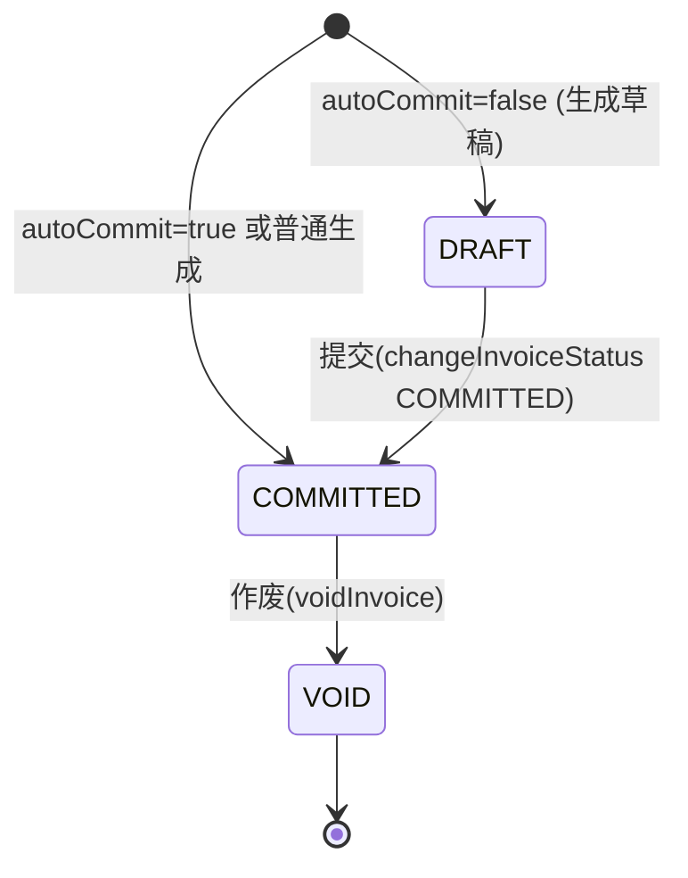
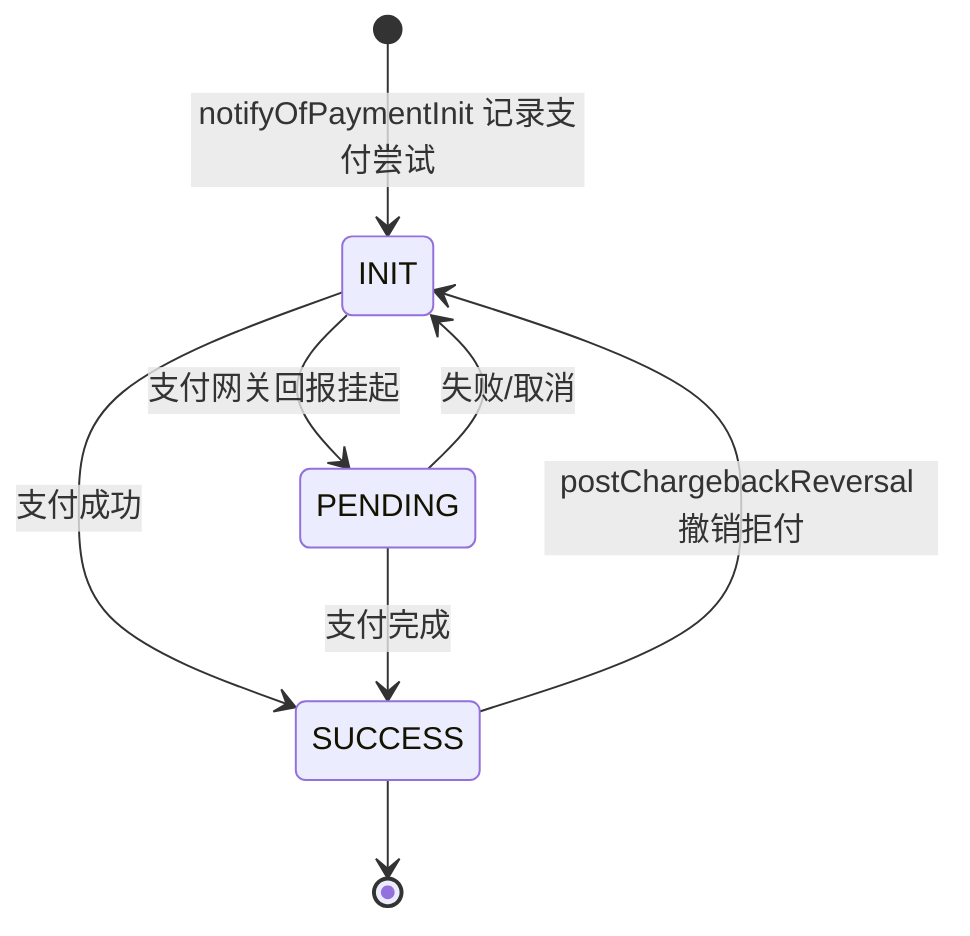
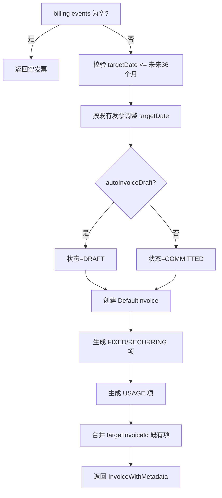
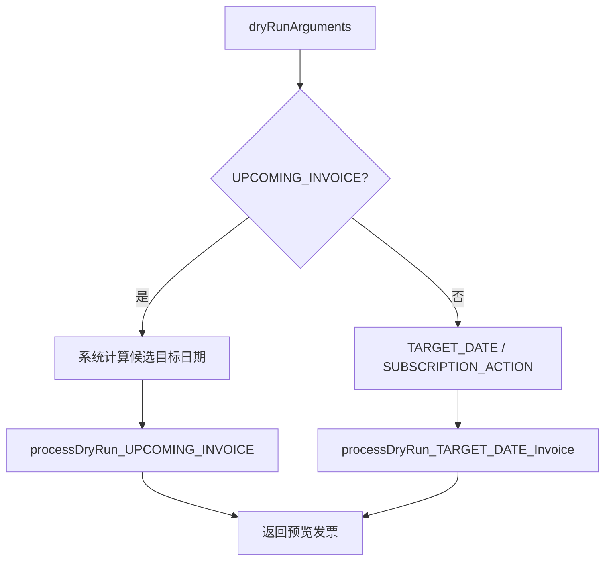
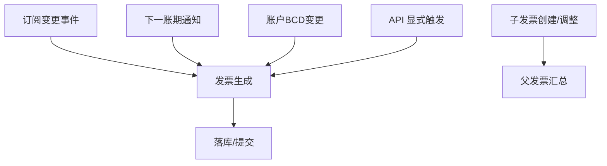
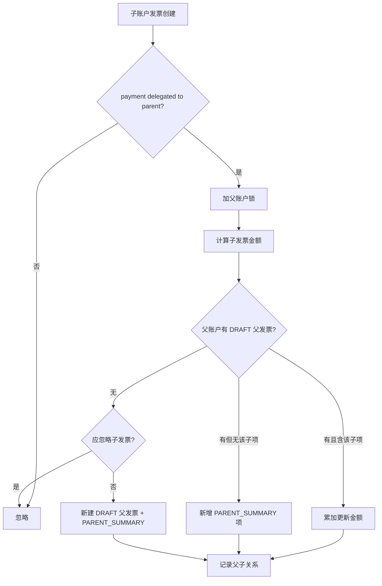
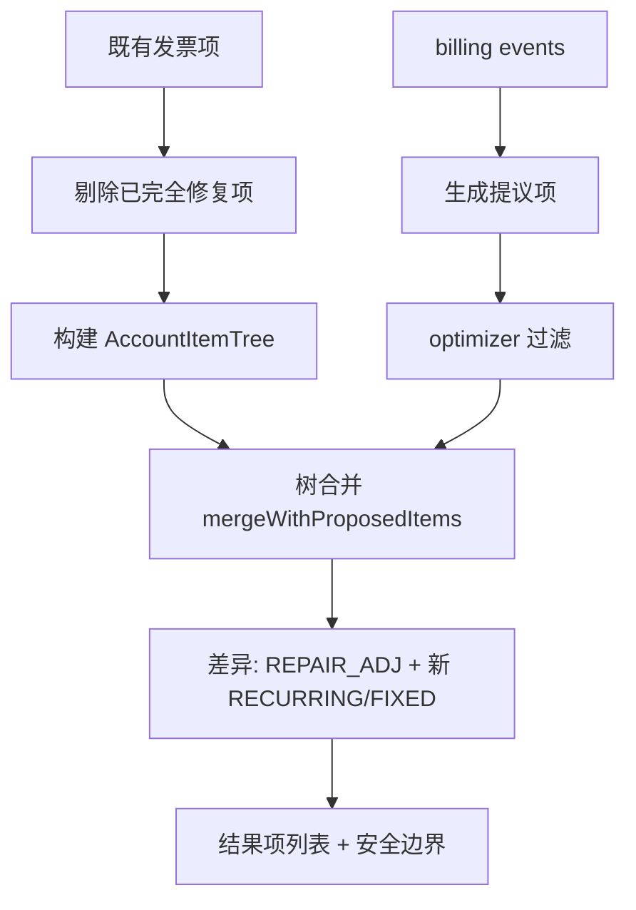
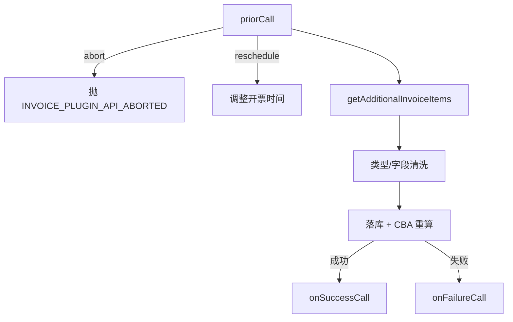

# 模块：invoice

> 本模块共 143 张卡（BR 106, ENT 13, ROLE 1, SM 2, TERM 12, WF 9）。

发票生成、状态机、余额与信用、父子账户（HA）汇总、用量计费与插件链。

本模块卡片见下（ID 为全局编号，与 rules.md / glossary.md 等一致）。

---

## BR-001 发票未来生成最大月数

- **类型**: 业务规则
- **同义词**: 发票生成未来月数, 最多提前几个月开票, 目标日期上限, max months in future, maxNumberOfMonthsInFuture, maxNumberOfMonthsInFuture
- **模块**: invoice
- **置信度**: 🟢 confirmed
- **溯源**: `util/src/main/java/org/killbill/billing/util/config/definition/InvoiceConfig.java:63-71`

**规则**：生成（或干跑 dry-run）发票时，最多只考虑未来 36 个月内的目标日期（targetDate）。配置项 `org.killbill.invoice.maxNumberOfMonthsInFuture`，默认值 `36`。

**用途**：限制一次性提前生成过多期发票，避免未来账期被过度预开。

## BR-002 发票防重复计费安全检查

- **类型**: 业务规则
- **同义词**: 防重复计费, 计费安全检查, 幂等保护, sanity check, sanitySafetyBoundEnabled, double billing
- **模块**: invoice
- **置信度**: 🟢 confirmed
- **溯源**: `util/src/main/java/org/killbill/billing/util/config/definition/InvoiceConfig.java:73-81`

**规则**：系统默认开启内部安全检查（`org.killbill.invoice.sanitySafetyBoundEnabled` = `true`），用于防止错误计费与重复计费（mis- and double-billing）。关闭后不推荐用于生产。

## BR-003 零金额用量项是否写出

- **类型**: 业务规则
- **同义词**: 零金额用量项, 0元用量, $0 usage, zero amount, disable.usage.zero.amount, isUsageZeroAmountDisabled
- **模块**: invoice
- **置信度**: 🟢 confirmed
- **溯源**: `util/src/main/java/org/killbill/billing/util/config/definition/InvoiceConfig.java:84-92`

**规则**：配置项 `org.killbill.invoice.disable.usage.zero.amount` 默认 `false`，即**默认会写出金额为 $0 的用量项**。设为 `true` 时禁用写入 $0 用量项（不生成零金额用量行）。

## BR-004 缺失历史用量记录时的处理

- **类型**: 业务规则
- **同义词**: 缺失用量记录, 用量数据缺失, missing usage, usage.missing.lenient, 用量宽容模式
- **模块**: invoice
- **置信度**: 🟢 confirmed
- **溯源**: `util/src/main/java/org/killbill/billing/util/config/definition/InvoiceConfig.java:94-102`

**规则**：配置项 `org.killbill.invoice.usage.missing.lenient` 默认 `false`（不宽容）。默认情况下，若发现过去存在缺失的用量记录，发票生成会**失败**；设为 `true` 时改为宽容处理，不因缺失用量记录而使发票失败。

## BR-005 每日每订阅最大发票项数

- **类型**: 业务规则
- **同义词**: 每日发票项上限, 每天最多开多少项, maxDailyNumberOfItemsSafetyBound, daily items safety bound
- **模块**: invoice
- **置信度**: 🟢 confirmed
- **溯源**: `util/src/main/java/org/killbill/billing/util/config/definition/InvoiceConfig.java:104-112`

**规则**：对单个订阅（subscription id）每日生成的发票项数量上限为 `15`。配置项 `org.killbill.invoice.maxDailyNumberOfItemsSafetyBound`，默认值 `15`，作为安全边界防止异常爆炸式开票。

## BR-006 干跑发票通知提前时间

- **类型**: 业务规则
- **同义词**: 干跑通知, 预开票通知, dry run notification, dryRunNotificationSchedule, 提前通知时间
- **模块**: invoice
- **置信度**: 🟢 confirmed
- **溯源**: `util/src/main/java/org/killbill/billing/util/config/definition/InvoiceConfig.java:114-122`

**规则**：DryRun（干跑）发票通知在目标日期（targetDate）**之前**发送。配置项 `org.killbill.invoice.dryRunNotificationSchedule` 默认 `0s`；当设为 `0s` 时该通知被忽略（不发送）。

## BR-007 原始用量回看账期数（usage lookback）

- **类型**: 业务规则
- **同义词**: 用量回看, 回看账期, usage lookback, readMaxRawUsagePreviousPeriod, 历史用量读取期数, 用量优化
- **模块**: invoice
- **置信度**: 🟢 confirmed
- **溯源**: `util/src/main/java/org/killbill/billing/util/config/definition/InvoiceConfig.java:124-132`

**规则**：用量优化（usage optimization）时，系统最多读取**过去 2 个账期**的原始用量（raw usage）数据。配置项 `org.killbill.invoice.readMaxRawUsagePreviousPeriod`，默认值 `2`。

**用途**：限制每期开票时回查历史原始用量的范围，用于处理迟到/跨期的用量点。

## BR-008 全局锁获取最大重试次数

- **类型**: 业务规则
- **同义词**: 全局锁重试, global lock retries, globalLock.retries, 锁重试次数
- **模块**: invoice
- **置信度**: 🟢 confirmed
- **溯源**: `util/src/main/java/org/killbill/billing/util/config/definition/InvoiceConfig.java:134-137`

**规则**：系统获取全局锁最多重试 `50` 次，每次等待 100ms。配置项 `org.killbill.invoice.globalLock.retries`，默认值 `50`。

## BR-009 默认发票插件

- **类型**: 业务规则
- **同义词**: 发票插件, invoice plugin, 默认插件, org.killbill.invoice.plugin
- **模块**: invoice
- **置信度**: 🟢 confirmed
- **溯源**: `util/src/main/java/org/killbill/billing/util/config/definition/InvoiceConfig.java:139-147`

**规则**：配置项 `org.killbill.invoice.plugin` 默认为空字符串 `""`，即默认不加载任何发票插件。可配置一个（逗号分隔的）发票插件名列表，插件可在发票生成过程中注入/调整发票项。

## BR-010 发票创建邮件通知开关

- **类型**: 业务规则
- **同义词**: 发票邮件通知, invoice email notification, emailNotificationsEnabled, 开票发邮件
- **模块**: invoice
- **置信度**: 🟢 confirmed
- **溯源**: `util/src/main/java/org/killbill/billing/util/config/definition/InvoiceConfig.java:149-152`

**规则**：配置项 `org.killbill.invoice.emailNotificationsEnabled` 默认 `false`。开启后，对已配置的账户在发票创建时发送邮件通知。

## BR-011 发票系统总开关

- **类型**: 业务规则
- **同义词**: 发票系统开关, invoicing enabled, invoice.enabled, 关闭开票
- **模块**: invoice
- **置信度**: 🟢 confirmed
- **溯源**: `util/src/main/java/org/killbill/billing/util/config/definition/InvoiceConfig.java:154-157`

**规则**：配置项 `org.killbill.invoice.enabled` 默认 `true`，即发票系统默认启用。设为 `false` 可整体关闭开票系统。

## BR-012 父发票自动提交时间

- **类型**: 业务规则
- **同义词**: 父发票提交, 父账户发票, parent invoice commit, parentAutoCommitUtcTime, HA发票提交时间
- **模块**: invoice
- **置信度**: 🟢 confirmed
- **溯源**: `util/src/main/java/org/killbill/billing/util/config/definition/InvoiceConfig.java:159-167`

**规则**：父账户（parent account）发票每天在指定 UTC 时间自动提交（commit）。配置项 `org.killbill.invoice.parent.commit.local.utc.time` 默认 `23:59:59.999`。

## BR-013 发票项结果报告模式

- **类型**: 业务规则
- **同义词**: 发票项结果模式, 聚合模式, 明细模式, aggregate vs detail, item.result.behavior.mode, UsageDetailMode
- **模块**: invoice
- **置信度**: 🟢 confirmed
- **溯源**: `util/src/main/java/org/killbill/billing/util/config/definition/InvoiceConfig.java:53-56`, `util/src/main/java/org/killbill/billing/util/config/definition/InvoiceConfig.java:174-182`

**规则**：发票项结果报告方式由 `org.killbill.invoice.item.result.behavior.mode` 控制，默认 `AGGREGATE`（聚合）；可选 `DETAIL`（明细）。对应枚举 `UsageDetailMode { AGGREGATE, DETAIL }`。

## BR-014 用量时区偏移模式

- **类型**: 业务规则
- **同义词**: 用量时区, 夏令时处理, usage timezone, usage.tz.mode, AccountTzOffset, 日光节约
- **模块**: invoice
- **置信度**: 🟢 confirmed
- **溯源**: `util/src/main/java/org/killbill/billing/util/config/definition/InvoiceConfig.java:39-51`, `util/src/main/java/org/killbill/billing/util/config/definition/InvoiceConfig.java:185-193`

**规则**：控制用量点（usage points）在夏令时（DST）下的归属，配置项 `org.killbill.invoice.usage.tz.mode`，默认 `FIXED`。
- `FIXED`：使用账户创建时一次性计算的固定时区偏移（与 RECURRING 发票项行为一致）。
- `VARIABLE`：按当前年内所处时间重新计算偏移，使相同 TZ/订阅/用量点的相似账户结果一致（夏/冬季开始时间不同也不受影响）。

## BR-015 in-arrear 计划计费模式

- **类型**: 业务规则
- **同义词**: 后付费模式, in arrear mode, inArrear.mode, GREEDY, 后计费策略
- **模块**: invoice
- **置信度**: 🟢 confirmed
- **溯源**: `util/src/main/java/org/killbill/billing/util/config/definition/InvoiceConfig.java:58-61`, `util/src/main/java/org/killbill/billing/util/config/definition/InvoiceConfig.java:195-203`

**规则**：配置项 `org.killbill.invoice.inArrear.mode` 默认 `DEFAULT`，决定系统对 in-arrear（后付费）计划的处理行为；可选 `GREEDY`。对应枚举 `InArrearMode { DEFAULT, GREEDY }`。

## BR-016 不可恢复异常时挂起账户

- **类型**: 业务规则
- **同义词**: 异常挂起账户, park on exceptions, parkAccountsOnAllExceptions, 发票处理失败挂起
- **模块**: invoice
- **置信度**: 🟢 confirmed
- **溯源**: `util/src/main/java/org/killbill/billing/util/config/definition/InvoiceConfig.java:215-223`

**规则**：配置项 `org.killbill.invoice.parkAccountsOnAllExceptions` 默认 `true`。当发票处理发生不可恢复失败（锁失败、订阅者异常、billing event 获取失败）时，默认将账户挂起。

## BR-017 发票生成最大回看时间

- **类型**: 业务规则
- **同义词**: 发票回看限制, 最大回看时间, maxInvoiceLimit, 开票时间下限, 追溯多久
- **模块**: invoice
- **置信度**: 🟢 confirmed
- **溯源**: `util/src/main/java/org/killbill/billing/util/config/definition/InvoiceConfig.java:37`, `util/src/main/java/org/killbill/billing/util/config/definition/InvoiceConfig.java:225-233`

**规则**：发票生成向前回看（look back）的时间上限由 `org.killbill.invoice.maxInvoiceLimit` 控制，默认 `DEFAULT_NULL_PERIOD` = `P200Y`（200 年，实际等于不限）。用于限定发票生成时追溯历史 billing events 的最远时间。

## BR-018 固定天数免分比

- **类型**: 业务规则
- **同义词**: 免分比, 分比天数, proration fixed days, proration.fixed.days, 避免按比例分摊
- **模块**: invoice
- **置信度**: 🟢 confirmed
- **溯源**: `util/src/main/java/org/killbill/billing/util/config/definition/InvoiceConfig.java:235-243`

**规则**：配置项 `org.killbill.invoice.proration.fixed.days` 默认 `0`。设置一个月内的固定天数以避免分比（proration）；`0` 表示不启用该固定天数行为。

## BR-019 发票余额计算（balance）

- **类型**: 业务规则
- **同义词**: 发票余额, 欠款, 应收, invoice balance, getBalance, outstanding amount, 未付金额, 余额怎么算
- **模块**: invoice
- **置信度**: 🟢 confirmed
- **溯源**: `invoice/src/main/java/org/killbill/billing/invoice/calculator/InvoiceCalculatorUtils.java:96-110`

**规则**：发票原始余额 `computeRawInvoiceBalance` = **计费金额合计 − 已付金额合计（含退款）**：
- `amountPaid = computeInvoiceAmountPaid + computeInvoiceAmountRefunded`
- `chargedAmount = computeInvoiceAmountCharged + computeInvoiceAmountCredited + computeInvoiceAmountAdjustedForAccountCredit`
- `invoiceBalance = chargedAmount + (−amountPaid)`

## BR-020 发票余额为零的情形

- **类型**: 业务规则
- **同义词**: 余额为零, 无需付款, zero balance, 已核销, 草稿发票余额, 作废发票余额, written off
- **模块**: invoice
- **置信度**: 🟢 confirmed
- **溯源**: `invoice/src/main/java/org/killbill/billing/invoice/model/DefaultInvoice.java:273-288`

**规则**：满足以下任一条件时，`getBalance()` 直接返回 `BigDecimal.ZERO`：
1. 发票已核销（`isWrittenOff()`）；
2. 迁移发票（`isMigrationInvoice()`）；
3. 状态为 `DRAFT`；
4. 状态为 `VOID`；
5. 父发票余额为 0（`hasZeroParentBalance()`）。
否则按 BR-019 的公式计算。

## BR-021 发票已付金额（paid amount）

- **类型**: 业务规则
- **同义词**: 已付金额, 已支付, paid amount, amountPaid, 付款统计
- **模块**: invoice
- **置信度**: 🟢 confirmed
- **溯源**: `invoice/src/main/java/org/killbill/billing/invoice/calculator/InvoiceCalculatorUtils.java:207-223`

**规则**：`computeInvoiceAmountPaid` 只累计**支付状态为 SUCCESS 且类型为 ATTEMPT** 的发票支付金额。其他支付状态或类型的记录不计入已付金额。

## BR-022 发票已退款金额（refunded amount）

- **类型**: 业务规则
- **同义词**: 已退款金额, 退款统计, refunded amount, 拒付金额, charged back
- **模块**: invoice
- **置信度**: 🟢 confirmed
- **溯源**: `invoice/src/main/java/org/killbill/billing/invoice/calculator/InvoiceCalculatorUtils.java:225-242`

**规则**：`computeInvoiceAmountRefunded` 只累计**支付状态为 SUCCESS 且类型为 REFUND 或 CHARGED_BACK** 的金额。非 SUCCESS 的记录跳过。

## BR-023 发票计费金额组成（charged amount）

- **类型**: 业务规则
- **同义词**: 计费金额, 应收金额, charged amount, amountCharged, 发票总额, 账单金额
- **模块**: invoice
- **置信度**: 🟢 confirmed
- **溯源**: `invoice/src/main/java/org/killbill/billing/invoice/calculator/InvoiceCalculatorUtils.java:157-174`

**规则**：`computeInvoiceAmountCharged` 累加满足以下任一条件的发票项金额：
- 收费项（TAX / EXTERNAL_CHARGE / FIXED / USAGE / RECURRING）；或
- 发票级调整项（CREDIT_ADJ，且该发票不是“信用发票”本身）；或
- 项调整（ITEM_ADJ / REPAIR_ADJ）；或
- 父账户汇总项（PARENT_SUMMARY）。

## BR-024 子发票金额（父账户汇总）

- **类型**: 业务规则
- **同义词**: 子发票金额, 父账户汇总, child invoice amount, parent summary, HA子账户金额
- **模块**: invoice
- **置信度**: 🟢 confirmed
- **溯源**: `invoice/src/main/java/org/killbill/billing/invoice/calculator/InvoiceCalculatorUtils.java:112-131`

**规则**：`computeChildInvoiceAmount` 计算应在父发票上汇总的子账户金额：
- 若子发票**无收费项**，返回其信用金额（credited）的负值（仅把信用额从父项金额中扣减）；
- 否则返回 `charged + credited + adjustedForAccountCredit` 的合计。

## BR-025 信用发票识别（CREDIT_ADJ + CBA_ADJ）

- **类型**: 业务规则
- **同义词**: 信用发票, 账户信用, credit invoice, CREDIT_ADJ, CBA_ADJ, 信用余额, account credit
- **模块**: invoice
- **置信度**: 🟢 confirmed
- **溯源**: `invoice/src/main/java/org/killbill/billing/invoice/calculator/InvoiceCalculatorUtils.java:46-70`

**规则**：当一张发票**恰好只有 2 个发票项**，且其中一项为 `CREDIT_ADJ`、另一项为 `CBA_ADJ` 且两者 `invoiceId` 相同、金额互为相反数时，判定为“信用发票”。信用发票允许其 `CREDIT_ADJ` 金额被计入余额调整。

## BR-026 账户信用（CBA）生成与使用规则

- **类型**: 业务规则
- **同义词**: 账户信用, 信用余额, credit balance adjustment, CBA, CBA_ADJ, 抵扣余额, 信用生成, 信用使用
- **模块**: invoice
- **置信度**: 🟢 confirmed
- **溯源**: `invoice/src/main/java/org/killbill/billing/invoice/dao/CBADao.java:63-97`

**规则**：计算发票的信用余额调整（CBA）时：
1. 若发票**余额 < 0**（负余额）→ 生成一条**正向信用**（CBA 项金额取负值，即给账户增加可用信用）。
2. 若发票**余额 > 0** 且发票状态为 `COMMITTED`、**无 PENDING 支付**、且**未核销** → 使用账户已有信用抵扣该发票（消费额 = min(账户 CBA, 发票余额)），生成负向 CBA 项。
3. 若余额为 0 → 不做任何处理。

## BR-027 账户信用按发票日期分配给未付发票

- **类型**: 业务规则
- **同义词**: 信用分配, 抵扣未付发票, distribute CBA, 信用抵扣顺序, account credit allocation
- **模块**: invoice
- **置信度**: 🟢 confirmed
- **溯源**: `invoice/src/main/java/org/killbill/billing/invoice/dao/CBADao.java:172-218`

**规则**：账户可用信用（CBA）会被分配到所有 **COMMITTED 且未付** 的发票上，分配顺序按 `invoiceDate` **升序**（先旧后新），逐张抵扣直到信用耗尽或发票付清。每张发票的抵扣额 = min(剩余信用, 该发票余额)。

## BR-028 发票目标日期上限校验（未来 36 个月）

- **类型**: 业务规则
- **同义词**: 目标日期过远, target date too far, 未来开票上限, INVOICE_TARGET_DATE_TOO_FAR_IN_THE_FUTURE
- **模块**: invoice
- **置信度**: 🟢 confirmed
- **溯源**: `invoice/src/main/java/org/killbill/billing/invoice/generator/DefaultInvoiceGenerator.java:120-126`

**规则**：生成发票时校验目标日期：若 `targetDate` 与当前 UTC 今天的月差**大于** `org.killbill.invoice.maxNumberOfMonthsInFuture`（默认 36），则抛出 `InvoiceApiException`，错误码 `INVOICE_TARGET_DATE_TOO_FAR_IN_THE_FUTURE`。

## BR-029 发票目标日期自动前推（避免回溯重复开票）

- **类型**: 业务规则
- **同义词**: 目标日期调整, adjust target date, 已有未来发票, 防止重复开票
- **模块**: invoice
- **置信度**: 🟢 confirmed
- **溯源**: `invoice/src/main/java/org/killbill/billing/invoice/generator/DefaultInvoiceGenerator.java:128-154`

**规则**：生成发票前，若账户已存在**含 RECURRING 或 USAGE 项**、且其 `targetDate` 晚于本次请求的 `targetDate` 的发票，则把本次 `targetDate` 上调为这些发票中最晚的 `targetDate`（防止对已开票区间重复开票）。

## BR-030 作废发票（VOID）的前置校验

- **类型**: 业务规则
- **同义词**: 作废发票, 发票作废, void invoice, 不能作废, CAN_NOT_VOID, 已支付不能作废, 已修复不能作废
- **模块**: invoice
- **置信度**: 🟢 confirmed
- **溯源**: `invoice/src/main/java/org/killbill/billing/invoice/api/user/DefaultInvoiceUserApi.java:753-825`

**规则**：调用 `voidInvoice` 时依次校验（任一失败即抛 InvoiceApiException）：
1. 若发票状态为 `COMMITTED`：
   - 若发票已被修复（`isRepaired`）→ 抛 `CAN_NOT_VOID_INVOICE_THAT_IS_REPAIRED`；
   - 若发票含“已使用过的正向 CBA 信用” → 抛 `CAN_NOT_VOID_INVOICE_THAT_GENERATED_USED_CREDIT`。
2. 若发票已有支付且已付金额（含退款）≠ 0 → 抛 `CAN_NOT_VOID_INVOICE_THAT_IS_PAID`。
3. 通过后将状态改为 `VOID`。

## BR-031 提交草稿发票（commit）

- **类型**: 业务规则
- **同义词**: 提交发票, 确认发票, commit invoice, 草稿转正式, DRAFT 转 COMMITTED
- **模块**: invoice
- **置信度**: 🟢 confirmed
- **溯源**: `invoice/src/main/java/org/killbill/billing/invoice/api/user/DefaultInvoiceUserApi.java:688-708`

**规则**：`commitInvoice` 将发票状态改为 `COMMITTED`，随后更新其计费截止日期（charged-through dates），并通过发票插件链以 `INVOICE_OPERATION=commit` 派发。

## BR-032 外部收费与信用金额校验

- **类型**: 业务规则
- **同义词**: 外部收费, 手动收费, external charge, 信用金额校验, 金额必须为正, CREDIT_AMOUNT_INVALID, EXTERNAL_CHARGE_AMOUNT_INVALID
- **模块**: invoice
- **置信度**: 🟢 confirmed
- **溯源**: `invoice/src/main/java/org/killbill/billing/invoice/api/user/DefaultInvoiceUserApi.java:556-600`, `invoice/src/main/java/org/killbill/billing/invoice/api/user/DefaultInvoiceUserApi.java:638-646`

**规则**：
- 外部收费（EXTERNAL_CHARGE）或信用（CREDIT_ADJ）金额若为 null 或 < 0 → 抛 `EXTERNAL_CHARGE_AMOUNT_INVALID` / `CREDIT_AMOUNT_INVALID`（金额必须为正）。
- 金额币种必须与账户币种一致，否则 `CURRENCY_INVALID`。
- 若把费用加到**已存在的发票**上：该发票为 `COMMITTED` → 抛 `INVOICE_ALREADY_COMMITTED`；为 `VOID` → 抛 IllegalStateException；仅 `DRAFT` 允许。
- 信用项在写入时金额会被**取负**（`amount.negate()`）。

## BR-033 账户余额与账户信用余额查询

- **类型**: 业务规则
- **同义词**: 账户余额, 账户信用, account balance, account CBA, getAccountBalance, getAccountCBA, 余额查询
- **模块**: invoice
- **置信度**: 🟢 confirmed
- **溯源**: `invoice/src/main/java/org/killbill/billing/invoice/api/user/DefaultInvoiceUserApi.java:229-239`

**规则**：`getAccountBalance(accountId)` 与 `getAccountCBA(accountId)` 从数据库聚合；当结果为空（null）时统一返回 `BigDecimal.ZERO`。

## BR-034 子账户信用转给父账户

- **类型**: 业务规则
- **同义词**: 子账户信用转移, 信用转父账户, transferChildCreditToParent, CHILD_ACCOUNT_MISSING_CREDIT, 父子账户信用
- **模块**: invoice
- **置信度**: 🟢 confirmed
- **溯源**: `invoice/src/main/java/org/killbill/billing/invoice/api/user/DefaultInvoiceUserApi.java:709-731`

**规则**：`transferChildCreditToParent` 前置条件：
1. 子账户必须**存在父账户**，否则抛 `ACCOUNT_DOES_NOT_HAVE_PARENT_ACCOUNT`；
2. 子账户账户信用（CBA）必须 **> 0**，否则抛 `CHILD_ACCOUNT_MISSING_CREDIT`；
3. 通过后将子账户信用转移给父账户。

## BR-035 发票项调整（ITEM_ADJ）校验

- **类型**: 业务规则
- **同义词**: 发票项调整, 条目调整, item adjustment, ITEM_ADJ, INVOICE_ITEM_ADJUSTMENT_AMOUNT_SHOULD_BE_POSITIVE, 调整金额
- **模块**: invoice
- **置信度**: 🟢 confirmed
- **溯源**: `invoice/src/main/java/org/killbill/billing/invoice/api/user/DefaultInvoiceUserApi.java:409-451`

**规则**：`insertInvoiceItemAdjustment`：
1. 若指定了调整金额且 ≤ 0 → 抛 `INVOICE_ITEM_ADJUSTMENT_AMOUNT_SHOULD_BE_POSITIVE`；
2. 目标发票状态为 `VOID` → 抛 `INVOICE_VOID_UPDATED`（作废发票不可调整）；
3. 指定币种必须与发票币种一致，否则 `CURRENCY_INVALID`；
4. 会为被调整项生成一条 `ITEM_ADJ` 项。

## BR-036 发票核销（written off）标记

- **类型**: 业务规则
- **同义词**: 发票核销, 坏账核销, write off, WRITTEN_OFF, tagInvoiceAsWrittenOff, 不再收款
- **模块**: invoice
- **置信度**: 🟢 confirmed
- **溯源**: `invoice/src/main/java/org/killbill/billing/invoice/api/user/DefaultInvoiceUserApi.java:313-335`

**规则**：对发票打上 `WRITTEN_OFF` 控制标签即表示核销（`tagInvoiceAsWrittenOff`），移除该标签为取消核销（`tagInvoiceAsNotWrittenOff`）。核销后发票余额恒为 0（见 BR-020），并会向总线发送发票调整事件（用于 overdue 等）。

## BR-037 用量重复计费防护（tracking id + 已开票区间跳过）

- **类型**: 业务规则
- **同义词**: 用量去重, 防止重复计费, usage dedup, tracking id, 已开票跳过, double billing usage
- **模块**: invoice
- **置信度**: 🟢 confirmed
- **溯源**: `invoice/src/main/java/org/killbill/billing/invoice/usage/ContiguousIntervalUsageInArrear.java:290-307`, `invoice/src/main/java/org/killbill/billing/invoice/usage/ContiguousIntervalUsageInArrear.java:333-356`

**规则**：
1. 每条原始用量带 tracking id；只有**不在既有 tracking id 集合**中的用量才会被计费（新增用量）。
2. 若某个用量区间已被既有 `USAGE` 发票项覆盖（同 usage name 且 start/end 落入既有项内），则**跳过**该区间，避免重复计费（尤其阻断/重跑场景）。

## BR-038 目录中未定义的用量单位处理

- **类型**: 业务规则
- **同义词**: 未知用量单位, unknown usage unit, unit type not defined, 挂起账户, park account usage
- **模块**: invoice
- **置信度**: 🟢 confirmed
- **溯源**: `invoice/src/main/java/org/killbill/billing/invoice/usage/ContiguousIntervalUsageInArrear.java:485-505`

**规则**：当上报的用量单位类型（unitType）**未在任何 billing event 的目录中定义**时：
- 若 `org.killbill.invoice.parkAccountsWithUnknownUsage` = `true` → 抛 `InvoiceApiException`（ILLEGAL INVOICING STATE），导致账户被挂起；
- 否则 → 记录告警并**忽略**该单位类型，同时移除其关联的 tracking id。

## BR-039 用量计费区间按 BCD 对齐

- **类型**: 业务规则
- **同义词**: 用量账期, BCD 对齐, billing cycle day, usage interval, 计费周期划分, transition time
- **模块**: invoice
- **置信度**: 🟢 confirmed
- **溯源**: `invoice/src/main/java/org/killbill/billing/invoice/usage/ContiguousIntervalUsageInArrear.java:155-254`

**规则**：用量计费区间（transitionTimes）按订阅的 **BCD（bill cycle day）** 与用量 billingPeriod 对齐划分；首个与最后区间可能是不完整的（受订阅创建/取消/targetDate 影响）。取消发生的当日用量（cancellation day）会被特殊纳入最后一个区间一并计费。

## BR-040 手动支付账户的发票渲染

- **类型**: 业务规则
- **同义词**: 手动支付, manual pay, MANUAL_PAY, 线下支付, 发票渲染
- **模块**: invoice
- **置信度**: 🟢 confirmed
- **溯源**: `invoice/src/main/java/org/killbill/billing/invoice/api/user/DefaultInvoiceUserApi.java:483-493`

**规则**：生成发票 HTML（`getInvoiceAsHTML`）时，若账户带有 `MANUAL_PAY` 控制标签，则以 `manualPay=true` 渲染发票，表示该账户走**手动/线下支付**而非自动扣款。

## BR-041 发票优化时间边界（cutoff / maxInvoiceLimit）

- **类型**: 业务规则
- **同义词**: 发票优化, invoice optimization, cutoff date, maxInvoiceLimit, 历史发票截断, 性能优化
- **模块**: invoice
- **置信度**: 🟢 confirmed
- **溯源**: `invoice/src/main/java/org/killbill/billing/invoice/optimizer/InvoiceOptimizerExp.java:67-88`

**规则**：当 `org.killbill.invoice.maxInvoiceLimit` 已设置且不等于默认 `P200Y` 时：
- 发票 cutoffDt = 当前 UTC 时间 `−` maxInvoiceLimit；
- billing event 的 cutoff beCutoffDt = cutoffDt `−` maxInvoiceLimit（比发票再多回溯一个周期，用于支持 in-arrear 尾部分摊）；
- 只加载 cutoffDt 之后的既有发票参与本次开票。

## BR-042 建议开票项过滤（optimizer filterProposedItems）

- **类型**: 业务规则
- **同义词**: 开票项过滤, proposed items, 避免重复开票, filterProposedItems, 抵消项
- **模块**: invoice
- **置信度**: 🟢 confirmed
- **溯源**: `invoice/src/main/java/org/killbill/billing/invoice/optimizer/InvoiceOptimizerExp.java:100-170`

**规则**：若设置了 cutoffDate，对**提议的** RECURRING/FIXED 发票项过滤：
- `FIXED`：保留 `startDate >= cutoffDate`；
- `RECURRING` 且 billing mode 为 `IN_ADVANCE`：保留 `startDate >= cutoffDate`；
- `RECURRING` 且 billing mode 为 `IN_ARREAR`：保留 `endDate >= cutoffDate`；
- 否则：若既有发票中存在相同 subscriptionId 且相同 startDate 的 RECURRING 项则保留（便于后续抵消），其余丢弃。

## BR-043 用量仅支持后付费（IN_ARREAR）

- **类型**: 业务规则
- **同义词**: 后付费, in arrear, 用量后计费, BillingMode, IN_ARREAR, 用量计费模式
- **模块**: invoice
- **置信度**: 🟢 confirmed
- **溯源**: `invoice/src/main/java/org/killbill/billing/invoice/usage/UsageUtils.java:36`, `invoice/src/main/java/org/killbill/billing/invoice/usage/UsageUtils.java:57`, `invoice/src/main/java/org/killbill/billing/invoice/usage/UsageUtils.java:70`, `invoice/src/main/java/org/killbill/billing/invoice/usage/UsageUtils.java:77`

**规则**：用量计费的各种取层/取单位方法均以 `Preconditions` 强制要求 `usage.getBillingMode() == BillingMode.IN_ARREAR`（后付费）——用量只在账单周期结束后计费，且 tiers 不能为空。

## BR-044 父发票提交通知去重

- **类型**: 业务规则
- **同义词**: 通知去重, parent invoice notification dedup, 重复通知
- **模块**: invoice
- **置信度**: 🟢 confirmed
- **溯源**: `invoice/src/main/java/org/killbill/billing/invoice/notification/ParentInvoiceCommitmentPoster.java:58-88`

**规则**：插入父发票提交通知前，检查队列中是否已存在**相同生效日期且相同 invoiceId** 的未来通知；若存在则跳过（不重复记录）。

## BR-045 订阅 EXPIRED 事件不触发开票

- **类型**: 业务规则
- **同义词**: 过期事件, EXPIRED, 订阅到期, 不触发开票, subscription expired
- **模块**: invoice
- **置信度**: 🟢 confirmed
- **溯源**: `invoice/src/main/java/org/killbill/billing/invoice/InvoiceListener.java:266-271`

**规则**：当订阅事件类型为 `SubscriptionBaseTransitionType.EXPIRED` 时，`handleSubscriptionTransition` 不把该事件交给发票处理（即订阅过期本身不触发新的开票）。

## BR-046 发票系统关闭时挂起账户

- **类型**: 业务规则
- **同义词**: 发票系统关闭, invoicing off, invoice.enabled=false, 挂起账户, park account
- **模块**: invoice
- **置信度**: 🟢 confirmed
- **溯源**: `invoice/src/main/java/org/killbill/billing/invoice/InvoiceDispatcher.java:289-300`

**规则**：当 `org.killbill.invoice.enabled` = `false`（发票系统关闭）时，来自通知/总线事件的账户处理会**直接挂起该账户**并返回空结果（不生成发票）。

## BR-047 已挂起账户跳过开票

- **类型**: 业务规则
- **同义词**: 挂起账户, parked account, 跳过开票, 账户暂停, isParked
- **模块**: invoice
- **置信度**: 🟢 confirmed
- **溯源**: `invoice/src/main/java/org/killbill/billing/invoice/InvoiceDispatcher.java:311-320`

**规则**：若账户处于挂起（parked）状态且本次调用**不是 API 调用**，则本次发票生成被忽略（返回空）。API 调用（isApiCall=true）仍会尝试开票。

## BR-048 发票生成的账户级全局锁

- **类型**: 业务规则
- **同义词**: 全局锁, account lock, ACCNT_INV_PAY, 发票并发锁, 加锁失败重试
- **模块**: invoice
- **置信度**: 🟢 confirmed
- **溯源**: `invoice/src/main/java/org/killbill/billing/invoice/InvoiceDispatcher.java:322-338`

**规则**：非 dry-run 的发票生成会对账户加全局锁（锁类型 `ACCNT_INV_PAY`），最多重试 `org.killbill.invoice.globalLock.retries`（默认 50）次。
- 加锁失败且为 API 调用 → 抛 `InvoiceApiException`（UNEXPECTED_ERROR，“failed to acquire lock”）；
- 加锁失败且非 API 调用 → 抛 `QueueRetryException`，按 `rescheduleIntervalOnLock` 之后重试。

## BR-049 干跑通知仅余额大于 0 时发送

- **类型**: 业务规则
- **同义词**: 干跑通知, 余额大于0, 发票通知事件, invoice notification, dryRun balance
- **模块**: invoice
- **置信度**: 🟢 confirmed
- **溯源**: `invoice/src/main/java/org/killbill/billing/invoice/InvoiceDispatcher.java:264-280`

**规则**：`processSubscriptionForInvoiceNotification` 干跑生成发票后，**仅当该预览发票余额 > 0** 时才向总线发送 `InvoiceNotificationInternalEvent`（用于“即将开票”提醒）。

## BR-050 哪些子发票可被父发票忽略

- **类型**: 业务规则
- **同义词**: 忽略子发票, shouldIgnoreChildInvoice, 负金额子发票, 零金额子发票
- **模块**: invoice
- **置信度**: 🟢 confirmed
- **溯源**: `invoice/src/main/java/org/killbill/billing/invoice/InvoiceDispatcher.java:1407-1425`

**规则**：父发票汇总时对子发票的判断：
- 子发票金额 **< 0**（信用）→ **忽略**（该信用将在下次开票中使用）；
- 子发票金额 **> 0** → 不忽略；
- 子发票金额 **== 0** → 仅当子发票中**没有 FIXED 或 RECURRING 项**时忽略；若含这两类项则不忽略（保留 0 金额汇总）。

## BR-051 父发票的项调整传播

- **类型**: 业务规则
- **同义词**: 父发票调整, parent adjustment, PARENT_SUMMARY 调整, 子发票调整传播
- **模块**: invoice
- **置信度**: 🟢 confirmed
- **溯源**: `invoice/src/main/java/org/killbill/billing/invoice/InvoiceDispatcher.java:1427-1500`

**规则**：对子发票做项调整（ITEM_ADJ）时同步到父发票：
- 若子发票**无父发票** → 抛 `INVOICE_MISSING_PARENT_INVOICE`；
- 若父发票**原始余额为 0**（已结清）→ 忽略调整；
- 取子发票中**最新一条 ITEM_ADJ**；若父发票状态为 `COMMITTED` → 在父发票上新增一条 `ITEM_ADJ`；否则 → 更新对应 `PARENT_SUMMARY` 项的金额。

## BR-052 父发票余额为 0 时子发票的余额算法

- **类型**: 业务规则
- **同义词**: 子发票余额, parent balance zero, 父子余额, HA balance
- **模块**: invoice
- **置信度**: 🟢 confirmed
- **溯源**: `invoice/src/main/java/org/killbill/billing/invoice/dao/CBADao.java:100-124`

**规则**：若子发票**存在父发票且父发票原始余额为 0**，则子发票余额 = `子发票计费金额 − 父发票上归属该子账户的项金额之和`；否则使用常规发票原始余额。

## BR-053 修复项（REPAIR_ADJ）金额上限

- **类型**: 业务规则
- **同义词**: 修复冲销, REPAIR_ADJ, repair, 冲销上限, 修复金额, repair amount
- **模块**: invoice
- **置信度**: 🟢 confirmed
- **溯源**: `invoice/src/main/java/org/killbill/billing/invoice/tree/Item.java:182-200`, `invoice/src/main/java/org/killbill/billing/invoice/tree/Item.java:212-218`

**规则**：当既有发票项在新一轮开票中需要被冲销（REPAIR）时，生成一条**负金额** `RepairAdjInvoiceItem`：
- 修复上限 `maxAmountForRepair = min(按新日期分比后的金额, 该项净额)`；
- 净额 `netAmount = amount − adjustedAmount − currentRepairedAmount`；
- 已完全调整的项（`amount − adjustedAmount == 0`）为 `isFullyAdjusted`。

## BR-054 分比计算（Proration）

- **类型**: 业务规则
- **同义词**: 分比, 按比例计费, proration, 按天计费, 不足整周期, prorate
- **模块**: invoice
- **置信度**: 🟢 confirmed
- **溯源**: `invoice/src/main/java/org/killbill/billing/invoice/tree/Item.java:152-168`, `invoice/src/main/java/org/killbill/billing/invoice/tree/Item.java:182-189`

**规则**：分比金额 = `calculateProrationBetweenDates(newStart, newEnd, 总天数, prorationFixedDays) × amount`。
- 总天数默认 = `startDate` 到 `endDate` 的实际天数；当 `org.killbill.invoice.proration.fixed.days > 0` 时用该固定天数作分母；
- 区间被拆分（split）时按 `splitDate` 分为 `[start, split]` 与 `[split, end]` 两段，金额按比例分配。

## BR-055 原始用量优化的起始日期（用量回看）

- **类型**: 业务规则
- **同义词**: 用量回看起点, optimized start date, raw usage optimization, readMaxRawUsagePreviousPeriod, 用量拉取范围
- **模块**: invoice
- **置信度**: 🟢 confirmed
- **溯源**: `invoice/src/main/java/org/killbill/billing/invoice/usage/RawUsageOptimizer.java:77-137`

**规则**：计算拉取原始用量的优化起始日期：
- 若 `org.killbill.invoice.readMaxRawUsagePreviousPeriod ≥ 0`：对每个已知用量的 billingPeriod，从最近一次 consumable in-arrear 用量项的 `endDate` 回退该配置指定的周期数，取所有账期中的最早值，再与 `firstEventStartDate` 取较晚者作为起点；
- 若配置 < 0：直接返回 `firstEventStartDate`。
- 特殊路径：当 `isUsageZeroAmountDisabled=true` 时改用 `min(今天, targetDate)` 回退 1 个周期来估算（避免漏开旧账期时拉取不足）。

## BR-056 发票配置支持多租户覆盖

- **类型**: 业务规则
- **同义词**: 多租户配置, tenant config override, MultiTenantInvoiceConfig, 租户级配置
- **模块**: invoice
- **置信度**: 🟢 confirmed
- **溯源**: `invoice/src/main/java/org/killbill/billing/invoice/config/MultiTenantInvoiceConfig.java:46-58`, `invoice/src/main/java/org/killbill/billing/invoice/config/MultiTenantInvoiceConfig.java:311-315`

**规则**：绝大多数 `InvoiceConfig` 配置项支持**按租户覆盖**（`getStringTenantConfig`）：租户若配置了同名项则优先使用，否则回退到静态（全局）配置。枚举型配置的非法值会回退默认值（`UsageDetailMode`→AGGREGATE、`AccountTzOffset`→FIXED、`InArrearMode`→DEFAULT）。注意 `getMaxGlobalLockRetries` 与若干无参方法仅用静态配置，不支持租户覆盖。

## BR-057 迁移发票余额恒为 0

- **类型**: 业务规则
- **同义词**: 迁移发票, migration invoice, isMigrated, 余额为0, 历史数据导入
- **模块**: invoice
- **置信度**: 🟢 confirmed
- **溯源**: `invoice/src/main/java/org/killbill/billing/invoice/dao/InvoiceModelDaoHelper.java:33-46`

**规则**：对 `isMigrated()` 为 true 的发票，`getRawBalanceForRegularInvoice` 直接返回 `BigDecimal.ZERO`，不做金额计算。

## BR-058 发票项类型与实现类映射

- **类型**: 业务规则
- **同义词**: 发票项映射, item factory, InvoiceItemFactory, type mapping, 类型对应类
- **模块**: invoice
- **置信度**: 🟢 confirmed
- **溯源**: `invoice/src/main/java/org/killbill/billing/invoice/model/InvoiceItemFactory.java:90-124`

**规则**：从持久层重建发票项时按类型映射到实现类：
- `EXTERNAL_CHARGE`→`ExternalChargeInvoiceItem`
- `FIXED`→`FixedPriceInvoiceItem`
- `RECURRING`→`RecurringInvoiceItem`
- `CBA_ADJ`→`CreditBalanceAdjInvoiceItem`
- `CREDIT_ADJ`→`CreditAdjInvoiceItem`
- `REPAIR_ADJ`→`RepairAdjInvoiceItem`
- `ITEM_ADJ`→`ItemAdjInvoiceItem`
- `USAGE`→`UsageInvoiceItem`
- `TAX`→`TaxInvoiceItem`
- `PARENT_SUMMARY`→`ParentInvoiceItem`
- 其他未知类型 → 抛 RuntimeException。

## BR-059 加锁失败时的重试时间表

- **类型**: 业务规则
- **同义词**: 锁重试间隔, rescheduleIntervalOnLock, 重排发票, 锁被占用重试
- **模块**: invoice
- **置信度**: 🟢 confirmed
- **溯源**: `util/src/main/java/org/killbill/billing/util/config/definition/LockAwareConfig.java:30-38`

**规则**：当发票运行因账户锁被占用而无法执行时，按配置项 `org.killbill.rescheduleIntervalOnLock` 的延迟序列重排。默认值 `"30s, 1m, 1m, 3m, 3m, 10m"`（依次 30秒、1分、1分、3分、3分、10分后重试）。

## BR-060 未付发票的判定

- **类型**: 业务规则
- **同义词**: 未付发票, unpaid invoice, 欠费发票, 未结清, outstanding invoice
- **模块**: invoice
- **置信度**: 🟢 confirmed
- **溯源**: `invoice/src/main/java/org/killbill/billing/invoice/dao/InvoiceDaoHelper.java:189-203`

**规则**：一张发票被视为**未付**当且仅当同时满足：
1. 状态为 `COMMITTED`；
2. 余额 ≥ 1（即 > 0）；
3. 未核销（`!isWrittenOff`）；
4.（可选）`targetDate` 落在指定的 `[startDate, upToDate]` 范围内。
若发票存在父发票，则以父发票计算余额。

## BR-061 发票状态变更的约束与副作用

- **类型**: 业务规则
- **同义词**: 状态变更, changeInvoiceStatus, 作废副作用, 提交副作用, INVOICE_INVALID_STATUS
- **模块**: invoice
- **置信度**: 🟢 confirmed
- **溯源**: `invoice/src/main/java/org/killbill/billing/invoice/dao/DefaultInvoiceDao.java:1387-1414`

**规则**：变更发票状态时：
- 若新状态与当前状态相同，或当前状态已是 `VOID` → 抛 `INVOICE_INVALID_STATUS`；
- 变更后重算账户信用（CBA complexity）；
- 变更为 `COMMITTED` → 发送**发票创建事件**（InvoiceCreationEvent）；
- 变更为 `VOID` → 发送**发票调整事件**，并**停用**该发票关联的用量 tracking ids（避免已作废发票的用量被重复计费）。

## BR-062 完全修复项的剔除（InvoicePruner）

- **类型**: 业务规则
- **同义词**: 完全修复, fully repaired, InvoicePruner, 修复闭合, 避免重复修复
- **模块**: invoice
- **置信度**: 🟢 confirmed
- **溯源**: `invoice/src/main/java/org/killbill/billing/invoice/generator/InvoicePruner.java:88-99`, `invoice/src/main/java/org/killbill/billing/invoice/generator/InvoicePruner.java:156-232`

**规则**：构建发票项树前，先识别**已被完全修复**的 RECURRING 项——即其 `REPAIR_ADJ` 金额合计（取负）等于原项金额；此类原项连同其修复/调整项一并从树中剔除，避免区间重叠与重复修复。金额为 `$0` 的原项被忽略。

## BR-063 发票项调整金额取负

- **类型**: 业务规则
- **同义词**: 调整取负, ITEM_ADJ amount negate, 调整金额符号
- **模块**: invoice
- **置信度**: 🟢 confirmed
- **溯源**: `invoice/src/main/java/org/killbill/billing/invoice/dao/InvoiceDaoHelper.java:230-239`

**规则**：创建 `ITEM_ADJ` 发票项时，金额以**负值**入账（`amountToAdjust.negate()`）。若未指定调整金额，默认取原项**全额**；若未指定币种，默认取原项币种。

## BR-064 发票项调整的归属校验

- **类型**: 业务规则
- **同义词**: 调整校验, INVOICE_ITEM_NOT_FOUND, 项不属于发票, adjustment validation
- **模块**: invoice
- **置信度**: 🟢 confirmed
- **溯源**: `invoice/src/main/java/org/killbill/billing/invoice/dao/InvoiceDaoHelper.java:219-228`

**规则**：对发票项做调整时：
- 目标项不存在 → 抛 `INVOICE_ITEM_NOT_FOUND`；
- 目标项不属于指定发票 → 抛 `INVOICE_INVALID_FOR_INVOICE_ITEM_ADJUSTMENT`。

## BR-065 固定费用发票项生成规则

- **类型**: 业务规则
- **同义词**: 固定费生成, fixed price item, 初装费生成, FIXED 生成
- **模块**: invoice
- **置信度**: 🟢 confirmed
- **溯源**: `invoice/src/main/java/org/killbill/billing/invoice/generator/FixedAndRecurringInvoiceItemGenerator.java:427-472`

**规则**：在阶段开始时生成固定费发票项：
- 金额 = `fixedPrice × quantity`；
- 若该阶段**无 recurring 费用**且阶段类型**不是 EVERGREEN**，则固定项的 `endDate` 取下一个 `PHASE` 事件的生效日期，或当前阶段时长结束的日期；
- 若固定项 `startDate` 晚于 `targetDate`，则不生成该项。

## BR-066 周期发票项的分比生成规则

- **类型**: 业务规则
- **同义词**: 周期项生成, recurring item, 前置分比, 后置分比, leading proration, trailing proration
- **模块**: invoice
- **置信度**: 🟢 confirmed
- **溯源**: `invoice/src/main/java/org/killbill/billing/invoice/generator/FixedAndRecurringInvoiceItemGenerator.java:334-425`

**规则**：周期项按 BCD（bill cycle day）对齐生成：
1. 若 `endDate` 早于首个 BCD 日期 → 只收取一段**前置分比**（leading pro-ration）后返回；
2. 否则：先收 `[startDate, firstBillingCycleDate]` 的前置分比（若有），再收取若干**完整周期**（每段 amount 系数为 1），最后若 `effectiveEndDate` 晚于最后 BCD 日期则收一段**后置分比**（trailing pro-ration）；
3. 不足一天（`hasSomethingToBill()==false`）则不计费；
4. `endDate < startDate` 或 `targetDate < startDate` → 抛 `INVOICE_INVALID_DATE_SEQUENCE`。

## BR-067 发票项安全检查边界（safety bounds）

- **类型**: 业务规则
- **同义词**: 安全检查, safety bound, 重复项检测, 防止重复计费, SAFETY BOUND TRIGGERED
- **模块**: invoice
- **置信度**: 🟢 confirmed
- **溯源**: `invoice/src/main/java/org/killbill/billing/invoice/generator/FixedAndRecurringInvoiceItemGenerator.java:477-548`

**规则**：
- 当 `org.killbill.invoice.sanitySafetyBoundEnabled` = `true` 时：
  - 同一订阅同一 `startDate` **不得存在多个 FIXED 项**；
  - 同一订阅同一服务期间（start-end 区间）**不得存在多个 RECURRING 项**；
  - 违反即抛 `SAFETY BOUND TRIGGERED`（ErrorCode.UNEXPECTED_ERROR）。
- 单订阅**单日**生成的发票项数超过 `org.killbill.invoice.maxDailyNumberOfItemsSafetyBound`（默认 15）也会触发异常；该配置设为 `-1` 时禁用此边界。

## BR-068 下一次开票通知日期计算

- **类型**: 业务规则
- **同义词**: 下次开票日期, next notification date, next billing cycle, 下一账期
- **模块**: invoice
- **置信度**: 🟢 confirmed
- **溯源**: `invoice/src/main/java/org/killbill/billing/invoice/generator/FixedAndRecurringInvoiceItemGenerator.java:298-332`

**规则**：计算某订阅的下一次开票/通知日期：
- `IN_ADVANCE` 模式：取所有周期项中**最晚的 `endDate`**；
- `IN_ARREAR` 模式：取 `nextBillingCycleDate`。

<!-- module: invoice | cards: 97 | BR:70 TERM:10 ENT:8 WF:7 SM:1 ROLE:1 | confidence: 96 confirmed / 0 inferred / 1 gap | extracted_at: 2026-09-16 -->

## BR-069 可被 ITEM_ADJ 调整的发票项类型白名单

- **类型**: 业务规则
- **同义词**: 可调整项类型, 哪些项能调整, adjustable item types, INVOICE_ITEM_TYPES_ADJUSTABLE, 不可调整项
- **模块**: invoice
- **置信度**: 🟢 confirmed
- **溯源**: `invoice/src/main/java/org/killbill/billing/invoice/dao/DefaultInvoiceDao.java:127-132`, `invoice/src/main/java/org/killbill/billing/invoice/dao/DefaultInvoiceDao.java:1362-1370`

**规则**：只有以下 **6 种**发票项类型可被 `ITEM_ADJ`（发票项调整）作为目标项：
`EXTERNAL_CHARGE`、`FIXED`、`RECURRING`、`TAX`、`USAGE`、`PARENT_SUMMARY`。

**校验**：写入 `ITEM_ADJ` 时，DAO 会读取 `linkedItemId` 指向的原项；若原项类型不在上述白名单内 → 抛 `INVOICE_ITEM_ADJUSTMENT_ITEM_INVALID`。`ITEM_ADJ` 的 `linkedItemId` 不得为 null。

**含义**：`CBA_ADJ`、`CREDIT_ADJ`、`ITEM_ADJ`、`REPAIR_ADJ` 本身**不能**作为被调整目标（即不能对调整项再调整，也不能对信用项直接做 ITEM_ADJ）。

## BR-070 发票插件可新增/修改的发票项类型白名单

- **类型**: 业务规则
- **同义词**: 插件可注入项, plugin item types, ALLOWED_INVOICE_ITEM_TYPES, 插件限制, 插件新增发票项
- **模块**: invoice
- **置信度**: 🟢 confirmed
- **溯源**: `invoice/src/main/java/org/killbill/billing/invoice/InvoicePluginDispatcher.java:79-82`, `invoice/src/main/java/org/killbill/billing/invoice/InvoicePluginDispatcher.java:388-394`, `invoice/src/main/java/org/killbill/billing/invoice/dao/DefaultInvoiceDao.java:544-554`

**规则**：发票插件通过 `getAdditionalInvoiceItems` 只能**新增**以下 **4 种**类型的发票项：
`EXTERNAL_CHARGE`、`ITEM_ADJ`、`CREDIT_ADJ`、`TAX`。

- 若插件返回的新项类型不在白名单内、且该 id 不是已存在项 → 抛 `INVOICE_ITEM_TYPE_INVALID`（该插件项被丢弃）。
- 若插件项 id 命中**已存在项**，则允许以白名单类型去**修改**该项。
- DAO 层对白名单类型的既有项，仅当金额发生变化时才会更新其可变字段（`updateItemFields`），用于防止重复写入（见 Kill Bill issue #993）。

**含义**：插件不能凭空插入 `RECURRING`/`FIXED`/`USAGE`/`PARENT_SUMMARY`/`CBA_ADJ`/`REPAIR_ADJ` 等类型的新项。

## BR-071 发票插件项的「可变 / 不可变」字段规则

- **类型**: 业务规则
- **同义词**: 插件字段覆盖, mutable field, immutable field, 插件修改发票项, 字段不可变
- **模块**: invoice
- **置信度**: 🟢 confirmed
- **溯源**: `invoice/src/main/java/org/killbill/billing/invoice/InvoicePluginDispatcher.java:388-463`

**规则**：插件修改既有发票项时，字段分两类：
- **可变（插件新值优先）**：`description`、`amount`、`rate`、`quantity`、`itemDetails`、`prettyProductName`、`prettyPlanName`、`prettyPhaseName`、`prettyUsageName`、`createdDate`。
- **不可变（保留既有值，插件新值被忽略并告警）**：`accountId`、`bundleId`、`subscriptionId`、`productName`、`planName`、`phaseName`、`usageName`、`catalogEffectiveDate`、`startDate`、`endDate`、`currency`、`linkedItemId`、`invoiceItemType`。
- `invoiceId`：优先取既有项，其次插件值，最后回退到原发票 id；`id` 缺省时随机生成。

**含义**：插件无法改变账期、币种、订阅归属与类型，只能改金额/描述/数量等。

## BR-072 发票项调整金额上限计算（不可超调）

- **类型**: 业务规则
- **同义词**: 项调整上限, 不可超调, maxAdjLeftAmount, INVOICE_ITEM_ADJUSTMENT_AMOUNT_INVALID, 部分调整
- **模块**: invoice
- **置信度**: 🟢 confirmed
- **溯源**: `invoice/src/main/java/org/killbill/billing/invoice/dao/InvoiceDaoHelper.java:105-144`

**规则**：对某原项做调整时，先算出「本次最多还能调整多少」：
- `positiveAdjustedOrRepairedAmount` = 该原项所有 `ITEM_ADJ`/`REPAIR_ADJ`（金额为负）取负后之和；
- `maxAdjLeftAmount = 原项金额 − positiveAdjustedOrRepairedAmount`。
- 若用户显式指定调整金额且 **> maxAdjLeftAmount** → 抛 `INVOICE_ITEM_ADJUSTMENT_AMOUNT_INVALID`；
- 若未指定金额 → 默认调整为 `maxAdjLeftAmount`（即调整剩余全部，支持多次部分调整后再全额调整）；
- 结果为 0 时不生成调整项。

**含义**：支持对同一发票项**多次部分调整**，累计调整额不会超过原项金额。

## BR-073 退款与发票项调整必须成对出现

- **类型**: 业务规则
- **同义词**: 退款带调整, refund with item adjustment, isInvoiceAdjusted, INVOICE_ITEMS_ADJUSTMENT_MISSING, 退款不给调整
- **模块**: invoice
- **置信度**: 🟢 confirmed
- **溯源**: `invoice/src/main/java/org/killbill/billing/invoice/dao/DefaultInvoiceDao.java:806-813`, `invoice/src/main/java/org/killbill/billing/invoice/dao/DefaultInvoiceDao.java:882-912`

**规则**：创建退款（`createRefund`）时：
- 若 `isInvoiceAdjusted=true` 但 `invoiceItemIdsWithNullAmounts` **为空** → 抛 `INVOICE_ITEMS_ADJUSTMENT_MISSING`（声明要调整项却没说调整哪些）。
- 仅当退款状态为 `SUCCESS` 时，才会真正生成 `ITEM_ADJ` 项并触发 CBA 重算；非 SUCCESS 的退款只记录支付行，不调整项、不算 CBA。
- 退款记录金额以**负值**存储（`requestedPositiveAmount.negate()`）。

**含义**：模拟「退款不调项」（只退钱、账单金额不变）与「退款并调项」（退钱且冲减应收）两种组合。

## BR-074 退款金额上限与「退款额=调整项之和」校验

- **类型**: 业务规则
- **同义词**: 退款上限, REFUND_AMOUNT_TOO_HIGH, REFUND_AMOUNT_DONT_MATCH_ITEMS_TO_ADJUST, 退款金额校验
- **模块**: invoice
- **置信度**: 🟢 confirmed
- **溯源**: `invoice/src/main/java/org/killbill/billing/invoice/dao/InvoiceDaoHelper.java:155-175`

**规则**：`computePositiveRefundAmount`：
- 最大可退金额 `maxRefundAmount` = 原支付（ATTEMPT）金额；未指定退款额时默认取该最大值；
- 若请求退款额 **> 最大可退金额** → 抛 `REFUND_AMOUNT_TOO_HIGH`；
- 若指定了要调整的发票项，则 `amountFromItems` = 各调整额之和；若该和 ≠ 0 且 **请求退款额 < amountFromItems** → 抛 `REFUND_AMOUNT_DONT_MATCH_ITEMS_TO_ADJUST`（退款额必须 ≥ 项调整之和）。

## BR-075 退款的幂等去重（按 transactionExternalKey）

- **类型**: 业务规则
- **同义词**: 退款幂等, refund idempotency, paymentCookieId, transactionExternalKey, 重复退款
- **模块**: invoice
- **置信度**: 🟢 confirmed
- **溯源**: `invoice/src/main/java/org/killbill/billing/invoice/dao/DefaultInvoiceDao.java:844-873`

**规则**：退款前用 `transactionExternalKey`（即 `paymentCookieId`）查询既有退款记录：
- 若已存在：校验金额与 `paymentId` 一致，否则抛 `Preconditions` 异常；
- 若已存在且状态相同 → 直接返回既有记录（**不重复生成项、不算 CBA、不发事件**）；
- 若已存在但状态不同 → 仅更新其**状态与支付日期**（状态机重放）。

**含义**：支付系统可能对同一 refundId 多次回调，此机制保证退款只落一次账。

## BR-076 拒付（chargeback）金额与币种约束

- **类型**: 业务规则
- **同义词**: 拒付, 退单, chargeback, CHARGE_BACK_AMOUNT_IS_NEGATIVE, CHARGE_BACK_AMOUNT_TOO_HIGH, 拒付金额
- **模块**: invoice
- **置信度**: 🟢 confirmed
- **溯源**: `invoice/src/main/java/org/killbill/billing/invoice/dao/DefaultInvoiceDao.java:920-966`

**规则**：`postChargeback`：
- 依据原 `ATTEMPT` 支付计算 `maxChargedBackAmount` = 该支付**剩余可拒付金额**（`getRemainingAmountPaid`）；
- 未指定金额时默认拒付全部剩余；
- 拒付额 ≤ 0 → 抛 `CHARGE_BACK_AMOUNT_IS_NEGATIVE`；
- 拒付额 > `maxChargedBackAmount` → 抛 `CHARGE_BACK_AMOUNT_TOO_HIGH`；
- 拒付币种必须与原支付币种一致（`Preconditions.checkArgument`）；
- 生成的 `CHARGED_BACK` 支付记录金额取**负值**，状态固定 `SUCCESS`，随后触发 CBA 重算并发送支付事件。

## BR-077 拒付撤销（chargeback reversal）语义

- **类型**: 业务规则
- **同义词**: 拒付撤销, chargeback reversal, 撤销拒付, INIT 状态, 恢复支付
- **模块**: invoice
- **置信度**: 🟢 confirmed
- **溯源**: `invoice/src/main/java/org/killbill/billing/invoice/dao/DefaultInvoiceDao.java:970-1004`

**规则**：`postChargebackReversal` 按 `chargebackTransactionExternalKey` 找到原 `CHARGED_BACK` 支付行，将其状态改回 `INIT`（金额不变，仍为负），随后重算 CBA 并发送支付事件。找不到对应支付行 → 抛 `PAYMENT_NO_SUCH_PAYMENT`。

**含义**：撤销拒付不是删除记录，而是把状态从 SUCCESS 退回 INIT，从而不再计入 CBA/余额相关判定（因为只有 SUCCESS 才计入）。

## BR-078 删除账户信用（deleteCBA）规则

- **类型**: 业务规则
- **同义词**: 删除信用, deleteCBA, 取消信用, INVOICE_CBA_DELETED, 删除已用信用
- **模块**: invoice
- **置信度**: 🟢 confirmed
- **溯源**: `invoice/src/main/java/org/killbill/billing/invoice/dao/DefaultInvoiceDao.java:1173-1234`

**规则**：`deleteCBA(accountId, invoiceId, invoiceItemId)`：
- 发票必须属于该账户、非迁移、且状态为 `COMMITTED`，否则抛 `INVOICE_NOT_FOUND`；CBA 项必须属于该发票，否则 `INVOICE_ITEM_NOT_FOUND`。
- **消费型 CBA（金额 < 0）**：直接把该项金额更新为 0（描述 `"Delete used credit"`）。
- **生成型 CBA（金额 > 0，即信用发票）**：需在该发票上找一条 `CREDIT_ADJ`（其金额取负 ≥ CBA 金额）。找到则：
  - 若账户剩余 CBA < 该 CBA 金额 → 通过 `reclaimCreditFromTransaction` 回收不足部分（可能跨多张发票，更新已用 CBA 项金额，描述 `"Reclaim used credit"`），并断言回收额精确匹配；
  - 把该 CBA 项金额更新为 0；`CREDIT_ADJ` 金额更新为 `原值 + CBA 值`（描述 `"Delete gen credit"`）。
- **系统生成的信用**（如 repair 产生、无对应 CREDIT_ADJ）→ 抛 `INVOICE_CBA_DELETED`。
- 最后对涉及的每张发票发送发票调整事件。

## BR-079 回收已用信用（reclaim）跨发票机制

- **类型**: 业务规则
- **同义词**: 回收信用, reclaim credit, 已用信用回收, Reclaim used credit, 信用回滚
- **模块**: invoice
- **置信度**: 🟢 confirmed
- **溯源**: `invoice/src/main/java/org/killbill/billing/invoice/dao/DefaultInvoiceDao.java:1147-1170`

**规则**：`reclaimCreditFromTransaction(amountToReclaim, ...)` 拉取所有**已消费的 CBA 项**（`getConsumedCBAItems`），按顺序逐条回收：
- 对每条消费 CBA（金额为负），可回收上限 = `−金额`；
- 本次回收 `adjustedAmount = min(剩余待回收, 该条上限)`；
- 将该 CBA 项金额改为 `−(上限 − 已回收)`（描述 `"Reclaim used credit"`）；
- 累加剩余待回收，直至归零或遍历完；返回实际回收总额。

**含义**：删除「生成型信用」而账户剩余信用不足时，会逆向回收此前已被消费掉的信用，保证账户 CBA 不为负。

## BR-080 账户余额（account balance）的完整计算口径

- **类型**: 业务规则
- **同义词**: 账户余额算法, account balance formula, 跳过草稿作废, 扣减CBA, 核销不计
- **模块**: invoice
- **置信度**: 🟢 confirmed
- **溯源**: `invoice/src/main/java/org/killbill/billing/invoice/dao/DefaultInvoiceDao.java:730-759`

**规则**：`getAccountBalance` 遍历账户全部（非作废）发票：
- **跳过** `DRAFT` 与 `VOID` 状态的发票；
- 对每张发票：若**已核销**或「父发票余额为 0/父发票为 DRAFT/VOID/已核销」（`hasZeroParentBalance`）→ 该发票计 0；
  否则计入其 `getRawBalanceForRegularInvoice`；
- 同时累加该发票的 `getCBAAmount`；
- 最终 `accountBalance = Σ发票余额 − ΣCBA`。
- 此外：`getAccountBalance`/`getAccountCBA` 查询返回 null 时统一当 `BigDecimal.ZERO`。

**含义**：账户余额口径与单张发票余额（BR-019/BR-020）不同——账户余额会扣减账户信用（CBA），且完全排除草稿/作废。

## BR-081 支付事件：成功发 Info，其他发 Error

- **类型**: 业务规则
- **同义词**: 支付事件, payment event, DefaultInvoicePaymentInfoEvent, DefaultInvoicePaymentErrorEvent, 支付成功事件
- **模块**: invoice
- **置信度**: 🟢 confirmed
- **溯源**: `invoice/src/main/java/org/killbill/billing/invoice/dao/DefaultInvoiceDao.java:1292-1333`

**规则**：发送支付事件时按状态分流：
- `InvoicePaymentStatus.SUCCESS` → 发 `DefaultInvoicePaymentInfoEvent`；
- 其他状态（INIT/PENDING）→ 发 `DefaultInvoicePaymentErrorEvent`。
两者都携带 `accountId`、`paymentId`、`paymentAttemptId`、`type`、`invoiceId`、`paymentDate`、`amount`、`currency`、`linkedInvoicePaymentId`、`paymentCookieId`、`processedCurrency`、账户/租户 recordId、userToken。

## BR-082 支付尝试记录的创建与更新（INIT / completion）

- **类型**: 业务规则
- **同义词**: 支付尝试记录, payment attempt, notifyOfPaymentInit, notifyOfPaymentCompletion, paymentId 不可变
- **模块**: invoice
- **置信度**: 🟢 confirmed
- **溯源**: `invoice/src/main/java/org/killbill/billing/invoice/dao/DefaultInvoiceDao.java:1078-1140`

**规则**：
- `notifyOfPaymentInit` 一律记录一条 `INIT` 支付行；`notifyOfPaymentCompletion` 若 `paymentId == null`（从未真正发起支付，如无支付方式）则**不落行**，但仍发送事件（供 Overdue 使用）。
- 按 `invoiceId` + `type=ATTEMPT` + `paymentCookieId=transactionExternalKey` 查找既有尝试行：
  - 不存在 → 新建；
  - 存在 → 更新日期/金额/币种/状态；`paymentId` 只允许从 null 补全或在双方相同时保留，否则 Preconditions 失败（issue #1230）。
- 更新时 `linkedInvoicePaymentId` 传 null（重置）。

## BR-083 发票号的来源（插件属性 INVOICE_SEQUENCE_NUMBER）

- **类型**: 业务规则
- **同义词**: 发票号来源, invoice number, INVOICE_SEQUENCE_NUMBER, 序列号, invoiceSequenceNumber, 自定义发票号
- **模块**: invoice
- **置信度**: 🟢 confirmed
- **溯源**: `invoice/src/main/java/org/killbill/billing/invoice/api/InvoiceApiHelper.java:123-129`, `invoice/src/main/java/org/killbill/billing/invoice/dao/DefaultInvoiceDao.java:507-512`, `invoice/src/main/java/org/killbill/billing/invoice/dao/InvoiceDaoHelper.java:491-495`

**规则**：
- 发票号并非数据库列，而是以 **CustomField**（字段名常量 `INVOICE_SEQUENCE_NUMBER`）形式挂在发票对象上（`ObjectType.INVOICE`）。
- API 写入时，插件属性中若含 key = `INVOICE_SEQUENCE_NUMBER` 且值非空，则解析为 Integer 设为该发票的 `invoiceNumber`。
- 读取发票时，`InvoiceDaoHelper.setInvoiceNumber` 从该 CustomField 反填 `InvoiceModelDao.invoiceNumber`。
- `getInvoiceByNumber` 与 `searchInvoices`（搜索串可解析为整数时）都走发票号路径。

## BR-084 通过 API 写发票项的统一加锁与插件链

- **类型**: 业务规则
- **同义词**: API 写项加锁, dispatchToInvoicePluginsAndInsertItems, ACCNT_INV_PAY, 插件链, 发票 API 锁
- **模块**: invoice
- **置信度**: 🟢 confirmed
- **溯源**: `invoice/src/main/java/org/killbill/billing/invoice/api/InvoiceApiHelper.java:79-176`

**规则**：外部收费 / 税 / 信用 / 项调整 / 提交 / 作废等 API 都通过 `dispatchToInvoicePluginsAndInsertItems`：
1. 先调插件 `priorCall`；若插件返回 rescheduleDate → 抛 `INVOICE_PLUGIN_API_ABORTED`（“delayed scheduling is unsupported for API calls”）。
2. 以 `LockerType.ACCNT_INV_PAY` 对账户加全局锁（重试次数 `getMaxGlobalLockRetries`）；加锁失败抛 `UNEXPECTED_ERROR`（“failed to acquire lock”）。
3. `withAccountLock.prepareInvoices()` 在锁内准备/校验发票。
4. 逐张发票调插件 `getAdditionalInvoiceItems`（可修改金额），再把结果落库。
5. **成功** → 对每张发票调插件 `onSuccessCall`；**失败** → 调 `onFailureCall`。
6. `insertItems=false` 时（如 commit/void）只执行锁内逻辑与插件回调，不写新项。

## BR-085 发票 HTML 渲染时合并 CBA 与信用调整项

- **类型**: 业务规则
- **同义词**: 发票渲染合并, merge CBA, 合并信用项, HTML 发票, 隐藏内部调整, mergeCBAAndCreditAdjustmentItems
- **模块**: invoice
- **置信度**: 🟢 confirmed
- **溯源**: `invoice/src/main/java/org/killbill/billing/invoice/template/formatters/DefaultInvoiceFormatter.java:109-190`

**规则**：生成发票 HTML/模板时：
- 所有 `CBA_ADJ` 项**合并为一条**（金额相加），描述为对客户的内部调整（避免暴露多条自动调整）；
- 所有 `CREDIT_ADJ` 项**合并为一条**；
- 合并后若某条合并项金额为 **0** → **不展示**；
- 币种不同的 CBA/信用项不合并（各自保留）。
- 发票号未设置时展示为 `0`；`paidAmount`/`balance`/`chargedAmount` 等 null 时按 0 展示。

**含义**：面向客户的发票只显示汇总后的信用/账户信用，明细行的合并策略与其他类型项无关。

## BR-086 已计费截止日期（charged-through dates）计算规则

- **类型**: 业务规则
- **同义词**: 计费截止日, charged through date, CTD, chargedThroughDates, 已开票到哪天
- **模块**: invoice
- **置信度**: 🟢 confirmed
- **溯源**: `invoice/src/main/java/org/killbill/billing/invoice/generator/InvoiceWithMetadata.java:116-154`

**规则**：`computeChargedThroughDates`：
- 仅当发票状态为 `COMMITTED` 时才计算（issue #1296）；否则返回空 Map。
- 只考虑 `FIXED`/`RECURRING`/`USAGE` 三类项（插件项也不排除，按类型过滤）。
- 每项取 `endDate`（为 null 时取 `startDate`）作为候选 CTD；
- 同一订阅取**最晚**的候选 CTD；
- 最终按 CTD 日期分组，输出 `Map<DateTime, List<subscriptionId>>`。

## BR-087 IN_ADVANCE 待开票日期清零（防止无限通知循环）

- **类型**: 业务规则
- **同义词**: 清零下次开票日, reset next recurring date, 无限循环, IN_ADVANCE 通知
- **模块**: invoice
- **置信度**: 🟢 confirmed
- **溯源**: `invoice/src/main/java/org/killbill/billing/invoice/generator/InvoiceWithMetadata.java:77-89`

**规则**：`InvoiceWithMetadata.build()` 在收敛未来通知日期时：
- 若某订阅计算的 `nextRecurringDate` 非空、且其 `recurringBillingMode == IN_ADVANCE`、且**该订阅最终没有任何 RECURRING 项**、且没有任何项落在该日期上（如 REPAIR_ADJ）→ 将该 `nextRecurringDate` **清零**。
- 目的：`nextRecurringDate` 基于「提议项」而非「缺失项」计算，若不清零会生成过多通知日期，可能造成无限循环。

## BR-088 下一次开票通知的去重与订阅合并

- **类型**: 业务规则
- **同义词**: 下次开票通知去重, next billing notification dedup, 合并订阅, 通知合并
- **模块**: invoice
- **置信度**: 🟢 confirmed
- **溯源**: `invoice/src/main/java/org/killbill/billing/invoice/notification/DefaultNextBillingDatePoster.java:76-157`

**规则**：插入「下一次开票」未来通知时：
- 按「生效**本地日期**相同 **且** dry-run 标志相同」查找既有通知；普通通知与 dry-run 通知互不视为重复。
- 若不存在 → 新建通知（携带 subscriptionIds、targetDate、isDryRun、isRescheduled）。
- 若存在且新订阅集合是既有集合的**子集** → 忽略（debug 日志）。
- 若存在且包含**新订阅** → **更新**既有通知，合并订阅 id。
- 通知主键 `NextBillingDateNotificationKey` 由 `(uuidKeys, targetDate, isDryRunForInvoiceNotification, isRescheduled)` 构成。

## BR-089 账户信用余额查询口径（getCBAAmount = credited）

- **类型**: 业务规则
- **同义词**: 信用余额口径, getCBAAmount, 账户CBA, credited amount, 信用汇总
- **模块**: invoice
- **置信度**: 🟢 confirmed
- **溯源**: `invoice/src/main/java/org/killbill/billing/invoice/dao/InvoiceModelDaoHelper.java:48-56`

**规则**：`InvoiceModelDaoHelper` 的两个聚合：
- `getCBAAmount(发票)` = `InvoiceCalculatorUtils.computeInvoiceAmountCredited`，即该发票所有 `CBA_ADJ` 项金额之和。
- `getAmountCharged(发票)` = `computeInvoiceAmountCharged`（见 BR-023）。
账户层 CBA 由数据库直接聚合（`InvoiceItemSqlDao.getAccountCBA`）；账户余额则用 `Σ发票余额 − ΣgetCBAAmount`（见 BR-080）。

## BR-090 原始计费金额（original charged amount）

- **类型**: 业务规则
- **同义词**: 原始计费金额, original charged amount, getOriginalChargedAmount, 发票创建时金额, original amount charged
- **模块**: invoice
- **置信度**: 🟢 confirmed
- **溯源**: `invoice/src/main/java/org/killbill/billing/invoice/calculator/InvoiceCalculatorUtils.java:176-190`, `invoice/src/main/java/org/killbill/billing/invoice/model/DefaultInvoice.java:254-256`

**规则**：`getOriginalChargedAmount` = 仅累加**收费项**（`isCharge`）中 **`createdDate` 恰好等于发票 `createdDate`** 的金额。即「发票创建当时就存在的收费金额」，用于与后续追加/调整后的 `getChargedAmount` 对比。

**对照**：`getChargedAmount` = 全部收费项 + 发票级调整 + 项调整 + 父汇总（BR-023）；`getCreditedAmount` = 全部 `CBA_ADJ` 之和；`getRefundedAmount` = SUCCESS 的 REFUND + CHARGED_BACK 之和（BR-022）。

## BR-091 发票分组 id（grpId）默认值

- **类型**: 业务规则
- **同义词**: 分组 id, grpId, invoice group, 一次开票分组, group id
- **模块**: invoice
- **置信度**: 🟢 confirmed
- **溯源**: `invoice/src/main/java/org/killbill/billing/invoice/dao/InvoiceModelDao.java:81`, `invoice/src/main/java/org/killbill/billing/invoice/dao/DefaultInvoiceDao.java:497-500`

**规则**：
- `InvoiceModelDao.grpId` **默认等于发票自身 id**（构造时 `this.grpId = id`），除非显式设置。
- 在一次 `createInvoices` 批量创建中，第一张新建发票的 id 会成为**整个批次共享的 grpId**（用于把同一次开票产生的多张发票归为一组）。
- 可通过 `getInvoicesByGroup(accountId, groupId)` 按分组查询。

## BR-092 金额舍入规则（KillBillMoney）

- **类型**: 业务规则
- **同义词**: 金额舍入, rounding, 四舍五入, KillBillMoney, MAX_SCALE, ROUND_HALF_UP, 小数位
- **模块**: invoice
- **置信度**: 🟢 confirmed
- **溯源**: `util/src/main/java/org/killbill/billing/util/currency/KillBillMoney.java:27-34`, `invoice/src/main/java/org/killbill/billing/invoice/generator/InvoiceDateUtils.java:80-89`

**规则**：
- 金额四舍五入方式 `ROUNDING_METHOD = BigDecimal.ROUND_HALF_UP`（标准四舍五入）。
- 分比（proration）等中间计算使用最大精度常量 `MAX_SCALE = 9`（即保留 9 位小数）。
- `KillBillMoney.of(amount, currency)` 最终按**币种的小数位**（`currencyUnit.getDecimalPlaces()`）以 HALF_UP 收敛。invoice 模块的余额/金额聚合结果都经过该规范化。

## BR-093 整周期数与分比天数的计算（InvoiceDateUtils）

- **类型**: 业务规则
- **同义词**: 整周期数, whole billing periods, 分比天数, proration days, fixedDaysInMonth, advanceByNPeriods
- **模块**: invoice
- **置信度**: 🟢 confirmed
- **溯源**: `invoice/src/main/java/org/killbill/billing/invoice/generator/InvoiceDateUtils.java:34-115`

**规则**：
- `calculateNumberOfWholeBillingPeriods(start, end, period)`：按 billingPeriod 的单位（天/周/月/年，取决于 period 的哪个字段非 0）计算两日期间隔并**整除**周期长度，得到完整周期数。
- 分比比例 = `days / daysInPeriod`，使用 MAX_SCALE(9) 精度 + HALF_UP。
- `daysInPeriod`：`prorationFixedDays == 0` 时取 `previousBillingCycleDate → nextBillingCycleDate` 的实际天数；否则取 `prorationFixedDays`。
- `days`：`prorationFixedDays == 0` 时取实际天数；否则用 `daysBetweenWithFixedDaysInMonth`：同月直接返回实际天数，跨月则减去 `(该月最后一天 − fixedDaysInMonth)`。
- `daysBetween <= 0` → 分比返回 `BigDecimal.ZERO`。
- `advanceByNPeriods`/`recedeByNPeriods`：按周期循环加减 N 次（支持负数周期语义）。

## BR-094 账户挂起 / 解挂机制（PARK 系统标签）

- **类型**: 业务规则
- **同义词**: 挂起账户, park account, PARK 标签, unpark, isParked, 系统标签
- **模块**: invoice
- **置信度**: 🟢 confirmed
- **溯源**: `invoice/src/main/java/org/killbill/billing/invoice/ParkedAccountsManager.java:47-67`

**规则**：账户的「挂起」是通过给账户打上系统标签 `PARK_TAG_DEFINITION_ID` 实现的：
- `parkAccount`：添加该标签；**幂等**——若已存在（`TAG_ALREADY_EXISTS`）则忽略。
- `unparkAccount`：移除该标签。
- `isParked`：查询账户级标签中是否存在该 tag definition id。
（挂起后对开票的影响见 BR-046/BR-047。）

## BR-095 移除 AUTO_INVOICING_OFF 标签后重新开票

- **类型**: 业务规则
- **同义词**: 恢复自动开票, AUTO_INVOICING_OFF 移除, tag deletion, 重新开票, InvoiceTagHandler
- **模块**: invoice
- **置信度**: 🟢 confirmed
- **溯源**: `invoice/src/main/java/org/killbill/billing/invoice/InvoiceTagHandler.java:72-125`

**规则**：`InvoiceTagHandler` 订阅账户级 `ControlTagDeletionInternalEvent`：
- 当被删除的标签是 `AUTO_INVOICING_OFF` 且对象类型为 `ACCOUNT` 时，调用 `dispatcher.processAccountFromNotificationOrBusEvent` 为账户重新尝试开票（可能补开被暂停期间的发票）。
- 处理经可靠订阅队列重试（失败仅告警，不阻塞）。

## BR-096 退款金额必须为正

- **类型**: 业务规则
- **同义词**: 退款金额校验, PAYMENT_REFUND_AMOUNT_NEGATIVE_OR_NULL, 退款不能为负, refund amount
- **模块**: invoice
- **置信度**: 🟢 confirmed
- **溯源**: `invoice/src/main/java/org/killbill/billing/invoice/api/svcs/DefaultInvoiceInternalApi.java:130-135`

**规则**：`recordRefund` 入口即校验 `amount ≤ 0` → 抛 `PAYMENT_REFUND_AMOUNT_NEGATIVE_OR_NULL`。随后调用 DAO `createRefund` 并（为事件传播）重新走一遍开票插件链（`dispatchToInvoicePluginsAndInsertItems`）。

## BR-097 退款项调整的预校验入口

- **类型**: 业务规则
- **同义词**: 退款项预校验, validateInvoiceItemAdjustments, 退款调整映射, INVOICE_ITEMS_ADJUSTMENT_MISSING
- **模块**: invoice
- **置信度**: 🟢 confirmed
- **溯源**: `invoice/src/main/java/org/killbill/billing/invoice/api/svcs/DefaultInvoiceInternalApi.java:164-171`

**规则**：`validateInvoiceItemAdjustments(paymentId, idWithAmount)`：
- `idWithAmount` 为空 → 抛 `INVOICE_ITEMS_ADJUSTMENT_MISSING`（退款必须带项调整映射）；
- 通过原 `ATTEMPT` 支付找到发票，再调用 `computeItemAdjustments`（BR-072 的上限/校验逻辑）返回校验后的 `id→金额` 映射。

**含义**：支付模块在发起退款前会先调用此接口校验项调整是否合法。

## BR-098 按 paymentId 取支付时只认 SUCCESS 的 ATTEMPT

- **类型**: 业务规则
- **同义词**: paymentId 查支付, SUCCESS ATTEMPT, getInvoicePayment, 支付过滤
- **模块**: invoice
- **置信度**: 🟢 confirmed
- **溯源**: `invoice/src/main/java/org/killbill/billing/invoice/api/svcs/DefaultInvoiceInternalApi.java:174-181`

**规则**：`getInvoicePayment(paymentId, type)` 在按 paymentId 取某类型支付时，只保留 **`status == SUCCESS`** 的记录，返回第一条匹配；无则返回 null。退款、拒付关联的查找也遵循同样过滤。

## BR-099 发票状态默认值与迁移发票构造

- **类型**: 业务规则
- **同义词**: 发票默认状态, COMMITTED 默认, 迁移发票构造, migration invoice constructor, DRAFT 构造
- **模块**: invoice
- **置信度**: 🟢 confirmed
- **溯源**: `invoice/src/main/java/org/killbill/billing/invoice/dao/InvoiceModelDao.java:84-94`, `invoice/src/main/java/org/killbill/billing/invoice/model/DefaultInvoice.java:76`

**规则**：
- `InvoiceModelDao(accountId, invoiceDate, targetDate, currency, migrated)`：状态**默认 `COMMITTED`**、`isParentInvoice=false`。
- 带 `status` 参数的构造可显式指定 DRAFT/COMMITTED。
- 父发票专用构造 `InvoiceModelDao(accountId, invoiceDate, currency, status, isParentInvoice=true)`：`targetDate` 为 **null**。
- `DefaultInvoice(accountId, invoiceDate, targetDate, currency)`：状态默认 `COMMITTED`。
- 迁移发票（`migrated=true`）创建时状态也为 `COMMITTED`（见 BR-057：其余额恒为 0）。

## BR-100 批量写入中的 shell 发票与缺失发票校验

- **类型**: 业务规则
- **同义词**: shell invoice, 空壳发票, invoiceIdsReferencedFromItems, INVOICE_NOT_FOUND, 引用发票校验
- **模块**: invoice
- **置信度**: 🟢 confirmed
- **溯源**: `invoice/src/main/java/org/killbill/billing/invoice/dao/DefaultInvoiceDao.java:487-536`, `invoice/src/main/java/org/killbill/billing/invoice/dao/DefaultInvoiceDao.java:576-581`

**规则**：`createInvoices` 处理一批发票时：
- 若某发票 id 只作为**已存在发票项**的引用出现（被 `invoiceIdsReferencedFromItems` 集合包含，即该发票本身不在本批创建列表中）→ 视为「shell 发票」，**不创建**该发票行。
- 若该引用发票在磁盘上也不存在 → 抛 `INVOICE_NOT_FOUND`。
- 真正新建的发票会分配共享 `grpId`（BR-091），并可写入发票号 CustomField（BR-083）。

## BR-101 复用草稿发票：DRAFT→COMMITTED 与 targetDate 只前移

- **类型**: 业务规则
- **同义词**: 复用草稿, reuse draft, DRAFT 转 COMMITTED, targetDate 前移, 幂等开票
- **模块**: invoice
- **置信度**: 🟢 confirmed
- **溯源**: `invoice/src/main/java/org/killbill/billing/invoice/dao/DefaultInvoiceDao.java:516-536`

**规则**：当输入的发票在磁盘上已存在（常见于 `AUTO_INVOICING_REUSE_DRAFT`）：
- 状态：仅当**输入为 COMMITTED 且磁盘为 DRAFT** 时，才把磁盘发票更新为 COMMITTED；其他状态组合保持不变（不回退）。
- `targetDate`：仅当输入 `targetDate` 非空、且磁盘 `targetDate` 为空或**早于**输入值时才更新——即 targetDate **只能前移，不能后退**。
- 状态或 targetDate 有变化时记入 `committedReusedInvoiceId`，用于后续事件判定。

## BR-102 发票调整事件的发送条件

- **类型**: 业务规则
- **同义词**: 调整事件, invoice adjustment event, adjustedCommittedInvoiceIds, 余额变化事件
- **模块**: invoice
- **置信度**: 🟢 confirmed
- **溯源**: `invoice/src/main/java/org/killbill/billing/invoice/dao/DefaultInvoiceDao.java:556-569`

**规则**：批量写入时对状态为 `COMMITTED` 的发票：
- 若本次**新建或刚提交**（`wasInvoiceCreatedOrCommitted`）→ 发送**发票创建事件**（InvoiceCreationEvent，携带 rawBalance/currency）。
- 否则若本次**新增了发票项**（`hasInvoiceBeenAdjusted`，如调整/退款/外部收费）→ 记入 `adjustedCommittedInvoiceIds`，随后发送**发票调整事件**（InvoiceAdjustmentEvent，供 Overdue 等使用）。
- 父发票被新建时改发 `notifyOfParentInvoiceCreation`（安排父发票提交通知，见 WF-004）。

## BR-103 发票支付金额的符号约定与关联

- **类型**: 业务规则
- **同义词**: 支付金额符号, amount sign, 退款负数, 拒付负数, linkedInvoicePaymentId, 支付关联
- **模块**: invoice
- **置信度**: 🟢 confirmed
- **溯源**: `invoice/src/main/java/org/killbill/billing/invoice/dao/DefaultInvoiceDao.java:875-878`, `invoice/src/main/java/org/killbill/billing/invoice/dao/DefaultInvoiceDao.java:951-954`, `invoice/src/main/java/org/killbill/billing/invoice/model/DefaultInvoicePayment.java:55`

**规则**：`InvoicePayment` 金额符号有固定约定：
- `ATTEMPT`（支付尝试）：**正数**（按实际支付金额）。
- `REFUND`（退款）：**负数**（`requestedPositiveAmount.negate()`）。
- `CHARGED_BACK`（拒付）：**负数**（`requestedChargedBackAmount.negate()`）。
- `linkedInvoicePaymentId`：退款/拒付记录指向**原 ATTEMPT 支付**的 id（`payment.getId()`）。
- `DefaultInvoicePayment` 未指定状态时默认 `SUCCESS`。

**含义**：余额计算中 `amountPaid = ΣATTEMPT + Σ(REFUND+CHARGED_BACK)`（后者为负），所以退款/拒付自然抵减已付金额（见 BR-019/BR-021/BR-022）。

## BR-104 发票 processing currency（processedCurrency）的推断

- **类型**: 业务规则
- **同义词**: 处理币种, processed currency, processedCurrency, 支付币种, 币种转换
- **模块**: invoice
- **置信度**: 🟢 confirmed
- **溯源**: `invoice/src/main/java/org/killbill/billing/invoice/dao/InvoiceDaoHelper.java:365-407`, `invoice/src/main/java/org/killbill/billing/invoice/dao/InvoiceModelDao.java:129-135`, `invoice/src/main/java/org/killbill/billing/invoice/template/formatters/DefaultInvoiceFormatter.java:291-323`

**规则**：
- 加载发票的支付后，若发现**任一条**支付的 `currency != processedCurrency`，则把该 `processedCurrency` 设为发票的 `processedCurrency`（取第一条不同的）。
- `InvoiceModelDao.getProcessedCurrency()` 在未设置时回退到发票本身币种。
- 模板渲染时：仅当 `processedCurrency != 发票币种` 才展示处理币种与换算率；否则 `getProcessedCurrency()` 返回 null（模板不打印）。换算率取**最后一笔支付**的日期，通过 CurrencyConversionApi 查询到发票币种的汇率。

**含义**：一张发票可用非账户币种支付（如跨境），此时发票上记录处理币种，模板额外展示原币金额与汇率。

## BR-105 按支付 / 发票项 / 分组反查发票

- **类型**: 业务规则
- **同义词**: 反查发票, getInvoiceByPayment, getInvoiceByInvoiceItem, getInvoicesByGroup, 按支付查发票
- **模块**: invoice
- **置信度**: 🟢 confirmed
- **溯源**: `invoice/src/main/java/org/killbill/billing/invoice/api/user/DefaultInvoiceUserApi.java:184-199`, `invoice/src/main/java/org/killbill/billing/invoice/api/user/DefaultInvoiceUserApi.java:262-268`

**规则**：
- `getInvoiceByPayment(paymentId)`：由支付 id → 发票 id；找不到发票 id → 抛 `INVOICE_NOT_FOUND`。
- `getInvoiceByInvoiceItem(invoiceItemId)`：由发票项 id 反查其所属发票。
- `getInvoicesByGroup(accountId, groupId)`：取同一次开票分组（grpId，见 BR-091）产生的全部发票。
- 上述返回的发票都会附带目录（若可用）以填充 pretty names。

## BR-106 账户信用消费的票据处理优先级（candidate → unpaid）

- **类型**: 业务规则
- **同义词**: 信用消费顺序, CBA priority, candidate invoices, remainingAccountCBA, 信用先用后分配
- **模块**: invoice
- **置信度**: 🟢 confirmed
- **溯源**: `invoice/src/main/java/org/killbill/billing/invoice/dao/CBADao.java:152-218`

**规则**：一次事务内的 CBA 处理顺序：
1. 先从数据库一次性算出账户当前可用信用 `remainingAccountCBA = getAccountCBAFromTransaction`。
2. 若本次有**候选/新建发票**：逐张计算 CBA（生成或消费），并用 `remainingAccountCBA = remainingAccountCBA + cbaItem.getAmount()`（CBA 项金额本身带符号）**滚动更新**剩余额度。
3. 再用剩余信用跑一遍**全部未付发票**（按 invoiceDate 升序，见 BR-027），逐张抵扣直至信用耗尽（`remainingAccountCBA ≤ 0` 即 break）。
4. 返回涉及的所有发票 id（去重），用于发送发票调整事件。

**含义**：新建发票的信用结果会影响后续对历史未付发票的信用分配额度，二者在一次事务中按上述顺序完成。

<!-- supplement: 50 cards | BR-I: 40, TERM-I: 2, ENT-I: 5, WF-I: 2, SM-I: 1 | module: invoice | extracted_at: 2026-09-17 -->

## ENT-001 发票（Invoice）

- **类型**: 业务实体
- **同义词**: 发票, invoice, Invoice, 账单, 单据
- **模块**: invoice
- **置信度**: 🟢 confirmed
- **溯源**: `invoice/src/main/java/org/killbill/billing/invoice/model/DefaultInvoice.java:44-127`

**说明**：发票实体关键属性：`accountId`、`invoiceNumber`（发票号）、`invoiceDate`（开票日期）、`targetDate`（目标日期）、`currency`/`processedCurrency`、`status`（DRAFT/COMMITTED/VOID）、`isMigrationInvoice`、`isWrittenOff`（核销）、`isParentInvoice`、`parentInvoice`（父发票，用于 HA/父子账户）、`grpId`（分组 id，用于一次开票产生的多张发票归组）。
**关系**：一张发票包含多个 `InvoiceItem` 与多个 `InvoicePayment`（支付）。

## ENT-002 账户信用余额调整项（CreditBalanceAdjInvoiceItem / CBA）

- **类型**: 业务实体
- **同义词**: 信用余额调整项, CBA项, credit balance adjustment item, CBA_ADJ, 账户信用项
- **模块**: invoice
- **置信度**: 🟢 confirmed
- **溯源**: `invoice/src/main/java/org/killbill/billing/invoice/dao/CBADao.java:243-251`, `invoice/src/main/java/org/killbill/billing/invoice/calculator/InvoiceCalculatorUtils.java:78-80`

**说明**：`CreditBalanceAdjInvoiceItem` 是类型为 `CBA_ADJ` 的发票项，用于表示账户信用余额的变化（消费或累积）。构建时以传入金额的负值 `amount.negate()` 记账。

## ENT-003 用量发票项（UsageInvoiceItem）

- **类型**: 业务实体
- **同义词**: 用量发票项, 使用量条目, usage invoice item, UsageInvoiceItem, USAGE item, 用量明细
- **模块**: invoice
- **置信度**: 🟢 confirmed
- **溯源**: `invoice/src/main/java/org/killbill/billing/invoice/usage/ContiguousIntervalUsageInArrear.java:345-356`, `invoice/src/main/java/org/killbill/billing/invoice/usage/ContiguousIntervalUsageInArrear.java:573-597`

**说明**：类型为 `USAGE` 的发票项，记录某订阅某用量在 `[startDate, endDate)` 区间的费用。关键字段：`usageName`（用量名，与目录一致）、`startDate`/`endDate`（计费区间）、`amount`、`itemDetails`（用量明细聚合的 JSON）。去重与“已计费金额”比较均基于 usageName + 区间。

## ENT-004 父汇总发票项（ParentInvoiceItem / PARENT_SUMMARY）

- **类型**: 业务实体
- **同义词**: 父汇总项, 父子账户, parent summary, PARENT_SUMMARY, ParentInvoiceItem, HA 发票项
- **模块**: invoice
- **置信度**: 🟢 confirmed
- **溯源**: `invoice/src/main/java/org/killbill/billing/invoice/InvoiceDispatcher.java:1380-1396`, `invoice/src/main/java/org/killbill/billing/invoice/calculator/InvoiceCalculatorUtils.java:82-85`

**说明**：类型为 `PARENT_SUMMARY` 的发票项，挂在**父账户的父发票**上，用于汇总某个子账户的发票金额。关键字段：`childAccountId`（对应子账户）、`amount`、`description`（`<子账户externalKey> summary`）。

## ENT-005 周期发票项（RecurringInvoiceItem）

- **类型**: 业务实体
- **同义词**: 周期项, 订阅费, 月费, recurring item, RecurringInvoiceItem, RECURRING, 订阅周期费用
- **模块**: invoice
- **置信度**: 🟢 confirmed
- **溯源**: `invoice/src/main/java/org/killbill/billing/invoice/model/RecurringInvoiceItem.java:33-57`, `invoice/src/main/java/org/killbill/billing/invoice/generator/FixedAndRecurringInvoiceItemGenerator.java:260-278`

**说明**：类型为 `RECURRING` 的发票项，表示按 billingPeriod 重复收取的订阅费。含 `bundleId`/`subscriptionId`、`productName`/`planName`/`phaseName`、`catalogEffectiveDate`、`startDate`/`endDate`、`amount`、`rate`。生成时 `amount = 周期数 × rate × quantity`（`rate` 为每周期单价，`quantity` 默认 1）。

## ENT-006 固定费用发票项（FixedPriceInvoiceItem）

- **类型**: 业务实体
- **同义词**: 固定费用, 一次性费用, 初装费, fixed price, FixedPriceInvoiceItem, FIXED, 固定价
- **模块**: invoice
- **置信度**: 🟢 confirmed
- **溯源**: `invoice/src/main/java/org/killbill/billing/invoice/model/FixedPriceInvoiceItem.java:32-66`, `invoice/src/main/java/org/killbill/billing/invoice/model/FixedPriceInvoiceItem.java:98-114`

**说明**：类型为 `FIXED` 的发票项，表示阶段（phase）开始时一次性收取的固定费用（无 `rate`，只有金额与日期）。描述默认 `"Fixed price charge"`；若有 phase 名则默认 `<phase> (fixed price)`。

## ENT-007 外部收费发票项（ExternalChargeInvoiceItem）

- **类型**: 业务实体
- **同义词**: 外部收费, 手动收费, 附加费用, external charge, ExternalChargeInvoiceItem, EXTERNAL_CHARGE, 额外收费
- **模块**: invoice
- **置信度**: 🟢 confirmed
- **溯源**: `invoice/src/main/java/org/killbill/billing/invoice/model/ExternalChargeInvoiceItem.java:32-58`, `invoice/src/main/java/org/killbill/billing/invoice/model/ExternalChargeInvoiceItem.java:91-103`

**说明**：类型为 `EXTERNAL_CHARGE` 的发票项，用于在订阅计费之外手动/外部加收费用，可关联 bundle/subscription。描述默认 `"External charge"` 或 `<plan> (external charge)`。

## ENT-008 发票支付（InvoicePayment / DefaultInvoicePayment）

- **类型**: 业务实体
- **同义词**: 发票支付, 支付记录, invoice payment, InvoicePayment, 付款, 退款记录
- **模块**: invoice
- **置信度**: 🟢 confirmed
- **溯源**: `invoice/src/main/java/org/killbill/billing/invoice/model/DefaultInvoicePayment.java:34-72`

**说明**：表示发票上的一条支付/退款记录，属性：`type`（InvoicePaymentType：ATTEMPT/REFUND/CHARGED_BACK）、`paymentId`、`invoiceId`、`paymentDate`、`amount`、`currency`、`processedCurrency`、`paymentCookieId`、`linkedInvoicePaymentId`（关联的支付，如退款关联原支付）、`status`（InvoicePaymentStatus，默认 `SUCCESS`）。

## ENT-009 税项（TaxInvoiceItem / TAX）

- **类型**: 业务实体
- **同义词**: 税项, 税费, tax item, TaxInvoiceItem, TAX, 税金
- **模块**: invoice
- **置信度**: 🟢 confirmed
- **溯源**: `invoice/src/main/java/org/killbill/billing/invoice/model/TaxInvoiceItem.java:31-90`

**说明**：类型为 `TAX` 的发票项，继承 `InvoiceItemCatalogBase`（可带 catalog 字段）。关键构造参数：`invoiceId`、`accountId`、可选 `bundleId`、`description`、`startDate`（date，endDate 为 null）、`amount`、`currency`、可选 `linkedItemId`。**描述默认值**：`"Tax"`（未显式指定时）。可通过 `insertTaxItems` API 批量添加。

## ENT-010 发票级信用项（CreditAdjInvoiceItem / CREDIT_ADJ）

- **类型**: 业务实体
- **同义词**: 发票级信用, 信用调整项, credit adjustment, CreditAdjInvoiceItem, CREDIT_ADJ, 信用项
- **模块**: invoice
- **置信度**: 🟢 confirmed
- **溯源**: `invoice/src/main/java/org/killbill/billing/invoice/model/CreditAdjInvoiceItem.java:33-54`

**说明**：类型为 `CREDIT_ADJ` 的发票项，继承 `AdjInvoiceItem`（`catalogEffectiveDate` 恒为 null）。`startDate == endDate == date`，可含 `rate`/`quantity`。**描述默认值**：`"Invoice adjustment"`。
- 通过 `insertCredits` API 创建时金额会被**取负**（`amount.negate()`）；`getCreditById` 返回时再取负还原（见 BR-032）。
- 信用发票（恰好 CREDIT_ADJ + CBA_ADJ 两项）中，该 CREDIT_ADJ 参与 `computeInvoiceAmountAdjustedForAccountCredit`（见 BR-025）。

## ENT-011 项调整项（ItemAdjInvoiceItem / ITEM_ADJ）

- **类型**: 业务实体
- **同义词**: 项调整项, 条目调整, item adjustment, ItemAdjInvoiceItem, ITEM_ADJ, 单项调整
- **模块**: invoice
- **置信度**: 🟢 confirmed
- **溯源**: `invoice/src/main/java/org/killbill/billing/invoice/model/ItemAdjInvoiceItem.java:34-55`

**说明**：类型为 `ITEM_ADJ` 的发票项，继承 `AdjInvoiceItem`。`startDate == endDate == effectiveDate`；`linkedItemId` 指向被调整的原项（**必须非 null**）；金额为**负值**。**描述默认值**：`"Invoice item adjustment"`。可带 `rate`/`quantity`/`itemDetails`。

## ENT-012 修复冲销项（RepairAdjInvoiceItem / REPAIR_ADJ）

- **类型**: 业务实体
- **同义词**: 修复冲销项, 冲销项, repair adjustment, RepairAdjInvoiceItem, REPAIR_ADJ, 改套餐冲销
- **模块**: invoice
- **置信度**: 🟢 confirmed
- **溯源**: `invoice/src/main/java/org/killbill/billing/invoice/model/RepairAdjInvoiceItem.java:33-53`

**说明**：类型为 `REPAIR_ADJ` 的发票项，继承 `AdjInvoiceItem`。有独立的 `startDate`/`endDate` 区间（与 ITEM_ADJ 不同，可表示被冲销的原始服务区间）；`reversingId`（即 `linkedItemId`）指向被冲销的原项；金额为**负值**。**描述默认值**：`"Adjustment (subscription change)"`。

## ENT-013 调整项公共基类（AdjInvoiceItem）

- **类型**: 业务实体
- **同义词**: 调整基类, AdjInvoiceItem, 调整项公共字段, 调整项无目录生效日
- **模块**: invoice
- **置信度**: 🟢 confirmed
- **溯源**: `invoice/src/main/java/org/killbill/billing/invoice/model/AdjInvoiceItem.java:31-54`

**说明**：`CreditAdjInvoiceItem`、`ItemAdjInvoiceItem`、`RepairAdjInvoiceItem` 的公共父类（间接继承 `InvoiceItemBase`）：
- 无 bundle/subscription/product/plan/phase/usage 等目录字段（构造时传 null）；
- **`getCatalogEffectiveDate()` 恒返回 null**（调整项不参与目录 pretty name 计算）；
- 公共字段：`startDate`、`endDate`、`description`、`amount`、`currency`、`reversingId(=linkedItemId)`、可选 `rate`/`quantity`/`itemDetails`。

## ROLE-001 发票模块无内建权限注解

- **类型**: 角色/权限
- **同义词**: 发票权限, invoice permission, 权限控制, 访问控制, authorization
- **模块**: invoice
- **置信度**: 🔴 gap
- **溯源**: 无（在 `invoice/src/main/java` 范围内未发现 `@RequiresPermissions` / `SecurityApi` / `PermissionType` 等权限判定）

**说明**：通读 invoice 模块主源码未发现任何角色/权限注解或权限判定逻辑，授权（谁能开票/作废/退款）不在此模块实现，推测由上层（JAX-RS / 平台安全层）负责。**需人工确认**权限点清单与所属角色——本模块无法给出确定结论。

## SM-001 发票状态机（DRAFT / COMMITTED / VOID）

- **类型**: 状态机
- **同义词**: 发票状态, 发票状态流转, invoice status, DRAFT, COMMITTED, VOID, 草稿发票, 已提交发票, 作废发票
- **模块**: invoice
- **置信度**: 🟢 confirmed
- **溯源**: `invoice/src/main/java/org/killbill/billing/invoice/generator/DefaultInvoiceGenerator.java:91`, `invoice/src/main/java/org/killbill/billing/invoice/api/user/DefaultInvoiceUserApi.java:579`, `invoice/src/main/java/org/killbill/billing/invoice/api/user/DefaultInvoiceUserApi.java:780-788`, `invoice/src/main/java/org/killbill/billing/invoice/dao/DefaultInvoiceDao.java:518-520`

**说明**：发票有三种状态。新生成发票的初始状态由“是否账户自动提交（autoCommit）”决定：`autoCommit=true` → `COMMITTED`，否则 → `DRAFT`。DRAFT 发票可被提交为 COMMITTED；COMMITTED 发票可被作废为 VOID。

**备注**：DRAFT/VOID 发票余额一律为 0（见 BR-020）。

## SM-002 发票支付状态机（INIT → PENDING → SUCCESS，拒付可回退）

- **类型**: 状态机
- **同义词**: 支付状态流转, invoice payment state machine, 支付状态机, 拒付回退, INIT 回 PENDING SUCCESS
- **模块**: invoice
- **置信度**: 🟢 confirmed
- **溯源**: `invoice/src/main/java/org/killbill/billing/invoice/dao/DefaultInvoiceDao.java:1078-1140`, `invoice/src/main/java/org/killbill/billing/invoice/dao/DefaultInvoiceDao.java:970-1004`

**说明**：
- `notifyOfPaymentInit` 总是先落一条状态为 `INIT` 的支付行；`notifyOfPaymentCompletion` 按 `paymentCookieId` 找既有 `ATTEMPT` 行并更新其状态。
- 若存在既有尝试行，则 `paymentId` **不可变更**（否则 Preconditions 失败）；`paymentId` 为 null 时（如无支付方式，仅发事件给 Overdue）在 completion 阶段不落行但仍发事件。
- 金额与币种从原支付行继承更新。

## TERM-001 发票项类型（InvoiceItemType）

- **类型**: 术语
- **同义词**: 发票项类型, 条目类型, invoice item type, InvoiceItemType, 费用类型, 账单项类型, line item type
- **模块**: invoice
- **置信度**: 🟢 confirmed
- **溯源**: `invoice/src/main/java/org/killbill/billing/invoice/calculator/InvoiceCalculatorUtils.java:39-94`

**说明**：发票项（InvoiceItem）按类型分四类语义：
- **收费项（charge）**：`RECURRING`（周期订阅费）、`FIXED`（固定费/一次性）、`USAGE`（用量费）、`EXTERNAL_CHARGE`（外部收费）、`TAX`（税）。
- **项调整**：`ITEM_ADJ`（针对具体发票项调整）、`REPAIR_ADJ`（修复/改套餐产生的冲销）。
- **账户信用**：`CBA_ADJ`（账户信用余额增减，credit balance adjustment）。
- **发票级信用调整**：`CREDIT_ADJ`（发票级信用）。
- **父账户汇总**：`PARENT_SUMMARY`（父发票上汇总子账户金额的条目）。

## TERM-002 发票项（InvoiceItem）

- **类型**: 术语
- **同义词**: 发票项, 账单项, 条目, invoice item, InvoiceItem, 明细行, line item
- **模块**: invoice
- **置信度**: 🟢 confirmed
- **溯源**: `invoice/src/main/java/org/killbill/billing/invoice/model/InvoiceItemBase.java:34-100`

**说明**：发票项是发票的最小计费单元。公共字段：`invoiceId`、`accountId`、`childAccountId`、`startDate`/`endDate`（计费区间）、`amount`（金额）、`currency`、`description`、`invoiceItemType`（类型）。订阅相关项另有 `subscriptionId`、`bundleId`；周期项有 `rate`；修复项有 `linkedItemId`（被冲销的原项目）；用量项有 `quantity`、`itemDetails`。

## TERM-003 发票支付类型（InvoicePaymentType）

- **类型**: 术语
- **同义词**: 支付类型, 发票支付, invoice payment type, ATTEMPT, REFUND, CHARGED_BACK, 退款, 拒付, 支付尝试
- **模块**: invoice
- **置信度**: 🟢 confirmed
- **溯源**: `invoice/src/main/java/org/killbill/billing/invoice/calculator/InvoiceCalculatorUtils.java:207-242`

**说明**：发票支付（InvoicePayment）对应支付类型：`ATTEMPT`（支付尝试，成功则计入已付）、`REFUND`（退款）、`CHARGED_BACK`（拒付/退单）。只有支付状态为 `SUCCESS`（InvoicePaymentStatus.SUCCESS）的记录才计入金额统计。

## TERM-004 干跑类型（DryRunType）

- **类型**: 术语
- **同义词**: 干跑, 预演, dry run, DryRunType, 试算发票, 模拟开票, UPCOMING_INVOICE, TARGET_DATE, SUBSCRIPTION_ACTION
- **模块**: invoice
- **置信度**: 🟢 confirmed
- **溯源**: `invoice/src/main/java/org/killbill/billing/invoice/InvoiceDispatcher.java:362-374`, `api/src/main/java/org/killbill/billing/invoice/api/DryRunInfo.java:22-39`

**说明**：干跑（dry-run）表示“只试算、不落库”地生成一张预览发票。`DryRunType` 有三种取值：
- `TARGET_DATE`：按给定目标日期试算；
- `UPCOMING_INVOICE`：由系统自动计算下一张发票的目标日期（此时 inputTargetDate 允许为 null）；
- `SUBSCRIPTION_ACTION`：模拟某个订阅动作（如改套餐/取消）后的开票结果，使用该动作的 effectiveDate。

## TERM-005 用量类型（UsageType: CAPACITY / CONSUMABLE）

- **类型**: 术语
- **同义词**: 用量类型, usage type, UsageType, CAPACITY, CONSUMABLE, 容量计费, 消耗量计费, 按量计费
- **模块**: invoice
- **置信度**: 🟢 confirmed
- **溯源**: `invoice/src/main/java/org/killbill/billing/invoice/usage/ContiguousIntervalUsageInArrear.java:142`, `invoice/src/main/java/org/killbill/billing/invoice/usage/ContiguousIntervalUsageInArrear.java:539-548`

**说明**：用量（usage）分两类：
- `CAPACITY`（容量型）：同一计费周期内取**峰值**（最大值）计费；
- `CONSUMABLE`（消耗型）：同一计费周期内**累加**所有用量计费。

## TERM-006 用量分层（Tier / TieredBlock）

- **类型**: 术语
- **同义词**: 分层定价, 阶梯计费, tier, tiered block, usage tier, 用量档位, 阶梯用量
- **模块**: invoice
- **置信度**: 🟢 confirmed
- **溯源**: `invoice/src/main/java/org/killbill/billing/invoice/usage/UsageUtils.java:34-87`

**说明**：用量价格按目录中的 **Tier（层/档）** 定义：
- `CONSUMABLE` 用量使用 `TieredBlock`（每层一个 block，按用途单位名匹配），量在本层内按块计价；
- `CAPACITY` 用量使用每层的 `Limit` 定义容量区间。
每个用量至少需要一层（`tiers.length > 0`），否则目录视为非法。

## TERM-007 分比（Proration）

- **类型**: 术语
- **同义词**: 分比, 按比例分摊, proration, pro-ration, 按天折算
- **模块**: invoice
- **置信度**: 🟢 confirmed
- **溯源**: `invoice/src/main/java/org/killbill/billing/invoice/generator/FixedAndRecurringInvoiceItemGenerator.java:75-77`, `invoice/src/main/java/org/killbill/billing/invoice/tree/Item.java:162`

**说明**：分比（pro-ration）指对**不足一个完整计费周期**的使用期间，按天/比例折算应收费用。常见于套餐中途变更、取消、订阅创建未对齐 BCD 等场景。相关计算：`calculateProRationBeforeFirstBillingPeriod`、`calculateProRationAfterLastBillingCycleDate`、`calculateProrationBetweenDates`。

## TERM-008 展示名（pretty name）

- **类型**: 术语
- **同义词**: 展示名, 友好名称, pretty name, prettyPlanName, prettyProductName, 显示名称
- **模块**: invoice
- **置信度**: 🟢 confirmed
- **溯源**: `invoice/src/main/java/org/killbill/billing/invoice/model/InvoiceItemFactory.java:131-205`

**说明**：`pretty*` 名称是根据目录（catalog）为发票项计算出的**人类可读展示名**（prettyProductName / prettyPlanName / prettyPhaseName / prettyUsageName），仅对 `FIXED`/`RECURRING`/`TAX`/`USAGE` 类型计算；计算失败或目录缺失时为 null，此时回退到原始名称。

## TERM-009 自动开票关闭（auto_invoice_off）

- **类型**: 术语
- **同义词**: 自动开票关闭, auto invoice off, auto_invoice_off, 停止自动开票, 暂停出账
- **模块**: invoice
- **置信度**: 🟢 confirmed
- **溯源**: `invoice/src/main/java/org/killbill/billing/invoice/generator/FixedAndRecurringInvoiceItemGenerator.java:108-110`, `invoice/src/main/java/org/killbill/billing/invoice/InvoiceDispatcher.java:387-389`

**说明**：对标记为 `auto_invoice_off` 的订阅，系统在生成固定/周期发票项时会**跳过**其 billing events（不生成该项）；对 `isAccountAutoInvoiceOff()` 为 true 的账户，非 API 触发的开票直接返回空（不自动开票）。

## TERM-010 计费模式（BillingMode: IN_ADVANCE / IN_ARREAR）

- **类型**: 术语
- **同义词**: 计费模式, 预付, 后付, billing mode, IN_ADVANCE, IN_ARREAR, 先付费, 后付费
- **模块**: invoice
- **置信度**: 🟢 confirmed
- **溯源**: `invoice/src/main/java/org/killbill/billing/invoice/generator/FixedAndRecurringInvoiceItemGenerator.java:302-321`, `invoice/src/main/java/org/killbill/billing/invoice/optimizer/InvoiceOptimizerExp.java:147-148`

**说明**：`BillingMode` 分两种：
- `IN_ADVANCE`（预付/先付费）：在计费周期**开始时**收费；
- `IN_ARREAR`（后付/后付费）：在计费周期**结束后**收费。

## TERM-011 发票支付状态（InvoicePaymentStatus）完整取值

- **类型**: 术语
- **同义词**: 支付状态, 支付状态枚举, InvoicePaymentStatus, INIT, PENDING, SUCCESS, 支付初始化, 支付挂起, 支付成功
- **模块**: invoice
- **置信度**: 🟢 confirmed
- **溯源**: `invoice/src/main/java/org/killbill/billing/invoice/model/DefaultInvoicePayment.java:55`, `invoice/src/main/java/org/killbill/billing/invoice/dao/DefaultInvoiceDao.java:825`, `invoice/src/main/java/org/killbill/billing/invoice/dao/DefaultInvoiceDao.java:990`, `invoice/src/main/java/org/killbill/billing/invoice/dao/CBADao.java:69-72`

**说明**：`InvoicePaymentStatus` 在本模块代码中出现 **3 个**取值：
- `INIT`：支付初始化（`notifyOfPaymentInit` 记录；拒付撤销 `postChargebackReversal` 把状态改回 INIT）。
- `PENDING`：支付挂起中（会**阻止**该发票消费账户信用 CBA，见 CBADao 判定）。
- `SUCCESS`：支付成功（唯一会被计入「已付 / 已退款」金额与违约判定的状态）。

**含义**：只有 `SUCCESS` 的支付/退款/拒付计入金额统计；`PENDING` 只用于 CBA 消费门控；`INIT` 表示未完成或已回退。

## TERM-012 发票项默认描述（description）汇总

- **类型**: 术语
- **同义词**: 项描述默认值, item description defaults, 发票项描述, description fallback
- **模块**: invoice
- **置信度**: 🟢 confirmed
- **溯源**: `invoice/src/main/java/org/killbill/billing/invoice/model/TaxInvoiceItem.java:84-90`, `invoice/src/main/java/org/killbill/billing/invoice/model/CreditAdjInvoiceItem.java:51-53`, `invoice/src/main/java/org/killbill/billing/invoice/model/ItemAdjInvoiceItem.java:53-55`, `invoice/src/main/java/org/killbill/billing/invoice/model/RepairAdjInvoiceItem.java:51-53`

**说明**：当发票项未显式提供 `description` 时的默认文案：
- `TAX`（TaxInvoiceItem）→ `"Tax"`；
- `CREDIT_ADJ`（CreditAdjInvoiceItem）→ `"Invoice adjustment"`；
- `ITEM_ADJ`（ItemAdjInvoiceItem）→ `"Invoice item adjustment"`；
- `REPAIR_ADJ`（RepairAdjInvoiceItem）→ `"Adjustment (subscription change)"`；
- `FIXED` → `"Fixed price charge"`（有 phase 名时 `"<phase> (fixed price)"`；见 ENT-006）；
- `EXTERNAL_CHARGE` → `"External charge"`（或 `"<plan> (external charge)"`；见 ENT-007）。
- 调整项（AdjInvoiceItem 子类）的 `getCatalogEffectiveDate()` 恒为 null。

## WF-001 发票生成流程（generateInvoice）

- **类型**: 业务流程
- **同义词**: 发票怎么生成, 开票流程, invoice generation flow, generateInvoice, 出账流程
- **模块**: invoice
- **置信度**: 🟢 confirmed
- **溯源**: `invoice/src/main/java/org/killbill/billing/invoice/generator/DefaultInvoiceGenerator.java:74-115`

**步骤**：
1. 若 billing events 为空，直接返回空发票（无可计费内容）。
2. 校验目标日期（BR-028）。
3. 依据既有发票调整目标日期（BR-029）。
4. 确定发票状态：账户 `isAccountAutoInvoiceDraft` → `DRAFT`，否则 `COMMITTED`。
5. 创建 `DefaultInvoice`（invoiceDate = 当前创建日期）。
6. 生成**固定与周期（fixed & recurring）**发票项并加入发票。
7. 生成**用量（usage）**发票项与 trackingIds 并加入发票。
8. 若指定了 `targetInvoiceId`，合并该既有发票的项目。
9. 返回带元数据（trackingIds、未来通知日期、是否禁用零金额用量）的 `InvoiceWithMetadata`。

## WF-002 干跑发票流程（dryRun）

- **类型**: 业务流程
- **同义词**: 干跑流程, 试算流程, dry run flow, 预览发票, triggerDryRunInvoiceGeneration
- **模块**: invoice
- **置信度**: 🟢 confirmed
- **溯源**: `invoice/src/main/java/org/killbill/billing/invoice/InvoiceDispatcher.java:362-435`, `invoice/src/main/java/org/killbill/billing/invoice/api/user/DefaultInvoiceUserApi.java:277-288`

**步骤**：
1. 若为 `UPCOMING_INVOICE` 且未提供目标日期，由系统计算；否则使用传入/当前目标日期。
2. 组装 `DryRunInfo(dryRunType, dryRunInfoDate)`。
3. 拉取既有发票与 billing events（同样会更新 BCD）。
4. 若为 `UPCOMING_INVOICE`：收集所有候选目标日期（含订阅未来切换），可再按订阅 id 过滤后试算。
5. 若为 `TARGET_DATE` 或 `SUBSCRIPTION_ACTION`：按 `inputTargetDate` 试算。
6. 返回一张预览 `Invoice`（不落库）；API `triggerDryRunInvoiceGeneration` 若结果为空则抛 `INVOICE_NOTHING_TO_DO`。

## WF-003 用量计费流程（in-arrear usage billing）

- **类型**: 业务流程
- **同义词**: 用量计费流程, 后付费用量, usage billing flow, in-arrear, 按量出账
- **模块**: invoice
- **置信度**: 🟢 confirmed
- **溯源**: `invoice/src/main/java/org/killbill/billing/invoice/usage/ContiguousIntervalUsageInArrear.java:184-331`

**步骤**：
1. 依据 billing events 构建 transition times（按 BCD 对齐）。
2. 将原始用量（RawUsageRecord）按区间滚动汇总（CAPACITY 取峰 / CONSUMABLE 累加）。
3. 清理已存在的 tracking id，得到新增用量集合。
4. 对每个区间：跳过已被既有 USAGE 项覆盖的区间；计算已计费金额与本次应计金额。
5. 生成本次差异的 `USAGE` 发票项与 tracking ids。
6. 计算下一次用量通知日期，返回结果。

## WF-004 父发票自动提交流程（parent invoice auto-commit）

- **类型**: 业务流程
- **同义词**: 父发票提交, HA 发票, parent invoice commit, 父子账户开票, 多账户开票, parent commitment
- **模块**: invoice
- **置信度**: 🟢 confirmed
- **溯源**: `invoice/src/main/java/org/killbill/billing/invoice/notification/ParentInvoiceCommitmentPoster.java:49-95`, `invoice/src/main/java/org/killbill/billing/invoice/InvoiceDispatcher.java:1394`, `invoice/src/main/java/org/killbill/billing/invoice/InvoiceDispatcher.java:1481`

**步骤**：
1. 为子账户生成一张**草稿父发票**（DRAFT，isParentInvoice=true），目标为父账户。
2. 记录一条“父发票提交”未来通知（队列 `ParentInvoiceCommitmentNotifier`），触发时间取自 `org.killbill.invoice.parent.commit.local.utc.time`（默认 UTC 23:59:59.999）。
3. 到点时由 notifier 处理该通知，将父发票状态提交为 `COMMITTED`。
4. 若同一日期已有相同 invoiceId 的未来通知，则不重复插入（去重）。

## WF-005 发票生成触发时机（when invoice is generated）

- **类型**: 业务流程
- **同义词**: 什么时候开票, 发票生成时机, invoice generation trigger, when is invoice generated, 出账时机, 自动开票
- **模块**: invoice
- **置信度**: 🟢 confirmed
- **溯源**: `invoice/src/main/java/org/killbill/billing/invoice/InvoiceListener.java:98-229`, `invoice/src/main/java/org/killbill/billing/invoice/InvoiceListener.java:266-307`, `invoice/src/main/java/org/killbill/billing/invoice/InvoiceDispatcher.java:254-300`

**说明**：发票在以下情形被触发生成（除最后一项外均为系统内部事件驱动）：
1. **订阅有效变更**（`EffectiveSubscriptionInternalEvent`，跳过 UNCANCEL 与非最后事件）→ 立即为该订阅生成发票。
2. **阻断状态变更**（`BlockingTransitionInternalEvent`，block/unblock billing）→ 重新生成。
3. **下一账期事件/通知**（Next Billing Date）→ 到期生成。
4. **账户 BCD 变更**（`billCycleDayLocal` 变化）→ 重新生成。
5. **子账户发票创建**（`InvoiceCreationInternalEvent`，且子账户 payment 委托给父账户）→ 生成父发票汇总。
6. **发票调整**（`DefaultInvoiceAdjustmentEvent`）→ 调整父发票。
7. **订阅请求**（`RequestedSubscriptionInternalEvent`）→ 安排 dry-run 通知时间。
8. **API 显式调用**（`triggerInvoiceGeneration` / `triggerDryRunInvoiceGeneration`）。

## WF-006 父子账户（HA）发票汇总流程

- **类型**: 业务流程
- **同义词**: 父子账户开票, HA 发票, parent child invoice, 汇总发票, payment delegated to parent, 多账户统一出账
- **模块**: invoice
- **置信度**: 🟢 confirmed
- **溯源**: `invoice/src/main/java/org/killbill/billing/invoice/InvoiceDispatcher.java:1340-1405`, `invoice/src/main/java/org/killbill/billing/invoice/InvoiceListener.java:143-168`

**步骤**：
1. 当子账户产生发票创建事件、且该子账户**把支付委托给父账户**（`isPaymentDelegatedToParent`）时，触发父发票处理。
2. 对**父账户**加全局锁，读取子发票，计算子发票金额（`computeChildInvoiceAmount`）。
3. 查找父账户的 DRAFT 父发票：
   - 若已存在且已含该子账户的汇总项 → **累加更新**该项金额；
   - 若存在但无该项 → 新增一个 `PARENT_SUMMARY` 项；
   - 若不存在 → 视子发票是否应忽略（BR-050），否则新建 DRAFT 父发票并加 `PARENT_SUMMARY` 项。
4. 记录父-子发票关系（`InvoiceParentChildModelDao`）。
5. 到 `parent.commit.local.utc.time`（默认 UTC 23:59:59.999）由 notifier 提交父发票（见 WF-004）。

## WF-007 修复 / 套餐变更处理流程（Repair）

- **类型**: 业务流程
- **同义词**: 修复流程, 套餐变更, 改套餐, repair, plan change, 冲销重开, CHG
- **模块**: invoice
- **置信度**: 🟢 confirmed
- **溯源**: `invoice/src/main/java/org/killbill/billing/invoice/generator/FixedAndRecurringInvoiceItemGenerator.java:91-137`

**步骤**：
1. 用既有发票项构建 `AccountItemTree`；先通过 `InvoicePruner.getFullyRepairedItemsClosure` 剔除**此前已被完全修复**的项，避免链式重复。
2. 跳过来自 `auto_invoice_off` 订阅的项（但迁移发票/信用/外部收费等始终纳入）。
3. 依据 junction 的 billing events 生成**提议项**（自历史起点的全部 RECURRING/FIXED 项）。
4. 由 optimizer 过滤提议项（BR-042）。
5. 在树中把提议项与既有项**合并**，对不再适用/缩短的既有项产生 `REPAIR_ADJ`（负金额冲销），对新增/延长部分产生新的 RECURRING/FIXED 项。
6. 取合并后的结果项列表并执行安全边界校验（每日项数上限）。

## WF-008 发票插件生命周期流程

- **类型**: 业务流程
- **同义词**: 发票插件流程, invoice plugin lifecycle, priorCall, onSuccessCall, onFailureCall, 插件回调
- **模块**: invoice
- **置信度**: 🟢 confirmed
- **溯源**: `invoice/src/main/java/org/killbill/billing/invoice/InvoicePluginDispatcher.java:113-222`, `invoice/src/main/java/org/killbill/billing/invoice/api/InvoiceApiHelper.java:160-175`

**步骤**：
1. **priorCall**：生成/写入发票前调用。可返回 rescheduleDate（调整开票时间，取所有插件中**最早**的）、abort（抛 `INVOICE_PLUGIN_API_ABORTED`）、调整后的 PluginProperties。
2. **getAdditionalInvoiceItems**：对每张发票（原发票 clone）调用，插件可增删/改项；返回项经类型白名单与可变字段清洗（BR-070/BR-071）。
3. **onSuccessCall**：全部落库成功后、对每张刷新后的发票调用；异常被吞掉（仅 warn），不影响主流程。
4. **onFailureCall**：任何失败路径调用；同样吞异常。
5. 插件集合与顺序：若配置了插件名列表则按配置顺序且只保留已注册的；**未配置则返回全部已注册插件（顺序不确定）**。

## WF-009 发票拆分（getInvoiceGrouping / splitInvoices）

- **类型**: 业务流程
- **同义词**: 发票拆票, split invoice, getInvoiceGrouping, InvoiceGroup, 一张变多张
- **模块**: invoice
- **置信度**: 🟢 confirmed
- **溯源**: `invoice/src/main/java/org/killbill/billing/invoice/InvoicePluginDispatcher.java:243-302`

**步骤**：
1. 对原发票 clone 调用每个插件的 `getInvoiceGrouping`；插件返回 `InvoiceGroupingResult`（含多个 `InvoiceGroup`，每组是一批 `invoiceItemIds`）。
2. 若返回了分组且组数 > 0：为**每个组**新建一张 `DefaultInvoice`（新 id，但沿用原发票的 account/date/targetDate/currency/migration/status）；把组内原项复制到新发票（仅替换 `invoiceId`）。
3. 返回多张发票；若没有插件返回有效分组 → 返回原发票单张。

**含义**：插件可把一次开票结果拆成多张发票（例如按业务线拆票），拆分发生在新发票落库之前。

---

### 关联卡片（其他模块但溯源指向 `invoice/`）

- BR-292 聚合语义：CAPACITY 取最大值，CONSUMABLE 求和（模块 usage）
- BR-293 单位类型来源：CAPACITY→limit，CONSUMABLE→tier block（模块 usage）
- BR-299 CAPACITY 档位选择：取第一个「所有单位都 ≤ max」的档（模块 usage）
- BR-300 CAPACITY 金额 = 命中档的 recurringPrice；忽略 min；支持 $0（模块 usage）
- BR-301 哨兵值 -1 / 缺省 = 「无上限」（模块 usage）
- BR-302 CONSUMABLE · ALL_TIERS：逐档分块累进计价（模块 usage）
- BR-303 CONSUMABLE · TOP_TIER：整段用量按命中的单一档计价（模块 usage）
- BR-304 金额按货币精度舍入（KillBillMoney.of）（模块 usage）
- BR-305 已开票金额冲抵：实际开票 = 应计 − 已开票（模块 usage）
- BR-306 明细模式 + ALL_TIERS 下改用「按档扣减」而非金额冲抵（模块 usage）
- BR-307 分档扣减历史用量；历史缺失时报错（或按配置放宽）（模块 usage）
- BR-308 未知单位类型：park 账户或忽略并移除其 trackingId（模块 usage）
- BR-309 开票侧原始用量按复合键排序（非落库顺序）（模块 usage）
- BR-311 计费区间按 (usage 名, 目录生效日) 分段；目录变更即为边界（模块 usage）
- BR-312 回溯窗口：readMaxRawUsagePreviousPeriod（默认 2）（模块 usage）
- BR-313 $0 用量项：生成与过滤（模块 usage）
- BR-314 IN_ADVANCE 用量计费：目录可定义，但开票路径未实现（模块 usage）
- BR-316 每个档必须为每个单位定义 limit/block；否则定价报错（模块 usage）
- BR-317 时间边界：账户时区日界 + usage.tz.mode（默认 FIXED）（模块 usage）
- BR-318 已完全覆盖的区间直接跳过（防 blocking 重复计费）（模块 usage）
- BR-319 发票级去重：TrackingRecordId 相似判定（不含 invoiceId）（模块 usage）
- ENT-067 用量计价明细（UsageInArrearTierUnitDetail）（模块 usage）
- ENT-068 消费型分档明细（UsageConsumableInArrearTierUnitAggregate）（模块 usage）
- ENT-069 容量型聚合（UsageCapacityInArrearAggregate）（模块 usage）
- ENT-070 消费型聚合（UsageConsumableInArrearAggregate）（模块 usage）
- ENT-072 原始用量拉取结果（RawUsageOptimizer.RawUsageResult）（模块 usage）
- SM-015 计费区间生命周期（在途 → 关闭）（模块 usage）
- TERM-046 阶梯块策略 (Tier Block Policy)（模块 catalog）
- TERM-086 消费型用量（CONSUMABLE）（模块 usage）
- TERM-087 容量型用量（CAPACITY）（模块 usage）
- TERM-088 欠费开票模式（IN_ARREAR）（模块 usage）
- TERM-094 档位计费策略（TierBlockPolicy）（模块 usage）
- TERM-096 计费区间（ContiguousIntervalUsageInArrear）（模块 usage）
- TERM-097 转换时间（TransitionTime）（模块 usage）
- TERM-098 带目录版本的用量区间（RolledUpUsageWithMetadata）（模块 usage）
- WF-036 开票侧拉取账户原始用量（模块 usage）
- WF-037 用量开票端到端流程（in-arrear）（模块 usage）
- WF-038 区间切分与原始用量消费（模块 usage）
- WF-039 CAPACITY 定价流程（档位选择 + 金额）（模块 usage）
- WF-040 CONSUMABLE 定价流程（ALL_TIERS / TOP_TIER 分叉）（模块 usage）