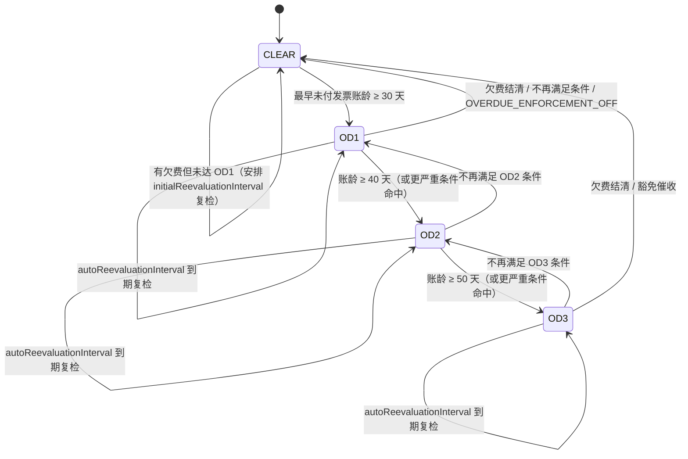
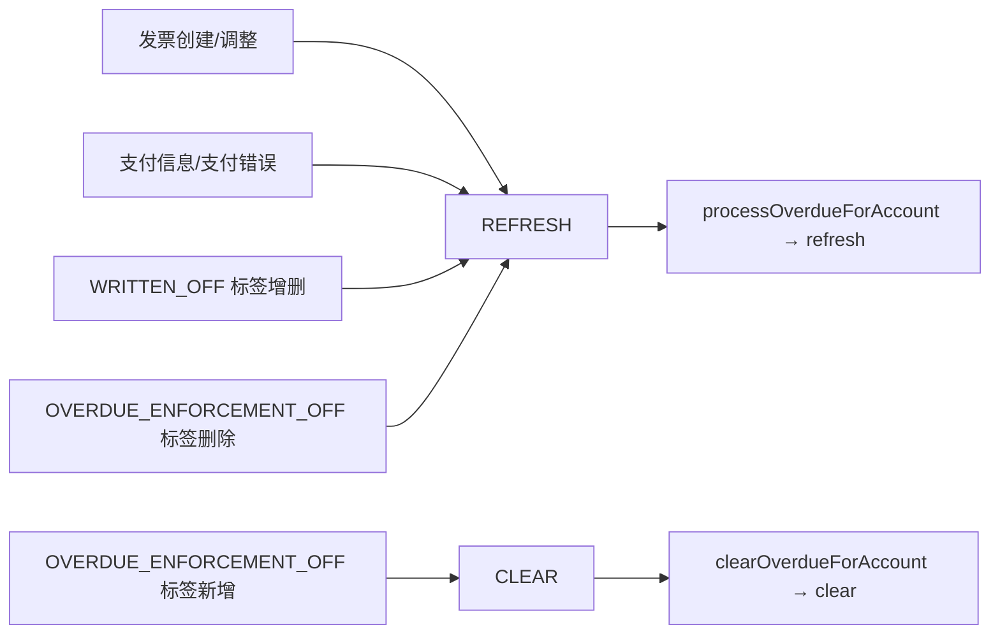
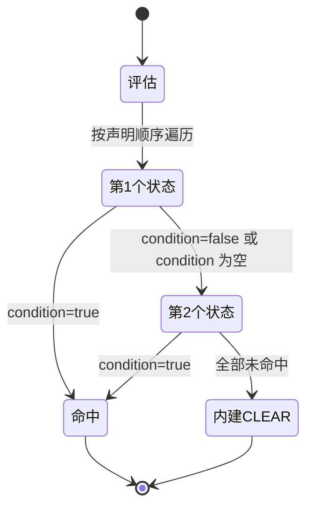
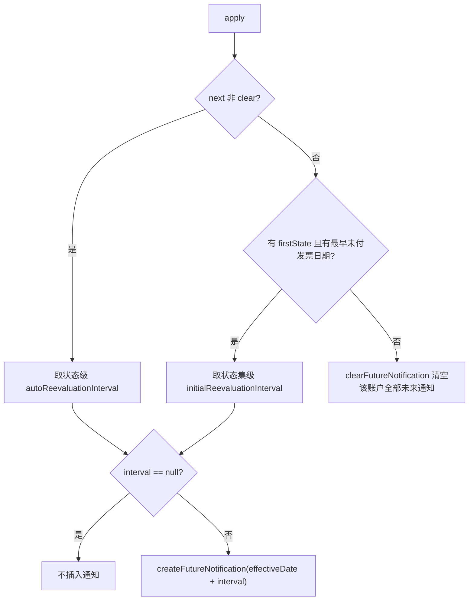
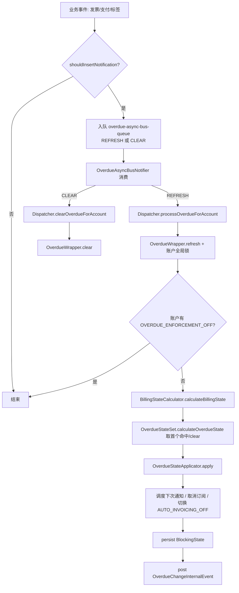
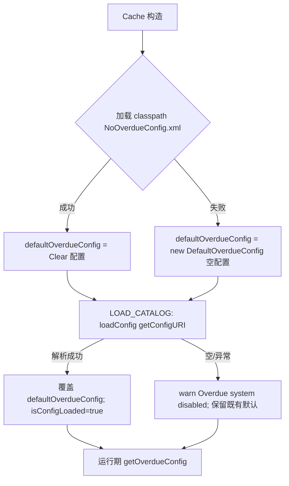

# 模块：overdue

> 本模块共 118 张卡（BR 64, ENT 18, ROLE 4, SM 4, TERM 20, WF 8）。

账户级逾期（催收）子系统：条件评估、状态施加、订阅取消、通知调度与多租户配置。

本模块卡片见下（ID 为全局编号，与 rules.md / glossary.md 等一致）。

---

## BR-107 逾期是账户级（跨订阅）规则

- **类型**: 业务规则
- **同义词**: 逾期是账户级, 账户维度催收, 跨订阅逾期, account-level overdue, overdue is per account
- **模块**: overdue
- **置信度**: 🟢 confirmed
- **溯源**: `overdue/src/main/java/org/killbill/billing/overdue/applicator/OverdueStateApplicator.java:221-235`, `overdue/src/main/java/org/killbill/billing/overdue/wrapper/OverdueWrapper.java:109-122`, `overdue/src/main/java/org/killbill/billing/overdue/config/DefaultOverdueConfig.java:41-45`

**规则**：逾期状态以**账户**为粒度计算与持久化，而非单个订阅。持久化时用 `BlockingStateType.ACCOUNT` + 服务名 `overdue-service`（`storeNewState`）；计算时对「该账户所有未付发票」聚合（`unpaidInvoicesForAccount`）。配置模型也只有 `accountOverdueStates`，无订阅级状态。
**影响**：一个账户下任一未付发票都会影响整个账户的逾期状态；取消订阅动作会作用到账户下所有非 ADD_ON 订阅（见 BR-120）。

## BR-108 条件：未付发票数量达到阈值

- **类型**: 业务规则
- **同义词**: 未付发票数量, 欠费张数, 发票数量条件, numberOfUnpaidInvoicesEqualsOrExceeds, unpaid invoice count
- **模块**: overdue
- **置信度**: 🟢 confirmed
- **溯源**: `overdue/src/main/java/org/killbill/billing/overdue/config/DefaultOverdueCondition.java:77`, `overdue/src/test/java/org/killbill/billing/overdue/config/TestCondition.java:49-68`

**规则**：`numberOfUnpaidInvoicesEqualsOrExceeds=N` 时，当且仅当 `state.getNumberOfUnpaidInvoices() >= N` 为真。测试证实：N=1 时 0 张不命中、1 张与 2 张命中。

## BR-109 条件：未付发票余额合计达到阈值

- **类型**: 业务规则
- **同义词**: 未付余额, 欠费金额, 余额阈值, totalUnpaidInvoiceBalanceEqualsOrExceeds, total unpaid balance
- **模块**: overdue
- **置信度**: 🟢 confirmed
- **溯源**: `overdue/src/main/java/org/killbill/billing/overdue/config/DefaultOverdueCondition.java:78`, `overdue/src/test/java/org/killbill/billing/overdue/config/TestCondition.java:70-90`

**规则**：`totalUnpaidInvoiceBalanceEqualsOrExceeds=B` 时，当且仅当 `B <= state.getBalanceOfUnpaidInvoices()` 为真（BigDecimal 比较，含等于）。测试：B=100 时余额 0 不命中、100 与 200 命中。

## BR-110 条件：最早未付发票距今时长达到阈值

- **类型**: 业务规则
- **同义词**: 逾期天数, 最早未付发票时长, 账龄条件, timeSinceEarliestUnpaidInvoiceEqualsOrExceeds, days overdue, aging
- **模块**: overdue
- **置信度**: 🟢 confirmed
- **溯源**: `overdue/src/main/java/org/killbill/billing/overdue/config/DefaultOverdueCondition.java:71-74`, `overdue/src/main/java/org/killbill/billing/overdue/config/DefaultOverdueCondition.java:79-80`, `overdue/src/main/java/org/killbill/billing/overdue/config/DefaultDuration.java:99-118`, `overdue/src/test/java/org/killbill/billing/overdue/config/TestCondition.java:92-114`

**规则**：配置 `<timeSinceEarliestUnpaidInvoiceEqualsOrExceeds><unit>…</unit><number>…</number></…>`。计算：`triggerDate = dateOfEarliestUnpaidInvoice + duration`；条件为真当且仅当 `triggerDate <= now`（`!triggerDate.isAfter(date)`）。若账户无最早未付发票日期（即无未付发票），该子条件为假。
**时间单位**：来自 `DefaultDuration`/`TimeUnit`，实际支持 `DAYS / WEEKS / MONTHS / YEARS`（`UNLIMITED` 非法）。测试：unit=DAYS, number=10 时「10 天前」与「20 天前」命中、「无日期」不命中。

## BR-111 条件：控制标签必须存在（controlTagInclusion）

- **类型**: 业务规则
- **同义词**: 必须包含标签, 标签包含条件, controlTagInclusion, include control tag, 标签门控
- **模块**: overdue
- **置信度**: 🟢 confirmed
- **溯源**: `overdue/src/main/java/org/killbill/billing/overdue/config/DefaultOverdueCondition.java:82`, `overdue/src/main/java/org/killbill/billing/overdue/config/DefaultOverdueCondition.java:96-103`, `overdue/src/test/java/org/killbill/billing/overdue/config/TestCondition.java:140-174`

**规则**：`controlTagInclusion=T` 时，当且仅当账户标签集合中存在 `tagDefinitionId == T.getId()` 的标签才为真。测试：`OVERDUE_ENFORCEMENT_OFF` 存在时命中，不存在时（仅有 AUTO_INVOICING_OFF/DescriptiveTag）不命中。配置示例见 `overdueWithControlTag.xml`（各状态要求 `TEST` 标签）。

## BR-112 条件：控制标签必须不存在（controlTagExclusion）

- **类型**: 业务规则
- **同义词**: 必须排除标签, 标签排除条件, controlTagExclusion, exclude control tag, 标签否决
- **模块**: overdue
- **置信度**: 🟢 confirmed
- **溯源**: `overdue/src/main/java/org/killbill/billing/overdue/config/DefaultOverdueCondition.java:83`, `overdue/src/main/java/org/killbill/billing/overdue/config/DefaultOverdueCondition.java:105-112`, `profiles/killbill/src/test/resources/org/killbill/billing/server/overdueWithExclusionControlTag.xml:18-62`

**规则**：`controlTagExclusion=T` 时，当且仅当账户标签集合中**不存在**该控制标签才为真（存在则一票否决该状态条件）。配置示例见 `overdueWithExclusionControlTag.xml`（各状态用 `<controlTagExclusion>TEST</controlTagExclusion>`）。

## BR-113 条件：上次失败支付响应（当前未真正实现）

- **类型**: 业务规则
- **同义词**: 上次支付失败原因, 支付响应条件, responseForLastFailedPaymentIn, last failed payment response, PaymentResponse
- **模块**: overdue
- **置信度**: 🟢 confirmed
- **溯源**: `overdue/src/main/java/org/killbill/billing/overdue/config/DefaultOverdueCondition.java:81`, `overdue/src/main/java/org/killbill/billing/overdue/config/DefaultOverdueCondition.java:86-94`, `overdue/src/main/java/org/killbill/billing/overdue/calculator/BillingStateCalculator.java:79`

**规则（配置层）**：`responseForLastFailedPaymentIn=[R1,R2,…]` 时，当且仅当账户「上次失败支付响应」等于列表之一才为真。可配置值示例：`INVALID_CARD`、`LOST_OR_STOLEN_CARD`、`INSUFFICIENT_FUNDS`、`DO_NOT_HONOR`。
**重要例外（未实现）**：上游 `BillingStateCalculator` 把 `responseForLastFailedPayment` **硬编码为 `PaymentResponse.INSUFFICIENT_FUNDS`（源码注释 `//TODO MDW`）**，并未从真实支付失败记录读取。因此除了「恰好配置为 INSUFFICIENT_FUNDS」外的响应类型实际上无法命中。即：该条件是「已建模、但输入未接线（not implemented）」的功能。

## BR-114 多子条件为 AND，未配置的子条件被忽略

- **类型**: 业务规则
- **同义词**: 条件组合, 多条件与, AND 组合, condition AND, all conditions must hold
- **模块**: overdue
- **置信度**: 🟢 confirmed
- **溯源**: `overdue/src/main/java/org/killbill/billing/overdue/config/DefaultOverdueCondition.java:76-84`

**规则**：`evaluate` 返回对全部 6 个子条件的合取。每个子条件写成 `(cfg == null || 实际检查)`，因此**未配置（null）的子条件恒为真**——即不构成约束。只要有一个已配置的子条件为假，整个条件即为假。

## BR-115 状态选择：按配置顺序取首个命中状态，否则 clear

- **类型**: 业务规则
- **同义词**: 状态选择, 命中优先级, 匹配第一个状态, state selection, first matching state, calculateOverdueState
- **模块**: overdue
- **置信度**: 🟢 confirmed
- **溯源**: `overdue/src/main/java/org/killbill/billing/overdue/config/DefaultOverdueStateSet.java:59-67`, `overdue/src/test/resources/org/killbill/billing/overdue/OverdueConfig3.xml:18-70`

**规则**：`calculateOverdueState(billingState, now)` 按 `state[]` 的**声明顺序**从头遍历，返回第一个条件为真的状态；若无任何命中则返回 clear state。因此配置中**越靠前的状态优先级越高**。示例 `OverdueConfig3.xml` 顺序为 OD4→OD3→OD2→OD1，OD4（未付≥5 且带 AUTO_PAY_OFF）优先级最高。

## BR-116 状态升级顺序与「首状态」语义

- **类型**: 业务规则
- **同义词**: 状态升级, 升级顺序, 催收梯度, escalation order, first state, getFirstState
- **模块**: overdue
- **置信度**: 🟢 confirmed
- **溯源**: `overdue/src/main/java/org/killbill/billing/overdue/config/DefaultOverdueStateSet.java:92-95`, `overdue/src/test/java/org/killbill/billing/overdue/config/TestOverdueConfig.java:70-76`, `profiles/killbill/src/main/resources/overdue.xml:19-61`

**规则**：约定配置里「最严重状态写在最前、最轻状态写在最后」。`getFirstState()` 返回数组**最后一个**元素，即**入门级/最轻**的逾期状态（如 OD1/OD3 场景中的 OD1，或 overdue.xml 中的 OD1）。测试 `TestOverdueConfig` 断言 OD2、OD1 顺序下 `getFirstState().getName()=="OD1"`。
**用途**：`firstOverdueState` 用于「尚未进入首个逾期状态但有未付发票，仍要安排下次检查」的判断（见 BR-122）。

## BR-117 状态未变化时为 no-op（但仍可能安排下次通知）

- **类型**: 业务规则
- **同义词**: 状态不变, 无操作, 幂等, no-op, state unchanged
- **模块**: overdue
- **置信度**: 🟢 confirmed
- **溯源**: `overdue/src/main/java/org/killbill/billing/overdue/applicator/OverdueStateApplicator.java:127-132`

**规则**：`apply` 先处理通知调度（BR-122），随后若 `previousOverdueState.getName().equals(nextOverdueState.getName())`，直接返回——不取消订阅、不切换 AUTO_INVOICING_OFF、不写 BlockingState、不发事件。即：动作只在**状态真正变化**时执行。

## BR-118 blockChanges 动作映射到 BlockingState.blockChange

- **类型**: 业务规则
- **同义词**: 阻止变更动作, blockChange, 冻结变更
- **模块**: overdue
- **置信度**: 🟢 confirmed
- **溯源**: `overdue/src/main/java/org/killbill/billing/overdue/applicator/OverdueStateApplicator.java:221-231`, `overdue/src/main/java/org/killbill/billing/overdue/applicator/OverdueStateApplicator.java:263-265`, `overdue/src/test/java/org/killbill/billing/overdue/TestOverdueHelper.java:119-124`

**规则**：施加状态时创建的 `DefaultBlockingState` 中 `blockChange = state.isBlockChanges() || state.isDisableEntitlementAndChangesBlocked()`。测试 helper 断言 blocking state 的 `isBlockChange()` 等于状态的 `isBlockChanges()`（仅在未 disableEntitlement 时；两者同真时也一致）。

## BR-119 disableEntitlementAndChangesBlocked 同时暂停权益与计费

- **类型**: 业务规则
- **同义词**: 禁用权益动作, 暂停服务, 停止计费, disableEntitlement, blockEntitlement, blockBilling, pause
- **模块**: overdue
- **置信度**: 🟢 confirmed
- **溯源**: `overdue/src/main/java/org/killbill/billing/overdue/applicator/OverdueStateApplicator.java:263-273`, `overdue/src/test/java/org/killbill/billing/overdue/TestOverdueHelper.java:119-124`

**规则**：若 `isDisableEntitlementAndChangesBlocked()==true`，则 BlockingState 同时 `blockEntitlement=true`、`blockBilling=true`，并因 `blockChanges()` 的或运算而 `blockChange=true`。测试 helper 断言 `isBlockEntitlement()==isBlockBilling()==state.isDisableEntitlementAndChangesBlocked()`。业务效果：**暂停该账户的服务并停止计费**（stop billing / suspend），回到非 block billing 状态即 resume（见 BR-121）。

## BR-120 订阅取消策略：NONE / IMMEDIATE / END_OF_TERM

- **类型**: 业务规则
- **同义词**: 逾期取消订阅, 立即取消, 到期取消, 自动退订, subscriptionCancellationPolicy, IMMEDIATE, END_OF_TERM, cancel subscription on overdue
- **模块**: overdue
- **置信度**: 🟢 confirmed
- **溯源**: `overdue/src/main/java/org/killbill/billing/overdue/applicator/OverdueStateApplicator.java:285-314`, `overdue/src/main/java/org/killbill/billing/overdue/applicator/OverdueStateApplicator.java:316-329`

**规则**：进入新状态时若 `getOverdueCancellationPolicy()`：
- `NONE` → 直接返回，不取消任何订阅；
- `IMMEDIATE` → 以 `BillingActionPolicy.IMMEDIATE` 取消；
- `END_OF_TERM` → 以 `BillingActionPolicy.END_OF_TERM` 取消；
- 其他值 → 抛 `IllegalStateException`。

**作用范围**：取账户下所有 entitlement，但**过滤掉 `ProductCategory.ADD_ON`**，只取消基础订阅（源码注释：Entitlement 会自行取消其 add-on，引用 killbill#94）。取消生效日 `context.toLocalDate(effectiveDate)`。

## BR-121 自动维护 AUTO_INVOICING_OFF 标签（防多生成信用）

- **类型**: 业务规则
- **同义词**: 自动关闭开票, 防止额外开票, AUTO_INVOICING_OFF 自动切换, avoid extra credit, toggle auto invoice off
- **模块**: overdue
- **置信度**: 🟢 confirmed
- **溯源**: `overdue/src/main/java/org/killbill/billing/overdue/applicator/OverdueStateApplicator.java:176-183`, `overdue/src/main/java/org/killbill/billing/overdue/applicator/OverdueStateApplicator.java:237-253`

**规则**：
- 「进入 block billing」的转移（`isBlockBillingTransition`：prev 不 block billing、next block billing）→ 给账户打上 `AUTO_INVOICING_OFF` 标签，避免继续开票产生多余信用。
- 「解除 block billing」的转移（`isUnblockBillingTransition`）→ 移除 `AUTO_INVOICING_OFF` 标签；若标签本就不存在（`TAG_DOES_NOT_EXIST`）则忽略该错误。

## BR-122 重新评估通知的调度规则（定时器语义）

- **类型**: 业务规则
- **同义词**: 复评定时器, 下次检查安排, 通知队列, reevaluation timer, schedule next check, notification queue
- **模块**: overdue
- **置信度**: 🟢 confirmed
- **溯源**: `overdue/src/main/java/org/killbill/billing/overdue/applicator/OverdueStateApplicator.java:109-125`, `overdue/src/main/java/org/killbill/billing/overdue/applicator/OverdueStateApplicator.java:160-174`

**规则**：
1. 需要安排下次通知的条件：`!nextOverdueState.isClearState()` **或**（有首个逾期状态 **且** 存在最早未付发票日期）——即「已逾期」或「有欠费但可能还没进入首个逾期状态」。
2. 间隔取值：clear 状态用状态集的 `initialReevaluationInterval`；非 clear 状态用该状态的 `autoReevaluationInterval`。
3. 若间隔为 null（配置缺失/无时间型条件）→ **不插入通知**，日志说明「条件非时间驱动，无需重试」。
4. 否则安排 `effectiveDate + reevaluationInterval` 的未来通知。
5. 若「next 为 clear 且不满足上述第 1 条」→ **清除**该账户所有未来通知（`clearFutureNotification`）。

## BR-123 clear 状态清除未来通知

- **类型**: 业务规则
- **同义词**: 清除通知, 取消定时, clear notifications, clear future notification
- **模块**: overdue
- **置信度**: 🟢 confirmed
- **溯源**: `overdue/src/main/java/org/killbill/billing/overdue/applicator/OverdueStateApplicator.java:123-125`, `overdue/src/main/java/org/killbill/billing/overdue/applicator/OverdueStateApplicator.java:275-283`

**规则**：当 `nextOverdueState.isClearState()` 且不满足「有欠费需继续检查」时，移除该账户在 `overdue-check-queue` 上的所有未来逾期检查通知（按 accountRecordId/tenantRecordId 检索后逐条删除）。`clear(...)` 路径也会调用它。

## BR-124 OVERDUE_ENFORCEMENT_OFF 短路并触发 CLEAR

- **类型**: 业务规则
- **同义词**: 豁免催收, 关闭催收生效, OVERDUE_ENFORCEMENT_OFF 短路, skip overdue enforcement, overdue enforcement off
- **模块**: overdue
- **置信度**: 🟢 confirmed
- **溯源**: `overdue/src/main/java/org/killbill/billing/overdue/wrapper/OverdueWrapper.java:109-113`, `overdue/src/main/java/org/killbill/billing/overdue/listener/OverdueListener.java:98-107`, `overdue/src/main/java/org/killbill/billing/overdue/applicator/OverdueStateApplicator.java:334-349`

**规则**：`refreshWithLock` 首先检查账户是否被打了 `OVERDUE_ENFORCEMENT_OFF`；若是则**直接 return**（不计算、不切状态、不安排通知）。同时，给账户**新增**该控制标签的事件会以 `OverdueAsyncBusNotificationAction.CLEAR` 入队，引导 `OverdueDispatcher.clearOverdueForAccount` 把账户置回 clear 状态。业务效果：运营可用该标签「豁免/停止催收并清零状态」。

## BR-125 触发重新评估的事件集合

- **类型**: 业务规则
- **同义词**: 重新评估触发, 刷新触发, 事件驱动催收, refresh triggers, reevaluation triggers
- **模块**: overdue
- **置信度**: 🟢 confirmed
- **溯源**: `overdue/src/main/java/org/killbill/billing/overdue/listener/OverdueListener.java:96-157`

**规则**：以下事件会使对应账户入队 `REFRESH`（重新评估）：
- 发票创建（InvoiceCreationInternalEvent）
- 发票调整（InvoiceAdjustmentInternalEvent）
- 支付信息（InvoicePaymentInfoInternalEvent）
- 支付错误（InvoicePaymentErrorInternalEvent）
- 发票级 `WRITTEN_OFF` 标签的创建/删除
- 账户级 `OVERDUE_ENFORCEMENT_OFF` 标签的删除
（账户级 `OVERDUE_ENFORCEMENT_OFF` 标签的**新增**特殊处理为 `CLEAR`，见 BR-124。）

## BR-126 仅当存在带条件的状态时才运行逾期机制（优化）

- **类型**: 业务规则
- **同义词**: 催收启用开关, 无配置不运行, shouldInsertNotification, overdue disabled optimization
- **模块**: overdue
- **置信度**: 🟢 confirmed
- **溯源**: `overdue/src/main/java/org/killbill/billing/overdue/listener/OverdueListener.java:168-174`, `overdue/src/main/java/org/killbill/billing/overdue/listener/OverdueListener.java:206-225`

**规则**：监听器入队前调用 `shouldInsertNotification`：若租户逾期配置为空、`accountOverdueStates` 为空、状态数组为空，或**所有状态都没有 condition**（`getConditionEvaluation()` 全为 null），则不入队、直接返回。目的：若逾期未被有效配置，就不必跑整条催收链路。

## BR-127 父/子账户的级联与委派支付

- **类型**: 业务规则
- **同义词**: 父子账户, 委派支付, 家庭账户, parent child account, payment delegated to parent, cascade overdue
- **模块**: overdue
- **置信度**: 🟢 confirmed
- **溯源**: `overdue/src/main/java/org/killbill/billing/overdue/wrapper/OverdueWrapper.java:151-159`, `overdue/src/main/java/org/killbill/billing/overdue/listener/OverdueListener.java:179-203`

**规则**：
1. **计算委派**：若账户有 `parentAccountId` 且 `isPaymentDelegatedToParent()`，则其逾期计费状态从**父账户**的上下文计算（用父账户 recordId 构造 context）。
2. **刷新级联**：账户入队 REFRESH/CLEAR 时，若其向父账户委派支付，则父账户也入队；并遍历其子账户，凡 `isPaymentDelegatedToParent()` 的子账户也入队。加载子账户失败仅记日志、不中断。

## BR-128 账户级全局锁与重试（MAX_LOCK_RETRIES=50）

- **类型**: 业务规则
- **同义词**: 逾期并发锁, 账户锁, 锁重试, global lock, MAX_LOCK_RETRIES, ACCNT_INV_PAY lock
- **模块**: overdue
- **置信度**: 🟢 confirmed
- **溯源**: `overdue/src/main/java/org/killbill/billing/overdue/wrapper/OverdueWrapper.java:56`, `overdue/src/main/java/org/killbill/billing/overdue/wrapper/OverdueWrapper.java:89-107`, `overdue/src/main/java/org/killbill/billing/overdue/wrapper/OverdueWrapper.java:129-142`

**规则**：`refresh`/`clear` 都先获取类型为 `ACCNT_INV_PAY`、键为账户 id 的全局锁，最多尝试 `MAX_LOCK_RETRIES=50` 次。获取失败（`LockFailedException`）时抛 `QueueRetryException`，并携带 `overdueConfig.getRescheduleIntervalOnLock(context)` 作为重排周期（由 killbill config 项控制），保证并发下操作最终执行。锁在 finally 释放。

## BR-129 autoReevaluationInterval 合法性校验

- **类型**: 业务规则
- **同义词**: 复评间隔校验, 无复评间隔错误, autoReevaluationInterval validation, OVERDUE_NO_REEVALUATION_INTERVAL
- **模块**: overdue
- **置信度**: 🟢 confirmed
- **溯源**: `overdue/src/main/java/org/killbill/billing/overdue/config/DefaultOverdueState.java:119-125`, `overdue/src/main/java/org/killbill/billing/overdue/applicator/OverdueStateApplicator.java:160-174`

**规则**：`OverdueState.getAutoReevaluationInterval()` 在 `autoReevaluationInterval==null`、`unit==UNLIMITED` 或 `number==0` 时抛 `OverdueApiException(OVERDUE_NO_REEVALUATION_INTERVAL, name)`。`OverdueStateApplicator.getReevaluationInterval` 捕获该错误码并返回 null → 不安排下次通知（其他错误码则转成 OverdueException 抛出）。

## BR-130 initialReevaluationInterval 为无效值时不重试

- **类型**: 业务规则
- **同义词**: 初始复评间隔, clear 状态轮询, initialReevaluationInterval
- **模块**: overdue
- **置信度**: 🟢 confirmed
- **溯源**: `overdue/src/main/java/org/killbill/billing/overdue/config/DefaultOverdueStatesAccount.java:51-57`

**规则**：`getInitialReevaluationInterval()` 在 `initialReevaluationInterval==null`、`unit==UNLIMITED` 或 `number==0` 时返回 `null`；`OverdueStateApplicator` 收到 null 即不插入通知。也就是说 clear 状态若要被周期性复检，必须显式配置一个正数的初始复评间隔。

## BR-131 状态名长度上限 50

- **类型**: 业务规则
- **同义词**: 状态名长度, 名称上限, state name max length
- **模块**: overdue
- **置信度**: 🟢 confirmed
- **溯源**: `overdue/src/main/java/org/killbill/billing/overdue/config/DefaultOverdueState.java:47`, `overdue/src/main/java/org/killbill/billing/overdue/config/DefaultOverdueState.java:171-178`

**规则**：`MAX_NAME_LENGTH = 50`；校验时若状态名长度超过 50，追加 ValidationError（"Name of state '%s' exceeds the maximum length of %d"）。这是逾期配置的硬校验项。

## BR-132 默认配置只含 Clear 状态（等价于未启用催收）

- **类型**: 业务规则
- **同义词**: 默认逾期配置, 无逾期配置, NoOverdueConfig, default overdue config, overdue disabled
- **模块**: overdue
- **置信度**: 🟢 confirmed
- **溯源**: `overdue/src/main/resources/NoOverdueConfig.xml:20-27`, `overdue/src/main/java/org/killbill/billing/overdue/caching/DefaultOverdueConfigCache.java:58-66`

**规则**：内建默认配置 `NoOverdueConfig.xml` 的 `accountOverdueStates` 只包含一个 `name="Clear"` 且 `isClearState=true` 的状态，无任何条件。因此默认情况下没有任何状态会命中，账户始终为 clear，催收动作不触发。若默认配置 URL 为空或加载失败，系统记 warn 并处于「逾期系统禁用」状态（不改变状态）。

## BR-133 配置加载失败/无效时逾期系统被禁用

- **类型**: 业务规则
- **同义词**: 逾期配置加载失败, 配置无效, overdue disabled, config load failure
- **模块**: overdue
- **置信度**: 🟢 confirmed
- **溯源**: `overdue/src/main/java/org/killbill/billing/overdue/service/DefaultOverdueService.java:91-101`, `overdue/src/main/java/org/killbill/billing/overdue/caching/DefaultOverdueConfigCache.java:68-86`, `overdue/src/main/java/org/killbill/billing/overdue/caching/DefaultOverdueConfigCache.java:99-105`

**规则**：`DefaultOverdueService.loadConfig`（生命周期 LOAD_CATALOG）从 `properties.getConfigURI()` 加载默认配置；失败则 log.warn「Overdue system disabled」并保持 `isConfigLoaded=false`。租户级配置解析失败会被包装成 `OverdueApiException(OVERDUE_INVALID_FOR_TENANT)`；单个租户配置无效不影响其他租户（`get` 失败时抛异常，未命中则回退默认配置）。

## BR-134 通知去重：check 队列保留最早、async 队列有则跳过

- **类型**: 业务规则
- **同义词**: 通知去重, 队列去重, notification dedup, cleanup future notifications
- **模块**: overdue
- **置信度**: 🟢 confirmed
- **溯源**: `overdue/src/main/java/org/killbill/billing/overdue/notification/OverdueCheckPoster.java:48-85`, `overdue/src/main/java/org/killbill/billing/overdue/notification/OverdueAsyncBusPoster.java:47-57`, `overdue/src/main/java/org/killbill/billing/overdue/notification/DefaultOverduePosterBase.java:67-84`

**规则**：插入未来通知前会在事务内查询该账户已有的未来通知：
- **overdue-check（定时复评）**：若已存在一条**更早**的通知，则不再插入新通知，并删除其余未来通知；否则删除已有通知、插入新通知。即**保留最早到期的那条**。
- **overdue-async-bus（事件刷新）**：若已存在任意未来通知则直接跳过插入（源码注释承认这是近似处理，可能出现 REFRESH/CLEAR 混排的非确定行为）。

## BR-135 getOverdueStateFor 从 blocking state 名解析当前状态

- **类型**: 业务规则
- **同义词**: 查询当前逾期状态, 当前状态解析, getOverdueStateFor, current overdue state
- **模块**: overdue
- **置信度**: 🟢 confirmed
- **溯源**: `overdue/src/main/java/org/killbill/billing/overdue/api/DefaultOverdueApi.java:91-99`, `overdue/src/main/java/org/killbill/billing/overdue/wrapper/OverdueWrapper.java:115-119`

**规则**：查询账户当前逾期状态时，读取该账户在 `overdue-service` 上的 BlockingState；若不存在则用 `CLEAR_STATE_NAME`，再通过状态集 `findState(stateName)` 解析。`findState` 对 clear 名特判返回内建 clearState，否则按名字查配置状态，找不到抛 `CAT_NO_SUCH_OVERDUE_STATE`。这条规则同时决定了「刷新时 previousOverdueState 的取值」。

## BR-136 租户配置上传会覆盖旧值并失效缓存

- **类型**: 业务规则
- **同义词**: 上传逾期配置, 覆盖配置, 配置缓存失效, upload overdue config, cache invalidation, OVERDUE_CONFIG
- **模块**: overdue
- **置信度**: 🟢 confirmed
- **溯源**: `overdue/src/main/java/org/killbill/billing/overdue/api/DefaultOverdueApi.java:66-89`, `overdue/src/main/java/org/killbill/billing/overdue/caching/OverdueCacheInvalidationCallback.java:39-43`, `overdue/src/main/java/org/killbill/billing/overdue/service/DefaultOverdueService.java:103-113`

**规则**：上传逾期配置时：先删除租户键 `OVERDUE_CONFIG` 的旧值（若存在），再写入新 XML，然后清除该租户的逾期配置缓存。租户配置变更也会通过 `TenantKey.OVERDUE_CONFIG` 的 `CacheInvalidationCallback` 触发缓存失效。以 `OverdueConfig` 对象上传时，先序列化为 XML（`XMLWriter`），失败抛 `OVERDUE_INVALID_FOR_TENANT`。

## BR-137 有效日与条件日期口径

- **类型**: 业务规则
- **同义词**: 生效日期, 评估日期, effectiveDate, now, account timezone
- **模块**: overdue
- **置信度**: 🟢 confirmed
- **溯源**: `overdue/src/main/java/org/killbill/billing/overdue/applicator/OverdueStateApplicator.java:104-107`, `overdue/src/main/java/org/killbill/billing/overdue/wrapper/OverdueWrapper.java:124-127`, `api/src/main/java/org/killbill/billing/overdue/config/api/OverdueStateSet.java:30-38`

**规则**：状态评估用「账户时区的 LocalDate」作为 `now`（`context.toLocalDate(context.getCreatedDate())`），条件里的时长比较基于该日；而状态施加（写 BlockingState、取消订阅）用带时间的 `effectiveDate`（`context.toLocalDate(effectiveDate)` 取日）。同一账户的评估日期口径必须在账户时区下解释。

## BR-138 取消动作只针对非 ADD_ON 基础订阅

- **类型**: 业务规则
- **同义词**: 取消基础订阅, 排除附加组件, 取消不含 add-on, cancel base subscriptions, exclude ADD_ON
- **模块**: overdue
- **置信度**: 🟢 confirmed
- **溯源**: `overdue/src/main/java/org/killbill/billing/overdue/applicator/OverdueStateApplicator.java:316-329`

**规则**：`computeEntitlementsToCancel` 过滤掉 `ProductCategory.ADD_ON` 的 entitlement，只把非附加组件订阅放入待取消列表。源码注释说明 Entitlement 层会自动取消关联的 add-on（引用 killbill issue #94），并提示此实现会漏掉「未来创建的 add-on」。

## BR-139 逾期状态持久化为账户 BlockingState

- **类型**: 业务规则
- **同义词**: 逾期状态持久化, blocking state, 状态存储, persist overdue state, setBlockingState
- **模块**: overdue
- **置信度**: 🟢 confirmed
- **溯源**: `overdue/src/main/java/org/killbill/billing/overdue/applicator/OverdueStateApplicator.java:221-235`, `overdue/src/main/java/org/killbill/billing/overdue/applicator/OverdueStateApplicator.java:139-142`

**规则**：新状态通过 `blockingApi.setBlockingState(new DefaultBlockingState(accountId, BlockingStateType.ACCOUNT, stateName, "overdue-service", blockChange, blockEntitlement, blockBilling, effectiveDate))` 持久化。源码注释强调：**必须最后再存新状态**——因为 entitlement DAO 会发 BlockingTransitionInternalEvent，invoice 会据此反应，需先让含 AUTO_INVOICING_OFF 等最新信息落库。存状态失败包装为 `OVERDUE_CAT_ERROR_ENCOUNTERED`。

## BR-140 clear 路径的状态与通知处理

- **类型**: 业务规则
- **同义词**: 清除逾期, 解除逾期, 恢复账户, clear overdue, clear path
- **模块**: overdue
- **置信度**: 🟢 confirmed
- **溯源**: `overdue/src/main/java/org/killbill/billing/overdue/applicator/OverdueStateApplicator.java:185-213`, `overdue/src/main/java/org/killbill/billing/overdue/wrapper/OverdueWrapper.java:144-149`

**规则**：`clear(effectiveDate, account, previousState, clearState, ctx)` 顺序为：写入 clear 状态 → 清除未来通知 → 按需切换 AUTO_INVOICING_OFF（从 block billing 回落则移除标签）→ 构造并投递 `OverdueChangeInternalEvent`（记录 previous→clear 及 unblock 标志）。`OverdueWrapper.clearWithLock` 先查出账户当前状态名再调用它。

## BR-141 内部租户始终使用默认配置

- **类型**: 业务规则
- **同义词**: 内部租户配置, 默认配置回退, internal tenant, default config fallback
- **模块**: overdue
- **置信度**: 🟢 confirmed
- **溯源**: `overdue/src/main/java/org/killbill/billing/overdue/caching/DefaultOverdueConfigCache.java:93-106`, `overdue/src/main/java/org/killbill/billing/overdue/caching/DefaultOverdueConfigCache.java:108-113`

**规则**：当 `tenantRecordId` 等于 `InternalCallContextFactory.INTERNAL_TENANT_RECORD_ID` 时，直接返回默认配置、不进租户缓存；`clearOverdueConfig` 对内部租户也是 no-op。普通租户先查 `TENANT_OVERDUE_CONFIG` 缓存，缓存未命中则返回默认配置；读取抛 IllegalStateException 时转 `OVERDUE_INVALID_FOR_TENANT`。

## BR-142 逾期配置 URI 由 `org.killbill.overdue.uri` 控制

- **类型**: 业务规则
- **同义词**: 逾期配置路径, 配置 URI, org.killbill.overdue.uri, config URI, NoOverdueConfig.xml
- **模块**: overdue
- **置信度**: 🟢 confirmed
- **溯源**: `overdue/src/main/java/org/killbill/billing/overdue/OverdueProperties.java:25-31`, `overdue/src/main/java/org/killbill/billing/overdue/caching/DefaultOverdueConfigCache.java:58-66`

**规则**：默认逾期配置的位置由配置项 `org.killbill.overdue.uri` 指定，默认值 `NoOverdueConfig.xml`（classpath 或文件系统 URI）。`DefaultOverdueConfigCache` 构造时会先以内建 URI `NoOverdueConfig.xml` 预载默认配置；随后 `loadConfig` 用该配置项覆盖。这解释了「系统默认不催收、要显式指向自定义 XML 才启用」的语义。

## BR-143 状态声明顺序即匹配优先级；无 condition 的状态永不胜出

- **类型**: 业务规则
- **同义词**: 状态声明顺序, 匹配优先级, 无条件下不生效, state declaration order, matching priority, state without condition never matches
- **模块**: overdue
- **置信度**: 🟢 confirmed
- **溯源**: `overdue/src/main/java/org/killbill/billing/overdue/config/DefaultOverdueStateSet.java:59-67`, `overdue/src/main/java/org/killbill/billing/overdue/config/DefaultOverdueStatesAccount.java:38-40`

**规则**：`calculateOverdueState(billingState, now)` 严格按 `accountOverdueStates` 数组（即 XML 中 `<state>` 的**文档声明顺序**）从头遍历：
- 只考虑 `overdueState.getConditionEvaluation() != null` 的状态；
- 返回**第一个** `condition.evaluate(...) == true` 的状态；
- 一个都没命中 → 返回内建 clearState。
**关键推论 1**：**未写 `<condition>` 的状态永远不会被选中**（既不会被遍历命中，也不会成为「兜底」；兜底恒为内建 clear）。因此「无条件状态」在配置中只具占位/文档意义。
**关键推论 2**：因为先匹配先赢，配置**必须按「最严重 → 最轻」顺序声明**（严重状态条件更严，放前面；轻状态放后面），否则轻状态会抢赢。代码不作顺序校验，这是纯语义契约。

## BR-144 状态名命名约束（@XmlID 唯一性 + XML ID 合法性 + 50 上限 + 保留名）

- **类型**: 业务规则
- **同义词**: 状态名约束, 命名限制, 状态名唯一, 状态名长度, state name restriction, XmlID, unique state name, max 50
- **模块**: overdue
- **置信度**: 🟢 confirmed
- **溯源**: `overdue/src/main/java/org/killbill/billing/overdue/config/DefaultOverdueState.java:47`, `overdue/src/main/java/org/killbill/billing/overdue/config/DefaultOverdueState.java:52-54`, `overdue/src/main/java/org/killbill/billing/overdue/config/DefaultOverdueState.java:171-178`, `overdue/src/main/java/org/killbill/billing/overdue/config/DefaultOverdueStateSet.java:41-52`

**规则**（状态名必须满足全部约束）：
1. **XML ID**：`name` 标注 `@XmlAttribute(name="name", required=true)` 且 `@XmlID`（52-54 行）。作为 XML ID，它必须是合法 NCName（不能含空格/冒号，不能以数字开头），且在配置文档内**唯一**——两个 `<state>` 同名会被 schema/JAXB 判为非法。
2. **长度上限 50**：`MAX_NAME_LENGTH = 50`；`validate` 中超过即追加 `ValidationError("Name of state '%s' exceeds the maximum length of %d")`（171-178 行）。
3. **唯一性由代码兜底**：`findState(name)` 用**精确字符串相等**逐个匹配，同名状态只会命中第一个。
4. **保留名**：`__KILLBILL__CLEAR__OVERDUE_STATE__` 被 `findState` 特判（41-45 行），同名用户状态不可达。
5. 名字影响业务：状态名即持久化到 BlockingState 的状态名，改名会破坏既有数据的可解析性（见 BR-146）。

## BR-145 getFirstState() = 最后一个声明状态；空数组会越界

- **类型**: 业务规则
- **同义词**: 首状态, 入门级状态, 最后声明, getFirstState, first state, entry level overdue state, empty states array
- **模块**: overdue
- **置信度**: 🟢 confirmed
- **溯源**: `overdue/src/main/java/org/killbill/billing/overdue/config/DefaultOverdueStateSet.java:87-95`, `overdue/src/main/java/org/killbill/billing/overdue/applicator/OverdueStateApplicator.java:109-113`

**规则**：`getFirstState()` 返回 `getStates()[size()-1]`，即数组**最后一个**元素。
- 由 BR-143 的「最严重在前」契约可知，最后一个元素是**最轻/入门级**状态（如 OD1）。
- 该值在 applicator 里用于判断「尚未进入首状态但有欠费仍需复检」：`conditionForNextNotfication = !next.isClearState() || (firstOverdueState != null && billingState.getDateOfEarliestUnpaidInvoice() != null)`（109-113 行）。
**边界行为**：若状态数组为空，`size()-1 = -1`，`getStates()[-1]` 抛 `ArrayIndexOutOfBoundsException`。实际运行中由 `OverdueWrapper.refresh` 的 `size() < 1` 早退（BR-170）以及 `OverdueWrapperFactory` 返回空状态集共同规避，application 层不会以空集调用 `getFirstState()`。

## BR-146 配置 isClearState 标志不决定清算；内建 clearState 是唯一出口

- **类型**: 业务规则
- **同义词**: isClearState 标志, 清算标志, 内建清算状态, configured isClearState flag, built-in clear state, clear state resolution
- **模块**: overdue
- **置信度**: 🟢 confirmed
- **溯源**: `overdue/src/main/java/org/killbill/billing/overdue/config/DefaultOverdueStateSet.java:37-57`, `overdue/src/main/java/org/killbill/billing/overdue/config/DefaultOverdueStateSet.java:69-85`, `overdue/src/main/java/org/killbill/billing/overdue/applicator/OverdueStateApplicator.java:160-174`

**规则**：`DefaultOverdueStatesAccount` **不**从其配置状态里挑选 `isClearState=true` 的状态作为清算状态。清算状态恒为状态集内建的 `clearState`（BR-143/TERM-029）：
- `calculateOverdueState` 未命中时返回内建 clearState；
- `findState` 对保留名特判返回内建 clearState；
- `getClearState()` 直接返回内建 clearState。
**用户配置 `<isClearState>true</isClearState>` 的真实影响**：仅当该状态**自身被 condition 命中**而成为 next 时，`nextOverdueState.isClearState()` 为真，从而影响 `OverdueStateApplicator.getReevaluationInterval`（用状态集级 `initialReevaluationInterval` 而非状态级 `autoReevaluationInterval`）以及「是否清空未来通知」的判断（applicator 123-125 行）。它**不会**让该状态成为兜底状态。
**校验死分支**：`DefaultOverdueStateSet.validate` 里对 `CAT_MISSING_CLEAR_STATE` 的检查（78-80 行）在现状下不可达——因为 `getClearState()` 从不抛异常。

## BR-147 时间条件为「含等于」（inclusive）：triggerDate <= now

- **类型**: 业务规则
- **同义词**: 时间条件含等于, 边界包含, 账龄包含当天, inclusive time condition, triggerDate <= now, timeSinceEarliestUnpaidInvoiceEqualsOrExceeds
- **模块**: overdue
- **置信度**: 🟢 confirmed
- **溯源**: `overdue/src/main/java/org/killbill/billing/overdue/config/DefaultOverdueCondition.java:69-84`, `overdue/src/main/java/org/killbill/billing/overdue/config/DefaultOverdueCondition.java:56-57`

**规则**：`timeSinceEarliestUnpaidInvoiceEqualsOrExceeds` 的判定为：
1. 仅当配置了该子条件**且**账户有最早未付发票日期时，计算 `triggerDate = dateOfEarliestUnpaidInvoice.plus(duration.toJodaPeriod())`。
2. 条件为真当且仅当 `!triggerDate.isAfter(now)`，即 **`triggerDate <= now`（含等于，inclusive）**。
3. 若账户无最早未付发票日期（无未付发票），该子条件**为假**（源码注释 `// no date => no unpaid invoices`，72 行）。
**口径**：`now` 来自账户时区的 `LocalDate`（applicator 传入 `context.toLocalDate(context.getCreatedDate())`）；`dateOfEarliestUnpaidInvoice` 是发票日期（非到期日 dueDate）。到触发当天即命中。

## BR-148 时间/间隔单位仅 DAYS/WEEKS/MONTHS/YEARS；UNLIMITED 非法

- **类型**: 业务规则
- **同义词**: 时间单位, 支持的单位, 无限期非法, supported time units, UNLIMITED illegal, DAYS WEEKS MONTHS YEARS
- **模块**: overdue
- **置信度**: 🟢 confirmed
- **溯源**: `overdue/src/main/java/org/killbill/billing/overdue/config/DefaultDuration.java:57-118`, `overdue/src/main/java/org/killbill/billing/overdue/config/DefaultOverdueState.java:119-125`, `overdue/src/main/java/org/killbill/billing/overdue/config/DefaultOverdueStatesAccount.java:51-57`

**规则**：`DefaultDuration` 在条件与间隔中均只支持四种 `TimeUnit`：`DAYS`、`WEEKS`、`MONTHS`、`YEARS`（分别映射 Joda `withDays/withWeeks/withMonths/withYears`）。
- `UNLIMITED` → `toJodaPeriod()/addToLocalDate()/addToDateTime()` 抛 `IllegalStateException`（74/95/116 行）。
- 作为 **autoReevaluationInterval**：`UNLIMITED` 与 `number==0`、`autoReevaluationInterval==null` 一起被判为非法，抛 `OverdueApiException(OVERDUE_NO_REEVALUATION_INTERVAL)`（DefaultOverdueState 121-123 行）。
- 作为 **initialReevaluationInterval**：`UNLIMITED`/`number==0`/null → `getInitialReevaluationInterval()` 返回 `null`（DefaultOverdueStatesAccount 53-55 行），即不安排通知。
- `validate()` 对 unit/number 组合**无校验**（DefaultDuration 121-124 行仅 TODO）。即「UNLIMITED 配合 number」不会被配置校验拦下，而是在使用时爆炸。

## BR-149 时间条件缺省 number=-1 会立即命中（反直觉默认）

- **类型**: 业务规则
- **同义词**: 缺省数字, 默认-1, 立即命中, default number -1, missing number, immediate trigger, duration default
- **模块**: overdue
- **置信度**: 🟢 confirmed
- **溯源**: `overdue/src/main/java/org/killbill/billing/overdue/config/DefaultDuration.java:41-45`, `overdue/src/main/java/org/killbill/billing/overdue/config/DefaultDuration.java:99-118`, `overdue/src/main/java/org/killbill/billing/overdue/config/DefaultOverdueCondition.java:71-74`

**规则**：`DefaultDuration.number` 的 Java 默认值是 `-1`。若配置只写 `<unit>DAYS</unit>` 而漏写 `<number>`：
- `toJodaPeriod()` 返回 `new Period().withDays(-1)`（即**负一天**周期）；
- 时间条件 `triggerDate = dateOfEarliestUnpaidInvoice.plus(-1 day)`，通常早于 `now`，于是条件**立即为真**；
- 同样的 -1 若出现在 `autoReevaluationInterval`，会安排一个「过去时间」的通知，等价于立即触发下一次复评。
**仅当** `number == null`（外部反序列化显式写入 null）且 unit 非 UNLIMITED 时，`toJodaPeriod()` 才返回恒等 `new Period()`（102 行）——注意这与「-1」是两个不同分支，默认路径走的是 -1。**结论：配置时间条件/间隔时必须显式写 `<number>`，正数才有预期语义。**

## BR-150 数值条件：发票数量用 >=，余额用 BigDecimal.compareTo（scale 无关）

- **类型**: 业务规则
- **同义词**: 数量条件, 余额条件, 数值阈值, numberOfUnpaidInvoicesEqualsOrExceeds, totalUnpaidInvoiceBalanceEqualsOrExceeds, >=, BigDecimal compareTo
- **模块**: overdue
- **置信度**: 🟢 confirmed
- **溯源**: `overdue/src/main/java/org/killbill/billing/overdue/config/DefaultOverdueCondition.java:50-54`, `overdue/src/main/java/org/killbill/billing/overdue/config/DefaultOverdueCondition.java:76-78`

**规则**：两个「EqualsOrExceeds」数值子条件均为**含等于（inclusive）**：
- 数量：`numberOfUnpaidInvoicesEqualsOrExceeds == null || state.getNumberOfUnpaidInvoices() >= 该值`（int 比较）。
- 余额：`totalUnpaidInvoiceBalanceEqualsOrExceeds == null || 阈值.compareTo(state.getBalanceOfUnpaidInvoices()) <= 0`，即 `state.balance >= 阈值`。
**余额比较细节**：用 `BigDecimal.compareTo`（78 行）而非 `equals`，因此**不受 scale 影响**（`100`、`100.00`、`1E2` 视为相等）；`compareTo<=0` 表示阈值不超过实际余额。
**边界**：`>=` 含等于，即数量恰好等于阈值、余额恰好等于阈值时命中。字段本身可为 null（未配置则该子条件恒真）。

## BR-151 控制标签条件仅限 ControlTagType 枚举，按 tagDefinitionId 比对

- **类型**: 业务规则
- **同义词**: 控制标签条件类型, 标签枚举限制, controlTagInclusion, controlTagExclusion, ControlTagType enum, tagDefinitionId match
- **模块**: overdue
- **置信度**: 🟢 confirmed
- **溯源**: `overdue/src/main/java/org/killbill/billing/overdue/config/DefaultOverdueCondition.java:63-67`, `overdue/src/main/java/org/killbill/billing/overdue/config/DefaultOverdueCondition.java:96-112`

**规则**：`controlTagInclusion` / `controlTagExclusion` 的 Java 类型是 `org.killbill.billing.util.tag.ControlTagType`（**枚举**），因此：
- 配置里只能使用平台**预定义控制标签**，不能引用自定义描述性标签（DescriptiveTag）。例如 `OVERDUE_ENFORCEMENT_OFF`、`AUTO_INVOICING_OFF`。
- 匹配方式是**按定义 id**：`t.getTagDefinitionId().equals(tagType.getId())`（98、107 行）。即比较的是账户标签的 `tagDefinitionId` 是否等于该控制标签类型的固定 id。
- `controlTagInclusion`：账户标签集合中**存在**该 id → 真（`isTagIn`）；`controlTagExclusion`：存在该 id → **立即假**（`isTagNotIn` 返回 false，一票否决该状态）。
- 两个字段均只采用**单个** `ControlTagType`（无数组），与 `responseForLastFailedPayment` 的多值不同。
**对照**：`OverdueListener` 判断标签事件时用的是 `event.getTagDefinition().getName().equals(ControlTagType.X.toString())`（按名字），而条件评估用的是 `tagDefinitionId`（按 id）——两套口径不同。

## BR-152 apply 动作执行顺序（通知 → no-op → 取消 → 标签 → 存状态 → 事件）

- **类型**: 业务规则
- **同义词**: 动作执行顺序, apply 顺序, 施加顺序, apply action order, execution order, side effects order
- **模块**: overdue
- **置信度**: 🟢 confirmed
- **溯源**: `overdue/src/main/java/org/killbill/billing/overdue/applicator/OverdueStateApplicator.java:104-158`

**规则**：`apply(...)` 的副作用顺序**固定**如下：
1. 计算 `firstOverdueState`/`conditionForNextNotfication`，**先**调度或清除复评通知（109-125 行）。
2. 若 `previous.name.equals(next.name)` → **直接 return**，后续动作全部跳过（127-132 行）。
3. `cancelSubscriptionsIfRequired`（按策略取消订阅，134 行）。
4. `avoid_extra_credit_by_toggling_AUTO_INVOICE_OFF`（切换 AUTO_INVOICING_OFF 标签，137 行）。
5. `storeNewState`（**最后**写 BlockingState，142 行；源码注释解释：entitlement DAO 会发 BlockingTransitionInternalEvent，invoice 需先看到含标签的最新状态）。
6. `createOverdueEvent` + `bus.post`（146-157 行）。
**反直觉点**：通知调度发生在 no-op 判定**之前**——即使状态名不变，也会按当前间隔重新调度通知；而 3~6 全被跳过。

## BR-153 状态名不变 = no-op：跳过取消/标签/持久化/事件

- **类型**: 业务规则
- **同义词**: 状态同名无操作, 幂等短路, no-op on same state name, name equality short circuit
- **模块**: overdue
- **置信度**: 🟢 confirmed
- **溯源**: `overdue/src/main/java/org/killbill/billing/overdue/applicator/OverdueStateApplicator.java:127-132`

**规则**：`apply` 中唯一的变化判定是 `previousOverdueState.getName().equals(nextOverdueState.getName())`（127 行）。
- 相同 → log.debug 后 `return`；**不**取消订阅、**不**切换 AUTO_INVOICING_OFF、**不**写 BlockingState、**不**发 `OverdueChangeInternalEvent`。
- 不同 → 继续执行全部动作。
**推论（精确）**：判定只比较**名字**，不比较状态的其它属性。因此若运营只改了某状态的 `blockChanges`/`externalMessage`/`subscriptionCancellationPolicy` 而**状态名保持不变**，已有账户**不会**被重新施加动作；配置变更只对「未来发生状态名迁移」的账户生效。这解释了为何修改配置后需要账户发生真实状态迁移才能观察副作用。

## BR-154 clear 路径动作顺序（先写 clear 状态，与 apply 相反）

- **类型**: 业务规则
- **同义词**: clear 顺序, 清算动作顺序, clear action order, clear path order, store clear first
- **模块**: overdue
- **置信度**: 🟢 confirmed
- **溯源**: `overdue/src/main/java/org/killbill/billing/overdue/applicator/OverdueStateApplicator.java:185-213`, `overdue/src/main/java/org/killbill/billing/overdue/wrapper/OverdueWrapper.java:144-149`

**规则**：`clear(effectiveDate, account, previousOverdueState, clearState, ctx)` 的副作用顺序：
1. `storeNewState(..., clearState, ...)` — **先**写 clear 状态（189 行）。
2. `clearFutureNotification` — 清空该账户所有未来复评通知（191 行）。
3. `avoid_extra_credit_by_toggling_AUTO_INVOICE_OFF` — 从 block billing 回落则移除 `AUTO_INVOICING_OFF`（194 行）。
4. 构造并投递 `OverdueChangeInternalEvent`（previous→clear，201-212 行）。
**与 apply 的对比**：apply 把 `storeNewState` 放在**最后**（注释要求 BlockingTransition 前先落库标签），而 clear 把它放在**最前**——两条路径顺序不对称，是理解「清空 vs 迁移」副作用差异的关键。
**入口**：`OverdueWrapper.clearWithLock` 先由当前 BlockingState 名解析出 previousOverdueState，再调用本方法（144-149 行）。

## BR-155 blockBilling 转移判定基于 disableEntitlement 标志，而非状态名

- **类型**: 业务规则
- **同义词**: 计费阻断转移, blockBilling 判定, 转移布尔, block/unblock billing transition, disableEntitlement flag
- **模块**: overdue
- **置信度**: 🟢 confirmed
- **溯源**: `overdue/src/main/java/org/killbill/billing/overdue/applicator/OverdueStateApplicator.java:255-273`

**规则**：三个布尔辅助函数定义了转移语义：
- `blockChanges(s) = s.isBlockChanges() || s.isDisableEntitlementAndChangesBlocked()`
- `blockBilling(s) = s.isDisableEntitlementAndChangesBlocked()`
- `blockEntitlement(s) = s.isDisableEntitlementAndChangesBlocked()`
- `isBlockBillingTransition(prev,next) = !blockBilling(prev) && blockBilling(next)`
- `isUnblockBillingTransition(prev,next) = blockBilling(prev) && !blockBilling(next)`
**推论**：是否触发 AUTO_INVOICING_OFF 切换、事件里的 `isBlockedBilling`/`isUnblockedBilling`，**只取决于 `disableEntitlementAndChangesBlocked`**，与状态的严重度、名字、`blockChanges` 无关。两个状态若都是 `disableEntitlement=true`，它们之间迁移不算 block/unblock billing 转移。

## BR-156 AUTO_INVOICING_OFF 仅在 block/unblock billing 转移时切换

- **类型**: 业务规则
- **同义词**: 自动开票标签切换, AUTO_INVOICING_OFF 开关时机, toggle timing, avoid extra credit, tag transition
- **模块**: overdue
- **置信度**: 🟢 confirmed
- **溯源**: `overdue/src/main/java/org/killbill/billing/overdue/applicator/OverdueStateApplicator.java:176-183`, `overdue/src/main/java/org/killbill/billing/overdue/applicator/OverdueStateApplicator.java:237-253`

**规则**：
- 若 `isBlockBillingTransition` → `tagApi.addTag(accountId, ObjectType.ACCOUNT, ControlTagType.AUTO_INVOICING_OFF.getId(), ctx)`（237-243 行），避免继续开票产生多余信用。
- 若 `isUnblockBillingTransition` → `tagApi.removeTag(...)`；若标签不存在，捕获 `TagApiException` 且仅当错误码 `TAG_DOES_NOT_EXIST` 时忽略，其它错误包装成 `OverdueApiException`（245-253 行）。
- 其余情况（无 block billing 状态变化）**完全不触碰**该标签。
**与 BR-153/BR-155 的关系**：该切换只在「状态名变化」后执行，且只在 `disableEntitlement` 导致 blockBilling 翻转时发生。clear 路径同样调用它（从 block billing → clear 会移除标签）。

## BR-157 复评通知基期 = effectiveDate；间隔来源随 next 是否 clear 切换

- **类型**: 业务规则
- **同义词**: 复评基期, 下次检查时间, 事件时间, notification base date, effectiveDate plus interval, interval source
- **模块**: overdue
- **置信度**: 🟢 confirmed
- **溯源**: `overdue/src/main/java/org/killbill/billing/overdue/applicator/OverdueStateApplicator.java:109-125`, `overdue/src/main/java/org/killbill/billing/overdue/applicator/OverdueStateApplicator.java:160-174`, `overdue/src/main/java/org/killbill/billing/overdue/applicator/OverdueStateApplicator.java:275-283`

**规则**：
- **何时安排**：`conditionForNextNotfication = !next.isClearState() || (firstOverdueState != null && billingState != null && billingState.getDateOfEarliestUnpaidInvoice() != null)`。即「next 非 clear」**或**「next 为 clear 但存在最早未付发票日期」。
- **间隔取值**（`getReevaluationInterval` 160-174）：
  - `next.isClearState()` → 状态集级 `overdueStateSet.getInitialReevaluationInterval()`（类型 `Period`）。
  - 非 clear → `nextOverdueState.getAutoReevaluationInterval().toJodaPeriod()`（**目标状态的**状态级间隔）。
  - 间隔为 `null` → 记 `debug`「missing InitialReevaluationInterval…NOT inserting notification」并**不插入**。
- **基期**：`createFutureNotification` 使用 `effectiveDate.plus(reevaluationInterval)`（121 行），即**事件生效时间**，而非 `context.getCreatedDate()`（注意：条件评估用的是 CreatedDate 的 LocalDate，见 BR-167）。
- **清空条件**：`else if (nextOverdueState.isClearState())` → `clearFutureNotification`（123-125 行），删除该账户所有未来 check 通知（按 accountRecordId/tenantRecordId 检索）。
- **间隔与「是否时间驱动」无关**：即使条件没有任何时间项，只要 next 非 clear，也会按其 `autoReevaluationInterval` 定时复评。

## BR-158 非法复评间隔：仅 OVERDUE_NO_REEVALUATION_INTERVAL 被吞成 null

- **类型**: 业务规则
- **同义词**: 复评间隔异常, 无间隔错误码, invalid interval handling, OVERDUE_NO_REEVALUATION_INTERVAL swallow, OverdueException
- **模块**: overdue
- **置信度**: 🟢 confirmed
- **溯源**: `overdue/src/main/java/org/killbill/billing/overdue/applicator/OverdueStateApplicator.java:160-174`, `overdue/src/main/java/org/killbill/billing/overdue/config/DefaultOverdueState.java:119-125`

**规则**：`getReevaluationInterval` 捕获 `OverdueApiException` 后：
- 若 `e.getCode() == ErrorCode.OVERDUE_NO_REEVALUATION_INTERVAL.getCode()` → 返回 `null`（applicator 上游据此不插入通知）。
- **其它任何错误码** → 包装成 `OverdueException(e)` 抛出，中止本次 apply。
`OVERDUE_NO_REEVALUATION_INTERVAL` 由 `DefaultOverdueState.getAutoReevaluationInterval()` 在 `null`/`UNLIMITED`/`number==0` 时抛出（121-123 行）。
**注意**：clear 分支的 `getInitialReevaluationInterval()` **不抛异常**——它在 `DefaultOverdueStatesAccount` 内直接返回 null（见 BR-148），所以该 catch 的错误码分支主要服务于非 clear 状态。

## BR-159 check 队列去重：保留最早；新到期时间 <= 已有最早时新通知胜出

- **类型**: 业务规则
- **同义词**: check 队列去重, 保留最早通知, 到期时间比较, check queue dedup, keep earliest, tie handling
- **模块**: overdue
- **置信度**: 🟢 confirmed
- **溯源**: `overdue/src/main/java/org/killbill/billing/overdue/notification/OverdueCheckPoster.java:48-85`

**规则**：`OverdueCheckPoster.cleanupFutureNotificationsFormTransaction`（结果按 effectiveDate **升序**）：
- 只看**第 0 条**（最早）`cur`：
  - 若 `cur.getEffectiveDate().isBefore(futureNotificationTime)` → **不插入**新通知，并删除第 1 条起的其余未来通知（`minIndexToDeleteFrom=1`）。即已有更早的，保留它。
  - 否则（新时间 <= 已有最早，含**相等**）→ **插入**新通知，并删除全部已有通知（`minIndexToDeleteFrom=0`）。
- 返回值 `shouldInsertNewNotification` 决定是否 `recordFutureNotificationFromTransaction`。
**边界**：到期时间**相等**时新通知胜出（旧被删）。所有删除与插入在**同一事务**内完成（`DefaultOverduePosterBase` 61-88 行）。
**最终效果**：check 队列中每账户至多保留一条、且是调度时刻认为最早的那条。

## BR-160 async 队列去重：已有任意未来通知则跳过（REFRESH/CLEAR 混排不确定）

- **类型**: 业务规则
- **同义词**: async 队列去重, 有则跳过, 刷新清除混排, async queue dedup, skip if any, nondeterministic REFRESH CLEAR
- **模块**: overdue
- **置信度**: 🟢 confirmed
- **溯源**: `overdue/src/main/java/org/killbill/billing/overdue/notification/OverdueAsyncBusPoster.java:47-57`, `overdue/src/main/java/org/killbill/billing/overdue/listener/OverdueListener.java:168-177`

**规则**：`OverdueAsyncBusPoster.cleanupFutureNotificationsFormTransaction` 直接返回 `Iterables.size(futureNotifications) == 0`：
- 该账户**已有任意未来通知** → **跳过**插入新通知（不区分该通知是 REFRESH 还是 CLEAR，也不比较时间）。
- 无任何未来通知 → 插入。
**源码自述的近似性**（52-54 行注释）：可能出现「已有 REFRESH 又来了 CLEAR」却插入失败的情况；若真发生，说明逾期状态变化极快、行为本就非确定。
**调度时间**：`OverdueListener.insertBusEventIntoNotificationQueue` 以 `callContext.getCreatedDate()` 作为未来通知时间（177 行）。**对照**：check 队列由 applicator 以 `effectiveDate+interval` 调度（BR-157），两者基期不同。

## BR-161 订阅取消：范围（非 ADD_ON）、查询上下文与批处理

- **类型**: 业务规则
- **同义词**: 取消范围, 订阅取消实现, 非附加组件, cancellation scope, non ADD_ON, batch cancel, lastActiveProductCategory
- **模块**: overdue
- **置信度**: 🟢 confirmed
- **溯源**: `overdue/src/main/java/org/killbill/billing/overdue/applicator/OverdueStateApplicator.java:285-329`

**规则**：`cancelSubscriptionsIfRequired` 的完整行为：
1. 若策略为 `NONE` → 直接 return，不做任何查询（286-288 行）。
2. 用 `internalCallContextFactory.createCallContext(context)` 生成**用户 CallContext**，查询 `entitlementApi.getAllEntitlementsForAccountId(account.getId(), callContext)`（290、317 行）。
3. 过滤：保留 `!ProductCategory.ADD_ON.equals(entitlement.getLastActiveProductCategory())` 的订阅（`computeEntitlementsToCancel`，320-328 行）。
4. 以**批量列表**调用 `entitlementInternalApi.cancel(toBeCancelled, context.toLocalDate(effectiveDate), actionPolicy, Collections.emptyList(), context)`（307 行），插件属性为空列表，使用 internal context。
**注意**：过滤依据是 `getLastActiveProductCategory()`；源码注释承认会漏掉「未来创建的 add-on」（323 行），并引用 killbill#94 说明 entitlement 层会级联取消其 add-on。

## BR-162 取消策略 → BillingActionPolicy 映射与未知值异常

- **类型**: 业务规则
- **同义词**: 策略映射, 取消动作映射, cancellation policy mapping, IMMEDIATE, END_OF_TERM, IllegalStateException
- **模块**: overdue
- **置信度**: 🟢 confirmed
- **溯源**: `overdue/src/main/java/org/killbill/billing/overdue/applicator/OverdueStateApplicator.java:292-302`

**规则**：进入新状态且策略非 NONE 时：
- `END_OF_TERM` → `BillingActionPolicy.END_OF_TERM`
- `IMMEDIATE` → `BillingActionPolicy.IMMEDIATE`
- `default`（含 `NONE` 以外的未知值，理论上枚举已穷尽）→ `throw new IllegalStateException("Unexpected OverdueCancellationPolicy " + policy)`
**生效日**：取消使用 `context.toLocalDate(effectiveDate)`（按账户时区取日），而非 `context.getCreatedDate()`。
**触发时机**：仅在状态名变化后（BR-153）执行；取消前先做 BR-161 的范围过滤。

## BR-163 全局锁：ACCNT_INV_PAY + 账户 UUID，最多 50 次，失败以 reschedule 间隔重排

- **类型**: 业务规则
- **同义词**: 逾期锁键, 锁重试次数, 重排间隔, global lock key, ACCNT_INV_PAY, account UUID, MAX_LOCK_RETRIES 50, reschedule interval on lock
- **模块**: overdue
- **置信度**: 🟢 confirmed
- **溯源**: `overdue/src/main/java/org/killbill/billing/overdue/wrapper/OverdueWrapper.java:51-56`, `overdue/src/main/java/org/killbill/billing/overdue/wrapper/OverdueWrapper.java:89-107`, `overdue/src/main/java/org/killbill/billing/overdue/wrapper/OverdueWrapper.java:129-142`

**规则**：
- `refresh` 与 `clear` 都调用 `locker.lockWithNumberOfTries(LockerType.ACCNT_INV_PAY.toString(), overdueable.getId().toString(), MAX_LOCK_RETRIES)`。
- 锁**键是账户 UUID（`Account.getId()`）**，而非 accountRecordId；`MAX_LOCK_RETRIES` 是硬编码常量 `50`（源码注释「Should we introduce a config?」）。
- 获取失败（`LockFailedException`）→ 抛 `QueueRetryException(e, TimeSpanConverter.toListPeriod(overdueConfig.getRescheduleIntervalOnLock(context)))`，把**配置项 `rescheduleIntervalOnLock`** 转成重排周期（由 killbill 属性配置，不在 overdue 模块内）。
- 锁在 `finally` 中释放（`if (lock != null) lock.release()`）。
**与通知键的对照**：通知按 `accountRecordId + tenantRecordId` 检索/去重（ENT-030），锁按**账户 UUID**；两者键口径不同。

## BR-164 配置加载两阶段与失败降级（保留内建默认，Overdue system disabled）

- **类型**: 业务规则
- **同义词**: 配置加载两阶段, 加载失败降级, 保留内建默认, config bootstrap, load failure fallback, Overdue system disabled
- **模块**: overdue
- **置信度**: 🟢 confirmed
- **溯源**: `overdue/src/main/java/org/killbill/billing/overdue/caching/DefaultOverdueConfigCache.java:53-66`, `overdue/src/main/java/org/killbill/billing/overdue/caching/DefaultOverdueConfigCache.java:68-86`, `overdue/src/main/java/org/killbill/billing/overdue/service/DefaultOverdueService.java:91-101`

**规则**：
1. **阶段一（构造期）**：无条件加载 classpath `NoOverdueConfig.xml` 得到 `defaultOverdueConfig`；若失败则 `new DefaultOverdueConfig()`（空 accountOverdueStates → 状态数组为空）并记 `error`。
2. **阶段二（service LOAD_CATALOG）**：`DefaultOverdueService.loadConfig` 调 `loadDefaultOverdueConfig(properties.getConfigURI())`；`configURI` 为 null/空或解析抛异常 → `missingOrCorruptedDefaultConfig=true`，**不覆盖**当前 `defaultOverdueConfig`（即仍保留阶段一的内建 NoOverdue 配置），仅 `log.warn("Overdue system disabled: unable to load the overdue config from uri='{}'")`，`isConfigLoaded` 保持 false。
**关键结论**：配置加载失败**不会**清空为 null，而是**回退到阶段一的内建默认（等价于不催收）**；「禁用」只是日志语义，运行期行为即 clear。`loadDefaultOverdueConfig` 内部自行捕获所有异常，因此 service 侧的 `catch(OverdueApiException)` 实为防御性死分支。

## BR-165 租户配置读取：内部租户恒默认、未命中回退默认、非法转 OVERDUE_INVALID_FOR_TENANT

- **类型**: 业务规则
- **同义词**: 租户配置读取, 内部租户特判, 回退默认, tenant config read, internal tenant, fallback default, OVERDUE_INVALID_FOR_TENANT
- **模块**: overdue
- **置信度**: 🟢 confirmed
- **溯源**: `overdue/src/main/java/org/killbill/billing/overdue/caching/DefaultOverdueConfigCache.java:93-113`, `overdue/src/main/java/org/killbill/billing/overdue/caching/DefaultOverdueConfigCache.java:115-132`

**规则**：
- `tenantRecordId == InternalCallContextFactory.INTERNAL_TENANT_RECORD_ID` → 直接返回 `defaultOverdueConfig`，**不进租户缓存**；`clearOverdueConfig` 对内部租户也 no-op。
- 普通租户：`cacheController.get(tenantRecordId, cacheLoaderArgument)`；返回 `null` → 回退 `defaultOverdueConfig`。
- 缓存加载（解析租户 XML）抛 `IllegalStateException` → `OverdueApiException(OVERDUE_INVALID_FOR_TENANT, tenantRecordId)`。
- 加载器 `LoaderCallback` 把 XML 解析失败包装为 `OverdueApiException(OVERDUE_INVALID_FOR_TENANT, "Problem encountered loading overdue config ", e)`。
**业务含义**：一个租户的坏配置只影响该租户读取（抛异常），不会污染其他租户或默认配置。

## BR-166 上传逾期配置不即时校验，错误延迟到读取时暴露

- **类型**: 业务规则
- **同义词**: 上传不校验, 延迟校验, 延迟失败, upload without validation, deferred validation, lazy parse
- **模块**: overdue
- **置信度**: 🟢 confirmed
- **溯源**: `overdue/src/main/java/org/killbill/billing/overdue/api/DefaultOverdueApi.java:66-89`, `overdue/src/main/java/org/killbill/billing/overdue/caching/DefaultOverdueConfigCache.java:115-132`

**规则**：
- `uploadOverdueConfig(String overdueXML, CallContext)` 的步骤仅为：查旧值非空则 `deleteTenantKey("OVERDUE_CONFIG")` → `addTenantKeyValue("OVERDUE_CONFIG", overdueXML)` → `overdueConfigCache.clearOverdueConfig(ctx)`。**全程不解析、不校验 XML**（无 XMLLoader 调用）。
- `uploadOverdueConfig(OverdueConfig, CallContext)` 只是先 `XMLWriter.writeXML` 序列化，再走上面的 String 版本。
- 因此：上传**成功返回**不代表配置合法；非法 XML 会在后续**读取/缓存加载**时抛 `OVERDUE_INVALID_FOR_TENANT`（BR-165）。
**对照**：主流程的 `DefaultOverdueState.validate`（名字长度等）只在 XMLLoader 解析时触发，同样属于「读取期校验」。

## BR-167 父账户委派：仅计算上下文用父，被评估账户对象仍是子

- **类型**: 业务规则
- **同义词**: 委派支付, 父上下文计算, 账户对象仍为子, payment delegation, parent context, child account object
- **模块**: overdue
- **置信度**: 🟢 confirmed
- **溯源**: `overdue/src/main/java/org/killbill/billing/overdue/wrapper/OverdueWrapper.java:151-159`, `overdue/src/main/java/org/killbill/billing/overdue/listener/OverdueListener.java:179-203`

**规则**：当账户 `getParentAccountId() != null` 且 `isPaymentDelegatedToParent()`：
- `billingState(context)` 用 `internalCallContextFactory.createInternalTenantContext(parentAccountId, context)` 与 `createInternalCallContext(parentRecordId, context)` 构造**父账户上下文**；
- 但调用 `billingStateCalcuator.calculateBillingState(overdueable, parentAccountContext)` 时传入的**仍是子账户对象** `overdueable`。
**精确含义**：聚合的是「子账户的未付发票」（以子账户 id 查询），而**账龄/时间的「当前日」与租户口径来自父账户上下文**。即委派只改变上下文的 accountRecordId/时区基准，不改变查询主体。
**刷新级联**：入队 REFRESH/CLEAR 时，若向父委派则父账户也入队；并遍历子账户中 `isPaymentDelegatedToParent()` 者一并入队（179-203 行）。

## BR-168 BillingStateCalculator 的日期口径、排序 tie-break 与余额求和

- **类型**: 业务规则
- **同义词**: 计费状态计算细节, 日期口径, 排序打破平局, billingState calculation, CreatedDate, tie break hashCode, sumBalance
- **模块**: overdue
- **置信度**: 🟢 confirmed
- **溯源**: `overdue/src/main/java/org/killbill/billing/overdue/calculator/BillingStateCalculator.java:47-54`, `overdue/src/main/java/org/killbill/billing/overdue/calculator/BillingStateCalculator.java:67-108`

**规则**：
- 未付发票查询：`invoiceApi.getUnpaidInvoicesByAccountId(accountId, context.toLocalDate(context.getCreatedDate()), context)`（104 行）——传入的日期是 **`context.getCreatedDate()` 的账户时区 LocalDate**，不是 `clock.getUTCToday()`。
- 排序比较器 `UNPAID_INVOICES_FOR_ACCOUNT_COMPARATOR`：先比 `getInvoiceDate()`；**日期相同**时用 `i1.hashCode() - i2.hashCode()` 作为「consistent (arbitrary) resolution」（50-52 行）。该 tie-break 在同一 JVM 内稳定，但**跨 JVM/对象重排不保证一致**。
- 余额合计 `sumBalance`：`BigDecimal.ZERO` 起累加每张 `invoice.getBalance()`（95-101 行）；因此余额可为**负**（存在信用/退款）。
- `earliest`：`unpaidInvoices.first()` 捕获 `NoSuchElementException` 返回 null（87-93 行）→ 无未付发票时 `dateOfEarliestUnpaidInvoice=null`。

## BR-169 监听器门控：BusDispatcherOptimizer + 标签 objectType 精确匹配

- **类型**: 业务规则
- **同义词**: 监听器门控, 分发优化器, 标签对象类型, listener gating, BusDispatcherOptimizer shouldDispatch, objectType match
- **模块**: overdue
- **置信度**: 🟢 confirmed
- **溯源**: `overdue/src/main/java/org/killbill/billing/overdue/listener/OverdueListener.java:96-121`, `overdue/src/main/java/org/killbill/billing/overdue/listener/OverdueListener.java:96-157`

**规则**：每个订阅方法（6 个事件类型）**首先**判断 `busDispatcherOptimizer.shouldDispatch(event)`，为 false 则完全忽略（不查配置、不入队）。
- 标签事件还要求**对象类型精确匹配**：
  - `OVERDUE_ENFORCEMENT_OFF` 且 `event.getObjectType() == ObjectType.ACCOUNT` → CLEAR（新增）/ REFRESH（删除）。
  - `WRITTEN_OFF` 且 `event.getObjectType() == ObjectType.INVOICE` → REFRESH（新增/删除），并用 `nonEntityDao.retrieveIdFromObject(searchKey1, ObjectType.ACCOUNT, objectIdCacheController)` 把发票反查为账户 id。
- 标签判定用的是 `event.getTagDefinition().getName().equals(ControlTagType.X.toString())`（**按枚举名字符串**）。
- 其余事件（发票创建/调整、支付信息/错误）直接 `insertBusEventIntoNotificationQueue(event.getAccountId(), event)` → REFRESH。
**结论**：不满足 objectType 的标签事件（如给订阅打 OVERDUE_ENFORCEMENT_OFF）不会触发任何逾期处理。

## BR-170 refresh 早退：配置状态数 < 1 直接返回

- **类型**: 业务规则
- **同义词**: 刷新早退, 空配置不处理, refresh early return, no configuration, size < 1
- **模块**: overdue
- **置信度**: 🟢 confirmed
- **溯源**: `overdue/src/main/java/org/killbill/billing/overdue/wrapper/OverdueWrapper.java:89-92`, `overdue/src/main/java/org/killbill/billing/overdue/wrapper/OverdueWrapperFactory.java:95-119`

**规则**：`OverdueWrapper.refresh` 第一行判断 `if (overdueStateSet.size() < 1) return;`——**取锁之前**即返回，不计算、不加锁、不写状态。
`OverdueWrapperFactory.getOverdueStateSet` 在配置描述为 null、或其 `accountOverdueStates` 为 null 时，返回一个**匿名空状态集**（`getStates()` 返回空数组、`getInitialReevaluationInterval()` 返回 null），其 `size()==0` 正好触发早退。
**与 clear 的差异**：`clear(...)` **没有** size<1 早退（129-142 行）——即使配置为空也可执行清算（写 clear 状态、清通知）。

## ENT-014 逾期状态 OverdueState

- **类型**: 业务实体
- **同义词**: 逾期状态, 催收阶段, 逾期等级, overdue state, dunning stage, DefaultOverdueState
- **模块**: overdue
- **置信度**: 🟢 confirmed
- **溯源**: `overdue/src/main/java/org/killbill/billing/overdue/config/DefaultOverdueState.java:44-72`

**关键字段/关系**：`name`（必填，XML `@XmlID`，最长 50）、`condition`（DefaultOverdueCondition，可空）、`externalMessage`（默认 ""）、`blockChanges`（默认 false）、`disableEntitlementAndChangesBlocked`（默认 false）、`subscriptionCancellationPolicy`（默认 NONE）、`isClearState`（默认 false）、`autoReevaluationInterval`（DefaultDuration，可空）、`enterStateEmailNotification`（**已废弃**，仅保留配置兼容）。
**关系**：隶属于账户状态集 `accountOverdueStates`；被包装为 `BlockingState` 持久化（服务名 overdue-service，类型 ACCOUNT）。

## ENT-015 逾期条件 OverdueCondition

- **类型**: 业务实体
- **同义词**: 逾期条件, 催收触发条件, overdue condition, dunning condition, DefaultOverdueCondition
- **模块**: overdue
- **置信度**: 🟢 confirmed
- **溯源**: `overdue/src/main/java/org/killbill/billing/overdue/config/DefaultOverdueCondition.java:48-67`

**关键字段**：`numberOfUnpaidInvoicesEqualsOrExceeds`(Integer)、`totalUnpaidInvoiceBalanceEqualsOrExceeds`(BigDecimal)、`timeSinceEarliestUnpaidInvoiceEqualsOrExceeds`(DefaultDuration)、`responseForLastFailedPayment`(PaymentResponse[]，XML wrapper `responseForLastFailedPaymentIn`/子元素 `response`)、`controlTagInclusion`(ControlTagType)、`controlTagExclusion`(ControlTagType)。
**关系**：实现 `ConditionEvaluation.evaluate(BillingState, LocalDate)`；被 `OverdueState` 持有，被 `OverdueStateSet.calculateOverdueState` 调用。

## ENT-016 账户逾期状态集 OverdueStatesAccount / OverdueStateSet

- **类型**: 业务实体
- **同义词**: 账户状态集, 逾期状态集合, 催收规则集, account overdue states, overdue state set, OverdueStatesAccount
- **模块**: overdue
- **置信度**: 🟢 confirmed
- **溯源**: `overdue/src/main/java/org/killbill/billing/overdue/config/DefaultOverdueStatesAccount.java:33-40`, `overdue/src/main/java/org/killbill/billing/overdue/config/DefaultOverdueStateSet.java:35-96`, `api/src/main/java/org/killbill/billing/overdue/config/api/OverdueStateSet.java:24-45`

**关键字段/关系**：`initialReevaluationInterval`（DefaultDuration）+ `state[]`（有序状态数组）；继承内建 `clearState`。核心行为：`findState(name)`、`getClearState()`、`calculateOverdueState(billingState, now)`（返回首个命中状态，否则 clear）、`size()`、`getFirstState()`（返回数组最后一个，即入门级逾期状态）。

## ENT-017 计费状态 BillingState

- **类型**: 业务实体
- **同义词**: 计费状态, 欠费快照, billing state, BillingState
- **模块**: overdue
- **置信度**: 🟢 confirmed
- **溯源**: `api/src/main/java/org/killbill/billing/overdue/config/api/BillingState.java:29-53`, `overdue/src/main/java/org/killbill/billing/overdue/calculator/BillingStateCalculator.java:67-84`

**关键字段/关系**：由 `BillingStateCalculator` 从 InvoiceInternalApi（未付发票）、TagInternalApi（账户标签）、Clock（当前日）构造。是条件评估的唯一输入。注意 `responseForLastFailedPayment` 目前被硬编码为 `INSUFFICIENT_FUNDS`（TODO MDW），见 BR-113。

## ENT-018 逾期配置根 OverdueConfig

- **类型**: 业务实体
- **同义词**: 逾期配置, 催收配置, overdue config, DefaultOverdueConfig, overdueConfig, overdue.xml
- **模块**: overdue
- **置信度**: 🟢 confirmed
- **溯源**: `overdue/src/main/java/org/killbill/billing/overdue/config/DefaultOverdueConfig.java:35-52`, `overdue/src/main/resources/NoOverdueConfig.xml:20-27`

**关键字段/关系**：XML 根元素 `<overdueConfig>`，唯一必需子节点 `<accountOverdueStates>`（DefaultOverdueStatesAccount）。当前版本**只有账户级配置**（没有 bundle/subscription 级状态集）。`validate` 委托给 accountOverdueStates 校验。

## ENT-019 逾期包装器 OverdueWrapper

- **类型**: 业务实体
- **同义词**: 逾期包装器, 账户逾期执行器, overdue wrapper, OverdueWrapper
- **模块**: overdue
- **置信度**: 🟢 confirmed
- **溯源**: `overdue/src/main/java/org/killbill/billing/overdue/wrapper/OverdueWrapper.java:48-87`

**关键字段/关系**：绑定单个 Account（`overdueable`）+ OverdueStateSet + BillingStateCalculator + OverdueStateApplicator + GlobalLocker。对外能力：`refresh(effectiveDate, ctx)`、`getNextOverdueState`、`clear`、`billingState`。常量 `CLEAR_STATE_NAME`、`MAX_LOCK_RETRIES=50`。是「评估+施加」的编排门面（见 WF-010）。

## ENT-020 计费状态计算器 BillingStateCalculator

- **类型**: 业务实体
- **同义词**: 计费状态计算器, 欠费统计, billing state calculator, BillingStateCalculator
- **模块**: overdue
- **置信度**: 🟢 confirmed
- **溯源**: `overdue/src/main/java/org/killbill/billing/overdue/calculator/BillingStateCalculator.java:45-108`

**关键字段/关系**：依赖 InvoiceInternalApi、TagInternalApi、Clock。`unpaidInvoicesForAccount` 取未付发票并按 `getInvoiceDate()` 升序（同日期用 hashCode 稳定打破平局）；`sumBalance` 求和；`earliest` 取最早一张；`calculateBillingState` 组装 BillingState。

## ENT-021 逾期状态施加器 OverdueStateApplicator

- **类型**: 业务实体
- **同义词**: 逾期状态施加器, 状态执行器, overdue state applicator, OverdueStateApplicator
- **模块**: overdue
- **置信度**: 🟢 confirmed
- **溯源**: `overdue/src/main/java/org/killbill/billing/overdue/applicator/OverdueStateApplicator.java:71-102`

**关键字段/关系**：依赖 BlockingInternalApi、AccountInternalApi、EntitlementApi/EntitlementInternalApi、TagInternalApi、OverduePoster(check)、BusOptimizer、InternalCallContextFactory。核心方法：`apply(...)`（状态切换+动作+事件+定时）、`clear(...)`、`storeNewState(...)`、`cancelSubscriptionsIfRequired(...)`、`isAccountTaggedWith_OVERDUE_ENFORCEMENT_OFF(...)`。

## ENT-022 逾期变更事件 OverdueChangeInternalEvent

- **类型**: 业务实体
- **同义词**: 逾期变更事件, 状态变更事件, overdue change event, OverdueChangeInternalEvent, OVERDUE_CHANGE
- **模块**: overdue
- **置信度**: 🟢 confirmed
- **溯源**: `overdue/src/main/java/org/killbill/billing/overdue/applicator/DefaultOverdueChangeEvent.java:28-58`, `overdue/src/main/java/org/killbill/billing/overdue/applicator/OverdueStateApplicator.java:215-219`

**关键字段/关系**：`overdueObjectId`、`previousOverdueStateName`、`nextOverdueStateName`、`isBlockedBilling`、`isUnblockedBilling`，`getBusEventType()=OVERDUE_CHANGE`。在 `apply`/`clear` 末尾经 BusOptimizer 投递；是 invoice 等下游模块感知逾期状态变化的通道。

## ENT-023 逾期通知键 OverdueCheckNotificationKey / OverdueAsyncBusNotificationKey

- **类型**: 业务实体
- **同义词**: 逾期通知键, 催收通知, overdue notification key, NotificationKey, REFRESH, CLEAR
- **模块**: overdue
- **置信度**: 🟢 confirmed
- **溯源**: `overdue/src/main/java/org/killbill/billing/overdue/notification/OverdueCheckNotificationKey.java:26-31`, `overdue/src/main/java/org/killbill/billing/overdue/notification/OverdueAsyncBusNotificationKey.java:26-45`

**关键字段/关系**：`OverdueCheckNotificationKey` 持 `uuidKey`（账户 id，继承 DefaultUUIDNotificationKey）。`OverdueAsyncBusNotificationKey` 额外持 `action`，枚举 `OverdueAsyncBusNotificationAction{REFRESH, CLEAR}`——这是「异步总线入队」用的动作区分。

## ENT-024 逾期监听器 OverdueListener

- **类型**: 业务实体
- **同义词**: 逾期监听器, 事件监听器, overdue listener, OverdueListener
- **模块**: overdue
- **置信度**: 🟢 confirmed
- **溯源**: `overdue/src/main/java/org/killbill/billing/overdue/listener/OverdueListener.java:64-94`, `overdue/src/main/java/org/killbill/billing/overdue/listener/OverdueListener.java:96-157`

**关键字段/关系**：订阅总线事件：控制标签创建/删除、发票创建、发票调整、支付信息、支付错误。除少数情况外统一转成 `REFRESH` 入 async bus 通知队列；`OVERDUE_ENFORCEMENT_OFF` 创建转 `CLEAR`。还会级联刷新父/子账户（见 BR-127）。

## ENT-025 时长配置 DefaultDuration

- **类型**: 业务实体
- **同义词**: 时长, 时间长度, 周期, duration, DefaultDuration, TimeUnit, DAYS, MONTHS
- **模块**: overdue
- **置信度**: 🟢 confirmed
- **溯源**: `overdue/src/main/java/org/killbill/billing/overdue/config/DefaultDuration.java:38-55`, `overdue/src/main/java/org/killbill/billing/overdue/config/DefaultDuration.java:99-118`

**关键字段/关系**：`unit`(TimeUnit，必需，XML `<unit>`) + `number`(Integer，默认 -1，XML `<number>`)。支持 `DAYS/WEEKS/MONTHS/YEARS`，遇到 `UNLIMITED` 抛 IllegalStateException。`toJodaPeriod()` 用于条件/间隔计算。

## ENT-026 配置状态实体 DefaultOverdueState（全字段与 getter 映射）

- **类型**: 业务实体
- **同义词**: 配置状态实体, 状态配置对象, DefaultOverdueState, configured overdue state, state entity
- **模块**: overdue
- **置信度**: 🟢 confirmed
- **溯源**: `overdue/src/main/java/org/killbill/billing/overdue/config/DefaultOverdueState.java:44-76`, `overdue/src/main/java/org/killbill/billing/overdue/config/DefaultOverdueState.java:85-125`

**关键字段/关系**：实现 `OverdueState` + `Externalizable`，继承 `ValidatingConfig<DefaultOverdueConfig>`。
- `getConditionEvaluation()` 与 `getOverdueCondition()` **返回同一个** `condition` 对象；前者是评估接口（`ConditionEvaluation`），后者是公开配置接口（`OverdueCondition`）。
- `getAutoReevaluationInterval()` 返回 `Duration`，并在此处执行「null / UNLIMITED / number==0」的合法性校验（120-125 行，抛 `OverdueApiException(OVERDUE_NO_REEVALUATION_INTERVAL, name)`）。
- `isBlockChanges()`、`isDisableEntitlementAndChangesBlocked()`、`getOverdueCancellationPolicy()`、`isClearState()`、`getName()`、`getExternalMessage()` 是状态动作/展示的全部读取点。
- `equals`/`hashCode` 涵盖 condition/name/externalMessage/blockChanges/disableEntitlement/cancellationPolicy/isClearState/autoReevaluationInterval/enterStateEmailNotification（181-230 行）。
**关系**：被 `DefaultOverdueStateSet.calculateOverdueState` 逐条评估；被 `OverdueStateApplicator` 读取动作；其名字被持久化为账户 BlockingState 的 stateName。

## ENT-027 逾期配置缓存 DefaultOverdueConfigCache（默认配置两阶段加载）

- **类型**: 业务实体
- **同义词**: 逾期配置缓存, 默认配置加载器, DefaultOverdueConfigCache, overdue config cache, default config bootstrap
- **模块**: overdue
- **置信度**: 🟢 confirmed
- **溯源**: `overdue/src/main/java/org/killbill/billing/overdue/caching/DefaultOverdueConfigCache.java:44-66`, `overdue/src/main/java/org/killbill/billing/overdue/caching/DefaultOverdueConfigCache.java:68-91`, `overdue/src/main/java/org/killbill/billing/overdue/caching/DefaultOverdueConfigCache.java:115-132`

**关键字段/关系**：
- 持有 `CacheController<Long, OverdueConfig>`（`CacheType.TENANT_OVERDUE_CONFIG`，键为 tenantRecordId）与一个 `defaultOverdueConfig` 字段。
- **构造时**先尝试从 classpath 加载 `NoOverdueConfig.xml`；失败则 `defaultOverdueConfig = new DefaultOverdueConfig()` 并记 `error`（"should never happen!"）。
- **`loadDefaultOverdueConfig(String configURI)`**：URI 为 null/空 → 标记 missing；否则 `XMLLoader.getObjectFromUri` 覆盖默认配置；任何异常被**内部捕获**并仅记 `warn`。
- **`getOverdueConfig`**：内部租户（`INTERNAL_TENANT_RECORD_ID`）直接返回默认配置；普通租户走缓存，缓存返回 null 时回退默认配置。
- 缓存加载器 `LoaderCallback.loadOverdueConfig` 解析租户 XML，失败抛 `OVERDUE_INVALID_FOR_TENANT`。

## ENT-028 多租户配置基类 MultiTenantOverdueConfig

- **类型**: 业务实体
- **同义词**: 多租户配置基类, 租户配置, MultiTenantOverdueConfig, tenant config base, MultiTenantLockAwareConfigBase
- **模块**: overdue
- **置信度**: 🟢 confirmed
- **溯源**: `overdue/src/main/java/org/killbill/billing/overdue/config/MultiTenantOverdueConfig.java:34-47`, `overdue/src/main/java/org/killbill/billing/overdue/glue/DefaultOverdueModule.java:82-88`

**关键字段/关系**：继承 `MultiTenantLockAwareConfigBase`，构造注入 `@Named(STATIC_CONFIG) OverdueConfig staticConfig` 与 `CacheConfig`。
- `getConfigClass()` 返回 `org.killbill.billing.util.config.definition.OverdueConfig.class`，即**租户级属性覆盖**的目标类。
- 它是「无注解 `OverdueConfig` 绑定」的实现，因此运行时代码注入到的是它；静态默认由 `STATIC_CONFIG` 提供。
**意义**：租户可覆盖的是**属性型配置**（如锁重排间隔），而逾期规则 XML（`accountOverdueStates`）走 ENT-027/BR-164 的租户 KV 缓存，两条路径彼此独立。

## ENT-029 逾期运行时 API 实现 DefaultOverdueApi

- **类型**: 业务实体
- **同义词**: 逾期API实现, 运行时接口, DefaultOverdueApi, overdue runtime API, getOverdueStateFor, uploadOverdueConfig
- **模块**: overdue
- **置信度**: 🟢 confirmed
- **溯源**: `overdue/src/main/java/org/killbill/billing/overdue/api/DefaultOverdueApi.java:42-58`, `overdue/src/main/java/org/killbill/billing/overdue/api/DefaultOverdueApi.java:60-104`

**关键字段/关系**：实现 `OverdueApi`，依赖 `OverdueConfigCache`、`TenantUserApi`、`BlockingInternalApi`、`InternalCallContextFactory`。对外 4 个方法：
- `getOverdueConfig(TenantContext)` → 返回该租户的 `OverdueConfig`（走缓存，未命中回退默认）。
- `uploadOverdueConfig(String xml, CallContext)` → 覆盖租户 `OVERDUE_CONFIG` 并失效缓存（见 BR-164）。
- `uploadOverdueConfig(OverdueConfig, CallContext)` → 先 `XMLWriter.writeXML` 序列化再上传；序列化异常 → `OVERDUE_INVALID_FOR_TENANT`。
- `getOverdueStateFor(UUID accountId, TenantContext)` → 解析该账户当前逾期状态（见 WF-016）。
**注意**：`createInternalTenantContext` 只填 tenantRecordId（注释强调：「important to always create the (ehcache) key the same way」），而 `getOverdueStateFor` 使用带 accountId 的重载以填充 accountRecordId。

## ENT-030 通知去重策略对象 OverdueCheckPoster / OverdueAsyncBusPoster

- **类型**: 业务实体
- **同义词**: 通知投递器, 去重策略, OverdueCheckPoster, OverdueAsyncBusPoster, notification poster, dedup strategy
- **模块**: overdue
- **置信度**: 🟢 confirmed
- **溯源**: `overdue/src/main/java/org/killbill/billing/overdue/notification/OverdueCheckPoster.java:48-85`, `overdue/src/main/java/org/killbill/billing/overdue/notification/OverdueAsyncBusPoster.java:47-57`, `overdue/src/main/java/org/killbill/billing/overdue/notification/DefaultOverduePosterBase.java:61-88`

**关键字段/关系**：两者都继承 `DefaultOverduePosterBase`，仅覆盖 `cleanupFutureNotificationsFormTransaction`，即「插入前如何清理既有未来通知」的策略：
- `OverdueCheckPoster`：查询结果按 effectiveDate 升序；只看**第 0 条**（最早）与待插入时间比较，决定是否插入并删除其余（保留最早策略）。
- `OverdueAsyncBusPoster`：只要已存在任意未来通知（`size != 0`）就不插入。
**共用流程**（`DefaultOverduePosterBase.insertOverdueNotification` 61-88）：在**同一事务**内查询该账户未来通知 → 调用策略 → 若允许则 `recordFutureNotificationFromTransaction`。查询按 `context.accountRecordId + tenantRecordId` 过滤（120-126 行）。

## ENT-031 唯一配置属性 OverdueProperties

- **类型**: 业务实体
- **同义词**: 逾期属性, 配置项, OverdueProperties, org.killbill.overdue.uri, config property
- **模块**: overdue
- **置信度**: 🟢 confirmed
- **溯源**: `overdue/src/main/java/org/killbill/billing/overdue/OverdueProperties.java:25-30`

**关键字段/关系**：接口 `OverdueProperties extends KillbillConfig`，仅声明一个属性：
- `@Config("org.killbill.overdue.uri")`，`@Default("NoOverdueConfig.xml")`，描述为「配置位置：classpath 或文件系统」。
**用途**：`DefaultOverdueService.loadConfig` 以 `properties.getConfigURI()` 作为默认配置来源；除该项外，overdue 模块没有其它自有配置键（租户/业务规则均通过 XML 与租户 KV 提供）。

## ROLE-002 内部系统角色 OverdueService（自动催收执行者）

- **类型**: 角色/权限
- **同义词**: 系统角色, 内部用户, 催收服务账号, OverdueService system user, SYSTEM user, INTERNAL call origin
- **模块**: overdue
- **置信度**: 🟢 confirmed
- **溯源**: `overdue/src/main/java/org/killbill/billing/overdue/listener/OverdueListener.java:159-166`, `overdue/src/main/java/org/killbill/billing/overdue/notification/DefaultOverdueNotifierBase.java:120-122`

**角色**：逾期自动化以 `CallOrigin.INTERNAL` + `UserType.SYSTEM` 的内部调用身份执行，creator 标识固定为字符串 `"OverdueService"`，携带事件的原始 `userToken`。该身份用于构造 InternalCallContext 并驱动 refresh/clear、写 BlockingState、投递事件——即所有非人工触发的催收动作都以系统身份完成。

## ROLE-003 租户管理员（租户级逾期配置上传）

- **类型**: 角色/权限
- **同义词**: 租户管理员, 配置管理员, 上传逾期配置权限, tenant admin, upload overdue config, OVERDUE_CONFIG permission
- **模块**: overdue
- **置信度**: 🟡 inferred
- **溯源**: `overdue/src/main/java/org/killbill/billing/overdue/api/DefaultOverdueApi.java:66-89`

**角色/权限**：通过 `OverdueApi.uploadOverdueConfig` 上传/替换租户的逾期规则 XML，底层写租户 KV（`TenantUserApi`）。源码只体现了 API 行为，**未见权限注解**；「谁能调用该 API（租户管理员/运营）」由外部认证授权层决定，故标 inferred。需要人工确认 Kill Bill 的权限模型。

## ROLE-004 运营/客服（控制标签操作权）

- **类型**: 角色/权限
- **同义词**: 运营, 客服, 打标签权限, 催收豁免操作, control tag operator, OVERDUE_ENFORCEMENT_OFF permission, WRITTEN_OFF permission
- **模块**: overdue
- **置信度**: 🟡 inferred
- **溯源**: `overdue/src/main/java/org/killbill/billing/overdue/applicator/OverdueStateApplicator.java:334-349`, `overdue/src/main/java/org/killbill/billing/overdue/listener/OverdueListener.java:96-119`

**角色/权限**：运营人员通过给账户打/摘 `OVERDUE_ENFORCEMENT_OFF` 来豁免或恢复催收；通过给发票打/摘 `WRITTEN_OFF` 来核销并触发重评。模块本身**不定义权限注解**，只响应标签事件；「谁有权打标签」属外部 tag 权限体系，故标 inferred。

## ROLE-005 逾期状态查询者（读取当前状态与配置）

- **类型**: 角色/权限
- **同义词**: 查询逾期状态, 读取逾期配置, view overdue state, getOverdueStateFor, getOverdueConfig
- **模块**: overdue
- **置信度**: 🟡 inferred
- **溯源**: `overdue/src/main/java/org/killbill/billing/overdue/api/DefaultOverdueApi.java:60-64`, `overdue/src/main/java/org/killbill/billing/overdue/api/DefaultOverdueApi.java:91-99`

**角色/权限**：读接口包括 `getOverdueConfig(tenantContext)` 与 `getOverdueStateFor(accountId, tenantContext)`（返回该账户当前逾期状态；无 blocking state 时解析为 clear）。源码只展示 API 契约，未包含权限注解；访问控制由上层（jaxrs/权限体系）承担，故标 inferred。

<!-- module: overdue | cards: 63 | extracted_at: 2026-09-16 -->

## SM-003 账户逾期状态机

- **类型**: 状态机
- **同义词**: 逾期状态机, 催收状态流转, 状态迁移, overdue state machine, dunning state machine, CLEAR, OD1, OD2, OD3
- **模块**: overdue
- **置信度**: 🟢 confirmed
- **溯源**: `overdue/src/main/java/org/killbill/billing/overdue/config/DefaultOverdueStateSet.java:37`, `overdue/src/main/java/org/killbill/billing/overdue/config/DefaultOverdueStateSet.java:59-67`, `overdue/src/main/java/org/killbill/billing/overdue/config/DefaultOverdueStateSet.java:92-95`, `overdue/src/main/java/org/killbill/billing/overdue/applicator/OverdueStateApplicator.java:127-158`, `profiles/killbill/src/main/resources/overdue.xml:19-61`

**说明**：状态名并非固定枚举，而是由配置定义；下图为官方示例（OD1/OD2/OD3 + 内建 CLEAR）的典型流转。**CLEAR 是默认/未逾期态**；随欠费账龄增长，评估结果沿「入门级（OD1）→ 更严重（OD2）→ 最严重（OD3）」，每次进入更严重状态会执行该状态的动作（阻止变更、暂停权益、可选取消订阅）。当账户不再满足更严重条件的条件、或欠费结清、或被打上 OVERDUE_ENFORCEMENT_OFF 时，评估结果回落到较轻状态或 CLEAR（降级/恢复）。配置中越靠前的状态优先级越高（先匹配先赢）。

**进入动作（按目标状态）**：`blockChanges` / `disableEntitlementAndChangesBlocked`（含暂停权益+停止计费）/ `subscriptionCancellationPolicy`（NONE/IMMEDIATE/END_OF_TERM）/ 自动切换 `AUTO_INVOICING_OFF`。相同状态重入为 no-op。

## SM-004 逾期异步通知动作状态机（REFRESH / CLEAR）

- **类型**: 状态机
- **同义词**: 通知动作, 刷新与清除, REFRESH, CLEAR, notification action state machine, OverdueAsyncBusNotificationAction
- **模块**: overdue
- **置信度**: 🟢 confirmed
- **溯源**: `overdue/src/main/java/org/killbill/billing/overdue/notification/OverdueAsyncBusNotificationKey.java:30-33`, `overdue/src/main/java/org/killbill/billing/overdue/notification/OverdueAsyncBusNotifier.java:64-74`, `overdue/src/main/java/org/killbill/billing/overdue/listener/OverdueListener.java:98-119`

**说明**：异步总线通知键携带动作，决定消费时执行「重新评估」还是「清除状态」。

## SM-005 状态选择 / 清算判定状态机（配置态 + 内建 CLEAR）

- **类型**: 状态机
- **同义词**: 状态选择状态机, 清算判定, state selection machine, config state vs built-in clear, calculateOverdueState
- **模块**: overdue
- **置信度**: 🟢 confirmed
- **溯源**: `overdue/src/main/java/org/killbill/billing/overdue/config/DefaultOverdueStateSet.java:37-67`, `overdue/src/main/java/org/killbill/billing/overdue/config/DefaultOverdueCondition.java:69-84`, `api/src/main/java/org/killbill/billing/overdue/config/api/OverdueStateSet.java:24-44`

**说明**：每次评估（refresh 或定时复评）都从 BillingState 重新计算目标状态；**不是事件驱动的迁移图，而是「按声明顺序取首个命中，否则内建 CLEAR」的函数式选择**。配置状态之间不需要（也没有）显式迁移边；从任意状态到任意状态都合法，只要条件命中。无 `<condition>` 的配置状态在此图中不可达。

**注**：内建 `<state name="Clear" isClearState="true">`（NoOverdueConfig）只是配置里的普通状态且**无 condition**，因此它自身永不作为选择结果出现；真正的清算出口是状态集内建的 `__KILLBILL__CLEAR__OVERDUE_STATE__`（BR-146）。

## SM-006 复评通知调度决策状态机

- **类型**: 状态机
- **同义词**: 通知调度状态机, 复评决策, notification scheduling machine, reevaluation decision, schedule vs clear
- **模块**: overdue
- **置信度**: 🟢 confirmed
- **溯源**: `overdue/src/main/java/org/killbill/billing/overdue/applicator/OverdueStateApplicator.java:109-125`, `overdue/src/main/java/org/killbill/billing/overdue/applicator/OverdueStateApplicator.java:160-174`, `overdue/src/main/java/org/killbill/billing/overdue/applicator/OverdueStateApplicator.java:275-283`

**说明**：由「next 是否 clear」与「是否有欠费」共同决定是调度、跳过还是清空未来通知。

**可能产生通知间隔为 null 的情形**：非 clear 状态的 `autoReevaluationInterval` 缺省/`number==0`/`UNLIMITED`（BR-158）；或状态集未配置 `initialReevaluationInterval`（BR-148）。此时即使处于催收状态也不会有定时复评。

<!-- module: overdue | supplement cards | 补全 kb2 未覆盖的精确枚举/默认值/条件行为 | extracted from source reads -->

## TERM-013 逾期催收（Overdue / Dunning）

- **类型**: 术语
- **同义词**: 逾期, 逾期催收, 催收, 违约, 欠费, 坏账处理, overdue, dunning, delinquency, overdue service, 逾期服务
- **模块**: overdue
- **置信度**: 🟢 confirmed
- **溯源**: `api/src/main/java/org/killbill/billing/overdue/OverdueService.java:26-30`, `overdue/src/main/java/org/killbill/billing/overdue/service/DefaultOverdueService.java:81-89`

**含义**：overdue 是 Kill Bill 的逾期（催收）子系统，作为独立 KillbillService 注册，服务名为 `overdue-service`。它根据「账户当前未付发票情况」自动计算并施加一个命名逾期状态（如 OD1/OD2/OD3），并对账户执行动作（阻止变更、暂停权益、取消订阅、关闭自动开票等）。注意：状态是**账户级**的，不是单订阅级（见 BR-107）。

## TERM-014 逾期状态（OverdueState）

- **类型**: 术语
- **同义词**: 逾期状态, 催收阶段, 逾期等级, 催收级别, overdue state, overdue stage, dunning state, OD1, OD2, OD3
- **模块**: overdue
- **置信度**: 🟢 confirmed
- **溯源**: `overdue/src/main/java/org/killbill/billing/overdue/config/DefaultOverdueState.java:44-72`, `overdue/src/main/java/org/killbill/billing/overdue/config/DefaultOverdueState.java:85-125`

**含义**：配置中一个带名字的逾期状态，由「一个条件（condition）」+「一组动作」组成。字段包括：`name`（状态名，XML ID，最大 50 字符）、`condition`、`externalMessage`、`blockChanges`、`disableEntitlementAndChangesBlocked`、`subscriptionCancellationPolicy`、`isClearState`、`autoReevaluationInterval`。状态名不是固定枚举值，完全由配置定义（示例配置使用 OD1/OD2/OD3、Good、Overdue、OD4）。

## TERM-015 逾期条件（OverdueCondition）

- **类型**: 术语
- **同义词**: 逾期条件, 催收触发条件, 进入逾期状态条件, overdue condition, dunning condition, condition
- **模块**: overdue
- **置信度**: 🟢 confirmed
- **溯源**: `overdue/src/main/java/org/killbill/billing/overdue/config/DefaultOverdueCondition.java:48-67`, `overdue/src/main/java/org/killbill/billing/overdue/config/DefaultOverdueCondition.java:69-84`

**含义**：判定「账户是否应进入某逾期状态」的谓词，最多包含 6 个子条件：`numberOfUnpaidInvoicesEqualsOrExceeds`、`totalUnpaidInvoiceBalanceEqualsOrExceeds`、`timeSinceEarliestUnpaidInvoiceEqualsOrExceeds`、`responseForLastFailedPaymentIn`、`controlTagInclusion`、`controlTagExclusion`。子条件之间是逻辑 AND；未配置的子条件被忽略（视为真）。

## TERM-016 清算状态（Clear State / 未逾期）

- **类型**: 术语
- **同义词**: 清算状态, 未逾期, 正常状态, 清除状态, clear state, clear, not overdue, __KILLBILL__CLEAR__OVERDUE_STATE__
- **模块**: overdue
- **置信度**: 🟢 confirmed
- **溯源**: `overdue/src/main/java/org/killbill/billing/overdue/wrapper/OverdueWrapper.java:51`, `overdue/src/main/java/org/killbill/billing/overdue/config/DefaultOverdueStateSet.java:37`, `overdue/src/main/java/org/killbill/billing/overdue/config/DefaultOverdueStateSet.java:42-52`

**含义**：内建的特殊状态，常量名为 `__KILLBILL__CLEAR__OVERDUE_STATE__`（`OverdueWrapper.CLEAR_STATE_NAME`），由状态集的 `clearState` 提供（`isClearState=true`）。当没有任何配置状态的条件命中时返回它；账户的 blocking state 不存在时也默认按 clear 处理。`findState` 对该名字特判返回内建 clearState。

## TERM-017 计费状态（BillingState）

- **类型**: 术语
- **同义词**: 计费状态, 账单状态, 欠费快照, billing state, billing snapshot, unpaid invoice summary
- **模块**: overdue
- **置信度**: 🟢 confirmed
- **溯源**: `api/src/main/java/org/killbill/billing/overdue/config/api/BillingState.java:29-53`, `overdue/src/main/java/org/killbill/billing/overdue/calculator/BillingStateCalculator.java:67-84`

**含义**：评估逾期条件所依据的账户级事实快照，字段：`objectId`、`numberOfUnpaidInvoices`、`balanceOfUnpaidInvoices`（未付发票余额合计）、`dateOfEarliestUnpaidInvoice`、`idOfEarliestUnpaidInvoice`、`responseForLastFailedPayment`、`tags`。由 `BillingStateCalculator.calculateBillingState` 计算。

## TERM-018 重新评估间隔（Reevaluation Interval）

- **类型**: 术语
- **同义词**: 重新评估间隔, 重估间隔, 复评间隔, 催收定时, 下次检查时间, reevaluation interval, autoReevaluationInterval, initialReevaluationInterval, dunning poll interval
- **模块**: overdue
- **置信度**: 🟢 confirmed
- **溯源**: `overdue/src/main/java/org/killbill/billing/overdue/config/DefaultOverdueState.java:71-72`, `overdue/src/main/java/org/killbill/billing/overdue/config/DefaultOverdueState.java:119-125`, `overdue/src/main/java/org/killbill/billing/overdue/config/DefaultOverdueStatesAccount.java:35-36`, `overdue/src/main/java/org/killbill/billing/overdue/config/DefaultOverdueStatesAccount.java:51-57`

**含义**：控制「多久后再自动评估一次该账户逾期状态」的两个配置：
1. `autoReevaluationInterval`：每个状态上的属性（`DefaultDuration`），用于非 clear 状态——进入该状态后按此间隔安排下一次检查。
2. `initialReevaluationInterval`：账户状态集级别（`accountOverdueStates` 下），用于 clear 状态/尚未进入首状态时的轮询间隔。
非法值（null、`UNLIMITED`、number=0）分别导致抛 `OVERDUE_NO_REEVALUATION_INTERVAL`（非 clear）或返回 null（不安排通知）。

## TERM-019 阻止变更（blockChanges）

- **类型**: 术语
- **同义词**: 阻止变更, 禁止修改, 冻结账户修改, block changes, isBlockChanges, blockChange
- **模块**: overdue
- **置信度**: 🟢 confirmed
- **溯源**: `overdue/src/main/java/org/killbill/billing/overdue/config/DefaultOverdueState.java:59-60`, `overdue/src/main/java/org/killbill/billing/overdue/config/DefaultOverdueState.java:104-107`, `overdue/src/main/java/org/killbill/billing/overdue/applicator/OverdueStateApplicator.java:263-265`

**含义**：状态动作之一。若为 true，施加的 BlockingState 的 `blockChange=true`，阻止该账户上的变更类操作。当 `disableEntitlementAndChangesBlocked=true` 时，即使 `blockChanges=false` 也会强制 block changes（见 BR-119）。

## TERM-020 禁用权益并阻止变更（disableEntitlementAndChangesBlocked）

- **类型**: 术语
- **同义词**: 暂停订阅, 停用权益, 禁用服务, 阻断计费, 暂停服务, disableEntitlement, disableEntitlementAndChangesBlocked, suspend entitlement, block billing
- **模块**: overdue
- **置信度**: 🟢 confirmed
- **溯源**: `overdue/src/main/java/org/killbill/billing/overdue/config/DefaultOverdueState.java:62-63`, `overdue/src/main/java/org/killbill/billing/overdue/applicator/OverdueStateApplicator.java:263-273`

**含义**：状态动作之一。若为 true，施加的 BlockingState 同时设置 `blockEntitlement=true`、`blockBilling=true`（并隐含 `blockChange=true`），效果是**暂停/停用该账户权益并停止计费**（pause 语义）。恢复（resume）发生在状态回落为不 block billing 时（见 BR-121）。

## TERM-021 外部消息（externalMessage）

- **类型**: 术语
- **同义词**: 外部消息, 提示文案, 催收提示, 用户提示语, external message, externalMessage, dunning message
- **模块**: overdue
- **置信度**: 🟢 confirmed
- **溯源**: `overdue/src/main/java/org/killbill/billing/overdue/config/DefaultOverdueState.java:56-57`, `overdue/src/main/java/org/killbill/billing/overdue/config/DefaultOverdueState.java:99-102`, `overdue/src/main/java/org/killbill/billing/overdue/config/DefaultOverdueState.java:141-144`

**含义**：状态上的可读文案（默认空字符串），随状态一起暴露给上层/API（例如 OverdueStateConfigJson 输出），用于向用户展示「已进入某催收阶段」的提示。它不直接触发任何动作。

## TERM-022 逾期强制关闭标签（OVERDUE_ENFORCEMENT_OFF）

- **类型**: 术语
- **同义词**: 关闭催收, 停止催收, 豁免催收, 逾期豁免, 免催收标签, OVERDUE_ENFORCEMENT_OFF, overdue enforcement off, disable dunning
- **模块**: overdue
- **置信度**: 🟢 confirmed
- **溯源**: `overdue/src/main/java/org/killbill/billing/overdue/applicator/OverdueStateApplicator.java:334-349`, `overdue/src/main/java/org/killbill/billing/overdue/listener/OverdueListener.java:96-108`

**含义**：账户级控制标签。存在该标签时：`refresh` 直接跳过（不评估、不改状态，见 `refreshWithLock` 调用点）；且给账户打上该标签的事件会以 `CLEAR` 动作入队，从而清除该账户的逾期状态。它也是条件 `controlTagInclusion/Exclusion` 可用的控制标签之一。

## TERM-023 自动开票关闭标签（AUTO_INVOICING_OFF）

- **类型**: 术语
- **同义词**: 关闭自动开票, 停止开票, 暂停出账, 停止生成发票, AUTO_INVOICING_OFF, auto invoicing off, AUTO_INVOICE_OFF
- **模块**: overdue
- **置信度**: 🟢 confirmed
- **溯源**: `overdue/src/main/java/org/killbill/billing/overdue/applicator/OverdueStateApplicator.java:176-183`, `overdue/src/main/java/org/killbill/billing/overdue/applicator/OverdueStateApplicator.java:237-253`

**含义**：账户级控制标签。overdue 不会由用户直接配置它，而是**自动维护**：当状态从「不 block billing」变为「block billing」时自动打上，避免继续产生额外发票/信用；当从 block billing 回落时自动移除。见 BR-121。

## TERM-024 发票核销标签（WRITTEN_OFF）

- **类型**: 术语
- **同义词**: 发票核销, 坏账核销, 注销发票, WRITTEN_OFF, written off, write-off
- **模块**: overdue
- **置信度**: 🟢 confirmed
- **溯源**: `overdue/src/main/java/org/killbill/billing/overdue/listener/OverdueListener.java:103-106`, `overdue/src/main/java/org/killbill/billing/overdue/listener/OverdueListener.java:114-119`

**含义**：发票级控制标签。给发票打/摘该标签会触发对应账户的逾期重新评估（REFRESH）：监听器先由事件反查所属账户，再入队。它解释了「核销一张未付发票会改变逾期状态」的业务语义。

## TERM-025 订阅取消策略（subscriptionCancellationPolicy）

- **类型**: 术语
- **同义词**: 订阅取消策略, 逾期取消订阅, 自动退订, 终止订阅策略, subscription cancellation policy, OverdueCancellationPolicy, IMMEDIATE, END_OF_TERM, NONE
- **模块**: overdue
- **置信度**: 🟢 confirmed
- **溯源**: `overdue/src/main/java/org/killbill/billing/overdue/config/DefaultOverdueState.java:65-66`, `overdue/src/main/java/org/killbill/billing/overdue/applicator/OverdueStateApplicator.java:285-302`

**含义**：状态动作之一，枚举 `OverdueCancellationPolicy`，取值 `NONE`（默认，不取消）、`IMMEDIATE`（立即取消）、`END_OF_TERM`（到期取消）。进入状态时若不为 NONE，会把账户下所有非 ADD_ON 的订阅按对应 BillingActionPolicy 取消（见 BR-120）。

## TERM-026 租户级逾期配置（tenant-level overdue config）

- **类型**: 术语
- **同义词**: 租户逾期配置, 多租户催收配置, 上传逾期配置, tenant overdue config, OVERDUE_CONFIG, overdue config upload
- **模块**: overdue
- **置信度**: 🟢 confirmed
- **溯源**: `overdue/src/main/java/org/killbill/billing/overdue/api/DefaultOverdueApi.java:66-89`, `overdue/src/main/java/org/killbill/billing/overdue/caching/DefaultOverdueConfigCache.java:93-106`, `overdue/src/main/java/org/killbill/billing/overdue/caching/DefaultOverdueConfigCache.java:108-113`

**含义**：逾期规则可**按租户**分别配置。上传的 XML 存到租户 KV 键 `OVERDUE_CONFIG`（`TenantKey.OVERDUE_CONFIG`），并缓存于 `CacheType.TENANT_OVERDUE_CONFIG`（键为 tenantRecordId）。租户无自定义配置时回退到默认配置；内部租户记录（`INTERNAL_TENANT_RECORD_ID`）始终使用默认配置。

## TERM-027 逾期状态配置元素全集（XML 名称 / 默认值 / 可空性）

- **类型**: 术语
- **同义词**: 状态配置元素, 状态字段, 状态XML映射, state configuration elements, DefaultOverdueState fields, state defaults, overdue state schema
- **模块**: overdue
- **置信度**: 🟢 confirmed
- **溯源**: `overdue/src/main/java/org/killbill/billing/overdue/config/DefaultOverdueState.java:49-76`, `overdue/src/main/java/org/killbill/billing/overdue/config/DefaultOverdueState.java:99-125`, `overdue/src/main/java/org/killbill/billing/overdue/config/DefaultOverdueState.java:247-272`

**含义**：一个 `<state>` 配置元素可携带的全部字段（Java 字段名 / XML 名 / 必需性 / 默认值）：

| Java 字段 | XML 元素/属性 | 必需 | 默认值 |
|---|---|---|---|
| `name` | `name`（**属性**） | 是 | 无（必填） |
| `condition` | `condition` | 否 | `null`（无子条件） |
| `externalMessage` | `externalMessage` | 否 | `""`（空字符串） |
| `blockChanges` | `blockChanges` | 否 | `false` |
| `disableEntitlement` | `disableEntitlementAndChangesBlocked` | 否 | `false` |
| `subscriptionCancellationPolicy` | `subscriptionCancellationPolicy` | 否 | `NONE` |
| `isClearState` | `isClearState` | 否 | `false` |
| `autoReevaluationInterval` | `autoReevaluationInterval` | 否 | `null` |
| `enterStateEmailNotification` | `enterStateEmailNotification` | 否 | `null`（**已废弃**） |

**注意（反直觉命名）**：Java 私有字段叫 `disableEntitlement`，但 XML 元素名是 `disableEntitlementAndChangesBlocked`，对外 getter 是 `isDisableEntitlementAndChangesBlocked()`。
**注意（序列化缺口）**：`writeExternal`（247-260）**不写出** `enterStateEmailNotification`，该方法只序列化 condition/name/externalMessage/blockChanges/disableEntitlement/cancellationPolicy/isClearState/autoReevaluationInterval；`readExternal` 也不读它。即废弃的邮件通知字段在 Externalizable 往返中会丢失。

## TERM-028 时长配置 DefaultDuration：unit/number 语义与 -1 默认陷阱

- **类型**: 术语
- **同义词**: 时长单位, 时长度量, 时间间隔配置, DefaultDuration, duration unit, number default -1, TimeUnit DAYS WEEKS MONTHS YEARS, UNLIMITED
- **模块**: overdue
- **置信度**: 🟢 confirmed
- **溯源**: `overdue/src/main/java/org/killbill/billing/overdue/config/DefaultDuration.java:41-55`, `overdue/src/main/java/org/killbill/billing/overdue/config/DefaultDuration.java:79-118`

**含义**：`DefaultDuration` 由两个子元素组成：
- `unit`（`@XmlElement(required = true)`）：`TimeUnit` 枚举，缺省无值（null）。
- `number`（`@XmlElement(required = false)`）：**Java 默认值是 `-1`，不是 null**（第 45 行）。仅当外部显式反序列化写入 null 时才可能是 null。

**`number = -1` 的影响**：`toJodaPeriod()` / `addToLocalDate()` / `addToDateTime()` 对 `DAYS/WEEKS/MONTHS/YEARS` 直接执行 `withDays(-1)` 等，产生**负一天**的周期；只有当 `number == null && unit != UNLIMITED` 时才返回恒等周期 `new Period()`（102 行）。
**UNLIMITED 的语义**：`toJodaPeriod()`/`addToLocalDate()`/`addToDateTime()` 遇到 `UNLIMITED` **抛 `IllegalStateException("Unexpected duration unit")`**（74/95/116 行）。`validate()` 只有一个 TODO、不做任何校验（121-124 行）。

## TERM-029 内建清算状态对象（Built-in Clear State）与保留名

- **类型**: 术语
- **同义词**: 内建清算状态, 清算状态对象, 保留状态名, built-in clear state, __KILLBILL__CLEAR__OVERDUE_STATE__, reserved state name, clearState field
- **模块**: overdue
- **置信度**: 🟢 confirmed
- **溯源**: `overdue/src/main/java/org/killbill/billing/overdue/config/DefaultOverdueStateSet.java:35-57`, `overdue/src/main/java/org/killbill/billing/overdue/wrapper/OverdueWrapper.java:51`, `overdue/src/main/java/org/killbill/billing/overdue/config/DefaultOverdueState.java:49-76`

**含义**：状态集内部**始终持有一个独立的内建 clearState 对象**（`DefaultOverdueStateSet.java:37`），它是 `new DefaultOverdueState().setName(CLEAR_STATE_NAME).setClearState(true)`：
- 名字固定为 `__KILLBILL__CLEAR__OVERDUE_STATE__`（`OverdueWrapper.CLEAR_STATE_NAME`）。
- `isClearState=true`；其余字段取其默认值（condition=null，externalMessage=""，blockChanges=false，disableEntitlement=false，cancellationPolicy=NONE，autoReevaluationInterval=null）。
- `getClearState()` **无条件返回这个内建对象**（55-57 行），从不抛异常。
- `findState(CLEAR_STATE_NAME)` 在遍历配置状态**之前**特判返回该内建对象（41-45 行）。
**推论**：任何用户配置的 `<state name="__KILLBILL__CLEAR__OVERDUE_STATE__">` 永远不会被 `findState` 命中（被特判短路）；这是**保留状态名**。

## TERM-030 订阅取消策略枚举 OverdueCancellationPolicy

- **类型**: 术语
- **同义词**: 取消策略枚举, 订阅取消策略取值, OverdueCancellationPolicy, NONE, IMMEDIATE, END_OF_TERM, subscription cancellation policy
- **模块**: overdue
- **置信度**: 🟢 confirmed
- **溯源**: `overdue/src/main/java/org/killbill/billing/overdue/config/DefaultOverdueState.java:65-66`, `overdue/src/main/java/org/killbill/billing/overdue/applicator/OverdueStateApplicator.java:285-314`

**含义**：状态动作 `subscriptionCancellationPolicy` 的取值枚举：
- `NONE` — 默认值，不取消任何订阅（applicator 286-288 直接 return）。
- `IMMEDIATE` — 立即取消，映射为 `BillingActionPolicy.IMMEDIATE`。
- `END_OF_TERM` — 到期取消，映射为 `BillingActionPolicy.END_OF_TERM`。
- 其他值 — applicator 的 `default` 分支抛 `IllegalStateException("Unexpected OverdueCancellationPolicy ...")`（300-301 行）。
**作用条件**：该动作**只在状态名发生变化时**才会执行（见 BR-153 的 no-op 短路），并且取消列表先经 BR-160 的范围过滤。

## TERM-031 两个同名的 OverdueConfig（XML 配置对象 vs 属性/多租户接口）

- **类型**: 术语
- **同义词**: OverdueConfig 命名冲突, 配置对象与属性接口, two OverdueConfig types, org.killbill.billing.overdue.api.OverdueConfig, util.config.definition.OverdueConfig, MultiTenantOverdueConfig
- **模块**: overdue
- **置信度**: 🟢 confirmed
- **溯源**: `overdue/src/main/java/org/killbill/billing/overdue/config/DefaultOverdueConfig.java:35-52`, `overdue/src/main/java/org/killbill/billing/overdue/config/MultiTenantOverdueConfig.java:34-47`, `overdue/src/main/java/org/killbill/billing/overdue/glue/DefaultOverdueModule.java:82-88`

**含义**：代码里有两个不同包下的 `OverdueConfig`，容易混淆：
1. **XML 配置对象** `org.killbill.billing.overdue.api.OverdueConfig`：由 `DefaultOverdueConfig` 实现，`@XmlRootElement(name="overdueConfig")`，承载 `<accountOverdueStates>`；也就是租户上传/缓存的业务规则。
2. **属性接口** `org.killbill.billing.util.config.definition.OverdueConfig`：由 `MultiTenantOverdueConfig` 实现（继承 `MultiTenantLockAwareConfigBase`），用于从 killbill 配置提供 `getRescheduleIntervalOnLock(context)` 等运行时属性，并作为 `@Named(STATIC_CONFIG)` 的静态来源。
**绑定关系**：`DefaultOverdueModule.installConfig()` 把静态 `OverdueConfig` 绑定为 `STATIC_CONFIG`，再把无注解的 `OverdueConfig` 绑定到 `MultiTenantOverdueConfig`（82-88 行）。两个同名字符串常量跨包引用，是本模块最易踩坑处之一。

## TERM-032 逾期变更事件 OverdueChangeInternalEvent 字段与转移布尔

- **类型**: 术语
- **同义词**: 逾期变更事件字段, 事件布尔, blocked billing, unblocked billing, OverdueChangeInternalEvent, isBlockedBilling, isUnblockedBilling, OVERDUE_CHANGE
- **模块**: overdue
- **置信度**: 🟢 confirmed
- **溯源**: `overdue/src/main/java/org/killbill/billing/overdue/applicator/DefaultOverdueChangeEvent.java:28-58`, `overdue/src/main/java/org/killbill/billing/overdue/applicator/DefaultOverdueChangeEvent.java:75-85`, `overdue/src/main/java/org/killbill/billing/overdue/applicator/OverdueStateApplicator.java:255-261`

**含义**：事件字段与 JSON 名：
- `overdueObjectId`（账户 id）、`previousOverdueStateName`、`nextOverdueStateName`、`isBlockedBilling`、`isUnblockedBilling`；`getBusEventType()==OVERDUE_CHANGE`。
- Jackson 序列化时 `isBlockedBilling`/`isUnblockedBilling` 通过 `@JsonProperty` 显式命名（75-85 行）。
**两个布尔的精确语义**（applicator 255-261）：
- `isBlockedBilling = !blockBilling(prev) && blockBilling(next)`（从「不 block 计费」→「block 计费」转移）。
- `isUnblockedBilling = blockBilling(prev) && !blockBilling(next)`（反向转移）。
- 其中 `blockBilling(s) = s.isDisableEntitlementAndChangesBlocked()`。
**互斥性**：二者**不可能同时为真**（布尔互斥），但**可以同时为假**（例如仅 blockChanges 变化、或两个状态都 block billing）。

## WF-010 逾期评估与刷新流程（Refresh）

- **类型**: 业务流程
- **同义词**: 逾期流程, 催收流程, 逾期刷新, overdue refresh workflow, dunning process, reevaluation flow
- **模块**: overdue
- **置信度**: 🟢 confirmed
- **溯源**: `overdue/src/main/java/org/killbill/billing/overdue/listener/OverdueListener.java:96-157`, `overdue/src/main/java/org/killbill/billing/overdue/notification/OverdueAsyncBusNotifier.java:56-78`, `overdue/src/main/java/org/killbill/billing/overdue/listener/OverdueDispatcher.java:42-56`, `overdue/src/main/java/org/killbill/billing/overdue/wrapper/OverdueWrapper.java:89-127`, `overdue/src/main/java/org/killbill/billing/overdue/applicator/OverdueStateApplicator.java:104-158`

**参与者**：业务事件（发票/支付/标签）、OverdueListener、async-bus 通知队列、OverdueDispatcher、OverdueWrapper、BillingStateCalculator、OverdueStateSet/Applicator、BlockingInternalApi、EntitlementApi、Bus。

**步骤**：
1. 业务事件触发 OverdueListener（除特殊标签外统一 REFRESH），校验 `shouldInsertNotification` 后写入 `overdue-async-bus-queue`（可级联父/子账户）。
2. OverdueAsyncBusNotifier 消费：REFRESH → `dispatcher.processOverdueForAccount`；CLEAR → `dispatcher.clearOverdueForAccount`。
3. Dispatcher 经 OverdueWrapperFactory 构造账户的 OverdueWrapper，调用 `refresh(effectiveDate, ctx)`（先取 ACCNT_INV_PAY 全局锁）。
4. Wrapper 检查 OVERDUE_ENFORCEMENT_OFF（有则跳过）；计算 BillingState；读取当前 BlockingState 得到 previousOverdueState；`calculateOverdueState` 得到 next。
5. Applicator.apply：调度/清除下次通知 → 状态未变则 no-op → 取消订阅（如需）→ 切换 AUTO_INVOICING_OFF → 写入新 BlockingState → 投递 OverdueChangeInternalEvent。

## WF-011 逾期状态评估周期（评估→施加→定时复评）

- **类型**: 业务流程
- **同义词**: 逾期状态循环, 催收周期, 状态评估, overdue evaluation cycle, dunning cycle
- **模块**: overdue
- **置信度**: 🟢 confirmed
- **溯源**: `overdue/src/main/java/org/killbill/billing/overdue/wrapper/OverdueWrapper.java:109-127`, `overdue/src/main/java/org/killbill/billing/overdue/config/DefaultOverdueStateSet.java:59-67`, `overdue/src/main/java/org/killbill/billing/overdue/applicator/OverdueStateApplicator.java:114-125`, `overdue/src/main/java/org/killbill/billing/overdue/notification/OverdueCheckNotifier.java:56-69`

**步骤**：
1. 计算账户 BillingState（未付发票数、余额、最早未付日期、标签）。
2. 依据 BillingState + 账户时区当日，按配置顺序选首个命中状态（否则 clear）。
3. 与当前已持久化状态比较；不同则执行动作并持久化。
4. 若已逾期或存在欠费，按 `autoReevaluationInterval`/`initialReevaluationInterval` 安排 `overdue-check-queue` 未来通知。
5. 定时到点后 OverdueCheckNotifier 消费 → Dispatcher `processOverdueForAccount` → 回到步骤 1，形成周期。

## WF-012 租户逾期配置上传流程

- **类型**: 业务流程
- **同义词**: 上传催收配置, 配置下发, tenant config upload, overdue config upload
- **模块**: overdue
- **置信度**: 🟢 confirmed
- **溯源**: `overdue/src/main/java/org/killbill/billing/overdue/api/DefaultOverdueApi.java:66-89`, `overdue/src/main/java/org/killbill/billing/overdue/service/DefaultOverdueService.java:103-113`, `overdue/src/main/java/org/killbill/billing/overdue/caching/OverdueCacheInvalidationCallback.java:39-43`

**步骤**：
1. 调用方通过 OverdueApi 上传 `overdueXML`（或 OverdueConfig 对象，先序列化为 XML）。
2. 删除该租户已有的 `OVERDUE_CONFIG` 键值（若存在）。
3. 写入新的 `OVERDUE_CONFIG` 租户键值。
4. 清除该租户的逾期配置缓存。
5. 缓存失效回调（TenantKey.OVERDUE_CONFIG）也会触发 `clearOverdueConfig`，保证后续评估读取新配置。

## WF-013 逾期豁免（CLEAR）流程

- **类型**: 业务流程
- **同义词**: 停止催收流程, 逾期豁免, 清除逾期流程, clear overdue workflow, OVERDUE_ENFORCEMENT_OFF flow
- **模块**: overdue
- **置信度**: 🟢 confirmed
- **溯源**: `overdue/src/main/java/org/killbill/billing/overdue/listener/OverdueListener.java:98-107`, `overdue/src/main/java/org/killbill/billing/overdue/notification/OverdueAsyncBusNotifier.java:64-74`, `overdue/src/main/java/org/killbill/billing/overdue/applicator/OverdueStateApplicator.java:185-213`

**步骤**：
1. 给账户新增 `OVERDUE_ENFORCEMENT_OFF` 控制标签。
2. Listener 监听 ControlTagCreationInternalEvent，以 `CLEAR` 动作入队 async-bus 队列。
3. Notifier 消费 CLEAR → Dispatcher `clearOverdueForAccount`。
4. Wrapper.clear：取锁 → 读当前状态 → Applicator.clear：写 clear 状态、清未来通知、移除（若存在）AUTO_INVOICING_OFF、投递 OverdueChangeInternalEvent。
5. 此后该账户的 refresh 会因存在 OVERDUE_ENFORCEMENT_OFF 而短路，催收保持关闭。

## WF-014 逾期服务生命周期启动流程

- **类型**: 业务流程
- **同义词**: 逾期服务启动, 服务生命周期, overdue service lifecycle, loadConfig, initialize queues
- **模块**: overdue
- **置信度**: 🟢 confirmed
- **溯源**: `overdue/src/main/java/org/killbill/billing/overdue/service/DefaultOverdueService.java:91-140`

**步骤**：
1. `loadConfig`（LOGO_CATALOG 级）：加载默认逾期配置（`org.killbill.overdue.uri`），失败则逾期系统禁用。
2. `initialize`（INIT_SERVICE）：注册 OverdueListener 到 bus；初始化 check 与 async-bus 两个通知队列；注册 `OVERDUE_CONFIG` 的缓存失效回调。
3. `start`（START_SERVICE）：启动两个通知队列。
4. `stop`（STOP_SERVICE）：从 bus 注销 Listener；停止并删除两个通知队列。

## WF-015 默认逾期配置加载与生效流程（构造 → 属性 → 校验 → 缓存）

- **类型**: 业务流程
- **同义词**: 默认配置加载流程, 配置引导, config bootstrap flow, default overdue config loading, NoOverdueConfig
- **模块**: overdue
- **置信度**: 🟢 confirmed
- **溯源**: `overdue/src/main/java/org/killbill/billing/overdue/caching/DefaultOverdueConfigCache.java:53-66`, `overdue/src/main/java/org/killbill/billing/overdue/caching/DefaultOverdueConfigCache.java:68-91`, `overdue/src/main/java/org/killbill/billing/overdue/service/DefaultOverdueService.java:91-101`, `overdue/src/main/resources/NoOverdueConfig.xml:20-27`

**步骤**：
1. `DefaultOverdueConfigCache` 构造：尝试 classpath 加载 `NoOverdueConfig.xml`（内含单个 `<state name="Clear"><isClearState>true</isClearState></state>`，无条件）作为 `defaultOverdueConfig`；异常则退化为 `new DefaultOverdueConfig()`。
2. `DefaultOverdueService.loadConfig`（生命周期 `LOAD_CATALOG`，`synchronized`，仅当 `!isConfigLoaded`）：读取 `properties.getConfigURI()`（默认 `NoOverdueConfig.xml`，可由 `org.killbill.overdue.uri` 覆盖）。
3. `loadDefaultOverdueConfig(configURI)`：null/空/解析异常 → 记 warn「Overdue system disabled」并**保留阶段一默认**；成功 → 覆盖 `defaultOverdueConfig`（`XMLLoader` 会执行 `validate` 链，名字长度等校验在此触发）。
4. 成功时 `isConfigLoaded=true`；失败时保持 false（该标志此后不再被用于重试，因为生命周期只跑一次）。
5. 运行期 `getOverdueConfig`：内部租户直接返回默认；普通租户查 `TENANT_OVERDUE_CONFIG` 缓存，未命中回退默认。

## WF-016 运行时查询账户当前逾期状态流程

- **类型**: 业务流程
- **同义词**: 查询逾期状态流程, 当前状态解析, runtime overdue state query, getOverdueStateFor flow, resolve current state
- **模块**: overdue
- **置信度**: 🟢 confirmed
- **溯源**: `overdue/src/main/java/org/killbill/billing/overdue/api/DefaultOverdueApi.java:91-99`, `overdue/src/main/java/org/killbill/billing/overdue/wrapper/OverdueWrapper.java:115-119`, `overdue/src/main/java/org/killbill/billing/overdue/config/DefaultOverdueStateSet.java:41-52`

**步骤**：
1. 客户端调用 `OverdueApi.getOverdueStateFor(accountId, tenantContext)`。
2. 以 accountId + tenant 构造 `InternalTenantContext`（`createInternalTenantContext` 的重载，填充 accountRecordId）。
3. `blockingInternalApi.getBlockingStateForService(accountId, BlockingStateType.ACCOUNT, "overdue-service", ctx)` 读取账户级 BlockingState。
4. `stateName = blockingState != null ? blockingState.getStateName() : OverdueWrapper.CLEAR_STATE_NAME`。
5. 读取该租户 `OverdueConfig` → `getOverdueStatesAccount()` → `states.findState(stateName)`。
6. 返回解析到的 `OverdueState`（携带该状态的 `name`、`externalMessage`、`blockChanges`、`disableEntitlement`、`subscriptionCancellationPolicy`、`isClearState`）。
**失败路径**：若持久化的 stateName 在当前配置中不存在（例如配置被改名/删除），且它不是保留名 → `findState` 抛 `OverdueApiException(CAT_NO_SUCH_OVERDUE_STATE, stateName)`。同一映射也被 `OverdueWrapper.refreshWithLock`/`clearWithLock` 使用，因此配置改名会让 refresh/clear 一并失败。

## WF-017 租户逾期配置上传与「延迟校验」流程

- **类型**: 业务流程
- **同义词**: 上传配置流程, 延迟校验, tenant config upload flow, deferred validation, OVERDUE_CONFIG
- **模块**: overdue
- **置信度**: 🟢 confirmed
- **溯源**: `overdue/src/main/java/org/killbill/billing/overdue/api/DefaultOverdueApi.java:66-89`, `overdue/src/main/java/org/killbill/billing/overdue/caching/OverdueCacheInvalidationCallback.java:39-43`, `overdue/src/main/java/org/killbill/billing/overdue/caching/DefaultOverdueConfigCache.java:115-132`

**步骤**：
1. 调用 `uploadOverdueConfig(String)` 或 `uploadOverdueConfig(OverdueConfig)`（后者先 `XMLWriter.writeXML`）。
2. 若租户键 `OVERDUE_CONFIG` 已有值 → `deleteTenantKey` 删除旧值。
3. `addTenantKeyValue("OVERDUE_CONFIG", overdueXML)` 写入新 XML（**不解析**）。
4. `overdueConfigCache.clearOverdueConfig(internalTenantContext)` 清除该租户缓存（内部租户 no-op）。
5. 另经 `TenantKey.OVERDUE_CONFIG` 的 `CacheInvalidationCallback`（`OverdueCacheInvalidationCallback.invalidateCache`）再次清除租户缓存。
6. **首次读取时**才由缓存加载器解析 XML；解析失败 → `OVERDUE_INVALID_FOR_TENANT`（上传时无感知）。
**异常语义**：`OverdueConfig` 对象序列化失败 → `OVERDUE_INVALID_FOR_TENANT`；`TenantApiException` → 包装为 `OverdueApiException`。
