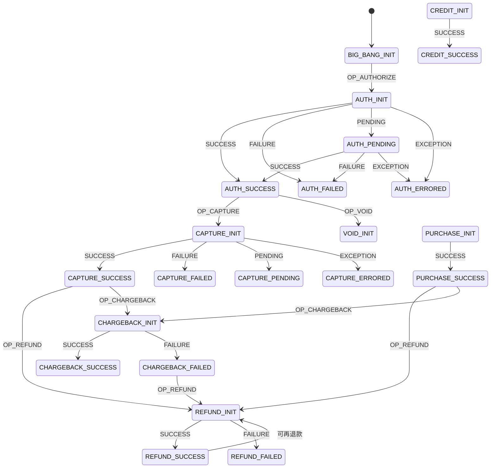
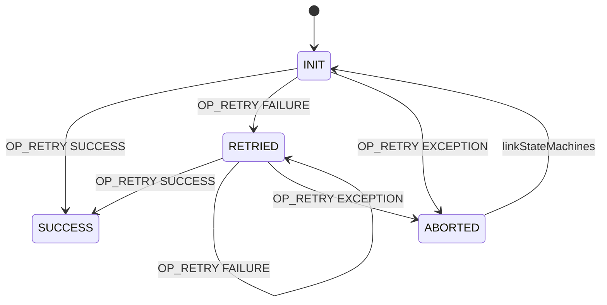
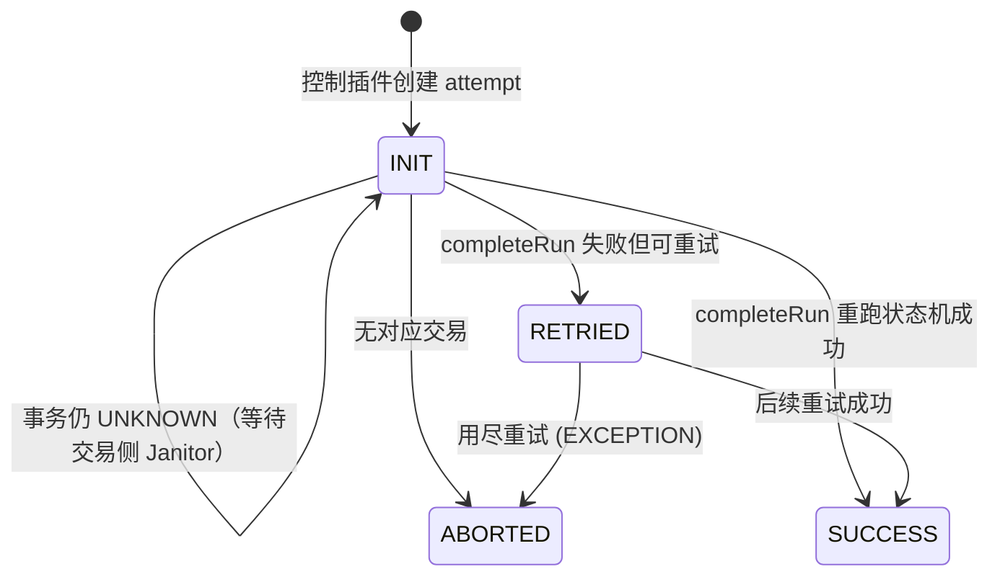
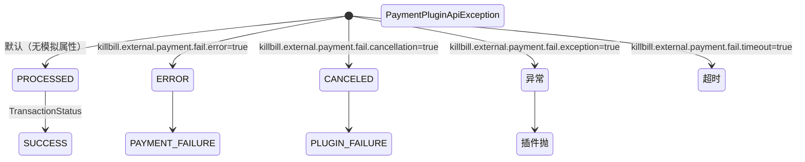
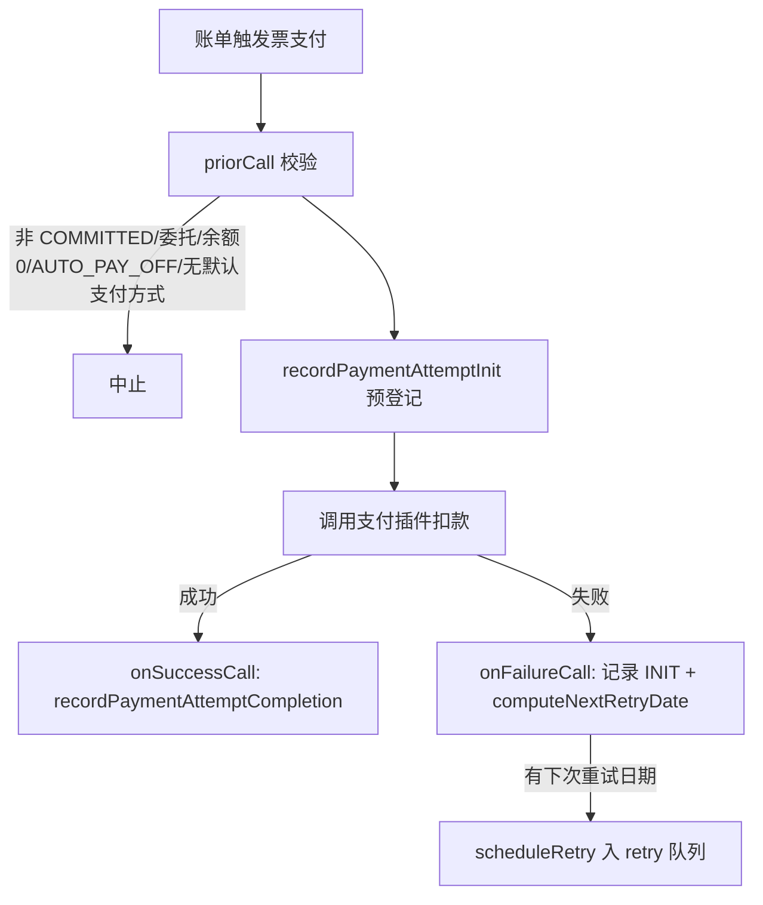

# 模块：payment

> 本模块共 91 张卡（BR 54, ENT 8, ROLE 3, SM 5, TERM 13, WF 8）。

支付/退款/拒付、支付控制插件、重试与 Janitor 修复、AUTO_PAY_OFF 等。

本模块卡片见下（ID 为全局编号，与 rules.md / glossary.md 等一致）。

---

## BR-228 支付失败重试计划（默认 8,8,8 天）

- **类型**: 业务规则
- **同义词**: 重试间隔, 重试天数, 重试次数, payment retry days, retry interval, 8 8 8
- **模块**: payment
- **置信度**: 🟢 confirmed
- **溯源**: `util/src/main/java/org/killbill/billing/util/config/definition/PaymentConfig.java:31-39`

**规则**：系统属性 `org.killbill.payment.retry.days`（默认 `8,8,8`）定义支付失败后的重试间隔（天）。默认值表示最多重试 3 次，每次间隔 8 天。

## BR-229 插件失败重试参数（初始 300 秒 / 倍数 2 / 最多 8 次）

- **类型**: 业务规则
- **同义词**: 网关重试, 插件失败重试, 指数退避, plugin failure retry, gateway down retry, retry multiplier
- **模块**: payment
- **置信度**: 🟢 confirmed
- **溯源**: `util/src/main/java/org/killbill/billing/util/config/definition/PaymentConfig.java:41-90`

**规则**：当支付失败原因是插件失败（网关宕机、瞬时错误等）时：
- `org.killbill.payment.failure.retry.start.sec` 默认 `300`，即首次重试等待 300 秒；
- `org.killbill.payment.failure.retry.multiplier` 默认 `2`，后续重试间隔按倍数递增（指数退避）；
- `org.killbill.payment.failure.retry.max.attempts` 默认 `8`，最多重试 8 次。

## BR-230 Janitor 未完成交易重试计划（UNKNOWN / PENDING）

- **类型**: 业务规则
- **同义词**: janitor 重试间隔, unknown retries, pending retries, 未完成交易重试, 支付巡检间隔
- **模块**: payment
- **置信度**: 🟢 confirmed
- **溯源**: `util/src/main/java/org/killbill/billing/util/config/definition/PaymentConfig.java:61-79`, `util/src/main/java/org/killbill/billing/util/config/definition/PaymentConfig.java:102-110`

**规则**：
- `org.killbill.payment.janitor.unknown.retries` 默认 `5m,1h,1d,1d,1d,1d,1d`，即 UNKNOWN 交易的回查/重试延迟序列；
- `org.killbill.payment.janitor.pending.retries` 默认 `1h, 1d`，即 PENDING 交易的回查/重试延迟序列；
- `org.killbill.payment.janitor.rate` 默认 `1h`，Janitor 主任务的调度频率；
- `org.killbill.payment.janitor.attempts.delay` 默认 `12h`，未完成支付尝试（attempt）的重试延迟。

## BR-231 AUTO_PAY_OFF 账户自动支付中止

- **类型**: 业务规则
- **同义词**: 自动支付关闭, 停止自动扣款, auto pay off, auto-payoff abort, 标签关闭自动支付
- **模块**: payment
- **置信度**: 🟢 confirmed
- **溯源**: `payment/src/main/java/org/killbill/billing/payment/invoice/InvoicePaymentControlPluginApi.java:730-745`, `payment/src/main/java/org/killbill/billing/payment/invoice/InvoicePaymentControlPluginApi.java:376-380`

**规则**：当发起非 API（系统自动）发票支付时，若账户带有 `AUTO_PAY_OFF` 标签（`ControlTagType.isAutoPayOff`），则：
1. 向 `invoice_payment_control_plugin_auto_pay_off` 表插入一条挂起记录（`PluginAutoPayOffModelDao`）；
2. 中止本次支付（返回 abort）。
**例外**：API 发起的支付（`isApiPayment()` 为 true）不受 AUTO_PAY_OFF 影响。

## BR-232 未提交(非 COMMITTED)发票不允许支付

- **类型**: 业务规则
- **同义词**: 草稿发票不扣款, 发票未提交, draft invoice payment, COMMITTED invoice, 发票状态校验
- **模块**: payment
- **置信度**: 🟢 confirmed
- **溯源**: `payment/src/main/java/org/killbill/billing/payment/invoice/InvoicePaymentControlPluginApi.java:341-351`

**规则**：购买（PURCHASE）前校验发票状态，若发票不是 `COMMITTED`（如 DRAFT），记录日志并中止支付（`DefaultPriorPaymentControlResult(true)`）。

## BR-233 委托给父账户的子账户发票不自动支付

- **类型**: 业务规则
- **同义词**: 父账户代付, 子账户委托, delegated payment, parent account payment, 子账户不扣款
- **模块**: payment
- **置信度**: 🟢 confirmed
- **溯源**: `payment/src/main/java/org/killbill/billing/payment/invoice/InvoicePaymentControlPluginApi.java:353-360`

**规则**：若账户的支付被委托给父账户（`accountData.isPaymentDelegatedToParent()` 为 true）或发票已关联父账户（`invoice.getParentAccountId() != null`），则中止本账户的支付扣款。

## BR-234 空发票(余额为 0)支付处理

- **类型**: 业务规则
- **同义词**: 零元发票, 空发票, 余额为零, zero amount invoice, empty invoice, allowEmptyInvoice
- **模块**: payment
- **置信度**: 🟢 confirmed
- **溯源**: `payment/src/main/java/org/killbill/billing/payment/invoice/InvoicePaymentControlPluginApi.java:362-374`, `util/src/main/java/org/killbill/billing/util/config/definition/PaymentConfig.java:138-141`

**规则**：当请求支付金额计算结果 ≤ 0（发票已付清）时：
- 若系统属性 `org.killbill.payment.allow.emptyInvoice` 为 `true`（默认 `false`），则**不中止**，继续以 0 元发起支付；
- 否则视为"发票已支付"并中止支付。

## BR-235 支付金额不得超过发票余额

- **类型**: 业务规则
- **同义词**: 支付金额校验, 超付校验, 余额上限, overpayment, invoice balance, invalid amount
- **模块**: payment
- **置信度**: 🟢 confirmed
- **溯源**: `payment/src/main/java/org/killbill/billing/payment/invoice/InvoicePaymentControlPluginApi.java:710-728`

**规则**：`validateAndComputePaymentAmount` 对金额做如下判定：
- 发票余额 ≤ 0 → 返回 0；
- 若为 API 支付且显式传入金额大于发票余额 → 抛 `PaymentApiException`（`PAYMENT_PLUGIN_EXCEPTION`，"Invalid amount"）；
- 否则取 `min(输入金额, 发票余额)` 作为实际支付金额；输入为 null 时取发票余额。

## BR-236 退款金额计算（按发票项或显式金额）

- **类型**: 业务规则
- **同义词**: 退款金额, 部分退款, 退款上限, refund amount, partial refund, invoice item adjustment
- **模块**: payment
- **置信度**: 🟢 confirmed
- **溯源**: `payment/src/main/java/org/killbill/billing/payment/invoice/InvoicePaymentControlPluginApi.java:529-556`, `payment/src/main/java/org/killbill/billing/payment/invoice/InvoicePaymentControlPluginApi.java:438-478`

**规则**：
- 若显式指定退款金额（`specifiedRefundAmount`），必须 > 0，否则报错"需要指定正数退款金额"；该金额直接作为退款额。
- 若未指定，则按退款关联的发票项（`invoiceItemIdsWithAmounts`）累加：每项可取显式金额（必须 > 0 且不超过该项原始金额）或默认取该项原始金额。
- 若计算出的可退金额为 0 且为 API 支付 → 抛错中止退款。

## BR-237 失败支付的下次重试日期计算

- **类型**: 业务规则
- **同义词**: 重试日期, 下次重试, retry date, next retry, 重试计划计算, IPCD_RETRIES
- **模块**: payment
- **置信度**: 🟢 confirmed
- **溯源**: `payment/src/main/java/org/killbill/billing/payment/invoice/InvoicePaymentControlPluginApi.java:567-628`

**规则**：`computeNextRetryDate` 决定失败购买交易是否/何时重试：
- **API 发起的支付默认不重试**：除非插件属性 `IPCD_RETRIES` 为 true，否则 `isApiPayment` 为真时直接返回 null（不重试）。
- 取该支付下最后一次 PURCHASE 交易的状态：
  - `PAYMENT_FAILURE` → 按 `org.killbill.payment.retry.days`（默认 8,8,8）取第 `retryCount` 天的间隔；`retryCount = 已处于 PAYMENT_FAILURE 的尝试数 - 1`；超过重试天数数组长度则不再重试。
  - `PLUGIN_FAILURE` → 按失败重试次数做指数退避：`nbSec = start.sec × multiplier^(retryAttempt-1)`，其中 retryAttempt = 已处于 PLUGIN_FAILURE 的尝试数 - 1；达到 `max.attempts`（默认 8）后不再重试。
  - `UNKNOWN` / 其他 → 不重试。

## BR-238 默认支付方式取自账户 (account.paymentMethodId)

- **类型**: 业务规则
- **同义词**: 默认支付方式, 账户默认卡, default payment method, account payment method, 自动扣款用哪张卡
- **模块**: payment
- **置信度**: 🟢 confirmed
- **溯源**: `payment/src/main/java/org/killbill/billing/payment/core/PaymentProcessor.java:252-257`, `payment/src/main/java/org/killbill/billing/payment/invoice/InvoicePaymentControlPluginApi.java:382-397`

**规则**：执行支付时若调用方未显式传入 `paymentMethodId`，则使用账户上的默认支付方式（`account.getPaymentMethodId()`）。在发票自动支付场景中，若控制上下文 `getPaymentMethodId()` 为 null（账户无默认支付方式），则记录一条 `InvoicePaymentStatus.INIT` 的支付尝试完成事件并**中止**本次扣款（不会被触发）。

## BR-239 插件状态(PluginStatus)到交易状态/操作结果的映射

- **类型**: 业务规则
- **同义词**: 插件状态, 支付结果映射, plugin status, PaymentPluginStatus, PROCESSED, CANCELED, UNDEFINED, 交易状态转换
- **模块**: payment
- **置信度**: 🟢 confirmed
- **溯源**: `payment/src/main/java/org/killbill/billing/payment/core/PaymentTransactionInfoPluginConverter.java:33-72`

**规则**：将支付插件返回的 `PaymentPluginStatus` 映射为内部 `TransactionStatus`（和操作结果 `OperationResult`）：

| 插件状态 | TransactionStatus | OperationResult | 含义 |
|---|---|---|---|
| `PROCESSED` | `SUCCESS` | `SUCCESS` | 交易成功 |
| `PENDING` | `PENDING` | `PENDING` | 处理中，待确认 |
| `ERROR` | `PAYMENT_FAILURE` | `FAILURE` | 交易到达网关但被拒（如信用卡被拒） |
| `CANCELED` | `PLUGIN_FAILURE` | `EXCEPTION` | 插件确信交易未发生（连接失败等） |
| `UNDEFINED`/null | `UNKNOWN` | `EXCEPTION` | 结果未知，交 Janitor 回查修正 |

## BR-240 单笔支付不允许并发的未决交易

- **类型**: 业务规则
- **同义词**: 防重复扣款, 未决交易, 并发支付, double payment, pending transaction, 重复提交
- **模块**: payment
- **置信度**: 🟢 confirmed
- **溯源**: `payment/src/main/java/org/killbill/billing/payment/core/PaymentProcessor.java:352-385`, `payment/src/main/java/org/killbill/billing/payment/core/PaymentProcessor.java:308-310`

**规则**：
- 对 AUTHORIZE / PURCHASE / CREDIT，若同一支付下已存在 `PENDING` 状态的交易且调用未指定该交易 id/key，则抛 `PAYMENT_INVALID_OPERATION` 阻止新交易（防止重复扣款）。
- 若待完成的交易处于 `UNKNOWN` 状态，则无法确定其在状态机中的位置，直接抛 `PAYMENT_INVALID_OPERATION` 拒绝本次操作。
- 同一 `transactionExternalKey` 不允许已有成功的非 CHARGEBACK 交易（`PAYMENT_ACTIVE_TRANSACTION_KEY_EXISTS`），且该 key 不能跨账户（`PAYMENT_TRANSACTION_DIFFERENT_ACCOUNT_ID`）。

## BR-241 执行交易前先调用 Janitor 修正状态

- **类型**: 业务规则
- **同义词**: 先巡检再支付, janitor 修正, refresh before payment, 支付前修复状态
- **模块**: payment
- **置信度**: 🟢 confirmed
- **溯源**: `payment/src/main/java/org/killbill/billing/payment/core/PaymentProcessor.java:282-290`

**规则**：执行任何支付操作（`performOperation`）时，若该支付已存在，系统**先**调用 `paymentRefresher.invokeJanitor` 获取插件最新状态并修正本地状态，**然后**才让状态机推进交易。这样可避免因为本地状态陈旧而做出错误的状态流转（如重复扣款或错误拒绝）。

## BR-242 Janitor 下次回查时间计算（UNKNOWN/PENDING 重试表）

- **类型**: 业务规则
- **同义词**: janitor 回查间隔, 下次巡检时间, janitor retry schedule, unknown retries, pending retries
- **模块**: payment
- **置信度**: 🟢 confirmed
- **溯源**: `payment/src/main/java/org/killbill/billing/payment/core/janitor/IncompletePaymentAttemptTask.java:401-418`

**规则**：`getNextNotificationTime` 根据交易状态选择延迟表：
- `UNKNOWN` → 使用 `org.killbill.payment.janitor.unknown.retries`（默认 `5m,1h,1d,1d,1d,1d,1d`）；
- `PENDING` → 使用 `org.killbill.payment.janitor.pending.retries`（默认 `1h, 1d`）；
- 取第 `attemptNumber` 个延迟作为下次通知时间；若 `attemptNumber > 表长度`，返回 null（不再回查）。

## BR-243 支付控制插件可调整支付参数，默认禁止覆盖已有支付方式

- **类型**: 业务规则
- **同义词**: 控制插件调整, 修改支付方式, overwrite payment method, adjusted payment method, 插件改金额
- **模块**: payment
- **置信度**: 🟢 confirmed
- **溯源**: `payment/src/main/java/org/killbill/billing/payment/core/sm/control/ControlPluginRunner.java:128-151`, `util/src/main/java/org/killbill/billing/util/config/definition/PaymentConfig.java:133-136`

**规则**：控制插件 `priorCall` 返回值可调整：支付方式 id（`AdjustedPaymentMethodId`）、插件名、金额、币种、插件属性；任一插件的 `isAborted()` 为真则抛 `PaymentControlApiAbortException` 中止。**覆盖限制**：若插件试图设置 paymentMethodId，但该支付已存在 paymentMethodId 且系统属性 `org.killbill.payment.method.overwrite` 为 `false`（默认），则抛 `PaymentControlApiException` 拒绝覆盖。

## BR-244 支付插件按支付方式的 pluginName 查找

- **类型**: 业务规则
- **同义词**: 插件查找, 找不到插件, payment plugin lookup, no such payment plugin, plugin not found
- **模块**: payment
- **置信度**: 🟢 confirmed
- **溯源**: `payment/src/main/java/org/killbill/billing/payment/core/PaymentPluginServiceRegistration.java:80-91`

**规则**：执行支付时，系统根据支付方式记录里的 `pluginName` 从 OSGI 注册表查找对应 `PaymentPluginApi`；若插件未注册，抛 `PaymentApiException(ErrorCode.PAYMENT_NO_SUCH_PAYMENT_PLUGIN, pluginName)`。

## BR-245 支付插件调用超时与线程配置

- **类型**: 业务规则
- **同义词**: 插件超时, 支付线程数, 插件调用超时, payment plugin timeout, plugin threads, dispatch timeout
- **模块**: payment
- **置信度**: 🟢 confirmed
- **溯源**: `payment/src/main/java/org/killbill/billing/payment/dispatcher/PluginDispatcher.java:44-69`, `util/src/main/java/org/killbill/billing/util/config/definition/PaymentConfig.java:118-131`

**规则**：
- `org.killbill.payment.plugin.timeout` 默认 `30s`：每个支付插件调用通过独立线程池执行，超过该超时抛 `TimeoutException`；
- `org.killbill.payment.plugin.threads.nb` 默认 `10`：插件调度线程池大小；
- `org.killbill.payment.globalLock.retries` 默认 `50`：获取全局锁（每次等待 100ms）的最大重试次数。

## BR-246 支付错误事件与插件错误事件

- **类型**: 业务规则
- **同义词**: 支付错误事件, 插件错误事件, payment error event, plugin error event, bus event, 快照事件
- **模块**: payment
- **置信度**: 🟢 confirmed
- **溯源**: `payment/src/main/java/org/killbill/billing/payment/api/DefaultPaymentErrorEvent.java:32-58`, `payment/src/main/java/org/killbill/billing/payment/api/DefaultPaymentPluginErrorEvent.java:32-58`, `payment/src/main/java/org/killbill/billing/payment/core/sm/payments/PaymentEnteringStateCallback.java:49-82`

**规则**：
- `DefaultPaymentErrorEvent`（bus 类型 `PAYMENT_ERROR`）：当交易未创建且调用来自非 API（如自动扣款）时发送，消息为"Early abortion of payment transaction"（如缺少默认支付方式等异常情况）。
- `DefaultPaymentPluginErrorEvent`（bus 类型 `PAYMENT_PLUGIN_ERROR`）：插件层错误事件。
- 两者均携带 accountId / paymentId / paymentTransactionId / amount / currency / status / transactionType / effectiveDate / apiPayment / message。

## BR-247 外部支付通过插件属性模拟失败（测试/演示语义）

- **类型**: 业务规则
- **同义词**: 外部支付失败模拟, external payment fail, killbill.external.payment.fail, 演示失败
- **模块**: payment
- **置信度**: 🟢 confirmed
- **溯源**: `payment/src/main/java/org/killbill/billing/payment/provider/ExternalPaymentProviderPlugin.java:144-178`

**规则**：`__EXTERNAL_PAYMENT__` 插件根据插件属性决定返回结果，便于记录/演示各种外部支付情形：
- `killbill.external.payment.fail.error=true` → 返回 `PaymentPluginStatus.ERROR`（支付失败）；
- `killbill.external.payment.fail.exception=true` → 抛 `PaymentPluginApiException`；
- `killbill.external.payment.fail.cancellation=true` → 返回 `CANCELED`（插件失败）；
- `killbill.external.payment.fail.timeout=true` → 休眠 `payment.plugin.timeout + 1000ms` 触发超时；
- 默认返回 `PROCESSED`（成功记录）。

## BR-248 外部支付（__EXTERNAL_PAYMENT__）的用途

- **类型**: 业务规则
- **同义词**: 外部支付用途, 线下支付记录, external payment usage, 记录支票支付, 手动入账
- **模块**: payment
- **置信度**: 🟢 confirmed
- **溯源**: `payment/src/main/java/org/killbill/billing/payment/provider/ExternalPaymentProviderPlugin.java:47-52`, `util/src/main/java/org/killbill/billing/util/config/definition/PaymentConfig.java:112-116`, `payment/src/main/java/org/killbill/billing/payment/provider/DefaultPaymentProviderPluginRegistry.java:40-43`

**规则**：`__EXTERNAL_PAYMENT__` 用于**记录并非由 Kill Bill 发起/处理的外部支付**（例如支票、银行转账已到账），它不做真实网关交互，直接把交易标记为成功。系统属性 `org.killbill.payment.provider.default`（默认 `__external_payment__`）指定默认支付提供者。因此当某支付方式绑定到该插件时，Kill Bill 只记录该笔支付而不调用任何外部网关。

## BR-249 各交易类型的插件操作与无金额操作

- **类型**: 业务规则
- **同义词**: 交易类型操作, void 无金额, authorize capture purchase, 插件方法映射, 无金额撤销
- **模块**: payment
- **置信度**: 🟢 confirmed
- **溯源**: `payment/src/main/java/org/killbill/billing/payment/provider/ExternalPaymentProviderPlugin.java:63-101`, `payment/src/main/java/org/killbill/billing/payment/core/PaymentProcessor.java:100-143`

**规则**：每类交易对应插件的不同方法，且金额语义不同：
- `AUTHORIZE`→`authorizePayment`（带金额）、`CAPTURE`→`capturePayment`（带金额）、`PURCHASE`→`purchasePayment`（带金额）；
- `REFUND`→`refundPayment`（带退款金额）、`CREDIT`→`creditPayment`（带金额）；
- `VOID`→`voidPayment`（**不带金额**，插件侧以 `BigDecimal.ZERO`/null 币种表示）；
- `CHARGEBACK`→由 `createChargeback`/`createChargebackReversal` 触发（拒绝即冲销，`ChargebackReversal` 使用 `OperationResult.FAILURE`）。
`PaymentProcessor` 对外暴露 `createAuthorization` / `createCapture` / `createPurchase` / `createVoid` / `createRefund` / `createCredit` / `createChargeback` / `createChargebackReversal` 等入口。

## BR-250 支付状态机 linkStateMachines：交易类型的先后约束

- **类型**: 业务规则
- **同义词**: 交易顺序, 授权后捕获, 捕获后退款, state machine links, 允许的交易链
- **模块**: payment
- **置信度**: 🟢 confirmed
- **溯源**: `payment/src/main/resources/org/killbill/billing/payment/PaymentStates.xml:412-497`

**规则**：`linkStateMachines` 定义了不同交易类型之间的合法衔接（即"下一步能做什么"）：
- 从 `BIG_BANG_INIT` 可发起 AUTHORIZE / PURCHASE / CREDIT；
- `AUTH_SUCCESS` 后只能转向 CAPTURE 或 VOID；
- `CAPTURE_SUCCESS` 后可转向 REFUND、再次 CAPTURE、或 CHARGEBACK；
- `PURCHASE_SUCCESS` 后可转向 REFUND 或 CHARGEBACK；
- `REFUND_SUCCESS` 后可再次 REFUND 或 CHARGEBACK；
- `CHARGEBACK_SUCCESS` 后可再次 CHARGEBACK（多次拒付），`CHARGEBACK_FAILED` 后可 REFUND。

这解释了业务上"必须先授权再捕获、捕获后才能退款、拒付只能在扣款/退款之后"等顺序约束。

## BR-251 支付状态机成功态判定

- **类型**: 业务规则
- **同义词**: 成功态判定, isSuccessState, success state, 支付成功判断
- **模块**: payment
- **置信度**: 🟢 confirmed
- **溯源**: `payment/src/main/java/org/killbill/billing/payment/core/sm/PaymentStateMachineHelper.java:236-239`

**规则**：`isSuccessState(stateName)` 判定某状态是否成功态：状态名以 `SUCCESS` 结尾**或**以 `CHARGEBACK` 开头（即所有 `CHARGEBACK_*` 状态都被视为成功，因为拒付本身是"已确认发生"的终态）。

<!-- module: payment | final | cards: see confidence report -->

## BR-252 支付 state 命名规则与 last_success_state_name 恢复

- **类型**: 业务规则
- **同义词**: 支付状态命名, 成功态恢复, last success state, 重试恢复点, payment state naming, lastSuccessStateName
- **模块**: payment
- **置信度**: 🟢 confirmed
- **溯源**: `payment/src/main/java/org/killbill/billing/payment/core/sm/PaymentStateMachineHelper.java:83-110`, `payment/src/main/java/org/killbill/billing/payment/core/sm/PaymentStateMachineHelper.java:121-203`, `payment/src/main/java/org/killbill/billing/payment/core/PaymentProcessor.java:316-320`, `payment/src/main/resources/org/killbill/billing/payment/ddl.sql:106-121`

**规则**：支付状态名统一为 `<TYPE>_<RESULT>`，共 **28** 个合法 name（`PaymentStateMachineHelper.STATE_NAMES`）：

- `<TYPE>_INIT`（初始，由 XML 定义但不在 `STATE_NAMES` 列表）、
- `<TYPE>_PENDING`（7 个：AUTH/CAPTURE/PURCHASE/REFUND/CREDIT/VOID/CHARGEBACK_PENDING）、
- `<TYPE>_SUCCESS`（7 个）、
- `<TYPE>_FAILED`（7 个）、
- `<TYPE>_ERRORED`（7 个）。

**成功态定义**：状态名以 `SUCCESS` 结尾，或以 `CHARGEBACK` 开头（即所有 `CHARGEBACK_*` 都算成功态）。

**恢复点**：`payments.last_success_state_name` 持久化最近一次成功态；执行后续交易时 `PaymentProcessor` 以 `currentStateName = payment.getLastSuccessStateName()` 作为状态机再入点，从而支持"失败后重试"从上次成功点继续（`payment/src/main/java/org/killbill/billing/payment/core/PaymentProcessor.java:316-320`）。

**数据表**：`payments.state_name` (varchar 64) 与 `payments.last_success_state_name` (varchar 64)（`payment/src/main/resources/org/killbill/billing/payment/ddl.sql:112-113`）。

## BR-253 插件返回 null/UNDEFINED 的兜底与"状态不可推进"

- **类型**: 业务规则
- **同义词**: 空插件结果, 结果未知, null status, UNDEFINED 兜底, unknown transaction, 无插件信息
- **模块**: payment
- **置信度**: 🟢 confirmed
- **溯源**: `payment/src/main/java/org/killbill/billing/payment/core/PaymentTransactionInfoPluginConverter.java:33-72`, `payment/src/main/java/org/killbill/billing/payment/provider/DefaultNoOpPaymentInfoPlugin.java:47-50`, `payment/src/main/java/org/killbill/billing/payment/core/janitor/IncompletePaymentTransactionTask.java:224-229`

**规则**：
- 转换器对 `getStatus()` 为 `null` 的插件结果用 `Objects.requireNonNullElse(..., UNDEFINED)` 兜底，最终得到 `TransactionStatus.UNKNOWN` / `OperationResult.EXCEPTION`。
- Janitor 计算"新状态"时：若插件返回 `UNKNOWN`，则**保留原 `currentTransactionStatus`**（`computeNewTransactionStatusFromPaymentTransactionInfoPlugin`），从而不会把 PENDING 误降级。
- `DefaultNoOpPaymentInfoPlugin(..., PaymentPluginStatus.UNDEFINED, null, null)` 用于"取不到插件信息"的占位（例如 `getPaymentInfo` 抛异常时）。

**含义**：`UNDEFINED`/null 绝不代表成功或失败，只代表"结果未知"，必须由 Janitor 收敛（见 BR-258/BR-259）。

## BR-254 新建交易先以 UNKNOWN 落库，再由插件结果"两阶段"更新

- **类型**: 业务规则
- **同义词**: 初始未知, 两阶段写入, transaction 初始状态, create transaction unknown, 先写后更, processed amount
- **模块**: payment
- **置信度**: 🟢 confirmed
- **溯源**: `payment/src/main/java/org/killbill/billing/payment/core/sm/PaymentAutomatonDAOHelper.java:295-330`, `payment/src/main/java/org/killbill/billing/payment/core/sm/PaymentAutomatonDAOHelper.java:139-231`

**规则**：
- `buildNewPaymentTransactionModelDao` 创建交易时**固定写 `TransactionStatus.UNKNOWN`**，此时 `processed_amount`/`processed_currency` 为 null（`payment/src/main/java/org/killbill/billing/payment/core/sm/PaymentAutomatonDAOHelper.java:311,324`）。
- 插件调用完成后由 `processPaymentInfoPlugin` 更新交易与支付：
  - `SUCCESS`/`PENDING` → `processedAmount = 插件返回的 amount`（插件 amount 为空则用默认值），`processedCurrency = 插件 currency`（为空则默认币种）；
  - 其余状态（失败类）→ `processedAmount = BigDecimal.ZERO`；
  - 同时写 `gateway_error_code`/`gateway_error_msg`。
- 若新 state 是成功态，则 `lastSuccessPaymentState = currentPaymentStateName` 一并落库（供 BR-252 的重试恢复）。

**含义**：`payment_transactions` 中存在过 `UNKNOWN` 的中间态行；最终状态取决于插件回包。若进程在插件调用后崩溃，交易会停留在 `UNKNOWN`，由 Janitor 收敛（见 BR-258）。

## BR-255 支付失败默认重试计划（8,8,8）的精确计算

- **类型**: 业务规则
- **同义词**: 重试计划, 重试天数计算, retry days, 8 8 8, next retry date, 第几次重试, payment failure retry
- **模块**: payment
- **置信度**: 🟢 confirmed
- **溯源**: `payment/src/main/java/org/killbill/billing/payment/invoice/InvoicePaymentControlPluginApi.java:592-610`, `payment/src/main/java/org/killbill/billing/payment/invoice/InvoicePaymentControlPluginApi.java:630-639`, `util/src/main/java/org/killbill/billing/util/config/definition/PaymentConfig.java:31-39`

**规则**：属性 `org.killbill.payment.retry.days`，默认 `8,8,8`（列表长度=最大重试次数，元素=间隔天数）。计算（`getNextRetryDateForPaymentFailure`）：

- `attemptsInState` = 该 payment 下所有 `PURCHASE` 交易中 `TransactionStatus = PAYMENT_FAILURE` 的条数；
- `retryCount = max(attemptsInState - 1, 0)`；
- 若 `retryCount < retryDays.size()` → 下次重试时间 = `internalContext.getCreatedDate() + retryDays.get(retryCount)` 天；
- 否则返回 `null`（不再重试）。

**默认时间点（首次失败起算）**：第 1 次重试在 **8 天**后，第 2 次在再 **8 天**后，第 3 次在再 **8 天**后；之后不再重试。

**例外/边界**：`retryCount` 由**历史失败次数**决定，而非当前会话——同一 payment 若历史已有 N 次 `PAYMENT_FAILURE`，本次失败直接跳到第 N+1 个间隔。

## BR-256 插件失败（网关宕机）的指数退避重试

- **类型**: 业务规则
- **同义词**: 网关失败重试, 指数退避, plugin failure retry, 300 秒, multiplier, 最大 8 次, gateway down
- **模块**: payment
- **置信度**: 🟢 confirmed
- **溯源**: `payment/src/main/java/org/killbill/billing/payment/invoice/InvoicePaymentControlPluginApi.java:612-628`, `util/src/main/java/org/killbill/billing/util/config/definition/PaymentConfig.java:41-59`, `util/src/main/java/org/killbill/billing/util/config/definition/PaymentConfig.java:82-90`

**规则**：当最后一次 `PURCHASE` 交易状态为 `PLUGIN_FAILURE`（插件失败）时走指数退避（`getNextRetryDateForPluginFailure`）：

- `attemptsInState` = 该 payment 下 `PURCHASE` 中 `PLUGIN_FAILURE` 的条数；`retryAttempt = max(attemptsInState - 1, 0)`；
- 若 `retryAttempt >= org.killbill.payment.failure.retry.max.attempts`（默认 `8`）→ 返回 `null`（不再重试）；
- 否则 `nbSec = start × multiplier^(retryAttempt-1)`，其中 `start = org.killbill.payment.failure.retry.start.sec`（默认 `300`）、`multiplier = org.killbill.payment.failure.retry.multiplier`（默认 `2`）；通过循环 `while (--remainingAttempts > 0) nbSec *= multiplier`（`remainingAttempts` 初值=retryAttempt）实现：
  - `retryAttempt=1` → `300s`
  - `retryAttempt=2` → `600s`
  - `retryAttempt=3` → `1200s` …；
- 下次重试时间 = `createdDate + nbSec` 秒。

**含义**：`PAYMENT_FAILURE`（卡被拒）按"天"重试，`PLUGIN_FAILURE`（网关/连接失败）按"秒"指数退避——两条完全独立的计划。

## BR-257 失败类型决定是否重试：UNKNOWN 不重试、API 支付默认不重试

- **类型**: 业务规则
- **同义词**: 是否重试, 不重试情形, unknown not retried, api payment retry, IPCD_RETRIES, 重试判定分支
- **模块**: payment
- **置信度**: 🟢 confirmed
- **溯源**: `payment/src/main/java/org/killbill/billing/payment/invoice/InvoicePaymentControlPluginApi.java:567-590`, `payment/src/main/java/org/killbill/billing/payment/core/sm/control/DefaultControlCompleted.java:91-106`

**规则**：`computeNextRetryDate` 的分支判定，以该 payment 下**最后一个 PURCHASE 交易**的状态为准：

| 最后 PURCHASE 状态 | 是否重试 | 依据 |
|---|---|---|
| `PAYMENT_FAILURE` | 是，按 `org.killbill.payment.retry.days`（默认 8,8,8） | BR-255 |
| `PLUGIN_FAILURE` | 是，按指数退避（默认 300s×2^n，最多 8 次） | BR-256 |
| `UNKNOWN` 或其他 | **否**（返回 null） | 代码 default 分支 |
| 无 PURCHASE 交易 | 否 | `purchasedTransactions.size()==0` |

**另外两条例外**：
- **API 发起的支付默认不重试**：`if (!ipcdRetries && isApiPayment) return null;`，除非控制插件属性 `IPCD_RETRIES=true`（默认 false）。
- **即使算出了重试日期，若交易处于 UNKNOWN 也不会真的入队**：`DefaultControlCompleted.enteringState` 中 `if (retriedState.equals(state) && !isUnknownTransaction())` 才 `scheduleRetry`，避免坏插件造成无限重试（UNKNOWN 交给 Janitor）。

## BR-258 Janitor 处理范围：只修 PENDING / UNKNOWN，且 UNKNOWN 不改状态

- **类型**: 业务规则
- **同义词**: janitor 处理范围, PENDING 修复, UNKNOWN 修复, incomplete transaction, 未决交易, 回查
- **模块**: payment
- **置信度**: 🟢 confirmed
- **溯源**: `payment/src/main/java/org/killbill/billing/payment/core/janitor/IncompletePaymentTransactionTask.java:63`, `payment/src/main/java/org/killbill/billing/payment/core/janitor/IncompletePaymentTransactionTask.java:119-155`, `payment/src/main/java/org/killbill/billing/payment/core/janitor/IncompletePaymentTransactionTask.java:224-229`

**规则**：
- 常量 `TRANSACTION_STATUSES_TO_CONSIDER = [PENDING, UNKNOWN]`——只有这两种状态的交易会被 Janitor 巡检；其它状态直接返回当前状态（no-op）。
- 巡检时先对 account 加锁（`LockerType.ACCNT_INV_PAY`），锁内重新读交易（防止竞态），再次确认状态属于 `[PENDING, UNKNOWN]`。
- 插件回查 `getPaymentInfo` 得到结果后：若映射出的 `TransactionStatus` 仍是 `UNKNOWN`，则**保留原状态不变**（避免把 PENDING 错误降级）；匹配不到插件交易时用 `DefaultNoOpPaymentInfoPlugin(..., UNDEFINED)` 兜底。

## BR-259 Janitor 修复映射与写入（交易状态 → 支付状态）

- **类型**: 业务规则
- **同义词**: janitor 状态映射, 修复支付状态, repair state, errored state, failure state, pending state
- **模块**: payment
- **置信度**: 🟢 confirmed
- **溯源**: `payment/src/main/java/org/killbill/billing/payment/core/janitor/IncompletePaymentTransactionTask.java:158-222`, `payment/src/main/java/org/killbill/billing/payment/core/sm/PaymentStateMachineHelper.java:121-203`, `payment/src/main/java/org/killbill/billing/payment/core/sm/PaymentAutomatonDAOHelper.java:139-231`

**规则**：Janitor 得到新的 `TransactionStatus` 后按下表决定 `payments.state_name`（针对该交易的 transactionType）：

| 新 TransactionStatus | 目标 payment state |
|---|---|
| `SUCCESS` | `getSuccessfulStateForTransaction(type)` = `<TYPE>_SUCCESS` |
| `PENDING` | `getPendingStateForTransaction(type)` = `<TYPE>_PENDING` |
| `PAYMENT_FAILURE` | `getFailureStateForTransaction(type)` = `<TYPE>_FAILED` |
| `PLUGIN_FAILURE` | `getErroredStateForTransaction(type)` = `<TYPE>_ERRORED` |
| `UNKNOWN` | 跳过，不写库（无法从插件得到有用信息） |

**写入前提**：仅当新旧状态**确实不同**时才 `processPaymentInfoPlugin`（"Repairing..." 日志）；状态相同则只安排下一次回查通知（见 BR-261）。写入通过 `PaymentAutomatonDAOHelper.processPaymentInfoPlugin` 同时更新 `payments` 与 `payment_transactions`，并写 `processed_amount/processed_currency`、`gateway_error_*`；若新 state 是成功态则同时更新 `last_success_state_name`。

**身份**：修复调用使用 `CallOrigin.INTERNAL + UserType.SYSTEM`，调用方名 `IncompletePaymentTransactionTask`。

## BR-260 重试通知的键、队列与"成功后取消重试"

- **类型**: 业务规则
- **同义词**: 重试通知, retry notification, notification key, 取消重试, cancel scheduled retry, retry queue
- **模块**: payment
- **置信度**: 🟢 confirmed
- **溯源**: `payment/src/main/java/org/killbill/billing/payment/retry/PaymentRetryNotificationKey.java:29-47`, `payment/src/main/java/org/killbill/billing/payment/retry/BaseRetryService.java:116-164`, `payment/src/main/java/org/killbill/billing/payment/retry/DefaultRetryService.java:31-46`, `payment/src/main/java/org/killbill/billing/payment/core/PaymentProcessor.java:159-205`, `payment/src/main/java/org/killbill/billing/payment/core/sm/control/CompletionControlOperation.java:101-108`

**规则**：
- retry 队列名 = `retry`（`DefaultRetryService.QUEUE_NAME`），服务名 = `payment-service-retry`；通知负载 `PaymentRetryNotificationKey{attemptId, paymentControlPluginNames}`（只有这两个字段，重试时靠 attemptId 回查其余参数）。
- 入队 API：`RetryServiceScheduler.scheduleRetry(objectType, objectId, attemptId, tenantRecordId, pluginNames, timeOfRetry)`；`null` 时间不排期。
- **成功即取消**：支付成功后 `CompletionControlOperation` 调用 `paymentProcessor.cancelScheduledPaymentTransaction(attemptId, ctx)`，从 retry 队列移除该 attemptId 的所有未来通知（`retryQueue.removeNotification(recordId)`）。
- 对外 getPayment 的 `withAttempts=true` 会把未来重试通知投影为 state=`SCHEDULED` 的虚拟 attempt（见 ENT-054）。

## BR-261 Janitor 通知调度、重试耗尽与锁失败重排

- **类型**: 业务规则
- **同义词**: janitor 通知, attemptNumber, 重试耗尽, 不再回查, lock failed, 重新排队, janitor schedule
- **模块**: payment
- **置信度**: 🟢 confirmed
- **溯源**: `payment/src/main/java/org/killbill/billing/payment/core/janitor/IncompletePaymentAttemptTask.java:378-418`, `payment/src/main/java/org/killbill/billing/payment/core/janitor/IncompletePaymentAttemptTask.java:129-148`, `util/src/main/java/org/killbill/billing/util/config/definition/PaymentConfig.java:61-79`

**规则**：
- 每次回查未修复时，`insertNewNotificationForUnresolvedTransactionIfNeeded` 将 `newAttemptNumber = attemptNumber + 1`，构造 `JanitorNotificationKey(paymentTransactionId, IncompletePaymentTransactionTask.class, isApiPayment, newAttemptNumber)` 后入队。
- 下次时间 `getNextNotificationTime(status, attemptNumber)`：`UNKNOWN → org.killbill.payment.janitor.unknown.retries`（默认 `5m,1h,1d,1d,1d,1d,1d`）；`PENDING → org.killbill.payment.janitor.pending.retries`（默认 `1h, 1d`）；取第 `attemptNumber-1` 个延迟；**若 `attemptNumber > 表长度` → 返回 null，不再入队（重试耗尽）**。
- 其它非 PENDING/UNKNOWN 状态会出现 log.warn "Unexpected transactionStatus from janitor, ignore..." 且 `retries` 为空 → 不再回查。
- **锁失败重排**：`processNotification` 捕获 `LockFailedException` 后，若交易仍是 PENDING/UNKNOWN，则以**同一个 attemptNumber** 重新走 `insertNewNotificationForUnresolvedTransactionIfNeeded`（内部再 +1），即继续下一次回查而不是丢弃。
- 负载中的 `isApiPayment` 会一路传递；老数据为 null 时按 **false** 处理。

**耗尽后的结果**：不再有新的 janitor 回查；交易停留在 `PENDING`/`UNKNOWN`；若之后插件侧状态变化，只能由新的操作（`PaymentProcessor.performOperation` 前的 on-the-fly Janitor）或 attempt 侧收尾再触发。

## BR-262 重试金额由 attempt.amount 驱动（而非 processedAmount）

- **类型**: 业务规则
- **同义词**: 重试金额, attempt amount, 使用请求金额, processed amount, 重试驱动金额, retry amount
- **模块**: payment
- **置信度**: 🟢 confirmed
- **溯源**: `payment/src/main/java/org/killbill/billing/payment/core/sm/control/DefaultControlCompleted.java:64-74`, `payment/src/main/java/org/killbill/billing/payment/core/PluginControlPaymentProcessor.java:315-331`, `payment/src/main/java/org/killbill/billing/payment/core/PaymentRefresher.java:568-582`

**规则**：
- 每次状态流转时，`DefaultControlCompleted.enteringState` 用 `paymentStateContext.getAmount()`（**请求金额**，可能已被 priorCall 调整）更新 attempt，而**不是** `processedAmount`——因为请求金额才是驱动后续重试的金额（代码注释明确）。
- 重试执行时，`PluginControlPaymentProcessor.retryPaymentTransaction` 明确以 `attempt.getAmount()` 作为新交易的金额传给状态机（注释："payment attempt 上的金额驱动新支付交易的金额"）。
- 失败的交易 `processedAmount` 会被写成 `ZERO`（BR-254），因此如果误用 processedAmount 重试会变成 0 元——所以必须用 attempt.amount。

**含义**：`payment_attempts.amount` 是重试语义上的"应付金额"；`payment_transactions.processed_amount` 是"插件实收金额"，两者不可互换。

## BR-263 支付配置的全局属性 vs 租户级覆盖

- **类型**: 业务规则
- **同义词**: 全局配置, 租户配置, per-tenant config, tenant override, system property, payment config, 覆盖配置
- **模块**: payment
- **置信度**: 🟢 confirmed
- **溯源**: `payment/src/main/java/org/killbill/billing/payment/config/MultiTenantPaymentConfig.java:45-141`, `util/src/main/java/org/killbill/billing/util/config/tenant/MultiTenantConfigBase.java:85-103`, `util/src/main/java/org/killbill/billing/util/config/definition/PaymentConfig.java:31-105`

**规则**：
- **全局**：通过系统属性（skife `@Config`）设置，如 `-Dorg.killbill.payment.retry.days=8,8,8`；见 `PaymentConfig` 各 `@Config`/`@Default`。
- **租户级覆盖**：`MultiTenantPaymentConfig` 实现带 `InternalTenantContext` 的重载；`getStringTenantConfig(methodName, tenantContext)` 以**方法名**为键从 `CacheConfig` 的 per-tenant 配置中取值 → 命中则覆盖静态值，未命中回退全局默认。
- **可租户级覆盖的支付属性**（有 `(InternalTenantContext)` 重载）：`getPaymentFailureRetryDays`、`getPluginFailureInitialRetryInSec`、`getPluginFailureRetryMultiplier`、`getUnknownTransactionsRetries`、`getPendingTransactionsRetries`、`getPluginFailureRetryMaxAttempts`、`getPaymentControlPluginNames`。
- **只能全局配置**（无租户重载）：`getJanitorRunningRate`、`getIncompleteAttemptsTimeSpanDelay`、`getDefaultPaymentProvider`、`getPaymentPluginTimeout`、`getPaymentPluginNb`、`getMaxGlobalLockRetries`、`isAllowedToOverwritePaymentMethodId`、`allowEmptyInvoice`。
- 列表值按分隔符拆分后再转类型（时间用 `TimeSpan::new`，天数为 `Integer::valueOf`）。

**含义**：同一个 Kill Bill 实例不同租户可以有**不同的重试计划/重试上限/默认控制插件**；但 Janitor 调度频率、超时等是进程级的。

## BR-264 priorCall 的链式执行、结果传递与短路

- **类型**: 业务规则
- **同义词**: 控制插件链, 插件顺序, priorCall 链, abort, 短路, plugin chain, 覆盖支付方式
- **模块**: payment
- **置信度**: 🟢 confirmed
- **溯源**: `payment/src/main/java/org/killbill/billing/payment/core/sm/control/ControlPluginRunner.java:64-156`, `payment/src/main/java/org/killbill/billing/payment/core/sm/control/OperationControlCallback.java:262-286`

**规则**：
- 按 `paymentControlPluginNames` 列表**顺序**逐个调用 `priorCall`；每个插件看到的是**上一个插件调整后**的 `paymentMethodId`/金额/币种/插件属性（结果逐级传递）。
- 插件名为**未注册**时：log.warn "Skipping unknown payment control plugin" 并 `continue`（不报错）。
- 任一插件返回 `isAborted()==true` → 立即抛 `PaymentControlApiAbortException(pluginName)`，后续插件不再执行。
- 全部执行完后，用最后一个结果 + 累积的 `inputPaymentMethodId/Amount/Currency/Properties` 重建 `DefaultPriorPaymentControlResult` 返回。
- **覆盖支付方式限制**：若插件返回 `AdjustedPaymentMethodId` 且原 `paymentMethodId != null`，而 `org.killbill.payment.method.overwrite=false`（默认）→ 抛 `PaymentControlApiException` 拒绝覆盖；仅当该配置为 true 才允许。
- `OperationControlCallback.adjustStateContextForPriorCall` 把最终调整写回状态上下文：`amount`、`currency`、`paymentMethodId`、`properties`（**`AdjustedPluginName` 不写回状态上下文**，只影响 runner 内部传给下一个插件的 `pluginName`）。

## BR-265 控制插件 abort 与 exception 的不同结果（ABORTED vs ERRORED/RETRIED）

- **类型**: 业务规则
- **同义词**: abort 结果, 控制插件异常, PAYMENT_PLUGIN_API_ABORTED, operation result, 中止状态, 422
- **模块**: payment
- **置信度**: 🟢 confirmed
- **溯源**: `payment/src/main/java/org/killbill/billing/payment/core/sm/control/OperationControlCallback.java:110-160`, `payment/src/main/java/org/killbill/billing/payment/core/sm/control/OperationControlCallback.java:172-176`, `payment/src/main/resources/org/killbill/billing/payment/retry/RetryStates.xml:29-67`

**规则**：

| 场景 | 抛出/动作 | OperationResult | 控制状态机结果 | 对外错误 |
|---|---|---|---|---|
| 插件 `priorCall` abort | `PaymentControlApiAbortException` → 包成 `PAYMENT_PLUGIN_API_ABORTED` | `EXCEPTION` | attempt → `ABORTED` | HTTP `422` |
| 插件 `priorCall` 抛 `PaymentControlApiException` | 直接包成 `OperationException` | `EXCEPTION` | attempt → `ABORTED` | 依 cause 映射 |
| 支付调用抛 `PaymentApiException` | 走 `onFailureCall` | `retryDate!=null ? FAILURE : EXCEPTION` | 有重试日期→`RETRIED`，否则→`ABORTED` | 依 cause |
| 支付调用抛其它 `RuntimeException` | 走 `onFailureCall` | 同上 | 同上 | 依 cause |

**关键**：`getOperationResultOnException` 用"是否存在 nextRetryDate"区分 FAILURE 与 EXCEPTION——**能重试才算"失败"（RETRIED），不能重试算"异常"（ABORTED）**。

## BR-266 控制插件的激活来源与顺序（per-request + 默认 + 发票强制）

- **类型**: 业务规则
- **同义词**: 控制插件激活, 插件列表来源, paymentControlPluginNames, 默认控制插件, invoice plugin, 插件优先级
- **模块**: payment
- **置信度**: 🟢 confirmed
- **溯源**: `payment/src/main/java/org/killbill/billing/payment/api/DefaultApiBase.java:40-58`, `payment/src/main/java/org/killbill/billing/payment/api/svcs/InvoicePaymentPaymentOptions.java:37-55`, `util/src/main/java/org/killbill/billing/util/config/definition/PaymentConfig.java:92-100`, `payment/src/main/java/org/killbill/billing/payment/bus/PaymentBusEventHandler.java:86-123`

**规则**（`toPaymentControlPluginNames`）：
1. 读取全局/租户默认 `org.killbill.payment.invoice.plugin`（`getPaymentControlPluginNames`，默认空列表）；
2. 若调用方传入的 `paymentOptions.getPaymentControlPluginNames()` 为**空列表**且默认列表非空 → 返回 **默认插件列表**（特殊 JAX-RS 发票端点路径）；
3. 若调用方传入**非空** → 直接使用调用方列表（覆盖默认）；
4. 否则返回空列表（无控制插件）。

**发票端点的强制顺序**：`InvoicePaymentPaymentOptions.create` 调用 `addInvoicePaymentControlPlugin`，先把内置 `__INVOICE_PAYMENT_CONTROL_PLUGIN__` **放在列表首位**，再追加用户插件（若用户列表里已含则去重跳过）。

**自动扣款触发**：`PaymentBusEventHandler` 订阅 `InvoiceCreationInternalEvent`，以 `isApiPayment=false` 调用 `createPurchaseForInvoicePayment`，控制插件列表取 `paymentConfig.getPaymentControlPluginNames(internalContext)`（默认空 → 无控制插件时不自动扣款）。

**含义**：per-request 参数 > 全局/租户默认；发票支付永远先执行内置发票控制插件再执行其它控制插件。kb2 `ROLE-008` 的"未找到消费位置"由此补全。

## BR-267 PURCHASE（发票支付）金额分摊规则

- **类型**: 业务规则
- **同义词**: 发票支付金额, 部分支付, 余额上限, 分摊, invoice payment allocation, partial payment, invoice balance, validate amount
- **模块**: payment
- **置信度**: 🟢 confirmed
- **溯源**: `payment/src/main/java/org/killbill/billing/payment/invoice/InvoicePaymentControlPluginApi.java:710-728`, `payment/src/main/java/org/killbill/billing/payment/invoice/InvoicePaymentControlPluginApi.java:362-374`, `payment/src/main/java/org/killbill/billing/payment/invoice/InvoicePaymentControlPluginApi.java:179-199`

**规则**（`validateAndComputePaymentAmount`）：
- 发票余额 ≤ 0 → 返回 `0`（再由空发票策略决定是否中止，见 kb2 BR-234）。
- 若为 **API 支付**且显式传入金额 > 发票余额 → 抛错 `PAYMENT_PLUGIN_EXCEPTION` "Invalid amount ... invoice balance is ..."。
- 否则返回 `min(inputAmount, invoice.getBalance())`；输入为 null 时返回发票余额（即"付清余额"）。

**记账金额（onSuccessCall）**：
- 若 `processedCurrency == invoice currency` → 发票入账金额 = `processedAmount`（支持部分支付/网关实收不同）。
- 若 `processedCurrency != invoice currency` → log.warn 并**假定为全额支付**，入账金额 = 请求 `amount`。

**两阶段**：priorCall 中先 `recordPaymentAttemptInit`（0 金额 INIT 记录）再真正扣款（见 WF-031）；成功后用 `recordPaymentAttemptCompletion` 把金额、processedCurrency 写回发票。

## BR-268 InvoicePaymentStatus 与 TransactionStatus 的映射

- **类型**: 业务规则
- **同义词**: 发票支付状态, invoice payment status, INIT, SUCCESS, PENDING, 状态映射
- **模块**: payment
- **置信度**: 🟢 confirmed
- **溯源**: `payment/src/main/java/org/killbill/billing/payment/invoice/InvoicePaymentControlPluginApi.java:321-330`, `payment/src/main/java/org/killbill/billing/payment/invoice/InvoicePaymentControlPluginApi.java:170-199`, `payment/src/main/java/org/killbill/billing/payment/invoice/InvoicePaymentControlPluginApi.java:273-309`

**规则**（`toInvoicePaymentStatus`）：

| TransactionStatus | InvoicePaymentStatus |
|---|---|
| `SUCCESS` | `SUCCESS` |
| `PENDING` | `PENDING` |
| 其它（PAYMENT_FAILURE / PLUGIN_FAILURE / UNKNOWN） | `INIT` |

**使用**：
- `onSuccessCall`（PURCHASE）用该映射调用 `recordPaymentAttemptCompletion(..., status, ...)`；
- `onFailureCall`（PURCHASE）以 **amount=0** 且 `InvoicePaymentStatus.INIT` 调用 `recordPaymentAttemptCompletion`，即失败尝试在发票上留一条 INIT 记录但不增余额。

**含义**：发票侧的 `InvoicePaymentStatus` 只有 3 个值，任何失败/未知都收敛为 `INIT`。

## BR-269 REFUND 分摊与发票项调整（onSuccess/prior 双端）

- **类型**: 业务规则
- **同义词**: 退款分摊, recordRefund, 发票项调整, refund allocation, invoice item adjustment, isAdjusted, refund with adjustments
- **模块**: payment
- **置信度**: 🟢 confirmed
- **溯源**: `payment/src/main/java/org/killbill/billing/payment/invoice/InvoicePaymentControlPluginApi.java:438-478`, `payment/src/main/java/org/killbill/billing/payment/invoice/InvoicePaymentControlPluginApi.java:202-207`, `payment/src/main/java/org/killbill/billing/payment/api/DefaultInvoicePaymentApi.java:93-119`, `payment/src/main/java/org/killbill/billing/payment/api/DefaultInvoicePaymentApi.java:210-224`

**规则**：
- **参数组装**：`DefaultInvoicePaymentApi.createRefundForInvoicePayment` 注入 `IPCD_REFUND_WITH_ADJUSTMENTS=isAdjusted` 与 `IPCD_REFUND_IDS_AMOUNTS=adjustments`（若非 null）。
- **priorCall（`getPluginRefundResult`）**：
  - 请求金额为 0/null 且未给发票项 → 抛错中止；
  - `computeRefundAmount` 计算上限：显式退款金额必须 > 0（否则"需要指定正数退款金额"）；未显式时按 `idWithAmount` 逐项累加——每项可为 null（取该项原始金额）或显式金额（必须 > 0 且 ≤ 该项原始金额，否则"需要指定合法发票项金额"）；
  - 可退金额为 0 且为 API 支付 → 抛错中止；
  - 若 `isAdjusted=true` → 先 `validateInvoiceItemAdjustments(paymentId, idWithAmount)` 校验，失败则中止（退款前先校验）。
- **onSuccessCall**：调用 `invoiceApi.recordRefund(paymentId, attemptId, amount, isAdjusted, idWithAmount, transactionExternalKey, status, ctx)`，status 由 BR-268 映射。
- **不重试**：REFUND/CREDIT 的 `onFailureCall` 不设 `nextRetryDate`（见 kb2 WF-026）。

## BR-270 CHARGEBACK 分摊：不支持部分拒付

- **类型**: 业务规则
- **同义词**: 拒付分摊, chargeback amount, 部分拒付, no partial chargeback, 拒付金额, recordChargeback
- **模块**: payment
- **置信度**: 🟢 confirmed
- **溯源**: `payment/src/main/java/org/killbill/billing/payment/invoice/InvoicePaymentControlPluginApi.java:209-232`, `payment/src/main/java/org/killbill/billing/payment/invoice/InvoicePaymentControlPluginApi.java:147-148`

**规则**：
- CHARGEBACK 的 `priorCall` 直接允许（`DefaultPriorPaymentControlResult(false, amount)`），**不做发票前置校验**。
- `onSuccessCall`：先查是否已存在 chargeback（`getInvoicePaymentForChargeback`），若存在则跳过（**不支持部分拒付**，一笔支付只能拒付一次）。
- 拒付金额/币种优先级：
  1. `linkedInvoicePayment.currency == processedCurrency` 且 `processedAmount != null` → 用 `processedAmount/processedCurrency`；
  2. 否则 `linkedInvoicePayment.currency == currency` 且 `amount != null` → 用 `amount/currency`；
  3. 否则回退到 `linkedInvoicePayment` 自身的金额/币种。
- 成功调用 `recordChargeback(paymentId, attemptId, transactionExternalKey, amount, currency)`；失败调用 `recordChargebackReversal(...)` 冲销。

## BR-271 CREDIT 分摊（贷记复用退款接口 + legacy IPCD_PAYMENT_ID）

- **类型**: 业务规则
- **同义词**: 贷记分摊, credit allocation, recordRefund for credit, IPCD_PAYMENT_ID, 贷记无校验, credit TODO
- **模块**: payment
- **置信度**: 🟢 confirmed
- **溯源**: `payment/src/main/java/org/killbill/billing/payment/invoice/InvoicePaymentControlPluginApi.java:234-250`, `payment/src/main/java/org/killbill/billing/payment/invoice/InvoicePaymentControlPluginApi.java:480-483`, `payment/src/main/java/org/killbill/billing/payment/api/DefaultInvoicePaymentApi.java:122-154`

**规则**：
- `getPluginCreditResult`（priorCall）目前是 **TODO/无校验**：直接 `return new DefaultPriorPaymentControlResult(false, paymentControlPluginContext.getAmount())`——不校验金额/发票项。
- `onSuccessCall`（CREDIT）：读 `IPCD_REFUND_WITH_ADJUSTMENTS`、`IPCD_REFUND_IDS_AMOUNTS`，并读 legacy `IPCD_PAYMENT_ID` 作为关联的原始支付 id（缺省用当前 paymentId），最终调用与退款相同的 `invoiceApi.recordRefund(...)`。
- 组装入口 `DefaultInvoicePaymentApi.createCreditForInvoicePayment` 额外注入 `IPCD_PAYMENT_ID = originalPaymentId`。

**含义**：贷记在发票侧与退款走同一条 `recordRefund` 路径；区别在于关联的是"原始支付"而非被退交易，且前置校验薄弱（可能需人工关注）。

## BR-272 不完整发票支付的自动修复规则

- **类型**: 业务规则
- **同义词**: 发票支付修复, incomplete invoice payment, 半完成支付, repair, paymentCookieId, 状态纠正
- **模块**: payment
- **置信度**: 🟢 confirmed
- **溯源**: `payment/src/main/java/org/killbill/billing/payment/invoice/InvoicePaymentControlPluginApi.java:655-708`

**规则**（`getAndSanitizeInvoice` → `checkForIncompleteInvoicePaymentAndRepair`）：
- 取发票所有 `InvoicePayment`，找第一条 `type == ATTEMPT && status != SUCCESS` 的"不完整"记录；
- 用该记录的 `paymentCookieId` 查 `payment_transactions`，找是否存在 `TransactionStatus == SUCCESS` 的交易；
- **若存在** → 认为"支付其实成功了、发票侧漏记"，调用 `recordPaymentAttemptCompletion(invoiceId, 成功交易的 amount, currency, processedCurrency, paymentId, attemptPaymentId, transactionExternalKey, createdDate, SUCCESS)` 修复，然后**重新拉取发票**继续后续校验；
- **若不存在** → 不修复，继续正常支付流程。

**已知局限（代码注释）**：若匹配交易处于 `UNKNOWN`/`PENDING`，当前实现会**忽略该场景**——因为"修可能没付、不修可能双付"，代码选择忽略，可能导致极端场景下的双扣（需人工退款）。

## BR-273 AUTO_PAY_OFF 的持久化表与解除后的重排

- **类型**: 业务规则
- **同义词**: auto pay off 记录, 自动支付关闭持久化, 解除自动支付关闭, removal reschedule, invoice_payment_control_plugin_auto_pay_off
- **模块**: payment
- **置信度**: 🟢 confirmed
- **溯源**: `payment/src/main/java/org/killbill/billing/payment/invoice/InvoicePaymentControlPluginApi.java:312-319`, `payment/src/main/java/org/killbill/billing/payment/invoice/InvoicePaymentControlPluginApi.java:730-745`, `payment/src/main/java/org/killbill/billing/payment/invoice/dao/InvoicePaymentControlDao.java:46-97`, `payment/src/main/resources/org/killbill/billing/payment/ddl.sql:213-229`

**规则**：
- **挂起时**：非 API 支付且账户带 AUTO_PAY_OFF → `insert_AUTO_PAY_OFF_ifRequired` 向表 `invoice_payment_control_plugin_auto_pay_off` 插一条 `(attempt_id, payment_external_key, transaction_external_key, account_id, plugin_name, payment_id, amount, currency, created_by, created_date)`，中止支付（见 kb2 BR-231）。
- **查询**：`getAutoPayOffEntry(accountId)` 仅取 `is_active = TRUE` 的记录。
- **解除时**（`process_AUTO_PAY_OFF_removal`）：对每条挂起记录调用 `retryServiceScheduler.scheduleRetry(ObjectType.ACCOUNT, accountId, cur.getAttemptId(), tenantRecordId, List.of(PLUGIN_NAME), internalCallContext.getCreatedDate())`，然后 `removeAutoPayOffEntry(accountId)`（软删除，`is_active = FALSE`）。
- **注意**：重排时传入的 `timeOfRetry = createdDate`（即**立即**），且控制插件列表固定为 `[__INVOICE_PAYMENT_CONTROL_PLUGIN__]`（TODO 注释指出未保留原始插件列表）。

## BR-274 单支付未决(PENDING)交易的并发保护

- **类型**: 业务规则
- **同义词**: 并发支付, pending 保护, 重复扣款, pending transaction, completion candidate, 未决交易
- **模块**: payment
- **置信度**: 🟢 confirmed
- **溯源**: `payment/src/main/java/org/killbill/billing/payment/core/PaymentProcessor.java:352-385`, `payment/src/main/java/org/killbill/billing/payment/core/PaymentProcessor.java:145-157`

**规则**：
- 构建状态上下文时，对 AUTHORIZE / PURCHASE / CREDIT：若同一 payment 下已存在 `PENDING` 交易，且本次调用**未携带**该交易的 id 或 externalKey → 抛 `PAYMENT_INVALID_OPERATION`（防并发重复扣款）。
- 若调用携带了交易 id/key 但该交易状态为 `UNKNOWN` → 直接抛 `PAYMENT_INVALID_OPERATION`（因为 UNKNOWN 在状态机中无法定位，且 UNKNOWN 与 PLUGIN_FAILURE 都被视为 EXCEPTION）。
- 若交易 id/key 对应 PENDING/UNKNOWN → 作为**完成候选**（completion candidate）加入，最多允许 1 个（`Preconditions` 校验），用于把未决交易推进到终态。
- `notifyPendingPaymentOfStateChanged`：只接受 `PENDING` 的交易，否则抛 `PAYMENT_NO_SUCH_SUCCESS_PAYMENT`；根据 `isSuccess` 用 `OperationResult.SUCCESS/FAILURE` 覆盖插件结果并 `runJanitor=false` 重跑。

## BR-275 外部支付插件不提供 getPaymentInfo，因而不被 Janitor 修正

- **类型**: 业务规则
- **同义词**: 外部支付回查, getPaymentInfo 空, no plugin info, external payment refresh, 默认支付提供者
- **模块**: payment
- **置信度**: 🟢 confirmed
- **溯源**: `payment/src/main/java/org/killbill/billing/payment/provider/ExternalPaymentProviderPlugin.java:88-96`, `payment/src/main/java/org/killbill/billing/payment/core/janitor/IncompletePaymentTransactionTask.java:231-258`, `util/src/main/java/org/killbill/billing/util/config/definition/PaymentConfig.java:112-116`

**规则**：
- `ExternalPaymentProviderPlugin.getPaymentInfo(...)` 恒返回**空列表**；`searchPayments` 也返回空分页。
- `IncompletePaymentTransactionTask.getLatestPaymentTransactionInfoPlugin` 在插件结果里按 `kbTransactionPaymentId` 匹配，匹配不到时用 `DefaultNoOpPaymentInfoPlugin(..., UNDEFINED)` 兜底 → 得到 `UNKNOWN` → Janitor 保留原状态、不修复。
- 因此绑定到 `__EXTERNAL_PAYMENT__` 的支付**不参与插件回查**；其记录型支付天然是终态。
- `org.killbill.payment.provider.default` 默认 `__external_payment__` 指定默认支付提供者。

## BR-276 on-the-fly Janitor 的触发点与例外

- **类型**: 业务规则
- **同义词**: 即时 janitor, on-the-fly, 查询前修复, GET 修复, refresh before read, 触发时机
- **模块**: payment
- **置信度**: 🟢 confirmed
- **溯源**: `payment/src/main/java/org/killbill/billing/payment/core/PaymentRefresher.java:113-124`, `payment/src/main/java/org/killbill/billing/payment/core/PaymentRefresher.java:126-161`, `payment/src/main/java/org/killbill/billing/payment/core/PaymentRefresher.java:463-489`, `payment/src/main/java/org/killbill/billing/payment/core/PaymentProcessor.java:282-290`

**规则**：
- 任何 GET（`getPayment`/`getPaymentByExternalKey`/`getAccountPayments`/`getPayments`）在把 DAO 交易转换为 API 对象前，都会对每条交易调用 `invokeJanitor`（on-the-fly），用**当次已取得的插件信息**修正本地状态；若发生修正则重新读 payment/transaction。
- 支付操作（`performOperation`）除 `notifyPendingPaymentOfStateChanged`（`runJanitor=false`）外，都会在推进状态机**之前**调用 Janitor（`payment/src/main/java/org/killbill/billing/payment/core/PaymentProcessor.java:286-290`）。
- on-the-fly Janitor **不插入**下一次通知（`attemptNumber == null` 时 `shouldInsertNotification=false`），只有带 attemptNumber 的队列路径才会排下一次回查。
- 批量路径为避免重复修正，会把转换结果 `List.copyOf` 固定。

**含义**：状态修正的入口有两个——**读/写时即时修正**与**后台队列回查**；即时路径不产生后续调度。

## BR-277 支付内部事件驱动 Janitor 入队（attemptNumber=0→1）

- **类型**: 业务规则
- **同义词**: 支付事件, payment internal event, janitor 事件触发, processPaymentEvent, bus event, 异步回查
- **模块**: payment
- **置信度**: 🟢 confirmed
- **溯源**: `payment/src/main/java/org/killbill/billing/payment/core/janitor/Janitor.java:147-149`, `payment/src/main/java/org/killbill/billing/payment/core/janitor/IncompletePaymentAttemptTask.java:150-162`, `payment/src/main/java/org/killbill/billing/payment/core/janitor/IncompletePaymentAttemptTask.java:378-399`, `payment/src/main/java/org/killbill/billing/payment/bus/PaymentBusEventHandler.java:146-152`

**规则**：
- `PaymentBusEventHandler.processPaymentEvent` 订阅 `PaymentInternalEvent`，交给 `janitor.processPaymentEvent(event)` → `IncompletePaymentAttemptTask.processPaymentEvent`。
- 若事件状态**不属于** `[PENDING, UNKNOWN]` → 直接返回（不排期）。
- 若是 → 以 `attemptNumber = 0` 调用 `insertNewNotificationForUnresolvedTransactionIfNeeded`；内部 `newAttemptNumber = 0 + 1 = 1`，即第一次回查对应延迟表的第 1 个元素（UNKNOWN 为 `5m`，PENDING 为 `1h`）。
- 事件的 `isApiPayment` 透传到通知键；`searchKey1/searchKey2` 作 accountRecordId/tenantRecordId。

**含义**：PENDING/UNKNOWN 交易一旦产生对应 bus 事件，就会自动排入 janitor 队列回查；`attemptNumber` 从 1 开始计数。

## BR-278 CHARGEBACK_PENDING 状态不存在于状态机 XML（不一致）

- **类型**: 业务规则
- **同义词**: 拒付 pending, CHARGEBACK_PENDING, 缺失状态, gap, 状态不一致, chargeback pending
- **模块**: payment
- **置信度**: 🟡 inferred
- **溯源**: `payment/src/main/java/org/killbill/billing/payment/core/sm/PaymentStateMachineHelper.java:63`, `payment/src/main/java/org/killbill/billing/payment/core/sm/PaymentStateMachineHelper.java:142-161`, `payment/src/main/resources/org/killbill/billing/payment/PaymentStates.xml:379-409`

**说明**：`PaymentStateMachineHelper` 定义了常量 `CHARGEBACK_PENDING`，且 `getPendingStateForTransaction(CHARGEBACK)` 会返回 `"CHARGEBACK_PENDING"`；但 `PaymentStates.xml` 的 `CHARGEBACK` 子状态机只有 `CHARGEBACK_INIT` / `CHARGEBACK_SUCCESS` / `CHARGEBACK_FAILED` / `CHARGEBACK_ERRORED`，**没有 `CHARGEBACK_PENDING` 状态**，也没有 `PENDING` 的转移。

**影响**：由于 CHARGEBACK 交易在状态机层面无法进入 PENDING，实践中不会触发 `getPendingStateForTransaction(CHARGEBACK)`；但该常量的存在意味着若未来给 CHARGEBACK 增加 PENDING 转移，此处已预留。标为 🟡（由代码与 XML 对比推断，非直接异常）。

## BR-279 内置发票控制插件只接受 4 种交易类型

- **类型**: 业务规则
- **同义词**: 发票控制插件交易类型, PURCHASE REFUND CHARGEBACK CREDIT, 校验断言, unsupported transaction, Preconditions
- **模块**: payment
- **置信度**: 🟢 confirmed
- **溯源**: `payment/src/main/java/org/killbill/billing/payment/invoice/InvoicePaymentControlPluginApi.java:133-153`, `payment/src/main/java/org/killbill/billing/payment/invoice/InvoicePaymentControlPluginApi.java:159-164`, `payment/src/main/java/org/killbill/billing/payment/invoice/InvoicePaymentControlPluginApi.java:255-257`

**规则**：
- `priorCall` 与 `onSuccessCall` 都用 `Preconditions.checkArgument` 断言交易类型 ∈ `{PURCHASE, REFUND, CHARGEBACK, CREDIT}`，且 `PaymentApiType == PAYMENT_TRANSACTION`；否则抛 `IllegalArgumentException`。
- `priorCall` 分派：PURCHASE→`getPluginPurchaseResult`、REFUND→`getPluginRefundResult`、CHARGEBACK→直接允许、CREDIT→`getPluginCreditResult`（TODO）。
- `onSuccessCall` 分派：PURCHASE→`recordPaymentAttemptCompletion`、REFUND→`recordRefund`、CHARGEBACK→`recordChargeback`、CREDIT→`recordRefund`。
- **异常吞掉**：`onSuccessCall` 内 `InvoiceApiException` 只 log.warn，不抛出（记账失败不回滚支付）；`onFailureCall` 内 CHARGEBACK reversal 的 `InvoiceApiException` 也只 log.warn。

## BR-280 isApiPayment 语义及其对重试/事件的影响

- **类型**: 业务规则
- **同义词**: isApiPayment, API 支付标识, 重试必须 true, 内部调用, 系统扣款, payment origin
- **模块**: payment
- **置信度**: 🟢 confirmed
- **溯源**: `payment/src/main/java/org/killbill/billing/payment/core/janitor/IncompletePaymentAttemptTask.java:205-218`, `payment/src/main/java/org/killbill/billing/payment/core/sm/payments/PaymentEnteringStateCallback.java:59-82`, `payment/src/main/java/org/killbill/billing/payment/invoice/InvoicePaymentControlPluginApi.java:567-572`

**规则**：
- `isApiPayment` 表示该支付是否由外部 API 调用发起（true）还是系统/内部触发（false，如自动扣款、Janitor、重试）。
- **重试前提**：`isApiPayment` 必须为 true 才会真正重试（Kill Bill issue #880）——Janitor 的 attempt 收尾以 `isApiPayment=true` 触发时才能让失败支付进入重试。
- 影响一：API 支付失败默认不重试（除非 `IPCD_RETRIES=true`）；
- 影响二：`PaymentEnteringStateCallback` 中若"无交易可更新"（如缺少默认支付方式）且 `isApiPayment=false`，会发送 `DefaultPaymentErrorEvent`（bus `PAYMENT_ERROR`，消息 "Early abortion of payment transaction"）；API 支付则不发。
- Janitor 重试/收尾内部调用用 `isApiPayment=false`，但注意代码注释指出：由控制插件触发、却以 INIT 崩溃的 API 支付在 attempt Janitor 循环里可能被当作非 API 修复（边缘情况）。

## BR-281 支付尝试插件属性的序列化与敏感信息擦除

- **类型**: 业务规则
- **同义词**: attempt 属性, 插件属性序列化, plugin_properties, 敏感信息擦除, CVV, serialize properties
- **模块**: payment
- **置信度**: 🟢 confirmed
- **溯源**: `payment/src/main/java/org/killbill/billing/payment/core/sm/control/DefaultControlInitiated.java:119-134`, `payment/src/main/java/org/killbill/billing/payment/core/sm/control/DefaultControlCompleted.java:64-74`, `payment/src/main/java/org/killbill/billing/payment/dao/PaymentAttemptModelDao.java:118-124`, `payment/src/main/resources/org/killbill/billing/payment/ddl.sql:16-17`

**规则**：
- attempt 创建（`DefaultControlInitiated`）时**不序列化任何插件属性**（`PluginPropertySerializer.serialize(Collections.emptyList())`），避免把敏感信息（如 CVV）落库；
- 只有当 attempt 进入 `RETRIED`（即控制插件给出了重试日期）时，`DefaultControlCompleted.enteringState` 才把当时的 `paymentStateContext.getProperties()` 序列化写入 `payment_attempts.plugin_properties`（mediumblob）；
- 设计契约：**任何设置了重试日期的控制插件有责任在此之前擦除敏感信息**（代码注释明确说明）；
- 重试/收尾时（attempt Janitor、`retryPaymentTransaction`、`notifyPendingPaymentOfStateChanged`）通过 `PluginPropertySerializer.deserialize(attempt.getPluginProperties())` 还原属性。

## ENT-048 支付 Payment

- **类型**: 业务实体
- **同义词**: 支付, 支付单, 付款, payment, payment record, 支付记录
- **模块**: payment
- **置信度**: 🟢 confirmed
- **溯源**: `payment/src/main/java/org/killbill/billing/payment/dao/PaymentModelDao.java:40-52`, `payment/src/main/java/org/killbill/billing/payment/dao/PaymentModelDao.java:173-179`

**关键字段**：`accountId`（所属账户）、`paymentMethodId`（使用的支付方式）、`paymentNumber`（账户内支付序号）、`externalKey`（外部键，默认取 UUID）、`stateName`（当前支付状态）、`lastSuccessStateName`（最近一次成功状态，用于失败后重试）。

**存储**：表 `payments`（`TableName.PAYMENTS`），历史表 `payment_history`。一个 Payment 可包含多笔不同 TransactionType 的交易（如先 AUTHORIZE 后 CAPTURE）。

## ENT-049 支付交易 PaymentTransaction

- **类型**: 业务实体
- **同义词**: 支付交易, 交易, 交易记录, payment transaction, transaction, 支付明细
- **模块**: payment
- **置信度**: 🟢 confirmed
- **溯源**: `payment/src/main/java/org/killbill/billing/payment/dao/PaymentTransactionModelDao.java:38-49`, `payment/src/main/java/org/killbill/billing/payment/dao/PaymentTransactionModelDao.java:272-279`, `payment/src/main/java/org/killbill/billing/payment/api/DefaultPaymentTransaction.java:31-43`

**关键字段**：`paymentId`（所属支付）、`attemptId`（所属支付尝试）、`transactionExternalKey`、`transactionType`（7 种之一）、`effectiveDate`、`transactionStatus`（`TransactionStatus`）、`amount`/`currency`、`processedAmount`/`processedCurrency`（实际处理金额与币种，可能与请求金额不同）、`gatewayErrorCode`/`gatewayErrorMsg`（网关错误码/信息）。

**存储**：表 `payment_transactions`，历史表 `payment_transaction_history`。

## ENT-050 支付方式 PaymentMethod

- **类型**: 业务实体
- **同义词**: 支付方式, 付款方式, 银行卡, 信用卡, payment method, card, 支付工具
- **模块**: payment
- **置信度**: 🟢 confirmed
- **溯源**: `payment/src/main/java/org/killbill/billing/payment/api/DefaultPaymentMethod.java:31-45`, `payment/src/main/java/org/killbill/billing/payment/dao/PaymentMethodModelDao.java:149-156`

**关键字段**：`accountId`（所属账户）、`externalKey`、`isActive`、`pluginName`（由哪个支付插件管理，如网关插件或 `__EXTERNAL_PAYMENT__`）、`pluginDetail`（插件侧的支付方式明细）。

**存储**：表 `payment_methods`，历史表 `payment_method_history`。账户的默认支付方式由账户上的 `paymentMethodId` 指向（见 BR-238）。

## ENT-051 支付尝试 PaymentAttempt

- **类型**: 业务实体
- **同义词**: 支付尝试, 扣款尝试, 重试记录, payment attempt, attempt, 支付尝试记录
- **模块**: payment
- **置信度**: 🟢 confirmed
- **溯源**: `payment/src/main/java/org/killbill/billing/payment/dao/PaymentAttemptModelDao.java:40-50`, `payment/src/main/java/org/killbill/billing/payment/dao/PaymentAttemptModelDao.java:238-245`, `payment/src/main/java/org/killbill/billing/payment/api/DefaultPaymentAttempt.java:29-40`

**关键字段**：`accountId`、`paymentMethodId`、`paymentExternalKey`、`transactionId`/`transactionExternalKey`、`transactionType`、`stateName`、`amount`/`currency`、`pluginName`（含支付控制插件名列表，逗号分隔）、`pluginProperties`（序列化后的插件属性）。

**存储**：表 `payment_attempts`，历史表 `payment_attempt_history`。支付尝试是控制类支付（invoice payment）与失败重试的关联主体，重试队列以 `attemptId` 定位任务。

## ENT-052 发票支付 InvoicePayment

- **类型**: 业务实体
- **同义词**: 发票支付, 发票付款记录, invoice payment, 发票扣款记录, 支付与发票关联
- **模块**: payment
- **置信度**: 🟢 confirmed
- **溯源**: `payment/src/main/java/org/killbill/billing/payment/api/DefaultInvoicePaymentApi.java:60-63`, `payment/src/main/java/org/killbill/billing/payment/invoice/InvoicePaymentControlPluginApi.java:168-206`

**定义**：InvoicePayment 表示一笔 payment 与一张 invoice 的关联记录，含 `type`（如 `InvoicePaymentType.ATTEMPT`）、`status`（`InvoicePaymentStatus`：INIT/SUCCESS/PENDING）、`paymentCookieId`（关联的 payment transaction externalKey）、金额与币种。支付成功后由控制插件调用 `invoiceApi.recordPaymentAttemptCompletion` 写回。

## ENT-053 支付尝试(PaymentAttempt) 与 支付交易(PaymentTransaction) 的 1:0..1 关系

- **类型**: 业务实体
- **同义词**: 尝试与交易关系, attempt transaction relationship, attempt_id, 一对多, 重试明细, payment attempt vs transaction
- **模块**: payment
- **置信度**: 🟢 confirmed
- **溯源**: `payment/src/main/java/org/killbill/billing/payment/dao/PaymentAttemptModelDao.java:40-50`, `payment/src/main/java/org/killbill/billing/payment/dao/PaymentTransactionModelDao.java:38-49`, `payment/src/main/resources/org/killbill/billing/payment/ddl.sql:3-31`, `payment/src/main/resources/org/killbill/billing/payment/ddl.sql:152-180`

**结构**：
- `payment_attempts.attempt_id` 不是列名；交易侧通过 `payment_transactions.attempt_id`（nullable，varchar 36）指向尝试行 `payment_attempts.id`。
- `payment_attempts.transaction_id`（nullable）反向指向最新交易 `payment_transactions.id`。
- 因此一个 **attempt 至多关联一个 transaction**（每次重试新建一个 attempt + 一个新 transaction），但一次 payment 可有多个 attempt（多行重试历史）。
- 索引：`payment_transactions.transactions_*` 与 `payment_attempts_payment_transaction_key`（按 `transaction_external_key`）、`payment_attempts_payment_key`（按 `payment_external_key`）、`payment_attempts_payment_state`（按 `state_name`）。

**尝试行的插件字段**：`plugin_name`（varchar 1024）保存**控制插件名列表**（逗号分隔，`PaymentAttemptModelDao.toPluginControlPluginNames()` 用 `,` 拆分）；`plugin_properties`（mediumblob）保存序列化后的插件属性，RETRIED 时由 `DefaultControlCompleted` 写入（控制插件可在此之前擦除敏感信息如 CVV）。

## ENT-054 未来重试的"虚拟" SCHEDULED 支付尝试

- **类型**: 业务实体
- **同义词**: 计划中尝试, future attempt, SCHEDULED, 待重试, retry projection, withAttempts
- **模块**: payment
- **置信度**: 🟢 confirmed
- **溯源**: `payment/src/main/java/org/killbill/billing/payment/core/PaymentRefresher.java:531-590`, `payment/src/main/java/org/killbill/billing/payment/core/PaymentRefresher.java:91`

**定义**：查询支付时若 `withAttempts=true`，Kill Bill 除了返回 `payment_attempts` 中的历史尝试，还会**把 retry 队列里的未来通知投影为一条虚拟 PaymentAttempt**：

- `stateName = "SCHEDULED"`（常量，**不是** RetryStates.xml 的合法状态）；
- `id` = 通知负载里的 `attemptId`；`effectiveDate` = 通知的 `effectiveDate`；`createdDate/updatedDate = null`；`transactionId = null`；
- 其余字段（金额、币种、支付外部键、交易外部键、交易类型、插件属性）取自最近一条同 attemptId 的历史 attempt；
- `pluginName` 取 `PaymentRetryNotificationKey.getPaymentControlPluginNames().get(0)`（**只取第一个**）。

**含义**：`SCHEDULED` 只存在于读取视图，代表"已排期但尚未执行"；不要期望在 `payment_attempts` 表里看到该状态。

## ENT-055 payments 表的唯一约束与状态索引

- **类型**: 业务实体
- **同义词**: payments 表约束, 支付唯一键, external_key 唯一, state_name 索引, payment table constraints
- **模块**: payment
- **置信度**: 🟢 confirmed
- **溯源**: `payment/src/main/resources/org/killbill/billing/payment/ddl.sql:105-127`, `payment/src/main/resources/org/killbill/billing/payment/ddl.sql:61-81`, `payment/src/main/resources/org/killbill/billing/payment/ddl.sql:152-180`

**约束与索引**：
- `payments`：`(external_key, tenant_record_id)` **唯一**（`payments_key`）、`id` 唯一；索引 `payments_accnt(account_id)`、`payments_tenant_record_id_state_name(tenant_record_id, state_name)`（支撑按支付状态排查/审计）。
- `payment_methods`：`(external_key, tenant_record_id)` **唯一**、`id` 唯一；索引 `plugin_name`、`(tenant_record_id, account_record_id)`。
- `payment_transactions`：`id` 唯一；索引 `payment_id`、`transaction_external_key`、`transaction_status`、`(tenant_record_id, account_record_id)`——注意 `transaction_external_key` **不唯一**（同一 key 可有多条重试交易）。
- 历史表 `payment_history`/`payment_attempt_history`/`payment_transaction_history` 均含 `change_type` 与 `target_record_id`。

**含义**：一个租户内 `payment.external_key` 不可重复；但同一 `transaction_external_key` 在重试下会产生多条交易（靠 `attempt_id` 区分）。

## ROLE-007 系统内部用户（Janitor/重试以 SYSTEM 身份执行）

- **类型**: 角色/权限
- **同义词**: 系统用户, 内部调用, SYSTEM, internal call, 自动任务身份, 重试身份
- **模块**: payment
- **置信度**: 🟢 confirmed
- **溯源**: `payment/src/main/java/org/killbill/billing/payment/core/janitor/IncompletePaymentTransactionTask.java:197-202`, `payment/src/main/java/org/killbill/billing/payment/retry/BaseRetryService.java:79-82`

**定义**：Janitor 修复交易与重试服务触发重试时，均以内部调用身份执行：`CallOrigin.INTERNAL` + `UserType.SYSTEM`，调用方名称为 `IncompletePaymentTransactionTask` / `payment-service-retry`。这表示这些操作不受终端用户 API 权限约束，由系统自动完成。

## ROLE-008 支付控制插件名称配置（org.killbill.payment.invoice.plugin）

- **类型**: 角色/权限
- **同义词**: 控制插件配置, 默认控制插件, payment control plugin names, invoice plugin, 插件白名单
- **模块**: payment
- **置信度**: 🔴 gap
- **溯源**: `util/src/main/java/org/killbill/billing/util/config/definition/PaymentConfig.java:92-100`

**说明**：系统属性 `org.killbill.payment.invoice.plugin`（默认空字符串）用于配置默认的支付控制插件名列表（`getPaymentControlPluginNames`）。但本模块源码中未直接看到该配置被消费的具体位置（可能在下游 dispatcher 或 jaxrs 层），因此其确切作用/权限语义需人工确认，置信度标为 🔴。

## ROLE-009 支付插件注册表 / OSGI 服务名

- **类型**: 角色/权限
- **同义词**: 插件注册表, OSGI 服务, plugin registry, OSGIServiceRegistration, payment plugin registry
- **模块**: payment
- **置信度**: 🟢 confirmed
- **溯源**: `payment/src/main/java/org/killbill/billing/payment/glue/PaymentModule.java:151-154`, `payment/src/main/java/org/killbill/billing/payment/core/PaymentPluginServiceRegistration.java:85-90`

**定义**：支付插件通过 OSGI 服务注册表（`OSGIServiceRegistration<PaymentPluginApi>`，由 `DefaultPaymentProviderPluginRegistryProvider` 提供）按 **插件名**（服务名）注册与查找；控制插件同理（`OSGIServiceRegistration<PaymentControlPluginApi>`）。插件名即支付方式记录中的 `pluginName`，内置值包括 `__EXTERNAL_PAYMENT__`（外部支付）与 `__INVOICE_PAYMENT_CONTROL_PLUGIN__`（发票支付控制）。

<!-- module: payment | incremental build | cards appended in batches -->

## SM-009 支付交易状态机

- **类型**: 状态机
- **同义词**: 支付状态, 支付状态机, 交易状态, payment state, payment state machine, transaction status, AUTH_SUCCESS, PURCHASE_PENDING
- **模块**: payment
- **置信度**: 🟢 confirmed
- **溯源**: `payment/src/main/resources/org/killbill/billing/payment/PaymentStates.xml:22-497`, `payment/src/main/java/org/killbill/billing/payment/core/sm/PaymentStateMachineHelper.java:83-110`

**说明**：每种交易类型（AUTHORIZE/CAPTURE/PURCHASE/REFUND/CREDIT/VOID/CHARGEBACK）各是一条独立子状态机，初始状态均为 `<TYPE>_INIT`，由操作 OP_<TYPE> 驱动到 `<TYPE>_SUCCESS` / `<TYPE>_FAILED` / `<TYPE>_PENDING` / `<TYPE>_ERRORED`。PENDING 状态可再经同一操作流向 SUCCESS 或 FAILED，EXCEPTION 结果流向 ERRORED。子状态机之间通过 linkStateMachines 串联。

**成功判定**：`isSuccessState` 规则为状态名以 `SUCCESS` 结尾，或状态名以 `CHARGEBACK` 开头（即任何 CHARGEBACK_* 状态都算成功态）。

## SM-010 支付重试控制状态机 (PAYMENT_RETRY)

- **类型**: 状态机
- **同义词**: 支付重试状态机, retry state machine, PAYMENT_RETRY, 重试流转, OP_RETRY
- **模块**: payment
- **置信度**: 🟢 confirmed
- **溯源**: `payment/src/main/resources/org/killbill/billing/payment/retry/RetryStates.xml:22-82`, `payment/src/main/java/org/killbill/billing/payment/core/sm/PaymentControlStateMachineHelper.java:35-52`

**说明**：控制类支付（invoice payment）的重试由 PAYMENT_RETRY 状态机驱动，操作名为 OP_RETRY，状态机名必须与 RetryStates.xml 一致。

## SM-011 Janitor 支付尝试(attempt)修复状态机

- **类型**: 状态机
- **同义词**: attempt 修复, 支付尝试状态机, janitor attempt, attempt repair, INIT 到终态
- **模块**: payment
- **置信度**: 🟢 confirmed
- **溯源**: `payment/src/main/java/org/killbill/billing/payment/core/janitor/IncompletePaymentAttemptTask.java:196-294`, `payment/src/main/resources/org/killbill/billing/payment/retry/RetryStates.xml:22-82`

**说明**：Janitor 的 `IncompletePaymentAttemptTask` 定期扫描处于重试状态机初始态（`INIT`）且创建时间早于 `org.killbill.payment.janitor.attempts.delay`（默认 12h）的支付尝试，并推进其状态：

**触发条件**：attempt 对应交易为 `UNKNOWN` 时跳过（交交易侧 Janitor）；否则重跑控制状态机的 completion 部分，仅调用控制插件的 success/failure 回调并流转状态。

## SM-012 插件支付结果 → 交易状态 → 支付状态 → HTTP 返回码（完整映射）

- **类型**: 状态机
- **同义词**: 插件结果映射, 支付结果, 返回码, 支付状态名, plugin result mapping, PaymentPluginStatus, transaction status, payment state, HTTP status, 402, 502, 503, 422, payment declined
- **模块**: payment
- **置信度**: 🟢 confirmed
- **溯源**: `payment/src/main/java/org/killbill/billing/payment/core/PaymentTransactionInfoPluginConverter.java:33-72`, `payment/src/main/java/org/killbill/billing/payment/core/sm/PaymentStateMachineHelper.java:121-203`, `jaxrs/src/main/java/org/killbill/billing/jaxrs/resources/JaxRsResourceBase.java:699-736`, `jaxrs/src/main/java/org/killbill/billing/jaxrs/mappers/PaymentApiExceptionMapper.java:76-87`, `jaxrs/src/main/java/org/killbill/billing/jaxrs/mappers/ExceptionMapperBase.java:137-148`

**说明**：补全 kb2 `BR-239` 只给出 `TransactionStatus`/`OperationResult` 而未给出的两列——精确的 **payment state 名**（写入 `payments.state_name`）和对外 **HTTP 状态码**。`<TYPE>` ∈ {AUTH, CAPTURE, PURCHASE, REFUND, CREDIT, VOID, CHARGEBACK}。

| 支付插件结果 (PaymentPluginStatus) | TransactionStatus | OperationResult | payment state (name) | HTTP 码（创建支付的响应） | 语义 |
|---|---|---|---|---|---|
| `PROCESSED` | `SUCCESS` | `SUCCESS` | `<TYPE>_SUCCESS` | `201 Created` | 交易成功 |
| `PENDING` | `PENDING` | `PENDING` | `<TYPE>_PENDING` | `201 Created` | 处理中，未决 |
| `ERROR` | `PAYMENT_FAILURE` | `FAILURE` | `<TYPE>_FAILED` | `402 Payment Required` | 到网关被拒（如卡被拒） |
| `CANCELED` | `PLUGIN_FAILURE` | `EXCEPTION` | `<TYPE>_ERRORED` | `502 Bad Gateway` | 插件确信交易未发生 |
| `UNDEFINED` / `null` | `UNKNOWN` | `EXCEPTION` | 状态不允许推进（保持当前） | `503 Service Unavailable` | 结果未知，交 Janitor 回查 |
| （控制插件 abort） | 不产生交易 | `EXCEPTION` | attempt → `ABORTED` | `422 Unprocessable Entity` | 控制插件主动中止 |
| （插件调用异常/超时） | 不产生交易 | `EXCEPTION` | 保持当前 | `504 Gateway Timeout` | 插件超时（`PAYMENT_PLUGIN_TIMEOUT`） |

**关键细节**：
- `ERROR` 在插件侧语义是"支付失败（PAYMENT_FAILURE）"，`CANCELED` 才是"插件失败（PLUGIN_FAILURE）"，两者不可混淆（`payment/src/main/java/org/killbill/billing/payment/core/PaymentTransactionInfoPluginConverter.java:40-48`）。
- HTTP 码来自 jaxrs 的 `createPaymentResponse` 按**最新一条同类型交易**的 `TransactionStatus` 决定；`SUCCESS`/`PENDING` 走默认 `201`，`PAYMENT_FAILURE→402`、`PLUGIN_FAILURE→502`、`UNKNOWN→503`、`PAYMENT_SYSTEM_OFF→503`（`jaxrs/src/main/java/org/killbill/billing/jaxrs/resources/JaxRsResourceBase.java:705-733`，默认 `201` 见 `jaxrs/src/main/java/org/killbill/billing/jaxrs/util/JaxrsUriBuilder.java:59-66`）。
- 控制插件 abort 抛 `PAYMENT_PLUGIN_API_ABORTED`，映射为 `422`（`jaxrs/src/main/java/org/killbill/billing/jaxrs/mappers/PaymentApiExceptionMapper.java:83-86`）；插件超时抛 `PAYMENT_PLUGIN_TIMEOUT`，映射为 `504`（`jaxrs/src/main/java/org/killbill/billing/jaxrs/mappers/ExceptionMapperBase.java:143-148`）。
- `UNKNOWN` 不是终态，`payments.state_name` 不会因 UNKNOWN 而改写（Janitor 保留原状态，详见 BR-258）。

## SM-013 外部支付（__EXTERNAL_PAYMENT__）的状态收敛

- **类型**: 状态机
- **同义词**: 外部支付状态, external payment status, PROCESSED 恒成功, 无网关交互, 线下支付状态
- **模块**: payment
- **置信度**: 🟢 confirmed
- **溯源**: `payment/src/main/java/org/killbill/billing/payment/provider/ExternalPaymentProviderPlugin.java:63-101`, `payment/src/main/java/org/killbill/billing/payment/provider/ExternalPaymentProviderPlugin.java:144-158`, `payment/src/main/java/org/killbill/billing/payment/core/PaymentTransactionInfoPluginConverter.java:33-56`

**说明**：`__EXTERNAL_PAYMENT__` 的每个操作（authorize/capture/purchase/refund/credit）都返回 `DefaultNoOpPaymentInfoPlugin`，状态由 `getPaymentPluginStatus` 决定；**默认 `PROCESSED`**（→ `SUCCESS`）。

**特殊点**：`voidPayment` 返回的金额恒为 `BigDecimal.ZERO`、币种为 `null`（撤销无金额）；因此正常外部支付不会进入 `PENDING`/`UNKNOWN`，除非显式用模拟属性（见 kb2 BR-247）。

## TERM-067 支付交易类型 (TransactionType)

- **类型**: 术语
- **同义词**: 交易类型, 支付类型, 授权, 捕获, 扣款, 退款, 贷记, 撤销, 拒付, transaction type, AUTH, CAPTURE, PURCHASE, REFUND, CREDIT, VOID, CHARGEBACK
- **模块**: payment
- **置信度**: 🟢 confirmed
- **溯源**: `payment/src/main/java/org/killbill/billing/payment/core/sm/PaymentStateMachineHelper.java:121-234`

**定义**：Kill Bill 支付交易共 7 种类型，每种对应一条子状态机与一个 OP_ 操作：

| 类型 | 中文 | 含义 |
|---|---|---|
| `AUTHORIZE` | 授权 | 冻结额度，后续可 CAPTURE 或 VOID |
| `CAPTURE` | 捕获/请款 | 对已授权金额实际扣款 |
| `PURCHASE` | 直接购买/扣款 | 授权+捕获合一 |
| `REFUND` | 退款 | 退回已捕获/购买金额 |
| `CREDIT` | 贷记 | 直接账务贷项（非关联原交易） |
| `VOID` | 撤销 | 作废未捕获的授权 |
| `CHARGEBACK` | 拒付/退单 | 银行侧发起、撤销原扣款 |

## TERM-068 Janitor (支付清理任务)

- **类型**: 术语
- **同义词**: 清洁工, 清理任务, 支付巡检, janitor, payment janitor, incomplete payment task, 未完成支付处理
- **模块**: payment
- **置信度**: 🟢 confirmed
- **溯源**: `payment/src/main/java/org/killbill/billing/payment/core/janitor/Janitor.java:43-111`, `payment/src/main/java/org/killbill/billing/payment/core/janitor/IncompletePaymentTransactionTask.java:57-63`

**定义**：Janitor 是 Kill Bill 支付模块后台巡检服务（队列名 `janitor`），负责"修复"处于未完成状态（PENDING / UNKNOWN）的支付交易：向支付插件回查最新交易信息，把本地状态收敛到插件返回的状态。处理范围仅包括 `TransactionStatus.PENDING` 与 `TransactionStatus.UNKNOWN`。另有一个针对控制类支付（invoice payment）的变体 `IncompletePaymentAttemptTask`。

## TERM-069 支付重试 (Payment Retry)

- **类型**: 术语
- **同义词**: 支付重试, 重试, 失败重试, 补扣, payment retry, retry payment, retry schedule
- **模块**: payment
- **置信度**: 🟢 confirmed
- **溯源**: `payment/src/main/java/org/killbill/billing/payment/retry/DefaultRetryService.java:31-64`, `payment/src/main/java/org/killbill/billing/payment/retry/BaseRetryService.java:70-97`

**定义**：支付失败后由独立的通知队列 `retry` 负责在计划时间点重新发起支付。重试服务名为 `payment-service-retry`（`PAYMENT_SERVICE.getServiceName() + "-" + getQueueName()`），触发时执行 `PluginControlPaymentProcessor.retryPaymentTransaction`。

## TERM-070 AUTO_PAY_OFF（自动支付关闭标签）

- **类型**: 术语
- **同义词**: 自动支付关闭, 停止自动扣款, 关闭自动支付, 暂停代扣, AUTO_PAY_OFF, auto pay off, auto-payoff, disable auto payment
- **模块**: payment
- **置信度**: 🟢 confirmed
- **溯源**: `payment/src/main/java/org/killbill/billing/payment/invoice/InvoicePaymentControlPluginApi.java:376-380`, `payment/src/main/java/org/killbill/billing/payment/invoice/PaymentTagHandler.java:61-77`

**定义**：`AUTO_PAY_OFF` 是账户级控制标签（ControlTagType）。账户打上该标签后，Kill Bill 会停止对发票的自动扣款；当标签被移除时，`PaymentTagHandler` 会订阅标签删除事件并触发 `process_AUTO_PAY_OFF_removal`，把之前被挂起的支付尝试重新排入重试队列。

## TERM-071 MANUAL_PAY（手动支付标签）

- **类型**: 术语
- **同义词**: 手动支付, 手动付款, 人工扣款, MANUAL_PAY, manual pay, manual payment
- **模块**: payment
- **置信度**: 🟡 inferred
- **溯源**: `payment/src/main/java/org/killbill/billing/payment/invoice/InvoicePaymentControlPluginApi.java:376-380`

**定义**：与 `AUTO_PAY_OFF` 配套的账户控制标签，用于标记账户需人工发起支付。本次溯源仅在 invoice 控制插件中直接看到 `AUTO_PAY_OFF` 的判定逻辑（`ControlTagType.isAutoPayOff`），`MANUAL_PAY` 的定义在 util 模块的 `ControlTagType` 中，未在本模块代码直接引用，故置信度标为 🟡。

## TERM-072 __EXTERNAL_PAYMENT__（外部支付插件）

- **类型**: 术语
- **同义词**: 外部支付, 线下支付, 手工记录支付, 支票支付, external payment, offline payment, __EXTERNAL_PAYMENT__, 外部支付提供者
- **模块**: payment
- **置信度**: 🟢 confirmed
- **溯源**: `payment/src/main/java/org/killbill/billing/payment/provider/ExternalPaymentProviderPlugin.java:47-52`, `util/src/main/java/org/killbill/billing/util/config/definition/PaymentConfig.java:112-116`

**定义**：`__EXTERNAL_PAYMENT__` 是 Kill Bill 内置的一个特殊支付插件（`ExternalPaymentProviderPlugin.PLUGIN_NAME`），用于记录**不是由 Kill Bill 发起**的支付（如支票等外部到账），其所有操作直接返回 PROCESSED。系统属性 `org.killbill.payment.provider.default` 默认即为 `__external_payment__`。

## TERM-073 支付控制插件 (Payment Control Plugin)

- **类型**: 术语
- **同义词**: 支付控制插件, 控制插件, 支付拦截, payment control plugin, control plugin, __INVOICE_PAYMENT_CONTROL_PLUGIN__
- **模块**: payment
- **置信度**: 🟢 confirmed
- **溯源**: `payment/src/main/java/org/killbill/billing/payment/invoice/InvoicePaymentControlPluginApi.java:87-98`, `payment/src/main/java/org/killbill/billing/payment/invoice/InvoicePaymentControlPluginApi.java:130-154`

**定义**：支付控制插件在支付前后提供拦截钩子（`priorCall` 决定是否/以何金额执行，`onSuccessCall` 成功后回调，`onFailureCall` 失败后回调并可返回下次重试日期）。Kill Bill 内置的发票支付控制插件名为 `__INVOICE_PAYMENT_CONTROL_PLUGIN__`（`InvoicePaymentControlPluginApi.PLUGIN_NAME`）。它在 priorCall 中校验发票状态/父账户/余额/AUTO_PAY_OFF/支付方式，并在 onSuccess 中把支付结果回收（reconcile）到发票。

## TERM-074 支付尝试状态（attempt 状态机状态）

- **类型**: 术语
- **同义词**: 支付尝试状态, attempt 状态, INIT, RETRIED, ABORTED, attempt state, 重试状态
- **模块**: payment
- **置信度**: 🟢 confirmed
- **溯源**: `payment/src/main/resources/org/killbill/billing/payment/retry/RetryStates.xml:22-28`, `payment/src/main/java/org/killbill/billing/payment/core/janitor/IncompletePaymentAttemptTask.java:230-241`

**定义**：控制类支付（invoice payment）的支付尝试状态：
- `INIT`：初始态，表示 attempt 尚未完成；
- `SUCCESS`：重试成功/完成；
- `RETRIED`：本次失败但仍在重试；
- `ABORTED`：终止态（无对应交易等）。

## TERM-075 支付插件状态 PaymentPluginStatus

- **类型**: 术语
- **同义词**: 插件状态, 网关状态, PaymentPluginStatus, PROCESSED, PENDING, ERROR, CANCELED, UNDEFINED, 支付插件返回值
- **模块**: payment
- **置信度**: 🟢 confirmed
- **溯源**: `payment/src/main/java/org/killbill/billing/payment/core/PaymentTransactionInfoPluginConverter.java:33-56`, `payment/src/main/java/org/killbill/billing/payment/provider/ExternalPaymentProviderPlugin.java:144-158`

**定义**：支付插件返回的状态枚举：`PROCESSED`（成功）、`PENDING`（处理中）、`ERROR`（交易已到网关但被拒，即支付失败）、`CANCELED`（插件确信交易未发生，即插件失败）、`UNDEFINED`/null（结果未知）。映射关系见 BR-239。`DefaultNoOpPaymentInfoPlugin` / `ExternalPaymentProviderPlugin` 使用 `UNDEFINED` 作为缺省。

## TERM-076 发票支付类型 InvoicePaymentType（ATTEMPT / REFUND / CHARGED_BACK）

- **类型**: 术语
- **同义词**: 发票支付类型, 发票支付记录类型, attempt, refund, chargeback, InvoicePaymentType, ATTEMPT, REFUND, CHARGED_BACK
- **模块**: payment
- **置信度**: 🟢 confirmed
- **溯源**: `payment/src/main/java/org/killbill/billing/payment/invoice/InvoicePaymentControlPluginApi.java:168-230`, `payment/src/main/java/org/killbill/billing/payment/invoice/InvoicePaymentControlPluginApi.java:665-673`, `payment/src/main/java/org/killbill/billing/payment/api/DefaultInvoicePaymentApi.java:93-178`

**定义**：发票上的支付记录按类型区分：
- `ATTEMPT`：一次扣款尝试（成功或失败），对应一个 purchase 交易；发票余额计算中 ATTEMPT 视为支付入账；
- `REFUND`：退款记录（退款成功后写入，金额为负向影响发票余额）；
- `CHARGED_BACK`：拒付/退单记录（撤销原扣款）。

**退款如何呈现**：一笔退款在支付侧表现为一条 `TransactionType.REFUND` 的 PaymentTransaction，在发票侧表现为一条 `InvoicePaymentType.REFUND` 的 InvoicePayment（通过 `invoiceApi.recordRefund` 写入），支持部分退款（按发票项金额或显式金额，见 BR-236）。

## TERM-077 发票支付控制插件的内部属性契约（IPCD_*）

- **类型**: 术语
- **同义词**: IPCD 属性, 插件属性, IPCD_RETRIES, IPCD_INVOICE_ID, IPCD_REFUND_WITH_ADJUSTMENTS, IPCD_REFUND_IDS_AMOUNTS, IPCD_PAYMENT_ID, plugin properties
- **模块**: payment
- **置信度**: 🟢 confirmed
- **溯源**: `payment/src/main/java/org/killbill/billing/payment/invoice/InvoicePaymentControlPluginApi.java:93-98`, `payment/src/main/java/org/killbill/billing/payment/api/DefaultInvoicePaymentApi.java:200-224`, `payment/src/main/java/org/killbill/billing/payment/invoice/InvoicePaymentControlPluginApi.java:266-270`

**定义**：`__INVOICE_PAYMENT_CONTROL_PLUGIN__` 通过 5 个命名常量插件属性（`IPCD_*` = Invoice Payment Control Data）传递调用参数：

| 属性 | 含义 | 缺省行为 |
|---|---|---|
| `IPCD_INVOICE_ID` | 目标发票 id（String→UUID） | 缺失/非 String → 抛错 "Need to specify a valid invoiceId" |
| `IPCD_RETRIES` | 是否允许 API 支付重试 | 缺失/false → API 支付不重试 |
| `IPCD_REFUND_WITH_ADJUSTMENTS` | 退款/贷记是否同时调整发票项 | 缺失/false → 不调整 |
| `IPCD_REFUND_IDS_AMOUNTS` | 发票项 id→退款金额 Map（键可为 String/UUID，值可为 BigDecimal/String/Integer/null） | 缺失 → 空 Map |
| `IPCD_PAYMENT_ID` | 贷记场景的原始支付 id（legacy） | 缺失 → 用当前 paymentId |

**组装入口**：`DefaultInvoicePaymentApi` 在退款/贷记时把 `IPCD_REFUND_WITH_ADJUSTMENTS` 与 `IPCD_REFUND_IDS_AMOUNTS` 注入插件属性；贷记额外注入 `IPCD_PAYMENT_ID`。

## TERM-078 支付控制插件回调契约（priorCall / onSuccessCall / onFailureCall）

- **类型**: 术语
- **同义词**: 控制插件回调, control plugin callbacks, priorCall, onSuccessCall, onFailureCall, PriorPaymentControlResult, OnFailurePaymentControlResult, 回调契约
- **模块**: payment
- **置信度**: 🟢 confirmed
- **溯源**: `payment/src/main/java/org/killbill/billing/payment/core/sm/control/ControlPluginRunner.java:64-156`, `payment/src/main/java/org/killbill/billing/payment/core/sm/control/ControlPluginRunner.java:158-222`, `payment/src/main/java/org/killbill/billing/payment/core/sm/control/ControlPluginRunner.java:224-295`, `payment/src/main/java/org/killbill/billing/payment/retry/DefaultPriorPaymentControlResult.java:47-76`, `payment/src/main/java/org/killbill/billing/payment/retry/DefaultFailureCallResult.java:30-41`

**定义**：`PaymentControlPluginApi` 有 3 个回调，由 `ControlPluginRunner` 依次驱动：

| 回调 | 时机 | 返回 | 能改变什么 |
|---|---|---|---|
| `priorCall(ctx, props)` | 调用支付插件**之前** | `PriorPaymentControlResult` | 调整 `paymentMethodId`、插件名（`AdjustedPluginName`）、金额、币种、插件属性；`isAborted()`=true 则中止 |
| `onSuccessCall(ctx, props)` | 支付交易 `SUCCESS` 或 `PENDING` 后 | `OnSuccessPaymentControlResult` | **只能**调整后续插件看到的 `pluginProperties`（`AdjustedPluginProperties`） |
| `onFailureCall(ctx, props)` | 交易失败/异常时 | `OnFailurePaymentControlResult` | 返回 `nextRetryDate`（决定重试日期）+ 调整 `pluginProperties` |

**回调上下文 `PaymentControlContext` 关键字段**：accountId、paymentMethodId、`paymentPluginName`、`attemptId`、paymentId、paymentExternalKey、transactionId、transactionExternalKey、`paymentApiType`（恒为 `PAYMENT_TRANSACTION`）、transactionType、amount/currency、processedAmount/processedCurrency、`isApiPayment`。

**异常语义**：`onSuccessCall`/`onFailureCall` 抛出的 `PaymentControlApiException` 或运行时异常会被**捕获并仅记日志**（"semantics undefined"），不阻断主流程；只有 `priorCall` 的异常/abort 会影响流转。

## TERM-079 Janitor 通知键 (JanitorNotificationKey)

- **类型**: 术语
- **同义词**: janitor 通知键, JanitorNotificationKey, 回查任务, task name, 通知负载, attempt number
- **模块**: payment
- **置信度**: 🟢 confirmed
- **溯源**: `payment/src/main/java/org/killbill/billing/payment/core/janitor/IncompletePaymentAttemptTask.java:378-399`, `payment/src/main/java/org/killbill/billing/payment/core/janitor/IncompletePaymentAttemptTask.java:425-433`, `payment/src/main/java/org/killbill/billing/payment/core/janitor/Janitor.java:80-92`

**定义**：Janitor 回查通知的负载，字段含义：
- `uuidKey` = `paymentTransactionId`（要回查的交易）；
- `taskName` = 固定 `IncompletePaymentTransactionTask.class.toString()`（**向后兼容保留旧类名**，见 `Janitor.handleReadyNotification` 的 `if (janitorKey.getTaskName().equals(IncompletePaymentTransactionTask.class.toString()))`）；
- `apiPayment`（Boolean，老数据为 null 时按 false）；
- `attemptNumber`（Integer，从 1 开始递增）。

**入队**：`janitorQueue.recordFutureNotification(notificationTime, key, userToken, accountRecordId, tenantRecordId)`；`notificationTime` 为 null 时不入队（重试耗尽）。

## WF-025 发票支付流程（控制插件驱动）

- **类型**: 业务流程
- **同义词**: 发票扣款流程, 自动支付流程, invoice payment flow, purchase flow, 支付控制流程
- **模块**: payment
- **置信度**: 🟢 confirmed
- **溯源**: `payment/src/main/java/org/killbill/billing/payment/invoice/InvoicePaymentControlPluginApi.java:130-310`, `payment/src/main/java/org/killbill/billing/payment/invoice/InvoicePaymentControlPluginApi.java:341-436`

**参与方**：账单系统（触发）、支付控制插件（__INVOICE_PAYMENT_CONTROL_PLUGIN__）、支付插件（网关）、发票模块。

**步骤**：
1. `priorCall`：校验交易类型为 PURCHASE/REFUND/CHARGEBACK/CREDIT；
2. 对 PURCHASE 执行 `getPluginPurchaseResult`：校验发票 COMMITTED → 校验父账户委托 → 计算金额 → 校验 AUTO_PAY_OFF → 校验默认支付方式 → 检查是否存在 UNKNOWN 交易 → `recordPaymentAttemptInit` 预写一条 attempt；
3. 调用支付插件执行实际扣款；
4. 成功 → `onSuccessCall`：对 PURCHASE 调 `invoiceApi.recordPaymentAttemptCompletion` 把支付结果写入发票；
5. 失败 → `onFailureCall`：对 PURCHASE 以 0 金额记录 `INIT` 状态，并计算 `nextRetryDate` 决定是否重试。

## WF-026 退款流程

- **类型**: 业务流程
- **同义词**: 退款流程, 退钱, 部分退款流程, refund flow, refund process
- **模块**: payment
- **置信度**: 🟢 confirmed
- **溯源**: `payment/src/main/java/org/killbill/billing/payment/invoice/InvoicePaymentControlPluginApi.java:202-207`, `payment/src/main/java/org/killbill/billing/payment/invoice/InvoicePaymentControlPluginApi.java:438-478`, `payment/src/main/java/org/killbill/billing/payment/api/DefaultInvoicePaymentApi.java:93-119`

**步骤**：
1. 调用方通过 `createRefundForInvoicePayment` 指定是否调整发票项（`isAdjusted`）及调整明细（`adjustments`）；
2. 组装插件属性 `IPCD_REFUND_WITH_ADJUSTMENTS` 与 `IPCD_REFUND_IDS_AMOUNTS`；
3. `priorCall`→`getPluginRefundResult` 计算可退金额（见 BR-236），金额为 0 且为 API 支付则中止；
4. 若需调整发票项，先 `validateInvoiceItemAdjustments` 校验；
5. 调用支付插件退款；
6. 成功 → `onSuccessCall` 调 `invoiceApi.recordRefund`。**退款不重试**（onFailureCall 中 REFUND 分支不设置重试日期）。

## WF-027 拒付(Chargeback)流程

- **类型**: 业务流程
- **同义词**: 拒付流程, 退单, 银行拒付, chargeback flow, dispute
- **模块**: payment
- **置信度**: 🟢 confirmed
- **溯源**: `payment/src/main/java/org/killbill/billing/payment/invoice/InvoicePaymentControlPluginApi.java:209-232`, `payment/src/main/java/org/killbill/billing/payment/invoice/InvoicePaymentControlPluginApi.java:298-304`

**步骤**：
1. CHARGEBACK 的 priorCall 直接返回允许（`DefaultPriorPaymentControlResult(false, amount)`），不做发票前置校验；
2. 成功后 `onSuccessCall` 调 `invoiceApi.recordChargeback`；**不支持部分拒付**（若已存在 chargeback 记录则跳过）；
3. 失败则 `onFailureCall` 调 `recordChargebackReversal` 冲销该拒付。

## WF-028 Janitor 修复未完成支付流程

- **类型**: 业务流程
- **同义词**: 支付巡检流程, 修复未完成支付, janitor flow, incomplete payment repair, PENDING 修复
- **模块**: payment
- **置信度**: 🟢 confirmed
- **溯源**: `payment/src/main/java/org/killbill/billing/payment/core/janitor/IncompletePaymentTransactionTask.java:136-222`, `payment/src/main/java/org/killbill/billing/payment/core/janitor/IncompletePaymentAttemptTask.java:378-418`, `payment/src/main/java/org/killbill/billing/payment/core/janitor/Janitor.java:98-111`

**参与方**：Janitor 定时调度器、交易侧任务（IncompletePaymentTransactionTask）、尝试侧任务（IncompletePaymentAttemptTask）、支付插件、通知队列（janitor）。

**步骤**：
1. Janitor 启动后按 `org.killbill.payment.janitor.rate`（默认 1h）周期调度 `incompletePaymentAttemptTask`；
2. 对 PENDING/UNKNOWN 交易，向支付插件 `getPaymentInfo` 回查最新状态；
3. 用插件状态计算新的 TransactionStatus 与 PaymentState（PENDING→pending state，SUCCESS→success state，PAYMENT_FAILURE→failure state，PLUGIN_FAILURE→errored state，UNKNOWN→跳过）；
4. 若状态确实变化则"Repairing..."写回（`processPaymentInfoPlugin`），否则按 3 的重试时间表插入新的通知（`JanitorNotificationKey`，attemptNumber+1）；
5. attempt 侧若交易变为非 UNKNOWN，则重跑控制状态机 completion 使 attempt 进入终态。

## WF-029 失败支付的重试执行流程（retry 队列 → 控制状态机）

- **类型**: 业务流程
- **同义词**: 重试流程, 重试队列, retry queue, 重新扣款, retry payment transaction, OP_RETRY
- **模块**: payment
- **置信度**: 🟢 confirmed
- **溯源**: `payment/src/main/java/org/killbill/billing/payment/retry/BaseRetryService.java:70-97`, `payment/src/main/java/org/killbill/billing/payment/retry/DefaultRetryService.java:43-64`, `payment/src/main/java/org/killbill/billing/payment/core/PluginControlPaymentProcessor.java:283-374`, `payment/src/main/java/org/killbill/billing/payment/core/sm/control/DefaultControlCompleted.java:56-80`

**参与方**：NotificationQueue（`retry` 队列）、`DefaultRetryService`、`PluginControlPaymentProcessor`、控制状态机（`PAYMENT_RETRY`）、支付插件、发票控制插件。

**步骤**：
1. 失败时 `DefaultControlCompleted` 把 attempt 置为 `RETRIED` 并以 `ObjectType.PAYMENT_ATTEMPT` 调用 `retryServiceScheduler.scheduleRetry(..., attempt.getTenantRecordId(), controlPluginNames, retryDate)`（`payment/src/main/java/org/killbill/billing/payment/core/sm/control/DefaultControlCompleted.java:76-79`）；
2. retry 队列到点触发 `NotificationQueueHandler`，构造 `CallOrigin.INTERNAL + UserType.SYSTEM`、调用方名 `payment-service-retry` 的内部上下文（`payment/src/main/java/org/killbill/billing/payment/retry/BaseRetryService.java:79-82`）；
3. 执行 `DefaultRetryService.retryPaymentTransaction(attemptId, pluginNames, ctx)` → 委托 `PluginControlPaymentProcessor.retryPaymentTransaction`；
4. 处理器按 attemptId 取回 attempt，反查对应的 payment（可能为 null，首次重试时 payment 尚未创建），用 `paymentControlStateMachineHelper.getState(attempt.getStateName())` 从 attempt 当前态（INIT 或 RETRIED）续跑 `pluginControlledPaymentAutomatonRunner.run(state, isApiPayment=false, ...)`；
5. **新交易的金额 = attempt.amount**（注释明确"该值驱动重试金额"），并复用 attempt 的 `transactionExternalKey`、`paymentExternalKey`、paymentControlPluginNames；
6. 从返回 Payment 的交易里按 `transactionExternalKey` 反查新交易，写日志；
7. **锁失败**：若 `PaymentApiException` 的 cause 是 `LockFailedException` → 抛 `QueueRetryException`，按 `paymentConfig.getRescheduleIntervalOnLock()` 重新排队（`payment/src/main/java/org/killbill/billing/payment/core/PluginControlPaymentProcessor.java:343-345`）。

**注意**：重试走的是**控制状态机**（`PAYMENT_RETRY` / OP_RETRY），不是支付交易状态机；交易状态机由底层 `PaymentProcessor` 再驱动。

## WF-030 Janitor 的两个任务与 attempt 扫描收尾

- **类型**: 业务流程
- **同义词**: janitor 任务, attempt 收尾, incomplete attempt, INIT 扫描, attempt completion, 支付尝试修复
- **模块**: payment
- **置信度**: 🟢 confirmed
- **溯源**: `payment/src/main/java/org/killbill/billing/payment/core/janitor/Janitor.java:75-111`, `payment/src/main/java/org/killbill/billing/payment/core/janitor/IncompletePaymentAttemptTask.java:81`, `payment/src/main/java/org/killbill/billing/payment/core/janitor/IncompletePaymentAttemptTask.java:196-203`, `payment/src/main/java/org/killbill/billing/payment/core/janitor/IncompletePaymentAttemptTask.java:209-294`, `payment/src/main/java/org/killbill/billing/payment/core/janitor/IncompletePaymentAttemptTask.java:420-423`

**参与方**：`Janitor` 调度器、`IncompletePaymentTransactionTask`（交易侧）、`IncompletePaymentAttemptTask`（尝试侧）、Janitor 通知队列、支付插件。

**步骤**：
1. `Janitor.initialize` 建通知队列 `janitor`（服务名=`payment-service`），`start` 时 `scheduleAtFixedRate(incompletePaymentAttemptTask, period, period, unit)`，周期 = `org.killbill.payment.janitor.rate`（默认 `1h`）；
2. `IncompletePaymentAttemptTask.run()` 通过 `getItemsForIteration()` 扫描**跨租户**处于重试状态机初始态 `INIT`、且 `created_date < now - org.killbill.payment.janitor.attempts.delay`（默认 `12h`）的 attempt，单次最多 `MAX_ATTEMPTS_PER_ITERATIONS = 1000` 条；
3. 对每条 attempt 按 `transactionExternalKey` 找交易（按 `attempt_id` 过滤）：
   - **无交易** → attempt 直接置 `ABORTED`，结束；
   - **交易为 UNKNOWN** → 跳过（交给交易侧 Janitor），返回 false；
   - **交易已终态** → 调用 `pluginControlledPaymentAutomatonRunner.completeRun(paymentStateContext)` 只重跑控制状态机的 completion 回调（success/failure），把 attempt 推进到 SUCCESS / RETRIED。
4. 交易侧 Janitor（`IncompletePaymentTransactionTask`）同时按通知队列回查 PENDING/UNKNOWN 交易（见 BR-259/BR-261）。

**注意**：两个任务职责分离——**交易侧**收敛 `payment_transactions` 状态；**尝试侧**收敛 `payment_attempts` 状态机。attempt 只有在对应交易不是 UNKNOWN 时才能被收尾。

## WF-031 发票支付的两阶段提交防重复

- **类型**: 业务流程
- **同义词**: 两阶段提交, 防重复扣款, recordPaymentAttemptInit, two-phase commit, 预登记, 双扣风险
- **模块**: payment
- **置信度**: 🟢 confirmed
- **溯源**: `payment/src/main/java/org/killbill/billing/payment/invoice/InvoicePaymentControlPluginApi.java:410-424`, `payment/src/main/java/org/killbill/billing/payment/invoice/InvoicePaymentControlPluginApi.java:273-290`, `payment/src/main/java/org/killbill/billing/payment/invoice/InvoicePaymentControlPluginApi.java:665-708`

**参与方**：账单侧（InvoicePayment 记录）、控制插件、支付插件。

**步骤**：
1. 真正调用支付插件前，`getPluginPurchaseResult` 调用 `invoiceApi.recordPaymentAttemptInit(invoiceId, amount, currency, currency, paymentId, attemptId, transactionExternalKey, createdDate)`，**先写一条 `InvoicePaymentStatus.INIT`（成功=false）的 ATTEMPT 记录**（代码注释：two-phase commit，防止"支付已发生但 onSuccessCall 未回调"导致的双扣）；
2. 调用支付插件完成扣款；
3. `onSuccessCall` → `recordPaymentAttemptCompletion(...)` 把该 ATTEMPT 更新为最终状态（SUCCESS/PENDING）；
4. `onFailureCall` → 以 `amount=ZERO`、状态 `INIT` 调 `recordPaymentAttemptCompletion` 收尾失败尝试。

**重复保护**：`checkForIncompleteInvoicePaymentAndRepair` 在每次支付前扫描发票上"非 SUCCESS 的 ATTEMPT"，若其 `paymentCookieId`（=transactionExternalKey）对应存在 `TransactionStatus.SUCCESS` 的交易，则把发票支付补记为 `SUCCESS`（金额/币种取该成功交易）。

## WF-032 PENDING 支付被通知"状态已变化"的处理流程

- **类型**: 业务流程
- **同义词**: pending 通知, notify pending, 状态变更通知, notifyPendingPaymentOfStateChanged, 待确认支付确认
- **模块**: payment
- **置信度**: 🟢 confirmed
- **溯源**: `payment/src/main/java/org/killbill/billing/payment/core/PaymentProcessor.java:145-157`, `payment/src/main/java/org/killbill/billing/payment/core/PluginControlPaymentProcessor.java:212-244`, `payment/src/main/java/org/killbill/billing/payment/core/PaymentControlAwareRefresher.java:62-74`

**参与方**：外部通知方（如网关回调）、`PaymentProcessor` / `PluginControlPaymentProcessor`、控制插件、交易状态机。

**步骤**：
1. 外部通过 `notifyPendingPaymentOfStateChanged(account, transactionId, isSuccess, ...)` 告知某 PENDING 交易已出结果；
2. 校验交易状态必须为 `PENDING`，否则抛 `PAYMENT_NO_SUCH_SUCCESS_PAYMENT`；
3. `overridePluginResult = isSuccess ? OperationResult.SUCCESS : OperationResult.FAILURE`，以 `runJanitor=false` 执行 `performOperation` 重跑交易状态机；
4. 若走控制插件：`PluginControlPaymentProcessor.notifyPendingPaymentOfStateChanged` 按 `paymentTransactionId` 找到关联 attempt（匹配 `attempt.transactionId == transactionId`），反序列化 attempt 的插件属性，以 `ControlOperation.NOTIFICATION_OF_STATE_CHANGE` 运行控制状态机，让控制插件收到结果回调。

**含义**：这是把"插件异步返回 PENDING 后由外部确认"的路径——控制插件通过 `NOTIFICATION_OF_STATE_CHANGE` 分支被再次调用。
