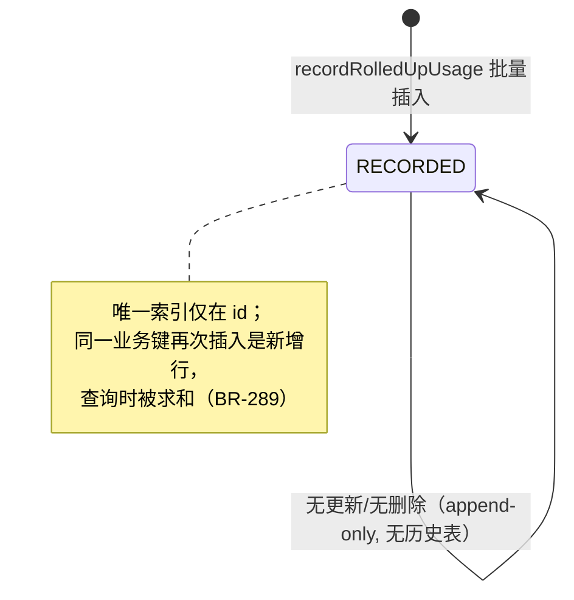
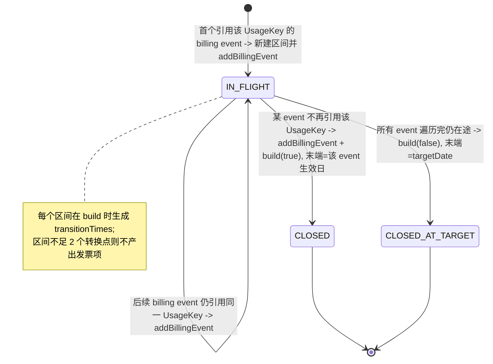
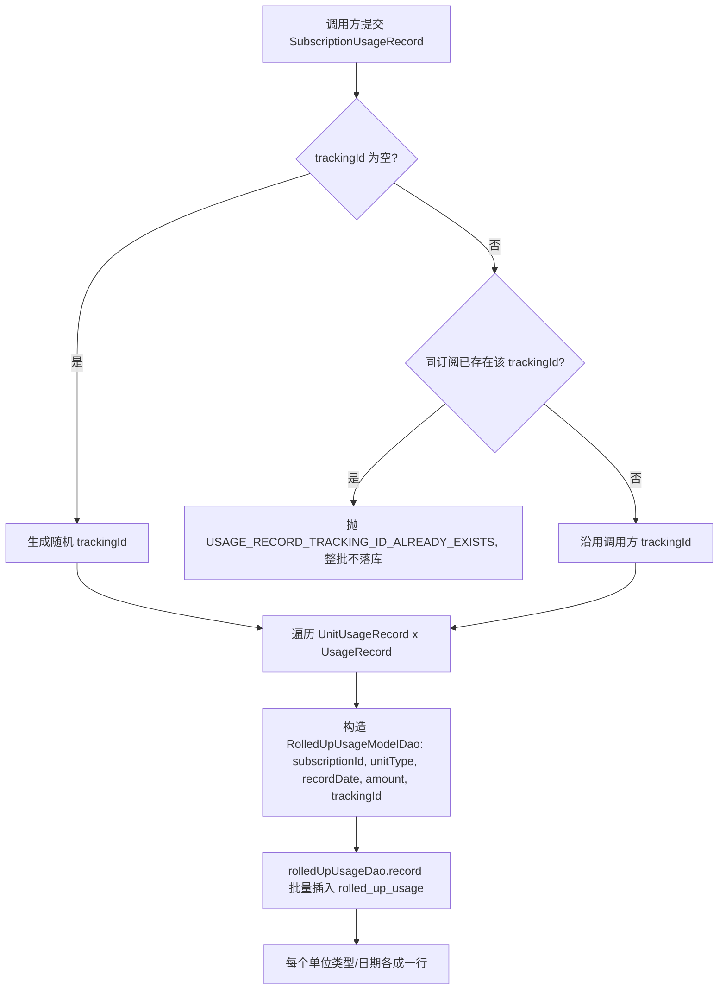
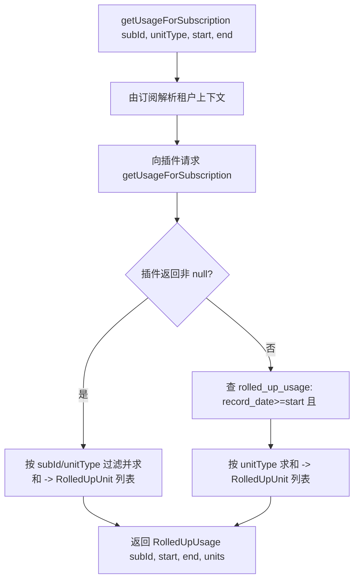
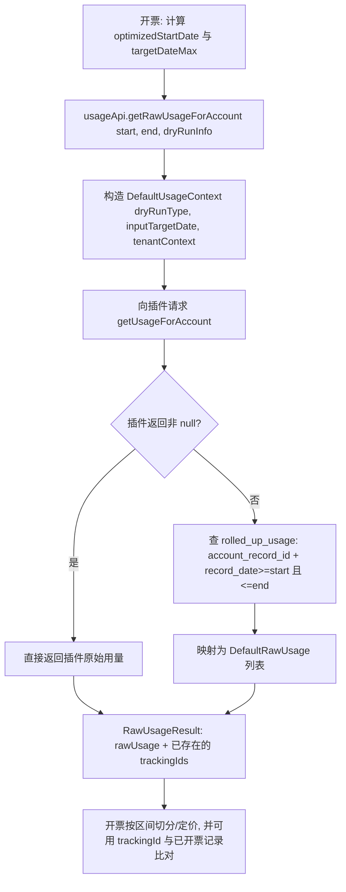
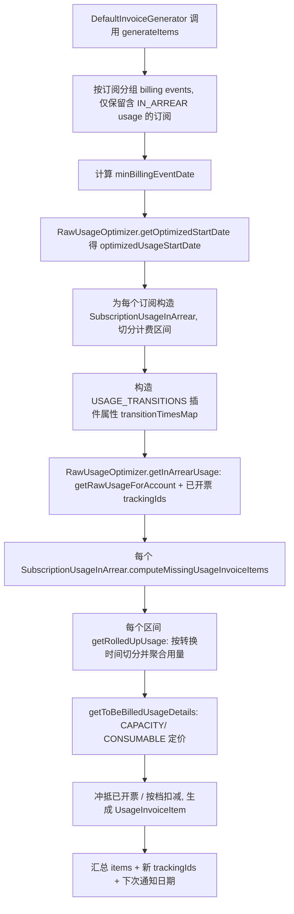
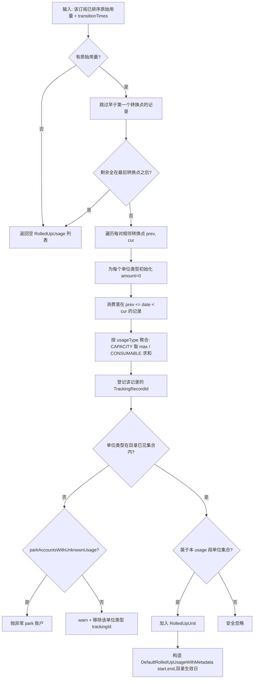
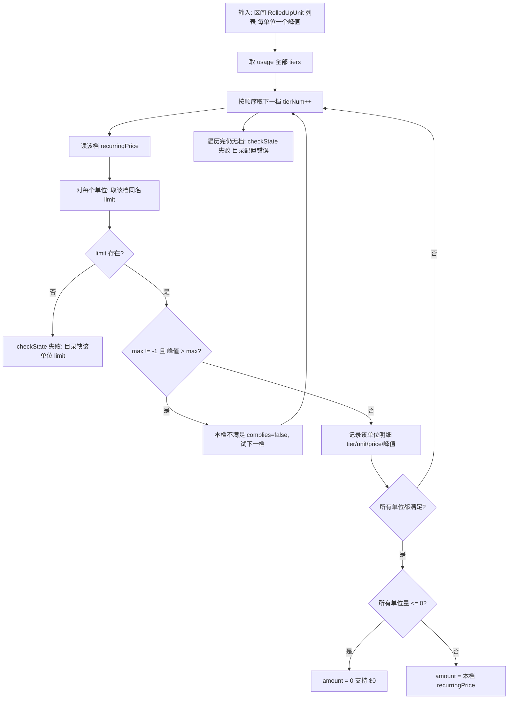

# 模块：usage

> 本模块共 86 张卡（BR 38, ENT 17, ROLE 2, SM 2, TERM 19, WF 8）。

用量记录与提取、单位/限额/档位、计费区间与聚合、原始用量优化。

本模块卡片见下（ID 为全局编号，与 rules.md / glossary.md 等一致）。

---

## BR-282 跟踪号幂等去重

- **类型**: 业务规则
- **同义词**: 跟踪号去重, 幂等, 重复提交拦截, usage dedup, tracking id duplicate, idempotency, 重复用量
- **模块**: usage
- **置信度**: 🟢 confirmed
- **溯源**: `usage/src/main/java/org/killbill/billing/usage/api/user/DefaultUsageUserApi.java:74-82`, `usage/src/main/java/org/killbill/billing/usage/dao/RolledUpUsageSqlDao.java:36-39`

**规则**：调用方传入非空 `trackingId` 时，先查该订阅下是否已存在相同 `trackingId` 的行（`recordsWithTrackingIdExist`，SQL `select 1 ... where subscription_id=? and tracking_id=? ... limit 1`）。若已存在 → 抛 `UsageApiException(ErrorCode.USAGE_RECORD_TRACKING_ID_ALREADY_EXISTS, trackingId)`，整批用量不落库。

**范围**：去重键是 `(subscription_id, tracking_id, tenant_record_id)`（索引 `rolled_up_usage_tracking_id_subscription_id_tenant_record_id`）。因此同一 trackingId 在**不同订阅**下互不影响。

---

## BR-283 未提供跟踪号时自动生成

- **类型**: 业务规则
- **同义词**: 自动跟踪号, 随机跟踪号, 默认trackingId, auto tracking id, generated tracking id, random tracking id
- **模块**: usage
- **置信度**: 🟢 confirmed
- **溯源**: `usage/src/main/java/org/killbill/billing/usage/api/user/DefaultUsageUserApi.java:74-82`

**规则**：若 `record.getTrackingId()` 为 `null` 或空字符串，则本次提交生成一个随机 UUID 作为 `trackingId`。此时该批次不具备调用方可控的幂等键（每次提交都会是新值，无法借此拦截重复）。

---

## BR-284 同一批提交共用同一跟踪号

- **类型**: 业务规则
- **同义词**: 批量共用跟踪号, 同批trackingId, batch tracking id, shared tracking id, 同批次幂等
- **模块**: usage
- **置信度**: 🟢 confirmed
- **溯源**: `usage/src/main/java/org/killbill/billing/usage/api/user/DefaultUsageUserApi.java:85-91`

**规则**：`recordRolledUpUsage` 对入参中所有 `UnitUsageRecord` × 所有 `UsageRecord` 展开出的每一行，都写入**同一个** `trackingIds` 变量值（要么是调用方给的，要么是生成的随机值）。因此去重探测的粒度是「整批」，只要有任意一行已存在该 trackingId，整批都会被拒。

---

## BR-285 订阅用量查询：半开区间 [start, end) + 单位类型过滤

- **类型**: 业务规则
- **同义词**: 用量查询时间范围, 半开区间, 用量区间, usage query range, start end date, record_date filter
- **模块**: usage
- **置信度**: 🟢 confirmed
- **溯源**: `usage/src/main/resources/org/killbill/billing/usage/dao/RolledUpUsageSqlDao.sql.stg:37-48`, `usage/src/main/java/org/killbill/billing/usage/dao/DefaultRolledUpUsageDao.java:55-58`

**规则**：`getUsageForSubscription` 的 SQL 条件为 `record_date >= :startDate AND record_date < :endDate AND unit_type = :unitType` 且租户匹配。即左闭右开；结束时刻当刻的用量不计入。

**注意**：`unitType` 是**必须精确匹配**的过滤条件（非空时），无法用它做模糊/多值查询。查询单一单位类型用此方法。

---

## BR-286 账户原始用量查询：闭区间 [start, end]（开票唯一查询）

- **类型**: 业务规则
- **同义词**: 账户用量查询, 开票用量查询, 闭区间, 含退订日, raw usage for account, account usage, invoicing usage query
- **模块**: usage
- **置信度**: 🟢 confirmed
- **溯源**: `usage/src/main/resources/org/killbill/billing/usage/dao/RolledUpUsageSqlDao.sql.stg:62-73`, `usage/src/main/java/org/killbill/billing/usage/api/svcs/DefaultInternalUserApi.java:63-84`

**规则**：`getRawUsageForAccount` 的 SQL 条件为 `account_record_id = :accountRecordId AND record_date >= :startDate AND record_date <= :endDate`（**右闭**），且租户匹配。模板注释明确说明：「这是唯一用于开票的查询，因此使用 `<= :endDate` 以便处理退订当日的用量数据」。

**含义**：订阅维度的查询用 `< endDate`，而开票维度的账户查询用 `<= endDate`，两者边界语义不同，不能混用。

**范围**：该方法按 `account_record_id` 跨该账户下所有订阅查询，返回全部单位类型的明细（无 `unit_type` 过滤）。

---

## BR-287 用量按单位类型汇总求和

- **类型**: 业务规则
- **同义词**: 用量汇总, 求和, 聚合, rollup sum, aggregate usage, sum by unit type
- **模块**: usage
- **置信度**: 🟢 confirmed
- **溯源**: `usage/src/main/java/org/killbill/billing/usage/api/user/DefaultUsageUserApi.java:158-168`, `usage/src/main/java/org/killbill/billing/usage/api/user/DefaultUsageUserApi.java:136-156`

**规则**：无论数据来自 DB（`getRolledUpUnits`）还是插件（`getRolledUpUnitsForRawPluginUsage`），都用一个 `Map<String, BigDecimal>` 以 `unitType` 为键累加 `amount`（`currentAmount.add(cur.getAmount())`），最后映射为 `RolledUpUnit` 列表。

**含义**：查询结果是**同一区间内同单位类型的数值之和**；重复日期、多行记录都会被累加，不会保留明细。

**插件分支的额外过滤**：插件返回的原始记录会先按 `subscriptionId` 过滤（不等则跳过），再在指定 `unitType` 时按单位类型过滤，之后才求和。

---

## BR-288 查询结果排序：按 record_id 升序（提交顺序）

- **类型**: 业务规则
- **同义词**: 用量排序, 查询顺序, 提交顺序, order by record_id, usage ordering, insertion order
- **模块**: usage
- **置信度**: 🟢 confirmed
- **溯源**: `usage/src/main/resources/org/killbill/billing/usage/dao/RolledUpUsageSqlDao.sql.stg:46-47`, `util/src/main/resources/org/killbill/billing/util/entity/dao/EntitySqlDao.sql.stg:31-33`

**规则**：所有用量查询都带 `<defaultOrderBy("")>`，展开为 `order by record_id ASC`。`record_id` 是自增 serial 主键，故返回顺序即**落库（提交）先后顺序**，而非按 `record_date` 排序。

**注意**：不要假设结果按日期升序；如需按日期处理，调用方须自行排序（开票侧 `RawUsageOptimizer` 即自行按 endDate 排序）。

---

## BR-289 同一 (订阅, 单位类型, 日期) 重复提交会累加，不覆盖

- **类型**: 业务规则
- **同义词**: 重复用量, 用量覆盖, 用量累加, duplicate usage, overwrite, additive, 重复记录
- **模块**: usage
- **置信度**: 🟢 confirmed
- **溯源**: `usage/src/main/resources/org/killbill/billing/usage/ddl.sql:18`, `usage/src/main/java/org/killbill/billing/usage/api/user/DefaultUsageUserApi.java:158-168`, `usage/src/test/java/org/killbill/billing/usage/dao/TestDefaultRolledUpUsageDao.java:139-169`

**规则**：`rolled_up_usage` 唯一的唯一索引建在 `id`（随机 UUID）上，**没有** `(subscription_id, unit_type, record_date)` 的业务键唯一约束。因此：
- 用不同 `trackingId` 对同一订阅、同一单位类型、同一日期再次提交，会新增行，查询时被求和 → **数值翻倍（累加而非覆盖）**。
- 没有任何「更新/覆盖」用量的 API；用量是**只追加（append-only）**的（DAO 无 update 方法，实体 `getHistoryTableName()` 为 `null`）。
- 测试 `testDuplicateRecords` 展示的是「把同一批 `RolledUpUsageModelDao`（含固定 `id`）插入两次」会因唯一索引 `rolled_up_usage_id` 冲突抛 `UnableToExecuteStatementException`——即只有**相同记录 ID**才会被拒。

**业务结论**：去重的唯一可靠手段是 `trackingId`（见 BR-282）；不要依赖系统对「同日期重复上报」自动去重。

---

## BR-290 插件优先：插件返回非 null（含空列表）即不查库

- **类型**: 业务规则
- **同义词**: 插件优先, 数据源优先级, 用量来源, plugin precedence, usage source priority, fallback to db
- **模块**: usage
- **置信度**: 🟢 confirmed
- **溯源**: `usage/src/main/java/org/killbill/billing/usage/api/BaseUserApi.java:55-94`

**规则**：查询用量时按注册顺序遍历所有 `UsagePluginApi`：
- 若没有任何插件注册（`getAllServices().isEmpty()`）→ 返回 `null` → 用量模块回退查自身 `rolled_up_usage` 表。
- 对每个插件调用 `getUsageForSubscription` / `getUsageForAccount`；**第一个返回非 null 的插件结果胜出**，直接返回（可能是空列表），**不再查库**。
- 所有注册插件都返回 `null` → 回退查库。

**含义**：插件一旦接管某租户/账户的用量数据，本地的 `rolled_up_usage` 表对该查询就完全不可见；插件返回空列表也代表「确实没有用量」，而非触发回退。

---

## BR-291 插件越界数据仅告警，不拒绝

- **类型**: 业务规则
- **同义词**: 插件数据校验, 越界告警, plugin out of range, usage warning, date range warning
- **模块**: usage
- **置信度**: 🟢 confirmed
- **溯源**: `usage/src/main/java/org/killbill/billing/usage/api/BaseUserApi.java:77-90`

**规则**：对插件返回的每条 `RawUsageRecord`，若其 `date` 落在请求区间之外（`date < startDate || date >= endDate`），仅记录 `warn` 日志（"Usage plugin returned usage data with date {}, not in the specified range"），**仍然原样返回给调用方**，不做过滤或拒绝。

**含义**：插件数据可能包含区间外的点，过滤责任在下游（开票侧按自己的区间切分）。这是 `>= endDate` 的右开判断，与 BR-285 的半开区间一致。

---

## BR-292 聚合语义：CAPACITY 取最大值，CONSUMABLE 求和

- **类型**: 业务规则
- **同义词**: 容量取最大, 消费求和, 用量聚合, capacity max, consumable sum, usage aggregation, 峰值计费, 累加计费, 用量合并
- **模块**: usage
- **置信度**: 🟢 confirmed
- **溯源**: `invoice/src/main/java/org/killbill/billing/invoice/usage/ContiguousIntervalUsageInArrear.java:539-548`

**规则**（开票侧聚合，用量数据的使用方语义）：对同一单位类型在一段计费区间内的多次观测值 `computeUpdatedAmount(current, new)`：
- `UsageType.CAPACITY` → 返回 `max(current, new)`（区间峰值）。
- 否则（`UsageType.CONSUMABLE`）→ 返回 `current.add(new)`（多点累加）。
- 任一侧为 `null` 视为 `ZERO` 再参与运算。

**用量侧关联**：用量模块本身按 BR-287 对查询区间求和；CAPACITY 的「取最大」发生在开票消费这些原始/汇总数据时（`SubscriptionUsageInArrear` 按 usageType 选择不同 interval 实现，见 `invoice/.../SubscriptionUsageInArrear.java:188-193`）。

---

## BR-293 单位类型来源：CAPACITY→limit，CONSUMABLE→tier block

- **类型**: 业务规则
- **同义词**: 单位类型映射, 目录单位, capacity limit unit, consumable tier unit, unit type catalog link
- **模块**: usage
- **置信度**: 🟢 confirmed
- **溯源**: `invoice/src/main/java/org/killbill/billing/invoice/usage/UsageUtils.java:34-87`

**规则**（目录→开票的映射，用量 `unitType` 必须与之对齐）：
- CONSUMABLE IN_ARREAR：单位类型集合 = 各 tier 的 `TieredBlock.getUnit().getName()`；取价时对每个 tier 找匹配 `unitType` 的 block，且要求每个 tier 都有该 unit 的定义（否则 `Preconditions.checkState` 失败）。
- CAPACITY IN_ARREAR：单位类型集合 = 各 tier 的 `Limit.getUnit().getName()`。

**对用量模块的含义**：写入的 `unitType` 是字符串，若与目录声明的 unit 名不匹配，则开票无法定价；此一致性不由用量模块强制（见 BR-295）。

---

## BR-294 用量存储层不区分 CONSUMABLE / CAPACITY

- **类型**: 业务规则
- **同义词**: 存储不区分类型, 用量类型无关存储, usage type agnostic storage, storage semantics
- **模块**: usage
- **置信度**: 🟢 confirmed
- **溯源**: `usage/src/main/java/org/killbill/billing/usage/dao/RolledUpUsageModelDao.java:30-36`, `usage/src/main/resources/org/killbill/billing/usage/ddl.sql:4-16`

**规则**：`rolled_up_usage` 表与 `RolledUpUsageModelDao` **没有**任何字段表示 usageType/billingMode。无论消费型还是容量型，用量记录都写同样的列（`subscription_id`/`unit_type`/`record_date`/`amount`/`tracking_id`）。

**含义**：CAPACITY vs CONSUMABLE 的差异完全由（a）目录定义与（b）开票聚合决定，用量模块只提供中立的事实数据。回答「某一用量是消费型还是容量型」时，不能从用量表判断，必须查目录中的 usage 定义。

---

## BR-295 未在目录中定义的用量：可 park 账户（配置驱动）

- **类型**: 业务规则
- **同义词**: 未知用量, 未定义用量, park账户, unknown usage, park accounts, usage not in catalog, 未知用量挂起, park account, 挂起账户, parkAccountsWithUnknownUsage, 账户暂停
- **模块**: usage
- **置信度**: 🟢 confirmed
- **溯源**: `util/src/main/java/org/killbill/billing/util/config/definition/InvoiceConfig.java:205-213`

**规则**：系统属性 `org.killbill.invoice.parkAccountsWithUnknownUsage`（默认 `false`）控制：当账户记录了目录中未定义的用量数据时，是否将该账户 park（暂停自动开票，直到人工介入）。

**含义**：这是用量数据与目录一致性问题（BR-293）的兜底策略，由开票侧读取，用量模块不读取该配置。

---

## BR-296 用量提交的必填校验

- **类型**: 业务规则
- **同义词**: 用量校验, 必填字段, usage validation, required fields, mandatory usage fields
- **模块**: usage
- **置信度**: 🟢 confirmed
- **溯源**: `jaxrs/src/main/java/org/killbill/billing/jaxrs/resources/UsageResource.java:119-132`, `jaxrs/src/main/java/org/killbill/billing/jaxrs/json/SubscriptionUsageRecordJson.java:36-119`

**规则**（提交用量时，API 层校验）：
- `subscriptionId` 必填。
- `unitUsageRecords` 必填且非空（`!isEmpty()`）。
- 每个 `UnitUsageRecordJson.unitType` 必填非空。
- 每个单位类型的 `usageRecords` 至少 1 条。
- 每条 `UsageRecordJson` 的 `amount` 与 `recordDate` 必填非 null。

**失败行为**：校验失败返回 400 / 抛出参数异常。用量模块 `recordRolledUpUsage` 自身不做这些断言，依赖 API 层先行校验。

---

## BR-297 退订后不得记录晚于生效结束日的用量

- **类型**: 业务规则
- **同义词**: 退订用量校验, 生效结束日, cancel usage, effective end date, usage after cancellation
- **模块**: usage
- **置信度**: 🟢 confirmed
- **溯源**: `jaxrs/src/main/java/org/killbill/billing/jaxrs/resources/UsageResource.java:134-141`, `jaxrs/src/main/java/org/killbill/billing/jaxrs/resources/UsageResource.java:150-158`

**规则**：记录用量前，先按 `subscriptionId` 取订阅（entitlement）；若其 `getEffectiveEndDate()` 非 null（即已退订/已结束），则取本次提交中所有用量记录的**最大 `recordDate`**；若 `effectiveEndDate < highestRecordDate` → 返回 400 Bad Request。

**含义**：不允许为已结束订阅记录结束日之后的用量。注意这是 API 层校验，不写在 `DefaultUsageUserApi` 内。

---

## BR-298 用量相关系统属性（配置项清单）

- **类型**: 业务规则
- **同义词**: 用量配置, 系统属性, usage config, system properties, 用量参数
- **模块**: usage
- **置信度**: 🟢 confirmed
- **溯源**: `util/src/main/java/org/killbill/billing/util/config/definition/InvoiceConfig.java:84-101`, `util/src/main/java/org/killbill/billing/util/config/definition/InvoiceConfig.java:124-131`, `util/src/main/java/org/killbill/billing/util/config/definition/InvoiceConfig.java:205-213`

**影响用量存储/检索的系统属性**（定义在开票配置 `InvoiceConfig`，用量模块/开票侧读取）：

| 属性 | 默认 | 作用 |
|---|---|---|
| `org.killbill.invoice.readMaxRawUsagePreviousPeriod` | — | 拉取原始用量时向前回溯的最大计费周期数（用量优化），决定 `getRawUsageForAccount` 的 startDate |
| `org.killbill.invoice.disable.usage.zero.amount` | — | 是否不写入 $0 的用量金额 |
| `org.killbill.invoice.usage.missing.lenient` | — | 发现缺失的历史用量记录时是否放宽（不失败开票） |
| `org.killbill.invoice.usage.tz.mode` | — | 夏令时下包含用量点的行为 |
| `org.killbill.invoice.parkAccountsWithUnknownUsage` | `false` | 记录了目录未定义用量时是否 park 账户 |

**说明**：`usage` 模块自身**没有**配置文件或 `@Config` 属性（其 `resources` 下仅有 `ddl.sql`、SQL 模板与 migration）。用量存储/检索可调行为均由开票侧的上述配置驱动。属性读取点在 `invoice/.../usage/RawUsageOptimizer.java:78-79`、`85-98`、`116-119`、`122-127`。

---

## BR-299 CAPACITY 档位选择：取第一个「所有单位都 ≤ max」的档

- **类型**: 业务规则
- **同义词**: 容量选档, 峰值选档, 容量取档, capacity tier selection, first matching tier, 档位匹配
- **模块**: usage
- **置信度**: 🟢 confirmed
- **溯源**: `invoice/src/main/java/org/killbill/billing/invoice/usage/ContiguousIntervalCapacityUsageInArrear.java:104-153`

**规则**：按 catalog 中 tiers 的顺序遍历。对每个候选档：

1. 对每个参与计价的单位类型 `ro`，取该档中单位名匹配的 `limit`（`getTierLimit`；若该档缺该单位的 limit → `checkState(false)`，视为目录错误，见 BR-316）。
2. 若该单位的峰值（`RolledUpUnit.amount`；区间内 CAPACITY 取最大值，见既有 BR-292）`> limit.max` 且 `max ≠ -1` → 本档不满足，进入下一档。
3. 所有单位都满足 → **命中该档并立即返回**（取第一个命中档）。

**含义**：CAPACITY 的「峰值」是**区间内每个单位类型各自取 max**（而非各单位的和），然后选取能同时容纳所有单位峰值的**最低档**。档位必须连续（注释说明：因此只看 max、忽略 min）。

---

## BR-300 CAPACITY 金额 = 命中档的 recurringPrice；忽略 min；支持 $0

- **类型**: 业务规则
- **同义词**: 容量计价, 容量价格, capacity pricing, recurringPrice 计价, 档位价格, 忽略min
- **模块**: usage
- **置信度**: 🟢 confirmed
- **溯源**: `invoice/src/main/java/org/killbill/billing/invoice/usage/ContiguousIntervalCapacityUsageInArrear.java:123-147`, `catalog/src/main/java/org/killbill/billing/catalog/DefaultTier.java:109-112`

**规则**：命中档的应计金额 = 该档 `recurringPrice.getPrice(getCurrency())`（**不是** `fixedPrice`，**也不是**「单价 × 单位数」）。代码注释明确：忽略 min，只看 max，因为档位应当连续。

**$0 支持**：若所有参与单位的量都 `≤ 0`（`allUnitAmountToZero`），则将金额置为 `0`，以便生成 $0 usage 项（见 BR-313）。

**明细**：为每个单位类型各记一条 `UsageInArrearTierUnitDetail(tierNum, unitType, tierPrice=命中档价格, quantity=观测峰值)`（每个单位类型只记一次，`perUnitTypeDetailTierLevel` 去重）。

---

## BR-301 哨兵值 -1 / 缺省 = 「无上限」

- **类型**: 业务规则
- **同义词**: 无上限, 无限制, 哨兵值, sentinel max, unlimited, -1 max, 无限档, 最后档
- **模块**: usage
- **置信度**: 🟢 confirmed
- **溯源**: `invoice/src/main/java/org/killbill/billing/invoice/usage/ContiguousIntervalCapacityUsageInArrear.java:132-136`, `invoice/src/main/java/org/killbill/billing/invoice/usage/ContiguousIntervalConsumableUsageInArrear.java:239-241`, `catalog/src/main/java/org/killbill/billing/catalog/CatalogSafetyInitializer.java:36-38`

**规则**：`limit.max` 或 `tieredBlock.max` 等于 `-1` 表示**无上限**，代码用常量 `new BigDecimal("-1")` 比较。由于 `CatalogSafetyInitializer` 会把 catalog 中未配置的 `BigDecimal` 字段统一填为 `-1`，**「未写 max」等价于无上限**。

**分支语义**：

- CAPACITY：`max == -1` 时该单位恒满足，不再比较（常用于最后一档，使配置校验通过）。
- CONSUMABLE `ALL_TIERS`：`max == -1` 时不封顶，该档消费全部剩余单位。
- CONSUMABLE `TOP_TIER`：`tmp > max` 中 `max=-1` 恒成立（注意其后果，见 BR-303）。

---

## BR-302 CONSUMABLE · ALL_TIERS：逐档分块累进计价

- **类型**: 业务规则
- **同义词**: 累进计价, 阶梯计价, 逐档分块, all tiers, progressive pricing, block tiering, 分档计费
- **模块**: usage
- **置信度**: 🟢 confirmed
- **溯源**: `invoice/src/main/java/org/killbill/billing/invoice/usage/ContiguousIntervalConsumableUsageInArrear.java:219-266`

**规则**（对每个单位类型独立计算；`units` 为该区间用量）：

1. 从第 1 档开始，对每档的 `tieredBlock`：`tmp = ceil(remainingUnits / size)`（`divideAndRemainder`，余数非 0 则商 +1）。
2. 若 `max ≠ -1` 且 `tmp > max` → 本档用满 `max` 块，`remainingUnits -= max × size`，继续下一档；否则本档用 `tmp` 块，`remainingUnits = 0`。
3. 每档金额 = `tierPrice × nbUsedTierBlocks`；总金额 = 各档金额之和（`UsageConsumableInArrearAggregate`）。
4. 生成明细的条件：`tierNum == 1`（即使 0 块也生成，用以支持 $0）或本档 `nbUsedTierBlocks > 0`。

**含义**：这是**累进/阶梯**计价——每档只计价落入自己区间的块数。例如 size=1000、max=10（即 ≤10000 单位）在 0.5/块，超出部分进入下一档按该档价计。

---

## BR-303 CONSUMABLE · TOP_TIER：整段用量按命中的单一档计价

- **类型**: 业务规则
- **同义词**: 顶档计价, 单档计价, 命中档计价, top tier, flat tier pricing, 最高档
- **模块**: usage
- **置信度**: 🟢 confirmed
- **溯源**: `invoice/src/main/java/org/killbill/billing/invoice/usage/ContiguousIntervalConsumableUsageInArrear.java:268-299`

**规则**：

1. 顺序遍历档，累减 `remainingUnits`：对每档计算 `tmp = ceil(remainingUnits / size)`；若 `tmp > max` → `remainingUnits -= max × size` 并继续；否则 `targetTier = 本档`、停止。
2. 默认 `targetTier` = 最后一档（遍历未命中时）。
3. 最终**块数用「总 units」而非剩余量**计算：`nbBlocks = ceil(units / targetTier.size)`；`amount = targetTier.price × nbBlocks`。

**含义**：整段用量按所落的**那一个档**的单价计算（非累进），即「达到某档后整量按该档计费」。

**注意**：由于 `tmp > max` 在 `max=-1` 时恒成立，配置为无上限（-1）的档在循环中**会被跳过**；只有循环自然结束才回落到最后一档。因此 TOP_TIER 的最后一档通常应配置为 -1。

---

## BR-304 金额按货币精度舍入（KillBillMoney.of）

- **类型**: 业务规则
- **同义词**: 金额取整, 货币精度, 金额舍入, rounding, KillBillMoney, 四舍五入
- **模块**: usage
- **置信度**: 🟢 confirmed
- **溯源**: `invoice/src/main/java/org/killbill/billing/invoice/usage/ContiguousIntervalUsageInArrear.java:322-326`

**规则**：分档/分块算出的原始金额 `toBeBilledUsageUnrounded` 乘以/相加得到后，先用 `KillBillMoney.of(amount, currency)` 按该货币的小数精度舍入，得到 `toBeBilledUsage`（对应 killbill issue #1124）。**所有后续冲抵、输出均使用舍入后的金额**。

---

## BR-305 已开票金额冲抵：实际开票 = 应计 − 已开票

- **类型**: 业务规则
- **同义词**: 冲抵, 已开票扣减, 重复计费防护, reconcile, billed usage offset, amountToBill
- **模块**: usage
- **置信度**: 🟢 confirmed
- **溯源**: `invoice/src/main/java/org/killbill/billing/invoice/usage/ContiguousIntervalUsageInArrear.java:561-598`, `invoice/src/main/java/org/killbill/billing/invoice/usage/ContiguousIntervalCapacityUsageInArrear.java:78-96`, `invoice/src/main/java/org/killbill/billing/invoice/usage/ContiguousIntervalConsumableUsageInArrear.java:88-101`

**规则**：

- `computeBilledUsage` 把同一 usage 段、同一区间、**已存在的 USAGE 发票项的金额相加**（按金额，而非按量）。
- `getBilledItems` 只挑出同 usage 名、且 `[startDate,endDate]` 被已有项完全覆盖的 USAGE 项；长度为 0 的同日项会被排除（避免同日换套餐重复）。
- 实际开票金额 `amountToBill = 应计(toBeBilledUsage) − 已开票(billedUsage)`。

**负值处理**：`amountToBill < 0` 时——dry-run 或 `org.killbill.invoice.usage.missing.lenient=true` → 静默跳过；否则抛 `InvoiceApiException`（`ILLEGAL INVOICING STATE: Usage period start=..., end=..., amountToBill=...`）。

**何时不生成项**：已开票过该区间且 `amountToBill == 0` → 不生成（除非从未开票）。

---

## BR-306 明细模式 + ALL_TIERS 下改用「按档扣减」而非金额冲抵

- **类型**: 业务规则
- **同义词**: 明细不冲抵, 分档对账, detail offset, ALL_TIERS reconcile, 按档扣减
- **模块**: usage
- **置信度**: 🟢 confirmed
- **溯源**: `invoice/src/main/java/org/killbill/billing/invoice/usage/ContiguousIntervalConsumableUsageInArrear.java:78-121`, `invoice/src/main/java/org/killbill/billing/invoice/usage/ContiguousIntervalConsumableUsageInArrear.java:156-197`

**规则**：当 `tierBlockPolicy == ALL_TIERS` **且**历史发票项都带 `itemDetails`（`areAllBilledItemsWithDetails`）时，`amountToBill` 直接等于应计金额（**不再减** `billedUsage`）——因为冲抵转为「按档减历史量」：`getBilledDetailsForUnitType` 从历史发票项的 `itemDetails` 中抽取该单位类型的各档 quantity，用 `TreeMap`（按档号升序）合并，同档用 `updateQuantityAndAmount` 累加，随后在分档计算时从 `nbUsedTierBlocks` 中扣除（见 BR-307）。TOP_TIER 与非明细历史仍走 BR-305 的金额冲抵。

**DETAIL vs AGGREGATE 的历史解析差异**：DETAIL 下 `itemDetails` 是**单条** `UsageConsumableInArrearTierUnitAggregate`，quantity 取发票项自身的 `quantity`（并补上 `bi.getRate()` 作 tierPrice，对应 issue #1325）；AGGREGATE 下 `itemDetails` 是 `UsageConsumableInArrearAggregate`，需展开其 `tierDetails`。

---

## BR-307 分档扣减历史用量；历史缺失时报错（或按配置放宽）

- **类型**: 业务规则
- **同义词**: 历史用量扣减, 缺失历史用量, missing usage, previous usage, 补开用量, 用量缺失
- **模块**: usage
- **置信度**: 🟢 confirmed
- **溯源**: `invoice/src/main/java/org/killbill/billing/invoice/usage/ContiguousIntervalConsumableUsageInArrear.java:246-260`

**规则**（ALL_TIERS，且存在历史用量 `previousUsage` 时）：本档 `nbUsedTierBlocks` 减去历史同档 quantity。存在两个断言：

- `tierNum < lastPreviousUsageTier`（历史中间档）时，`nbUsedTierBlocks` 必须与历史 quantity **完全相等**（历史必须已把该档用满）。
- 落在最后一历史档时，`nbUsedTierBlocks − previousQuantity ≥ 0`（当前用量不得少于历史）。

当历史记录不完整（例如过去某区间的用量未上报/未开票）时，断言失败会抛异常。**放宽条件**：`isDryRun == true` 或 `org.killbill.invoice.usage.missing.lenient == true` 时跳过这两个断言。

**含义**：这是防止「历史用量丢失导致重复计费或漏计」的对账护栏；与该配置对应的宽松语义见 BR-312/BR-314。

---

## BR-308 未知单位类型：park 账户或忽略并移除其 trackingId

- **类型**: 业务规则
- **同义词**: 未知单位, 未定义单位, 目录外单位, unknown unit type, park accounts, 忽略单位
- **模块**: usage
- **置信度**: 🟢 confirmed
- **溯源**: `invoice/src/main/java/org/killbill/billing/invoice/usage/ContiguousIntervalUsageInArrear.java:481-506`

**规则**：聚合区间用量时，若某 `unitType` **不在当前 billing event 已收集到的单位类型集合**内（即目录中未定义）：

- 若 `org.killbill.invoice.parkAccountsWithUnknownUsage == true` → 抛 `InvoiceApiException`（`ILLEGAL INVOICING STATE: unit type ... is not defined in the catalog ...`），使账户被 park（见既有 BR-295）。
- 否则仅记 `warn` 并跳过该单位类型；同时把该 unitType 对应的 trackingId 从本次结果中**移除**，避免它被当作「已开票」而掩盖未定义用量。

**对比**：若 unitType 是目录中已知的、但不属于**当前 usage 段**（`unitTypes.contains` 为 false），则安全忽略，不告警、不影响 trackingId。

---

## BR-309 开票侧原始用量按复合键排序（非落库顺序）

- **类型**: 业务规则
- **同义词**: 用量排序, 开票排序, raw usage sort, composite comparator, 排序键
- **模块**: usage
- **置信度**: 🟢 confirmed
- **溯源**: `invoice/src/main/java/org/killbill/billing/invoice/usage/SubscriptionUsageInArrear.java:61-88`, `invoice/src/main/java/org/killbill/billing/invoice/usage/SubscriptionUsageInArrear.java:143-146`

**规则**：开票前，先按 `subscriptionId` 过滤该订阅的原始用量，再按复合比较器升序排序：`(subscriptionId, recordDate, unitType, amount, trackingId)`。区间消费算法依赖此顺序（见 WF-038）。

**与既有 BR-288 的区别**：DB 查询返回顺序是 `order by record_id`（提交顺序，见既有 BR-288）；开票侧**不依赖**它，而是自行按日期排序，从而保证区间切分与到达顺序无关。

---

## BR-310 缺省档位策略 = ALL_TIERS（逐档累进）

- **类型**: 业务规则
- **同义词**: 默认档位策略, 默认计价策略, default tier policy, ALL_TIERS default
- **模块**: usage
- **置信度**: 🟢 confirmed
- **溯源**: `catalog/src/main/java/org/killbill/billing/catalog/CatalogSafetyInitializer.java:60-72`

**规则**：catalog 未显式写 `tierBlockPolicy` 时，初始化阶段填入 `TierBlockPolicy.ALL_TIERS`。即**默认采用逐档累进计价**（见 BR-302），而非 TOP_TIER。若要单档计价必须显式写 `tierBlockPolicy="TOP_TIER"`。

---

## BR-311 计费区间按 (usage 名, 目录生效日) 分段；目录变更即为边界

- **类型**: 业务规则
- **同义词**: 目录版本分段, usage 段分段, 目录变更边界, catalog version boundary, usage key, 分段计价
- **模块**: usage
- **置信度**: 🟢 confirmed
- **溯源**: `invoice/src/main/java/org/killbill/billing/invoice/usage/SubscriptionUsageInArrear.java:160-227`, `invoice/src/main/java/org/killbill/billing/invoice/usage/SubscriptionUsageInArrear.java:283-316`

**规则**：计费区间以键 `(usageName, catalogEffectiveDate)` 标识（`UsageKey`，catalogVersion 用 `compareTo == 0` 判等）。遍历订阅的 billing events：

- 若某 billing event 引用同一 `UsageKey` → 沿用「在途区间」（`inFlightInArrearUsageIntervals`），追加该 event。
- 若某 `UsageKey` 不再被任何 event 引用（usage 段被移除，或目录版本变化产生新 key）→ 关闭该区间（`build(true)`）。
- 遍历结束后仍在途的区间以 `targetDate` 收尾（`build(false)`）。

**含义**：同一订阅可能产生**多个** `ContiguousIntervalUsageInArrear`，各自用其边界时刻的目录版本定价；每个区间独立计算发票项。

---

## BR-312 回溯窗口：readMaxRawUsagePreviousPeriod（默认 2）

- **类型**: 业务规则
- **同义词**: 回溯窗口, 回看周期, 历史用量窗口, lookback window, readMaxRawUsagePreviousPeriod, 晚到用量
- **模块**: usage
- **置信度**: 🟢 confirmed
- **溯源**: `util/src/main/java/org/killbill/billing/util/config/definition/InvoiceConfig.java:124-132`, `invoice/src/main/java/org/killbill/billing/invoice/usage/RawUsageOptimizer.java:77-137`

**规则**：拉取原始用量的起点 `optimizedStartDate`：

- 若 `org.killbill.invoice.readMaxRawUsagePreviousPeriod`（**默认 2**，单位=计费周期数）`< 0` → 不做优化，取 `firstEventStartDate`。
- 否则：按 catalog 中所有 usage 的 `billingPeriod` 分组，取各周期最近一次已开票 USAGE 项的 `endDate`（`getBillingPeriodMinDate1`），向前回退该配置数量的周期，取最早者作为起点（但不早于 `firstEventStartDate`）。
- 特例：若 `org.killbill.invoice.disable.usage.zero.amount == true`（`isUsageZeroAmountDisabled`），改用 `getBillingPeriodMinDate2`：以 `min(UTC today, targetDate)` 为基准回退 1 个周期（假设开票已跟上，简化逻辑）。

**晚到/乱序用量的后果**：该窗口决定「多久以前的上报仍会被拉取」。**早于窗口且此前未开票的用量记录不会被拉取/计费**（可能漏计）；窗口设得越大越安全但越慢。因此该值必须覆盖最大延迟上报跨度。

**终点**：拉取终点用 `targetDate` 当天末刻（账户时区转 UTC），查询为右闭（见 BR-317）。

---

## BR-313 $0 用量项：生成与过滤

- **类型**: 业务规则
- **同义词**: 零金额用量, 空用量项, $0 usage, zero amount, disable.usage.zero.amount, 用量为零, 零金额用量过滤, filterZeroUsageItems, quantity 大于0, 保留零金额用量
- **模块**: usage
- **置信度**: 🟢 confirmed
- **溯源**: `invoice/src/main/java/org/killbill/billing/invoice/generator/InvoiceWithMetadata.java:92-112`, `invoice/src/main/java/org/killbill/billing/invoice/usage/ContiguousIntervalUsageInArrear.java:516-530`, `invoice/src/main/java/org/killbill/billing/invoice/usage/ContiguousIntervalCapacityUsageInArrear.java:127-146`, `util/src/main/java/org/killbill/billing/util/config/definition/InvoiceConfig.java:84-92`

**生成侧**：系统刻意支持「无/零用量区间」的 $0 项——

- 完全没有原始用量时，`getEmptyRolledUpUsage` 为每个单位类型构造一个 `amount=0` 的区间（取最后两个转换点）。
- CAPACITY 的 `allUnitAmountToZero` 分支把金额置 0。
- CONSUMABLE 第 1 档即使 0 块也生成明细。

**过滤侧**：系统属性 `org.killbill.invoice.disable.usage.zero.amount`（**默认 false**）控制是否**移除** $0 USAGE 项。为 true 时，`InvoiceWithMetadata.build()` 过滤掉 `type == USAGE` 且 `amount == 0` 且（`quantity == null` 或 `quantity ≤ 0`）的项；若过滤后发票无任何项 → **发票变为 null**（不生成空发票）。

**双重影响**：该开关同时改变回溯窗口算法（见 BR-312），开启后需保证开票及时，否则可能漏计旧周期。

---

## BR-314 IN_ADVANCE 用量计费：目录可定义，但开票路径未实现

- **类型**: 业务规则
- **同义词**: 预付用量未实现, 预付费用量, IN_ADVANCE 未支持, not implemented, unsupported billing mode
- **模块**: usage
- **置信度**: 🟢 confirmed
- **溯源**: `invoice/src/main/java/org/killbill/billing/invoice/generator/UsageInvoiceItemGenerator.java:229-244`, `invoice/src/main/java/org/killbill/billing/invoice/generator/UsageInvoiceItemGenerator.java:147-151`

**规则**：

- 目录允许定义 `IN_ADVANCE` 的 CAPACITY/CONSUMABLE（见既有 BR-013），但**用量开票只处理 `IN_ARREAR`**：`findUsageInArrearUsages` 显式跳过非 `IN_ARREAR` 的 usage 段。
- `updatePerSubscriptionNextNotificationUsageDate` 在 `IN_ADVANCE` 分支直接 `throw new IllegalStateException("Not implemented Yet)")`。

**结论**：**今日实际可被计费的用量只有 `IN_ARREAR`**；`IN_ADVANCE` 的 usage 定义不会产生用量发票项。

---

## BR-315 档级目录校验：IN_ARREAR CAPACITY 需 limits、CONSUMABLE 需 blocks

- **类型**: 业务规则
- **同义词**: 档位校验, 档级校验, tier validation, IN_ARREAR limits, IN_ARREAR blocks
- **模块**: usage
- **置信度**: 🟢 confirmed
- **溯源**: `catalog/src/main/java/org/killbill/billing/catalog/DefaultTier.java:148-159`

**规则**（`DefaultTier.validate`，在 catalog 加载时执行）：

- `IN_ARREAR` + `CAPACITY` 且 `limits.length == 0` → 报错「needs to define some limits」。
- `IN_ARREAR` + `CONSUMABLE` 且 `blocks.length == 0` → 报错「needs to define some blocks」。

**与既有 BR-013 的分工**：既有 BR-013 是 **usage 段级**校验（`DefaultUsage.validate`：IN_ADVANCE+CAPACITY 需 limits、IN_ADVANCE+CONSUMABLE 需 blocks、IN_ARREAR 需 tiers）；本条是**档级**校验。二者共同决定一个合法的 in-arrear usage 目录结构。

---

## BR-316 每个档必须为每个单位定义 limit/block；否则定价报错

- **类型**: 业务规则
- **同义词**: 档位单位缺失, 单位必须定义, missing tier block, missing limit, 目录缺单位
- **模块**: usage
- **置信度**: 🟢 confirmed
- **溯源**: `invoice/src/main/java/org/killbill/billing/invoice/usage/UsageUtils.java:34-54`, `invoice/src/main/java/org/killbill/billing/invoice/usage/ContiguousIntervalCapacityUsageInArrear.java:104-112`

**规则**：

- CONSUMABLE：`getConsumableInArrearTieredBlocks` 对**每个档**查找与 `unitType` 同名的 `tieredBlock`；若某档缺失 → `Preconditions.checkState` 失败（"Missing tierBlock definition for unit ..."）。返回的列表顺序与档顺序一一对应（供逐档计算）。
- CAPACITY：`getTierLimit` 对每档查找同名 `limit`；缺失 → `checkState(false)`。

**含义**：一个 usage 段内，**每个档都必须为每个参与计价的单位各定义一个 block/limit**，不能只在一部分档里定义；否则开票直接抛异常（目录错误，非运行时数据问题）。

---

## BR-317 时间边界：账户时区日界 + usage.tz.mode（默认 FIXED）

- **类型**: 业务规则
- **同义词**: 时区, 日边界, 夏令时, day boundary, account timezone, usage tz mode, end of day, FIXED, VARIABLE
- **模块**: usage
- **置信度**: 🟢 confirmed
- **溯源**: `invoice/src/main/java/org/killbill/billing/invoice/usage/UsageClockUtil.java:50-90`, `util/src/main/java/org/killbill/billing/util/config/definition/InvoiceConfig.java:185-193`

**规则**：计费区间边界按账户时区换算，再转 UTC：

- 区间起点：`toDateTimeAtStartOfDay`（当天 00:00:00.000）。
- 区间终点：`toDateTimeAtEndOfDay`（次日 00:00:00.000 − 1ms）。

`org.killbill.invoice.usage.tz.mode`（**默认 `FIXED`**）控制偏移计算：

- `FIXED`：使用账户创建时的固定偏移（`context.getFixedOffsetTimeZone()`），与其它发票项一致。
- `VARIABLE`：按事件日期重新计算偏移（`context.getAccountTimeZone()`），使「相同 TZ、相同订阅、相同用量点」的账户在夏令时下得到一致结果（对应 killbill issue #1934）。

**关联**：拉取原始用量的终点即 `targetDate` 当天末刻（见 BR-312、既有 WF-036）。

---

## BR-318 已完全覆盖的区间直接跳过（防 blocking 重复计费）

- **类型**: 业务规则
- **同义词**: 区间已开票跳过, 完全覆盖, covered period skip, isContainedIntoExistingUsage, 防重复
- **模块**: usage
- **置信度**: 🟢 confirmed
- **溯源**: `invoice/src/main/java/org/killbill/billing/invoice/usage/ContiguousIntervalUsageInArrear.java:300-307`, `invoice/src/main/java/org/killbill/billing/invoice/usage/ContiguousIntervalUsageInArrear.java:333-356`

**规则**：对每个待计费区间，若已存在同 usage 名、同类型的 USAGE 发票项**完全包含**该区间（`usageInput.start ≤ 区间start 且 区间end < usageInput.end`，或 `usageInput.start < 区间start 且 区间end ≤ usageInput.end`；两者取其一），则**整段跳过**并记 warn（"Ignoring usage ... as it has already been invoiced"）。

**例外**：当区间起止同日（`startDate == endDate`，例如同日换套餐）时禁用该检查，交由后续金额/按档对账处理。

**含义**：blocking event 重算可能导致区间起止与已开票项不同；此检查避免对已覆盖区间重复计费。

---

## BR-319 发票级去重：TrackingRecordId 相似判定（不含 invoiceId）

- **类型**: 业务规则
- **同义词**: 用量发票去重, tracking 去重, 发票级幂等, TrackingRecordId, isSimilarRecord, 相似记录, 用量记录相似, 跨发票去重
- **模块**: usage
- **置信度**: 🟢 confirmed
- **溯源**: `invoice/src/main/java/org/killbill/billing/invoice/generator/InvoiceWithMetadata.java:181-256`, `invoice/src/main/java/org/killbill/billing/invoice/usage/ContiguousIntervalUsageInArrear.java:286-292`, `invoice/src/main/java/org/killbill/billing/invoice/generator/InvoiceWithMetadata.java:181-234`

**规则**：开票侧为每条被消费的用量记录构造 `TrackingRecordId(trackingId, invoiceId, subscriptionId, unitType, recordDate)`。判定「相似」时**忽略 invoiceId**，只比较 `(trackingId, subscriptionId, unitType, recordDate)`。本次新用量 = 所有用量 trackingId 中**不存在相似已开票记录**者。

**含义**：即使同一用量记录被重新挂到另一张发票（invoiceId 不同），只要这四个键相同就视为已开票，不会被重复计费。这补齐了既有 BR-282（提交侧幂等）之外的**开票侧幂等**。

**补充（身份 vs 相似）**：`TrackingRecordId.equals`/`hashCode` **包含** `invoiceId`（精确身份，用于区分挂到不同发票的记录）；仅 `isSimilarRecord` 忽略 `invoiceId`（用于跨发票去重）。

---

## ENT-056 用量记录实体 / rolled_up_usage 表

- **类型**: 业务实体
- **同义词**: 用量记录实体, 用量表, 用量记录表, rolled_up_usage, RolledUpUsageModelDao, usage table, usage record entity
- **模块**: usage
- **置信度**: 🟢 confirmed
- **溯源**: `usage/src/main/java/org/killbill/billing/usage/dao/RolledUpUsageModelDao.java:30-51`, `usage/src/main/resources/org/killbill/billing/usage/ddl.sql:3-22`

**字段**：
- `subscriptionId`（订阅 ID，逻辑外键 → subscriptions）
- `unitType`（单位类型，字符串）
- `recordDate`（记录时刻，`datetime NOT NULL`，精确到时刻，非仅日期）
- `amount`（数值，`decimal(18,9) NOT NULL`）
- `trackingId`（跟踪号，`varchar(128) NOT NULL`）
- 框架字段：`id`(uuid, unique)、`record_id`(serial PK)、`created_by`、`created_date`、`account_record_id`、`tenant_record_id`

**关键约束**：
- 唯一索引仅在 `id` 上（`rolled_up_usage_id`），**没有** `(subscription_id, unit_type, record_date)` 之类的业务键唯一约束（见 BR-289）。
- 索引：`subscription_id`、`(tenant_record_id, account_record_id)`、`account_record_id`、`(tracking_id, subscription_id, tenant_record_id)`。
- 无历史/审计表：`getHistoryTableName()` 返回 `null`（见 SM-014）。

---

## ENT-057 汇总用量视图（RolledUpUsage）

- **类型**: 业务实体
- **同义词**: 汇总用量, 用量汇总结果, rolled up usage, RolledUpUsage, usage view, usage response
- **模块**: usage
- **置信度**: 🟢 confirmed
- **溯源**: `usage/src/main/java/org/killbill/billing/usage/api/user/DefaultRolledUpUsage.java:27-59`

**结构**：`subscriptionId` + `start` + `end` + `List<RolledUpUnit> rolledUpUnits`。

**来源**：由 `getUsageForSubscription` / `getAllUsageForSubscription` 构造；数据来自插件（`getRolledUpUnitsForRawPluginUsage`）或 DB（`getRolledUpUnits`）。

**对外序列化**：REST 返回 `RolledUpUsageJson`（`subscriptionId`/`startDate`/`endDate`/`rolledUpUnits[]`），见 `jaxrs/src/main/java/org/killbill/billing/jaxrs/json/RolledUpUsageJson.java:33-95`。

---

## ENT-058 汇总单位（RolledUpUnit）

- **类型**: 业务实体
- **同义词**: 汇总单位, 单位用量, rolled up unit, RolledUpUnit, unit amount, 单位汇总
- **模块**: usage
- **置信度**: 🟢 confirmed
- **溯源**: `usage/src/main/java/org/killbill/billing/usage/api/user/DefaultRolledUpUnit.java:24-42`

**结构**：`unitType` + `amount`（该单位类型在查询区间内的累计值）。

**语义**：一个 `RolledUpUsage` 可含多个 `RolledUpUnit`（不同单位类型各一）；同一单位类型只出现一次（聚合结果）。

---

## ENT-059 订阅用量提交记录（SubscriptionUsageRecord）

- **类型**: 业务实体
- **同义词**: 订阅用量提交, 用量提交对象, subscription usage record, SubscriptionUsageRecord, usage submission, 上报用量
- **模块**: usage
- **置信度**: 🟢 confirmed
- **溯源**: `jaxrs/src/main/java/org/killbill/billing/jaxrs/json/SubscriptionUsageRecordJson.java:36-126`, `usage/src/main/java/org/killbill/billing/usage/api/user/DefaultUsageUserApi.java:71-92`

**结构**（提交用）：
- `subscriptionId`（必填）
- `trackingId`（可选；批量去重键）
- `List<UnitUsageRecord>`（至少一条）

**含义**：`recordRolledUpUsage` 的入参。一个提交批次由「一个订阅 + 多个单位类型 + 每个单位类型下多条带日期数值」组成。REST 层对应 `SubscriptionUsageRecordJson`（嵌套 `UnitUsageRecordJson` → `UsageRecordJson{recordDate, amount}`）。

---

## ENT-060 单位用量记录（UnitUsageRecord）

- **类型**: 业务实体
- **同义词**: 单位用量, 单位计量记录, unit usage record, UnitUsageRecord, unit type record
- **模块**: usage
- **置信度**: 🟢 confirmed
- **溯源**: `jaxrs/src/main/java/org/killbill/billing/jaxrs/json/SubscriptionUsageRecordJson.java:66-93`

**结构**：`unitType`（单位类型）+ `List<UsageRecord> dailyAmount`（该单位类型下多条按日期的用量）。提交时其 `unitType` 会写入 `rolled_up_usage.unit_type`。

---

## ENT-061 用量记录值（UsageRecord）

- **类型**: 业务实体
- **同义词**: 用量记录值, 用量条目, usage record, UsageRecord, recordDate, amount, 计量值
- **模块**: usage
- **置信度**: 🟢 confirmed
- **溯源**: `jaxrs/src/main/java/org/killbill/billing/jaxrs/json/SubscriptionUsageRecordJson.java:95-119`, `usage/src/main/java/org/killbill/billing/usage/api/user/DefaultUsageUserApi.java:87-89`

**结构**：`recordDate`（`DateTime`）+ `amount`（`BigDecimal`）。前者落库为 `record_date`，后者为 `amount`。

---

## ENT-062 原始用量记录（RawUsageRecord / DefaultRawUsage）

- **类型**: 业务实体
- **同义词**: 原始用量, 原始用量记录, raw usage, RawUsageRecord, DefaultRawUsage, raw usage detail
- **模块**: usage
- **置信度**: 🟢 confirmed
- **溯源**: `usage/src/main/java/org/killbill/billing/usage/api/svcs/DefaultRawUsage.java:26-65`, `usage/src/main/java/org/killbill/billing/usage/api/svcs/DefaultInternalUserApi.java:80-83`

**结构**：`subscriptionId`、`date`、`unitType`、`amount`、`trackingId`。

**来源**：DB 行 `RolledUpUsageModelDao` → `DefaultRawUsage` 映射（`getRawUsageForAccount`），或直接来自插件 `UsagePluginApi.getUsageForAccount(...)`。

**消费方**：开票侧 `RawUsageOptimizer`（`invoice/.../usage/RawUsageOptimizer.java:85-98`）。

---

## ENT-063 用量 DAO（RolledUpUsageDao / RolledUpUsageSqlDao）

- **类型**: 业务实体
- **同义词**: 用量DAO, 用量持久化, rolled up usage dao, RolledUpUsageDao, RolledUpUsageSqlDao, usage repository
- **模块**: usage
- **置信度**: 🟢 confirmed
- **溯源**: `usage/src/main/java/org/killbill/billing/usage/dao/RolledUpUsageDao.java:26-37`, `usage/src/main/java/org/killbill/billing/usage/dao/DefaultRolledUpUsageDao.java:36-69`, `usage/src/main/java/org/killbill/billing/usage/dao/RolledUpUsageSqlDao.java:33-57`

**能力**：
- `record(usages, context)` — 批量插入
- `recordsWithTrackingIdExist(subscriptionId, trackingId, context)` — 去重探测
- `getUsageForSubscription(...)` — 单单位类型区间查询
- `getAllUsageForSubscription(...)` — 全单位类型区间查询
- `getRawUsageForAccount(...)` — 按账户查原始用量

**路由**：`DefaultRolledUpUsageDao` 使用 `DBRouter`，读操作走只读库（`onDemand(true)`），写操作 `onDemand(false)`。SQL 由 `RolledUpUsageSqlDao.sql.stg` 字符串模板生成，表名 `rolled_up_usage`。

---

## ENT-064 用量插件注册表（Usage Provider Registry）

- **类型**: 业务实体
- **同义词**: 用量插件注册表, 用量提供者注册, usage plugin registry, DefaultUsageProviderPluginRegistry, usage provider, OSGI 用量插件
- **模块**: usage
- **置信度**: 🟢 confirmed
- **溯源**: `usage/src/main/java/org/killbill/billing/usage/glue/DefaultUsageProviderPluginRegistry.java:30-66`, `usage/src/main/java/org/killbill/billing/usage/glue/UsageModule.java:53-64`

**结构**：`ConcurrentHashMap<String, UsagePluginApi> pluginsByName`，按插件注册名索引。提供 `registerService` / `unregisterService` / `getServiceForName` / `getAllServices` / `getServiceType`。

**装配**：`UsageModule.installUsagePluginApi()` 把 `OSGIServiceRegistration<UsagePluginApi>` 绑定到 `DefaultUsageProviderPluginRegistryProvider`（单例）。

---

## ENT-065 内部用量 API（InternalUserApi）

- **类型**: 业务实体
- **同义词**: 内部用量接口, 开票用量接口, internal user api, InternalUserApi, getRawUsageForAccount, 内部API
- **模块**: usage
- **置信度**: 🟢 confirmed
- **溯源**: `api/src/main/java/org/killbill/billing/usage/InternalUserApi.java:28-31`, `usage/src/main/java/org/killbill/billing/usage/api/svcs/DefaultInternalUserApi.java:63-84`

**方法**：`List<RawUsageRecord> getRawUsageForAccount(startDate, endDate, dryRunInfo, pluginProperties, tenantContext)`。

**用途**：专供开票模块按账户拉取区间内所有订阅的原始用量（含 dry-run）。它是用量模块向外暴露的「内部」读接口，与面向用户的 `UsageUserApi` 并列（见 WF-036）。

---

## ENT-066 目录档位（Tier）

- **类型**: 业务实体
- **同义词**: 档位, 阶梯, 计费档, usage tier, Tier, DefaultTier, tier, 档
- **模块**: usage
- **置信度**: 🟢 confirmed
- **溯源**: `catalog/src/main/java/org/killbill/billing/catalog/DefaultTier.java:47-61`, `catalog/src/main/java/org/killbill/billing/catalog/DefaultTier.java:94-113`

**字段**：

- `limits`（`DefaultLimit[]`）：CAPACITY 用。
- `blocks`（`DefaultTieredBlock[]`）：CONSUMABLE 用。
- `fixedPrice`（`InternationalPrice`，可空）。
- `recurringPrice`（`InternationalPrice`，可空）。

**关键点**：**CAPACITY IN_ARREAR 计价只读 `recurringPrice`**（`ContiguousIntervalCapacityUsageInArrear.java:125`），`fixedPrice` 不参与 in-arrear usage 定价（尽管目录允许定义）。tiers 的顺序即档位匹配优先级（见 BR-299）。

**档级校验**：`DefaultTier.validate` 要求 IN_ARREAR CAPACITY 必须定义 limits、IN_ARREAR CONSUMABLE 必须定义 blocks（见 BR-315）。

---

## ENT-067 用量计价明细（UsageInArrearTierUnitDetail）

- **类型**: 业务实体
- **同义词**: 用量计价明细, 档位单位明细, 计价明细, usage tier unit detail, UsageInArrearTierUnitDetail, tier detail, quantity
- **模块**: usage
- **置信度**: 🟢 confirmed
- **溯源**: `invoice/src/main/java/org/killbill/billing/invoice/usage/details/UsageInArrearTierUnitDetail.java:26-59`

**结构**：`tier`（档号，从 1 起）、`tierUnit`（单位类型）、`tierPrice`（该档单价）、`quantity`。

**用途**：作为 `itemDetails` 序列化进 USAGE 发票项（JSON 字段名 `tier`/`tierUnit`/`tierPrice`/`quantity`），用于事后对账/补开时还原分档用量（见 BR-306/BR-307）。CAPACITY 与 CONSUMABLE 的聚合明细都继承自此。

---

## ENT-068 消费型分档明细（UsageConsumableInArrearTierUnitAggregate）

- **类型**: 业务实体
- **同义词**: 消费型明细, 分档计价明细, consumable 明细, UsageConsumableInArrearTierUnitAggregate, tierBlockSize, consumable aggregate
- **模块**: usage
- **置信度**: 🟢 confirmed
- **溯源**: `invoice/src/main/java/org/killbill/billing/invoice/usage/details/UsageConsumableInArrearTierUnitAggregate.java:28-84`

**结构**：继承 `UsageInArrearTierUnitDetail`，额外含 `tierBlockSize`（块大小）、`amount`。

**计价公式**：`amount = tierPrice × quantity`（`computeAmount`，`UsageConsumableInArrearTierUnitAggregate.java:82-84`）。

**累加语义**：`updateQuantityAndAmount(additionalQuantity)` 把 quantity 加上并用新 quantity 重算 amount（`UsageConsumableInArrearTierUnitAggregate.java:77-80`），用于把**同一档**在多次已开票明细中的量合并（见 BR-306）。

---

## ENT-069 容量型聚合（UsageCapacityInArrearAggregate）

- **类型**: 业务实体
- **同义词**: 容量型聚合, 容量计价结果, capacity aggregate, UsageCapacityInArrearAggregate, capacity tier detail
- **模块**: usage
- **置信度**: 🟢 confirmed
- **溯源**: `invoice/src/main/java/org/killbill/billing/invoice/usage/details/UsageCapacityInArrearAggregate.java:26-48`

**结构**：`tierDetails`（`List<UsageInArrearTierUnitDetail>`，每个参与计价的单位类型一条）+ `amount`（该区间的应计金额，来自所命中档的 `recurringPrice`；若所有单位用量均 ≤ 0 则 `amount=0`，见 BR-300）。实现 `UsageInArrearAggregate`（只暴露 `getAmount()`）。

---

## ENT-070 消费型聚合（UsageConsumableInArrearAggregate）

- **类型**: 业务实体
- **同义词**: 消费型聚合, 消费计价结果, consumable aggregate, UsageConsumableInArrearAggregate
- **模块**: usage
- **置信度**: 🟢 confirmed
- **溯源**: `invoice/src/main/java/org/killbill/billing/invoice/usage/details/UsageConsumableInArrearAggregate.java:26-56`

**结构**：`tierDetails`（`List<UsageConsumableInArrearTierUnitAggregate>`，每档一条）+ `amount`。`amount = Σ tierDetails.amount`（构造时 `computeAmount` 求和，`UsageConsumableInArrearAggregate.java:50-56`）。这即是 ALL_TIERS「逐档求和」的实现（见 BR-302）。

---

## ENT-071 目录单位（DefaultUnit）

- **类型**: 业务实体
- **同义词**: 目录单位, 单位定义, 计量单位名, catalog unit, DefaultUnit, Unit, unit name, prettyName
- **模块**: usage
- **置信度**: 🟢 confirmed
- **溯源**: `catalog/src/main/java/org/killbill/billing/catalog/DefaultUnit.java:36-51`, `catalog/src/main/java/org/killbill/billing/catalog/DefaultUnit.java:64-71`

**结构**：`name`（唯一 ID）+ `prettyName`（可空，缺省初始化为 `name`）。catalog 的 `<units><unit name="..."/></units>` 定义；tier 的 limit/block 通过引用该 name 绑定。

**与用量记录的关系**：写入 `rolled_up_usage.unit_type` 的字符串必须等于该 `name`，开票侧才能把用量对上价（大小写/拼写敏感）。

---

## ENT-072 原始用量拉取结果（RawUsageOptimizer.RawUsageResult）

- **类型**: 业务实体
- **同义词**: 原始用量结果, 拉取用量结果, raw usage result, RawUsageResult, existingTrackingIds, 已开票跟踪号
- **模块**: usage
- **置信度**: 🟢 confirmed
- **溯源**: `invoice/src/main/java/org/killbill/billing/invoice/usage/RawUsageOptimizer.java:212-229`, `invoice/src/main/java/org/killbill/billing/invoice/usage/RawUsageOptimizer.java:85-98`

**结构**：`rawUsage`（`List<RawUsageRecord>`，来自 `InternalUserApi.getRawUsageForAccount`）+ `existingTrackingIds`（`Set<TrackingRecordId>`，该账户在拉取区间内**已开票**的用量跟踪号，来自 `invoiceDao.getTrackingsByDateRange`）。

**用途**：开票侧据此区分「本次新用量」与「已开票用量」，实现发票级去重与补开（见 BR-319）。

---

## ROLE-010 多租户隔离（tenant_record_id 强制过滤）

- **类型**: 角色/权限
- **同义词**: 租户隔离, 多租户, 租户过滤, tenant isolation, multi-tenancy, tenant_record_id
- **模块**: usage
- **置信度**: 🟢 confirmed
- **溯源**: `usage/src/main/resources/org/killbill/billing/usage/dao/RolledUpUsageSqlDao.sql.stg:26-73`, `util/src/main/resources/org/killbill/billing/util/entity/dao/EntitySqlDao.sql.stg:133-135`

**规则**：所有用量 SQL（去重探测、订阅查询、账户查询）都附加 `AND_CHECK_TENANT`，展开为 `and tenant_record_id = :tenantRecordId`。`rolled_up_usage` 表另有 `(tenant_record_id, account_record_id)` 索引。

**含义**：用量数据严格按租户隔离，跨租户不可见；读取上下文中的 `tenantRecordId` 来自 `InternalTenantContext`（由订阅或账户+调用上下文解析）。

---

## ROLE-011 用量模块无显式权限注解

- **类型**: 角色/权限
- **同义词**: 用量权限, 权限点, permissions, roles, access control, 谁可以记录用量
- **模块**: usage
- **置信度**: 🟡 inferred
- **溯源**: `usage/src/main/java/org/killbill/billing/usage/glue/UsageModule.java:40-64`

**观察**：对 `usage/src/main/java` 全量检索未发现任何 `@RequiresPermissions`、`@RolesAllowed`、`Permission` 或 Spring/Shiro 风格的安全注解；`UsageModule` 仅做依赖装配，无安全绑定。

**推断**：用量模块本身不实现角色/权限点校验；访问控制依赖（a）多租户隔离（ROLE-010）与（b）上层 API/服务容器（REST 层）的认证与授权设施。具体「哪个角色能记录/查询用量」在本模块源码中**无法确定**，需人工确认上层安全配置。因此标 🟡，不作为 🟢 结论。

<!-- module: usage | cards: 47 | extracted_at: 2026-09-16 -->

## SM-014 用量记录无状态生命周期（只追加）

- **类型**: 状态机
- **同义词**: 用量状态, 用量生命周期, append only, immutable usage, no lifecycle, 用量无状态
- **模块**: usage
- **置信度**: 🟢 confirmed
- **溯源**: `usage/src/main/java/org/killbill/billing/usage/dao/RolledUpUsageModelDao.java:30-51`, `usage/src/main/java/org/killbill/billing/usage/dao/RolledUpUsageModelDao.java:150-158`, `usage/src/main/java/org/killbill/billing/usage/dao/RolledUpUsageDao.java:26-37`

**结论**：用量记录**没有状态字段，也没有状态流转**。`RolledUpUsageModelDao` 只有业务数值字段；`getHistoryTableName()` 显式返回 `null`（不写入历史表）；`RolledUpUsageDao` 只提供 `record`（插入）与查询方法，**没有任何 update/delete**。



**含义**：不存在「用量被修改/撤销」的状态机。任何「更正用量」都只能通过新增一条冲正记录实现，且系统不会自动去重（除 trackingId 外）。

---

## SM-015 计费区间生命周期（在途 → 关闭）

- **类型**: 状态机
- **同义词**: 计费区间生命周期, 在途区间, 区间关闭, interval lifecycle, inflight interval, closed interval
- **模块**: usage
- **置信度**: 🟢 confirmed
- **溯源**: `invoice/src/main/java/org/killbill/billing/invoice/usage/SubscriptionUsageInArrear.java:160-227`

**含义**：描述一个 usage 段对应的 `ContiguousIntervalUsageInArrear` 如何随 billing events 演进。区间标识键为 `(usageName, catalogEffectiveDate)`。



**含义**：一个订阅的多个 usage 段/多个目录版本会产生多个区间实例；每个区间独立走 WF-038~U4 的聚合与定价。

<!-- module: usage | supplement cards: 40 | extracted_at: 2026-09-17 -->

## TERM-080 用量

- **类型**: 术语
- **同义词**: 用量, 使用量, 计量, 用量数据, usage, usage data, metered usage, metering, quantity
- **模块**: usage
- **置信度**: 🟢 confirmed
- **溯源**: `usage/src/main/java/org/killbill/billing/usage/api/user/DefaultUsageUserApi.java:71-92`

**含义**：Kill Bill 中「用量」是按订阅（subscription）记录的、带日期的计量值。每条用量记录绑定到一个订阅（`subscriptionId`）、一个单位类型（`unitType`）、一个记录时刻（`recordDate`）与一个数值（`amount`）。

**边界**：用量模块只负责「记录/存储/查询」用量原始数值；它不负责定价、限额校验或计费，也不区分消费型/容量型（见 BR-294）。定价与聚合发生在开票侧（invoice 模块），目录侧定义允许的单位类型（见 TERM-082、BR-293）。

---

## TERM-081 用量记录（单日计量）

- **类型**: 术语
- **同义词**: 用量记录, 每日用量, 用量条目, usage record, usage entry, daily amount, metered record, record_date
- **模块**: usage
- **置信度**: 🟢 confirmed
- **溯源**: `usage/src/main/java/org/killbill/billing/usage/api/user/DefaultUsageUserApi.java:85-90`, `usage/src/main/resources/org/killbill/billing/usage/dao/RolledUpUsageSqlDao.sql.stg:6-24`

**含义**：一次「记录时刻 + 数值」的二元组即一条用量记录（`UsageRecord` = `recordDate` + `amount`）。提交时按订阅 + 单位类型分组，展开为多行落库。

**落库字段**：`subscription_id`、`unit_type`、`record_date`（datetime，精确到时刻）、`amount`（decimal(18,9)）、`tracking_id`，外加框架字段 `created_by`/`created_date`/`account_record_id`/`tenant_record_id`。

---

## TERM-082 单位类型（Unit Type）

- **类型**: 术语
- **同义词**: 单位类型, 计量单位, 用量单位, unit type, unitType, unit, meter, usage unit
- **模块**: usage
- **置信度**: 🟢 confirmed
- **溯源**: `usage/src/main/resources/org/killbill/billing/usage/dao/RolledUpUsageSqlDao.sql.stg:6-24`, `usage/src/main/java/org/killbill/billing/usage/api/user/DefaultRolledUpUnit.java:24-42`, `catalog/src/main/java/org/killbill/billing/catalog/DefaultUsage.java:56-98`

**含义**：`unitType` 是一个自由字符串（DB 列 `unit_type varchar(255) NOT NULL`），用于在同一订阅下区分多种计量维度（如 "GB"、"minutes"、"requests"）。用量模块只把它当作分组键，不做白名单校验。

**与目录的关联**：目录（catalog）的 Usage 定义里，单位通过 `TieredBlock.getUnit().getName()` / `Limit.getUnit().getName()` 声明（见 BR-293）。也就是说：**用量侧写入的 `unitType` 字符串必须与目录中该 usage 段声明的 unit 名称一致，开票侧才能对上价**；用量模块本身不校验该一致性（不一致时的处理见 BR-295）。

---

## TERM-083 汇总用量（Rolled-Up Usage）

- **类型**: 术语
- **同义词**: 汇总用量, 聚合用量, 累计用量, rolled up usage, rolledUpUsage, aggregate usage, rolled up unit
- **模块**: usage
- **置信度**: 🟢 confirmed
- **溯源**: `usage/src/main/java/org/killbill/billing/usage/api/user/DefaultRolledUpUsage.java:34-59`, `usage/src/main/java/org/killbill/billing/usage/api/user/DefaultUsageUserApi.java:158-168`

**含义**：查询用量时的返回视图。`RolledUpUsage` = 订阅 + 区间 `[start, end)` + 若干 `RolledUpUnit`（每个 = `unitType` + 该区间内累计 `amount`）。它不是一张表，而是把区间内的多行原始用量按 `unitType` 相加后的结果。

**要点**：同一 `unitType` 的多行原始记录会被合并成一个 `RolledUpUnit`（求和），见 BR-287。

---

## TERM-084 原始用量（Raw Usage）

- **类型**: 术语
- **同义词**: 原始用量, 逐条用量, 明细用量, raw usage, rawUsage, raw usage record, 用量明细
- **模块**: usage
- **置信度**: 🟢 confirmed
- **溯源**: `usage/src/main/java/org/killbill/billing/usage/api/svcs/DefaultRawUsage.java:26-65`, `usage/src/main/java/org/killbill/billing/usage/api/svcs/DefaultInternalUserApi.java:63-84`

**含义**：未聚合的逐条用量记录，供开票侧使用。`RawUsageRecord` 暴露 `subscriptionId`、`date`（即 `recordDate`）、`unitType`、`amount`、`trackingId`。它与落库行一一对应，不做按单位类型合并。

**用途**：开票引擎只需要原始明细（它自己做区间切分和定价），因此内部 API `getRawUsageForAccount` 返回 `RawUsageRecord` 而非 `RolledUpUsage`（见 WF-036）。

---

## TERM-085 跟踪号（Tracking Id）

- **类型**: 术语
- **同义词**: 跟踪号, 追踪号, 幂等号, 去重号, tracking id, trackingId, idempotency key, dedup key
- **模块**: usage
- **置信度**: 🟢 confirmed
- **溯源**: `usage/src/main/java/org/killbill/billing/usage/api/user/DefaultUsageUserApi.java:74-82`, `usage/src/test/java/org/killbill/billing/usage/dao/TestDefaultRolledUpUsageDao.java:171-196`

**含义**：调用方提交用量时可带的字符串（DB 列 `tracking_id varchar(128) NOT NULL`），用于**防止同一批用量被重复提交**。

**语义**：同一订阅下若已存在相同 `trackingId` 的行，再次提交会被拒绝并抛 `USAGE_RECORD_TRACKING_ID_ALREADY_EXISTS`（见 BR-282）。未提供时系统自动生成一个随机 UUID（见 BR-283）。

---

## TERM-086 消费型用量（CONSUMABLE）

- **类型**: 术语
- **同义词**: 消费型用量, 消耗型, 按量计费, 用量累加, consumable, consumable usage, usage-based, metered
- **模块**: usage
- **置信度**: 🟢 confirmed
- **溯源**: `invoice/src/main/java/org/killbill/billing/invoice/usage/UsageUtils.java:34-67`, `invoice/src/main/java/org/killbill/billing/invoice/usage/ContiguousIntervalUsageInArrear.java:539-548`

**含义**：目录 `UsageType.CONSUMABLE`，表示「按消耗计量累加」的用量。开票侧对同一区间内多条记录**求和**（`currentAmount.add(newAmount)`）。

**单位来源**：CONSUMABLE 的单位类型来自目录中各 tier 的 `TieredBlock.getUnit().getName()`（见 BR-293）。

**用量侧视角**：用量模块存储时**不区分** CONSUMABLE/CAPACITY（同一张表、同一套字段）；类型差异只在目录校验与开票聚合时体现（见 BR-294）。

---

## TERM-087 容量型用量（CAPACITY）

- **类型**: 术语
- **同义词**: 容量型用量, 容量计费, 峰值用量, 取最大值, capacity, capacity usage, peak usage, max usage
- **模块**: usage
- **置信度**: 🟢 confirmed
- **溯源**: `invoice/src/main/java/org/killbill/billing/invoice/usage/UsageUtils.java:69-87`, `invoice/src/main/java/org/killbill/billing/invoice/usage/ContiguousIntervalUsageInArrear.java:539-548`

**含义**：目录 `UsageType.CAPACITY`，表示「按容量/峰值计量」的用量。开票侧对同一区间内多条记录**取最大值**（`currentAmount.max(newAmount)`），即按区间内观测到的峰值计费。

**单位来源**：CAPACITY 的单位类型来自目录中各 tier 的 `Limit.getUnit().getName()`（见 BR-293），且 IN_ADVANCE 的 CAPACITY 段必须定义 limits（见 BR-180）。

---

## TERM-088 欠费开票模式（IN_ARREAR）

- **类型**: 术语
- **同义词**: 欠费开票, 后付费, 用后付费, 期末计费, in arrear, IN_ARREAR, postpaid, bill in arrears
- **模块**: usage
- **置信度**: 🟢 confirmed
- **溯源**: `catalog/src/main/java/org/killbill/billing/catalog/DefaultUsage.java:212-229`, `invoice/src/main/java/org/killbill/billing/invoice/usage/UsageUtils.java:34-74`

**含义**：`BillingMode.IN_ARREAR`。用量在期末结算，目录中该 usage 段必须有 tiers。开票侧对 IN_ARREAR 的用量按 CONSUMABLE/CAPACITY 分别处理。

**用途侧关联**：用量记录本身就是「先发生、后结算」的数据；`getRawUsageForAccount` 的注释明确这是**唯一用于开票的查询**（见 BR-286）。

---

## TERM-089 预付开票模式（IN_ADVANCE）

- **类型**: 术语
- **同义词**: 预付开票, 预付费, 期初计费, in advance, IN_ADVANCE, prepaid, bill in advance
- **模块**: usage
- **置信度**: 🟢 confirmed
- **溯源**: `catalog/src/main/java/org/killbill/billing/catalog/DefaultUsage.java:212-229`

**含义**：`BillingMode.IN_ADVANCE`。目录校验要求：IN_ADVANCE + CAPACITY 必须定义 `limits`；IN_ADVANCE + CONSUMABLE 必须定义 `blocks`。用量模块不参与该模式判定，但写入的 `unitType` 必须与目录对应的 limit/block 单位名称匹配。

---

## TERM-090 用量插件（Usage Plugin）

- **类型**: 术语
- **同义词**: 用量插件, 用量提供者, 自定义用量源, usage plugin, usage provider, UsagePluginApi, OSGI usage plugin
- **模块**: usage
- **置信度**: 🟢 confirmed
- **溯源**: `usage/src/main/java/org/killbill/billing/usage/api/BaseUserApi.java:55-94`, `usage/src/main/java/org/killbill/billing/usage/glue/DefaultUsageProviderPluginRegistry.java:30-66`

**含义**：通过 OSGI 注册的 `UsagePluginApi` 实现，可作为用量的外部数据源。用量模块在查询时**优先**向插件要数据；插件返回非 null 结果（即使为空列表）时，就不再查自身 `rolled_up_usage` 表（见 BR-290）。

**注册**：Glue 层用 `OSGIServiceRegistration<UsagePluginApi>` + `DefaultUsageProviderPluginRegistry` 以插件注册名索引（见 ENT-064）。

---

## TERM-091 用量上下文（UsageContext）

- **类型**: 术语
- **同义词**: 用量上下文, 用量查询上下文, usage context, UsageContext, tenant context
- **模块**: usage
- **置信度**: 🟢 confirmed
- **溯源**: `usage/src/main/java/org/killbill/billing/usage/api/DefaultUsageContext.java:34-58`

**含义**：传给插件的上下文对象，暴露 `dryRunType`（试算类型）、`inputTargetDate`（目标日期）与租户上下文（`accountId`、`tenantId`）。查询用量时构造为 `new DefaultUsageContext(null, null, tenantContext)`（普通查询）或携带 dry-run 信息（开票 dry-run）。

**约束**：`BaseUserApi.getUsageFromPlugin` 首先断言 `usageContext.getAccountId()` 非空（见 `usage/src/main/java/org/killbill/billing/usage/api/BaseUserApi.java:63-65`）。

---

## TERM-092 区块（Block / TieredBlock）

- **类型**: 术语
- **同义词**: 区块, 计费块, 阶梯块, 分块, 块大小, tiered block, TieredBlock, block, block size, tieredBlock, 计价块, 用量块, 块价, Block, block price
- **模块**: usage
- **置信度**: 🟢 confirmed
- **溯源**: `catalog/src/main/java/org/killbill/billing/catalog/DefaultBlock.java:47-97`, `catalog/src/main/java/org/killbill/billing/catalog/DefaultTieredBlock.java:35-71`, `catalog/src/main/java/org/killbill/billing/catalog/DefaultBlock.java:49-97`, `catalog/src/main/java/org/killbill/billing/catalog/DefaultTieredBlock.java:38-60`

**含义**：CONSUMABLE IN_ARREAR 用量的最小计价单位（catalog 里的 `<tieredBlock>` / `<block>`）。字段：

- `unit`：单位名（引用 `DefaultUnit.name`，见 ENT-071）。
- `size`：每「一块」包含多少个单位（`BigDecimal`）。
- `prices`：每块价格（`InternationalPrice`，多币种；取价用 `getPrice(currency)`）。
- `max`：该档允许的最大**块数**（`BigDecimal`）；`-1`/缺省表示无上限（见 BR-301）。
- `type`：`BlockType`；`DefaultTieredBlock.getType()` 恒为 `TIERED`，普通 `<block>` 缺省 `VANILLA`。

**计价关联**：计价时把区间用量 `units` 换算为块数 `nbBlocks = ceil(units / size)`，再用 `price × nbBlocks`（见 BR-302/BR-303、ENT-068）。

**补充（minTopUpCredit）**：`minTopUpCredit` 仅 TOP_UP 类型的块使用，缺省 `-1` 表示未设置；普通用量块不使用。

---

## TERM-093 限额（Limit）

- **类型**: 术语
- **同义词**: 限额, 上限, 档位上限, 容量上限, 最大用量, limit, Limit, max, min
- **模块**: usage
- **置信度**: 🟢 confirmed
- **溯源**: `catalog/src/main/java/org/killbill/billing/catalog/DefaultLimit.java:44-66`, `catalog/src/main/java/org/killbill/billing/catalog/DefaultLimit.java:83-105`

**含义**：CAPACITY IN_ARREAR 的每档容量边界（catalog 里的 `<limit>`）。字段：

- `unit`：单位名（引用 `DefaultUnit.name`）。
- `min`：下限（`BigDecimal`，可空/哨兵 `-1`）。
- `max`：上限（`BigDecimal`，可空/哨兵 `-1`；`-1` 视为无上限）。

**初始化语义**：`initialize` 中 `maxHasValue = max != null && max != -1`、`minHasValue` 同理（因此 catalog 未写 max/min 会被 `CatalogSafetyInitializer` 填成 `-1`，等价于未设）。

**`compliesWith(value)`（通用限额校验，非定价路径）**：`maxHasValue && value > max → false`；否则 `!minHasValue || value <= min → true`。注意 min 的判定实现是「value ≤ min」，与直觉不同。

**CAPACITY 定价只用 `max`、忽略 `min`**（见 BR-299/BR-300）。

---

## TERM-094 档位计费策略（TierBlockPolicy）

- **类型**: 术语
- **同义词**: 档位策略, 阶梯策略, 计费策略, 全档计价, 顶档计价, tier block policy, TierBlockPolicy, ALL_TIERS, TOP_TIER, 分层策略, 计费阶梯策略
- **模块**: usage
- **置信度**: 🟢 confirmed
- **溯源**: `catalog/src/main/java/org/killbill/billing/catalog/DefaultUsage.java:71-72`, `catalog/src/main/java/org/killbill/billing/catalog/CatalogSafetyInitializer.java:63-65`, `catalog/src/main/java/org/killbill/billing/catalog/CatalogSafetyInitializer.java:60-72`, `invoice/src/main/java/org/killbill/billing/invoice/usage/ContiguousIntervalConsumableUsageInArrear.java:209-216`

**含义**：控制 CONSUMABLE IN_ARREAR 用量如何映射到档（tier），取值：

- `ALL_TIERS`：**逐档累进**——每一档只对自己区间内消耗的块数计价，各档金额求和（见 BR-302）。**这是 catalog 未显式配置时的缺省值**（CatalogSafetyInitializer 填 `ALL_TIERS`）。
- `TOP_TIER`：**单一档计价**——整段用量按用量所落的那一个档的单价计算（见 BR-303）。

**其它值**：`computeToBeBilledConsumableInArrear` 的 switch 落到 `default` 会抛 `IllegalStateException("Unknown TierBlockPolicy ...")`。

---

## TERM-095 用量输出粒度（UsageDetailMode）

- **类型**: 术语
- **同义词**: 明细模式, 汇总模式, 聚合模式, 用量输出模式, usage detail mode, UsageDetailMode, AGGREGATE, DETAIL, item result behavior mode
- **模块**: usage
- **置信度**: 🟢 confirmed
- **溯源**: `util/src/main/java/org/killbill/billing/util/config/definition/InvoiceConfig.java:53-56`, `util/src/main/java/org/killbill/billing/util/config/definition/InvoiceConfig.java:174-182`

**含义**：控制 usage 发票项的生成粒度，由系统属性 `org.killbill.invoice.item.result.behavior.mode` 切换，**缺省 `AGGREGATE`**：

- `AGGREGATE`：每个计费区间、每个单位类型生成 **1 个** USAGE 发票项；`itemDetails` 写整个聚合体 JSON；金额为区间合计（见 BR-305）。
- `DETAIL`：CONSUMABLE 对**每个档位明细**生成一个 USAGE 发票项（带 `quantity` 与 `rate`=档单价）；CAPACITY 仍是单项。

**关联读取点**：`UsageInvoiceItemGenerator` 在开票时读取该配置并传入每个结算区间（`invoice/src/main/java/org/killbill/billing/invoice/generator/UsageInvoiceItemGenerator.java:111`）。该配置可被租户级覆盖（`MultiTenantInvoiceConfig`）。

---

## TERM-096 计费区间（ContiguousIntervalUsageInArrear）

- **类型**: 术语
- **同义词**: 计费区间, 连续区间, 在途区间, usage interval, contiguous interval, ContiguousIntervalUsageInArrear, in-arrear 区间
- **模块**: usage
- **置信度**: 🟢 confirmed
- **溯源**: `invoice/src/main/java/org/killbill/billing/invoice/usage/ContiguousIntervalUsageInArrear.java:78-92`, `invoice/src/main/java/org/killbill/billing/invoice/usage/ContiguousIntervalUsageInArrear.java:131-153`

**含义**：针对「一个订阅 + 一个 usage 段 + 一个目录版本」的 in-arrear 计价单元，由一段连续的 billing events 构成（`build()` 时生成转换时间）。抽象基类在构造时按 usageType 决定参与计价的单位类型集合：CAPACITY → 各档 `Limit.getUnit().getName()`，CONSUMABLE → 各档 `TieredBlock.getUnit().getName()`（`invoice/src/main/java/org/killbill/billing/invoice/usage/ContiguousIntervalUsageInArrear.java:142`）。

**两个具体子类**：

- `ContiguousIntervalCapacityUsageInArrear`（CAPACITY）
- `ContiguousIntervalConsumableUsageInArrear`（CONSUMABLE）

**区间有效性**：`transitionTimes.size() < 2`（不足一个完整区间）时不产生任何发票项（`invoice/src/main/java/org/killbill/billing/invoice/usage/ContiguousIntervalUsageInArrear.java:277-279`）。

---

## TERM-097 转换时间（TransitionTime）

- **类型**: 术语
- **同义词**: 转换时间, 计费边界, 计费颗粒点, 计费周期边界, transition time, TransitionTime, billing transition
- **模块**: usage
- **置信度**: 🟢 confirmed
- **溯源**: `invoice/src/main/java/org/killbill/billing/invoice/usage/ContiguousIntervalUsageInArrear.java:104-129`, `invoice/src/main/java/org/killbill/billing/invoice/usage/ContiguousIntervalUsageInArrear.java:184-254`

**含义**：计费区间内的边界时刻，对齐到订阅的 BCD（bill cycle day）并按 `billingPeriod` 分隔；首个/末个转换点可能不对齐（受首个 billing event、`targetDate`、退订日影响）。N 个转换点划分出 **N−1** 个半开区间 `[prev, cur)`，每个区间独立聚合、定价、生成发票项。

**每个转换点绑定一个 billing event**（`targetBillingEvent`），用于取该区间的目录生效日、货币、产品/套餐名等。`build(closedInterval)`：`closedInterval=true` 表示该区间由最后一个 billing event 关闭（区间末端 = 该 event 生效日）；`false` 表示进行中，末端 = `targetDate` 当天末刻。

**退订当日特殊处理**：若最后转换点对应 CANCEL 且用量日期等于该转换点，则该用量点被纳入区间（以便对退订当日上报的用量计费，`invoice/src/main/java/org/killbill/billing/invoice/usage/ContiguousIntervalUsageInArrear.java:224-229`、`invoice/src/main/java/org/killbill/billing/invoice/usage/ContiguousIntervalUsageInArrear.java:439-471`）。

---

## TERM-098 带目录版本的用量区间（RolledUpUsageWithMetadata）

- **类型**: 术语
- **同义词**: 带元数据用量区间, 目录生效日用量, usage with metadata, RolledUpUsageWithMetadata, catalog effective date, DefaultRolledUpUsageWithMetadata
- **模块**: usage
- **置信度**: 🟢 confirmed
- **溯源**: `invoice/src/main/java/org/killbill/billing/invoice/usage/RolledUpUsageWithMetadata.java:24-27`, `invoice/src/main/java/org/killbill/billing/invoice/usage/DefaultRolledUpUsageWithMetadata.java:27-66`

**含义**：开票侧聚合结果，在 `RolledUpUsage`（`subscriptionId` + `[start,end)` + `rolledUpUnits`）之上额外带 `catalogEffectiveDate`。用途：保证区间以「该边界时刻对应的目录版本」定价，避免跨目录版本误用价格/档位（见 BR-311）。

**构造点**：`ContiguousIntervalUsageInArrear#getRolledUpUsage` 中，每个区间用 `prevCatalogEffectiveDate`（上一转换点的 billing event 目录生效日）构造（`invoice/src/main/java/org/killbill/billing/invoice/usage/ContiguousIntervalUsageInArrear.java:507`）。

---

## WF-033 记录（提交）用量流程

- **类型**: 业务流程
- **同义词**: 记录用量, 上报用量, 提交用量, 录入用量, record usage, submit usage, upload usage
- **模块**: usage
- **置信度**: 🟢 confirmed
- **溯源**: `usage/src/main/java/org/killbill/billing/usage/api/user/DefaultUsageUserApi.java:71-92`, `jaxrs/src/main/java/org/killbill/billing/jaxrs/resources/UsageResource.java:104-148`

**参与者**：调用方（REST/内部 API）、用量模块（`DefaultUsageUserApi`）、DAO（`DefaultRolledUpUsageDao`）、`rolled_up_usage` 表。



**API 前置校验**（REST）：必填校验（BR-296）→ 订阅存在性与退订日期校验（BR-297）→ 构造 CallContext 后调用 `recordRolledUpUsage`，成功返回 201 CREATED。

---

## WF-034 查询订阅单一单位类型用量

- **类型**: 业务流程
- **同义词**: 查询用量, 获取用量, 查订阅用量, get usage, query usage, usage for unit type
- **模块**: usage
- **置信度**: 🟢 confirmed
- **溯源**: `usage/src/main/java/org/killbill/billing/usage/api/user/DefaultUsageUserApi.java:94-108`, `jaxrs/src/main/java/org/killbill/billing/jaxrs/resources/UsageResource.java:160-185`

**参与者**：调用方、`DefaultUsageUserApi`、`UsagePluginApi`（可能）、`RolledUpUsageDao`、`rolled_up_usage` 表。



**REST**：`GET /usages/{subscriptionId}/{unitType}?startDate=&endDate=`；缺少 start/end 返回 400。

---

## WF-035 查询订阅全部用量（按转换时间分段）

- **类型**: 业务流程
- **同义词**: 查询所有用量, 分段查询用量, 按转换时间, get all usage, usage by transition times, 时间段用量
- **模块**: usage
- **置信度**: 🟢 confirmed
- **溯源**: `usage/src/main/java/org/killbill/billing/usage/api/user/DefaultUsageUserApi.java:110-134`, `jaxrs/src/main/java/org/killbill/billing/jaxrs/resources/UsageResource.java:187-214`

**参与者**：调用方、`DefaultUsageUserApi`、插件（可能）、DAO。

```mermaid
flowchart TD
  A[getAllUsageForSubscription subId, transitionTimes] --> B[prevDate = null]
  B --> C[遍历每个 curDate]
  C --> D{prevDate 非 null?}
  D -- 否 --> E[prevDate = curDate, 继续下一个]
  D -- 是 --> F[查询区间 prevDate, curDate 的用量 (插件优先/否则查库)]
  F --> G[加入 RolledUpUsage 结果列表]
  G --> H[prevDate = curDate]
  H --> C
  C --> I[返回 N-1 个区间的 RolledUpUsage]
```

**要点**：N 个转换时间产生 **N-1** 个区间结果（第一个时间点只作为起点）。REST 当前只传 `[startDate, endDate]` 两个时间点，故只取第 0 个结果（注释："The current JAXRS API only allows to look for one transition"）。插件分支此时传 `unitType=null`，故汇总所有单位类型。

---

## WF-036 开票侧拉取账户原始用量

- **类型**: 业务流程
- **同义词**: 开票拉取用量, 用量计费取数, invoicing usage fetch, raw usage for invoicing, 用量开票流程
- **模块**: usage
- **置信度**: 🟢 confirmed
- **溯源**: `usage/src/main/java/org/killbill/billing/usage/api/svcs/DefaultInternalUserApi.java:63-84`, `invoice/src/main/java/org/killbill/billing/invoice/usage/RawUsageOptimizer.java:77-98`

**参与者**：开票引擎（`RawUsageOptimizer`）、`InternalUserApi`、插件（可能）、DAO、`rolled_up_usage` 表。



**要点**：入参 `dryRunInfo` 会决定 `UsageContext` 的 dry-run 类型与目标日期；`getRawUsageForAccount` 用右闭区间（BR-286）。开票侧还会用 `invoiceDao.getTrackingsByDateRange` 取已存在的 trackingIds 做去重/补开处理。

---

## WF-037 用量开票端到端流程（in-arrear）

- **类型**: 业务流程
- **同义词**: 用量开票流程, 用量计费流程, usage invoicing, UsageInvoiceItemGenerator, in-arrear 开票, 计费用量
- **模块**: usage
- **置信度**: 🟢 confirmed
- **溯源**: `invoice/src/main/java/org/killbill/billing/invoice/generator/UsageInvoiceItemGenerator.java:90-219`, `invoice/src/main/java/org/killbill/billing/invoice/generator/UsageInvoiceItemGenerator.java:221-244`

**参与者**：开票引擎（`DefaultInvoiceGenerator` → `UsageInvoiceItemGenerator`）、`RawUsageOptimizer`、`SubscriptionUsageInArrear`、`ContiguousIntervalUsageInArrear` 子类、usage 模块 `InternalUserApi`、`InvoiceDao`、目录（catalog）。



**要点**：只处理 `IN_ARREAR` usage（BR-314）；`optimizedUsageStartDate` 由回溯窗口决定（BR-312）；每个订阅的用量先按复合键排序（BR-309）。

---

## WF-038 区间切分与原始用量消费

- **类型**: 业务流程
- **同义词**: 区间切分, 用量区间聚合, raw usage consumption, interval rolling, 转换时间切分, 消费用量
- **模块**: usage
- **置信度**: 🟢 confirmed
- **溯源**: `invoice/src/main/java/org/killbill/billing/invoice/usage/ContiguousIntervalUsageInArrear.java:389-514`

**参与者**：`ContiguousIntervalUsageInArrear#getRolledUpUsage`、转换时间列表、已排序的 `RawUsageRecord`。



**要点**：区间为 `[prev, cur)`；退订当日用量可被纳入（BR-306 相关特殊分支）；无任何用量时走 `getEmptyRolledUpUsage` 构造 $0 区间（BR-313）。

---

## WF-039 CAPACITY 定价流程（档位选择 + 金额）

- **类型**: 业务流程
- **同义词**: 容量定价流程, capacity pricing flow, 选档流程, 峰值计费
- **模块**: usage
- **置信度**: 🟢 confirmed
- **溯源**: `invoice/src/main/java/org/killbill/billing/invoice/usage/ContiguousIntervalCapacityUsageInArrear.java:114-153`



---

## WF-040 CONSUMABLE 定价流程（ALL_TIERS / TOP_TIER 分叉）

- **类型**: 业务流程
- **同义词**: 消费型定价流程, consumable pricing flow, 分块计费, 分档计费流程
- **模块**: usage
- **置信度**: 🟢 confirmed
- **溯源**: `invoice/src/main/java/org/killbill/billing/invoice/usage/ContiguousIntervalConsumableUsageInArrear.java:199-299`

```mermaid
flowchart TD
  A[输入: 区间用量 units 按单位类型] --> B[取该单位在各档的 tieredBlock 列表]
  B --> C{tierBlockPolicy?}
  C -- ALL_TIERS --> D[逐档: tmp=ceil(remaining/size)]
  D --> E{max != -1 且 tmp > max?}
  E -- 是 --> F[本档用满 max 块, remaining -= max*size]
  E -- 否 --> G[本档用 tmp 块, remaining = 0]
  F --> H[amount += price * 本档块数]
  G --> H
  H --> I[若有历史用量: 本档块数减历史同档量, 缺失则断言失败/放宽]
  I --> J[生成每档明细 amount=tierPrice*quantity]
  C -- TOP_TIER --> K[累减剩余找到命中档 targetTier]
  K --> L[nbBlocks = ceil(总units / targetTier.size)]
  L --> M[amount = targetTier.price * nbBlocks, 单档明细]
  J --> N[UsageConsumableInArrearAggregate amount=Σ各档]
  M --> N
  N --> O[冲抵已开票: 见 BR-305/BR-306]
```

---
