# 状态机（State Machines）

> Kill Bill 业务知识库 v3（合并 kb2 既有卡 + kb3 补充卡）；共 15 张卡。

---

## SM-001 发票状态机（DRAFT / COMMITTED / VOID）

- **类型**: 状态机
- **同义词**: 发票状态, 发票状态流转, invoice status, DRAFT, COMMITTED, VOID, 草稿发票, 已提交发票, 作废发票
- **模块**: invoice
- **置信度**: 🟢 confirmed
- **溯源**: `invoice/src/main/java/org/killbill/billing/invoice/generator/DefaultInvoiceGenerator.java:91`, `invoice/src/main/java/org/killbill/billing/invoice/api/user/DefaultInvoiceUserApi.java:579`, `invoice/src/main/java/org/killbill/billing/invoice/api/user/DefaultInvoiceUserApi.java:780-788`, `invoice/src/main/java/org/killbill/billing/invoice/dao/DefaultInvoiceDao.java:518-520`

**说明**：发票有三种状态。新生成发票的初始状态由“是否账户自动提交（autoCommit）”决定：`autoCommit=true` → `COMMITTED`，否则 → `DRAFT`。DRAFT 发票可被提交为 COMMITTED；COMMITTED 发票可被作废为 VOID。

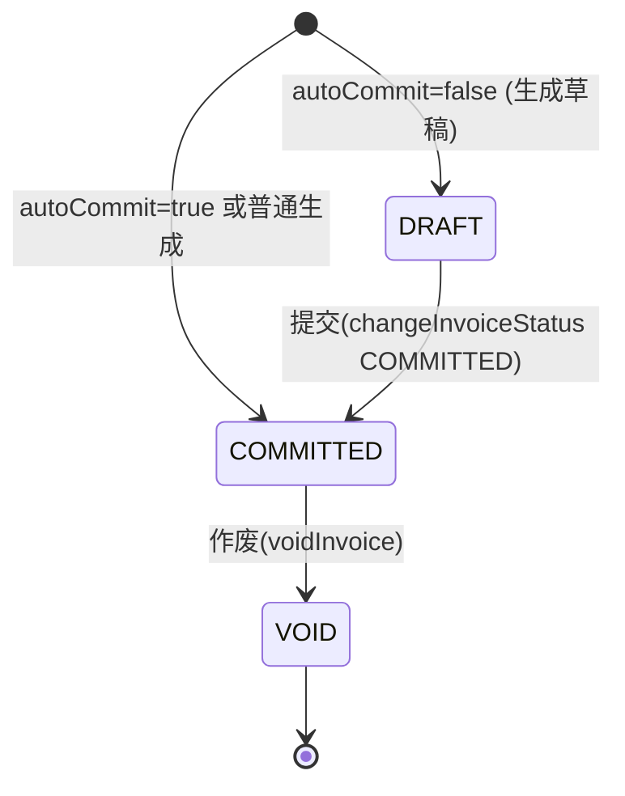

**备注**：DRAFT/VOID 发票余额一律为 0（见 BR-020）。

## SM-002 发票支付状态机（INIT → PENDING → SUCCESS，拒付可回退）

- **类型**: 状态机
- **同义词**: 支付状态流转, invoice payment state machine, 支付状态机, 拒付回退, INIT 回 PENDING SUCCESS
- **模块**: invoice
- **置信度**: 🟢 confirmed
- **溯源**: `invoice/src/main/java/org/killbill/billing/invoice/dao/DefaultInvoiceDao.java:1078-1140`, `invoice/src/main/java/org/killbill/billing/invoice/dao/DefaultInvoiceDao.java:970-1004`

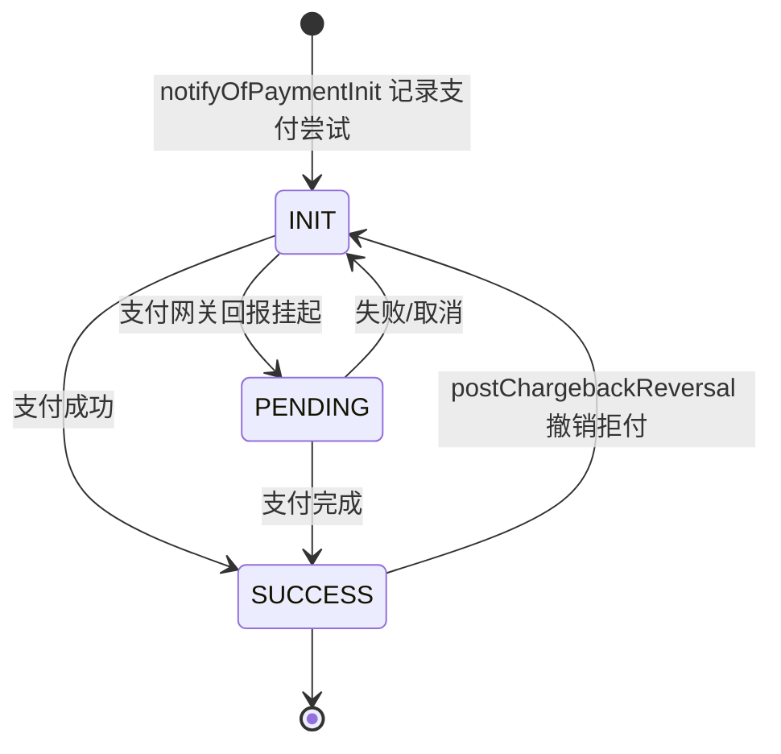

**说明**：
- `notifyOfPaymentInit` 总是先落一条状态为 `INIT` 的支付行；`notifyOfPaymentCompletion` 按 `paymentCookieId` 找既有 `ATTEMPT` 行并更新其状态。
- 若存在既有尝试行，则 `paymentId` **不可变更**（否则 Preconditions 失败）；`paymentId` 为 null 时（如无支付方式，仅发事件给 Overdue）在 completion 阶段不落行但仍发事件。
- 金额与币种从原支付行继承更新。

## SM-003 账户逾期状态机

- **类型**: 状态机
- **同义词**: 逾期状态机, 催收状态流转, 状态迁移, overdue state machine, dunning state machine, CLEAR, OD1, OD2, OD3
- **模块**: overdue
- **置信度**: 🟢 confirmed
- **溯源**: `overdue/src/main/java/org/killbill/billing/overdue/config/DefaultOverdueStateSet.java:37`, `overdue/src/main/java/org/killbill/billing/overdue/config/DefaultOverdueStateSet.java:59-67`, `overdue/src/main/java/org/killbill/billing/overdue/config/DefaultOverdueStateSet.java:92-95`, `overdue/src/main/java/org/killbill/billing/overdue/applicator/OverdueStateApplicator.java:127-158`, `profiles/killbill/src/main/resources/overdue.xml:19-61`

**说明**：状态名并非固定枚举，而是由配置定义；下图为官方示例（OD1/OD2/OD3 + 内建 CLEAR）的典型流转。**CLEAR 是默认/未逾期态**；随欠费账龄增长，评估结果沿「入门级（OD1）→ 更严重（OD2）→ 最严重（OD3）」，每次进入更严重状态会执行该状态的动作（阻止变更、暂停权益、可选取消订阅）。当账户不再满足更严重条件的条件、或欠费结清、或被打上 OVERDUE_ENFORCEMENT_OFF 时，评估结果回落到较轻状态或 CLEAR（降级/恢复）。配置中越靠前的状态优先级越高（先匹配先赢）。

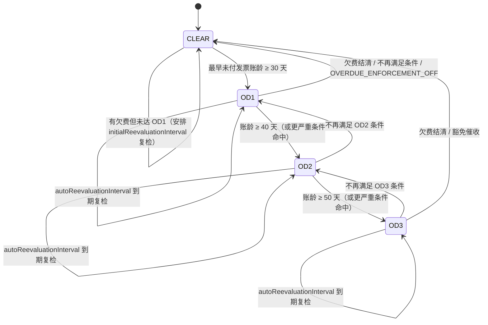

**进入动作（按目标状态）**：`blockChanges` / `disableEntitlementAndChangesBlocked`（含暂停权益+停止计费）/ `subscriptionCancellationPolicy`（NONE/IMMEDIATE/END_OF_TERM）/ 自动切换 `AUTO_INVOICING_OFF`。相同状态重入为 no-op。

## SM-004 逾期异步通知动作状态机（REFRESH / CLEAR）

- **类型**: 状态机
- **同义词**: 通知动作, 刷新与清除, REFRESH, CLEAR, notification action state machine, OverdueAsyncBusNotificationAction
- **模块**: overdue
- **置信度**: 🟢 confirmed
- **溯源**: `overdue/src/main/java/org/killbill/billing/overdue/notification/OverdueAsyncBusNotificationKey.java:30-33`, `overdue/src/main/java/org/killbill/billing/overdue/notification/OverdueAsyncBusNotifier.java:64-74`, `overdue/src/main/java/org/killbill/billing/overdue/listener/OverdueListener.java:98-119`

**说明**：异步总线通知键携带动作，决定消费时执行「重新评估」还是「清除状态」。

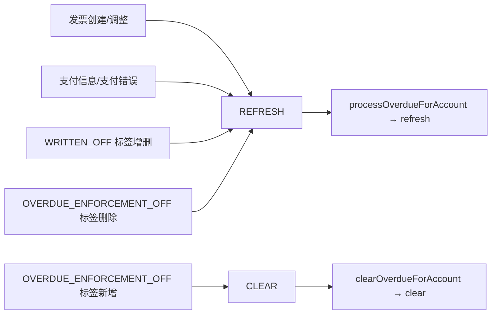

## SM-005 状态选择 / 清算判定状态机（配置态 + 内建 CLEAR）

- **类型**: 状态机
- **同义词**: 状态选择状态机, 清算判定, state selection machine, config state vs built-in clear, calculateOverdueState
- **模块**: overdue
- **置信度**: 🟢 confirmed
- **溯源**: `overdue/src/main/java/org/killbill/billing/overdue/config/DefaultOverdueStateSet.java:37-67`, `overdue/src/main/java/org/killbill/billing/overdue/config/DefaultOverdueCondition.java:69-84`, `api/src/main/java/org/killbill/billing/overdue/config/api/OverdueStateSet.java:24-44`

**说明**：每次评估（refresh 或定时复评）都从 BillingState 重新计算目标状态；**不是事件驱动的迁移图，而是「按声明顺序取首个命中，否则内建 CLEAR」的函数式选择**。配置状态之间不需要（也没有）显式迁移边；从任意状态到任意状态都合法，只要条件命中。无 `<condition>` 的配置状态在此图中不可达。

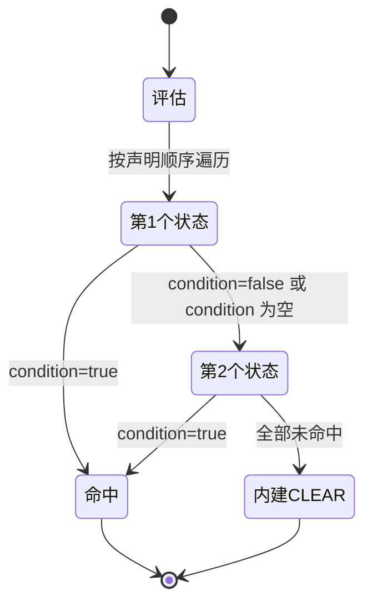

**注**：内建 `<state name="Clear" isClearState="true">`（NoOverdueConfig）只是配置里的普通状态且**无 condition**，因此它自身永不作为选择结果出现；真正的清算出口是状态集内建的 `__KILLBILL__CLEAR__OVERDUE_STATE__`（BR-146）。

## SM-006 复评通知调度决策状态机

- **类型**: 状态机
- **同义词**: 通知调度状态机, 复评决策, notification scheduling machine, reevaluation decision, schedule vs clear
- **模块**: overdue
- **置信度**: 🟢 confirmed
- **溯源**: `overdue/src/main/java/org/killbill/billing/overdue/applicator/OverdueStateApplicator.java:109-125`, `overdue/src/main/java/org/killbill/billing/overdue/applicator/OverdueStateApplicator.java:160-174`, `overdue/src/main/java/org/killbill/billing/overdue/applicator/OverdueStateApplicator.java:275-283`

**说明**：由「next 是否 clear」与「是否有欠费」共同决定是调度、跳过还是清空未来通知。

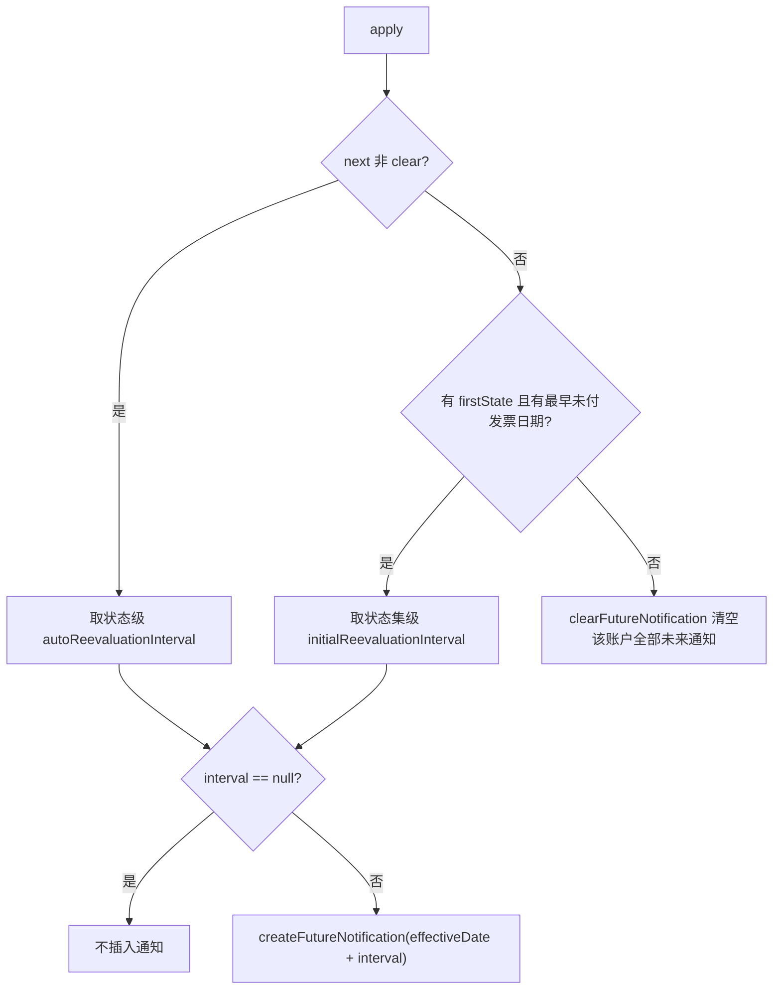

**可能产生通知间隔为 null 的情形**：非 clear 状态的 `autoReevaluationInterval` 缺省/`number==0`/`UNLIMITED`（BR-158）；或状态集未配置 `initialReevaluationInterval`（BR-148）。此时即使处于催收状态也不会有定时复评。

<!-- module: overdue | supplement cards | 补全 kb2 未覆盖的精确枚举/默认值/条件行为 | extracted from source reads -->

## SM-007 计划阶段生命周期状态机

- **类型**: 状态机
- **同义词**: 阶段流转, 试用期结束, 折扣期结束, phase lifecycle, trial to evergreen, 阶段状态
- **模块**: catalog
- **置信度**: 🟢 confirmed
- **溯源**: `catalog/src/main/java/org/killbill/billing/catalog/DefaultPlan.java:199-211`, `catalog/src/main/java/org/killbill/billing/catalog/DefaultPlan.java:304-319`, `catalog/src/main/java/org/killbill/billing/catalog/StandaloneCatalog.java:290-310`

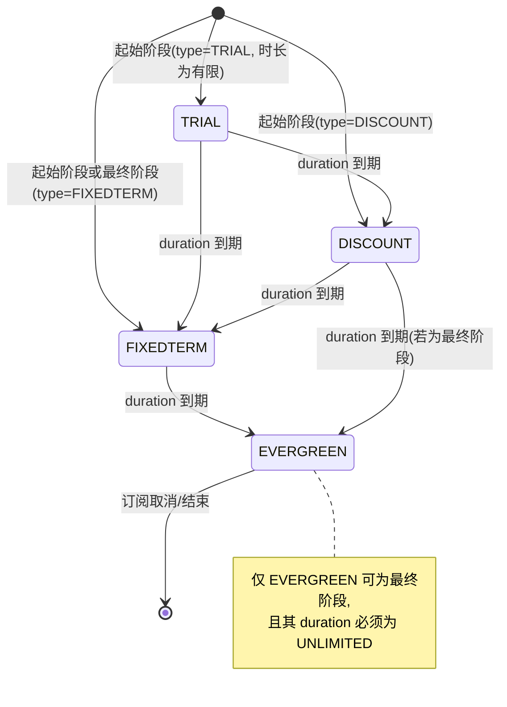

**约束**：起始阶段不得为 EVERGREEN；最终阶段不得为 TRIAL/DISCOUNT；EVERGREEN 必须 UNLIMITED，非 EVERGREEN 不得 UNLIMITED。

## SM-008 目录版本生效状态机

- **类型**: 状态机
- **同义词**: 目录版本生效, catalog version lifecycle, 版本按日期切换, 目录生效
- **模块**: catalog
- **置信度**: 🟢 confirmed
- **溯源**: `catalog/src/main/java/org/killbill/billing/catalog/DefaultVersionedCatalog.java:82-120`, `catalog/src/main/java/org/killbill/billing/catalog/DefaultVersionedCatalog.java:133-154`

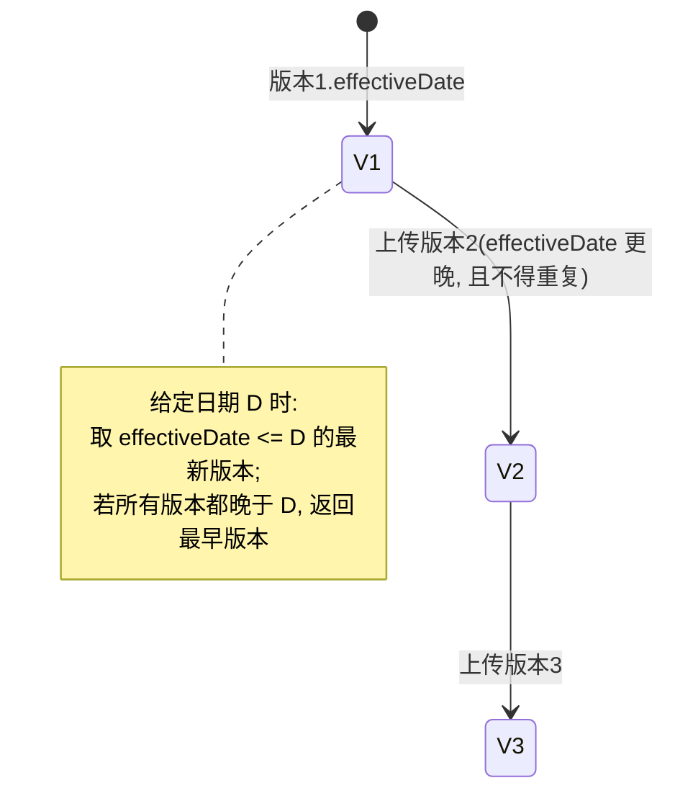

## SM-009 支付交易状态机

- **类型**: 状态机
- **同义词**: 支付状态, 支付状态机, 交易状态, payment state, payment state machine, transaction status, AUTH_SUCCESS, PURCHASE_PENDING
- **模块**: payment
- **置信度**: 🟢 confirmed
- **溯源**: `payment/src/main/resources/org/killbill/billing/payment/PaymentStates.xml:22-497`, `payment/src/main/java/org/killbill/billing/payment/core/sm/PaymentStateMachineHelper.java:83-110`

**说明**：每种交易类型（AUTHORIZE/CAPTURE/PURCHASE/REFUND/CREDIT/VOID/CHARGEBACK）各是一条独立子状态机，初始状态均为 `<TYPE>_INIT`，由操作 OP_<TYPE> 驱动到 `<TYPE>_SUCCESS` / `<TYPE>_FAILED` / `<TYPE>_PENDING` / `<TYPE>_ERRORED`。PENDING 状态可再经同一操作流向 SUCCESS 或 FAILED，EXCEPTION 结果流向 ERRORED。子状态机之间通过 linkStateMachines 串联。

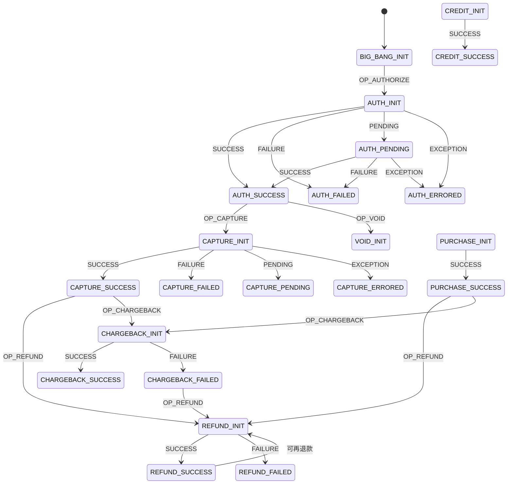

**成功判定**：`isSuccessState` 规则为状态名以 `SUCCESS` 结尾，或状态名以 `CHARGEBACK` 开头（即任何 CHARGEBACK_* 状态都算成功态）。

## SM-010 支付重试控制状态机 (PAYMENT_RETRY)

- **类型**: 状态机
- **同义词**: 支付重试状态机, retry state machine, PAYMENT_RETRY, 重试流转, OP_RETRY
- **模块**: payment
- **置信度**: 🟢 confirmed
- **溯源**: `payment/src/main/resources/org/killbill/billing/payment/retry/RetryStates.xml:22-82`, `payment/src/main/java/org/killbill/billing/payment/core/sm/PaymentControlStateMachineHelper.java:35-52`

**说明**：控制类支付（invoice payment）的重试由 PAYMENT_RETRY 状态机驱动，操作名为 OP_RETRY，状态机名必须与 RetryStates.xml 一致。

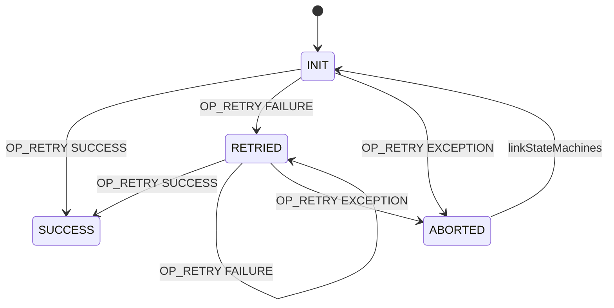

## SM-011 Janitor 支付尝试(attempt)修复状态机

- **类型**: 状态机
- **同义词**: attempt 修复, 支付尝试状态机, janitor attempt, attempt repair, INIT 到终态
- **模块**: payment
- **置信度**: 🟢 confirmed
- **溯源**: `payment/src/main/java/org/killbill/billing/payment/core/janitor/IncompletePaymentAttemptTask.java:196-294`, `payment/src/main/resources/org/killbill/billing/payment/retry/RetryStates.xml:22-82`

**说明**：Janitor 的 `IncompletePaymentAttemptTask` 定期扫描处于重试状态机初始态（`INIT`）且创建时间早于 `org.killbill.payment.janitor.attempts.delay`（默认 12h）的支付尝试，并推进其状态：

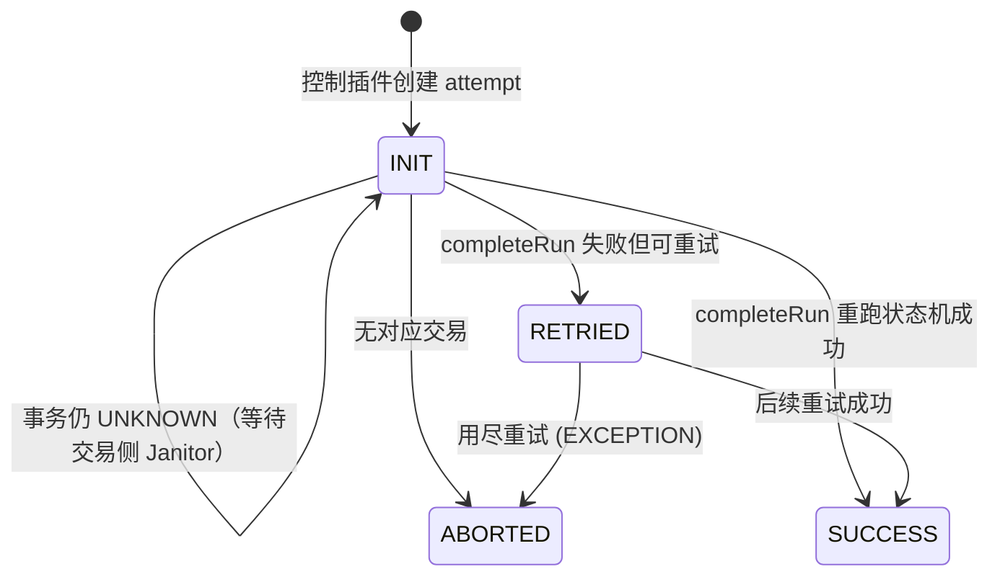

**触发条件**：attempt 对应交易为 `UNKNOWN` 时跳过（交交易侧 Janitor）；否则重跑控制状态机的 completion 部分，仅调用控制插件的 success/failure 回调并流转状态。

## SM-012 插件支付结果 → 交易状态 → 支付状态 → HTTP 返回码（完整映射）

- **类型**: 状态机
- **同义词**: 插件结果映射, 支付结果, 返回码, 支付状态名, plugin result mapping, PaymentPluginStatus, transaction status, payment state, HTTP status, 402, 502, 503, 422, payment declined
- **模块**: payment
- **置信度**: 🟢 confirmed
- **溯源**: `payment/src/main/java/org/killbill/billing/payment/core/PaymentTransactionInfoPluginConverter.java:33-72`, `payment/src/main/java/org/killbill/billing/payment/core/sm/PaymentStateMachineHelper.java:121-203`, `jaxrs/src/main/java/org/killbill/billing/jaxrs/resources/JaxRsResourceBase.java:699-736`, `jaxrs/src/main/java/org/killbill/billing/jaxrs/mappers/PaymentApiExceptionMapper.java:76-87`, `jaxrs/src/main/java/org/killbill/billing/jaxrs/mappers/ExceptionMapperBase.java:137-148`

**说明**：补全 kb2 `BR-239` 只给出 `TransactionStatus`/`OperationResult` 而未给出的两列——精确的 **payment state 名**（写入 `payments.state_name`）和对外 **HTTP 状态码**。`<TYPE>` ∈ {AUTH, CAPTURE, PURCHASE, REFUND, CREDIT, VOID, CHARGEBACK}。

| 支付插件结果 (PaymentPluginStatus) | TransactionStatus | OperationResult | payment state (name) | HTTP 码（创建支付的响应） | 语义 |
|---|---|---|---|---|---|
| `PROCESSED` | `SUCCESS` | `SUCCESS` | `<TYPE>_SUCCESS` | `201 Created` | 交易成功 |
| `PENDING` | `PENDING` | `PENDING` | `<TYPE>_PENDING` | `201 Created` | 处理中，未决 |
| `ERROR` | `PAYMENT_FAILURE` | `FAILURE` | `<TYPE>_FAILED` | `402 Payment Required` | 到网关被拒（如卡被拒） |
| `CANCELED` | `PLUGIN_FAILURE` | `EXCEPTION` | `<TYPE>_ERRORED` | `502 Bad Gateway` | 插件确信交易未发生 |
| `UNDEFINED` / `null` | `UNKNOWN` | `EXCEPTION` | 状态不允许推进（保持当前） | `503 Service Unavailable` | 结果未知，交 Janitor 回查 |
| （控制插件 abort） | 不产生交易 | `EXCEPTION` | attempt → `ABORTED` | `422 Unprocessable Entity` | 控制插件主动中止 |
| （插件调用异常/超时） | 不产生交易 | `EXCEPTION` | 保持当前 | `504 Gateway Timeout` | 插件超时（`PAYMENT_PLUGIN_TIMEOUT`） |

**关键细节**：
- `ERROR` 在插件侧语义是"支付失败（PAYMENT_FAILURE）"，`CANCELED` 才是"插件失败（PLUGIN_FAILURE）"，两者不可混淆（`payment/src/main/java/org/killbill/billing/payment/core/PaymentTransactionInfoPluginConverter.java:40-48`）。
- HTTP 码来自 jaxrs 的 `createPaymentResponse` 按**最新一条同类型交易**的 `TransactionStatus` 决定；`SUCCESS`/`PENDING` 走默认 `201`，`PAYMENT_FAILURE→402`、`PLUGIN_FAILURE→502`、`UNKNOWN→503`、`PAYMENT_SYSTEM_OFF→503`（`jaxrs/src/main/java/org/killbill/billing/jaxrs/resources/JaxRsResourceBase.java:705-733`，默认 `201` 见 `jaxrs/src/main/java/org/killbill/billing/jaxrs/util/JaxrsUriBuilder.java:59-66`）。
- 控制插件 abort 抛 `PAYMENT_PLUGIN_API_ABORTED`，映射为 `422`（`jaxrs/src/main/java/org/killbill/billing/jaxrs/mappers/PaymentApiExceptionMapper.java:83-86`）；插件超时抛 `PAYMENT_PLUGIN_TIMEOUT`，映射为 `504`（`jaxrs/src/main/java/org/killbill/billing/jaxrs/mappers/ExceptionMapperBase.java:143-148`）。
- `UNKNOWN` 不是终态，`payments.state_name` 不会因 UNKNOWN 而改写（Janitor 保留原状态，详见 BR-258）。

## SM-013 外部支付（__EXTERNAL_PAYMENT__）的状态收敛

- **类型**: 状态机
- **同义词**: 外部支付状态, external payment status, PROCESSED 恒成功, 无网关交互, 线下支付状态
- **模块**: payment
- **置信度**: 🟢 confirmed
- **溯源**: `payment/src/main/java/org/killbill/billing/payment/provider/ExternalPaymentProviderPlugin.java:63-101`, `payment/src/main/java/org/killbill/billing/payment/provider/ExternalPaymentProviderPlugin.java:144-158`, `payment/src/main/java/org/killbill/billing/payment/core/PaymentTransactionInfoPluginConverter.java:33-56`

**说明**：`__EXTERNAL_PAYMENT__` 的每个操作（authorize/capture/purchase/refund/credit）都返回 `DefaultNoOpPaymentInfoPlugin`，状态由 `getPaymentPluginStatus` 决定；**默认 `PROCESSED`**（→ `SUCCESS`）。

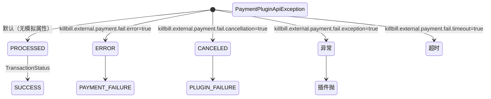

**特殊点**：`voidPayment` 返回的金额恒为 `BigDecimal.ZERO`、币种为 `null`（撤销无金额）；因此正常外部支付不会进入 `PENDING`/`UNKNOWN`，除非显式用模拟属性（见 kb2 BR-247）。

## SM-014 用量记录无状态生命周期（只追加）

- **类型**: 状态机
- **同义词**: 用量状态, 用量生命周期, append only, immutable usage, no lifecycle, 用量无状态
- **模块**: usage
- **置信度**: 🟢 confirmed
- **溯源**: `usage/src/main/java/org/killbill/billing/usage/dao/RolledUpUsageModelDao.java:30-51`, `usage/src/main/java/org/killbill/billing/usage/dao/RolledUpUsageModelDao.java:150-158`, `usage/src/main/java/org/killbill/billing/usage/dao/RolledUpUsageDao.java:26-37`

**结论**：用量记录**没有状态字段，也没有状态流转**。`RolledUpUsageModelDao` 只有业务数值字段；`getHistoryTableName()` 显式返回 `null`（不写入历史表）；`RolledUpUsageDao` 只提供 `record`（插入）与查询方法，**没有任何 update/delete**。

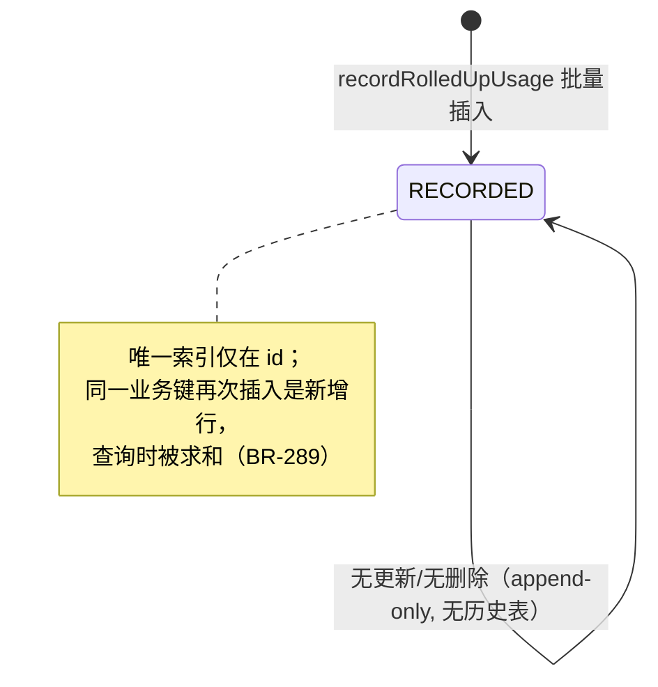

**含义**：不存在「用量被修改/撤销」的状态机。任何「更正用量」都只能通过新增一条冲正记录实现，且系统不会自动去重（除 trackingId 外）。

---

## SM-015 计费区间生命周期（在途 → 关闭）

- **类型**: 状态机
- **同义词**: 计费区间生命周期, 在途区间, 区间关闭, interval lifecycle, inflight interval, closed interval
- **模块**: usage
- **置信度**: 🟢 confirmed
- **溯源**: `invoice/src/main/java/org/killbill/billing/invoice/usage/SubscriptionUsageInArrear.java:160-227`

**含义**：描述一个 usage 段对应的 `ContiguousIntervalUsageInArrear` 如何随 billing events 演进。区间标识键为 `(usageName, catalogEffectiveDate)`。

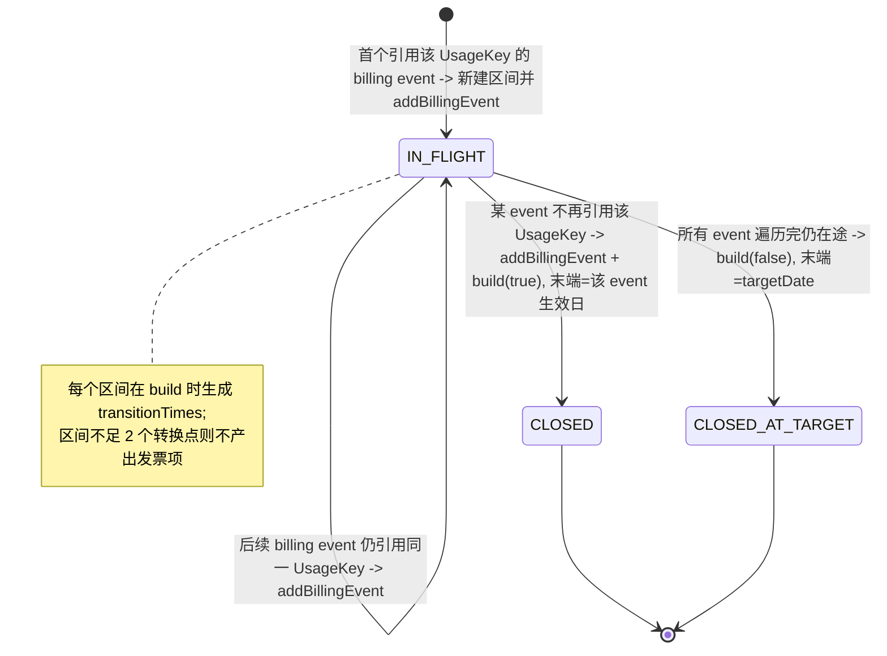

**含义**：一个订阅的多个 usage 段/多个目录版本会产生多个区间实例；每个区间独立走 WF-038~U4 的聚合与定价。

<!-- module: usage | supplement cards: 40 | extracted_at: 2026-09-17 -->
