# 业务流程（Workflows）

> Kill Bill 业务知识库 v3（合并 kb2 既有卡 + kb3 补充卡）；共 40 张卡。

---

## WF-001 发票生成流程（generateInvoice）

- **类型**: 业务流程
- **同义词**: 发票怎么生成, 开票流程, invoice generation flow, generateInvoice, 出账流程
- **模块**: invoice
- **置信度**: 🟢 confirmed
- **溯源**: `invoice/src/main/java/org/killbill/billing/invoice/generator/DefaultInvoiceGenerator.java:74-115`

**步骤**：
1. 若 billing events 为空，直接返回空发票（无可计费内容）。
2. 校验目标日期（BR-028）。
3. 依据既有发票调整目标日期（BR-029）。
4. 确定发票状态：账户 `isAccountAutoInvoiceDraft` → `DRAFT`，否则 `COMMITTED`。
5. 创建 `DefaultInvoice`（invoiceDate = 当前创建日期）。
6. 生成**固定与周期（fixed & recurring）**发票项并加入发票。
7. 生成**用量（usage）**发票项与 trackingIds 并加入发票。
8. 若指定了 `targetInvoiceId`，合并该既有发票的项目。
9. 返回带元数据（trackingIds、未来通知日期、是否禁用零金额用量）的 `InvoiceWithMetadata`。

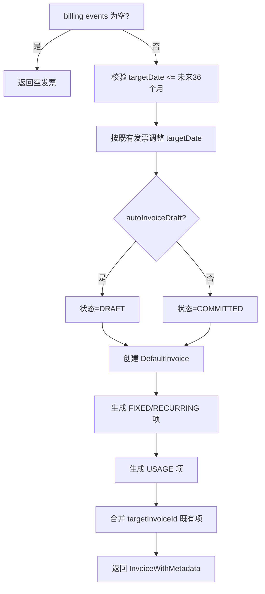
```mermaid
flowchart TD
  A[billing events 为空?] -->|是| Z[返回空发票]
  A -->|否| B[校验 targetDate <= 未来36个月]
  B --> C[按既有发票调整 targetDate]
  C --> D{autoInvoiceDraft?}
  D -->|是| E[状态=DRAFT]
  D -->|否| F[状态=COMMITTED]
  E --> G[创建 DefaultInvoice]
  F --> G
  G --> H[生成 FIXED/RECURRING 项]
  H --> I[生成 USAGE 项]
  I --> J[合并 targetInvoiceId 既有项]
  J --> K[返回 InvoiceWithMetadata]
```

## WF-002 干跑发票流程（dryRun）

- **类型**: 业务流程
- **同义词**: 干跑流程, 试算流程, dry run flow, 预览发票, triggerDryRunInvoiceGeneration
- **模块**: invoice
- **置信度**: 🟢 confirmed
- **溯源**: `invoice/src/main/java/org/killbill/billing/invoice/InvoiceDispatcher.java:362-435`, `invoice/src/main/java/org/killbill/billing/invoice/api/user/DefaultInvoiceUserApi.java:277-288`

**步骤**：
1. 若为 `UPCOMING_INVOICE` 且未提供目标日期，由系统计算；否则使用传入/当前目标日期。
2. 组装 `DryRunInfo(dryRunType, dryRunInfoDate)`。
3. 拉取既有发票与 billing events（同样会更新 BCD）。
4. 若为 `UPCOMING_INVOICE`：收集所有候选目标日期（含订阅未来切换），可再按订阅 id 过滤后试算。
5. 若为 `TARGET_DATE` 或 `SUBSCRIPTION_ACTION`：按 `inputTargetDate` 试算。
6. 返回一张预览 `Invoice`（不落库）；API `triggerDryRunInvoiceGeneration` 若结果为空则抛 `INVOICE_NOTHING_TO_DO`。

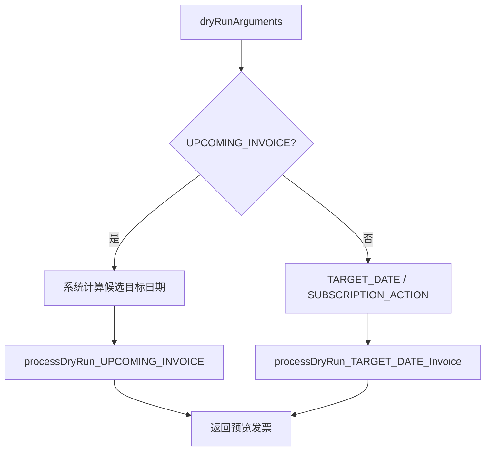
```mermaid
flowchart TD
  A[dryRunArguments] --> B{UPCOMING_INVOICE?}
  B -->|是| C[系统计算候选目标日期]
  C --> D[processDryRun_UPCOMING_INVOICE]
  B -->|否| E[TARGET_DATE / SUBSCRIPTION_ACTION]
  E --> F[processDryRun_TARGET_DATE_Invoice]
  D --> G[返回预览发票]
  F --> G
```

## WF-003 用量计费流程（in-arrear usage billing）

- **类型**: 业务流程
- **同义词**: 用量计费流程, 后付费用量, usage billing flow, in-arrear, 按量出账
- **模块**: invoice
- **置信度**: 🟢 confirmed
- **溯源**: `invoice/src/main/java/org/killbill/billing/invoice/usage/ContiguousIntervalUsageInArrear.java:184-331`

**步骤**：
1. 依据 billing events 构建 transition times（按 BCD 对齐）。
2. 将原始用量（RawUsageRecord）按区间滚动汇总（CAPACITY 取峰 / CONSUMABLE 累加）。
3. 清理已存在的 tracking id，得到新增用量集合。
4. 对每个区间：跳过已被既有 USAGE 项覆盖的区间；计算已计费金额与本次应计金额。
5. 生成本次差异的 `USAGE` 发票项与 tracking ids。
6. 计算下一次用量通知日期，返回结果。

## WF-004 父发票自动提交流程（parent invoice auto-commit）

- **类型**: 业务流程
- **同义词**: 父发票提交, HA 发票, parent invoice commit, 父子账户开票, 多账户开票, parent commitment
- **模块**: invoice
- **置信度**: 🟢 confirmed
- **溯源**: `invoice/src/main/java/org/killbill/billing/invoice/notification/ParentInvoiceCommitmentPoster.java:49-95`, `invoice/src/main/java/org/killbill/billing/invoice/InvoiceDispatcher.java:1394`, `invoice/src/main/java/org/killbill/billing/invoice/InvoiceDispatcher.java:1481`

**步骤**：
1. 为子账户生成一张**草稿父发票**（DRAFT，isParentInvoice=true），目标为父账户。
2. 记录一条“父发票提交”未来通知（队列 `ParentInvoiceCommitmentNotifier`），触发时间取自 `org.killbill.invoice.parent.commit.local.utc.time`（默认 UTC 23:59:59.999）。
3. 到点时由 notifier 处理该通知，将父发票状态提交为 `COMMITTED`。
4. 若同一日期已有相同 invoiceId 的未来通知，则不重复插入（去重）。

## WF-005 发票生成触发时机（when invoice is generated）

- **类型**: 业务流程
- **同义词**: 什么时候开票, 发票生成时机, invoice generation trigger, when is invoice generated, 出账时机, 自动开票
- **模块**: invoice
- **置信度**: 🟢 confirmed
- **溯源**: `invoice/src/main/java/org/killbill/billing/invoice/InvoiceListener.java:98-229`, `invoice/src/main/java/org/killbill/billing/invoice/InvoiceListener.java:266-307`, `invoice/src/main/java/org/killbill/billing/invoice/InvoiceDispatcher.java:254-300`

**说明**：发票在以下情形被触发生成（除最后一项外均为系统内部事件驱动）：
1. **订阅有效变更**（`EffectiveSubscriptionInternalEvent`，跳过 UNCANCEL 与非最后事件）→ 立即为该订阅生成发票。
2. **阻断状态变更**（`BlockingTransitionInternalEvent`，block/unblock billing）→ 重新生成。
3. **下一账期事件/通知**（Next Billing Date）→ 到期生成。
4. **账户 BCD 变更**（`billCycleDayLocal` 变化）→ 重新生成。
5. **子账户发票创建**（`InvoiceCreationInternalEvent`，且子账户 payment 委托给父账户）→ 生成父发票汇总。
6. **发票调整**（`DefaultInvoiceAdjustmentEvent`）→ 调整父发票。
7. **订阅请求**（`RequestedSubscriptionInternalEvent`）→ 安排 dry-run 通知时间。
8. **API 显式调用**（`triggerInvoiceGeneration` / `triggerDryRunInvoiceGeneration`）。

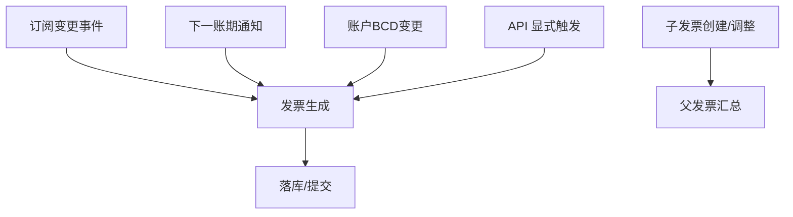
```mermaid
flowchart TD
  A[订阅变更事件] --> G[发票生成]
  B[下一账期通知] --> G
  C[账户BCD变更] --> G
  D[API 显式触发] --> G
  E[子发票创建/调整] --> P[父发票汇总]
  G --> H[落库/提交]
```

## WF-006 父子账户（HA）发票汇总流程

- **类型**: 业务流程
- **同义词**: 父子账户开票, HA 发票, parent child invoice, 汇总发票, payment delegated to parent, 多账户统一出账
- **模块**: invoice
- **置信度**: 🟢 confirmed
- **溯源**: `invoice/src/main/java/org/killbill/billing/invoice/InvoiceDispatcher.java:1340-1405`, `invoice/src/main/java/org/killbill/billing/invoice/InvoiceListener.java:143-168`

**步骤**：
1. 当子账户产生发票创建事件、且该子账户**把支付委托给父账户**（`isPaymentDelegatedToParent`）时，触发父发票处理。
2. 对**父账户**加全局锁，读取子发票，计算子发票金额（`computeChildInvoiceAmount`）。
3. 查找父账户的 DRAFT 父发票：
   - 若已存在且已含该子账户的汇总项 → **累加更新**该项金额；
   - 若存在但无该项 → 新增一个 `PARENT_SUMMARY` 项；
   - 若不存在 → 视子发票是否应忽略（BR-050），否则新建 DRAFT 父发票并加 `PARENT_SUMMARY` 项。
4. 记录父-子发票关系（`InvoiceParentChildModelDao`）。
5. 到 `parent.commit.local.utc.time`（默认 UTC 23:59:59.999）由 notifier 提交父发票（见 WF-004）。

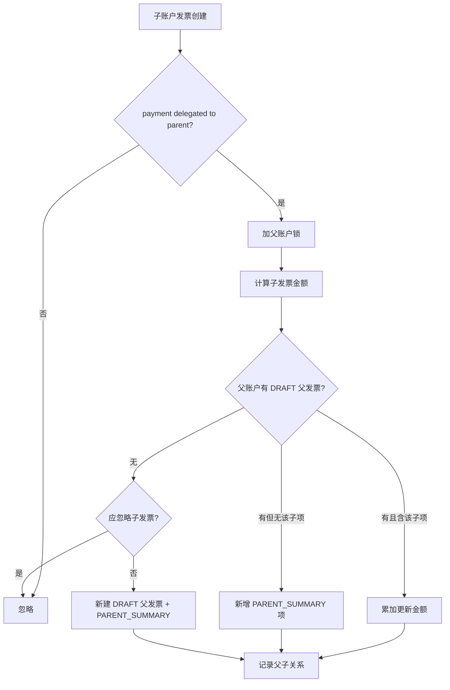
```mermaid
flowchart TD
  A[子账户发票创建] --> B{payment delegated to parent?}
  B -->|否| Z[忽略]
  B -->|是| C[加父账户锁]
  C --> D[计算子发票金额]
  D --> E{父账户有 DRAFT 父发票?}
  E -->|有且含该子项| F[累加更新金额]
  E -->|有但无该子项| G[新增 PARENT_SUMMARY 项]
  E -->|无| H{应忽略子发票?}
  H -->|否| I[新建 DRAFT 父发票 + PARENT_SUMMARY]
  H -->|是| Z
  F --> J[记录父子关系]
  G --> J
  I --> J
```

## WF-007 修复 / 套餐变更处理流程（Repair）

- **类型**: 业务流程
- **同义词**: 修复流程, 套餐变更, 改套餐, repair, plan change, 冲销重开, CHG
- **模块**: invoice
- **置信度**: 🟢 confirmed
- **溯源**: `invoice/src/main/java/org/killbill/billing/invoice/generator/FixedAndRecurringInvoiceItemGenerator.java:91-137`

**步骤**：
1. 用既有发票项构建 `AccountItemTree`；先通过 `InvoicePruner.getFullyRepairedItemsClosure` 剔除**此前已被完全修复**的项，避免链式重复。
2. 跳过来自 `auto_invoice_off` 订阅的项（但迁移发票/信用/外部收费等始终纳入）。
3. 依据 junction 的 billing events 生成**提议项**（自历史起点的全部 RECURRING/FIXED 项）。
4. 由 optimizer 过滤提议项（BR-042）。
5. 在树中把提议项与既有项**合并**，对不再适用/缩短的既有项产生 `REPAIR_ADJ`（负金额冲销），对新增/延长部分产生新的 RECURRING/FIXED 项。
6. 取合并后的结果项列表并执行安全边界校验（每日项数上限）。

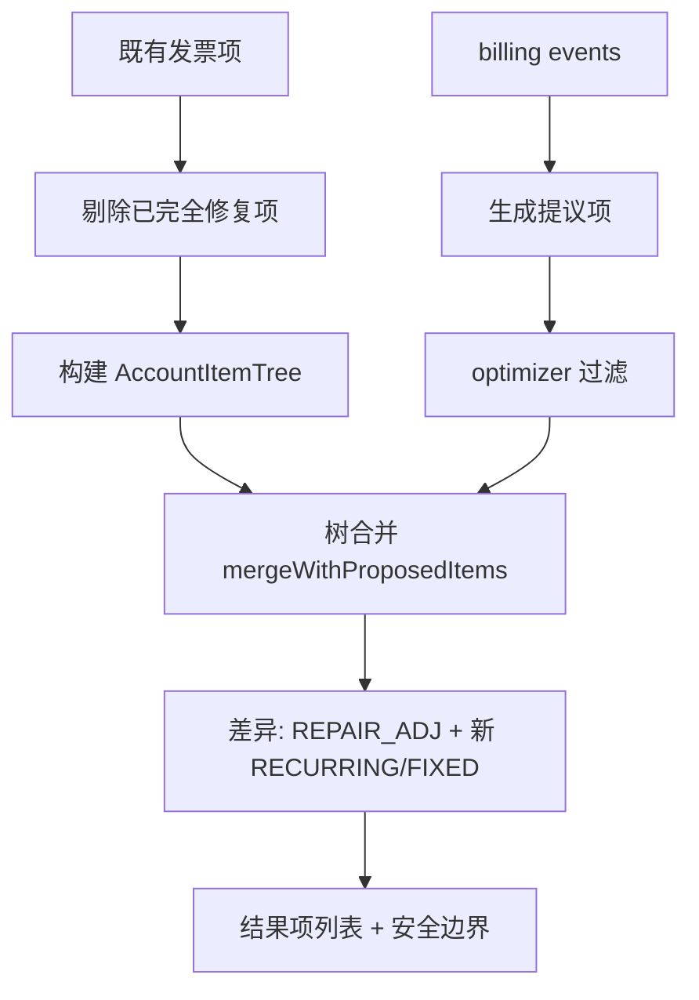
```mermaid
flowchart TD
  A[既有发票项] --> B[剔除已完全修复项]
  B --> C[构建 AccountItemTree]
  D[billing events] --> E[生成提议项]
  E --> F[optimizer 过滤]
  C --> G[树合并 mergeWithProposedItems]
  F --> G
  G --> H[差异: REPAIR_ADJ + 新 RECURRING/FIXED]
  H --> I[结果项列表 + 安全边界]
```

## WF-008 发票插件生命周期流程

- **类型**: 业务流程
- **同义词**: 发票插件流程, invoice plugin lifecycle, priorCall, onSuccessCall, onFailureCall, 插件回调
- **模块**: invoice
- **置信度**: 🟢 confirmed
- **溯源**: `invoice/src/main/java/org/killbill/billing/invoice/InvoicePluginDispatcher.java:113-222`, `invoice/src/main/java/org/killbill/billing/invoice/api/InvoiceApiHelper.java:160-175`

**步骤**：
1. **priorCall**：生成/写入发票前调用。可返回 rescheduleDate（调整开票时间，取所有插件中**最早**的）、abort（抛 `INVOICE_PLUGIN_API_ABORTED`）、调整后的 PluginProperties。
2. **getAdditionalInvoiceItems**：对每张发票（原发票 clone）调用，插件可增删/改项；返回项经类型白名单与可变字段清洗（BR-070/BR-071）。
3. **onSuccessCall**：全部落库成功后、对每张刷新后的发票调用；异常被吞掉（仅 warn），不影响主流程。
4. **onFailureCall**：任何失败路径调用；同样吞异常。
5. 插件集合与顺序：若配置了插件名列表则按配置顺序且只保留已注册的；**未配置则返回全部已注册插件（顺序不确定）**。

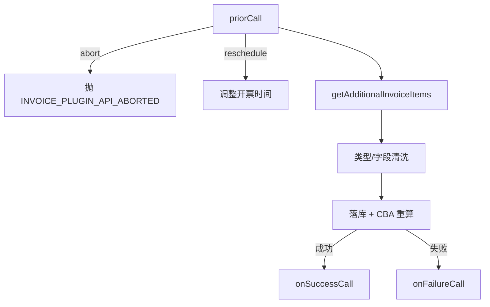
```mermaid
flowchart TD
  A[priorCall] -->|abort| X[抛 INVOICE_PLUGIN_API_ABORTED]
  A -->|reschedule| R[调整开票时间]
  A --> B[getAdditionalInvoiceItems]
  B --> C[类型/字段清洗]
  C --> D[落库 + CBA 重算]
  D -->|成功| E[onSuccessCall]
  D -->|失败| F[onFailureCall]
```

## WF-009 发票拆分（getInvoiceGrouping / splitInvoices）

- **类型**: 业务流程
- **同义词**: 发票拆票, split invoice, getInvoiceGrouping, InvoiceGroup, 一张变多张
- **模块**: invoice
- **置信度**: 🟢 confirmed
- **溯源**: `invoice/src/main/java/org/killbill/billing/invoice/InvoicePluginDispatcher.java:243-302`

**步骤**：
1. 对原发票 clone 调用每个插件的 `getInvoiceGrouping`；插件返回 `InvoiceGroupingResult`（含多个 `InvoiceGroup`，每组是一批 `invoiceItemIds`）。
2. 若返回了分组且组数 > 0：为**每个组**新建一张 `DefaultInvoice`（新 id，但沿用原发票的 account/date/targetDate/currency/migration/status）；把组内原项复制到新发票（仅替换 `invoiceId`）。
3. 返回多张发票；若没有插件返回有效分组 → 返回原发票单张。

**含义**：插件可把一次开票结果拆成多张发票（例如按业务线拆票），拆分发生在新发票落库之前。

## WF-010 逾期评估与刷新流程（Refresh）

- **类型**: 业务流程
- **同义词**: 逾期流程, 催收流程, 逾期刷新, overdue refresh workflow, dunning process, reevaluation flow
- **模块**: overdue
- **置信度**: 🟢 confirmed
- **溯源**: `overdue/src/main/java/org/killbill/billing/overdue/listener/OverdueListener.java:96-157`, `overdue/src/main/java/org/killbill/billing/overdue/notification/OverdueAsyncBusNotifier.java:56-78`, `overdue/src/main/java/org/killbill/billing/overdue/listener/OverdueDispatcher.java:42-56`, `overdue/src/main/java/org/killbill/billing/overdue/wrapper/OverdueWrapper.java:89-127`, `overdue/src/main/java/org/killbill/billing/overdue/applicator/OverdueStateApplicator.java:104-158`

**参与者**：业务事件（发票/支付/标签）、OverdueListener、async-bus 通知队列、OverdueDispatcher、OverdueWrapper、BillingStateCalculator、OverdueStateSet/Applicator、BlockingInternalApi、EntitlementApi、Bus。

**步骤**：
1. 业务事件触发 OverdueListener（除特殊标签外统一 REFRESH），校验 `shouldInsertNotification` 后写入 `overdue-async-bus-queue`（可级联父/子账户）。
2. OverdueAsyncBusNotifier 消费：REFRESH → `dispatcher.processOverdueForAccount`；CLEAR → `dispatcher.clearOverdueForAccount`。
3. Dispatcher 经 OverdueWrapperFactory 构造账户的 OverdueWrapper，调用 `refresh(effectiveDate, ctx)`（先取 ACCNT_INV_PAY 全局锁）。
4. Wrapper 检查 OVERDUE_ENFORCEMENT_OFF（有则跳过）；计算 BillingState；读取当前 BlockingState 得到 previousOverdueState；`calculateOverdueState` 得到 next。
5. Applicator.apply：调度/清除下次通知 → 状态未变则 no-op → 取消订阅（如需）→ 切换 AUTO_INVOICING_OFF → 写入新 BlockingState → 投递 OverdueChangeInternalEvent。

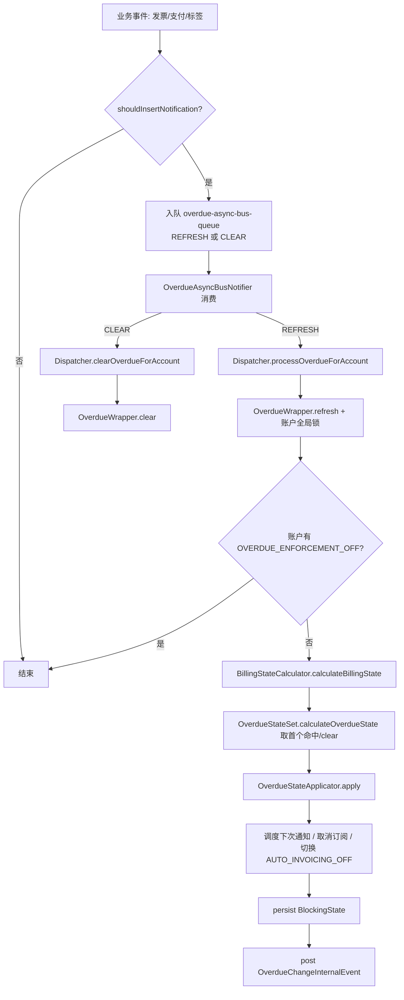
```mermaid
flowchart TD
  A[业务事件: 发票/支付/标签] --> B{shouldInsertNotification?}
  B -- 否 --> Z[结束]
  B -- 是 --> C[入队 overdue-async-bus-queue<br/>REFRESH 或 CLEAR]
  C --> D[OverdueAsyncBusNotifier 消费]
  D -- REFRESH --> E[Dispatcher.processOverdueForAccount]
  D -- CLEAR --> F[Dispatcher.clearOverdueForAccount]
  E --> G[OverdueWrapper.refresh + 账户全局锁]
  F --> H[OverdueWrapper.clear]
  G --> I{账户有 OVERDUE_ENFORCEMENT_OFF?}
  I -- 是 --> Z
  I -- 否 --> J[BillingStateCalculator.calculateBillingState]
  J --> K[OverdueStateSet.calculateOverdueState 取首个命中/clear]
  K --> L[OverdueStateApplicator.apply]
  L --> M[调度下次通知 / 取消订阅 / 切换 AUTO_INVOICING_OFF]
  M --> N[persist BlockingState]
  N --> O[post OverdueChangeInternalEvent]
```

## WF-011 逾期状态评估周期（评估→施加→定时复评）

- **类型**: 业务流程
- **同义词**: 逾期状态循环, 催收周期, 状态评估, overdue evaluation cycle, dunning cycle
- **模块**: overdue
- **置信度**: 🟢 confirmed
- **溯源**: `overdue/src/main/java/org/killbill/billing/overdue/wrapper/OverdueWrapper.java:109-127`, `overdue/src/main/java/org/killbill/billing/overdue/config/DefaultOverdueStateSet.java:59-67`, `overdue/src/main/java/org/killbill/billing/overdue/applicator/OverdueStateApplicator.java:114-125`, `overdue/src/main/java/org/killbill/billing/overdue/notification/OverdueCheckNotifier.java:56-69`

**步骤**：
1. 计算账户 BillingState（未付发票数、余额、最早未付日期、标签）。
2. 依据 BillingState + 账户时区当日，按配置顺序选首个命中状态（否则 clear）。
3. 与当前已持久化状态比较；不同则执行动作并持久化。
4. 若已逾期或存在欠费，按 `autoReevaluationInterval`/`initialReevaluationInterval` 安排 `overdue-check-queue` 未来通知。
5. 定时到点后 OverdueCheckNotifier 消费 → Dispatcher `processOverdueForAccount` → 回到步骤 1，形成周期。

## WF-012 租户逾期配置上传流程

- **类型**: 业务流程
- **同义词**: 上传催收配置, 配置下发, tenant config upload, overdue config upload
- **模块**: overdue
- **置信度**: 🟢 confirmed
- **溯源**: `overdue/src/main/java/org/killbill/billing/overdue/api/DefaultOverdueApi.java:66-89`, `overdue/src/main/java/org/killbill/billing/overdue/service/DefaultOverdueService.java:103-113`, `overdue/src/main/java/org/killbill/billing/overdue/caching/OverdueCacheInvalidationCallback.java:39-43`

**步骤**：
1. 调用方通过 OverdueApi 上传 `overdueXML`（或 OverdueConfig 对象，先序列化为 XML）。
2. 删除该租户已有的 `OVERDUE_CONFIG` 键值（若存在）。
3. 写入新的 `OVERDUE_CONFIG` 租户键值。
4. 清除该租户的逾期配置缓存。
5. 缓存失效回调（TenantKey.OVERDUE_CONFIG）也会触发 `clearOverdueConfig`，保证后续评估读取新配置。

## WF-013 逾期豁免（CLEAR）流程

- **类型**: 业务流程
- **同义词**: 停止催收流程, 逾期豁免, 清除逾期流程, clear overdue workflow, OVERDUE_ENFORCEMENT_OFF flow
- **模块**: overdue
- **置信度**: 🟢 confirmed
- **溯源**: `overdue/src/main/java/org/killbill/billing/overdue/listener/OverdueListener.java:98-107`, `overdue/src/main/java/org/killbill/billing/overdue/notification/OverdueAsyncBusNotifier.java:64-74`, `overdue/src/main/java/org/killbill/billing/overdue/applicator/OverdueStateApplicator.java:185-213`

**步骤**：
1. 给账户新增 `OVERDUE_ENFORCEMENT_OFF` 控制标签。
2. Listener 监听 ControlTagCreationInternalEvent，以 `CLEAR` 动作入队 async-bus 队列。
3. Notifier 消费 CLEAR → Dispatcher `clearOverdueForAccount`。
4. Wrapper.clear：取锁 → 读当前状态 → Applicator.clear：写 clear 状态、清未来通知、移除（若存在）AUTO_INVOICING_OFF、投递 OverdueChangeInternalEvent。
5. 此后该账户的 refresh 会因存在 OVERDUE_ENFORCEMENT_OFF 而短路，催收保持关闭。

## WF-014 逾期服务生命周期启动流程

- **类型**: 业务流程
- **同义词**: 逾期服务启动, 服务生命周期, overdue service lifecycle, loadConfig, initialize queues
- **模块**: overdue
- **置信度**: 🟢 confirmed
- **溯源**: `overdue/src/main/java/org/killbill/billing/overdue/service/DefaultOverdueService.java:91-140`

**步骤**：
1. `loadConfig`（LOGO_CATALOG 级）：加载默认逾期配置（`org.killbill.overdue.uri`），失败则逾期系统禁用。
2. `initialize`（INIT_SERVICE）：注册 OverdueListener 到 bus；初始化 check 与 async-bus 两个通知队列；注册 `OVERDUE_CONFIG` 的缓存失效回调。
3. `start`（START_SERVICE）：启动两个通知队列。
4. `stop`（STOP_SERVICE）：从 bus 注销 Listener；停止并删除两个通知队列。

## WF-015 默认逾期配置加载与生效流程（构造 → 属性 → 校验 → 缓存）

- **类型**: 业务流程
- **同义词**: 默认配置加载流程, 配置引导, config bootstrap flow, default overdue config loading, NoOverdueConfig
- **模块**: overdue
- **置信度**: 🟢 confirmed
- **溯源**: `overdue/src/main/java/org/killbill/billing/overdue/caching/DefaultOverdueConfigCache.java:53-66`, `overdue/src/main/java/org/killbill/billing/overdue/caching/DefaultOverdueConfigCache.java:68-91`, `overdue/src/main/java/org/killbill/billing/overdue/service/DefaultOverdueService.java:91-101`, `overdue/src/main/resources/NoOverdueConfig.xml:20-27`

**步骤**：
1. `DefaultOverdueConfigCache` 构造：尝试 classpath 加载 `NoOverdueConfig.xml`（内含单个 `<state name="Clear"><isClearState>true</isClearState></state>`，无条件）作为 `defaultOverdueConfig`；异常则退化为 `new DefaultOverdueConfig()`。
2. `DefaultOverdueService.loadConfig`（生命周期 `LOAD_CATALOG`，`synchronized`，仅当 `!isConfigLoaded`）：读取 `properties.getConfigURI()`（默认 `NoOverdueConfig.xml`，可由 `org.killbill.overdue.uri` 覆盖）。
3. `loadDefaultOverdueConfig(configURI)`：null/空/解析异常 → 记 warn「Overdue system disabled」并**保留阶段一默认**；成功 → 覆盖 `defaultOverdueConfig`（`XMLLoader` 会执行 `validate` 链，名字长度等校验在此触发）。
4. 成功时 `isConfigLoaded=true`；失败时保持 false（该标志此后不再被用于重试，因为生命周期只跑一次）。
5. 运行期 `getOverdueConfig`：内部租户直接返回默认；普通租户查 `TENANT_OVERDUE_CONFIG` 缓存，未命中回退默认。

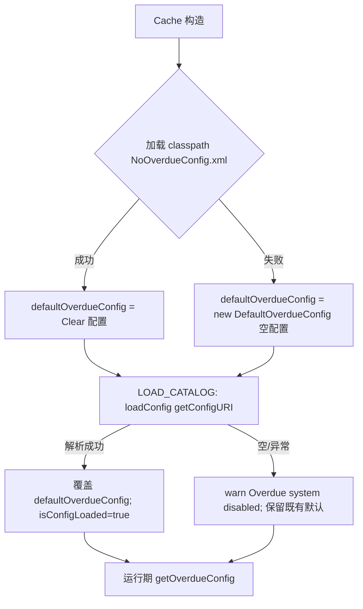
```mermaid
flowchart TD
  A[Cache 构造] --> B{加载 classpath NoOverdueConfig.xml}
  B -- 成功 --> C[defaultOverdueConfig = Clear 配置]
  B -- 失败 --> D[defaultOverdueConfig = new DefaultOverdueConfig 空配置]
  C --> E[LOAD_CATALOG: loadConfig getConfigURI]
  D --> E
  E -- 解析成功 --> F[覆盖 defaultOverdueConfig; isConfigLoaded=true]
  E -- 空/异常 --> G[warn Overdue system disabled; 保留既有默认]
  F --> H[运行期 getOverdueConfig]
  G --> H
```

## WF-016 运行时查询账户当前逾期状态流程

- **类型**: 业务流程
- **同义词**: 查询逾期状态流程, 当前状态解析, runtime overdue state query, getOverdueStateFor flow, resolve current state
- **模块**: overdue
- **置信度**: 🟢 confirmed
- **溯源**: `overdue/src/main/java/org/killbill/billing/overdue/api/DefaultOverdueApi.java:91-99`, `overdue/src/main/java/org/killbill/billing/overdue/wrapper/OverdueWrapper.java:115-119`, `overdue/src/main/java/org/killbill/billing/overdue/config/DefaultOverdueStateSet.java:41-52`

**步骤**：
1. 客户端调用 `OverdueApi.getOverdueStateFor(accountId, tenantContext)`。
2. 以 accountId + tenant 构造 `InternalTenantContext`（`createInternalTenantContext` 的重载，填充 accountRecordId）。
3. `blockingInternalApi.getBlockingStateForService(accountId, BlockingStateType.ACCOUNT, "overdue-service", ctx)` 读取账户级 BlockingState。
4. `stateName = blockingState != null ? blockingState.getStateName() : OverdueWrapper.CLEAR_STATE_NAME`。
5. 读取该租户 `OverdueConfig` → `getOverdueStatesAccount()` → `states.findState(stateName)`。
6. 返回解析到的 `OverdueState`（携带该状态的 `name`、`externalMessage`、`blockChanges`、`disableEntitlement`、`subscriptionCancellationPolicy`、`isClearState`）。
**失败路径**：若持久化的 stateName 在当前配置中不存在（例如配置被改名/删除），且它不是保留名 → `findState` 抛 `OverdueApiException(CAT_NO_SUCH_OVERDUE_STATE, stateName)`。同一映射也被 `OverdueWrapper.refreshWithLock`/`clearWithLock` 使用，因此配置改名会让 refresh/clear 一并失败。

## WF-017 租户逾期配置上传与「延迟校验」流程

- **类型**: 业务流程
- **同义词**: 上传配置流程, 延迟校验, tenant config upload flow, deferred validation, OVERDUE_CONFIG
- **模块**: overdue
- **置信度**: 🟢 confirmed
- **溯源**: `overdue/src/main/java/org/killbill/billing/overdue/api/DefaultOverdueApi.java:66-89`, `overdue/src/main/java/org/killbill/billing/overdue/caching/OverdueCacheInvalidationCallback.java:39-43`, `overdue/src/main/java/org/killbill/billing/overdue/caching/DefaultOverdueConfigCache.java:115-132`

**步骤**：
1. 调用 `uploadOverdueConfig(String)` 或 `uploadOverdueConfig(OverdueConfig)`（后者先 `XMLWriter.writeXML`）。
2. 若租户键 `OVERDUE_CONFIG` 已有值 → `deleteTenantKey` 删除旧值。
3. `addTenantKeyValue("OVERDUE_CONFIG", overdueXML)` 写入新 XML（**不解析**）。
4. `overdueConfigCache.clearOverdueConfig(internalTenantContext)` 清除该租户缓存（内部租户 no-op）。
5. 另经 `TenantKey.OVERDUE_CONFIG` 的 `CacheInvalidationCallback`（`OverdueCacheInvalidationCallback.invalidateCache`）再次清除租户缓存。
6. **首次读取时**才由缓存加载器解析 XML；解析失败 → `OVERDUE_INVALID_FOR_TENANT`（上传时无感知）。
**异常语义**：`OverdueConfig` 对象序列化失败 → `OVERDUE_INVALID_FOR_TENANT`；`TenantApiException` → 包装为 `OverdueApiException`。

## WF-018 目录加载与校验流程

- **类型**: 业务流程
- **同义词**: 目录加载, 上传目录, catalog load, 目录校验, loadDefaultCatalog, upload catalog
- **模块**: catalog
- **置信度**: 🟢 confirmed
- **溯源**: `catalog/src/main/java/org/killbill/billing/catalog/io/VersionedCatalogLoader.java:78-161`, `catalog/src/main/java/org/killbill/billing/catalog/DefaultCatalogService.java:66-85`

**步骤**：

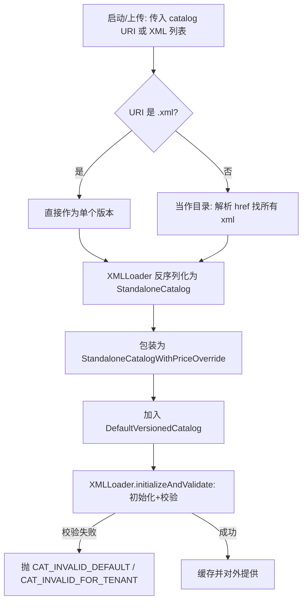
```mermaid
flowchart TD
  A[启动/上传: 传入 catalog URI 或 XML 列表] --> B{URI 是 .xml?}
  B -- 是 --> C[直接作为单个版本]
  B -- 否 --> D[当作目录: 解析 href 找所有 xml]
  C --> E[XMLLoader 反序列化为 StandaloneCatalog]
  D --> E
  E --> F[包装为 StandaloneCatalogWithPriceOverride]
  F --> G[加入 DefaultVersionedCatalog]
  G --> H[XMLLoader.initializeAndValidate: 初始化+校验]
  H -->|校验失败| I[抛 CAT_INVALID_DEFAULT / CAT_INVALID_FOR_TENANT]
  H -->|成功| J[缓存并对外提供]
```

**说明**：加载支持「单 XML 文件」或「包含多个 XML 链接的目录」；`filterTemplateCatalog=true` 时跳过模板目录（无产品/计划/币种）。

## WF-019 计划变更（换套餐/改价）决策流程

- **类型**: 业务流程
- **同义词**: 换套餐, 计划变更, 升级降级, plan change, upgrade downgrade, change plan
- **模块**: catalog
- **置信度**: 🟢 confirmed
- **溯源**: `catalog/src/main/java/org/killbill/billing/catalog/rules/DefaultPlanRules.java:143-185`

**步骤**：

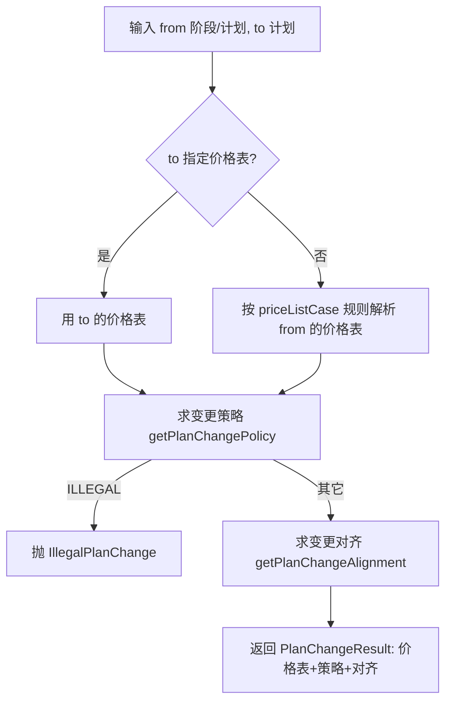
```mermaid
flowchart TD
  A[输入 from 阶段/计划, to 计划] --> B{to 指定价格表?}
  B -- 是 --> C[用 to 的价格表]
  B -- 否 --> D[按 priceListCase 规则解析 from 的价格表]
  C --> E[求变更策略 getPlanChangePolicy]
  D --> E
  E -->|ILLEGAL| F[抛 IllegalPlanChange]
  E -->|其它| G[求变更对齐 getPlanChangeAlignment]
  G --> H[返回 PlanChangeResult: 价格表+策略+对齐]
```

## WF-020 简化计划创建/更新流程

- **类型**: 业务流程
- **同义词**: 简化建计划, simple plan create, 添加计划, add plan, 添加产品
- **模块**: catalog
- **置信度**: 🟢 confirmed
- **溯源**: `catalog/src/main/java/org/killbill/billing/catalog/CatalogUpdater.java:119-213`

**步骤**：

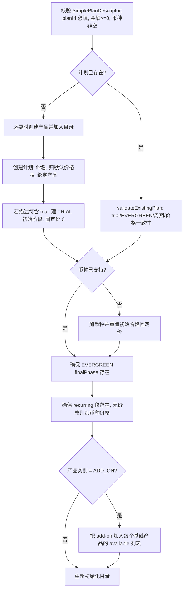
```mermaid
flowchart TD
  A[校验 SimplePlanDescriptor: planId 必填, 金额>=0, 币种非空] --> B{计划已存在?}
  B -- 否 --> C[必要时创建产品并加入目录]
  C --> D[创建计划: 命名, 归默认价格表, 绑定产品]
  D --> E[若描述符含 trial: 建 TRIAL 初始阶段, 固定价 0]
  B -- 是 --> F[validateExistingPlan: trial/EVERGREEN/周期/价格一致性]
  E --> G{币种已支持?}
  F --> G
  G -- 否 --> H[加币种并重置初始阶段固定价]
  G -- 是 --> I[确保 EVERGREEN finalPhase 存在]
  H --> I
  I --> J[确保 recurring 段存在, 无价格则加币种价格]
  J --> K{产品类别 = ADD_ON?}
  K -- 是 --> L[把 add-on 加入每个基础产品的 available 列表]
  K -- 否 --> M[重新初始化目录]
  L --> M
```

## WF-021 账户 BCD 计算流程

- **类型**: 业务流程
- **同义词**: 账户账单日计算, account BCD flow, 账单日确定
- **模块**: catalog
- **置信度**: 🟢 confirmed
- **溯源**: `junction/src/main/java/org/killbill/billing/junction/plumbing/billing/DefaultInternalBillingApi.java:220-274`

**步骤**：

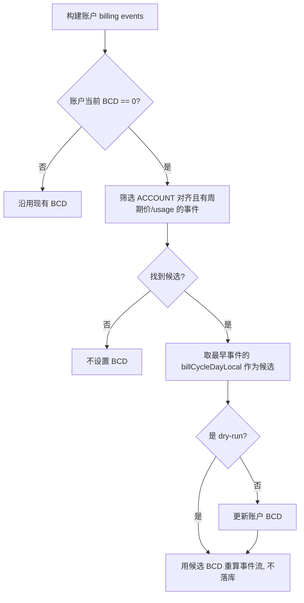
```mermaid
flowchart TD
  A[构建账户 billing events] --> B{账户当前 BCD == 0?}
  B -- 否 --> Z[沿用现有 BCD]
  B -- 是 --> C[筛选 ACCOUNT 对齐且有周期价/usage 的事件]
  C --> D{找到候选?}
  D -- 否 --> Z2[不设置 BCD]
  D -- 是 --> E[取最早事件的 billCycleDayLocal 作为候选]
  E --> F{是 dry-run?}
  F -- 是 --> G[用候选 BCD 重算事件流, 不落库]
  F -- 否 --> H[更新账户 BCD]
  H --> G
```

## WF-022 租户目录获取与默认目录回退流程

- **类型**: 业务流程
- **同义词**: 租户目录, 目录缓存, tenant catalog, catalog cache, default catalog, filterTemplateCatalog
- **模块**: catalog
- **置信度**: 🟢 confirmed
- **溯源**: `catalog/src/main/java/org/killbill/billing/catalog/caching/DefaultCatalogCache.java:93-143`, `catalog/src/main/java/org/killbill/billing/catalog/caching/DefaultCatalogCache.java:192-200`

**步骤**：

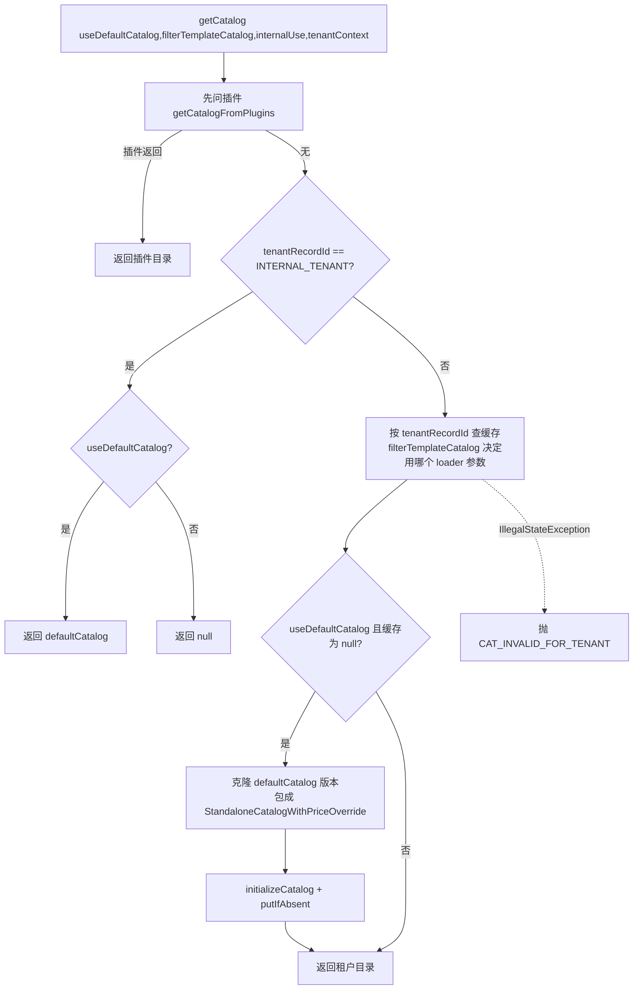
```mermaid
flowchart TD
  A[getCatalog useDefaultCatalog,filterTemplateCatalog,internalUse,tenantContext] --> B[先问插件 getCatalogFromPlugins]
  B -->|插件返回| Z[返回插件目录]
  B -->|无| C{tenantRecordId == INTERNAL_TENANT?}
  C -- 是 --> D{useDefaultCatalog?}
  D -- 是 --> E[返回 defaultCatalog]
  D -- 否 --> F[返回 null]
  C -- 否 --> G[按 tenantRecordId 查缓存<br/>filterTemplateCatalog 决定用哪个 loader 参数]
  G --> H{useDefaultCatalog 且缓存为 null?}
  H -- 是 --> I[克隆 defaultCatalog 版本<br/>包成 StandaloneCatalogWithPriceOverride]
  I --> J[initializeCatalog + putIfAbsent]
  J --> K[返回租户目录]
  H -- 否 --> K
  G -.->|IllegalStateException| L[抛 CAT_INVALID_FOR_TENANT]
```

**说明**：`internalUse=true` 时要求 context 带 accountRecordId（否则 `Preconditions` 失败）；`clearCatalog` 会移除该租户缓存（内部租户不缓存）。默认目录在构造时从 classpath 的 `EmptyCatalog.xml` 加载（失败则回退为空 VersionedCatalog 并记 error）。

## WF-023 插件目录优先与缓存一致性契约

- **类型**: 业务流程
- **同义词**: 插件目录, catalog plugin, 插件优先级, 缓存失效, latestCatalogUpdatedDate
- **模块**: catalog
- **置信度**: 🟢 confirmed
- **溯源**: `catalog/src/main/java/org/killbill/billing/catalog/caching/DefaultCatalogCache.java:145-190`

**步骤**：

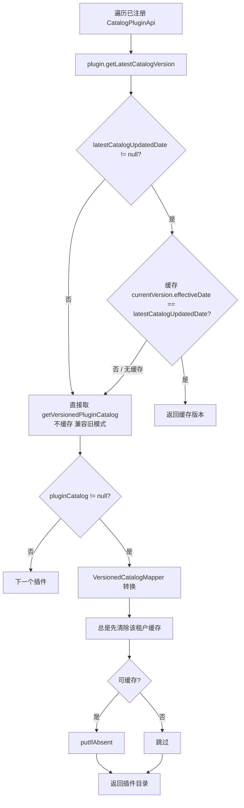
```mermaid
flowchart TD
  A[遍历已注册 CatalogPluginApi] --> B[plugin.getLatestCatalogVersion]
  B --> C{latestCatalogUpdatedDate != null?}
  C -- 否 --> G[直接取 getVersionedPluginCatalog<br/>不缓存 兼容旧模式]
  C -- 是 --> D{缓存 currentVersion.effectiveDate == latestCatalogUpdatedDate?}
  D -- 是 --> E[返回缓存版本]
  D -- 否 / 无缓存 --> G
  G --> F{pluginCatalog != null?}
  F -- 否 --> A2[下一个插件]
  F -- 是 --> H[VersionedCatalogMapper 转换]
  H --> I[总是先清除该租户缓存]
  I --> J{可缓存?}
  J -- 是 --> K[putIfAbsent]
  J -- 否 --> L[跳过]
  K --> M[返回插件目录]
  L --> M
```

**契约（源码注释）**：插件返回的 `latestCatalogUpdatedDate` 应与 VersionedCatalog 的 effectiveDate 一致；若为 null 则绕过缓存；第一个返回非空目录的插件胜出。

## WF-024 价格覆盖计划的查找与回退

- **类型**: 业务流程
- **同义词**: 覆盖计划查找, price override lookup, overridden plan, maybeGetOverriddenPlan, 歧义计划名
- **模块**: catalog
- **置信度**: 🟢 confirmed
- **溯源**: `catalog/src/main/java/org/killbill/billing/catalog/StandaloneCatalogWithPriceOverride.java:80-142`

**步骤**：

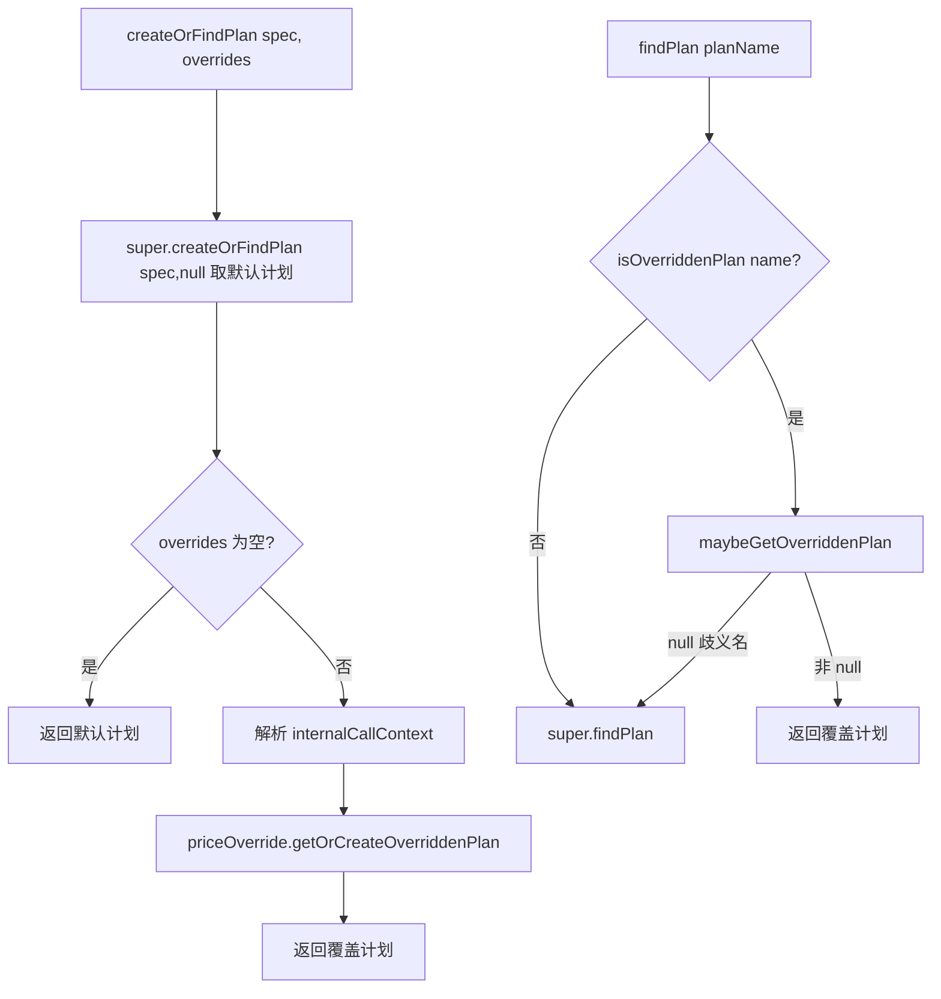
```mermaid
flowchart TD
  A[createOrFindPlan spec, overrides] --> B[super.createOrFindPlan spec,null 取默认计划]
  B --> C{overrides 为空?}
  C -- 是 --> D[返回默认计划]
  C -- 否 --> E[解析 internalCallContext]
  E --> F[priceOverride.getOrCreateOverriddenPlan]
  F --> G[返回覆盖计划]

  H[findPlan planName] --> I{isOverriddenPlan name?}
  I -- 否 --> L[super.findPlan]
  I -- 是 --> J[maybeGetOverriddenPlan]
  J -->|非 null| M[返回覆盖计划]
  J -->|null 歧义名| L
```

**歧义容错**：`maybeGetOverriddenPlan` 捕获 RuntimeException，若其 `getCause().getCause()` 是 `CatalogApiException(CAT_NO_SUCH_PLAN)` 则返回 null（视为计划名歧义，见 issue #842），随后回退到默认计划查找。`findPhase` 采用相同策略。

<!-- === CARDS END === -->

<!-- module: catalog | supplement cards: 45 | extracted_at: 2026-09-17 -->

## WF-025 发票支付流程（控制插件驱动）

- **类型**: 业务流程
- **同义词**: 发票扣款流程, 自动支付流程, invoice payment flow, purchase flow, 支付控制流程
- **模块**: payment
- **置信度**: 🟢 confirmed
- **溯源**: `payment/src/main/java/org/killbill/billing/payment/invoice/InvoicePaymentControlPluginApi.java:130-310`, `payment/src/main/java/org/killbill/billing/payment/invoice/InvoicePaymentControlPluginApi.java:341-436`

**参与方**：账单系统（触发）、支付控制插件（__INVOICE_PAYMENT_CONTROL_PLUGIN__）、支付插件（网关）、发票模块。

**步骤**：
1. `priorCall`：校验交易类型为 PURCHASE/REFUND/CHARGEBACK/CREDIT；
2. 对 PURCHASE 执行 `getPluginPurchaseResult`：校验发票 COMMITTED → 校验父账户委托 → 计算金额 → 校验 AUTO_PAY_OFF → 校验默认支付方式 → 检查是否存在 UNKNOWN 交易 → `recordPaymentAttemptInit` 预写一条 attempt；
3. 调用支付插件执行实际扣款；
4. 成功 → `onSuccessCall`：对 PURCHASE 调 `invoiceApi.recordPaymentAttemptCompletion` 把支付结果写入发票；
5. 失败 → `onFailureCall`：对 PURCHASE 以 0 金额记录 `INIT` 状态，并计算 `nextRetryDate` 决定是否重试。

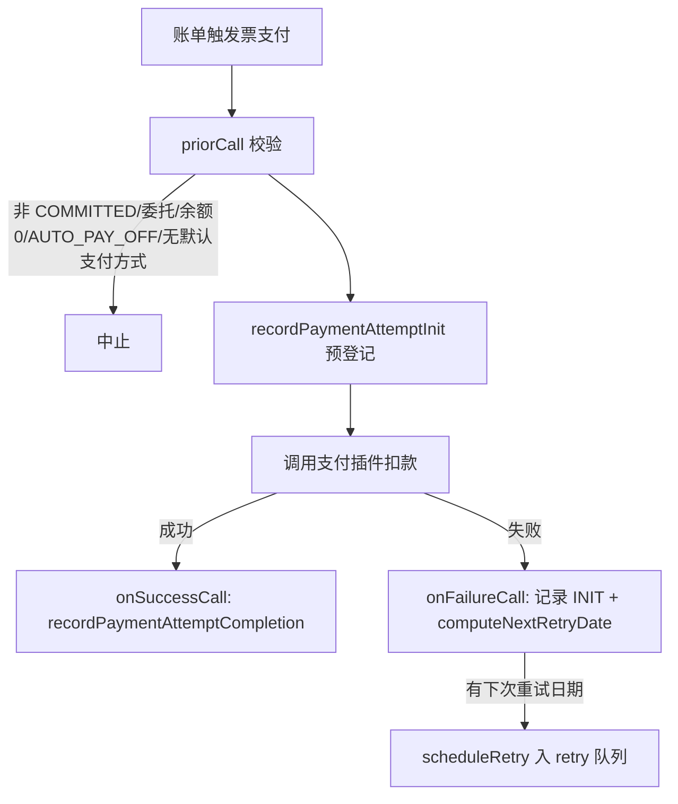
```mermaid
flowchart TD
  A[账单触发票支付] --> B[priorCall 校验]
  B -->|非 COMMITTED/委托/余额0/AUTO_PAY_OFF/无默认支付方式| Z[中止]
  B --> C[recordPaymentAttemptInit 预登记]
  C --> D[调用支付插件扣款]
  D -->|成功| E[onSuccessCall: recordPaymentAttemptCompletion]
  D -->|失败| F[onFailureCall: 记录 INIT + computeNextRetryDate]
  F -->|有下次重试日期| G[scheduleRetry 入 retry 队列]
```

## WF-026 退款流程

- **类型**: 业务流程
- **同义词**: 退款流程, 退钱, 部分退款流程, refund flow, refund process
- **模块**: payment
- **置信度**: 🟢 confirmed
- **溯源**: `payment/src/main/java/org/killbill/billing/payment/invoice/InvoicePaymentControlPluginApi.java:202-207`, `payment/src/main/java/org/killbill/billing/payment/invoice/InvoicePaymentControlPluginApi.java:438-478`, `payment/src/main/java/org/killbill/billing/payment/api/DefaultInvoicePaymentApi.java:93-119`

**步骤**：
1. 调用方通过 `createRefundForInvoicePayment` 指定是否调整发票项（`isAdjusted`）及调整明细（`adjustments`）；
2. 组装插件属性 `IPCD_REFUND_WITH_ADJUSTMENTS` 与 `IPCD_REFUND_IDS_AMOUNTS`；
3. `priorCall`→`getPluginRefundResult` 计算可退金额（见 BR-236），金额为 0 且为 API 支付则中止；
4. 若需调整发票项，先 `validateInvoiceItemAdjustments` 校验；
5. 调用支付插件退款；
6. 成功 → `onSuccessCall` 调 `invoiceApi.recordRefund`。**退款不重试**（onFailureCall 中 REFUND 分支不设置重试日期）。

## WF-027 拒付(Chargeback)流程

- **类型**: 业务流程
- **同义词**: 拒付流程, 退单, 银行拒付, chargeback flow, dispute
- **模块**: payment
- **置信度**: 🟢 confirmed
- **溯源**: `payment/src/main/java/org/killbill/billing/payment/invoice/InvoicePaymentControlPluginApi.java:209-232`, `payment/src/main/java/org/killbill/billing/payment/invoice/InvoicePaymentControlPluginApi.java:298-304`

**步骤**：
1. CHARGEBACK 的 priorCall 直接返回允许（`DefaultPriorPaymentControlResult(false, amount)`），不做发票前置校验；
2. 成功后 `onSuccessCall` 调 `invoiceApi.recordChargeback`；**不支持部分拒付**（若已存在 chargeback 记录则跳过）；
3. 失败则 `onFailureCall` 调 `recordChargebackReversal` 冲销该拒付。

## WF-028 Janitor 修复未完成支付流程

- **类型**: 业务流程
- **同义词**: 支付巡检流程, 修复未完成支付, janitor flow, incomplete payment repair, PENDING 修复
- **模块**: payment
- **置信度**: 🟢 confirmed
- **溯源**: `payment/src/main/java/org/killbill/billing/payment/core/janitor/IncompletePaymentTransactionTask.java:136-222`, `payment/src/main/java/org/killbill/billing/payment/core/janitor/IncompletePaymentAttemptTask.java:378-418`, `payment/src/main/java/org/killbill/billing/payment/core/janitor/Janitor.java:98-111`

**参与方**：Janitor 定时调度器、交易侧任务（IncompletePaymentTransactionTask）、尝试侧任务（IncompletePaymentAttemptTask）、支付插件、通知队列（janitor）。

**步骤**：
1. Janitor 启动后按 `org.killbill.payment.janitor.rate`（默认 1h）周期调度 `incompletePaymentAttemptTask`；
2. 对 PENDING/UNKNOWN 交易，向支付插件 `getPaymentInfo` 回查最新状态；
3. 用插件状态计算新的 TransactionStatus 与 PaymentState（PENDING→pending state，SUCCESS→success state，PAYMENT_FAILURE→failure state，PLUGIN_FAILURE→errored state，UNKNOWN→跳过）；
4. 若状态确实变化则"Repairing..."写回（`processPaymentInfoPlugin`），否则按 3 的重试时间表插入新的通知（`JanitorNotificationKey`，attemptNumber+1）；
5. attempt 侧若交易变为非 UNKNOWN，则重跑控制状态机 completion 使 attempt 进入终态。

## WF-029 失败支付的重试执行流程（retry 队列 → 控制状态机）

- **类型**: 业务流程
- **同义词**: 重试流程, 重试队列, retry queue, 重新扣款, retry payment transaction, OP_RETRY
- **模块**: payment
- **置信度**: 🟢 confirmed
- **溯源**: `payment/src/main/java/org/killbill/billing/payment/retry/BaseRetryService.java:70-97`, `payment/src/main/java/org/killbill/billing/payment/retry/DefaultRetryService.java:43-64`, `payment/src/main/java/org/killbill/billing/payment/core/PluginControlPaymentProcessor.java:283-374`, `payment/src/main/java/org/killbill/billing/payment/core/sm/control/DefaultControlCompleted.java:56-80`

**参与方**：NotificationQueue（`retry` 队列）、`DefaultRetryService`、`PluginControlPaymentProcessor`、控制状态机（`PAYMENT_RETRY`）、支付插件、发票控制插件。

**步骤**：
1. 失败时 `DefaultControlCompleted` 把 attempt 置为 `RETRIED` 并以 `ObjectType.PAYMENT_ATTEMPT` 调用 `retryServiceScheduler.scheduleRetry(..., attempt.getTenantRecordId(), controlPluginNames, retryDate)`（`payment/src/main/java/org/killbill/billing/payment/core/sm/control/DefaultControlCompleted.java:76-79`）；
2. retry 队列到点触发 `NotificationQueueHandler`，构造 `CallOrigin.INTERNAL + UserType.SYSTEM`、调用方名 `payment-service-retry` 的内部上下文（`payment/src/main/java/org/killbill/billing/payment/retry/BaseRetryService.java:79-82`）；
3. 执行 `DefaultRetryService.retryPaymentTransaction(attemptId, pluginNames, ctx)` → 委托 `PluginControlPaymentProcessor.retryPaymentTransaction`；
4. 处理器按 attemptId 取回 attempt，反查对应的 payment（可能为 null，首次重试时 payment 尚未创建），用 `paymentControlStateMachineHelper.getState(attempt.getStateName())` 从 attempt 当前态（INIT 或 RETRIED）续跑 `pluginControlledPaymentAutomatonRunner.run(state, isApiPayment=false, ...)`；
5. **新交易的金额 = attempt.amount**（注释明确"该值驱动重试金额"），并复用 attempt 的 `transactionExternalKey`、`paymentExternalKey`、paymentControlPluginNames；
6. 从返回 Payment 的交易里按 `transactionExternalKey` 反查新交易，写日志；
7. **锁失败**：若 `PaymentApiException` 的 cause 是 `LockFailedException` → 抛 `QueueRetryException`，按 `paymentConfig.getRescheduleIntervalOnLock()` 重新排队（`payment/src/main/java/org/killbill/billing/payment/core/PluginControlPaymentProcessor.java:343-345`）。

**注意**：重试走的是**控制状态机**（`PAYMENT_RETRY` / OP_RETRY），不是支付交易状态机；交易状态机由底层 `PaymentProcessor` 再驱动。

## WF-030 Janitor 的两个任务与 attempt 扫描收尾

- **类型**: 业务流程
- **同义词**: janitor 任务, attempt 收尾, incomplete attempt, INIT 扫描, attempt completion, 支付尝试修复
- **模块**: payment
- **置信度**: 🟢 confirmed
- **溯源**: `payment/src/main/java/org/killbill/billing/payment/core/janitor/Janitor.java:75-111`, `payment/src/main/java/org/killbill/billing/payment/core/janitor/IncompletePaymentAttemptTask.java:81`, `payment/src/main/java/org/killbill/billing/payment/core/janitor/IncompletePaymentAttemptTask.java:196-203`, `payment/src/main/java/org/killbill/billing/payment/core/janitor/IncompletePaymentAttemptTask.java:209-294`, `payment/src/main/java/org/killbill/billing/payment/core/janitor/IncompletePaymentAttemptTask.java:420-423`

**参与方**：`Janitor` 调度器、`IncompletePaymentTransactionTask`（交易侧）、`IncompletePaymentAttemptTask`（尝试侧）、Janitor 通知队列、支付插件。

**步骤**：
1. `Janitor.initialize` 建通知队列 `janitor`（服务名=`payment-service`），`start` 时 `scheduleAtFixedRate(incompletePaymentAttemptTask, period, period, unit)`，周期 = `org.killbill.payment.janitor.rate`（默认 `1h`）；
2. `IncompletePaymentAttemptTask.run()` 通过 `getItemsForIteration()` 扫描**跨租户**处于重试状态机初始态 `INIT`、且 `created_date < now - org.killbill.payment.janitor.attempts.delay`（默认 `12h`）的 attempt，单次最多 `MAX_ATTEMPTS_PER_ITERATIONS = 1000` 条；
3. 对每条 attempt 按 `transactionExternalKey` 找交易（按 `attempt_id` 过滤）：
   - **无交易** → attempt 直接置 `ABORTED`，结束；
   - **交易为 UNKNOWN** → 跳过（交给交易侧 Janitor），返回 false；
   - **交易已终态** → 调用 `pluginControlledPaymentAutomatonRunner.completeRun(paymentStateContext)` 只重跑控制状态机的 completion 回调（success/failure），把 attempt 推进到 SUCCESS / RETRIED。
4. 交易侧 Janitor（`IncompletePaymentTransactionTask`）同时按通知队列回查 PENDING/UNKNOWN 交易（见 BR-259/BR-261）。

**注意**：两个任务职责分离——**交易侧**收敛 `payment_transactions` 状态；**尝试侧**收敛 `payment_attempts` 状态机。attempt 只有在对应交易不是 UNKNOWN 时才能被收尾。

## WF-031 发票支付的两阶段提交防重复

- **类型**: 业务流程
- **同义词**: 两阶段提交, 防重复扣款, recordPaymentAttemptInit, two-phase commit, 预登记, 双扣风险
- **模块**: payment
- **置信度**: 🟢 confirmed
- **溯源**: `payment/src/main/java/org/killbill/billing/payment/invoice/InvoicePaymentControlPluginApi.java:410-424`, `payment/src/main/java/org/killbill/billing/payment/invoice/InvoicePaymentControlPluginApi.java:273-290`, `payment/src/main/java/org/killbill/billing/payment/invoice/InvoicePaymentControlPluginApi.java:665-708`

**参与方**：账单侧（InvoicePayment 记录）、控制插件、支付插件。

**步骤**：
1. 真正调用支付插件前，`getPluginPurchaseResult` 调用 `invoiceApi.recordPaymentAttemptInit(invoiceId, amount, currency, currency, paymentId, attemptId, transactionExternalKey, createdDate)`，**先写一条 `InvoicePaymentStatus.INIT`（成功=false）的 ATTEMPT 记录**（代码注释：two-phase commit，防止"支付已发生但 onSuccessCall 未回调"导致的双扣）；
2. 调用支付插件完成扣款；
3. `onSuccessCall` → `recordPaymentAttemptCompletion(...)` 把该 ATTEMPT 更新为最终状态（SUCCESS/PENDING）；
4. `onFailureCall` → 以 `amount=ZERO`、状态 `INIT` 调 `recordPaymentAttemptCompletion` 收尾失败尝试。

**重复保护**：`checkForIncompleteInvoicePaymentAndRepair` 在每次支付前扫描发票上"非 SUCCESS 的 ATTEMPT"，若其 `paymentCookieId`（=transactionExternalKey）对应存在 `TransactionStatus.SUCCESS` 的交易，则把发票支付补记为 `SUCCESS`（金额/币种取该成功交易）。

## WF-032 PENDING 支付被通知"状态已变化"的处理流程

- **类型**: 业务流程
- **同义词**: pending 通知, notify pending, 状态变更通知, notifyPendingPaymentOfStateChanged, 待确认支付确认
- **模块**: payment
- **置信度**: 🟢 confirmed
- **溯源**: `payment/src/main/java/org/killbill/billing/payment/core/PaymentProcessor.java:145-157`, `payment/src/main/java/org/killbill/billing/payment/core/PluginControlPaymentProcessor.java:212-244`, `payment/src/main/java/org/killbill/billing/payment/core/PaymentControlAwareRefresher.java:62-74`

**参与方**：外部通知方（如网关回调）、`PaymentProcessor` / `PluginControlPaymentProcessor`、控制插件、交易状态机。

**步骤**：
1. 外部通过 `notifyPendingPaymentOfStateChanged(account, transactionId, isSuccess, ...)` 告知某 PENDING 交易已出结果；
2. 校验交易状态必须为 `PENDING`，否则抛 `PAYMENT_NO_SUCH_SUCCESS_PAYMENT`；
3. `overridePluginResult = isSuccess ? OperationResult.SUCCESS : OperationResult.FAILURE`，以 `runJanitor=false` 执行 `performOperation` 重跑交易状态机；
4. 若走控制插件：`PluginControlPaymentProcessor.notifyPendingPaymentOfStateChanged` 按 `paymentTransactionId` 找到关联 attempt（匹配 `attempt.transactionId == transactionId`），反序列化 attempt 的插件属性，以 `ControlOperation.NOTIFICATION_OF_STATE_CHANGE` 运行控制状态机，让控制插件收到结果回调。

**含义**：这是把"插件异步返回 PENDING 后由外部确认"的路径——控制插件通过 `NOTIFICATION_OF_STATE_CHANGE` 分支被再次调用。

## WF-033 记录（提交）用量流程

- **类型**: 业务流程
- **同义词**: 记录用量, 上报用量, 提交用量, 录入用量, record usage, submit usage, upload usage
- **模块**: usage
- **置信度**: 🟢 confirmed
- **溯源**: `usage/src/main/java/org/killbill/billing/usage/api/user/DefaultUsageUserApi.java:71-92`, `jaxrs/src/main/java/org/killbill/billing/jaxrs/resources/UsageResource.java:104-148`

**参与者**：调用方（REST/内部 API）、用量模块（`DefaultUsageUserApi`）、DAO（`DefaultRolledUpUsageDao`）、`rolled_up_usage` 表。

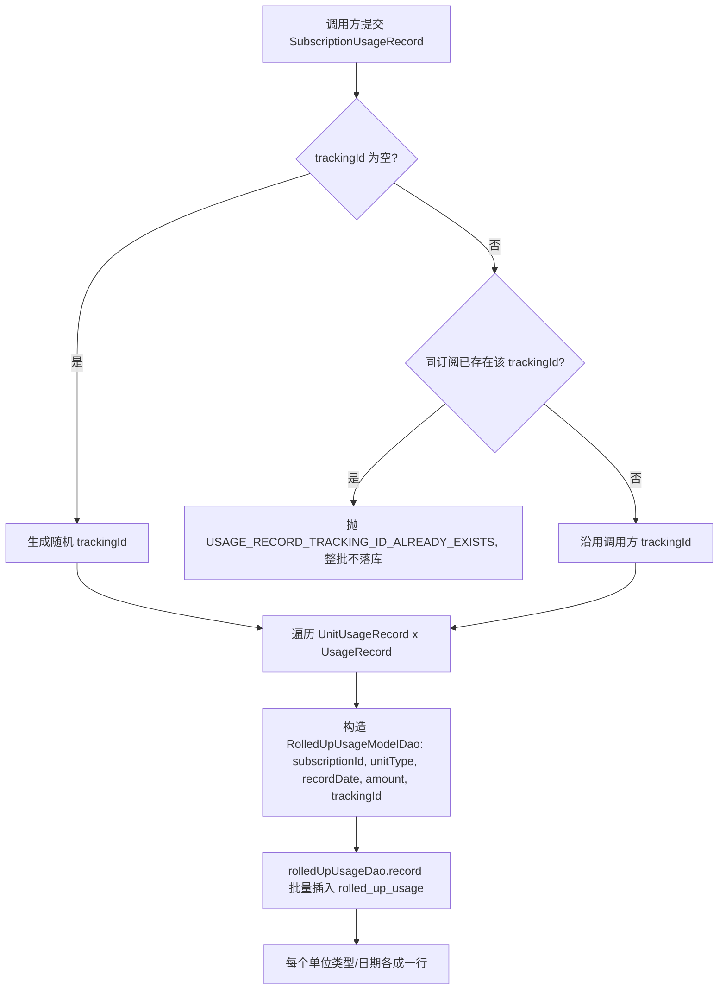
```mermaid
flowchart TD
  A[调用方提交 SubscriptionUsageRecord] --> B{trackingId 为空?}
  B -- 是 --> C[生成随机 trackingId]
  B -- 否 --> D{同订阅已存在该 trackingId?}
  D -- 是 --> E[抛 USAGE_RECORD_TRACKING_ID_ALREADY_EXISTS, 整批不落库]
  D -- 否 --> F[沿用调用方 trackingId]
  C --> G[遍历 UnitUsageRecord x UsageRecord]
  F --> G
  G --> H[构造 RolledUpUsageModelDao: subscriptionId, unitType, recordDate, amount, trackingId]
  H --> I[rolledUpUsageDao.record 批量插入 rolled_up_usage]
  I --> J[每个单位类型/日期各成一行]
```

**API 前置校验**（REST）：必填校验（BR-296）→ 订阅存在性与退订日期校验（BR-297）→ 构造 CallContext 后调用 `recordRolledUpUsage`，成功返回 201 CREATED。

---

## WF-034 查询订阅单一单位类型用量

- **类型**: 业务流程
- **同义词**: 查询用量, 获取用量, 查订阅用量, get usage, query usage, usage for unit type
- **模块**: usage
- **置信度**: 🟢 confirmed
- **溯源**: `usage/src/main/java/org/killbill/billing/usage/api/user/DefaultUsageUserApi.java:94-108`, `jaxrs/src/main/java/org/killbill/billing/jaxrs/resources/UsageResource.java:160-185`

**参与者**：调用方、`DefaultUsageUserApi`、`UsagePluginApi`（可能）、`RolledUpUsageDao`、`rolled_up_usage` 表。

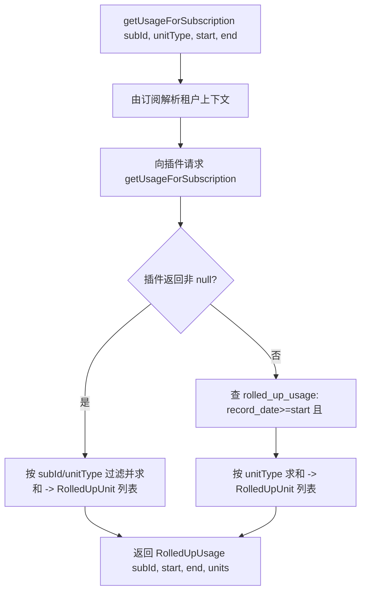
```mermaid
flowchart TD
  A[getUsageForSubscription subId, unitType, start, end] --> B[由订阅解析租户上下文]
  B --> C[向插件请求 getUsageForSubscription]
  C --> D{插件返回非 null?}
  D -- 是 --> E[按 subId/unitType 过滤并求和 -> RolledUpUnit 列表]
  D -- 否 --> F[查 rolled_up_usage: record_date>=start 且 <end 且 unit_type=unitType]
  F --> G[按 unitType 求和 -> RolledUpUnit 列表]
  E --> H[返回 RolledUpUsage subId, start, end, units]
  G --> H
```

**REST**：`GET /usages/{subscriptionId}/{unitType}?startDate=&endDate=`；缺少 start/end 返回 400。

---

## WF-035 查询订阅全部用量（按转换时间分段）

- **类型**: 业务流程
- **同义词**: 查询所有用量, 分段查询用量, 按转换时间, get all usage, usage by transition times, 时间段用量
- **模块**: usage
- **置信度**: 🟢 confirmed
- **溯源**: `usage/src/main/java/org/killbill/billing/usage/api/user/DefaultUsageUserApi.java:110-134`, `jaxrs/src/main/java/org/killbill/billing/jaxrs/resources/UsageResource.java:187-214`

**参与者**：调用方、`DefaultUsageUserApi`、插件（可能）、DAO。

```mermaid
flowchart TD
  A[getAllUsageForSubscription subId, transitionTimes] --> B[prevDate = null]
  B --> C[遍历每个 curDate]
  C --> D{prevDate 非 null?}
  D -- 否 --> E[prevDate = curDate, 继续下一个]
  D -- 是 --> F[查询区间 prevDate, curDate 的用量 (插件优先/否则查库)]
  F --> G[加入 RolledUpUsage 结果列表]
  G --> H[prevDate = curDate]
  H --> C
  C --> I[返回 N-1 个区间的 RolledUpUsage]
```

**要点**：N 个转换时间产生 **N-1** 个区间结果（第一个时间点只作为起点）。REST 当前只传 `[startDate, endDate]` 两个时间点，故只取第 0 个结果（注释："The current JAXRS API only allows to look for one transition"）。插件分支此时传 `unitType=null`，故汇总所有单位类型。

---

## WF-036 开票侧拉取账户原始用量

- **类型**: 业务流程
- **同义词**: 开票拉取用量, 用量计费取数, invoicing usage fetch, raw usage for invoicing, 用量开票流程
- **模块**: usage
- **置信度**: 🟢 confirmed
- **溯源**: `usage/src/main/java/org/killbill/billing/usage/api/svcs/DefaultInternalUserApi.java:63-84`, `invoice/src/main/java/org/killbill/billing/invoice/usage/RawUsageOptimizer.java:77-98`

**参与者**：开票引擎（`RawUsageOptimizer`）、`InternalUserApi`、插件（可能）、DAO、`rolled_up_usage` 表。

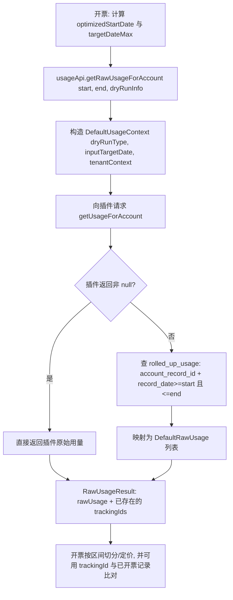
```mermaid
flowchart TD
  A[开票: 计算 optimizedStartDate 与 targetDateMax] --> B[usageApi.getRawUsageForAccount start, end, dryRunInfo]
  B --> C[构造 DefaultUsageContext dryRunType, inputTargetDate, tenantContext]
  C --> D[向插件请求 getUsageForAccount]
  D --> E{插件返回非 null?}
  E -- 是 --> F[直接返回插件原始用量]
  E -- 否 --> G[查 rolled_up_usage: account_record_id + record_date>=start 且 <=end]
  G --> H[映射为 DefaultRawUsage 列表]
  F --> I[RawUsageResult: rawUsage + 已存在的 trackingIds]
  H --> I
  I --> J[开票按区间切分/定价, 并可用 trackingId 与已开票记录比对]
```

**要点**：入参 `dryRunInfo` 会决定 `UsageContext` 的 dry-run 类型与目标日期；`getRawUsageForAccount` 用右闭区间（BR-286）。开票侧还会用 `invoiceDao.getTrackingsByDateRange` 取已存在的 trackingIds 做去重/补开处理。

---

## WF-037 用量开票端到端流程（in-arrear）

- **类型**: 业务流程
- **同义词**: 用量开票流程, 用量计费流程, usage invoicing, UsageInvoiceItemGenerator, in-arrear 开票, 计费用量
- **模块**: usage
- **置信度**: 🟢 confirmed
- **溯源**: `invoice/src/main/java/org/killbill/billing/invoice/generator/UsageInvoiceItemGenerator.java:90-219`, `invoice/src/main/java/org/killbill/billing/invoice/generator/UsageInvoiceItemGenerator.java:221-244`

**参与者**：开票引擎（`DefaultInvoiceGenerator` → `UsageInvoiceItemGenerator`）、`RawUsageOptimizer`、`SubscriptionUsageInArrear`、`ContiguousIntervalUsageInArrear` 子类、usage 模块 `InternalUserApi`、`InvoiceDao`、目录（catalog）。

```mermaid
flowchart TD
  A[DefaultInvoiceGenerator 调用 generateItems] --> B[按订阅分组 billing events, 仅保留含 IN_ARREAR usage 的订阅]
  B --> C[计算 minBillingEventDate]
  C --> D[RawUsageOptimizer.getOptimizedStartDate 得 optimizedUsageStartDate]
  D --> E[为每个订阅构造 SubscriptionUsageInArrear, 切分计费区间]
  E --> F[构造 USAGE_TRANSITIONS 插件属性 transitionTimesMap]
  F --> G[RawUsageOptimizer.getInArrearUsage: getRawUsageForAccount + 已开票 trackingIds]
  G --> H[每个 SubscriptionUsageInArrear.computeMissingUsageInvoiceItems]
  H --> I[每个区间 getRolledUpUsage: 按转换时间切分并聚合用量]
  I --> J[getToBeBilledUsageDetails: CAPACITY/ CONSUMABLE 定价]
  J --> K[冲抵已开票 / 按档扣减, 生成 UsageInvoiceItem]
  K --> L[汇总 items + 新 trackingIds + 下次通知日期]
```

**要点**：只处理 `IN_ARREAR` usage（BR-314）；`optimizedUsageStartDate` 由回溯窗口决定（BR-312）；每个订阅的用量先按复合键排序（BR-309）。

---

## WF-038 区间切分与原始用量消费

- **类型**: 业务流程
- **同义词**: 区间切分, 用量区间聚合, raw usage consumption, interval rolling, 转换时间切分, 消费用量
- **模块**: usage
- **置信度**: 🟢 confirmed
- **溯源**: `invoice/src/main/java/org/killbill/billing/invoice/usage/ContiguousIntervalUsageInArrear.java:389-514`

**参与者**：`ContiguousIntervalUsageInArrear#getRolledUpUsage`、转换时间列表、已排序的 `RawUsageRecord`。

```mermaid
flowchart TD
  A[输入: 该订阅已排序原始用量 + transitionTimes] --> B{有原始用量?}
  B -- 否 --> Z[返回空 RolledUpUsage 列表]
  B -- 是 --> C[跳过早于第一个转换点的记录]
  C --> D{剩余全在最后转换点之后?}
  D -- 是 --> Z
  D -- 否 --> E[遍历每对相邻转换点 prev, cur]
  E --> F[为每个单位类型初始化 amount=0]
  F --> G[消费落在 prev <= date < cur 的记录]
  G --> H[按 usageType 聚合: CAPACITY 取 max / CONSUMABLE 求和]
  H --> I[登记该记录的 TrackingRecordId]
  I --> J{单位类型在目录已见集合内?}
  J -- 否 --> K{parkAccountsWithUnknownUsage?}
  K -- 是 --> K2[抛异常 park 账户]
  K -- 否 --> K3[warn + 移除该单位类型 trackingId]
  J -- 是 --> L{属于本 usage 段单位集合?}
  L -- 是 --> M[加入 RolledUpUnit]
  L -- 否 --> N[安全忽略]
  M --> O[构造 DefaultRolledUpUsageWithMetadata start,end,目录生效日]
```

**要点**：区间为 `[prev, cur)`；退订当日用量可被纳入（BR-306 相关特殊分支）；无任何用量时走 `getEmptyRolledUpUsage` 构造 $0 区间（BR-313）。

---

## WF-039 CAPACITY 定价流程（档位选择 + 金额）

- **类型**: 业务流程
- **同义词**: 容量定价流程, capacity pricing flow, 选档流程, 峰值计费
- **模块**: usage
- **置信度**: 🟢 confirmed
- **溯源**: `invoice/src/main/java/org/killbill/billing/invoice/usage/ContiguousIntervalCapacityUsageInArrear.java:114-153`

```mermaid
flowchart TD
  A[输入: 区间 RolledUpUnit 列表 每单位一个峰值] --> B[取 usage 全部 tiers]
  B --> C[按顺序取下一档 tierNum++]
  C --> D[读该档 recurringPrice]
  D --> E[对每个单位: 取该档同名 limit]
  E --> F{limit 存在?}
  F -- 否 --> F2[checkState 失败: 目录缺该单位 limit]
  F -- 是 --> G{max != -1 且 峰值 > max?}
  G -- 是 --> H[本档不满足 complies=false, 试下一档]
  G -- 否 --> I[记录该单位明细 tier/unit/price/峰值]
  H --> C
  I --> J{所有单位都满足?}
  J -- 否 --> C
  J -- 是 --> K{所有单位量 <= 0?}
  K -- 是 --> L[amount = 0 支持 $0]
  K -- 否 --> M[amount = 本档 recurringPrice]
  C --> N[遍历完仍无档: checkState 失败 目录配置错误]
```

---

## WF-040 CONSUMABLE 定价流程（ALL_TIERS / TOP_TIER 分叉）

- **类型**: 业务流程
- **同义词**: 消费型定价流程, consumable pricing flow, 分块计费, 分档计费流程
- **模块**: usage
- **置信度**: 🟢 confirmed
- **溯源**: `invoice/src/main/java/org/killbill/billing/invoice/usage/ContiguousIntervalConsumableUsageInArrear.java:199-299`

```mermaid
flowchart TD
  A[输入: 区间用量 units 按单位类型] --> B[取该单位在各档的 tieredBlock 列表]
  B --> C{tierBlockPolicy?}
  C -- ALL_TIERS --> D[逐档: tmp=ceil(remaining/size)]
  D --> E{max != -1 且 tmp > max?}
  E -- 是 --> F[本档用满 max 块, remaining -= max*size]
  E -- 否 --> G[本档用 tmp 块, remaining = 0]
  F --> H[amount += price * 本档块数]
  G --> H
  H --> I[若有历史用量: 本档块数减历史同档量, 缺失则断言失败/放宽]
  I --> J[生成每档明细 amount=tierPrice*quantity]
  C -- TOP_TIER --> K[累减剩余找到命中档 targetTier]
  K --> L[nbBlocks = ceil(总units / targetTier.size)]
  L --> M[amount = targetTier.price * nbBlocks, 单档明细]
  J --> N[UsageConsumableInArrearAggregate amount=Σ各档]
  M --> N
  N --> O[冲抵已开票: 见 BR-305/BR-306]
```

---
