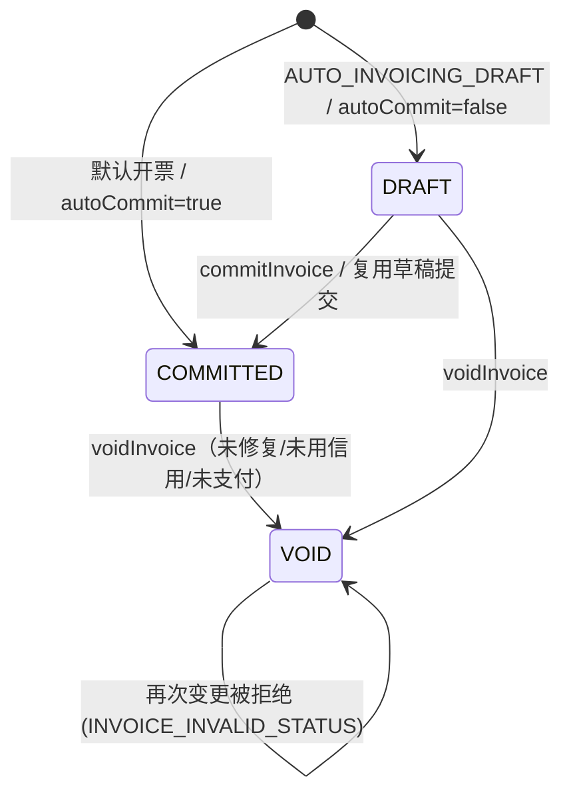
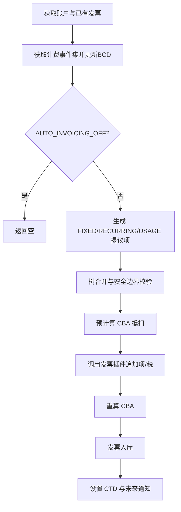

# 模块：invoice

> 目标代码根：`benchmark/killbill`；模块目录：`invoice/src/main/java/org/killbill/billing/invoice/`。

### 模块概述

Kill Bill 发票模块负责根据订阅计费事件生成发票、计算金额与按比例计费、管理账户信用余额(CBA)、处理调账/退款/作废/核销、用量后付计费，以及父子账户合并开票。

### 业务能力清单

- `BR-001` 发票状态由自动开票草稿标记决定（业务规则，🟢 confirmed）
- `BR-002` 目标日期的边界与对齐（业务规则，🟢 confirmed）
- `BR-003` 周期费用金额与跳过条件（业务规则，🟢 confirmed）
- `BR-004` 首期与末段按比例计费（业务规则，🟢 confirmed）
- `BR-005` 固定费用项生成与去重（业务规则，🟢 confirmed）
- `BR-006` 发票生成安全边界（业务规则，🟢 confirmed）
- `BR-007` 全额修复项在后续计算中剔除（业务规则，🟢 confirmed）
- `BR-008` 发票余额公式与计费金额构成（业务规则，🟢 confirmed）
- `BR-009` 已付与已退款金额口径（业务规则，🟢 confirmed）
- `BR-010` 发票余额为 0 与信用发票判定（业务规则，🟢 confirmed）
- `BR-011` 负余额发票生成账户信用（业务规则，🟢 confirmed）
- `BR-012` 正余额已提交发票消耗账户信用（业务规则，🟢 confirmed）
- `BR-013` 账户信用按发票日期顺序分配 & 未付发票定义（业务规则，🟢 confirmed）
- `BR-014` 行项目调账与退款校验（业务规则，🟢 confirmed）
- `BR-015` 作废发票与状态变更限制（业务规则，🟢 confirmed）
- `BR-016` 贷项/外部费用金额与币种校验（业务规则，🟢 confirmed）
- `BR-017` 账户余额计算排除与扣减规则（业务规则，🟢 confirmed）
- `BR-018` DRAFT→COMMITTED 迁移与发票编号（业务规则，🟢 confirmed）
- `BR-019` AUTO_INVOICING_OFF 对开票的影响（业务规则，🟢 confirmed）
- `BR-020` 用量后付金额 = 应计 − 已计（及负额处理）（业务规则，🟢 confirmed）
- `BR-021` 用量分档与向上取整（业务规则，🟢 confirmed）
- `BR-022` 用量明细模式逐档出账 & 仅后付用量（业务规则，🟢 confirmed）
- `BR-023` 子发票忽略规则与子发票金额（业务规则，🟢 confirmed）
- `BR-024` 父发票汇总项更新与调账传播（业务规则，🟢 confirmed）
- `BR-025` 用量零额项可被禁用（业务规则，🟢 confirmed）
- `ENT-001` 发票（业务实体，🟢 confirmed）
- `ENT-002` 发票行项目（业务实体，🟢 confirmed）
- `ENT-003` 发票支付（业务实体，🟢 confirmed）
- `ENT-004` 账户余额与账户 CBA（业务实体，🟢 confirmed）
- `ENT-005` 父发票—子发票关系（业务实体，🟢 confirmed）
- `ENT-006` 用量追踪号（业务实体，🟢 confirmed）
- `ROLE-001` 发票模块的权限控制位置（角色/权限，🔴 gap）
- `SM-001` 发票状态机（状态机，🟢 confirmed）
- `TERM-001` 发票（术语，🟢 confirmed）
- `TERM-002` 发票行项目（术语，🟢 confirmed）
- `TERM-003` 行项目类型（术语，🟢 confirmed）
- `TERM-004` 账户信用余额（CBA）（术语，🟢 confirmed）
- `TERM-005` 账单日与计费周期（术语，🟢 confirmed）
- `TERM-006` 按比例计费（术语，🟢 confirmed）
- `TERM-007` 试算（Dry Run）（术语，🟢 confirmed）
- `TERM-008` 用量计费（后付，in arrear）（术语，🟢 confirmed）
- `TERM-009` 发票核销（Write-off）（术语，🟢 confirmed）
- `TERM-010` 迁移发票（术语，🟢 confirmed）
- `TERM-011` 父子账户合并开票（术语，🟢 confirmed）
- `TERM-012` 目标日期（术语，🟢 confirmed）
- `TERM-013` 修复（术语，🟢 confirmed）
- `WF-001` 账单运行（发票生成）流程（业务流程，🟢 confirmed）
- `WF-002` 发票提交（COMMIT）（业务流程，🟢 confirmed）
- `WF-003` 发票作废（VOID）（业务流程，🟢 confirmed）
- `WF-004` 贷项签发与账户信用抵扣（业务流程，🟢 confirmed）
- `WF-005` 外部费用/税额录入与行项目调账退款（业务流程，🟢 confirmed）

### 知识卡

## BR-001 发票状态由自动开票草稿标记决定

- **类型**: 业务规则
- **同义词**: 草稿发票, 自动开票草稿, 发票状态, auto invoice draft, draft invoice
- **模块**: invoice
- **置信度**: 🟢 confirmed
- **溯源**: `invoice/src/main/java/org/killbill/billing/invoice/generator/DefaultInvoiceGenerator.java:90-94`

**规则**：生成时若计费事件集 `isAccountAutoInvoiceDraft()` 为真，新发票状态为 `DRAFT`，否则 `COMMITTED`。

## BR-002 目标日期的边界与对齐

- **类型**: 业务规则
- **同义词**: 未来开票上限, 目标日期对齐, target date limit, target date adjustment
- **模块**: invoice
- **置信度**: 🟢 confirmed
- **溯源**: `invoice/src/main/java/org/killbill/billing/invoice/generator/DefaultInvoiceGenerator.java:120-154`

**规则**：目标日期与今日相隔月数 > `getNumberOfMonthsInFuture()` 时抛 `INVOICE_TARGET_DATE_TOO_FAR_IN_THE_FUTURE`；随后将目标日期抬升到已有发票中含 RECURRING/USAGE 项的最大目标日期。

## BR-003 周期费用金额与跳过条件

- **类型**: 业务规则
- **同义词**: 周期费用计算, 续订金额, recurring amount, 单价乘数量, NO_BILLING_PERIOD
- **模块**: invoice
- **置信度**: 🟢 confirmed
- **溯源**: `invoice/src/main/java/org/killbill/billing/invoice/generator/FixedAndRecurringInvoiceItemGenerator.java:238-278`

**公式**：`rateXQuantity = recurringPrice × quantity`；`amount = numberOfCycles × rateXQuantity`（`KillBillMoney.of` 按币种取整）。

**例外**：`BillingPeriod == NO_BILLING_PERIOD` 或 `recurringPrice == null` 时不生成周期项。

## BR-004 首期与末段按比例计费

- **类型**: 业务规则
- **同义词**: 首期按比例, 尾段按比例, leading proration, trailing proration, 按天折算
- **模块**: invoice
- **置信度**: 🟢 confirmed
- **溯源**: `invoice/src/main/java/org/killbill/billing/invoice/generator/FixedAndRecurringInvoiceItemGenerator.java:367-423`, `invoice/src/main/java/org/killbill/billing/invoice/generator/InvoiceDateUtils.java:53-99`

**规则**：首个计费周期日晚于开始日时，对 `[startDate, firstBillingCycleDate)` 按比例收费；有效结束日晚于最后计费周期日时，对 `[lastBillingCycleDate, effectiveEndDate)` 按比例收费；比例 > 0 才生成项。

**分母**：`fixedDaysInMonth != 0` 时以固定天数作分母并跨月扣除 `(当月最大日 − 固定天数)`；`daysBetween <= 0` 时比例为 0。

## BR-005 固定费用项生成与去重

- **类型**: 业务规则
- **同义词**: 固定费用, 一次性费用, 试用期费用, fixed price item, fixed item dedupe
- **模块**: invoice
- **置信度**: 🟢 confirmed
- **溯源**: `invoice/src/main/java/org/killbill/billing/invoice/generator/FixedAndRecurringInvoiceItemGenerator.java:194-221`, `invoice/src/main/java/org/killbill/billing/invoice/generator/FixedAndRecurringInvoiceItemGenerator.java:427-472`

**规则**：金额 = `fixedPrice × quantity`；无周期费用且阶段类型非 `EVERGREEN` 时结束日取下一 PHASE 事件日，否则按阶段时长推算。若上一条固定项与当前事件“同订阅且同一生效日”，不重复加入。

## BR-006 发票生成安全边界

- **类型**: 业务规则
- **同义词**: 安全边界, 重复项防护, safety bound, max daily items
- **模块**: invoice
- **置信度**: 🟢 confirmed
- **溯源**: `invoice/src/main/java/org/killbill/billing/invoice/generator/FixedAndRecurringInvoiceItemGenerator.java:476-548`

**规则**：
- 同一 subscriptionId + startDate 出现 > 1 个 FIXED 项 → 抛异常；
- 同一 subscriptionId + 相同 [startDate,endDate] 出现 > 1 个 RECURRING 项 → 抛异常；
- 每日每订阅项数超过 `getMaxDailyNumberOfItemsSafetyBound()`（`-1` 表示关闭）→ 抛异常。

## BR-007 全额修复项在后续计算中剔除

- **类型**: 业务规则
- **同义词**: 修复闭包, 全额冲销, fully repaired, repair closure
- **模块**: invoice
- **置信度**: 🟢 confirmed
- **溯源**: `invoice/src/main/java/org/killbill/billing/invoice/generator/InvoicePruner.java:88-116`, `invoice/src/main/java/org/killbill/billing/invoice/generator/InvoicePruner.java:156-232`

**规则**：当某 RECURRING 项的修复额等于原额时，该原项及共同关联修复项整体视为“已修复”，后续不参与树合并（避免区间重叠）。

**例外**：目标原项金额为 $0 时直接忽略。

## BR-008 发票余额公式与计费金额构成

- **类型**: 业务规则
- **同义词**: 发票余额, 未付金额, raw balance, charged amount
- **模块**: invoice
- **置信度**: 🟢 confirmed
- **溯源**: `invoice/src/main/java/org/killbill/billing/invoice/calculator/InvoiceCalculatorUtils.java:96-110`, `invoice/src/main/java/org/killbill/billing/invoice/calculator/InvoiceCalculatorUtils.java:157-190`

**公式**：`balance = (charged + credited + adjustedForAccountCredit) − (amountPaid + amountRefunded)`。

**charged** = Σ(charge 类项) + Σ(发票级 CREDIT_ADJ，且非独立信用发票) + Σ(ITEM_ADJ/REPAIR_ADJ) + Σ(PARENT_SUMMARY)。`originalChargedAmount` 仅累计创建日等于发票创建日的 charge 项。

## BR-009 已付与已退款金额口径

- **类型**: 业务规则
- **同义词**: 已付金额, 已退款金额, 拒付, amount paid, refunded amount, chargeback
- **模块**: invoice
- **置信度**: 🟢 confirmed
- **溯源**: `invoice/src/main/java/org/killbill/billing/invoice/calculator/InvoiceCalculatorUtils.java:207-242`

**规则**：仅 `status == SUCCESS` 的支付计入；`type == ATTEMPT` 计入已付，`type ∈ {REFUND, CHARGED_BACK}` 计入已退款。

## BR-010 发票余额为 0 与信用发票判定

- **类型**: 业务规则
- **同义词**: 零余额, 信用发票, 独立信用单, zero balance, credit invoice
- **模块**: invoice
- **置信度**: 🟢 confirmed
- **溯源**: `invoice/src/main/java/org/killbill/billing/invoice/model/DefaultInvoice.java:274-288`, `invoice/src/main/java/org/killbill/billing/invoice/calculator/InvoiceCalculatorUtils.java:39-70`

**规则**：发票被核销、是迁移发票、状态为 DRAFT/VOID、或父发票余额为 0 时 `getBalance()` 返回 0。

**信用发票**：仅当发票恰含 2 项、一项为 CREDIT_ADJ 且另一项为 CBA_ADJ（同发票、金额互为相反数）时成立；否则 CREDIT_ADJ 作为发票级信用调整参与 charged。

## BR-011 负余额发票生成账户信用

- **类型**: 业务规则
- **同义词**: 生成信用, 负余额转信用, credit generation, CBA generation
- **模块**: invoice
- **置信度**: 🟢 confirmed
- **溯源**: `invoice/src/main/java/org/killbill/billing/invoice/dao/CBADao.java:67-76`, `invoice/src/main/java/org/killbill/billing/invoice/dao/CBADao.java:243-251`

**规则**：发票余额 < 0 时生成 CBA_ADJ 项，金额为余额的相反数（正信用）。

## BR-012 正余额已提交发票消耗账户信用

- **类型**: 业务规则
- **同义词**: 使用信用, 抵扣欠款, use credit, consume CBA
- **模块**: invoice
- **置信度**: 🟢 confirmed
- **溯源**: `invoice/src/main/java/org/killbill/billing/invoice/dao/CBADao.java:77-92`

**规则**：仅当余额 > 0 且状态 `COMMITTED`、无 `PENDING` 的 ATTEMPT 支付、且未核销时才可抵扣；抵扣额 = min(accountCBA, balance)；accountCBA ≤ 0 不处理。

## BR-013 账户信用按发票日期顺序分配 & 未付发票定义

- **类型**: 业务规则
- **同义词**: 信用分配, 抵扣顺序, 未付发票, CBA distribution, unpaid invoice
- **模块**: invoice
- **置信度**: 🟢 confirmed
- **溯源**: `invoice/src/main/java/org/killbill/billing/invoice/dao/CBADao.java:186-218`, `invoice/src/main/java/org/killbill/billing/invoice/dao/InvoiceDaoHelper.java:189-203`

**规则**：将账户 CBA 依次分配到按 `invoiceDate` 升序的未付发票，直到用尽；每分配一次更新剩余 CBA。

**未付发票**：状态 `COMMITTED`、原始余额 ≥ 1、未核销；父发票存在时以父发票余额判断。

## BR-014 行项目调账与退款校验

- **类型**: 业务规则
- **同义词**: 调账上限, 退款上限, refund validation, item adjustment limit
- **模块**: invoice
- **置信度**: 🟢 confirmed
- **溯源**: `invoice/src/main/java/org/killbill/billing/invoice/dao/InvoiceDaoHelper.java:112-174`

**规则**：
- 可调账上限 = 原项金额 − 已调整/已修复金额；超出抛 `INVOICE_ITEM_ADJUSTMENT_AMOUNT_INVALID`；请求为 null 时按上限全额调账；
- 退款额 > 支付额抛 `REFUND_AMOUNT_TOO_HIGH`；未指定则默认支付全额；
- 若指定调账行项目，其金额之和必须 ≥ 退款额，否则抛 `REFUND_AMOUNT_DONT_MATCH_ITEMS_TO_ADJUST`。

## BR-015 作废发票与状态变更限制

- **类型**: 业务规则
- **同义词**: 作废发票, 撤销发票, void invoice, invalid status
- **模块**: invoice
- **置信度**: 🟢 confirmed
- **溯源**: `invoice/src/main/java/org/killbill/billing/invoice/api/user/DefaultInvoiceUserApi.java:753-788`, `invoice/src/main/java/org/killbill/billing/invoice/api/user/DefaultInvoiceUserApi.java:815-825`, `invoice/src/main/java/org/killbill/billing/invoice/dao/DefaultInvoiceDao.java:1387-1391`

**规则**：已提交发票作废前，已修复 → `CAN_NOT_VOID_INVOICE_THAT_IS_REPAIRED`；其生成的正 CBA 已被使用 → `CAN_NOT_VOID_INVOICE_THAT_GENERATED_USED_CREDIT`；已支付(净额≠0) → `CAN_NOT_VOID_INVOICE_THAT_IS_PAID`。状态变更为相同状态或源状态已 VOID → `INVOICE_INVALID_STATUS`。

## BR-016 贷项/外部费用金额与币种校验

- **类型**: 业务规则
- **同义词**: 贷项校验, 外部费用校验, credit validation, external charge validation
- **模块**: invoice
- **置信度**: 🟢 confirmed
- **溯源**: `invoice/src/main/java/org/killbill/billing/invoice/api/user/DefaultInvoiceUserApi.java:560-572`, `invoice/src/main/java/org/killbill/billing/invoice/api/user/DefaultInvoiceUserApi.java:633-647`

**规则**：外部费用/贷项金额为 null 或 < 0 时分别抛 `EXTERNAL_CHARGE_AMOUNT_INVALID`/`CREDIT_AMOUNT_INVALID`；币种与账户币种不一致抛 `CURRENCY_INVALID`；贷项金额入库取负。

## BR-017 账户余额计算排除与扣减规则

- **类型**: 业务规则
- **同义词**: 账户余额计算, account balance rule
- **模块**: invoice
- **置信度**: 🟢 confirmed
- **溯源**: `invoice/src/main/java/org/killbill/billing/invoice/dao/DefaultInvoiceDao.java:734-758`

**规则**：跳过 DRAFT/VOID 发票；核销发票或“父发票余额为 0”的子发票余额按 0 计；最终 `accountBalance − Σ CBA`。

## BR-018 DRAFT→COMMITTED 迁移与发票编号

- **类型**: 业务规则
- **同义词**: 草稿转正式, 提交草稿, 发票编号, draft to committed, invoice number
- **模块**: invoice
- **置信度**: 🟢 confirmed
- **溯源**: `invoice/src/main/java/org/killbill/billing/invoice/dao/DefaultInvoiceDao.java:513-535`, `invoice/src/main/java/org/killbill/billing/invoice/dao/DefaultInvoiceDao.java:507-512`, `invoice/src/main/java/org/killbill/billing/invoice/InvoiceDispatcher.java:786-802`

**规则**：落盘发票已存在时仅允许 `COMMITTED` 覆盖 `DRAFT`，目标日期只允许向后更新。发票编号从插件属性 `INVOICE_SEQUENCE_NUMBER` 读入并作为同名字段持久化，读取时回填。

## BR-019 AUTO_INVOICING_OFF 对开票的影响

- **类型**: 业务规则
- **同义词**: 关闭自动开票, 暂停开票, AUTO_INVOICING_OFF, 标签移除重跑
- **模块**: invoice
- **置信度**: 🟢 confirmed
- **溯源**: `invoice/src/main/java/org/killbill/billing/invoice/generator/FixedAndRecurringInvoiceItemGenerator.java:108-110`, `invoice/src/main/java/org/killbill/billing/invoice/InvoiceDispatcher.java:387-389`, `invoice/src/main/java/org/killbill/billing/invoice/InvoiceTagHandler.java:72-81`

**规则**：订阅级 `AUTO_INVOICING_OFF` 使该订阅的项被排除；账户级 `isAccountAutoInvoiceOff()` 在非 API 路径直接返回空；账户上的 `AUTO_INVOICING_OFF` 标签被删除时触发重新生成未付发票。

## BR-020 用量后付金额 = 应计 − 已计（及负额处理）

- **类型**: 业务规则
- **同义词**: 用量差额, 增量计费, 用量负额, usage delta, negative usage
- **模块**: invoice
- **置信度**: 🟢 confirmed
- **溯源**: `invoice/src/main/java/org/killbill/billing/invoice/usage/ContiguousIntervalConsumableUsageInArrear.java:88-120`

**规则**：`TierBlockPolicy == ALL_TIERS` 且历史项均含明细时 `amountToBill = toBeBilledUsage`，否则 `= toBeBilledUsage − billedUsage`；仅当区间未计过费或差额 > 0 时生成项。差额 < 0 时，试算或 `isUsageMissingLenient` 为真则跳过，否则抛 `UNEXPECTED_ERROR`。

## BR-021 用量分档与向上取整

- **类型**: 业务规则
- **同义词**: 分档计费, 阶梯计费, all tiers, top tier, 向上取整, tier block
- **模块**: invoice
- **置信度**: 🟢 confirmed
- **溯源**: `invoice/src/main/java/org/killbill/billing/invoice/usage/ContiguousIntervalConsumableUsageInArrear.java:219-299`

**规则**：块数 = `ceil(remainingUnits / blockSize)`。
- `ALL_TIERS`：逐档消耗，超过档位 max 则消耗 max 块并进入下一档；第一档即使为 0 也生成条目（支持 $0 用量项）；已有历史用量按档位扣除。
- `TOP_TIER`：定位用量所在最高档，全部用量按该档单价与块大小计费。

## BR-022 用量明细模式逐档出账 & 仅后付用量

- **类型**: 业务规则
- **同义词**: 用量明细, 逐档出账, 仅后付用量, usage detail mode, in arrear only
- **模块**: invoice
- **置信度**: 🟢 confirmed
- **溯源**: `invoice/src/main/java/org/killbill/billing/invoice/usage/ContiguousIntervalConsumableUsageInArrear.java:103-118`, `invoice/src/main/java/org/killbill/billing/invoice/generator/UsageInvoiceItemGenerator.java:146-155`, `invoice/src/main/java/org/killbill/billing/invoice/generator/UsageInvoiceItemGenerator.java:262-274`

**规则**：`UsageDetailMode.DETAIL` 时每个 tier 明细生成一条 `UsageInvoiceItem`（含 quantity、tier rate、itemDetails JSON），否则整个聚合一条。仅当订阅存在 `BillingMode.IN_ARREAR` 用量时才计算；已有用量项只保留 catalog 中定义为 IN_ARREAR 的项。

## BR-023 子发票忽略规则与子发票金额

- **类型**: 业务规则
- **同义词**: 子发票忽略, 子发票金额, ignore child invoice, child invoice amount
- **模块**: invoice
- **置信度**: 🟢 confirmed
- **溯源**: `invoice/src/main/java/org/killbill/billing/invoice/InvoiceDispatcher.java:1407-1425`, `invoice/src/main/java/org/killbill/billing/invoice/calculator/InvoiceCalculatorUtils.java:112-131`

**规则**：子发票金额为负时忽略（作为信用留待下张）；> 0 纳入；= 0 时仅当含 FIXED 或 RECURRING 项才纳入。

**子发票金额**：无 charge 类项时返回贷项金额的相反数（用于从父项中扣减），否则返回 charged + credited + adjustedForAccountCredit。

## BR-024 父发票汇总项更新与调账传播

- **类型**: 业务规则
- **同义词**: 父发票汇总, 汇总项更新, parent summary, adjustment propagation
- **模块**: invoice
- **置信度**: 🟢 confirmed
- **溯源**: `invoice/src/main/java/org/killbill/billing/invoice/InvoiceDispatcher.java:1365-1404`, `invoice/src/main/java/org/killbill/billing/invoice/InvoiceDispatcher.java:1443-1500`

**规则**：父草稿发票已有该子账户 PARENT_SUMMARY 项时，累加子发票金额并更新该项，否则新增项。子发票产生 ITEM_ADJ 时，父发票已 COMMITTED 则新增 ITEM_ADJ 关联父汇总项，否则更新父汇总项金额；父发票余额为 0 时忽略调账。

## BR-025 用量零额项可被禁用

- **类型**: 业务规则
- **同义词**: 零额用量项, 去除零额, disable zero usage
- **模块**: invoice
- **置信度**: 🟢 confirmed
- **溯源**: `invoice/src/main/java/org/killbill/billing/invoice/generator/DefaultInvoiceGenerator.java:110-114`

**规则**：当 `isUsageZeroAmountDisabled` 为真时移除 $0 用量项（即使发票因此为空，仍可能需要设置 CTD）。

## ENT-001 发票

- **类型**: 业务实体
- **同义词**: 发票实体, 账单实体, invoice entity
- **模块**: invoice
- **置信度**: 🟢 confirmed
- **溯源**: `invoice/src/main/java/org/killbill/billing/invoice/model/DefaultInvoice.java:44-62`

**关系**：1 张发票 → N 个 `InvoiceItem`、N 个 `InvoicePayment`、N 个 trackingId；子发票 → 1 张父发票。

## ENT-002 发票行项目

- **类型**: 业务实体
- **同义词**: 行项目实体, invoice item entity
- **模块**: invoice
- **置信度**: 🟢 confirmed
- **溯源**: `invoice/src/main/java/org/killbill/billing/invoice/model/InvoiceItemFactory.java:54-126`

**关键字段**：`id`、`invoiceId`、`accountId`、`bundleId`、`subscriptionId`、`productName/planName/phaseName/usageName`、`startDate/endDate`、`amount`、`rate`、`currency`、`linkedItemId`、`quantity`、`itemDetails`。

## ENT-003 发票支付

- **类型**: 业务实体
- **同义词**: 发票支付, 支付记录, 收款记录, invoice payment, payment on invoice
- **模块**: invoice
- **置信度**: 🟢 confirmed
- **溯源**: `invoice/src/main/java/org/killbill/billing/invoice/calculator/InvoiceCalculatorUtils.java:207-242`

**关键字段**：`type`(ATTEMPT/REFUND/CHARGED_BACK)、`status`(SUCCESS/PENDING/…)、`amount`、`currency`/`processedCurrency`。仅 `SUCCESS` 参与金额统计。

## ENT-004 账户余额与账户 CBA

- **类型**: 业务实体
- **同义词**: 账户余额, 账户欠款, 账户信用, account balance, account CBA
- **模块**: invoice
- **置信度**: 🟢 confirmed
- **溯源**: `invoice/src/main/java/org/killbill/billing/invoice/dao/DefaultInvoiceDao.java:730-765`

**计算**：账户余额 = Σ(非 DRAFT/VOID、非核销、父余额非 0 的发票原始余额) − Σ(账户 CBA)。

## ENT-005 父发票—子发票关系

- **类型**: 业务实体
- **同义词**: 父子发票映射, 父发票关联, parent-child invoice, InvoiceParentChild
- **模块**: invoice
- **置信度**: 🟢 confirmed
- **溯源**: `invoice/src/main/java/org/killbill/billing/invoice/InvoiceDispatcher.java:1402-1404`, `invoice/src/main/java/org/killbill/billing/invoice/dao/InvoiceDaoHelper.java:497-519`

**约束**：一个子发票至多映射到一个父发票（`checkState(mappings.size() == 1)`）。

## ENT-006 用量追踪号

- **类型**: 业务实体
- **同义词**: 用量追踪ID, 计量追踪, tracking id, InvoiceTracking
- **模块**: invoice
- **置信度**: 🟢 confirmed
- **溯源**: `invoice/src/main/java/org/killbill/billing/invoice/InvoiceDispatcher.java:805-808`, `invoice/src/main/java/org/killbill/billing/invoice/dao/DefaultInvoiceDao.java:1404-1413`

**含义**：记录某段用量已被哪张发票结算，防止重复计费；发票作废时对应 trackingId 被停用。

## ROLE-001 发票模块的权限控制位置

- **类型**: 角色/权限
- **同义词**: 发票权限, 接口鉴权, invoice permissions, access control
- **模块**: invoice
- **置信度**: 🔴 gap
- **溯源**: `invoice/src/main/java/org/killbill/billing/invoice/InvoiceDispatcher.java:282-306`

**缺口**：invoice 模块内部**未发现** `@Secured`/`@PreAuthorize`/`@RequiresPermissions` 等权限注解（全仓库仅 util 测试类出现 `@RequiresPermissions`）。发票 API 的鉴权应由 jaxrs 层或外部安全模块承担，但本模块源码无法证实具体权限点，需人工确认。

<!-- module: invoice | cards: 46 | extracted_at: 2026-09-16T00:00:00Z -->

## SM-001 发票状态机

- **类型**: 状态机
- **同义词**: 发票状态, 发票状态流转, invoice status, DRAFT, COMMITTED, VOID
- **模块**: invoice
- **置信度**: 🟢 confirmed
- **溯源**: `invoice/src/main/java/org/killbill/billing/invoice/dao/DefaultInvoiceDao.java:513-535`, `invoice/src/main/java/org/killbill/billing/invoice/dao/DefaultInvoiceDao.java:1387-1391`, `invoice/src/main/java/org/killbill/billing/invoice/api/user/DefaultInvoiceUserApi.java:772-799`

**说明**：`InvoiceStatus` 枚举定义在外部 `killbill-api` 构件，DRAFT/COMMITTED/VOID 三态由本仓库上述代码使用与校验。

## TERM-001 发票

- **类型**: 术语
- **同义词**: 发票, 账单, 单据, 费用单, invoice, bill
- **模块**: invoice
- **置信度**: 🟢 confirmed
- **溯源**: `invoice/src/main/java/org/killbill/billing/invoice/model/DefaultInvoice.java:44-62`, `invoice/src/main/java/org/killbill/billing/invoice/generator/DefaultInvoiceGenerator.java:90-94`

**含义**：账户在目标日期前应收费用的汇总单，携带账户、发票日期、目标日期、币种、状态(DRAFT/COMMITTED/VOID)、行项目、支付、追踪号。

## TERM-002 发票行项目

- **类型**: 术语
- **同义词**: 发票行项目, 明细行, 收费项, 账单条目, invoice item, line item
- **模块**: invoice
- **置信度**: 🟢 confirmed
- **溯源**: `invoice/src/main/java/org/killbill/billing/invoice/model/InvoiceItemFactory.java:54-126`

**含义**：发票下的一条费用/抵扣明细，带类型、金额、起止服务期、关联订阅/套餐/阶段、`linkedItemId`（调账/修复指向原项）等。

## TERM-003 行项目类型

- **类型**: 术语
- **同义词**: 行项目类型, 费用类型, item type, invoice item type
- **模块**: invoice
- **置信度**: 🟢 confirmed
- **溯源**: `invoice/src/main/java/org/killbill/billing/invoice/calculator/InvoiceCalculatorUtils.java:73-94`, `invoice/src/main/java/org/killbill/billing/invoice/model/InvoiceItemFactory.java:91-124`

**含义**：`EXTERNAL_CHARGE`、`FIXED`、`RECURRING`、`USAGE`、`TAX`、`CBA_ADJ`、`CREDIT_ADJ`、`ITEM_ADJ`、`REPAIR_ADJ`、`PARENT_SUMMARY`。分类：收费类 = TAX/EXTERNAL_CHARGE/FIXED/USAGE/RECURRING；账户信用 = CBA_ADJ；行项目调整 = ITEM_ADJ/REPAIR_ADJ。

## TERM-004 账户信用余额（CBA）

- **类型**: 术语
- **同义词**: 账户余额抵扣, 信用余额, 抵扣余额, 账户贷方, 预存余额, CBA, credit balance, account credit
- **模块**: invoice
- **置信度**: 🟢 confirmed
- **溯源**: `invoice/src/main/java/org/killbill/billing/invoice/calculator/InvoiceCalculatorUtils.java:77-80`, `invoice/src/main/java/org/killbill/billing/invoice/dao/CBADao.java:56-97`

**含义**：账户级可抵扣余额，由 `CBA_ADJ` 累计。负余额发票**生成信用**（正 CBA），正余额已提交发票**消耗信用**（负 CBA）。

## TERM-005 账单日与计费周期

- **类型**: 术语
- **同义词**: 账单日, 计费日, BCD, bill cycle day, 计费周期, billing period
- **模块**: invoice
- **置信度**: 🟢 confirmed
- **溯源**: `invoice/src/main/java/org/killbill/billing/invoice/generator/FixedAndRecurringInvoiceItemGenerator.java:247-254`

**含义**：`billCycleDayLocal`(BCD) 决定订阅每月出账日；`BillingPeriod`(MONTHLY/ANNUAL 等) 决定周期长度；周期对齐由 `BillingIntervalDetail` 完成。

## TERM-006 按比例计费

- **类型**: 术语
- **同义词**: 按比例计费, 尾差, 按天折算, 分摊, proration, pro-ration
- **模块**: invoice
- **置信度**: 🟢 confirmed
- **溯源**: `invoice/src/main/java/org/killbill/billing/invoice/generator/InvoiceDateUtils.java:53-89`

**含义**：服务起止与完整计费周期不对齐时按天数比例计费；含首期按比例(leading)与末段按比例(trailing)。

## TERM-007 试算（Dry Run）

- **类型**: 术语
- **同义词**: 试算, 预演, 预览账单, 模拟开票, dry run, preview invoice, upcoming invoice
- **模块**: invoice
- **置信度**: 🟢 confirmed
- **溯源**: `invoice/src/main/java/org/killbill/billing/invoice/InvoiceDispatcher.java:362-374`

**含义**：`DryRunArguments`/`DryRunInfo` 驱动、不落盘的发票生成；类型含 `TARGET_DATE`/`UPCOMING_INVOICE`/`SUBSCRIPTION_ACTION`。

## TERM-008 用量计费（后付，in arrear）

- **类型**: 术语
- **同义词**: 用量计费, 按用量收费, 后付, 使用量账单, usage billing, usage in arrear, metered billing
- **模块**: invoice
- **置信度**: 🟢 confirmed
- **溯源**: `invoice/src/main/java/org/killbill/billing/invoice/generator/UsageInvoiceItemGenerator.java:146-155`, `invoice/src/main/java/org/killbill/billing/invoice/usage/ContiguousIntervalConsumableUsageInArrear.java:199-217`

**含义**：按订阅计量单位累计量计费；`BillingMode.IN_ARREAR` 表示周期结束后结算，`TierBlockPolicy` 决定分档(ALL_TIERS/TOP_TIER)。

## TERM-009 发票核销（Write-off）

- **类型**: 术语
- **同义词**: 核销, 坏账核销, 标记为坏账, write-off, writeoff, bad debt
- **模块**: invoice
- **置信度**: 🟢 confirmed
- **溯源**: `invoice/src/main/java/org/killbill/billing/invoice/dao/InvoiceDaoHelper.java:417-422`, `invoice/src/main/java/org/killbill/billing/invoice/dao/InvoiceDaoHelper.java:485-489`

**含义**：给发票打 `WRITTEN_OFF` 控制标签，声明不再计入余额；核销发票按 0 参与账户余额计算。

## TERM-010 迁移发票

- **类型**: 术语
- **同义词**: 迁移发票, 数据迁移账单, 历史账单导入, migration invoice
- **模块**: invoice
- **置信度**: 🟢 confirmed
- **溯源**: `invoice/src/main/java/org/killbill/billing/invoice/dao/InvoiceModelDaoHelper.java:33-46`

**含义**：`isMigrationInvoice()==true` 的发票，原始余额固定为 0。

## TERM-011 父子账户合并开票

- **类型**: 术语
- **同义词**: 父账户, 子账户, 合并开票, 汇总账单, 集团账单, parent invoice, consolidated invoicing, hierarchical billing
- **模块**: invoice
- **置信度**: 🟢 confirmed
- **溯源**: `invoice/src/main/java/org/killbill/billing/invoice/InvoiceDispatcher.java:1340-1405`

**含义**：子账户发票金额汇总到父账户的一张 `PARENT_SUMMARY` 草稿发票，由父账户统一支付。

## TERM-012 目标日期

- **类型**: 术语
- **同义词**: 目标日期, 计费截止日, 开票截止日, target date, targetDate
- **模块**: invoice
- **置信度**: 🟢 confirmed
- **溯源**: `invoice/src/main/java/org/killbill/billing/invoice/generator/DefaultInvoiceGenerator.java:120-154`

**含义**：本次开票计算的时间边界，仅对 `effectiveDate <= targetDate` 的事件出账；受“最远未来 N 个月”与已有发票目标日期约束。

## TERM-013 修复

- **类型**: 术语
- **同义词**: 修复, 冲销重开, 退订重算, repair, REPAIR_ADJ
- **模块**: invoice
- **置信度**: 🟢 confirmed
- **溯源**: `invoice/src/main/java/org/killbill/billing/invoice/generator/InvoicePruner.java:88-116`

**含义**：订阅变更/取消导致已开票周期项需冲减时，生成 `REPAIR_ADJ` 负项关联原 `RECURRING` 项；被全额修复的项在后续计算中剔除。

## WF-001 账单运行（发票生成）流程

- **类型**: 业务流程
- **同义词**: 账单运行流程, 发票生成流程, bill run flow, invoice generation flow
- **模块**: invoice
- **置信度**: 🟢 confirmed
- **溯源**: `invoice/src/main/java/org/killbill/billing/invoice/InvoiceDispatcher.java:670-856`

**参与者**：InvoiceDispatcher、InvoiceGenerator、InvoicePluginDispatcher、InvoiceDao、SubscriptionApi。

## WF-002 发票提交（COMMIT）

- **类型**: 业务流程
- **同义词**: 发票提交, 确认发票, commit invoice
- **模块**: invoice
- **置信度**: 🟢 confirmed
- **溯源**: `invoice/src/main/java/org/killbill/billing/invoice/api/user/DefaultInvoiceUserApi.java:689-708`, `invoice/src/main/java/org/killbill/billing/invoice/dao/DefaultInvoiceDao.java:1397-1402`

**步骤**：① 状态改为 `COMMITTED`；② 设置 charged-through dates(CTD)；③ 发 `DefaultInvoiceCreationEvent`；④ 事务内对账户 CBA 重新平衡。

## WF-003 发票作废（VOID）

- **类型**: 业务流程
- **同义词**: 发票作废流程, void invoice flow
- **模块**: invoice
- **置信度**: 🟢 confirmed
- **溯源**: `invoice/src/main/java/org/killbill/billing/invoice/api/user/DefaultInvoiceUserApi.java:772-799`, `invoice/src/main/java/org/killbill/billing/invoice/dao/DefaultInvoiceDao.java:1400-1414`

**步骤**：① 校验未修复、未使用生成贷项、未支付；② 状态改为 `VOID`；③ 重算账户 CBA；④ 发发票调整事件；⑤ 停用该发票的用量 trackingId。

## WF-004 贷项签发与账户信用抵扣

- **类型**: 业务流程
- **同义词**: 贷项流程, 信用抵扣流程, credit flow, CBA lifecycle
- **模块**: invoice
- **置信度**: 🟢 confirmed
- **溯源**: `invoice/src/main/java/org/killbill/billing/invoice/dao/CBADao.java:152-175`, `invoice/src/main/java/org/killbill/billing/invoice/api/user/DefaultInvoiceUserApi.java:710-731`

**步骤**：① 创建 CREDIT_ADJ（金额取负存储）；② CBA 计算按余额生成或消耗 CBA_ADJ；③ 遍历未付发票按发票日期顺序抵扣；④ 子账户正 CBA 可通过 `transferChildCreditToParent` 转给父账户。

## WF-005 外部费用/税额录入与行项目调账退款

- **类型**: 业务流程
- **同义词**: 外部费用流程, 手工收费, 调账流程, 退款流程, external charge, adjustment, refund
- **模块**: invoice
- **置信度**: 🟢 confirmed
- **溯源**: `invoice/src/main/java/org/killbill/billing/invoice/api/user/DefaultInvoiceUserApi.java:554-669`, `invoice/src/main/java/org/killbill/billing/invoice/api/user/DefaultInvoiceUserApi.java:404-424`, `invoice/src/main/java/org/killbill/billing/invoice/dao/InvoiceDaoHelper.java:215-240`

**步骤**：
1. 外部费用/税/贷项：校验金额为正、币种匹配；未指定发票时按 `autoCommit` 决定新发票状态，指定发票仅允许 DRAFT（COMMITTED 抛 `INVOICE_ALREADY_COMMITTED`，VOID 拒绝）；生成对应项后派发给发票插件入库。
2. 行项目调账：校验金额为正 → 计算可调账上限 → 生成 ITEM_ADJ（金额取负）关联原项 → 退款校验 → 重算 CBA。
