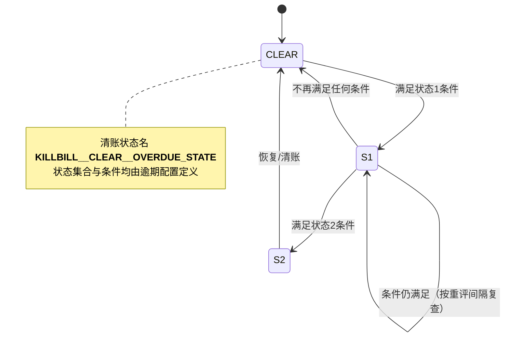
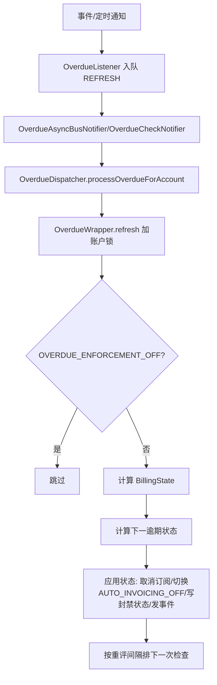

# 模块：overdue

> 目标代码根：`benchmark/killbill`；模块目录：`overdue/src/main/java/org/killbill/billing/overdue/`。

### 模块概述

Kill Bill 逾期模块负责按配置的逾期状态与条件评估账户欠费情况，应用封禁/禁用权益/取消订阅等副作用，并通过通知队列驱动定时或事件触发的重算。

### 业务能力清单

- `BR-026` 逾期条件之间为逻辑与（业务规则，🟢 confirmed）
- `BR-027` 欠费张数/总额阈值（业务规则，🟢 confirmed）
- `BR-028` 最早欠费时长与失败支付响应条件（业务规则，🟢 confirmed）
- `BR-029` 控制标签包含/排除条件（业务规则，🟢 confirmed）
- `BR-030` 逾期状态选择与清账回退（业务规则，🟢 confirmed）
- `BR-031` 重新评估间隔规则（业务规则，🟢 confirmed）
- `BR-032` OVERDUE_ENFORCEMENT_OFF 关闭逾期执行（业务规则，🟢 confirmed）
- `BR-033` 逾期状态到封禁状态的映射（业务规则，🟢 confirmed）
- `BR-034` 封禁计费时自动关闭开票（业务规则，🟢 confirmed）
- `BR-035` 逾期触发订阅取消（业务规则，🟢 confirmed）
- `BR-036` 支付委派给父账户时以父账户计费状态判定（业务规则，🟢 confirmed）
- `BR-037` 欠费发票排序与最早发票（业务规则，🟢 confirmed）
- `BR-038` 触发逾期重算的事件与通知优化（业务规则，🟢 confirmed）
- `BR-039` 计费状态快照的构造与限制（业务规则，🟡 inferred）
- `ENT-007` 逾期状态实体（业务实体，🟢 confirmed）
- `ENT-008` 逾期条件实体（业务实体，🟢 confirmed）
- `ENT-009` 逾期配置与账户状态集（业务实体，🟢 confirmed）
- `ENT-010` 计费状态（业务实体，🟢 confirmed）
- `ENT-011` 封禁状态（业务实体，🟢 confirmed）
- `ROLE-002` 逾期模块的权限控制位置（角色/权限，🔴 gap）
- `SM-002` 逾期状态机（状态机，🟢 confirmed）
- `TERM-014` 逾期状态（术语，🟢 confirmed）
- `TERM-015` 清账状态（术语，🟢 confirmed）
- `TERM-016` 逾期条件（术语，🟢 confirmed）
- `TERM-017` 逾期配置（术语，🟢 confirmed）
- `TERM-018` 计费状态（术语，🟢 confirmed）
- `TERM-019` 重新评估间隔（术语，🟢 confirmed）
- `TERM-020` 逾期取消策略与封禁标志（术语，🟢 confirmed）
- `TERM-021` 逾期相关控制标签（术语，🟢 confirmed）
- `TERM-022` 逾期通知队列（术语，🟢 confirmed）
- `WF-006` 逾期刷新流程（业务流程，🟢 confirmed）
- `WF-007` 逾期清账流程（业务流程，🟢 confirmed）
- `WF-008` 逾期配置上传（按租户）（业务流程，🟢 confirmed）

### 知识卡

## BR-026 逾期条件之间为逻辑与

- **类型**: 业务规则
- **同义词**: 条件与, 多条件组合, condition AND, all conditions
- **模块**: overdue
- **置信度**: 🟢 confirmed
- **溯源**: `overdue/src/main/java/org/killbill/billing/overdue/config/DefaultOverdueCondition.java:69-84`

**规则**：`evaluate` 对每个非空条件做与运算：仅当所有已配置条件同时满足才返回 true；未配置的条件不参与判定。

## BR-027 欠费张数/总额阈值

- **类型**: 业务规则
- **同义词**: 欠费张数阈值, 欠费金额阈值, unpaid invoices threshold, balance threshold
- **模块**: overdue
- **置信度**: 🟢 confirmed
- **溯源**: `overdue/src/main/java/org/killbill/billing/overdue/config/DefaultOverdueCondition.java:76-80`

**规则**：`numberOfUnpaidInvoicesEqualsOrExceeds` ≤ 实际欠费张数；`totalUnpaidInvoiceBalanceEqualsOrExceeds` ≤ 实际欠费总额，两者均满足才通过（各条件在 BR-001 的与逻辑中）。

## BR-028 最早欠费时长与失败支付响应条件

- **类型**: 业务规则
- **同义词**: 欠费时长, 逾期天数, 支付失败响应, days overdue, last failed payment
- **模块**: overdue
- **置信度**: 🟢 confirmed
- **溯源**: `overdue/src/main/java/org/killbill/billing/overdue/config/DefaultOverdueCondition.java:70-94`

**规则**：`unpaidInvoiceTriggerDate = 最早欠费发票日期 + timeSinceEarliestUnpaidInvoiceEqualsOrExceeds`（无日期则视为无欠费，条件不成立）；当该日期不晚于当前日期时满足。`responseForLastFailedPaymentIn` 要求实际 `PaymentResponse` 命中集合之一。

**例外 / 🟡**：`BillingStateCalculator` 目前将 `responseForLastFailedPayment` **硬编码**为 `INSUFFICIENT_FUNDS`（源码注释 `//TODO MDW`），见 BR-014 溯源；因此该条件的真实取值需人工确认。

## BR-029 控制标签包含/排除条件

- **类型**: 业务规则
- **同义词**: 标签包含, 标签排除, control tag inclusion, control tag exclusion
- **模块**: overdue
- **置信度**: 🟢 confirmed
- **溯源**: `overdue/src/main/java/org/killbill/billing/overdue/config/DefaultOverdueCondition.java:81-112`

**规则**：配置 `controlTagInclusion` 时要求账户标签含该控制标签；配置 `controlTagExclusion` 时要求账户标签不含该控制标签。

## BR-030 逾期状态选择与清账回退

- **类型**: 业务规则
- **同义词**: 状态选择, 首个匹配, 清账回退, state selection, clear fallback
- **模块**: overdue
- **置信度**: 🟢 confirmed
- **溯源**: `overdue/src/main/java/org/killbill/billing/overdue/config/DefaultOverdueStateSet.java:41-67`

**规则**：按配置顺序遍历状态，返回**第一个**条件成立的状态；若无任何条件成立则返回清账状态。`findState` 支持按名字查清账状态，找不到抛 `CAT_NO_SUCH_OVERDUE_STATE`。

## BR-031 重新评估间隔规则

- **类型**: 业务规则
- **同义词**: 重评间隔规则, 无间隔, reevaluation interval rule
- **模块**: overdue
- **置信度**: 🟢 confirmed
- **溯源**: `overdue/src/main/java/org/killbill/billing/overdue/config/DefaultOverdueStatesAccount.java:51-57`, `overdue/src/main/java/org/killbill/billing/overdue/config/DefaultOverdueState.java:119-125`, `overdue/src/main/java/org/killbill/billing/overdue/applicator/OverdueStateApplicator.java:160-174`

**规则**：`initialReevaluationInterval` 为 null、UNLIMITED 或 0 时返回 null；状态的 `autoReevaluationInterval` 若为 UNLIMITED/0 抛 `OVERDUE_NO_REEVALUATION_INTERVAL`，由 applicator 捕获并视为“无间隔则不再排下一次检查”。

## BR-032 OVERDUE_ENFORCEMENT_OFF 关闭逾期执行

- **类型**: 业务规则
- **同义词**: 关闭逾期执行, 逾期豁免, enforcement off
- **模块**: overdue
- **置信度**: 🟢 confirmed
- **溯源**: `overdue/src/main/java/org/killbill/billing/overdue/wrapper/OverdueWrapper.java:109-113`, `overdue/src/main/java/org/killbill/billing/overdue/applicator/OverdueStateApplicator.java:334-349`

**规则**：账户带 `OVERDUE_ENFORCEMENT_OFF` 标签时，`refreshWithLock` 直接返回，不做任何状态计算与应用。

## BR-033 逾期状态到封禁状态的映射

- **类型**: 业务规则
- **同义词**: 封禁映射, 封禁变更, 禁用权益, blocking mapping
- **模块**: overdue
- **置信度**: 🟢 confirmed
- **溯源**: `overdue/src/main/java/org/killbill/billing/overdue/applicator/OverdueStateApplicator.java:221-273`

**规则**：写入封禁状态时：`blockChanges = isBlockChanges() || isDisableEntitlementAndChangesBlocked()`；`blockEntitlement = isDisableEntitlementAndChangesBlocked()`；`blockBilling = isDisableEntitlementAndChangesBlocked()`。

**幂等**：若上一状态名与下一状态名相同，applicator 记为 no-op 直接返回。

## BR-034 封禁计费时自动关闭开票

- **类型**: 业务规则
- **同义词**: 封禁计费关开票, 避免多出信用, AUTO_INVOICING_OFF toggle
- **模块**: overdue
- **置信度**: 🟢 confirmed
- **溯源**: `overdue/src/main/java/org/killbill/billing/overdue/applicator/OverdueStateApplicator.java:176-183`, `overdue/src/main/java/org/killbill/billing/overdue/applicator/OverdueStateApplicator.java:237-261`

**规则**：当发生“从可计费 → 封禁计费”的转换时，给账户打 `AUTO_INVOICING_OFF`；发生“从封禁计费 → 可计费”的转换时移除该标签（避免产生多余信用）。

## BR-035 逾期触发订阅取消

- **类型**: 业务规则
- **同义词**: 逾期取消订阅, 强制退订, cancellation policy
- **模块**: overdue
- **置信度**: 🟢 confirmed
- **溯源**: `overdue/src/main/java/org/killbill/billing/overdue/applicator/OverdueStateApplicator.java:285-329`

**规则**：`subscriptionCancellationPolicy == NONE` 时不取消；`END_OF_TERM`/`IMMEDIATE` 分别映射为 `BillingActionPolicy.END_OF_TERM`/`IMMEDIATE`，取消该账户所有非 ADD_ON 权益（ADD_ON 由 entitlement 层随基础订阅一起取消）。

## BR-036 支付委派给父账户时以父账户计费状态判定

- **类型**: 业务规则
- **同义词**: 父子逾期, 委派支付, parent payment delegation
- **模块**: overdue
- **置信度**: 🟢 confirmed
- **溯源**: `overdue/src/main/java/org/killbill/billing/overdue/wrapper/OverdueWrapper.java:151-159`

**规则**：若账户 `getParentAccountId() != null` 且 `isPaymentDelegatedToParent()`，则使用**父账户**上下文计算计费状态。

## BR-037 欠费发票排序与最早发票

- **类型**: 业务规则
- **同义词**: 欠费排序, 最早欠费发票, unpaid invoices ordering, earliest unpaid
- **模块**: overdue
- **置信度**: 🟢 confirmed
- **溯源**: `overdue/src/main/java/org/killbill/billing/overdue/calculator/BillingStateCalculator.java:47-54`, `overdue/src/main/java/org/killbill/billing/overdue/calculator/BillingStateCalculator.java:87-108`

**规则**：按 `invoiceDate` 升序排序（同日期用 hashCode 稳定打破平局）；最早发票 = 排序集合的第一项；欠费总额 = 各欠费发票 `getBalance()` 之和；欠费发票从 `invoiceApi.getUnpaidInvoicesByAccountId` 获取。

## BR-038 触发逾期重算的事件与通知优化

- **类型**: 业务规则
- **同义词**: 触发重算, 事件驱动, notification optimization
- **模块**: overdue
- **置信度**: 🟢 confirmed
- **溯源**: `overdue/src/main/java/org/killbill/billing/overdue/listener/OverdueListener.java:96-157`, `overdue/src/main/java/org/killbill/billing/overdue/listener/OverdueListener.java:207-225`

**规则**：监听器订阅并触发 REFRESH 的事件：`InvoicePaymentInfo`、`InvoicePaymentError`、`InvoiceAdjustment`、`InvoiceCreation`、以及账户级 `OVERDUE_ENFORCEMENT_OFF`/发票级 `WRITTEN_OFF` 标签变更；`OVERDUE_ENFORCEMENT_OFF` 创建触发 CLEAR。若逾期配置缺失或状态集为空或无任何条件，则不插入通知（优化）。

## BR-039 计费状态快照的构造与限制

- **类型**: 业务规则
- **同义词**: 计费状态构造, 失败响应硬编码, billing state snapshot
- **模块**: overdue
- **置信度**: 🟡 inferred
- **溯源**: `overdue/src/main/java/org/killbill/billing/overdue/calculator/BillingStateCalculator.java:67-84`

**规则（推断）**：`BillingState` 由欠费发票集合 + 账户标签构造。源码将 `responseForLastFailedPayment` 硬编码为 `PaymentResponse.INSUFFICIENT_FUNDS`（标注 `//TODO MDW`），说明“以真实支付失败响应作为条件”的行为在本版本**未真正实现**。此卡据此标记为 🟡，需人工确认。

## ENT-007 逾期状态实体

- **类型**: 业务实体
- **同义词**: 逾期状态实体, overdue state entity
- **模块**: overdue
- **置信度**: 🟢 confirmed
- **溯源**: `overdue/src/main/java/org/killbill/billing/overdue/config/DefaultOverdueState.java:47-76`

**关键字段**：`name`（XML `@XmlID`，唯一）、`condition`、`externalMessage`、`blockChanges`、`disableEntitlement`、`subscriptionCancellationPolicy`、`isClearState`、`autoReevaluationInterval`。

## ENT-008 逾期条件实体

- **类型**: 业务实体
- **同义词**: 逾期条件实体, overdue condition entity
- **模块**: overdue
- **置信度**: 🟢 confirmed
- **溯源**: `overdue/src/main/java/org/killbill/billing/overdue/config/DefaultOverdueCondition.java:50-67`

**关键字段**：`numberOfUnpaidInvoicesEqualsOrExceeds`、`totalUnpaidInvoiceBalanceEqualsOrExceeds`、`timeSinceEarliestUnpaidInvoiceEqualsOrExceeds`、`responseForLastFailedPayment[]`、`controlTagInclusion`、`controlTagExclusion`。

## ENT-009 逾期配置与账户状态集

- **类型**: 业务实体
- **同义词**: 逾期配置实体, 账户状态集, overdue config entity, account overdue states
- **模块**: overdue
- **置信度**: 🟢 confirmed
- **溯源**: `overdue/src/main/java/org/killbill/billing/overdue/config/DefaultOverdueConfig.java:41-46`, `overdue/src/main/java/org/killbill/billing/overdue/config/DefaultOverdueStatesAccount.java:33-56`

**关系**：`DefaultOverdueConfig` 1 → 1 `DefaultOverdueStatesAccount`；状态集含 `state[]` 与 `initialReevaluationInterval`，并恒有一个内置清账状态。

## ENT-010 计费状态

- **类型**: 业务实体
- **同义词**: 计费状态实体, billing state entity
- **模块**: overdue
- **置信度**: 🟢 confirmed
- **溯源**: `overdue/src/main/java/org/killbill/billing/overdue/calculator/BillingStateCalculator.java:67-83`

**关键字段**：`accountId`、`numberOfUnpaidInvoices`、`balanceOfUnpaidInvoices`、`dateOfEarliestUnpaidInvoice`、`idOfEarliestUnpaidInvoice`、`responseForLastFailedPayment`、`tags[]`。

## ENT-011 封禁状态

- **类型**: 业务实体
- **同义词**: 封禁状态, 阻塞状态, blocking state
- **模块**: overdue
- **置信度**: 🟢 confirmed
- **溯源**: `overdue/src/main/java/org/killbill/billing/overdue/applicator/OverdueStateApplicator.java:221-235`

**含义**：逾期服务写入账户级封禁状态，服务名 `OverdueService.OVERDUE_SERVICE_NAME`，状态名即逾期状态名，并携带 blockChanges/blockEntitlement/blockBilling 三个布尔与生效时间。

## ROLE-002 逾期模块的权限控制位置

- **类型**: 角色/权限
- **同义词**: 逾期权限, 催收鉴权, overdue permissions, access control
- **模块**: overdue
- **置信度**: 🔴 gap
- **溯源**: `overdue/src/main/java/org/killbill/billing/overdue/api/DefaultOverdueApi.java:42-58`

**缺口**：overdue 模块内部**未发现**任何方法级/类级权限注解（`@Secured`/`@PreAuthorize`/`@RequiresPermissions` 等）。逾期配置上传等操作的鉴权应由 jaxrs 层或外部安全模块承担，但本模块源码无法证实具体权限点，需人工确认。

<!-- module: overdue | cards: 32 | extracted_at: 2026-09-16T00:00:00Z -->

## SM-002 逾期状态机

- **类型**: 状态机
- **同义词**: 逾期状态机, 逾期流转, overdue state machine, delinquency lifecycle
- **模块**: overdue
- **置信度**: 🟢 confirmed
- **溯源**: `overdue/src/main/java/org/killbill/billing/overdue/config/DefaultOverdueStateSet.java:59-67`, `overdue/src/main/java/org/killbill/billing/overdue/applicator/OverdueStateApplicator.java:104-158`, `overdue/src/main/java/org/killbill/billing/overdue/wrapper/OverdueWrapper.java:109-127`

**说明**：状态名与数量完全由逾期配置（XML）决定；引擎只负责“按顺序取第一个满足条件的状态，否则清账”，并处理封禁/取消/通知等副作用。`OVERDUE_ENFORCEMENT_OFF` 可冻结整个流转。

## TERM-014 逾期状态

- **类型**: 术语
- **同义词**: 逾期状态, 欠费状态, 催收阶段, overdue state, delinquency state
- **模块**: overdue
- **置信度**: 🟢 confirmed
- **溯源**: `overdue/src/main/java/org/killbill/billing/overdue/config/DefaultOverdueState.java:45-76`

**含义**：配置驱动、有名字的账户逾期等级；每个状态携带条件、对外消息、是否封禁变更、是否禁用权益、取消策略、是否清账状态、自动重评间隔。

## TERM-015 清账状态

- **类型**: 术语
- **同义词**: 清账状态, 恢复状态, 正常状态, clear state, recovered state
- **模块**: overdue
- **置信度**: 🟢 confirmed
- **溯源**: `overdue/src/main/java/org/killbill/billing/overdue/wrapper/OverdueWrapper.java:51`, `overdue/src/main/java/org/killbill/billing/overdue/config/DefaultOverdueStateSet.java:37-39`

**含义**：表示账户不再逾期；名字固定为 `__KILLBILL__CLEAR__OVERDUE_STATE__`，由 `isClearState=true` 标识，不来自配置。

## TERM-016 逾期条件

- **类型**: 术语
- **同义词**: 逾期条件, 触发条件, 判定条件, overdue condition, trigger condition
- **模块**: overdue
- **置信度**: 🟢 confirmed
- **溯源**: `overdue/src/main/java/org/killbill/billing/overdue/config/DefaultOverdueCondition.java:48-67`

**含义**：对 `BillingState` 的阈值判定组合，字段含欠费发票张数、欠费总额、最早欠费距今时长、上次支付失败响应集合、控制标签包含/排除。

## TERM-017 逾期配置

- **类型**: 术语
- **同义词**: 逾期配置, 催收配置, overdue config, overdue XML
- **模块**: overdue
- **置信度**: 🟢 confirmed
- **溯源**: `overdue/src/main/java/org/killbill/billing/overdue/config/DefaultOverdueConfig.java:35-52`, `overdue/src/main/java/org/killbill/billing/overdue/OverdueProperties.java:27-30`

**含义**：根元素 `overdueConfig` 下含 `accountOverdueStates`（状态集与初始重评间隔）；默认来源 `NoOverdueConfig.xml`，可经 `org.killbill.overdue.uri` 或按租户上传覆盖。

## TERM-018 计费状态

- **类型**: 术语
- **同义词**: 计费状态, 账单快照, billing state, BillingState
- **模块**: overdue
- **置信度**: 🟢 confirmed
- **溯源**: `overdue/src/main/java/org/killbill/billing/overdue/calculator/BillingStateCalculator.java:67-84`

**含义**：逾期判定的输入快照，含账户 ID、欠费发票张数、欠费总额、最早欠费发票日期/ID、上次失败支付响应、账户标签。

## TERM-019 重新评估间隔

- **类型**: 术语
- **同义词**: 重评间隔, 复查周期, 催收轮询, reevaluation interval
- **模块**: overdue
- **置信度**: 🟢 confirmed
- **溯源**: `overdue/src/main/java/org/killbill/billing/overdue/config/DefaultOverdueStatesAccount.java:51-57`, `overdue/src/main/java/org/killbill/billing/overdue/config/DefaultOverdueState.java:119-125`

**含义**：决定下次重算逾期状态的时间间隔。清账状态使用账户级 `initialReevaluationInterval`；非清账状态使用状态级 `autoReevaluationInterval`。UNLIMITED 或 0 表示“无间隔”。

## TERM-020 逾期取消策略与封禁标志

- **类型**: 术语
- **同义词**: 逾期取消策略, 封禁变更, 禁用权益, cancellation policy, block changes, disable entitlement
- **模块**: overdue
- **置信度**: 🟢 confirmed
- **溯源**: `overdue/src/main/java/org/killbill/billing/overdue/config/DefaultOverdueState.java:59-69`, `overdue/src/main/java/org/killbill/billing/overdue/applicator/OverdueStateApplicator.java:285-301`

**含义**：`disableEntitlement`(禁用权益并封禁变更) 与 `blockChanges`(仅封禁变更) 控制是否写封禁状态；`subscriptionCancellationPolicy` ∈ {NONE, END_OF_TERM, IMMEDIATE} 控制是否取消订阅。

## TERM-021 逾期相关控制标签

- **类型**: 术语
- **同义词**: 逾期开关, 关闭逾期执行, 坏账标签, overdue enforcement off, AUTO_INVOICING_OFF, WRITTEN_OFF
- **模块**: overdue
- **置信度**: 🟢 confirmed
- **溯源**: `overdue/src/main/java/org/killbill/billing/overdue/applicator/OverdueStateApplicator.java:237-253`, `overdue/src/main/java/org/killbill/billing/overdue/applicator/OverdueStateApplicator.java:334-349`

**含义**：`OVERDUE_ENFORCEMENT_OFF`（账户级，关闭逾期执行）、`AUTO_INVOICING_OFF`（账户级，封禁计费时自动打上）、`WRITTEN_OFF`（发票级，核销触发逾期重算）。

## TERM-022 逾期通知队列

- **类型**: 术语
- **同义词**: 逾期通知队列, 定时检查队列, overdue queue, check queue, async bus queue
- **模块**: overdue
- **置信度**: 🟢 confirmed
- **溯源**: `overdue/src/main/java/org/killbill/billing/overdue/notification/OverdueCheckNotifier.java:39`, `overdue/src/main/java/org/killbill/billing/overdue/notification/OverdueAsyncBusNotifier.java:39`

**含义**：`overdue-check-queue` 承载定时重算；`overdue-async-bus-queue` 承载由发票/支付/标签事件触发的 REFRESH 或 CLEAR 动作。

## WF-006 逾期刷新流程

- **类型**: 业务流程
- **同义词**: 逾期刷新流程, 逾期计算流程, overdue refresh flow
- **模块**: overdue
- **置信度**: 🟢 confirmed
- **溯源**: `overdue/src/main/java/org/killbill/billing/overdue/wrapper/OverdueWrapper.java:89-127`, `overdue/src/main/java/org/killbill/billing/overdue/applicator/OverdueStateApplicator.java:104-158`

## WF-007 逾期清账流程

- **类型**: 业务流程
- **同义词**: 清账流程, 逾期解除流程, overdue clear flow
- **模块**: overdue
- **置信度**: 🟢 confirmed
- **溯源**: `overdue/src/main/java/org/killbill/billing/overdue/wrapper/OverdueWrapper.java:129-149`, `overdue/src/main/java/org/killbill/billing/overdue/applicator/OverdueStateApplicator.java:185-213`

**步骤**：① `OVERDUE_ENFORCEMENT_OFF` 标签创建触发 CLEAR；② 加锁后读取当前状态；③ 写入清账状态；④ 清除未来的检查通知；⑤ 若是“封禁计费 → 清账”转换则移除 `AUTO_INVOICING_OFF`；⑥ 发 `OverdueChangeInternalEvent`。

## WF-008 逾期配置上传（按租户）

- **类型**: 业务流程
- **同义词**: 逾期配置上传, 催收配置更新, overdue config upload
- **模块**: overdue
- **置信度**: 🟢 confirmed
- **溯源**: `overdue/src/main/java/org/killbill/billing/overdue/api/DefaultOverdueApi.java:60-99`, `overdue/src/main/java/org/killbill/billing/overdue/service/DefaultOverdueService.java:91-113`

**步骤**：① 服务启动时从 `properties.getConfigURI()` 加载默认逾期配置（加载失败则日志“Overdue system disabled”）；② 通过 API 上传时，删除租户 `OVERDUE_CONFIG` 键后写入新 XML 并清除缓存；③ 注册租户配置失效回调；④ `getOverdueStateFor(accountId)` 由封禁状态名反查状态（无封禁则返回清账状态）。
