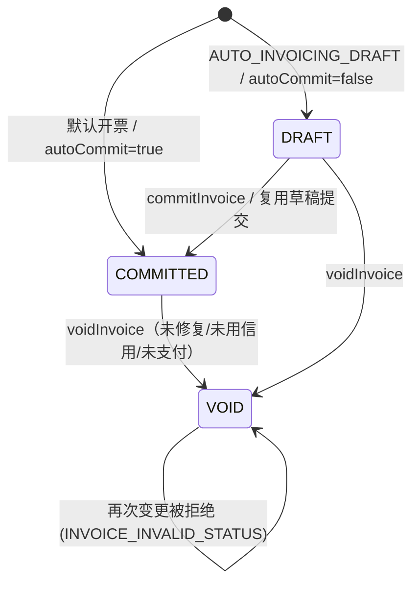
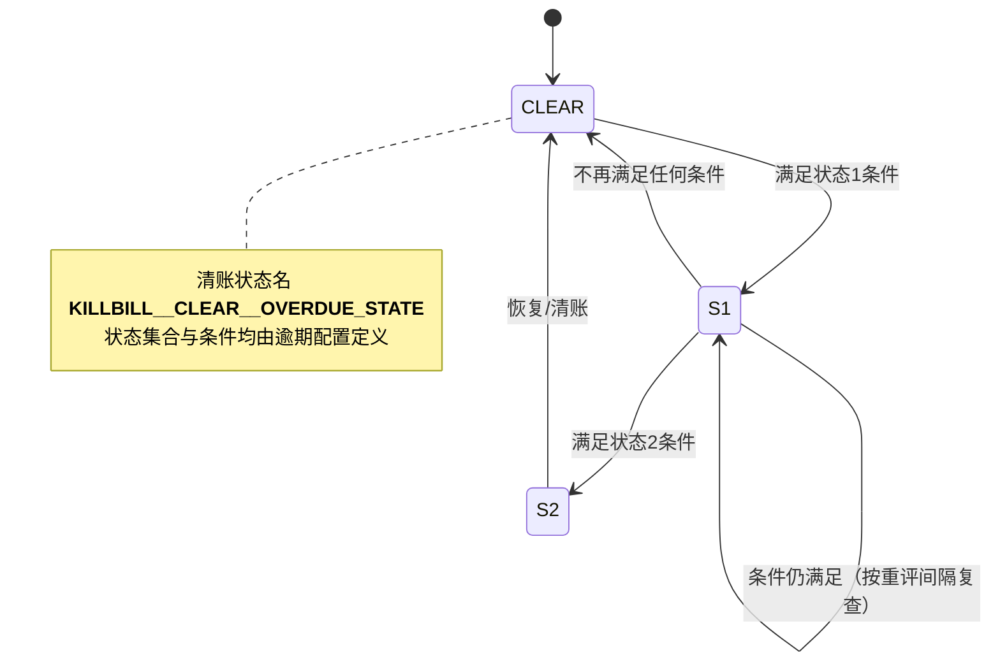

# 状态机（SM）

> 来源模块：invoice, overdue。检索单元 = 每个 `## ` 二级标题块。

## SM-001 发票状态机

- **类型**: 状态机
- **同义词**: 发票状态, 发票状态流转, invoice status, DRAFT, COMMITTED, VOID
- **模块**: invoice
- **置信度**: 🟢 confirmed
- **溯源**: `invoice/src/main/java/org/killbill/billing/invoice/dao/DefaultInvoiceDao.java:513-535`, `invoice/src/main/java/org/killbill/billing/invoice/dao/DefaultInvoiceDao.java:1387-1391`, `invoice/src/main/java/org/killbill/billing/invoice/api/user/DefaultInvoiceUserApi.java:772-799`

**说明**：`InvoiceStatus` 枚举定义在外部 `killbill-api` 构件，DRAFT/COMMITTED/VOID 三态由本仓库上述代码使用与校验。

## SM-002 逾期状态机

- **类型**: 状态机
- **同义词**: 逾期状态机, 逾期流转, overdue state machine, delinquency lifecycle
- **模块**: overdue
- **置信度**: 🟢 confirmed
- **溯源**: `overdue/src/main/java/org/killbill/billing/overdue/config/DefaultOverdueStateSet.java:59-67`, `overdue/src/main/java/org/killbill/billing/overdue/applicator/OverdueStateApplicator.java:104-158`, `overdue/src/main/java/org/killbill/billing/overdue/wrapper/OverdueWrapper.java:109-127`

**说明**：状态名与数量完全由逾期配置（XML）决定；引擎只负责“按顺序取第一个满足条件的状态，否则清账”，并处理封禁/取消/通知等副作用。`OVERDUE_ENFORCEMENT_OFF` 可冻结整个流转。
