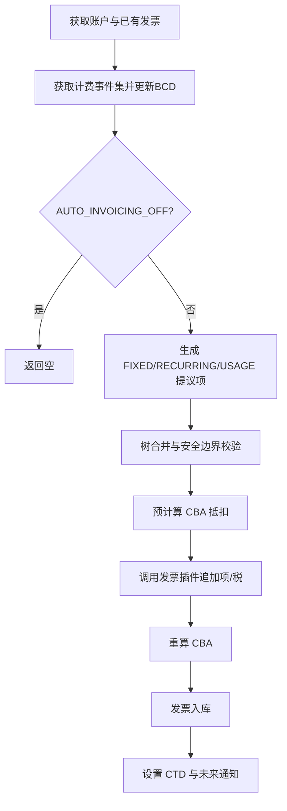
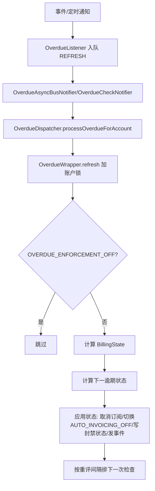

# 业务流程（WF）

> 来源模块：invoice, overdue。检索单元 = 每个 `## ` 二级标题块。

## WF-001 账单运行（发票生成）流程

- **类型**: 业务流程
- **同义词**: 账单运行流程, 发票生成流程, bill run flow, invoice generation flow
- **模块**: invoice
- **置信度**: 🟢 confirmed
- **溯源**: `invoice/src/main/java/org/killbill/billing/invoice/InvoiceDispatcher.java:670-856`

**参与者**：InvoiceDispatcher、InvoiceGenerator、InvoicePluginDispatcher、InvoiceDao、SubscriptionApi。

## WF-002 发票提交（COMMIT）

- **类型**: 业务流程
- **同义词**: 发票提交, 确认发票, commit invoice
- **模块**: invoice
- **置信度**: 🟢 confirmed
- **溯源**: `invoice/src/main/java/org/killbill/billing/invoice/api/user/DefaultInvoiceUserApi.java:689-708`, `invoice/src/main/java/org/killbill/billing/invoice/dao/DefaultInvoiceDao.java:1397-1402`

**步骤**：① 状态改为 `COMMITTED`；② 设置 charged-through dates(CTD)；③ 发 `DefaultInvoiceCreationEvent`；④ 事务内对账户 CBA 重新平衡。

## WF-003 发票作废（VOID）

- **类型**: 业务流程
- **同义词**: 发票作废流程, void invoice flow
- **模块**: invoice
- **置信度**: 🟢 confirmed
- **溯源**: `invoice/src/main/java/org/killbill/billing/invoice/api/user/DefaultInvoiceUserApi.java:772-799`, `invoice/src/main/java/org/killbill/billing/invoice/dao/DefaultInvoiceDao.java:1400-1414`

**步骤**：① 校验未修复、未使用生成贷项、未支付；② 状态改为 `VOID`；③ 重算账户 CBA；④ 发发票调整事件；⑤ 停用该发票的用量 trackingId。

## WF-004 贷项签发与账户信用抵扣

- **类型**: 业务流程
- **同义词**: 贷项流程, 信用抵扣流程, credit flow, CBA lifecycle
- **模块**: invoice
- **置信度**: 🟢 confirmed
- **溯源**: `invoice/src/main/java/org/killbill/billing/invoice/dao/CBADao.java:152-175`, `invoice/src/main/java/org/killbill/billing/invoice/api/user/DefaultInvoiceUserApi.java:710-731`

**步骤**：① 创建 CREDIT_ADJ（金额取负存储）；② CBA 计算按余额生成或消耗 CBA_ADJ；③ 遍历未付发票按发票日期顺序抵扣；④ 子账户正 CBA 可通过 `transferChildCreditToParent` 转给父账户。

## WF-005 外部费用/税额录入与行项目调账退款

- **类型**: 业务流程
- **同义词**: 外部费用流程, 手工收费, 调账流程, 退款流程, external charge, adjustment, refund
- **模块**: invoice
- **置信度**: 🟢 confirmed
- **溯源**: `invoice/src/main/java/org/killbill/billing/invoice/api/user/DefaultInvoiceUserApi.java:554-669`, `invoice/src/main/java/org/killbill/billing/invoice/api/user/DefaultInvoiceUserApi.java:404-424`, `invoice/src/main/java/org/killbill/billing/invoice/dao/InvoiceDaoHelper.java:215-240`

**步骤**：
1. 外部费用/税/贷项：校验金额为正、币种匹配；未指定发票时按 `autoCommit` 决定新发票状态，指定发票仅允许 DRAFT（COMMITTED 抛 `INVOICE_ALREADY_COMMITTED`，VOID 拒绝）；生成对应项后派发给发票插件入库。
2. 行项目调账：校验金额为正 → 计算可调账上限 → 生成 ITEM_ADJ（金额取负）关联原项 → 退款校验 → 重算 CBA。

## WF-006 逾期刷新流程

- **类型**: 业务流程
- **同义词**: 逾期刷新流程, 逾期计算流程, overdue refresh flow
- **模块**: overdue
- **置信度**: 🟢 confirmed
- **溯源**: `overdue/src/main/java/org/killbill/billing/overdue/wrapper/OverdueWrapper.java:89-127`, `overdue/src/main/java/org/killbill/billing/overdue/applicator/OverdueStateApplicator.java:104-158`

## WF-007 逾期清账流程

- **类型**: 业务流程
- **同义词**: 清账流程, 逾期解除流程, overdue clear flow
- **模块**: overdue
- **置信度**: 🟢 confirmed
- **溯源**: `overdue/src/main/java/org/killbill/billing/overdue/wrapper/OverdueWrapper.java:129-149`, `overdue/src/main/java/org/killbill/billing/overdue/applicator/OverdueStateApplicator.java:185-213`

**步骤**：① `OVERDUE_ENFORCEMENT_OFF` 标签创建触发 CLEAR；② 加锁后读取当前状态；③ 写入清账状态；④ 清除未来的检查通知；⑤ 若是“封禁计费 → 清账”转换则移除 `AUTO_INVOICING_OFF`；⑥ 发 `OverdueChangeInternalEvent`。

## WF-008 逾期配置上传（按租户）

- **类型**: 业务流程
- **同义词**: 逾期配置上传, 催收配置更新, overdue config upload
- **模块**: overdue
- **置信度**: 🟢 confirmed
- **溯源**: `overdue/src/main/java/org/killbill/billing/overdue/api/DefaultOverdueApi.java:60-99`, `overdue/src/main/java/org/killbill/billing/overdue/service/DefaultOverdueService.java:91-113`

**步骤**：① 服务启动时从 `properties.getConfigURI()` 加载默认逾期配置（加载失败则日志“Overdue system disabled”）；② 通过 API 上传时，删除租户 `OVERDUE_CONFIG` 键后写入新 XML 并清除缓存；③ 注册租户配置失效回调；④ `getOverdueStateFor(accountId)` 由封禁状态名反查状态（无封禁则返回清账状态）。
