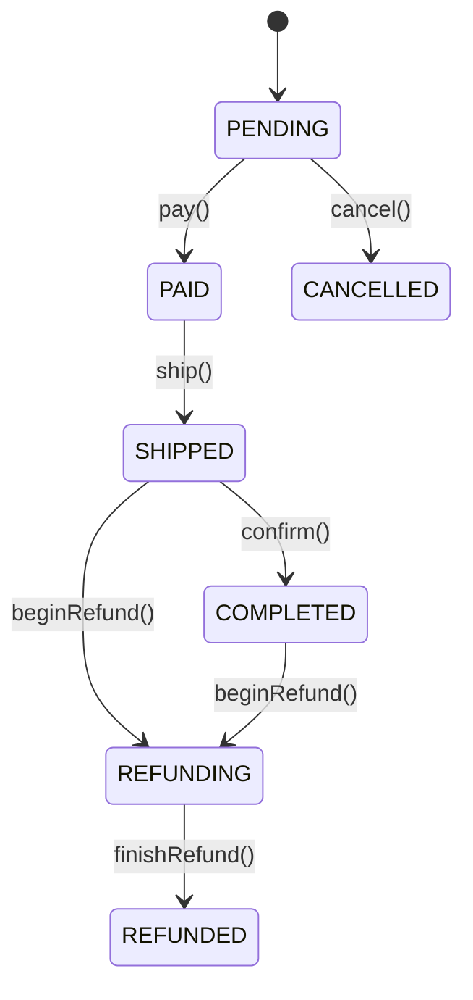

# 模块：order

## 模块概述

`order` 模块负责订单实体与订单生命周期管理，含枚举 `OrderState`、实体 `Order`、仓储 `OrderRepository` 与服务 `OrderService`。它定义了订单状态机、状态流转守卫、取消限制、支付超时判定与退款可入状态，是履约与售后流程的状态底座。

**本模块能力**：订单建模、订单状态机、状态流转守卫、支付超时、取消规则、退款前置状态。

---

## TERM-008 订单状态

- **类型**: 术语
- **同义词**: 订单状态, 订单状态值, order status, order state, OrderState, 订单阶段
- **模块**: order
- **置信度**: 🟢 confirmed
- **溯源**: `src/main/java/com/acme/mall/order/OrderState.java:3-13`

**说明**：`OrderState` 七个状态：`PENDING`（待支付）、`PAID`（已支付）、`SHIPPED`（已发货）、`COMPLETED`（已完成）、`REFUNDING`（退款中）、`REFUNDED`（已退款）、`CANCELLED`（已取消）。注释「序号持久化于 t_order.state」，`Order.stateOf()`/`setState()` 以 ordinal 与枚举互转。

## ENT-003 订单 Order

- **类型**: 业务实体
- **同义词**: 订单, 交易单, order, t_order, 订单表
- **模块**: order
- **置信度**: 🟢 confirmed
- **溯源**: `src/main/java/com/acme/mall/order/Order.java:10-39`

**说明**：数据库实体，表名 `t_order`。字段：`memberId`（会员）、`goodsAmt`（商品折后净额）、`shipFee`（运费）、`paidAmt`（实付金额）、`state`（状态序号）、`createdAt`（创建时间）、`completedAt`（完成时间）。
**约束/关系**：无 ORM 关联；`memberId` 逻辑指向 Member。
**注意**：源码中未发现写入 `paidAmt` 的逻辑（见 BR-016）。

## BR-012 支付超时：待支付保留 30 分钟

- **类型**: 业务规则
- **同义词**: 订单超时, 支付超时, 待支付保留, 30分钟, 支付时限, payment timeout, expired, PAY_TIMEOUT_MINUTES
- **模块**: order
- **置信度**: 🟢 confirmed
- **溯源**: `src/main/java/com/acme/mall/order/OrderService.java:13-14`, `src/main/java/com/acme/mall/order/OrderService.java:61-64`

**规则**：当订单状态为 `PENDING` 且 `createdAt + 30 分钟` 早于 `now` 时，`expired` 判定为超时（返回 true）。
**例外**：该方法只做判定，未在代码中看到超时后自动取消/流转的动作。

## BR-013 已支付订单不可直接取消

- **类型**: 业务规则
- **同义词**: 取消订单, 不可取消已支付, 支付后取消, cancel order, 走退款流程, 取消限制
- **模块**: order
- **置信度**: 🟢 confirmed
- **溯源**: `src/main/java/com/acme/mall/order/OrderService.java:36-44`

**规则**：`cancel` 仅允许 `PENDING` 订单；否则抛出 `IllegalStateException("已支付订单不可直接取消，请走退款流程")`。即：只有待支付订单可直接取消，已支付订单须走退款。

## BR-014 退款仅限已发货或已完成订单

- **类型**: 业务规则
- **同义词**: 可退款状态, 退款前置条件, 退款条件, refundable, 哪些订单能退款, SHIPPED, COMPLETED
- **模块**: order
- **置信度**: 🟢 confirmed
- **溯源**: `src/main/java/com/acme/mall/order/OrderService.java:16-18`, `src/main/java/com/acme/mall/order/OrderService.java:46-51`

**规则**：`beginRefund` 仅允许状态属于 `REFUNDABLE = {SHIPPED, COMPLETED}` 的订单；否则抛 `IllegalStateException("当前状态不支持退款")`。

## BR-015 状态流转守卫：必须处于期望前置状态

- **类型**: 业务规则
- **同义词**: 状态守卫, 前置状态, 非法状态流转, state guard, guard, 状态校验
- **模块**: order
- **置信度**: 🟢 confirmed
- **溯源**: `src/main/java/com/acme/mall/order/OrderService.java:66-70`

**规则**：私有 `guard(o, expected)` 校验当前状态等于期望状态，否则抛 `IllegalStateException("非法状态流转: " + 当前 + " -> " + 期望)`。`pay`/`ship`/`confirm`/`finishRefund` 均经此守卫。

## BR-016 订单实付金额(paidAmt)的赋值规则缺失

- **类型**: 业务规则
- **同义词**: 实付金额, paidAmt, 支付金额写入, 订单金额赋值, 实付更新
- **模块**: order
- **置信度**: 🔴 gap
- **溯源**: `src/main/java/com/acme/mall/order/Order.java:28-30`, `src/main/java/com/acme/mall/order/OrderService.java:20-23`

**缺失点**：`Order.paidAmt`（实付金额）字段仅声明与读取（`getPaidAmt`），`pay(Order)` 只调用 `setState(PAID)`，未设置 `paidAmt`。实付金额由谁、依据什么规则写入无法确定，需人工确认。

## SM-001 订单状态机

- **类型**: 状态机
- **同义词**: 订单状态机, 订单生命周期, 状态流转, order state machine, 订单流转图, OrderState
- **模块**: order
- **置信度**: 🟢 confirmed
- **溯源**: `src/main/java/com/acme/mall/order/OrderState.java:6-13`, `src/main/java/com/acme/mall/order/OrderService.java:20-56`

**说明**：状态迁移全部由 `OrderService` 中的显式方法触发，并受 `guard`/`REFUNDABLE` 约束（见 BR-014、BR-015）。
**例外**：`PENDING` 超时（30 分钟）在代码中不产生自动流转，仅由 `expired()` 判定（见 BR-012）；`CANCELLED`、`REFUNDED` 为终态，无后续出边。

## WF-001 订单履约流程

- **类型**: 业务流程
- **同义词**: 订单履约, 下单履约流程, 订单流程, 支付发货收货, order fulfillment, 履约流程
- **模块**: order
- **置信度**: 🟢 confirmed
- **溯源**: `src/main/java/com/acme/mall/order/OrderService.java:20-34`

**步骤**：
1. 订单初始为 `PENDING`（待支付）。
2. `pay(o)`：待支付 → 已支付 `PAID`（前置须为 PENDING）。
3. `ship(o)`：已支付 → 已发货 `SHIPPED`（前置须为 PAID）。
4. `confirm(o)`：已发货 → 已完成 `COMPLETED`，并写入 `completedAt`（前置须为 SHIPPED）。

