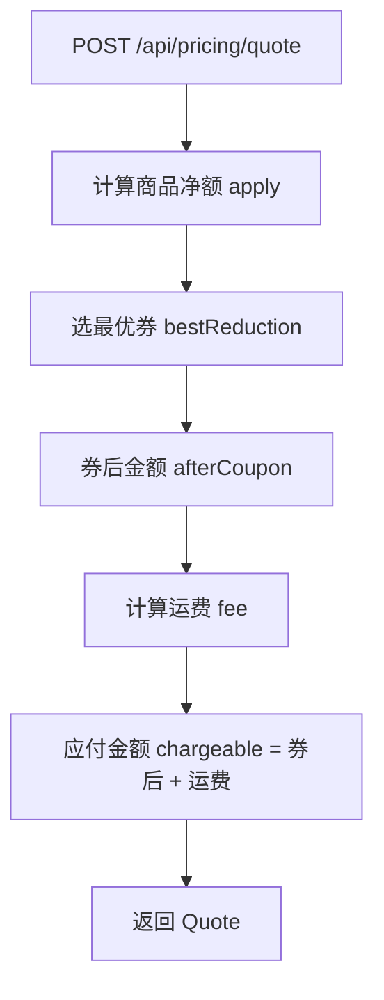

# 模块：pricing

## 模块概述

`pricing` 模块负责结算试算（计价），含 `DiscountService`、`PriceCalculator`、`PricingController`、`Quote`。它把会员分层折扣、优惠券、运费三类优惠合并为最终应付金额，并通过 `POST /api/pricing/quote` 对外提供试算能力。

**本模块能力**：会员分层折扣、活动商品处理、优惠券接入、运费叠加、试算编排与对外试算接口。

---

## TERM-009 结算系数 / 会员折扣率

- **类型**: 术语
- **同义词**: 结算系数, 会员折扣率, 折扣系数, 打折系数, discount rate, member rate, rateOf, 分层系数
- **模块**: pricing
- **置信度**: 🟢 confirmed
- **溯源**: `src/main/java/com/acme/mall/pricing/DiscountService.java:12-15`, `src/main/java/com/acme/mall/pricing/DiscountService.java:20-31`

**说明**：每个会员分层对应一个结算系数：`NORMAL`=1.00、`SILVER`=0.95、`GOLD`=0.90、`PLATINUM`=0.85。折后金额 = 原价 × 结算系数。

## TERM-010 活动商品

- **类型**: 术语
- **同义词**: 活动商品, 促销商品, 特价商品, 活动价商品, promo item, promotion, promoItem, 促销品
- **模块**: pricing
- **置信度**: 🟢 confirmed
- **溯源**: `src/main/java/com/acme/mall/pricing/DiscountService.java:33-40`, `src/main/java/com/acme/mall/pricing/PriceCalculator.java:33`

**说明**：`promoItem=true` 的商品按原价结算，不适用会员分层系数（见 BR-018）。

## TERM-011 商品净额与应付金额

- **类型**: 术语
- **同义词**: 商品净额, 折后净额, 净额, 应付金额, 实付金额, goodsNet, payableAmt, net amount, 商品金额
- **模块**: pricing
- **置信度**: 🟢 confirmed
- **溯源**: `src/main/java/com/acme/mall/pricing/PriceCalculator.java:28-39`, `src/main/java/com/acme/mall/pricing/Quote.java:8-20`

**说明**：商品净额（goodsNet）= 会员折后商品金额；应付金额（payableAmt）= 净额 − 券抵扣 + 运费，且不低于 0.01 元。

## ENT-004 结算试算结果 Quote

- **类型**: 业务实体
- **同义词**: 试算结果, 报价, 试算单, 结算结果, quote, 计价结果
- **模块**: pricing
- **置信度**: 🟢 confirmed
- **溯源**: `src/main/java/com/acme/mall/pricing/Quote.java:5-20`

**说明**：不可变值对象（非数据库实体），含 `goodsNet`（商品净额）、`couponCut`（券抵扣额）、`shipFee`（运费）、`payableAmt`（应付金额）。

## ENT-005 试算入参 QuoteRequest

- **类型**: 业务实体
- **同义词**: 试算入参, 询价入参, 试算请求, quote request, QuoteRequest, 计价入参
- **模块**: pricing
- **置信度**: 🟢 confirmed
- **溯源**: `src/main/java/com/acme/mall/pricing/PricingController.java:29-36`

**说明**：试算接口入参，含 `gross`（商品原价）、`level`（会员分层）、`promoItem`（是否活动商品）、`coupons`（可用券列表）、`regionCode`（收货地区编码）。为 `PricingController` 的静态内部类。

## BR-017 会员分层折扣率

- **类型**: 业务规则
- **同义词**: 会员折扣, 等级折扣, 分层折扣, 打折, member discount, VIP优惠, 折扣率, 85折, 9折
- **模块**: pricing
- **置信度**: 🟢 confirmed
- **溯源**: `src/main/java/com/acme/mall/pricing/DiscountService.java:12-15`, `src/main/java/com/acme/mall/pricing/DiscountService.java:20-31`

**规则**：按会员分层返回结算系数：`PLATINUM`=0.85、`GOLD`=0.90、`SILVER`=0.95，其余（`NORMAL`）=1.00。

## BR-018 活动商品不适用分层折扣

- **类型**: 业务规则
- **同义词**: 活动商品不打折, 促销不叠加折扣, 原价结算, promo no discount, 活动价不与会员折扣叠加
- **模块**: pricing
- **置信度**: 🟢 confirmed
- **溯源**: `src/main/java/com/acme/mall/pricing/DiscountService.java:33-40`

**规则**：`promoItem=true` 时 `apply` 直接返回 `normalize(gross)`，不乘分层系数。
**说明**：注释「活动商品按原价结算，不适用分层系数」。

## BR-019 试算顺序：净额 → 券 → 运费 → 应付

- **类型**: 业务规则
- **同义词**: 试算顺序, 计价顺序, 价格计算顺序, 应付计算, quote order, 结算顺序
- **模块**: pricing
- **置信度**: 🟢 confirmed
- **溯源**: `src/main/java/com/acme/mall/pricing/PriceCalculator.java:28-39`

**规则**：
1. `rate = promoItem ? 1 : rateOf(lvl)`；
2. `goodsNet = discountService.apply(gross, lvl, promoItem)`（会员折后净额）；
3. `couponCut = couponService.bestReduction(goodsNet, coupons, rate)`；
4. `afterCoupon = normalize(goodsNet − couponCut)`；
5. `shipFee = shippingFeeCalculator.fee(afterCoupon, lvl, regionCode)`（以券后金额为运费判定基数）；
6. `payableAmt = chargeable(afterCoupon + shipFee)`（不低于 0.01）。

**例外**：活动商品时 `rate` 取 1.00，会员权益值为 0，券只要抵扣 > 0 即被采用。券与会员折扣的取向见 BR-008。

## WF-002 结算试算流程

- **类型**: 业务流程
- **同义词**: 试算流程, 下单试算, 计价流程, 价格试算, quote flow, 结算流程
- **模块**: pricing
- **置信度**: 🟢 confirmed
- **溯源**: `src/main/java/com/acme/mall/pricing/PricingController.java:23-27`, `src/main/java/com/acme/mall/pricing/PriceCalculator.java:31-40`

**步骤**：
1. 客户端调用 `POST /api/pricing/quote`，提交 QuoteRequest（原价、会员分层、是否活动商品、券列表、地区编码）。
2. `PriceCalculator.quote` 计算商品净额（含分层折扣，活动商品除外）。
3. 计算最优券抵扣，并处理券与会员折扣的取向（见 BR-008）。
4. 计算运费（含免邮、偏远加收，见 BR-026、BR-027）。
5. 汇总应付金额（不低于 0.01），返回 Quote。

