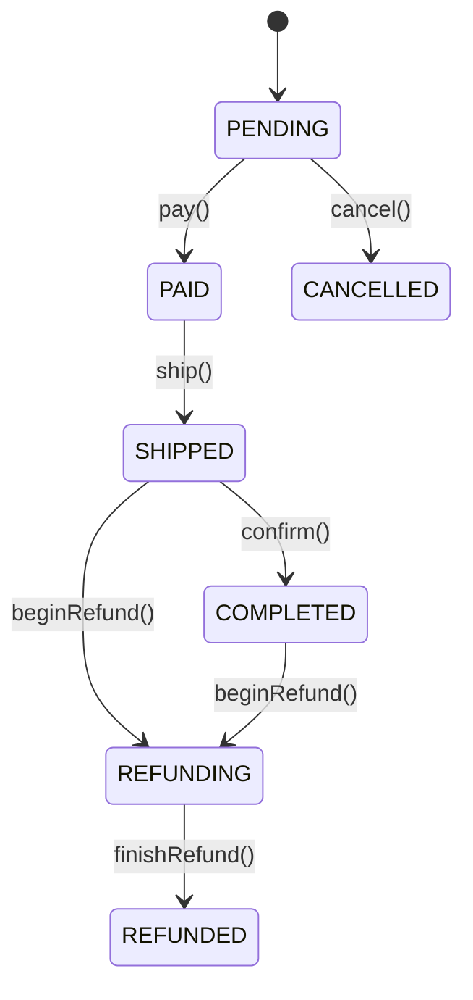

# 状态机 (state-machines)

本文件收录有状态枚举 + 流转/触发条件的卡。检索单元为每个 `## SM-xxx` 二级标题块。

## SM-001 订单状态机

- **类型**: 状态机
- **同义词**: 订单状态机, 订单生命周期, 状态流转, order state machine, 订单流转图, OrderState
- **模块**: order
- **置信度**: 🟢 confirmed
- **溯源**: `src/main/java/com/acme/mall/order/OrderState.java:6-13`, `src/main/java/com/acme/mall/order/OrderService.java:20-56`

**说明**：状态迁移全部由 `OrderService` 中的显式方法触发，并受 `guard`/`REFUNDABLE` 约束（见 BR-014、BR-015）。
**例外**：`PENDING` 超时（30 分钟）在代码中不产生自动流转，仅由 `expired()` 判定（见 BR-012）；`CANCELLED`、`REFUNDED` 为终态，无后续出边。

**状态取值**（`OrderState`）：`PENDING`（待支付）、`PAID`（已支付）、`SHIPPED`（已发货）、`COMPLETED`（已完成）、`REFUNDING`（退款中）、`REFUNDED`（已退款）、`CANCELLED`（已取消）。序号持久化于 `t_order.state`。
