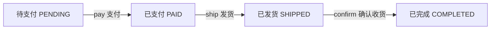
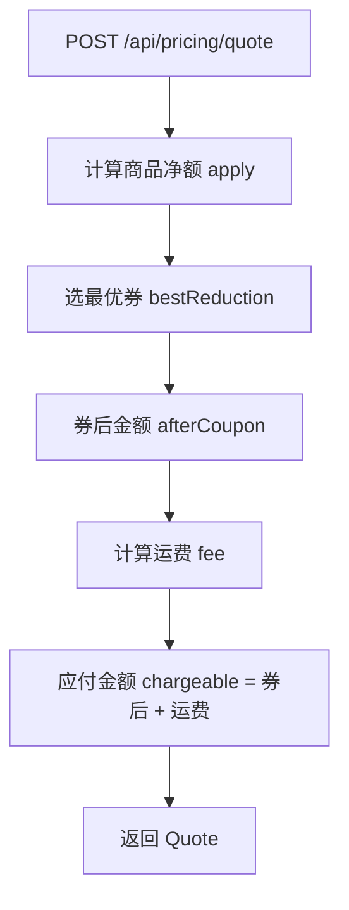

# 业务流程 (workflows)

本文件收录多步骤、有参与者与顺序的业务流程卡。检索单元为每个 `## WF-xxx` 二级标题块。

## WF-001 订单履约流程

- **类型**: 业务流程
- **同义词**: 订单履约, 下单履约流程, 订单流程, 支付发货收货, order fulfillment, 履约流程
- **模块**: order
- **置信度**: 🟢 confirmed
- **溯源**: `src/main/java/com/acme/mall/order/OrderService.java:20-34`

**步骤**：
1. 订单初始为 `PENDING`（待支付）。
2. `pay(o)`：待支付 → 已支付 `PAID`（前置须为 PENDING）。
3. `ship(o)`：已支付 → 已发货 `SHIPPED`（前置须为 PAID）。
4. `confirm(o)`：已发货 → 已完成 `COMPLETED`，并写入 `completedAt`（前置须为 SHIPPED）。



## WF-002 结算试算流程

- **类型**: 业务流程
- **同义词**: 试算流程, 下单试算, 计价流程, 价格试算, quote flow, 结算流程
- **模块**: pricing
- **置信度**: 🟢 confirmed
- **溯源**: `src/main/java/com/acme/mall/pricing/PricingController.java:23-27`, `src/main/java/com/acme/mall/pricing/PriceCalculator.java:31-40`

**步骤**：
1. 客户端调用 `POST /api/pricing/quote`，提交 QuoteRequest（原价、会员分层、是否活动商品、券列表、地区编码）。
2. `PriceCalculator.quote` 计算商品净额（含分层折扣，活动商品除外）。
3. 计算最优券抵扣，并处理券与会员折扣的取向（见 BR-008）。
4. 计算运费（含免邮、偏远加收，见 BR-026、BR-027）。
5. 汇总应付金额（不低于 0.01），返回 Quote。



## WF-003 退款流程

- **类型**: 业务流程
- **同义词**: 退款流程, 退货流程, 售后流程, 退款审批流程, refund process, 退款处理
- **模块**: refund
- **置信度**: 🟢 confirmed
- **溯源**: `src/main/java/com/acme/mall/refund/RefundController.java:20-33`, `src/main/java/com/acme/mall/refund/RefundService.java:45-50`, `src/main/java/com/acme/mall/order/OrderService.java:46-56`

**步骤**：
1. 客服（CS 或 CS_LEAD）调用 `POST /api/refunds` 发起退款申请。
2. 依据 `itemIds` 是否为空判定整单/部分退款，并计算应退金额。
3. 校验售后 7 天窗口（仅约束已完成订单）。
4. 调用 `orderService.beginRefund` 将订单从 `SHIPPED`/`COMPLETED` 置为 `REFUNDING`。
5. 客服主管（CS_LEAD）调用 `POST /api/refunds/{id}/approve` 审批。
6. 审批后由结算系统出款；订单最终经 `finishRefund` 置为 `REFUNDED`。

```mermaid
flowchart TD
  A[客服 CS/CS_LEAD 发起退款 POST /api/refunds] --> B{售后 7 天窗口内?}
  B -- 否 --> X[拒绝: 已超出售后申请期限]
  B -- 是 --> C[订单置为 REFUNDING beginRefund]
  C --> D[客服主管 CS_LEAD 审批 POST /api/refunds/{id}/approve]
  D --> E[结算系统出款]
  E --> F[finishRefund 订单置为 REFUNDED]
```

## WF-004 退款审批后的出款与完成衔接缺失

- **类型**: 业务流程
- **同义词**: 审批后出款, approve 空实现, 退款完成衔接, payout after approval, 退款出款
- **模块**: refund
- **置信度**: 🔴 gap
- **溯源**: `src/main/java/com/acme/mall/refund/RefundController.java:28-33`, `src/main/java/com/acme/mall/order/OrderService.java:53-56`

**缺失点**：`RefundController.approve` 方法体为空，仅注释「审批后由结算系统出款」。从「审批」到「结算出款」，再到 `OrderService.finishRefund`（REFUNDING → REFUNDED）的触发者在代码中不存在。该流程段的实现或外部系统责任需人工确认。
