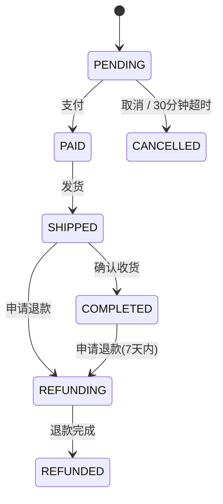

# GROUND-TRUTH — 合成电商中台（synthetic-springboot）

> 本文件是**权威业务事实清单**，由出题者手写，独立于任何由 tool 生成的知识库。
> 每一项都标注实现的**精确 `file:line`**（相对本场景根目录），行号已对照源码逐一复核。
> 源码仅作格式载体，**不参与编译**。

## 0. 场景概览

- 领域：电商中台 —— 会员等级、定价折扣、优惠券、运费、订单状态、退款与角色权限。
- 代码根：`scenarios/synthetic-springboot/`
- 包名：`com.acme.mall`
- 代码文件数：20（Java），另含本文件、`expected-cards.md`。

---

## 1. 术语与代码命名映射（关键）

代码里的标识符**故意不等于**业务词，用于检验同义词检索能力。

| 业务术语 | 代码标识符 | 物理位置（表/字段） | 定义处 |
|---|---|---|---|
| 会员等级 | `MemberLevel` / `Member.vipLvl` | `t_member.vip_lvl` | `src/main/java/com/acme/mall/loyalty/MemberLevel.java:6-11`、`src/main/java/com/acme/mall/loyalty/Member.java:18-19` |
| 运费 | `shippingFee` / `ShipFee` / `shipFee` | `t_order.ship_fee` | `src/main/java/com/acme/mall/shipping/ShippingFeeCalculator.java:14`、`src/main/java/com/acme/mall/order/Order.java:25-26` |
| 优惠券 | `Coupon` / `coupType` | `t_coupon` | `src/main/java/com/acme/mall/coupon/Coupon.java:10-12`、`src/main/java/com/acme/mall/coupon/CouponType.java:6-10` |
| 订单状态 | `OrderState` / `Order.state` | `t_order.state` | `src/main/java/com/acme/mall/order/OrderState.java:6-14`、`src/main/java/com/acme/mall/order/Order.java:32-33` |
| 售后申请期限 | `AFTER_SALE_DAYS` | —（常量） | `src/main/java/com/acme/mall/refund/RefundService.java:14-33` |
| 折后净额 | `goodsNet` / `goodsAmt` | `t_order.goods_amt` | `src/main/java/com/acme/mall/pricing/Quote.java:8-37`、`src/main/java/com/acme/mall/order/Order.java:21-22` |
| 应付金额 | `payableAmt` | —（计算值） | `src/main/java/com/acme/mall/pricing/Quote.java:13`、`src/main/java/com/acme/mall/pricing/PriceCalculator.java:38` |
| 用户分层值 | `vipLvl`（int） | `t_member.vip_lvl` | `src/main/java/com/acme/mall/loyalty/Member.java:18-19` |
| 偏远地区编码 | `regionCode` / `REMOTE_REGIONS` | —（常量） | `src/main/java/com/acme/mall/shipping/ShippingFeeCalculator.java:19` |
| 券可用标志 | `usableFlag` | `t_coupon.usable_flag` | `src/main/java/com/acme/mall/coupon/Coupon.java:34-35` |

**会员等级取值**（枚举序号即 `vip_lvl`）：`NORMAL`(普通) / `SILVER`(白银) / `GOLD`(黄金) / `PLATINUM`(白金)
出处：`src/main/java/com/acme/mall/loyalty/MemberLevel.java:6-11`

**券类型取值**（枚举序号即 `coup_type`）：`FULL_REDUCTION`(满减券) / `DISCOUNT`(折扣券) / `CASH`(现金券)
出处：`src/main/java/com/acme/mall/coupon/CouponType.java:6-10`

**订单状态取值**（枚举序号即 `t_order.state`）：`PENDING`(待支付) / `PAID`(已支付) / `SHIPPED`(已发货) / `COMPLETED`(已完成) / `REFUNDING`(退款中) / `REFUNDED`(已退款) / `CANCELLED`(已取消)
出处：`src/main/java/com/acme/mall/order/OrderState.java:6-14`

---

## 2. 业务实体

| ID | 实体 | 说明 | 实现 |
|---|---|---|---|
| ENT-001 | 会员（Member） | 电商用户，含分层值与最近下单时间 | `src/main/java/com/acme/mall/loyalty/Member.java:12-54` |
| ENT-002 | 订单（Order） | 交易主单，含商品净额、运费、实付额与状态 | `src/main/java/com/acme/mall/order/Order.java:12-80` |
| ENT-003 | 优惠券（Coupon） | 用户持有的券，含类型、面额、比例、门槛、有效期 | `src/main/java/com/acme/mall/coupon/Coupon.java:12-67` |
| ENT-004 | 退款申请（RefundRequest） | 退款入参：订单、商品行、部分退款净额、原因 | `src/main/java/com/acme/mall/refund/RefundRequest.java:9-36` |

---

## 3. 业务规则清单

### BR-001 会员等级折扣率
- **规则**：结算时按会员等级给予折扣系数——普通 1.00（无折扣）、白银 0.95（95 折）、黄金 0.90（9 折）、白金 0.85（85 折）。
- **溯源**：`src/main/java/com/acme/mall/pricing/DiscountService.java:10-15`（系数常量）、`src/main/java/com/acme/mall/pricing/DiscountService.java:20-31`（选择逻辑）

### BR-002 促销商品不参与会员折扣
- **规则**：参加活动的商品（`promoItem=true`）按原价结算，**不**适用会员等级系数。
- **溯源**：`src/main/java/com/acme/mall/pricing/DiscountService.java:36-41`

### BR-003 基础运费与满额免运费
- **规则**：基础运费 12.00 元；商品折后净额 **≥ 99.00 元**时免除基础运费。
- **溯源**：`src/main/java/com/acme/mall/shipping/ShippingFeeCalculator.java:12-15`、`src/main/java/com/acme/mall/shipping/ShippingFeeCalculator.java:28-37`

### BR-004 白金会员无条件免基础运费
- **规则**：白金等级会员**不受金额门槛限制**，始终免除基础运费。
- **溯源**：`src/main/java/com/acme/mall/shipping/ShippingFeeCalculator.java:29-32`

### BR-005 偏远地区附加费不参与减免
- **规则**：收货地区属于偏远地区（`XZ` 西藏 / `XJ` 新疆 / `NM` 内蒙古 / `QH` 青海）时加收 **15.00 元**附加费；该附加费**不因**免运费规则而免除（即使已满足满额免运费或白金免运费，仍照收 15.00）。
- **溯源**：`src/main/java/com/acme/mall/shipping/ShippingFeeCalculator.java:16`、`src/main/java/com/acme/mall/shipping/ShippingFeeCalculator.java:19`、`src/main/java/com/acme/mall/shipping/ShippingFeeCalculator.java:33-35`

### BR-006 优惠券与会员折扣互斥，取更优者（隐藏优先级规则）
- **规则**：优惠券**不可**与会员等级折扣叠加。系统分别计算「会员折扣省下的金额」与「最优券抵扣额」，**只取其中对用户更有利的一个**；当会员折扣不少于最优券抵扣时，放弃用券、保留会员折扣（返回 0 抵扣）。
- **说明**：这是最容易漏提的隐藏规则——从类名 `CouponService` 完全看不出「券与会员折扣互斥」。
- **溯源**：`src/main/java/com/acme/mall/coupon/CouponService.java:29-33`

### BR-007 单笔订单仅限一张优惠券
- **规则**：同一订单最多使用 **1 张**优惠券；多张可用时选取抵扣金额最大的一张。
- **溯源**：`src/main/java/com/acme/mall/coupon/CouponService.java:11-27`

### BR-008 三类优惠券的抵扣算法
- **规则**：
  - 折扣券（DISCOUNT）：抵扣额 = 净额 ×（1 − 券比例）。
  - 满减券（FULL_REDUCTION）：仅当净额 ≥ 券门槛时抵扣固定面额，否则不可用。
  - 现金券（CASH）：直接抵扣固定面额。
- **溯源**：`src/main/java/com/acme/mall/coupon/CouponService.java:39-50`

### BR-009 优惠券生效条件（可用标志 + 有效期）
- **规则**：仅当券 `usableFlag=true` **且** 未过期（`expireAt` 晚于当前时刻）时才参与抵扣；已冻结或无到期时间的券直接跳过。
- **溯源**：`src/main/java/com/acme/mall/coupon/CouponService.java:20`、`src/main/java/com/acme/mall/coupon/Coupon.java:34-38`

### BR-010 售后申请窗口为订单完成后 7 天
- **规则**：已完成订单的售后申请期限为**自完成之日起 7 天**内，超期不得申请退款；非「已完成」状态的订单另由状态机校验（此处放行）。
- **溯源**：`src/main/java/com/acme/mall/refund/RefundService.java:14-33`、`src/main/java/com/acme/mall/refund/RefundService.java:28-33`

### BR-011 退款金额计算（整单含运费 / 部分不退运费）
- **规则**：整单退款 = 商品净额 + 运费；**部分退款只退所选商品的净额，运费不予退还**。
- **溯源**：`src/main/java/com/acme/mall/refund/RefundService.java:38-50`

### BR-012 金额归一化与最低收取 0.01 元（隐藏规则，位于工具类）
- **规则**：所有对外金额统一**四舍五入保留 2 位小数**；任何计算结果的应收取金额若低于 **0.01 元**，一律按 **0.01 元**收取（系统不接受零元/负价订单）。
- **说明**：隐藏在通用工具 `AmountUtils` 中，类名与规则无直接语义关联。
- **溯源**：`src/main/java/com/acme/mall/common/AmountUtils.java:9-36`、`src/main/java/com/acme/mall/common/AmountUtils.java:20-25`、`src/main/java/com/acme/mall/common/AmountUtils.java:30-36`

### BR-013 活跃会员口径 = 近 365 天有下单（隐藏规则，位于 SQL 字符串）
- **规则**：运营触达人群（活跃会员）定义为：`status = 1`（启用）**且**最近一次下单时间在**近 365 天**内。口径硬编码在原生 SQL 中。
- **说明**：仅凭方法名 `findActives()` 无法看出 365 天阈值，需读取 SQL 字符串。
- **溯源**：`src/main/java/com/acme/mall/loyalty/MemberRepository.java:10-17`（SQL 在 15-16 行）

### BR-014 待支付订单 30 分钟超时自动取消
- **规则**：`PENDING` 状态订单自创建起 **30 分钟**内未支付即判定为过期，可被自动取消。
- **溯源**：`src/main/java/com/acme/mall/order/OrderService.java:11-14`、`src/main/java/com/acme/mall/order/OrderService.java:61-64`, `src/main/java/com/acme/mall/order/OrderRepository.java:12-15`

### BR-015 已支付订单不可直接取消
- **规则**：仅 `PENDING` 状态订单可直接取消；已支付及之后的订单一律**不允许直接取消**，必须走退款流程（否则抛异常）。
- **溯源**：`src/main/java/com/acme/mall/order/OrderService.java:39-44`

### BR-016 应付金额计算顺序
- **规则**：应付金额 = 商品折后净额 − 券抵扣 + 运费，最后经「最低 0.01 元」兜底。计算顺序固定为：先套会员折扣 → 再定券（与折扣二选一）→ 再算运费（运费门槛基于**扣券后**净额判断）→ 汇总。
- **溯源**：`src/main/java/com/acme/mall/pricing/PriceCalculator.java:14-40`, `src/main/java/com/acme/mall/pricing/PricingController.java:15-53`

---

## 4. 状态机

### SM-001 订单状态机（7 状态、守卫式流转）

- **状态**：待支付 `PENDING` → 已支付 `PAID` → 已发货 `SHIPPED` → 已完成 `COMPLETED`；旁支 `REFUNDING`（退款中）→ `REFUNDED`（已退款）；`CANCELLED`（已取消）。
- **受守卫的合法流转**：
  | 流转 | 触发 | 守卫条件 |
  |---|---|---|
  | PENDING → PAID | 支付 | 当前必须为 PENDING |
  | PAID → SHIPPED | 发货 | 当前必须为 PAID |
  | SHIPPED → COMPLETED | 确认收货 | 当前必须为 SHIPPED，并记录完成时间 |
  | PENDING → CANCELLED | 取消 / 超时 | 仅 PENDING 可取消；30 分钟超时自动取消 |
  | SHIPPED / COMPLETED → REFUNDING | 申请退款 | 仅这两个状态允许进入退款 |
  | REFUNDING → REFUNDED | 退款完成 | 当前必须为 REFUNDING |
- **非法流转**：任何不满足守卫的跳转都会抛出 `非法状态流转` 异常。
- **溯源**：`src/main/java/com/acme/mall/order/OrderState.java:6-14`、`src/main/java/com/acme/mall/order/OrderService.java:17-18`、`src/main/java/com/acme/mall/order/OrderService.java:20-70`

---

## 5. 角色与权限

| ID | 角色 | 权限 | 证据 |
|---|---|---|---|
| ROLE-001 | 客服（`CS`） | 可代客**发起**退款申请 | `src/main/java/com/acme/mall/refund/RefundController.java:12-26`（`@PreAuthorize("hasAnyRole('CS', 'CS_LEAD')")`） |
| ROLE-002 | 客服主管（`CS_LEAD`） | **唯一**可**审批**退款的角色 | `src/main/java/com/acme/mall/refund/RefundController.java:29-33`（`@PreAuthorize("hasRole('CS_LEAD')")`） |

- 权限注解生效前提：`MallApplication` 开启了方法级安全 `@EnableGlobalMethodSecurity(prePostEnabled = true)`
  溯源：`src/main/java/com/acme/mall/MallApplication.java:7-13`

---

## 6. 隐藏规则一览（用于检验提取深度）

| ID | 规则 | 为什么“隐藏” |
|---|---|---|
| BR-006 | 券与会员折扣互斥、取更优者 | 类名叫 `CouponService`，看不出与会员折扣的关系 |
| BR-012 | 最低收取 0.01 元 | 埋在通用工具 `AmountUtils`，类名无语义 |
| BR-013 | 活跃会员 = 近 365 天 | 阈值写在原生 SQL 字符串里，方法名只是 `findActives` |

---

## 7. 溯源索引（file:line 复核表）

所有行号均以写入后的源码逐行复核（见各文件以 `: <内容>` 前缀的行号）。

| 文件 | 关键行 | 承载内容 |
|---|---|---|
| `src/main/java/com/acme/mall/MallApplication.java` | 8 | 方法级安全开关 |
| `src/main/java/com/acme/mall/common/AmountUtils.java` | 12 / 20-25 / 30-36 | 最低金额 / 归一化 / 兜底 |
| `src/main/java/com/acme/mall/loyalty/MemberLevel.java` | 6-11 | 会员等级枚举 |
| `src/main/java/com/acme/mall/loyalty/Member.java` | 18-19 / 25-26 | 分层值 / 最近下单时间 |
| `src/main/java/com/acme/mall/loyalty/MemberRepository.java` | 15-16 | 活跃会员 SQL |
| `src/main/java/com/acme/mall/pricing/DiscountService.java` | 12-15 / 20-31 / 36-41 | 折扣系数 / 选择 / 促销例外 |
| `src/main/java/com/acme/mall/pricing/Quote.java` | 10-13 | 试算 DTO |
| `src/main/java/com/acme/mall/pricing/PriceCalculator.java` | 14-40 | 应付金额计算顺序 |
| `src/main/java/com/acme/mall/pricing/PricingController.java` | 15-53 | 试算接口 |
| `src/main/java/com/acme/mall/coupon/CouponType.java` | 6-10 | 券类型枚举 |
| `src/main/java/com/acme/mall/coupon/Coupon.java` | 18-38 | 券字段 |
| `src/main/java/com/acme/mall/coupon/CouponService.java` | 11-34 / 39-50 | 选券与互斥 / 抵扣算法 |
| `src/main/java/com/acme/mall/shipping/ShippingFeeCalculator.java` | 12-19 / 28-37 | 运费常量 / 运费算法 |
| `src/main/java/com/acme/mall/order/OrderState.java` | 6-14 | 订单状态枚举 |
| `src/main/java/com/acme/mall/order/Order.java` | 21-39 / 73-79 | 订单字段 / 状态写入 |
| `src/main/java/com/acme/mall/order/OrderService.java` | 11-14 / 17-18 / 20-70 | 超时 / 可退款集合 / 状态机 |
| `src/main/java/com/acme/mall/order/OrderRepository.java` | 14-15 | 过期订单查询 |
| `src/main/java/com/acme/mall/refund/RefundRequest.java` | 9-36 | 退款入参 |
| `src/main/java/com/acme/mall/refund/RefundService.java` | 14-33 / 28-33 / 38-50 | 7 天窗口 / 窗口校验 / 退款金额 |
| `src/main/java/com/acme/mall/refund/RefundController.java` | 12-33 | 角色权限注解 |
