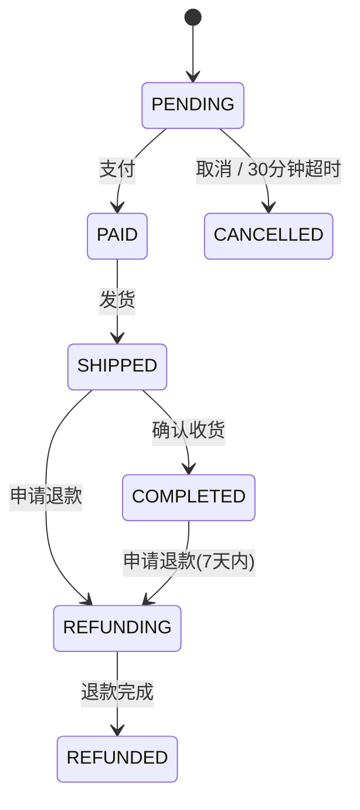

# 期望知识卡 — synthetic-springboot

> 本文件是合成场景的**期望输出**，严格遵循 `docs/FORMATS.md` §1.2 的卡片格式，
> 用于把 tool 生成的知识库与 ground truth 做 diff。
> 每条 `溯源` 的 `file:line` 均已对照源码复核。ID 前缀遵循 §1.2 固定表。

---

## TERM-001 会员等级

- **类型**: 术语
- **同义词**: 会员等级, 会员级别, 用户分层, vip等级, member level, vip level, vipLvl
- **模块**: loyalty
- **置信度**: 🟢 confirmed
- **溯源**: `src/main/java/com/acme/mall/loyalty/MemberLevel.java:6-11`, `src/main/java/com/acme/mall/loyalty/Member.java:18-19`

**定义**：电商用户的等级分层，取值按序号为 普通 NORMAL、白银 SILVER、黄金 GOLD、白金 PLATINUM；代码中持久化字段为 `vipLvl`（表 `t_member.vip_lvl`）。

---

## TERM-002 运费

- **类型**: 术语
- **同义词**: 运费, 配送费, 快递费, 邮费, 物流费, shipping fee, freight, shipFee, shippingFee
- **模块**: shipping
- **置信度**: 🟢 confirmed
- **溯源**: `src/main/java/com/acme/mall/shipping/ShippingFeeCalculator.java:14`, `src/main/java/com/acme/mall/order/Order.java:25-26`

**定义**：订单配送收取的物流费用，基础值 12.00 元，字段为 `shippingFee`/`shipFee`（表 `t_order.ship_fee`）。

---

## TERM-003 优惠券

- **类型**: 术语
- **同义词**: 优惠券, 券, 折扣券, 满减券, 现金券, coupon, voucher, promo code, coupType
- **模块**: coupon
- **置信度**: 🟢 confirmed
- **溯源**: `src/main/java/com/acme/mall/coupon/Coupon.java:10-12`, `src/main/java/com/acme/mall/coupon/CouponType.java:6-10`

**定义**：用户持有的抵扣凭证，类型有满减券 FULL_REDUCTION、折扣券 DISCOUNT、现金券 CASH。

---

## TERM-004 订单状态

- **类型**: 术语
- **同义词**: 订单状态, 状态, 订单流转状态, order status, order state, OrderState
- **模块**: order
- **置信度**: 🟢 confirmed
- **溯源**: `src/main/java/com/acme/mall/order/OrderState.java:6-14`

**定义**：订单在生命周期中的状态枚举：待支付 PENDING、已支付 PAID、已发货 SHIPPED、已完成 COMPLETED、退款中 REFUNDING、已退款 REFUNDED、已取消 CANCELLED。

---

## TERM-005 售后申请期限

- **类型**: 术语
- **同义词**: 售后期限, 售后申请期限, 退款期限, 退货期限, after-sale window, refund window, afterSaleDays
- **模块**: refund
- **置信度**: 🟢 confirmed
- **溯源**: `src/main/java/com/acme/mall/refund/RefundService.java:14-33`

**定义**：订单完成后允许申请退款的时限，代码常量为 `AFTER_SALE_DAYS`（7 天）。

---

## TERM-006 应付金额

- **类型**: 术语
- **同义词**: 应付金额, 应付, 实付金额, 结算金额, 最终金额, payable amount, payableAmt, paidAmt
- **模块**: pricing
- **置信度**: 🟢 confirmed
- **溯源**: `src/main/java/com/acme/mall/pricing/Quote.java:13`, `src/main/java/com/acme/mall/pricing/PriceCalculator.java:38`

**定义**：商品折后净额扣除优惠券、叠加运费后，用户最终需要支付的金额，字段 `payableAmt`。

---

## TERM-007 折后净额

- **类型**: 术语
- **同义词**: 折后金额, 商品净额, 折后净额, net amount, goodsNet, goodsAmt
- **模块**: pricing
- **置信度**: 🟢 confirmed
- **溯源**: `src/main/java/com/acme/mall/pricing/Quote.java:8-37`, `src/main/java/com/acme/mall/order/Order.java:21-22`

**定义**：商品原价套用会员折扣后的金额，不含运费与券抵扣，字段 `goodsNet`/`goodsAmt`。

---

## ENT-001 会员

- **类型**: 业务实体
- **同义词**: 会员, 用户, 客户, member, user, customer
- **模块**: loyalty
- **置信度**: 🟢 confirmed
- **溯源**: `src/main/java/com/acme/mall/loyalty/Member.java:12-54`

**定义**：电商平台的注册用户，含会员等级 `vipLvl`、启用状态 `status`、最近下单时间 `lastOrderAt`、累计消费 `totalSpent`。

---

## ENT-002 订单

- **类型**: 业务实体
- **同义词**: 订单, 交易单, 主单, order, trade
- **模块**: order
- **置信度**: 🟢 confirmed
- **溯源**: `src/main/java/com/acme/mall/order/Order.java:12-80`

**定义**：交易主单，含所属会员、商品净额 `goodsAmt`、运费 `shipFee`、实付额 `paidAmt`、状态 `state`、创建与完成时间。

---

## ENT-003 优惠券

- **类型**: 业务实体
- **同义词**: 优惠券, 券, coupon, voucher
- **模块**: coupon
- **置信度**: 🟢 confirmed
- **溯源**: `src/main/java/com/acme/mall/coupon/Coupon.java:12-67`

**定义**：优惠券实体，含类型 `coupType`、面额 `faceValue`、折扣比例 `rateValue`、使用门槛 `threshold`、可用标志 `usableFlag`、到期时间 `expireAt`。

---

## ENT-004 退款申请

- **类型**: 业务实体
- **同义词**: 退款申请, 退款单, 售后申请, refund request, refund
- **模块**: refund
- **置信度**: 🟢 confirmed
- **溯源**: `src/main/java/com/acme/mall/refund/RefundRequest.java:9-36`

**定义**：退款申请入参，含订单号 `orderId`、退款商品行 `itemIds`、部分退款净额 `goodsPortion`、原因 `reason`。

---

## BR-001 会员等级折扣率

- **类型**: 业务规则
- **同义词**: 会员折扣, 会员等级折扣, VIP折扣, 折扣率, 分层折扣, member discount, discount rate, tier discount
- **模块**: pricing
- **置信度**: 🟢 confirmed
- **溯源**: `src/main/java/com/acme/mall/pricing/DiscountService.java:10-15`, `src/main/java/com/acme/mall/pricing/DiscountService.java:20-31`

**规则**：结算时按会员等级套用折扣系数——普通 NORMAL 为 1.00（无折扣）、白银 SILVER 为 0.95（95 折）、黄金 GOLD 为 0.90（9 折）、白金 PLATINUM 为 0.85（85 折）。

---

## BR-002 促销商品不参与会员折扣

- **类型**: 业务规则
- **同义词**: 活动商品, 促销不叠加, 特价商品, 促销商品折扣, promo item, no stacking
- **模块**: pricing
- **置信度**: 🟢 confirmed
- **溯源**: `src/main/java/com/acme/mall/pricing/DiscountService.java:36-41`

**规则**：凡标记为活动商品（`promoItem=true`）的订单，商品按原价结算，不适用会员等级折扣系数。

---

## BR-003 基础运费与满额免运费

- **类型**: 业务规则
- **同义词**: 运费, 基础运费, 免运费门槛, 包邮, 满99包邮, free shipping, shipping threshold
- **模块**: shipping
- **置信度**: 🟢 confirmed
- **溯源**: `src/main/java/com/acme/mall/shipping/ShippingFeeCalculator.java:12-15`, `src/main/java/com/acme/mall/shipping/ShippingFeeCalculator.java:28-37`

**规则**：基础运费为 12.00 元；当商品折后净额达到或超过 99.00 元时，免除基础运费（包邮）。

---

## BR-004 白金会员无条件免基础运费

- **类型**: 业务规则
- **同义词**: 白金免运费, 白金会员包邮, VIP免运费, platinum free shipping
- **模块**: shipping
- **置信度**: 🟢 confirmed
- **溯源**: `src/main/java/com/acme/mall/shipping/ShippingFeeCalculator.java:29-32`

**规则**：白金等级 PLATINUM 会员不受订单金额门槛限制，始终免除基础运费。

---

## BR-005 偏远地区附加费不参与减免

- **类型**: 业务规则
- **同义词**: 偏远地区, 偏远附加费, 新疆运费, 西藏运费, 地区加价, remote area surcharge
- **模块**: shipping
- **置信度**: 🟢 confirmed
- **溯源**: `src/main/java/com/acme/mall/shipping/ShippingFeeCalculator.java:16`, `src/main/java/com/acme/mall/shipping/ShippingFeeCalculator.java:19`, `src/main/java/com/acme/mall/shipping/ShippingFeeCalculator.java:33-35`

**规则**：收货地区为偏远地区（XZ 西藏 / XJ 新疆 / NM 内蒙古 / QH 青海）时，在运费基础上加收 15.00 元偏远附加费；该附加费不因「满额免运费」或「白金免运费」而免除，仍照收。

---

## BR-006 优惠券与会员折扣互斥（取更优者）

- **类型**: 业务规则
- **同义词**: 优惠券叠加, 折扣叠加, 券能否叠加, 优惠互斥, 取更优, coupon stacking, exclusivity, precedence
- **模块**: coupon
- **置信度**: 🟢 confirmed
- **溯源**: `src/main/java/com/acme/mall/coupon/CouponService.java:29-33`

**规则**：优惠券与会员等级折扣**不可叠加**。系统分别计算「会员折扣省下的金额」与「最优券抵扣额」，只取对用户更有利的一方；当会员折扣不少于最优券抵扣时，放弃用券并保留会员折扣（券抵扣返回 0）。

**例外**：该规则是隐藏优先级规则，类名 `CouponService` 不能直接体现与会员折扣的关系。

---

## BR-007 单笔订单仅限一张优惠券

- **类型**: 业务规则
- **同义词**: 券互斥, 只能用一张券, 优惠券数量限制, 选最优券, one coupon per order
- **模块**: coupon
- **置信度**: 🟢 confirmed
- **溯源**: `src/main/java/com/acme/mall/coupon/CouponService.java:11-27`

**规则**：同一订单最多使用 1 张优惠券；当存在多张可用券时，系统自动选取抵扣金额最大的一张。

---

## BR-008 三类优惠券的抵扣算法

- **类型**: 业务规则
- **同义词**: 满减券, 折扣券, 现金券, 券抵扣计算, 满减门槛, coupon deduction
- **模块**: coupon
- **置信度**: 🟢 confirmed
- **溯源**: `src/main/java/com/acme/mall/coupon/CouponService.java:39-50`

**规则**：折扣券 DISCOUNT 抵扣 = 净额 ×（1 − 券比例）；满减券 FULL_REDUCTION 仅当净额达到券门槛 `threshold` 时抵扣固定面额 `faceValue`，未达门槛不可用；现金券 CASH 直接抵扣固定面额 `faceValue`。

---

## BR-009 优惠券生效条件

- **类型**: 业务规则
- **同义词**: 优惠券有效期, 券可用, 券冻结, 过期券, coupon validity, usable flag
- **模块**: coupon
- **置信度**: 🟢 confirmed
- **溯源**: `src/main/java/com/acme/mall/coupon/CouponService.java:20`, `src/main/java/com/acme/mall/coupon/Coupon.java:34-38`

**规则**：仅当券 `usableFlag=true` 且未过期（`expireAt` 晚于当前时刻）时才参与抵扣；已冻结或无到期时间的券直接跳过。

---

## BR-010 售后申请窗口为完成后 7 天

- **类型**: 业务规则
- **同义词**: 退款期限, 售后期限, 7天无理由, 退款时间窗, refund window, after-sale
- **模块**: refund
- **置信度**: 🟢 confirmed
- **溯源**: `src/main/java/com/acme/mall/refund/RefundService.java:14-33`, `src/main/java/com/acme/mall/refund/RefundService.java:28-33`

**规则**：已完成（COMPLETED）订单的售后申请期限为自订单完成时间起 7 天内，超出则拒绝退款；非「已完成」状态订单此处放行（由状态机另行校验）。

---

## BR-011 退款金额计算（整单含运费 / 部分不含运费）

- **类型**: 业务规则
- **同义词**: 退款金额, 退多少钱, 部分退款, 运费退不退, refund amount, partial refund
- **模块**: refund
- **置信度**: 🟢 confirmed
- **溯源**: `src/main/java/com/acme/mall/refund/RefundService.java:38-50`

**规则**：整单退款金额 = 商品净额 `goodsAmt` + 运费 `shipFee`；部分退款金额只退所选商品的净额 `goodsPortion`，运费不予退还。

---

## BR-012 金额归一化与最低收取 0.01 元

- **类型**: 业务规则
- **同义词**: 金额取整, 四舍五入, 最低金额, 一分钱, 金额保留两位, rounding, minimum charge
- **模块**: common
- **置信度**: 🟢 confirmed
- **溯源**: `src/main/java/com/acme/mall/common/AmountUtils.java:9-36`, `src/main/java/com/acme/mall/common/AmountUtils.java:20-25`, `src/main/java/com/acme/mall/common/AmountUtils.java:30-36`

**规则**：所有对外金额统一四舍五入保留 2 位小数；任何计算结果的应收取金额若低于 0.01 元，一律按 0.01 元收取（系统不接受零元或负价订单）。

**例外**：该规则隐藏在通用工具类 `AmountUtils` 中，类名与业务语义无直接关联，属隐藏规则。

---

## BR-013 活跃会员口径为近 365 天有下单

- **类型**: 业务规则
- **同义词**: 活跃会员, 活跃用户, 流失判定, 365天, active member, active user
- **模块**: loyalty
- **置信度**: 🟢 confirmed
- **溯源**: `src/main/java/com/acme/mall/loyalty/MemberRepository.java:10-17`

**规则**：运营触达的活跃会员定义为：状态启用（`status = 1`）且最近一次下单时间在近 365 天内。

**例外**：365 天阈值硬编码在原生 SQL 字符串中，仅凭方法名 `findActives()` 无法看出，属隐藏规则。

---

## BR-014 待支付订单 30 分钟超时自动取消

- **类型**: 业务规则
- **同义词**: 订单超时, 未支付超时, 自动取消, 30分钟, order timeout, auto cancel
- **模块**: order
- **置信度**: 🟢 confirmed
- **溯源**: `src/main/java/com/acme/mall/order/OrderService.java:11-14`, `src/main/java/com/acme/mall/order/OrderService.java:61-64`, `src/main/java/com/acme/mall/order/OrderRepository.java:12-15`

**规则**：待支付 PENDING 状态订单自创建起 30 分钟内未支付即判定为过期，可被自动取消。

---

## BR-015 已支付订单不可直接取消

- **类型**: 业务规则
- **同义词**: 取消订单, 订单能取消吗, 已支付取消, cancel order, cannot cancel
- **模块**: order
- **置信度**: 🟢 confirmed
- **溯源**: `src/main/java/com/acme/mall/order/OrderService.java:39-44`

**规则**：仅待支付 PENDING 状态订单可直接取消；已支付及之后状态订单一律不允许直接取消，必须走退款流程，否则抛出异常。

---

## BR-016 应付金额计算顺序

- **类型**: 业务规则
- **同义词**: 应付金额, 结算是怎么算的, 价格计算顺序, 试算, price calculation, order of operations
- **模块**: pricing
- **置信度**: 🟢 confirmed
- **溯源**: `src/main/java/com/acme/mall/pricing/PriceCalculator.java:14-40`, `src/main/java/com/acme/mall/pricing/PricingController.java:15-53`

**规则**：应付金额 = 商品折后净额 − 券抵扣 + 运费，最终经「最低 0.01 元」兜底。计算顺序固定为：先套会员折扣 → 再定券（与会员折扣二选一）→ 再算运费（免运费门槛基于扣券后净额判断）→ 汇总。

---

## SM-001 订单状态机

- **类型**: 状态机
- **同义词**: 订单状态, 订单状态机, 状态流转, 订单流转, order state machine, order status
- **模块**: order
- **置信度**: 🟢 confirmed
- **溯源**: `src/main/java/com/acme/mall/order/OrderState.java:6-14`, `src/main/java/com/acme/mall/order/OrderService.java:20-70`

**状态**：待支付 PENDING、已支付 PAID、已发货 SHIPPED、已完成 COMPLETED、退款中 REFUNDING、已退款 REFUNDED、已取消 CANCELLED，共 7 个状态。

**受守卫的合法流转**：

| 流转 | 触发 | 守卫条件 |
|---|---|---|
| PENDING → PAID | 支付 | 当前必须为 PENDING |
| PAID → SHIPPED | 发货 | 当前必须为 PAID |
| SHIPPED → COMPLETED | 确认收货 | 当前必须为 SHIPPED，并记录完成时间 |
| PENDING → CANCELLED | 取消 / 超时 | 仅 PENDING 可取消；30 分钟超时自动取消 |
| SHIPPED → REFUNDING | 申请退款 | 仅已发货可进入退款 |
| COMPLETED → REFUNDING | 申请退款 | 仅已完成可进入退款，且须在完成后 7 天内 |
| REFUNDING → REFUNDED | 退款完成 | 当前必须为 REFUNDING |

**例外**：任何不满足守卫条件的跳转都会抛 `非法状态流转` 异常。

---

## ROLE-001 客服可发起退款申请

- **类型**: 角色权限
- **同义词**: 退款权限, 谁能发起退款, 客服权限, role, permission, CS
- **模块**: refund
- **置信度**: 🟢 confirmed
- **溯源**: `src/main/java/com/acme/mall/refund/RefundController.java:12-26`

**规则**：拥有 `CS`（客服）或 `CS_LEAD`（客服主管）角色的用户可以代客发起退款申请。接口 `POST /api/refunds` 由 `@PreAuthorize("hasAnyRole('CS', 'CS_LEAD')")` 保护。

---

## ROLE-002 仅客服主管可审批退款

- **类型**: 角色权限
- **同义词**: 退款审批, 谁可以审批退款, 审批权限, refund approval, CS_LEAD
- **模块**: refund
- **置信度**: 🟢 confirmed
- **溯源**: `src/main/java/com/acme/mall/refund/RefundController.java:29-33`

**规则**：只有 `CS_LEAD`（客服主管）角色可以审批退款；接口 `POST /api/refunds/{id}/approve` 由 `@PreAuthorize("hasRole('CS_LEAD')")` 保护。

**例外**：方法级安全生效依赖 `@EnableGlobalMethodSecurity(prePostEnabled = true)`，见 `src/main/java/com/acme/mall/MallApplication.java:7-13`。
